# 文明发展模拟游戏 - 设计文档

## 1. 概述

### 1.1 游戏定位

一款纯前端实现的增量建造类文明发展模拟游戏。玩家从原始部落起步,通过收集资源、建造建筑、研发科技,逐步发展成为横跨多个时代的强大文明。

### 1.2 核心玩法

- 资源自动产出与手动收集相结合
- 建造和升级各类功能建筑
- 解锁科技树推动文明进步
- 离线收益机制保证持续游戏体验
- 成就系统提供长期目标

### 1.3 游戏特色

- **渐进式解锁**:从简单到复杂,符合认知曲线
- **多维资源管理**:平衡多种资源的生产与消耗
- **时代演进**:体验从石器时代到信息时代的发展历程
- **纯前端实现**:无需服务器,数据本地存储
- **自动化机制**:后期建筑自动生产资源

### 1.4 目标受众

- 喜欢策略经营类游戏的玩家
- 碎片化时间的休闲玩家
- 对文明发展题材感兴趣的玩家

## 2. 技术架构

### 2.1 技术栈选型

| 技术层     | 推荐技术                  | 用途说明                             |
| ---------- | ------------------------- | ------------------------------------ |
| 前端框架   | Vue 3 + Composition API   | 组件化开发,响应式系统强大            |
| 状态管理   | Pinia                     | 管理游戏全局状态(资源、建筑、科技等) |
| UI 组件库  | **不使用** UI 库,手动封装 | 游戏 UI 高度定制化,避免库冗余代码    |
| 样式方案   | Tailwind CSS / UnoCSS     | 快速构建 UI,响应式设计               |
| 数据持久化 | LocalStorage + IndexedDB  | 游戏存档,离线数据存储                |
| 动画库     | @vueuse/motion / GSAP     | 建筑建造、资源变化动画效果           |
| 图标库     | @iconify/vue              | 建筑、资源、科技图标,按需加载        |
| 工具函数库 | VueUse                    | 常用组合式函数(useInterval 等)       |
| 时间处理   | Day.js                    | 轻量级日期处理,离线收益计算          |
| 构建工具   | Vite                      | 快速开发和构建                       |

### 2.1.1 UI 组件库选型分析

**为什么不推荐使用完整 UI 库 (如 Element Plus / Ant Design Vue)?**

| 对比维度     | 使用 UI 库                     | 手动封装组件                 | 推荐选择     |
| ------------ | ------------------------------ | ---------------------------- | ------------ |
| **包体积**   | ❌ 200KB-500KB (即使按需引入)  | ✅ 仅 10-30KB (只含必要组件) | **手动封装** |
| **样式定制** | ❌ 需要覆盖大量默认样式        | ✅ 从零设计,完全符合游戏风格 | **手动封装** |
| **学习成本** | ⚠️ 需要学习库的 API 和组件使用 | ⚠️ 需要自己实现组件逻辑      | 相当         |
| **开发速度** | ✅ 快速搭建(适合后台系统)      | ⚠️ 初期稍慢,但长期可控       | 看项目阶段   |
| **游戏适配** | ❌ 通用 UI 设计,不适合游戏     | ✅ 针对游戏特点优化          | **手动封装** |
| **性能**     | ❌ 冗余功能多                  | ✅ 极致轻量,按需实现         | **手动封装** |
| **维护性**   | ⚠️ 依赖第三方库更新            | ✅ 完全自主可控              | **手动封装** |

**最终推荐: 手动封装游戏专用组件**

理由:

1. **游戏 UI 与常规后台管理系统差异巨大** - 需要像素级控制和游戏化设计
2. **性能优先** - 游戏需要高帧率,减少不必要的 DOM 和 JS
3. **包体积敏感** - 纯前端游戏需要快速加载
4. **高度定制化** - 游戏特有的进度条、建筑卡片、科技树等组件

### 2.1.2 需要封装的核心组件列表

以下是游戏需要的最小组件集:

**基础组件 (7 个)**

| 组件名称     | 用途                             | 复杂度 | 预估工作量 |
| ------------ | -------------------------------- | ------ | ---------- |
| GameButton   | 游戏按钮(带音效、禁用、加载状态) | ⭐     | 2 小时     |
| GameCard     | 卡片容器(建筑、科技、成就卡片)   | ⭐     | 1 小时     |
| ProgressBar  | 进度条(建造、研究、资源存储)     | ⭐⭐   | 3 小时     |
| ResourceItem | 资源显示项(图标+数值+变化动画)   | ⭐⭐   | 2 小时     |
| Modal        | 弹窗(确认、详情、设置)           | ⭐⭐   | 3 小时     |
| Tooltip      | 提示框(悬停显示详细信息)         | ⭐     | 2 小时     |
| CountUp      | 数字滚动动画组件                 | ⭐     | 1 小时     |

**业务组件 (6 个)**

| 组件名称          | 用途                             | 复杂度 | 预估工作量 |
| ----------------- | -------------------------------- | ------ | ---------- |
| BuildingCard      | 建筑卡片(图标、等级、产出、升级) | ⭐⭐⭐ | 4 小时     |
| TechNode          | 科技树节点(状态、连线、解锁)     | ⭐⭐⭐ | 5 小时     |
| AchievementCard   | 成就卡片(进度、奖励)             | ⭐⭐   | 3 小时     |
| ResourcePanel     | 资源面板(多资源展示)             | ⭐⭐   | 2 小时     |
| BuildQueue        | 建造队列(多任务管理)             | ⭐⭐⭐ | 4 小时     |
| NotificationToast | 通知提示(成就、事件)             | ⭐⭐   | 3 小时     |

**总计: 13 个组件,约 35 小时工作量**

### 2.1.3 组件封装策略

**使用 Headless UI 模式**

```
游戏组件设计原则:
1. 逻辑与UI分离 - 使用 Composables 抽离逻辑
2. 样式完全定制 - 基于 Tailwind 原子类
3. 高性能优化 - 虚拟滚动、懒加载、memo
4. 可复用性 - 通过 props 和 slots 灵活组合
```

**推荐的辅助库**

| 库名称           | 用途                           | 是否必需 |
| ---------------- | ------------------------------ | -------- |
| @headlessui/vue  | 无样式交互组件(Modal、Menu 等) | 🟢 推荐  |
| @vueuse/core     | 常用组合式函数                 | 🟢 必需  |
| virtual-scroller | 虚拟滚动(建筑/成就列表)        | 🟡 可选  |
| number-precision | 精确数值计算                   | 🟢 推荐  |

**组件库对比总结**

如果一定要使用 UI 库,可考虑以下轻量级选择:

| UI 库        | 包大小 | 适合场景    | 推荐度     |
| ------------ | ------ | ----------- | ---------- |
| **手动封装** | ~15KB  | 🎮 游戏项目 | ⭐⭐⭐⭐⭐ |
| Naive UI     | ~200KB | 💼 后台管理 | ⭐⭐       |
| Element Plus | ~300KB | 💼 企业应用 | ⭐         |
| Headless UI  | ~10KB  | 🎨 高度定制 | ⭐⭐⭐⭐   |

### 2.2 整体架构

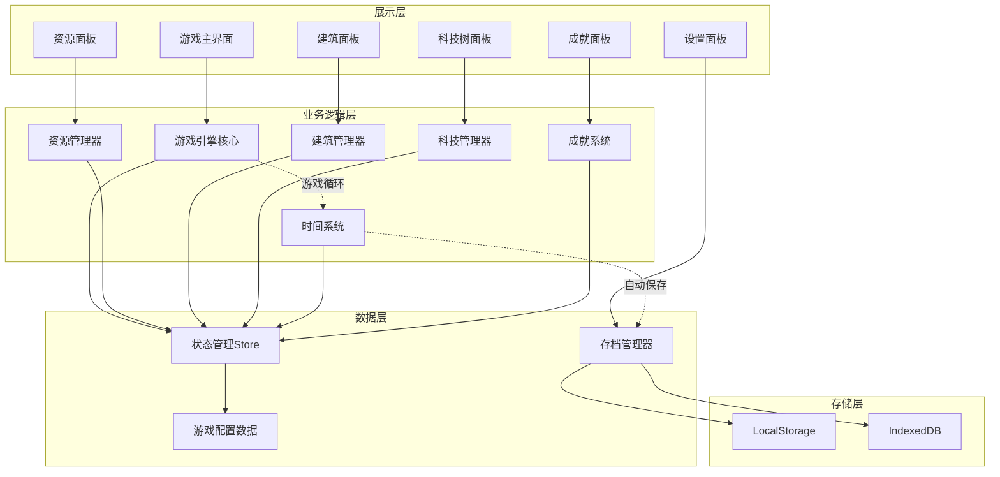

### 2.3 核心模块职责

| 模块名称     | 核心职责                                     |
| ------------ | -------------------------------------------- |
| 游戏引擎核心 | 驱动游戏循环,协调各系统,处理游戏主逻辑       |
| 资源管理器   | 管理所有资源的产出、消耗、存储上限           |
| 建筑管理器   | 处理建筑的建造、升级、拆除、产出计算         |
| 科技管理器   | 管理科技树解锁状态、研究进度、科技效果       |
| 时间系统     | 处理游戏时间流逝、离线时间计算、Tick 更新    |
| 成就系统     | 追踪玩家进度,解锁成就,发放奖励               |
| 存档管理器   | 游戏数据序列化、反序列化、自动保存、导入导出 |

## 3. 游戏时代划分

游戏分为八个主要时代,从原始文明一直发展到星际文明,每个时代拥有独特的建筑、科技和资源:


### 3.1 时代详细设计

| 时代     | 解锁条件       | 核心资源                      | 代表性建筑                 | 游戏目标     | 预计耗时 |
| -------- | -------------- | ----------------------------- | -------------------------- | ------------ | -------- |
| 石器时代 | 游戏开始       | 食物、木材、石头              | 营地、采集站、狩猎场       | 生存与繁衍   | 2-3 天   |
| 青铜时代 | 人口达到 50    | +铜矿、黏土                   | 农田、矿场、作坊           | 建立农业社会 | 3-4 天   |
| 铁器时代 | 研究"冶铁术"   | +铁矿、煤炭                   | 铁匠铺、兵营、市场         | 军事与贸易   | 4-5 天   |
| 工业时代 | 研究"蒸汽机"   | +石油、钢铁                   | 工厂、发电厂、实验室       | 工业化生产   | 4-5 天   |
| 信息时代 | 研究"计算机"   | +芯片、数据                   | 数据中心、研究所、太空港   | 科技突破     | 3-4 天   |
| 太空时代 | 建造"太空港"   | +火箭燃料、合金、氦-3         | 轨道站、月球基地、火星前哨 | 太阳系开发   | 5-6 天   |
| 星际时代 | 研究"曲速引擎" | +反物质、暗物质、外星矿石     | 星际飞船、殖民星球、戴森球 | 星际殖民     | 5-6 天   |
| 超维时代 | 建造"戴森球"   | +量子能量、时空晶体、维度碎片 | 维度门、虫洞网络、宇宙奇点 | 宇宙主宰     | 3-4 天   |

## 4. 资源系统设计

### 4.1 资源分类

资源分为基础资源、中级资源、高级资源、太空资源、星际资源和特殊资源六大类:

| 资源类别     | 资源名称 | 获取方式             | 主要用途               | 解锁时代 |
| ------------ | -------- | -------------------- | ---------------------- | -------- |
| **基础资源** | 食物     | 采集站、农田         | 维持人口、建筑升级     | 石器时代 |
|              | 木材     | 伐木场               | 建造建筑、工具制作     | 石器时代 |
|              | 石头     | 采石场               | 建造建筑、道路         | 石器时代 |
| **中级资源** | 铜矿     | 铜矿场               | 工具制作、建筑材料     | 青铜时代 |
|              | 铁矿     | 铁矿场               | 武器制作、高级建筑     | 铁器时代 |
|              | 煤炭     | 煤矿                 | 燃料、冶炼             | 铁器时代 |
|              | 黏土     | 黏土坑               | 陶器、砖块制作         | 青铜时代 |
| **高级资源** | 钢铁     | 炼钢厂               | 工业建筑、机械         | 工业时代 |
|              | 石油     | 油井                 | 能源、化工原料         | 工业时代 |
|              | 电力     | 发电厂               | 驱动工业设备           | 工业时代 |
|              | 芯片     | 芯片厂               | 计算机、电子设备       | 信息时代 |
|              | 数据     | 数据中心             | AI 研发、科技突破      | 信息时代 |
| **太空资源** | 火箭燃料 | 燃料炼制厂           | 发射航天器             | 太空时代 |
|              | 合金     | 合金铸造厂           | 太空设备制造           | 太空时代 |
|              | 氦-3     | 月球采矿场           | 核聚变燃料             | 太空时代 |
|              | 铛矿石   | 火星矿场             | 稀有金属提取           | 太空时代 |
|              | 氢气     | 木星大气采集器       | 燃料补给               | 太空时代 |
| **星际资源** | 反物质   | 反物质生产器         | 曲速引擎燃料           | 星际时代 |
|              | 暗物质   | 暗物质捕捉器         | 高级能源核心           | 星际时代 |
|              | 外星矿石 | 外星挙居地           | 特殊建筑材料           | 星际时代 |
|              | 生物质   | 外星生物圈           | 生物科技研究           | 星际时代 |
|              | 星尘     | 星云采集船           | 纳米材料合成           | 星际时代 |
| **超维资源** | 量子能量 | 量子发电站           | 维度设备驱动           | 超维时代 |
|              | 时空晶体 | 时空稳定器           | 虫洞建造               | 超维时代 |
|              | 维度碎片 | 维度采集器           | 宇宙奇点升级           | 超维时代 |
|              | 奇点能量 | 宇宙奇点             | 终极科技研究           | 超维时代 |
| **特殊资源** | 黄金     | 金矿、贸易           | 加速建造、购买特殊物品 | 铁器时代 |
|              | 知识点   | 图书馆、学校、研究所 | 研究科技               | 青铜时代 |
|              | 文化值   | 神殿、剧院           | 解锁特殊建筑           | 铁器时代 |
|              | 声望值   | 奇观建筑             | 解锁隐藏内容           | 各时代   |

### 4.2 资源产出机制

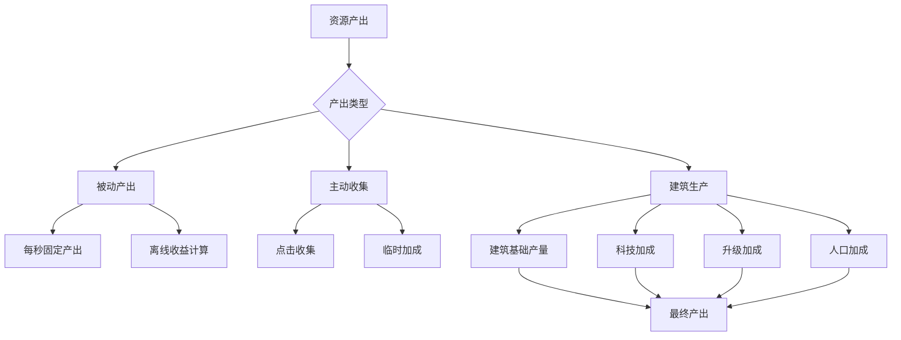

### 4.3 资源存储机制

每种资源都有存储上限,通过建造仓库类建筑提升上限:

| 仓库类型 | 提升资源     | 基础容量 | 每级增加 |
| -------- | ------------ | -------- | -------- |
| 粮仓     | 食物         | 1000     | +500     |
| 木材仓库 | 木材         | 800      | +400     |
| 石料仓库 | 石头         | 800      | +400     |
| 矿石仓库 | 铜矿、铁矿   | 500      | +300     |
| 资源中心 | 所有基础资源 | +50%     | +10%每级 |

## 5. 建筑系统设计

### 5.1 建筑分类

建筑按功能分为六大类:

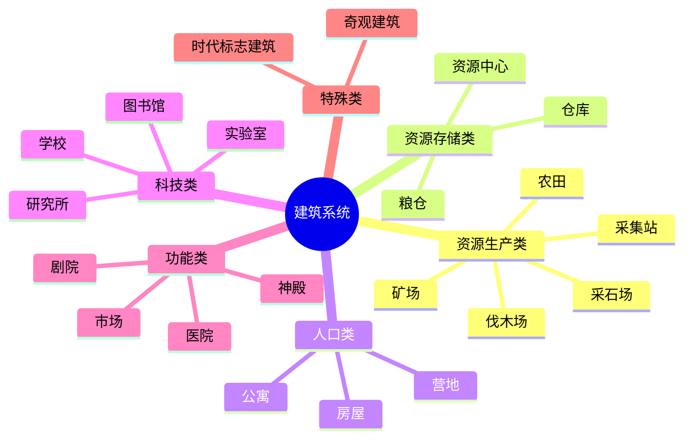

### 5.2 建筑数据模型

每个建筑包含以下属性:

| 属性名称     | 数据类型 | 说明                                    |
| ------------ | -------- | --------------------------------------- |
| id           | 字符串   | 唯一标识符                              |
| name         | 字符串   | 建筑名称                                |
| description  | 字符串   | 建筑描述                                |
| type         | 枚举     | 建筑类型(生产/存储/人口/科技/功能/特殊) |
| era          | 枚举     | 所属时代                                |
| level        | 数字     | 当前等级                                |
| maxLevel     | 数字     | 最大等级                                |
| buildCost    | 对象     | 建造所需资源 {resourceType: amount}     |
| upgradeCost  | 对象     | 升级所需资源(按等级计算)                |
| buildTime    | 数字     | 建造时间(秒)                            |
| upgradeTime  | 数字     | 升级时间(秒)                            |
| production   | 对象     | 生产的资源类型和数量/秒                 |
| consumption  | 对象     | 消耗的资源类型和数量/秒                 |
| capacity     | 对象     | 提供的存储容量                          |
| population   | 数字     | 提供的人口上限                          |
| requirements | 数组     | 解锁条件(科技/建筑/时代)                |
| effects      | 数组     | 特殊效果(加成、解锁等)                  |

### 5.3 核心建筑示例

#### 石器时代建筑

| 建筑名称 | 建造成本           | 生产效率    | 特殊效果       |
| -------- | ------------------ | ----------- | -------------- |
| 营地     | 木材 ×10           | -           | 提供人口上限+5 |
| 采集站   | 木材 ×20, 石头 ×10 | 食物+2/秒   | 可升级至 Lv.5  |
| 伐木场   | 石头 ×15           | 木材+1/秒   | -              |
| 采石场   | 木材 ×15           | 石头+0.8/秒 | -              |
| 篝火     | 木材 ×5, 石头 ×5   | -           | 食物消耗-10%   |

#### 青铜时代建筑

| 建筑名称 | 建造成本                      | 生产效率  | 解锁条件      |
| -------- | ----------------------------- | --------- | ------------- |
| 农田     | 木材 ×50, 石头 ×30            | 食物+5/秒 | 研究"农业"    |
| 铜矿场   | 木材 ×60, 石头 ×40            | 铜矿+1/秒 | 研究"采矿"    |
| 作坊     | 木材 ×80, 铜矿 ×20            | -         | 解锁工具制作  |
| 房屋     | 木材 ×100, 石头 ×50, 黏土 ×30 | -         | 人口上限+20   |
| 粮仓     | 木材 ×70, 石头 ×50            | -         | 食物储存+1000 |

#### 铁器时代建筑

| 建筑名称 | 建造成本                        | 生产效率    | 解锁条件     |
| -------- | ------------------------------- | ----------- | ------------ |
| 铁矿场   | 木材 ×100, 石头 ×80, 铜矿 ×50   | 铁矿+2/秒   | 研究"冶铁术" |
| 铁匠铺   | 石头 ×150, 铁矿 ×100            | -           | 工具效率+25% |
| 兵营     | 石头 ×200, 铁矿 ×150, 木材 ×100 | -           | 解锁军事系统 |
| 市场     | 木材 ×180, 石头 ×120, 铜矿 ×80  | 黄金+0.5/秒 | 研究"贸易"   |
| 图书馆   | 木材 ×200, 石头 ×150, 铜矿 ×100 | 知识点+1/秒 | 研究"文字"   |

#### 太空时代建筑

| 建筑名称     | 建造成本                           | 生产效率      | 解锁条件         | 建造时间 |
| ------------ | ---------------------------------- | ------------- | ---------------- | -------- |
| 太空港       | 钢铁 ×5000, 电力 ×3000, 芯片 ×1000 | -             | 研究"火箭技术"   | 4 小时   |
| 轨道站       | 合金 ×2000, 火箭燃料 ×1000         | -             | 建造太空港       | 6 小时   |
| 月球基地     | 合金 ×8000, 钢铁 ×5000             | 氦-3+10/秒    | 研究"月球登陆"   | 12 小时  |
| 火星前哨     | 合金 ×20000, 火箭燃料 ×10000       | 铛矿石+5/秒   | 研究"星际航行"   | 24 小时  |
| 木星大气站   | 合金 ×50000, 反物质 ×1000          | 氢气+20/秒    | 研究"深空探索"   | 36 小时  |
| 小行星带矿场 | 合金 ×30000, 机器人 ×5000          | 稀有金属+8/秒 | 研究"自动化采矿" | 48 小时  |

#### 星际时代建筑

| 建筑名称     | 建造成本                       | 生产效率      | 解锁条件         | 建造时间 |
| ------------ | ------------------------------ | ------------- | ---------------- | -------- |
| 曲速引擎厂   | 反物质 ×10000, 氦-3×50000      | 曲速燃料+2/秒 | 研究"曲速引擎"   | 72 小时  |
| 星际飞船厂   | 合金 ×100000, 曲速燃料 ×20000  | -             | 建造曲速引擎厂   | 96 小时  |
| 殖民星球 A   | 合金 ×500000, 生物质 ×100000   | 全资源+50/秒  | 研究"星球改造"   | 120 小时 |
| 戴森球(小型) | 外星矿石 ×200000, 星尘 ×100000 | 能量+1000/秒  | 研究"戴森球理论" | 168 小时 |
| 暗物质捕捉器 | 反物质 ×50000, 量子芯片 ×20000 | 暗物质+1/秒   | 研究"暗物质理论" | 144 小时 |
| 外星生物圈   | 生物质 ×80000, 氢气 ×50000     | 生物质+10/秒  | 研稆"外星生命"   | 120 小时 |

#### 超维时代建筑

| 建筑名称     | 建造成本                          | 生产效率        | 解锁条件       | 建造时间        |
| ------------ | --------------------------------- | --------------- | -------------- | --------------- |
| 量子发电站   | 戴森球能量 ×100000                | 量子能量+100/秒 | 建造戴森球     | 240 小时        |
| 维度采集器   | 量子能量 ×50000, 暗物质 ×20000    | 维度碎片+5/秒   | 研究"维度穿越" | 288 小时        |
| 虫洞网络     | 时空晶体 ×100000, 维度碎片 ×50000 | -               | 研究"虫洞技术" | 336 小时        |
| 宇宙奇点     | 所有资源 ×1000000                 | 奇点能量+1/秒   | 建造虫洞网络   | 480 小时        |
| 维度门       | 维度碎片 ×200000, 奇点能量 ×10000 | -               | 研究"多维空间" | 360 小时        |
| 戴森球(大型) | 各类资源总计 10 亿                | 包裹整个恒星系  | 所有科技       | 720 小时(30 天) |

### 5.4 建筑升级机制

建筑升级遵循以下规则:

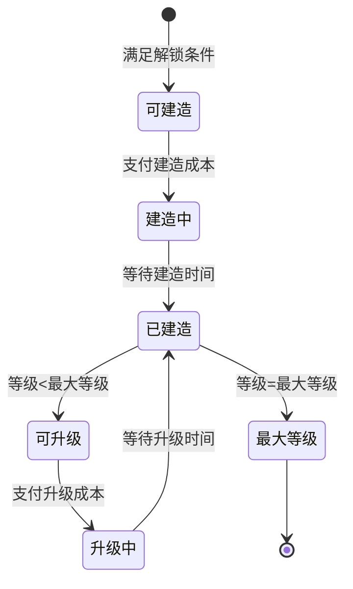

**升级成本计算公式** (拉长游戏时长优化):

- 资源成本 = 基础成本 × (2.0 ^ 当前等级) × 时代系数
- 升级时间 = 基础时间 × (1.8 ^ 当前等级) × 时代系数
- 时代系数: 石器(1.0) → 青铜(1.5) → 铁器(2.0) → 工业(3.0) → 信息(4.0) → 太空(6.0) → 星际(10.0) → 超维(15.0)

**升级效果计算公式**:

- 产出提升 = 基础产出 × (1 + 0.15 × 当前等级)
- 存储提升 = 基础存储 × (1 + 0.12 × 当前等级)

**建筑最大等级设定**:

- 早期建筑: Lv.10
- 中期建筑: Lv.15
- 后期建筑: Lv.20
- 星际建筑: Lv.30
- 终极建筑: Lv.50

## 6. 科技树系统

### 6.1 科技树结构

科技树采用分支式设计,每个时代有独立的科技分支:

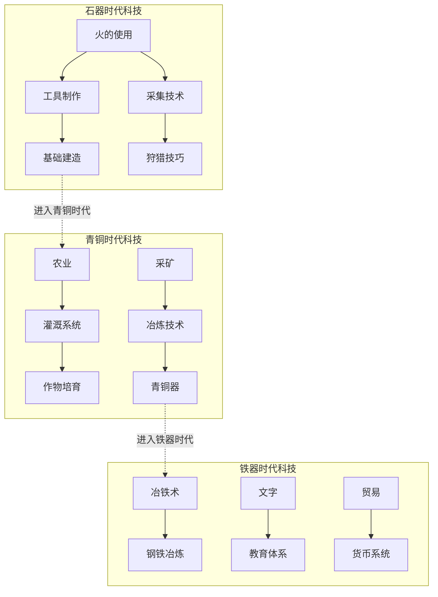

### 6.2 科技数据模型

| 属性名称      | 数据类型 | 说明                       |
| ------------- | -------- | -------------------------- |
| id            | 字符串   | 科技唯一标识               |
| name          | 字符串   | 科技名称                   |
| description   | 字符串   | 科技效果描述               |
| era           | 枚举     | 所属时代                   |
| category      | 枚举     | 分类(生产/军事/文化/经济)  |
| researchCost  | 对象     | 研究所需资源(通常为知识点) |
| researchTime  | 数字     | 研究时间(秒)               |
| prerequisites | 数组     | 前置科技要求               |
| effects       | 数组     | 科技效果列表               |
| unlocks       | 数组     | 解锁的建筑/功能            |

### 6.3 核心科技列表

#### 石器时代科技

| 科技名称 | 研究成本   | 研究时间 | 科技效果                  |
| -------- | ---------- | -------- | ------------------------- |
| 火的使用 | 知识点 ×10 | 30 秒    | 解锁篝火,食物消耗-10%     |
| 工具制作 | 知识点 ×20 | 60 秒    | 资源采集效率+15%          |
| 采集技术 | 知识点 ×25 | 90 秒    | 采集站产出+20%            |
| 基础建造 | 知识点 ×30 | 120 秒   | 解锁更多建筑,建造时间-10% |
| 狩猎技巧 | 知识点 ×35 | 150 秒   | 食物产出+25%              |

#### 青铜时代科技

| 科技名称 | 研究成本    | 前置科技 | 科技效果                  |
| -------- | ----------- | -------- | ------------------------- |
| 农业     | 知识点 ×100 | 采集技术 | 解锁农田,食物产出+50%     |
| 采矿     | 知识点 ×120 | 工具制作 | 解锁矿场,开启矿产资源     |
| 冶炼技术 | 知识点 ×150 | 采矿     | 解锁作坊,可生产铜器       |
| 灌溉系统 | 知识点 ×180 | 农业     | 农田产出+30%              |
| 畜牧业   | 知识点 ×200 | 农业     | 食物产出+40%,人口增长+20% |

#### 铁器时代科技

| 科技名称 | 研究成本    | 前置科技 | 科技效果                  |
| -------- | ----------- | -------- | ------------------------- |
| 冶铁术   | 知识点 ×500 | 冶炼技术 | 解锁铁器建筑,进入铁器时代 |
| 文字     | 知识点 ×600 | -        | 解锁图书馆,知识点产出+50% |
| 贸易     | 知识点 ×700 | -        | 解锁市场,开启黄金资源     |
| 钢铁冶炼 | 知识点 ×800 | 冶铁术   | 解锁钢铁资源,建筑耐久+50% |
| 教育体系 | 知识点 ×900 | 文字     | 解锁学校,知识点产出+100%  |

#### 太空时代科技

| 科技名称   | 研究成本       | 研究时间 | 科技效果                |
| ---------- | -------------- | -------- | ----------------------- |
| 火箭技术   | 知识点 ×20000  | 12 小时  | 解锁太空港,进入太空时代 |
| 月球登陆   | 知识点 ×50000  | 24 小时  | 解锁月球基地,氦-3 资源  |
| 星际航行   | 知识点 ×100000 | 48 小时  | 解锁火星前哨            |
| 深空探索   | 知识点 ×200000 | 72 小时  | 解锁木星大气站          |
| 自动化采矿 | 知识点 ×300000 | 96 小时  | 解锁小行星带矿场        |

#### 星际时代科技

| 科技名称   | 研究成本        | 研究时间 | 科技效果                |
| ---------- | --------------- | -------- | ----------------------- |
| 曲速引擎   | 知识点 ×1000000 | 120 小时 | 进入星际时代,跨星系旅行 |
| 星球改造   | 知识点 ×2000000 | 168 小时 | 解锁殖民星球            |
| 戴森球理论 | 知识点 ×3000000 | 240 小时 | 解锁戴森球建造          |
| 暗物质理论 | 知识点 ×5000000 | 288 小时 | 解锁暗物质资源          |
| 外星生命   | 知识点 ×4000000 | 216 小时 | 解锁生物圈              |

#### 超维时代科技

| 科技名称     | 研究成本         | 研究时间 | 科技效果                    |
| ------------ | ---------------- | -------- | --------------------------- |
| 维度穿越     | 知识点 ×10000000 | 360 小时 | 进入超维时代,解锁维度采集器 |
| 虫洞技术     | 知识点 ×20000000 | 480 小时 | 解锁虫洞网络,瞬移系统       |
| 多维空间     | 知识点 ×30000000 | 600 小时 | 解锁维度门                  |
| 宇宙奇点理论 | 知识点 ×50000000 | 720 小时 | 解锁宇宙奇点建造            |

### 6.4 科技研究流程

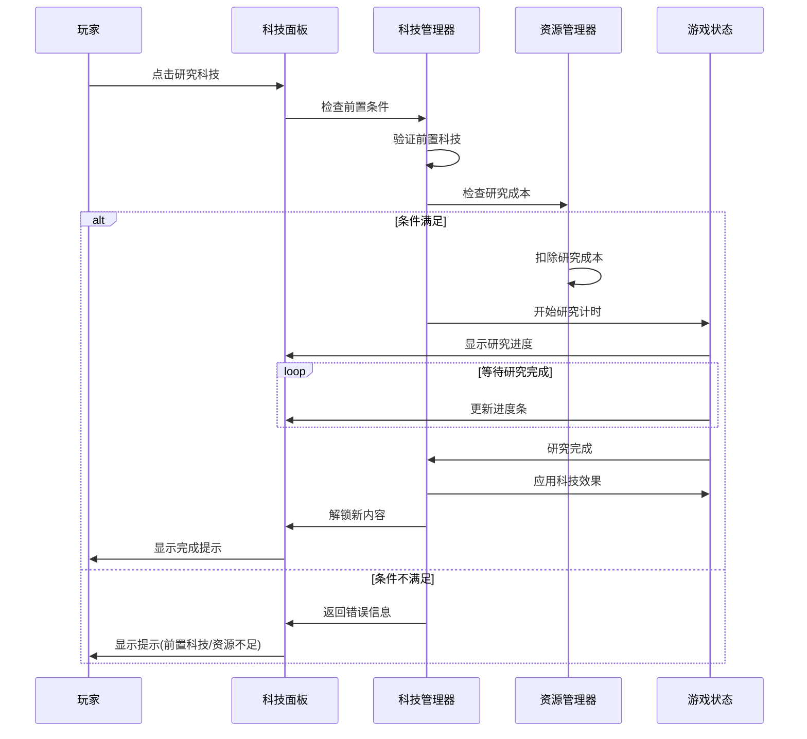

## 7. 游戏循环与时间系统

### 7.1 游戏主循环

游戏采用基于时间的 Tick 更新机制:

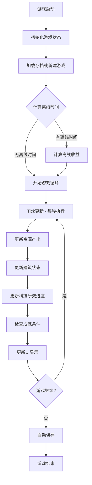

### 7.2 时间系统设计

| 功能模块     | 更新频率   | 处理内容                     |
| ------------ | ---------- | ---------------------------- |
| 核心游戏循环 | 每秒 1 次  | 资源产出、建筑生产、科技进度 |
| UI 刷新      | 每秒 2 次  | 资源数值显示、进度条更新     |
| 自动保存     | 每 30 秒   | 游戏状态持久化               |
| 成就检测     | 每 5 秒    | 检查成就解锁条件             |
| 离线收益计算 | 游戏启动时 | 计算玩家离线期间的资源产出   |

### 7.3 离线收益机制

当玩家离开游戏后,系统会记录离开时间,并在下次登录时计算离线收益:

**离线收益计算规则**:

- 离线时间 = 当前时间 - 上次保存时间
- 最大离线收益时间 = 24 小时(可通过科技延长)
- 离线收益 = 每秒产出 × 实际离线时间 × 离线效率系数

**离线效率系数**:

- 前 2 小时: 100%
- 2-8 小时: 75%
- 8-24 小时: 50%
- 超过 24 小时: 25%

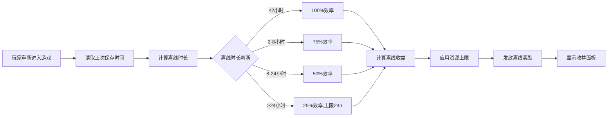

## 8. 人口系统

### 8.1 人口机制

人口是游戏中的重要资源,影响多个系统:

| 人口作用 | 影响说明                       |
| -------- | ------------------------------ |
| 劳动力   | 部分建筑需要人口才能运作       |
| 资源加成 | 人口越多,某些资源产出越高      |
| 消耗食物 | 每个人口单位每秒消耗一定食物   |
| 解锁条件 | 某些建筑和科技需要达到人口阈值 |

### 8.2 人口增长机制

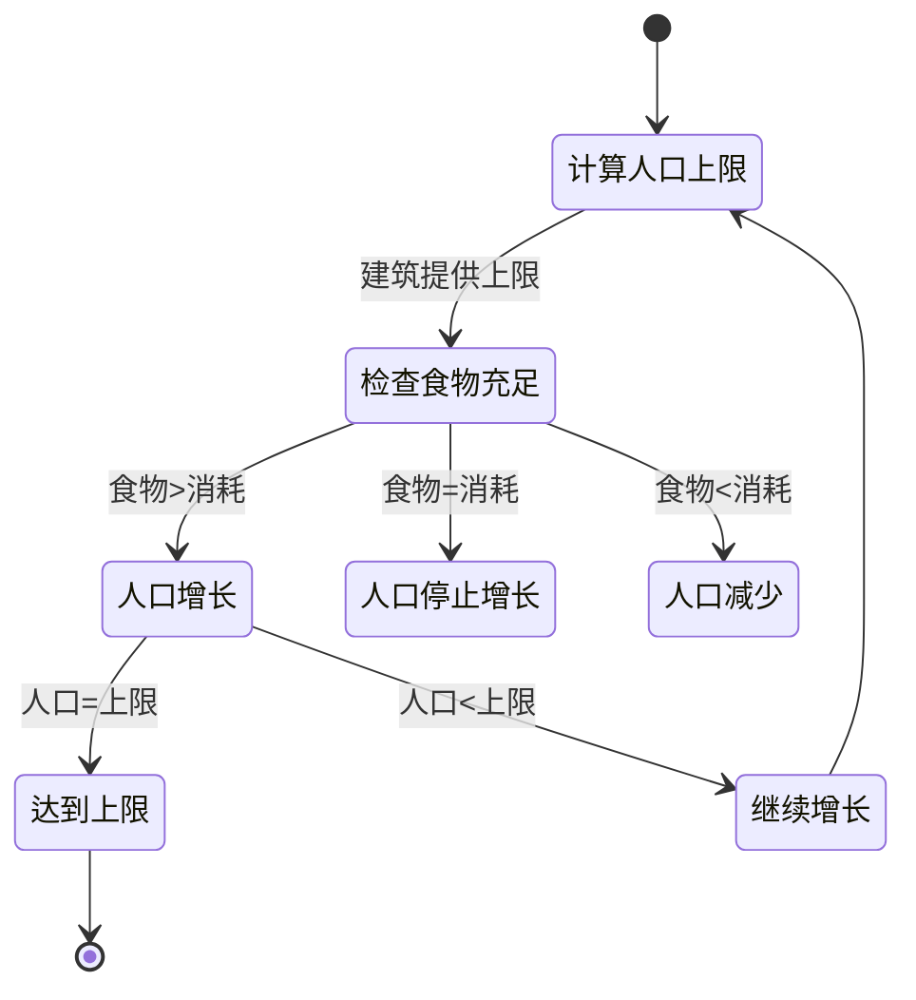

**人口增长公式**:

- 增长速度 = 基础增长率 × (1 + 食物盈余% / 100) × 科技加成
- 基础增长率 = 1 人口/60 秒
- 食物盈余% = (食物产出 - 食物消耗) / 食物消耗 × 100

**人口消耗**:

- 每个人口单位消耗 0.5 食物/秒
- 可通过科技减少消耗

### 8.3 人口上限提升

| 建筑类型    | 提供人口上限     | 备注              |
| ----------- | ---------------- | ----------------- |
| 营地(Lv1)   | 5                | 石器时代起始建筑  |
| 营地(Lv2-5) | 5 + 3×(等级-1)   | 每升 1 级+3 人口  |
| 房屋(Lv1)   | 20               | 青铜时代解锁      |
| 房屋(Lv2-5) | 20 + 5×(等级-1)  | 每升 1 级+5 人口  |
| 公寓(Lv1)   | 50               | 工业时代解锁      |
| 公寓(Lv2-5) | 50 + 15×(等级-1) | 每升 1 级+15 人口 |

## 9. 成就系统

### 9.1 成就分类

成就系统为玩家提供长期目标和额外奖励:

| 成就类别 | 成就示例                        | 奖励类型     |
| -------- | ------------------------------- | ------------ |
| 进度类   | "文明曙光"(进入青铜时代)        | 黄金 ×100    |
| 资源类   | "富甲一方"(累计获得 10000 黄金) | 资源产出+5%  |
| 建筑类   | "建筑大师"(建造 50 个建筑)      | 建造时间-10% |
| 科技类   | "科技先锋"(研究 30 项科技)      | 研究时间-15% |
| 人口类   | "人口大国"(人口达到 1000)       | 人口上限+10% |
| 特殊类   | "速通者"(1 小时内进入铁器时代)  | 特殊称号     |

### 9.2 核心成就列表

#### 新手成就

| 成就名称 | 解锁条件               | 奖励         |
| -------- | ---------------------- | ------------ |
| 第一步   | 建造第一个建筑         | 知识点 ×10   |
| 研究者   | 研究第一项科技         | 所有资源 ×50 |
| 扩张     | 人口达到 10            | 黄金 ×20     |
| 资源大亨 | 拥有 1000 单位任意资源 | 仓库容量+10% |

#### 进阶成就

| 成就名称 | 解锁条件     | 奖励                      |
| -------- | ------------ | ------------------------- |
| 文明曙光 | 进入青铜时代 | 黄金 ×100, 知识点 ×50     |
| 铁血之路 | 进入铁器时代 | 黄金 ×500, 全资源产出+5%  |
| 工业革命 | 进入工业时代 | 黄金 ×2000, 建造速度+10%  |
| 信息爆炸 | 进入信息时代 | 黄金 ×10000, 研究速度+15% |

#### 挑战成就

| 成就名称 | 解锁条件                   | 奖励                   |
| -------- | -------------------------- | ---------------------- |
| 完美平衡 | 同时拥有 10 种资源各 1000+ | 永久资源产出+10%       |
| 建造狂魔 | 拥有 100 个建筑            | 建造成本-5%            |
| 学者     | 研究所有科技               | 特殊建筑"世界奇观"解锁 |
| 人口爆炸 | 人口达到 10000             | 人口消耗-20%           |

### 9.3 成就奖励机制

成就奖励分为三种类型:

**即时奖励**:

- 资源奖励(黄金、知识点等)
- 直接发放到玩家资源池

**永久加成**:

- 资源产出加成
- 建造/研究时间减少
- 存储上限提升
- 永久生效,可叠加

**解锁内容**:

- 特殊建筑
- 隐藏科技
- 游戏功能(如加速券)

## 10. 存档系统

### 10.1 存档数据结构

游戏存档包含以下核心数据:

| 数据模块   | 存储内容                         | 存储位置     |
| ---------- | -------------------------------- | ------------ |
| 游戏元信息 | 存档版本、创建时间、最后保存时间 | LocalStorage |
| 玩家进度   | 当前时代、游戏时长、成就完成度   | LocalStorage |
| 资源数据   | 各类资源的当前数量               | LocalStorage |
| 建筑数据   | 已建造建筑列表、等级、状态       | IndexedDB    |
| 科技数据   | 已研究科技列表、研究中的科技进度 | LocalStorage |
| 成就数据   | 已解锁成就、进度追踪             | IndexedDB    |
| 设置数据   | 音效、画质、通知等用户设置       | LocalStorage |

### 10.2 自动保存机制

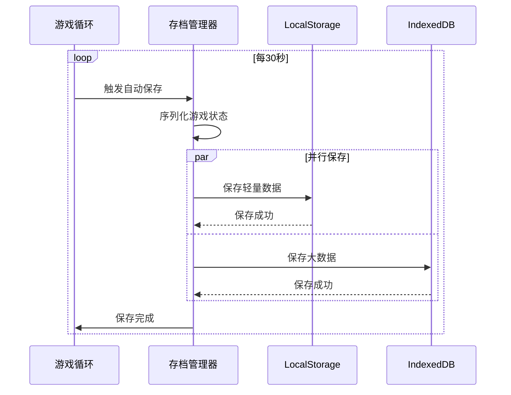

### 10.3 存档管理功能

| 功能         | 说明                   | 实现方式        |
| ------------ | ---------------------- | --------------- |
| 自动保存     | 每 30 秒自动保存一次   | 定时器触发      |
| 手动保存     | 玩家可随时手动保存     | 按钮触发        |
| 多存档槽     | 支持 3 个独立存档位    | 不同 key 存储   |
| 导出存档     | 导出为 JSON 文件       | Blob 下载       |
| 导入存档     | 从 JSON 文件恢复       | FileReader 读取 |
| 删除存档     | 清除指定存档数据       | 清空对应 key    |
| 云同步(可选) | 同步到云端(需后端支持) | 未来扩展        |

### 10.4 存档兼容性处理

当游戏版本更新时,需要处理存档兼容性:

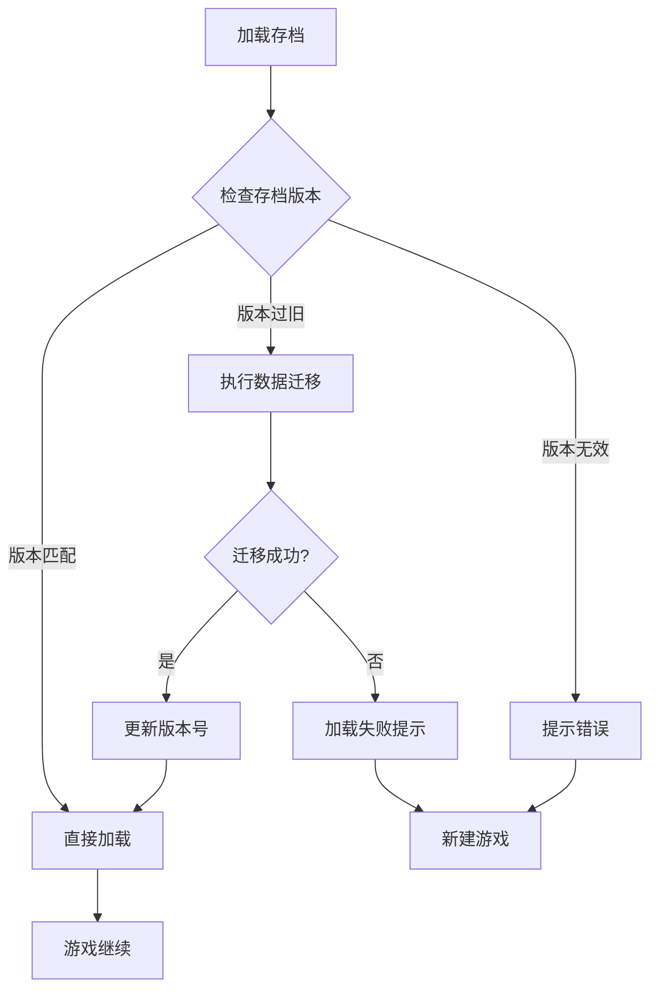

**版本迁移策略**:

- 维护版本迁移函数映射表
- 逐版本升级(如 1.0→1.1→1.2)
- 添加默认值处理新增字段
- 删除废弃字段
- 记录迁移日志

## 11. 用户界面设计

### 11.1 主界面布局

游戏主界面采用经典的多面板布局:

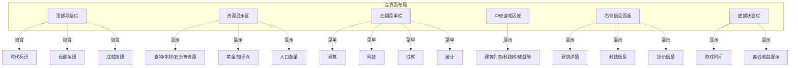

### 11.2 核心页面结构

#### 建筑页面

展示所有可建造建筑,按时代和类型分类:

| 区域     | 显示内容                               |
| -------- | -------------------------------------- |
| 分类标签 | 资源生产、存储、人口、科技、功能、特殊 |
| 建筑卡片 | 建筑图标、名称、等级、产出信息         |
| 建造按钮 | 显示成本,点击建造                      |
| 升级按钮 | 已建造建筑显示升级选项                 |
| 状态指示 | 建造中/升级中显示进度条                |
| 锁定状态 | 未解锁建筑显示解锁条件                 |

#### 科技树页面

以树状图展示科技研究路径:

| 元素     | 显示方式                               |
| -------- | -------------------------------------- |
| 科技节点 | 圆形/方形卡片,显示图标和名称           |
| 连接线   | 展示前置科技依赖关系                   |
| 状态颜色 | 已研究(绿色)、可研究(蓝色)、锁定(灰色) |
| 悬浮提示 | 显示科技详情、成本、效果               |
| 研究按钮 | 可研究的科技显示研究按钮               |
| 进度条   | 研究中的科技显示进度                   |

#### 成就页面

网格式展示所有成就:

| 元素     | 显示内容                  |
| -------- | ------------------------- |
| 成就图标 | 未解锁为灰色,已解锁为彩色 |
| 成就名称 | 简短标题                  |
| 完成进度 | 进度条显示(如 50/100)     |
| 奖励预览 | 显示可获得的奖励          |
| 解锁提示 | 弹窗动画提示新成就解锁    |

### 11.3 交互设计要点

| 交互场景 | 设计原则                           |
| -------- | ---------------------------------- |
| 建造建筑 | 点击确认,显示倒计时,可取消         |
| 研究科技 | 显示前置条件,资源不足时禁用按钮    |
| 资源不足 | 红色高亮提示,显示缺少数量          |
| 离线收益 | 弹窗展示,带动画效果                |
| 成就解锁 | 顶部横幅通知,可点击查看详情        |
| 建筑升级 | 右键或长按显示升级菜单             |
| 快捷操作 | 支持快捷键(B-建筑, T-科技, A-成就) |

### 11.4 响应式设计

游戏需适配不同屏幕尺寸:

| 设备类型 | 屏幕宽度   | 布局调整           |
| -------- | ---------- | ------------------ |
| 桌面端   | ≥1024px    | 完整三栏布局       |
| 平板     | 768-1023px | 右侧面板收起为浮层 |
| 手机横屏 | 568-767px  | 底部标签切换面板   |
| 手机竖屏 | <568px     | 单页全屏,顶部切换  |

## 12. 游戏平衡性设计

### 12.1 资源平衡

确保各资源在不同时代都有意义:


### 12.2 游戏节奏控制

| 游戏阶段 | 预计时长   | 核心体验          | 设计目标         |
| -------- | ---------- | ----------------- | ---------------- |
| 新手期   | 0-10 分钟  | 频繁点击,快速反馈 | 建立核心循环认知 |
| 发展期   | 10-60 分钟 | 规划建造,研究科技 | 策略深度体现     |
| 中期     | 1-5 小时   | 优化布局,自动化   | 系统协同运作     |
| 后期     | 5 小时+    | 追求成就,完美主义 | 长期目标驱动     |

### 12.3 数值平衡原则

**建筑成本增长**:

- 早期建筑成本低,快速建造
- 中期建筑成本指数增长(1.5 倍)
- 后期建筑高成本,但高产出

**科技研究时间**:

- 石器时代:30 秒 - 3 分钟
- 青铜时代:3 分钟 - 10 分钟
- 铁器时代:10 分钟 - 30 分钟
- 工业时代:30 分钟 - 2 小时
- 信息时代:2 小时 - 6 小时

**资源产出比**:

- 基础资源产出为消耗的 1.5-2 倍(保证盈余)
- 高级资源需要多种基础资源合成
- 人口食物消耗占食物总产出的 30-50%

## 13. 组件架构设计

### 13.1 核心组件层次

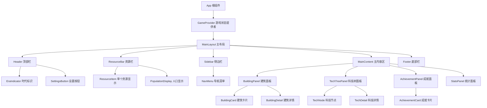

### 13.2 状态管理架构

采用 Pinia 进行状态管理,按模块划分 Store:

| Store 名称          | 管理状态                         | 核心方法                                       |
| ------------------- | -------------------------------- | ---------------------------------------------- |
| useGameStore        | 游戏全局状态、当前时代、游戏时间 | startGame, pauseGame, updateTime               |
| useResourceStore    | 所有资源数量、存储上限           | addResource, consumeResource, updateProduction |
| useBuildingStore    | 已建造建筑列表、建造队列         | buildBuilding, upgradeBuilding, cancelBuild    |
| useTechStore        | 已研究科技、研究中科技           | researchTech, completeTech, cancelResearch     |
| useAchievementStore | 成就解锁状态、进度追踪           | checkAchievements, unlockAchievement           |
| useSaveStore        | 存档管理                         | saveGame, loadGame, exportSave, importSave     |

### 13.3 数据流设计

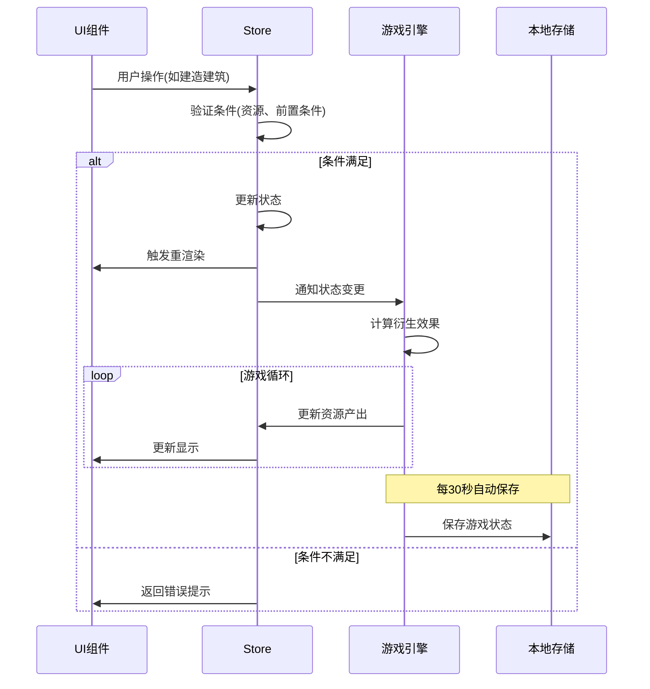

## 14. 游戏配置数据设计

所有游戏数值配置应独立于代码,便于调整平衡性。

### 14.1 配置文件结构

建议将配置按类型分为多个 JSON 文件:

| 配置文件          | 内容                               |
| ----------------- | ---------------------------------- |
| resources.json    | 所有资源定义、初始值、图标         |
| buildings.json    | 所有建筑数据、成本、产出           |
| technologies.json | 科技树定义、前置条件、效果         |
| achievements.json | 成就列表、解锁条件、奖励           |
| eras.json         | 时代定义、解锁条件                 |
| constants.json    | 全局常量(离线收益系数、成长曲线等) |

### 14.2 配置热更新机制

设计配置加载器,支持动态加载和热更新:

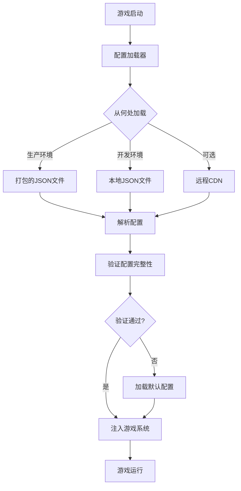

## 15. 性能优化策略

### 15.1 渲染优化

| 优化策略   | 实现方式                       | 效果             |
| ---------- | ------------------------------ | ---------------- |
| 虚拟滚动   | 建筑/成就列表使用虚拟滚动      | 减少 DOM 节点    |
| 组件懒加载 | Vue 异步组件动态导入面板组件   | 减少初始加载时间 |
| 防抖节流   | 资源数值变化使用节流更新 UI    | 减少重渲染次数   |
| 缓存优化   | computed 计算属性缓存结果      | 避免无效重计算   |
| 批量更新   | 资源变化批量提交到 Pinia Store | 减少状态更新次数 |

### 15.2 数据优化

| 优化策略 | 实现方式                   |
| -------- | -------------------------- |
| 增量保存 | 只保存变化的数据,而非全量  |
| 压缩存储 | 使用 LZ-string 压缩存档    |
| 索引优化 | IndexedDB 使用索引加速查询 |
| 缓存计算 | 缓存复杂计算结果(如总产出) |
| 延迟计算 | 非关键数据延迟到需要时计算 |

### 15.3 游戏循环优化

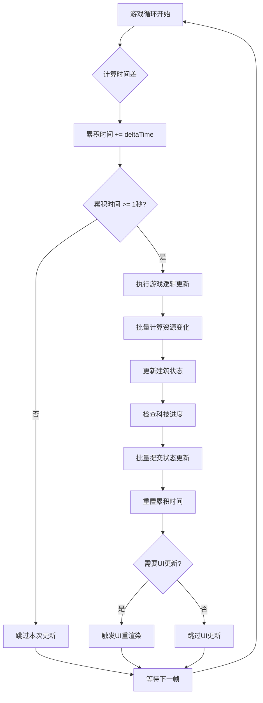

**优化要点**:

- 使用 requestAnimationFrame 而非 setInterval
- 计算资源变化时批量处理,避免逐个更新
- UI 更新频率低于游戏逻辑更新(如逻辑 60fps,UI 30fps)
- 非可见面板不进行渲染更新

## 16. 可扩展性设计

### 16.1 模块化设计原则

游戏系统设计遵循模块化原则,便于后续扩展:

| 扩展点 | 扩展方式          | 示例                  |
| ------ | ----------------- | --------------------- |
| 新时代 | 添加时代配置      | 未来时代、魔法时代    |
| 新资源 | 扩展资源类型枚举  | 稀有资源、魔法能量    |
| 新建筑 | 添加建筑配置 JSON | 特殊奇观、隐藏建筑    |
| 新科技 | 扩展科技树分支    | 独立科技线(军事/文化) |
| 新系统 | 插件式系统注册    | 战斗系统、贸易系统    |
| 新成就 | 添加成就配置      | 限时成就、隐藏成就    |

### 16.2 插件系统设计

预留插件接口,支持功能模块化扩展:

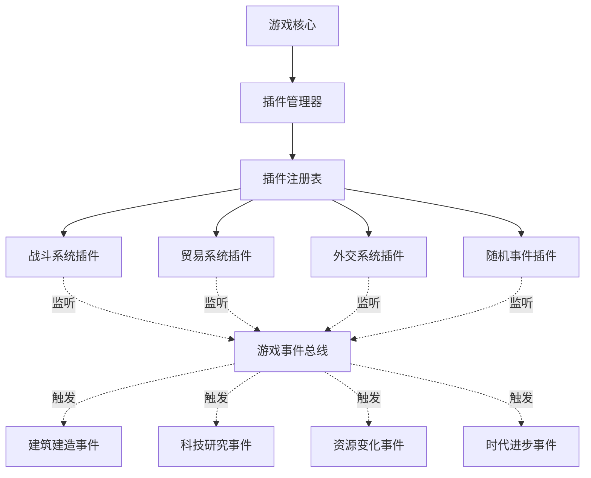

### 16.3 事件系统

设计事件总线,解耦系统间通信:

| 事件类型             | 触发时机     | 监听者             |
| -------------------- | ------------ | ------------------ |
| BUILDING_BUILT       | 建筑建造完成 | 成就系统、统计系统 |
| TECH_RESEARCHED      | 科技研究完成 | 建筑系统、资源系统 |
| ERA_CHANGED          | 时代变更     | UI 系统、音效系统  |
| RESOURCE_CHANGED     | 资源数量变化 | UI 系统、成就检测  |
| ACHIEVEMENT_UNLOCKED | 成就解锁     | 通知系统、存档系统 |
| GAME_SAVED           | 游戏保存     | 日志系统           |

## 17. 未来扩展方向

游戏设计预留以下扩展方向:

### 17.1 战斗系统(可选扩展)

| 功能模块 | 设计要点                 |
| -------- | ------------------------ |
| 军队招募 | 通过兵营建筑招募不同兵种 |
| 战斗机制 | 回合制或自动战斗         |
| 资源掠夺 | 战斗胜利获得资源奖励     |
| 防御工事 | 建造城墙、箭塔等防御建筑 |

### 17.2 贸易系统(可选扩展)

| 功能模块 | 设计要点             |
| -------- | -------------------- |
| 市场交易 | 资源之间的兑换       |
| 贸易路线 | 与 NPC 文明建立贸易  |
| 商队     | 派遣商队获取特殊资源 |
| 价格波动 | 资源价格动态变化     |

### 17.3 随机事件(可选扩展)

| 事件类型 | 效果示例              |
| -------- | --------------------- |
| 自然灾害 | 洪水导致食物减少      |
| 幸运事件 | 发现宝藏,获得黄金     |
| 疾病瘟疫 | 人口减少,需要医疗建筑 |
| 文化节日 | 文化值暴增            |

### 17.4 多人竞技(可选扩展)

虽然当前是纯前端游戏,但可预留多人对战的设计:

- 排行榜系统(需简单后端支持)
- 进度比拼(谁先达成目标)
- 异步 PVP(离线掠夺机制)

## 18. 测试策略

### 18.1 单元测试

重点测试核心计算逻辑:

| 测试模块 | 测试内容                     |
| -------- | ---------------------------- |
| 资源计算 | 产出计算、消耗计算、上限限制 |
| 建筑逻辑 | 建造条件检查、升级成本计算   |
| 科技系统 | 前置条件验证、效果应用       |
| 离线收益 | 时间计算、收益上限           |
| 存档系统 | 序列化、反序列化、版本迁移   |

### 18.2 集成测试

测试系统间协作:

| 测试场景 | 验证点                           |
| -------- | -------------------------------- |
| 建造建筑 | 资源扣除 → 建筑创建 → 产出生效   |
| 研究科技 | 知识点消耗 → 科技解锁 → 建筑解锁 |
| 成就解锁 | 条件达成 → 成就触发 → 奖励发放   |
| 时代进步 | 条件满足 → 时代切换 → 新内容解锁 |

### 18.3 平衡性测试

| 测试维度 | 测试方法                      |
| -------- | ----------------------------- |
| 游戏节奏 | 记录到达各时代的时间,确保合理 |
| 资源平衡 | 检查是否存在资源瓶颈或过剩    |
| 成就难度 | 统计成就解锁率,调整难度       |
| 离线收益 | 测试不同离线时长的收益合理性  |

## 19. 游戏时长与通关设计

### 19.1 预估游戏时长(一个月通关设计)

根据扩展后的内容量和数值平衡,游戏时长预估如下:

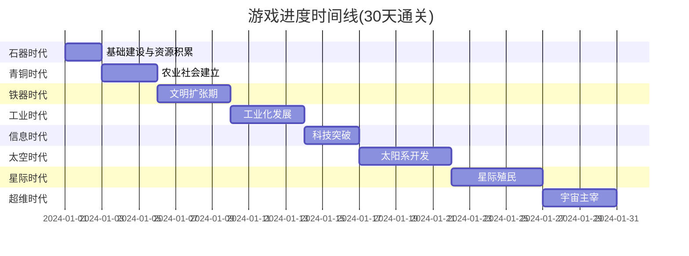

| 游戏阶段 | 预计时长     | 累计时长  | 主要目标                     | 日均在线时间         |
| -------- | ------------ | --------- | ---------------------------- | -------------------- |
| 石器时代 | 2-3 天       | 2 天      | 建立基础资源生产,人口达到 50 | 2-3 小时/天          |
| 青铜时代 | 3-4 天       | 5 天      | 发展农业,建立完整资源链      | 2-3 小时/天          |
| 铁器时代 | 4-5 天       | 10 天     | 建立贸易与知识体系           | 2-4 小时/天          |
| 工业时代 | 4-5 天       | 15 天     | 完成工业化,人口达到 5000     | 2-4 小时/天          |
| 信息时代 | 3-4 天       | 18 天     | 研究高级科技,建造太空港      | 2-3 小时/天          |
| 太空时代 | 5-6 天       | 24 天     | 开发太阳系,建立太空基地      | 3-5 小时/天          |
| 星际时代 | 5-6 天       | 30 天     | 星际殖民,建造戴森球          | 3-5 小时/天          |
| 超维时代 | 3-4 天       | 33 天     | 掌揧维度科技,成为宇宙主宰    | 4-6 小时/天          |
| **总计** | **30-33 天** | **30 天** | **完成主线通关**             | **平均 2-4 小时/天** |

**游戏时长设计理念**:

- 采用“离线+在线”结合模式
- 玩家每天仅阀 2-4 小时在线时间
- 剩余时间依靠离线收益积累
- 后期建筑需要数天建造,符合长线节奏

### 19.2 通关条件设计

游戏提供**多种通关方式**,玩家达成任一条件即可触发通关:

#### 主线通关条件

| 通关类型     | 达成条件                  | 难度  | 预计耗时 |
| ------------ | ------------------------- | ----- | -------- |
| **科技胜利** | 研究完所有科技(约 150 项) | ★★★★☆ | 28-30 天 |
| **星际主宰** | 建造大型戴森球            | ★★★★★ | 30-32 天 |
| **宇宙之心** | 建造宇宙奇点+维度门       | ★★★★★ | 30-33 天 |
| **资源大亨** | 累计所有资源达到 10 亿    | ★★★★☆ | 25-28 天 |
| **完美胜利** | 解锁所有成就(100%)        | ★★★★★ | 35-40 天 |

#### 通关奖励机制

```mermaid
graph TB
    A[达成通关条件] --> B[触发通关判定]
    B --> C[计算通关评分]
    C --> D[显示通关结算界面]

    D --> E[展示统计数据]
    D --> F[颁发通关称号]
    D --> G[解锁新游戏+模式]

    E --> E1[游戏总时长]
    E --> E2[资源产出总量]
    E --> E3[建筑建造数量]
    E --> E4[成就完成度]

    F --> F1[速通大师: <4小时通关]
    F --> F2[文明之父: 科技胜利]
    F --> F3[建筑奇才: 文明胜利]
    F --> F4[人口大国: 繁荣胜利]

    G --> G1[新游戏+: 保留部分科技加成]
    G --> G2[挑战模式: 资源产出减半]
    G --> G3[无尽模式: 无通关限制]
```

### 19.3 通关后内容

为提升游戏可重玩性,设计通关后内容:

| 模式           | 说明                        | 特色                  |
| -------------- | --------------------------- | --------------------- |
| **新游戏+**    | 继承 10%科技加成,重新开始   | 更快节奏,体验优化路线 |
| **挑战模式**   | 资源产出-50%,建造时间+50%   | 高难度,考验规划能力   |
| **无尽模式**   | 移除通关限制,持续发展       | 追求极限数值          |
| **速通模式**   | 计时挑战,排行榜(需简单后端) | 竞技性玩法            |
| **自定义规则** | 玩家自定义初始资源、科技等  | 沙盒式体验            |

### 19.4 时长调节机制

游戏提供难度/速度选项,适应不同玩家:

| 游戏速度 | 时间倍率 | 通关时长   | 适合玩家      |
| -------- | -------- | ---------- | ------------- |
| 休闲模式 | 0.5 倍   | 12-15 小时 | 慢节奏,重策略 |
| 标准模式 | 1 倍     | 5-6 小时   | 默认平衡      |
| 快速模式 | 2 倍     | 2.5-3 小时 | 快节奏,重操作 |
| 极速模式 | 4 倍     | 1-1.5 小时 | 速通挑战      |

**时间倍率影响**:

- 资源产出速度
- 建筑建造时间
- 科技研究时间
- 离线收益速度

### 19.5 游戏节奏曲线

```mermaid
graph LR
    A[0-15分钟<br/>快速成长期] -->|频繁反馈| B[15-60分钟<br/>策略规划期]
    B -->|深度玩法| C[1-3小时<br/>自动化过渡期]
    C -->|优化布局| D[3-5小时<br/>冲刺通关期]
    D -->|目标导向| E[5-6小时<br/>通关达成]
    E -->|可选| F[6小时+<br/>通关后内容]

    style A fill:#90EE90
    style B fill:#87CEEB
    style C fill:#DDA0DD
    style D fill:#FFB6C1
    style E fill:#FFD700
    style F fill:#FFA500
```

### 19.6 里程碑奖励

在游戏过程中设置里程碑,保持玩家动力:

| 里程碑   | 触发条件        | 奖励                          |
| -------- | --------------- | ----------------------------- |
| 文明起源 | 进入青铜时代    | 黄金 ×200 + 全资源 ×500       |
| 铁血之路 | 进入铁器时代    | 黄金 ×1000 + 永久建造速度+10% |
| 工业革命 | 进入工业时代    | 黄金 ×5000 + 永久资源产出+15% |
| 信息爆炸 | 进入信息时代    | 黄金 ×20000 + 解锁特殊建筑    |
| 半程英雄 | 游戏时长 3 小时 | 离线收益上限+12 小时          |
| 通关在望 | 完成 80%科技    | 知识点产出 ×2                 |

### 19.7 时长平衡调整建议

如需调整游戏时长,可从以下维度平衡:

**缩短游戏时长** (目标 3-4 小时通关):

- 减少科技总数(60 项 →40 项)
- 降低建筑建造时间(×0.7)
- 提高资源初始产出(×1.5)
- 减少时代解锁条件

**延长游戏时长** (目标 8-10 小时通关):

- 增加科技树分支(如军事、文化线)
- 提高后期建筑成本(×2)
- 添加更多建筑等级(Lv5→Lv10)
- 增加通关条件门槛

## 20. 详细开发计划

### 20.1 开发阶段总览

项目预计总开发时长:**12-16 周**(3-4 个月),按照 4 个主要阶段推进:

```mermaid
gantt
    title 项目开发甘特图
    dateFormat YYYY-MM-DD
    section 阶段一:核心框架
    项目初始化与架构搭建     :2024-01-01, 3d
    基础组件开发             :2024-01-04, 7d
    资源系统实现             :2024-01-11, 5d
    石器时代内容             :2024-01-16, 7d
    基础存档系统             :2024-01-23, 3d

    section 阶段二:系统完善
    科技树系统               :2024-01-26, 7d
    青铜/铁器时代内容        :2024-02-02, 10d
    建筑升级机制             :2024-02-12, 5d
    离线收益系统             :2024-02-17, 4d
    成就系统基础版           :2024-02-21, 4d

    section 阶段三:内容扩充
    工业/信息时代            :2024-02-25, 10d
    太空/星际时代            :2024-03-06, 14d
    超维时代                 :2024-03-20, 7d
    UI/UX优化                :2024-03-27, 7d
    性能优化                 :2024-04-03, 5d

    section 阶段四:打磨发布
    音效与动画               :2024-04-08, 5d
    平衡性调整               :2024-04-13, 7d
    测试与修复               :2024-04-20, 7d
    文档编写                 :2024-04-27, 3d
```

| 阶段       | 时长   | 核心产出           | 里程碑验收标准                 |
| ---------- | ------ | ------------------ | ------------------------------ |
| **阶段一** | 3-4 周 | 可玩的石器时代 MVP | 能完成完整的建造-升级-资源循环 |
| **阶段二** | 3-4 周 | 三个时代的完整体验 | 科技树可用,离线收益正常        |
| **阶段三** | 4-5 周 | 全部 8 个时代内容  | 能从石器时代通关到超维时代     |
| **阶段四** | 2-3 周 | 发布就绪版本       | 通过全流程测试,性能达标        |

### 20.2 阶段一:核心框架 (3-4 周)

**目标**: 搭建可运行的 MVP,验证核心玩法

#### Week 1: 项目初始化与基础组件

| 任务                       | 工作量  | 优先级 | 交付物               |
| -------------------------- | ------- | ------ | -------------------- |
| 创建 Vite + Vue 3 项目     | 2h      | P0     | 可运行的空项目       |
| 配置 Tailwind CSS / UnoCSS | 2h      | P0     | 样式系统就绪         |
| 配置 Pinia 状态管理        | 2h      | P0     | Store 骨架代码       |
| 设计游戏主界面布局         | 4h      | P0     | 顶栏、侧边栏、主区域 |
| 封装 GameButton 组件       | 2h      | P0     | 可复用按钮组件       |
| 封装 GameCard 组件         | 1h      | P0     | 卡片容器组件         |
| 封装 ProgressBar 组件      | 3h      | P0     | 进度条组件           |
| 封装 ResourceItem 组件     | 2h      | P0     | 资源显示组件         |
| 封装 Modal 组件            | 3h      | P1     | 弹窗组件             |
| 封装 Tooltip 组件          | 2h      | P1     | 提示框组件           |
| **本周总计**               | **23h** | -      | **基础 UI 框架完成** |

#### Week 2: 资源系统与游戏引擎

| 任务                    | 工作量  | 优先级 | 交付物                     |
| ----------------------- | ------- | ------ | -------------------------- |
| 实现 useResourceStore   | 4h      | P0     | 资源状态管理               |
| 实现资源产出计算逻辑    | 3h      | P0     | 每秒资源计算               |
| 实现资源存储上限机制    | 2h      | P0     | 资源上限控制               |
| 实现游戏循环系统        | 5h      | P0     | requestAnimationFrame 循环 |
| 实现 ResourcePanel 组件 | 3h      | P0     | 资源面板展示               |
| 实现资源数值动画效果    | 3h      | P1     | CountUp 动画               |
| 配置游戏资源数据(JSON)  | 2h      | P0     | resources.json             |
| 单元测试:资源计算       | 3h      | P1     | 测试覆盖率>80%             |
| **本周总计**            | **25h** | -      | **资源系统可用**           |

#### Week 3-4: 建筑系统与石器时代

| 任务                   | 工作量  | 优先级 | 交付物                 |
| ---------------------- | ------- | ------ | ---------------------- |
| 实现 useBuildingStore  | 4h      | P0     | 建筑状态管理           |
| 实现建筑建造逻辑       | 4h      | P0     | 建造条件验证、资源扣除 |
| 实现建筑升级逻辑       | 4h      | P0     | 升级成本计算           |
| 实现 BuildingCard 组件 | 4h      | P0     | 建筑卡片展示           |
| 实现建筑面板           | 4h      | P0     | 建筑列表与分类         |
| 配置石器时代数据       | 3h      | P0     | 5 个建筑+5 个科技      |
| 实现建造队列           | 3h      | P1     | 建造中状态管理         |
| 实现存档系统(基础)     | 4h      | P0     | LocalStorage 保存/加载 |
| 单元测试:建筑系统      | 4h      | P1     | 测试覆盖率>70%         |
| 集成测试:完整流程      | 4h      | P0     | 端到端测试             |
| **本周总计**           | **38h** | -      | **MVP 可玩**           |

**阶段一验收标准**:

- ✅ 能够建造和升级石器时代建筑
- ✅ 资源自动产出和消耗正常
- ✅ 存档和读档功能正常
- ✅ 无严重 bug,帧率稳定 60fps

### 20.3 阶段二:系统完善 (3-4 周)

**目标**: 完成科技树、多时代、离线收益等核心系统

#### Week 5: 科技树系统

| 任务               | 工作量  | 优先级 | 交付物             |
| ------------------ | ------- | ------ | ------------------ |
| 实现 useTechStore  | 4h      | P0     | 科技状态管理       |
| 实现科技研究逻辑   | 4h      | P0     | 研究条件、前置科技 |
| 实现 TechNode 组件 | 5h      | P0     | 科技节点组件       |
| 实现科技树布局算法 | 6h      | P0     | 树形图自动布局     |
| 实现科技效果应用   | 4h      | P0     | 加成计算与应用     |
| 配置科技数据       | 3h      | P0     | technologies.json  |
| UI:科技树面板      | 4h      | P0     | 完整科技树界面     |
| **本周总计**       | **30h** | -      | **科技树可用**     |

#### Week 6-7: 青铜与铁器时代

| 任务             | 工作量  | 优先级 | 交付物              |
| ---------------- | ------- | ------ | ------------------- |
| 配置青铜时代数据 | 4h      | P0     | 8 个建筑+8 个科技   |
| 配置铁器时代数据 | 4h      | P0     | 10 个建筑+10 个科技 |
| 实现时代切换逻辑 | 3h      | P0     | 时代进步检测        |
| 实现时代切换动画 | 4h      | P1     | 过场动画效果        |
| 实现人口系统     | 5h      | P0     | 人口增长与消耗      |
| 完善建筑升级机制 | 4h      | P0     | 多等级支持          |
| 实现建筑生产链   | 4h      | P0     | 资源消耗 → 产出     |
| UI:时代指示器    | 2h      | P1     | 顶部时代显示        |
| 平衡性调整       | 6h      | P0     | 数值调优            |
| **本周总计**     | **36h** | -      | **三时代完成**      |

#### Week 8: 离线收益与成就

| 任务                     | 工作量  | 优先级 | 交付物            |
| ------------------------ | ------- | ------ | ----------------- |
| 实现离线时间计算         | 3h      | P0     | 时间差计算        |
| 实现离线收益逻辑         | 4h      | P0     | 收益计算与上限    |
| 实现离线收益面板         | 3h      | P0     | 欢迎回来界面      |
| 实现 useAchievementStore | 3h      | P0     | 成就状态管理      |
| 实现成就检测系统         | 4h      | P0     | 条件监听与触发    |
| 实现 AchievementCard     | 3h      | P0     | 成就卡片组件      |
| 配置成就数据             | 3h      | P0     | 30 个基础成就     |
| 实现成就通知             | 3h      | P1     | Toast 提示        |
| **本周总计**             | **26h** | -      | **离线+成就完成** |

**阶段二验收标准**:

- ✅ 科技树完整可用,前置依赖正确
- ✅ 能从石器时代进步到铁器时代
- ✅ 离线收益计算准确,无溢出
- ✅ 至少 20 个成就可解锁

### 20.4 阶段三:内容扩充 (4-5 周)

**目标**: 完成全部 8 个时代,实现完整游戏体验

#### Week 9-10: 工业与信息时代

| 任务             | 工作量  | 优先级 | 交付物              |
| ---------------- | ------- | ------ | ------------------- |
| 配置工业时代数据 | 5h      | P0     | 12 个建筑+12 个科技 |
| 配置信息时代数据 | 5h      | P0     | 12 个建筑+12 个科技 |
| 实现复杂资源链   | 6h      | P0     | 电力、石油等        |
| 实现高级建筑特效 | 5h      | P1     | 动画效果            |
| 优化建筑面板性能 | 4h      | P0     | 虚拟滚动            |
| UI 优化:建筑筛选 | 3h      | P1     | 按类型/时代筛选     |
| 配置更多成就     | 3h      | P1     | +20 个成就          |
| **本周总计**     | **31h** | -      | **5 时代完成**      |

#### Week 11-13: 太空、星际、超维时代

| 任务             | 工作量  | 优先级 | 交付物              |
| ---------------- | ------- | ------ | ------------------- |
| 配置太空时代数据 | 6h      | P0     | 15 个建筑+15 个科技 |
| 配置星际时代数据 | 6h      | P0     | 15 个建筑+15 个科技 |
| 配置超维时代数据 | 6h      | P0     | 12 个建筑+12 个科技 |
| 实现星际资源系统 | 5h      | P0     | 反物质等特殊资源    |
| 实现超长建造时间 | 4h      | P0     | 数天级建造          |
| 实现大数字显示   | 3h      | P0     | 科学计数法          |
| 实现终极建筑特效 | 6h      | P1     | 戴森球等视觉        |
| UI:星际主题美化  | 6h      | P1     | 背景、配色          |
| 配置全部成就     | 4h      | P0     | 总计 100 个成就     |
| **本周总计**     | **46h** | -      | **8 时代全完成**    |

#### Week 14: UI/UX 与性能优化

| 任务             | 工作量  | 优先级 | 交付物           |
| ---------------- | ------- | ------ | ---------------- |
| 响应式布局优化   | 6h      | P0     | 移动端适配       |
| 动画流畅度优化   | 4h      | P0     | 60fps 保证       |
| 大数据量性能优化 | 5h      | P0     | 1000+建筑不卡顿  |
| 存档压缩优化     | 3h      | P1     | LZ-string 压缩   |
| 资源图标美化     | 4h      | P1     | Iconify 图标     |
| 音效准备(可选)   | 4h      | P2     | 基础音效         |
| 用户引导优化     | 4h      | P1     | 新手提示         |
| **本周总计**     | **30h** | -      | **体验优化完成** |

**阶段三验收标准**:

- ✅ 全部 8 个时代可通关
- ✅ 1000+建筑时帧率>30fps
- ✅ 移动端基本可用
- ✅ 所有核心功能无 bug

### 20.5 阶段四:打磨发布 (2-3 周)

**目标**: 完成测试、优化、文档,准备发布

#### Week 15-16: 最终打磨

| 任务           | 工作量  | 优先级 | 交付物         |
| -------------- | ------- | ------ | -------------- |
| 音效与音乐集成 | 5h      | P1     | 背景音乐+音效  |
| 粒子效果优化   | 4h      | P2     | 建造特效       |
| 数值平衡调整   | 7h      | P0     | 30 天通关平衡  |
| 全流程测试     | 8h      | P0     | 测试报告       |
| Bug 修复       | 10h     | P0     | 已知问题清零   |
| 性能压测       | 4h      | P0     | 长时间运行稳定 |
| 编写用户文档   | 3h      | P1     | 游戏说明       |
| 编写开发文档   | 4h      | P1     | 技术文档       |
| 构建优化       | 3h      | P0     | 打包体积优化   |
| 部署准备       | 2h      | P0     | 部署配置       |
| **本周总计**   | **50h** | -      | **发布就绪**   |

**阶段四验收标准**:

- ✅ 完整通关测试通过
- ✅ 打包体积<2MB
- ✅ Lighthouse 评分>90
- ✅ 无 P0/P1 级别 bug

### 20.6 人力资源规划

**单人开发**: 总计约 **390 小时**, 按每周 20 小时计算 = **16-20 周**

**两人团队**: 可缩短至 **10-12 周**

- 开发 A: 负责核心逻辑、状态管理、游戏引擎
- 开发 B: 负责 UI 组件、动画效果、数据配置

**三人团队**: 可缩短至 **8-10 周**

- 开发 A: 核心系统
- 开发 B: UI/UX
- 开发 C: 内容配置、测试、文档

### 20.7 风险管理

| 风险项                 | 影响 | 概率 | 应对措施                |
| ---------------------- | ---- | ---- | ----------------------- |
| 性能问题(后期建筑过多) | 高   | 中   | 提前做虚拟滚动,分页加载 |
| 数值平衡失衡           | 中   | 高   | 预留 2 周调优时间       |
| 浏览器兼容性问题       | 中   | 低   | 只支持现代浏览器        |
| 存档数据丢失           | 高   | 低   | 多重备份机制            |
| 大数字计算精度         | 中   | 中   | 使用 BigInt 或库        |
| 离线收益溢出           | 中   | 中   | 严格上限控制            |

### 20.8 质量保证计划

**代码质量**

- 使用 ESLint + Prettier 统一代码风格
- 核心逻辑单元测试覆盖率 >70%
- 使用 TypeScript 提供类型安全

**性能指标**

- 首屏加载 < 2 秒
- 打包体积 < 2MB
- 游戏循环帧率 ≥ 60fps
- 内存占用 < 200MB

**用户体验**

- 每个操作响应时间 < 100ms
- 移动端基本可用
- 支持主流浏览器(Chrome/Firefox/Safari)

### 20.9 版本规划

| 版本        | 目标       | 内容                | 发布时间 |
| ----------- | ---------- | ------------------- | -------- |
| v0.1 Alpha  | 内部测试   | MVP + 石器时代      | Week 4   |
| v0.5 Beta   | 小范围测试 | 5 个时代            | Week 10  |
| v0.9 RC     | 公开测试   | 全部内容            | Week 14  |
| v1.0 正式版 | 正式发布   | 完整体验            | Week 16  |
| v1.1        | 优化更新   | Bug 修复+优化       | Week 20  |
| v2.0        | 大版本更新 | 战斗/贸易系统(可选) | 未来规划 |

### 20.10 开发工具与流程

**开发工具**

- IDE: VS Code + Volar 插件
- 版本管理: Git + GitHub
- 项目管理: GitHub Projects / Trello
- 设计工具: Figma (UI 设计)
- 图标资源: Iconify

**开发流程**

1. 需求确认 → 技术设计
2. 编码实现 → 自测
3. 代码审查 → 合并主分支
4. 集成测试 → Bug 修复
5. 发布部署 → 监控反馈

**分支策略**

- `main`: 稳定版本
- `develop`: 开发分支
- `feature/*`: 功能分支
- `hotfix/*`: 紧急修复
