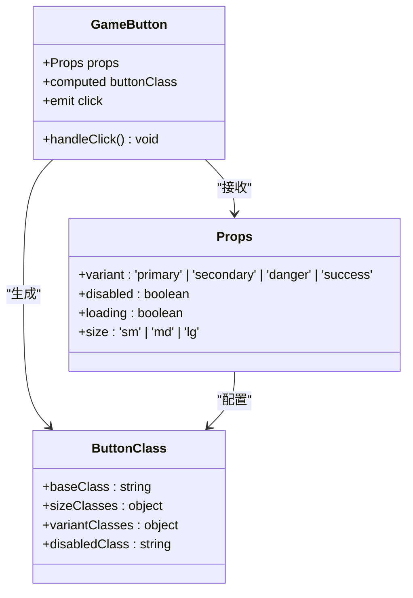
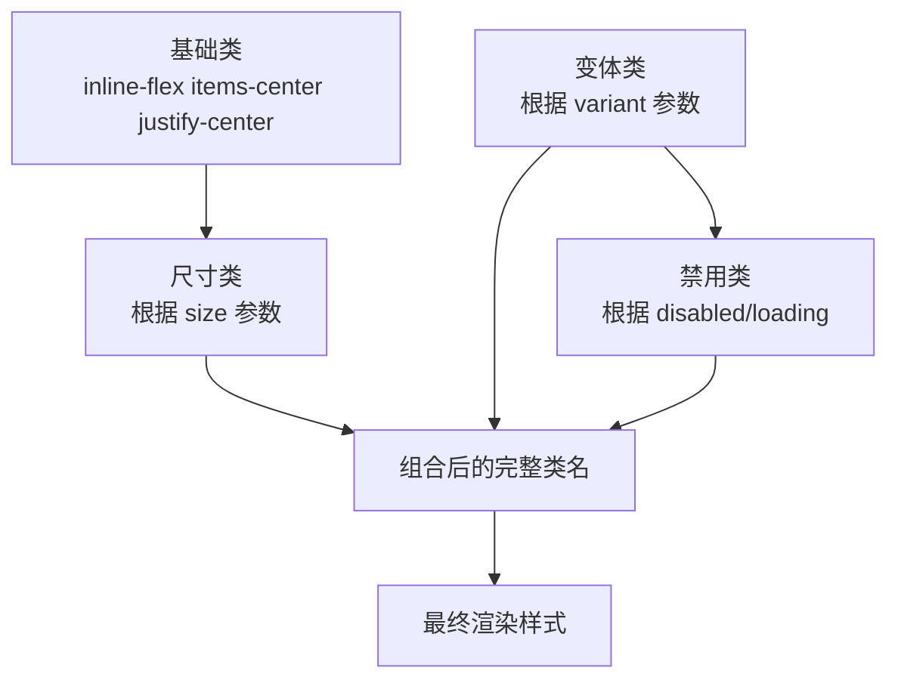
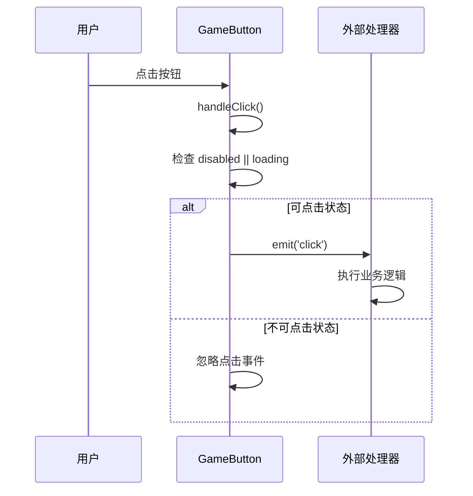
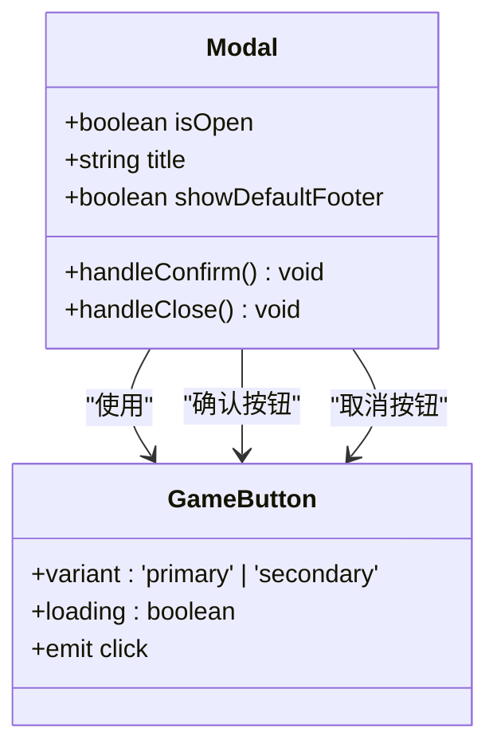

# GameButton 组件详细文档

<cite>
**本文档中引用的文件**
- [GameButton.vue](file://civilization-game/src/components/ui/GameButton.vue)
- [uno.config.ts](file://civilization-game/uno.config.ts)
- [style.css](file://civilization-game/src/style.css)
- [SettingsModal.vue](file://civilization-game/src/components/game/SettingsModal.vue)
- [MainLayout.vue](file://civilization-game/src/components/game/MainLayout.vue)
- [OfflineModal.vue](file://civilization-game/src/components/game/OfflineModal.vue)
- [Modal.vue](file://civilization-game/src/components/ui/Modal.vue)
- [ProgressBar.vue](file://civilization-game/src/components/ui/ProgressBar.vue)
- [index.ts](file://civilization-game/src/components/ui/index.ts)
</cite>

## 目录
1. [简介](#简介)
2. [组件架构](#组件架构)
3. [核心属性详解](#核心属性详解)
4. [视觉样式系统](#视觉样式系统)
5. [交互行为分析](#交互行为分析)
6. [使用示例](#使用示例)
7. [与其他组件的集成](#与其他组件的集成)
8. [性能优化建议](#性能优化建议)
9. [可访问性设计](#可访问性设计)
10. [故障排除指南](#故障排除指南)
11. [总结](#总结)

## 简介

GameButton 是一个高度可定制的游戏化按钮组件，专为文明建设游戏设计。该组件采用 Vue 3 Composition API 构建，支持 UnoCSS 类名系统，提供了丰富的视觉变体和交互状态。组件具有响应式设计，支持多种尺寸、颜色变体，并内置加载状态和禁用状态处理。

## 组件架构

GameButton 组件采用了简洁而高效的架构设计，主要由以下部分组成：



**图表来源**
- [GameButton.vue](file://civilization-game/src/components/ui/GameButton.vue#L8-L25)

**章节来源**
- [GameButton.vue](file://civilization-game/src/components/ui/GameButton.vue#L1-L67)

## 核心属性详解

### variant 属性 - 颜色变体

GameButton 支持四种主要的颜色变体，每种变体都有特定的语义含义：

- **primary (主要)**: 蓝色背景，用于主要操作按钮
- **secondary (次要)**: 紫色背景，用于次要操作或导航按钮
- **danger (危险)**: 红色背景，用于删除、取消等危险操作
- **success (成功)**: 绿色背景，用于确认、完成等成功操作

```typescript
const variantClasses = {
  primary: 'bg-blue-500 hover:bg-blue-600 text-white focus:ring-blue-500',
  secondary: 'bg-purple-500 hover:bg-purple-600 text-white focus:ring-purple-500',
  danger: 'bg-red-500 hover:bg-red-600 text-white focus:ring-red-500',
  success: 'bg-green-500 hover:bg-green-600 text-white focus:ring-green-500'
}
```

### size 属性 - 尺寸变体

组件提供三种尺寸选项，适应不同的布局需求：

- **sm (小)**: 适合工具栏和紧凑界面
- **md (中)**: 默认尺寸，适用于大多数场景
- **lg (大)**: 适合主操作和移动端界面

```typescript
const sizeClasses = {
  sm: 'px-3 py-1.5 text-sm',
  md: 'px-4 py-2 text-base',
  lg: 'px-6 py-3 text-lg'
}
```

### disabled 和 loading 状态

组件通过两个布尔属性控制按钮的可用状态：

- **disabled**: 完全禁用按钮，阻止所有交互
- **loading**: 显示加载动画，同时保持禁用状态

这两个属性会自动应用适当的样式和行为：

```typescript
const disabledClass = props.disabled || props.loading 
  ? 'opacity-50 cursor-not-allowed' 
  : 'cursor-pointer'
```

**章节来源**
- [GameButton.vue](file://civilization-game/src/components/ui/GameButton.vue#L15-L25)

## 视觉样式系统

### UnoCSS 集成

GameButton 充分利用了 UnoCSS 的原子化样式系统，通过动态计算类名实现灵活的样式组合：



**图表来源**
- [GameButton.vue](file://civilization-game/src/components/ui/GameButton.vue#L26-L50)

### 主题定制

通过 UnoCSS 配置，组件支持全局主题定制：

```typescript
theme: {
  colors: {
    primary: '#3b82f6',
    secondary: '#8b5cf6',
    success: '#10b981',
    warning: '#f59e0b',
    danger: '#ef4444',
    dark: '#1e293b',
    light: '#f1f5f9'
  }
}
```

### 可访问性样式

组件内置了完整的焦点样式和过渡效果：

- **focus:outline-none**: 移除默认焦点轮廓
- **focus:ring-2**: 自定义焦点环
- **focus:ring-offset-2**: 焦点环偏移
- **transition-all duration-200**: 平滑的过渡效果

**章节来源**
- [GameButton.vue](file://civilization-game/src/components/ui/GameButton.vue#L26-L50)
- [uno.config.ts](file://civilization-game/uno.config.ts#L10-L25)

## 交互行为分析

### 点击事件处理

GameButton 实现了智能的点击事件处理机制：



**图表来源**
- [GameButton.vue](file://civilization-game/src/components/ui/GameButton.vue#L52-L56)

### 加载状态集成

当按钮处于加载状态时，组件会显示旋转的骰子图标：

```html
<span v-if="loading" class="i-game-icons:rolling-dices animate-spin mr-2"></span>
```

这种设计不仅提供了视觉反馈，还防止了用户重复点击。

### 错误处理机制

组件通过条件渲染确保在禁用状态下不会触发任何事件：

```typescript
function handleClick() {
  if (!props.disabled && !props.loading) {
    emit('click')
  }
}
```

**章节来源**
- [GameButton.vue](file://civilization-game/src/components/ui/GameButton.vue#L52-L56)

## 使用示例

### 基础按钮使用

```vue
<!-- 主要操作按钮 -->
<GameButton variant="primary" @click="handleSubmit">
  <Icon icon="mdi:check" />
  <span>确认提交</span>
</GameButton>

<!-- 次要操作按钮 -->
<GameButton variant="secondary" @click="openSettings">
  <Icon icon="mdi:cog" />
  <span>设置</span>
</GameButton>
```

### 加载状态按钮

```vue
<GameButton 
  variant="primary" 
  :loading="isLoading" 
  @click="processPayment"
>
  <Icon icon="mdi:credit-card" />
  <span>支付订单</span>
</GameButton>
```

### 禁用状态按钮

```vue
<GameButton 
  variant="danger" 
  :disabled="!canDelete" 
  @click="deleteItem"
>
  <Icon icon="mdi:trash-can" />
  <span>删除项目</span>
</GameButton>
```

### 不同尺寸的应用

```vue
<!-- 小尺寸 - 工具栏按钮 -->
<GameButton size="sm" variant="secondary" @click="undoAction">
  <Icon icon="mdi:undo" />
</GameButton>

<!-- 大尺寸 - 主操作按钮 -->
<GameButton size="lg" variant="primary" @click="startGame">
  <Icon icon="mdi:play" />
  <span>开始游戏</span>
</GameButton>
```

**章节来源**
- [SettingsModal.vue](file://civilization-game/src/components/game/SettingsModal.vue#L168-L183)
- [OfflineModal.vue](file://civilization-game/src/components/game/OfflineModal.vue#L180-L200)

## 与其他组件的集成

### Modal 组件集成

GameButton 在 Modal 组件中作为标准的确认和取消按钮使用：



**图表来源**
- [Modal.vue](file://civilization-game/src/components/ui/Modal.vue#L50-L70)

### ProgressBar 组件协作

在离线收益模态框中，GameButton 与 ProgressBar 协作展示进度信息：

```vue
<GameButton
  variant="primary"
  size="lg"
  @click="handleClaim"
  class="w-full"
>
  <Icon icon="mdi:check" width="20" height="20" />
  <span>领取收益</span>
</GameButton>
```

### 响应式设计适配

在 MainLayout 组件中，GameButton 根据屏幕尺寸调整大小：

```vue
<GameButton size="sm" variant="secondary" @click="toggleSettings">
  <Icon icon="mdi:cog" class="text-base md:text-lg" />
</GameButton>
```

**章节来源**
- [Modal.vue](file://civilization-game/src/components/ui/Modal.vue#L50-L70)
- [OfflineModal.vue](file://civilization-game/src/components/game/OfflineModal.vue#L180-L200)
- [MainLayout.vue](file://civilization-game/src/components/game/MainLayout.vue#L45-L50)

## 性能优化建议

### 防止重复点击

GameButton 内置了防止重复点击的机制：

1. **状态检查**: 在 handleClick 方法中检查 disabled 和 loading 状态
2. **事件阻止**: 当按钮不可用时完全忽略点击事件
3. **加载状态**: 通过 loading 属性显示处理中的状态

### 渲染优化

1. **计算属性缓存**: buttonClass 使用 computed 属性缓存计算结果
2. **条件渲染**: 只有在需要时才渲染加载动画
3. **类名合并**: 使用数组合并的方式高效生成最终类名

### 内存管理

1. **事件清理**: 组件卸载时自动清理事件监听器
2. **响应式数据**: 合理使用 reactive 和 ref 管理状态
3. **模板优化**: 避免复杂的模板表达式

## 可访问性设计

### 键盘导航支持

GameButton 完全支持键盘导航：

- **Tab 键**: 导航到按钮
- **Enter/Space**: 触发点击事件
- **Focus 样式**: 清晰的焦点指示器

### 屏幕阅读器友好

1. **语义化标签**: 使用标准的 button 元素
2. **角色属性**: 支持 aria-* 属性扩展
3. **文本内容**: 包含清晰的文本描述

### 对比度和可读性

1. **高对比度**: 文本颜色与背景形成足够对比
2. **焦点可见**: 焦点环清晰可见
3. **状态指示**: 不同状态有明确的视觉差异

### 无障碍图标

```html
<span v-if="loading" class="i-game-icons:rolling-dices animate-spin mr-2"></span>
```

旋转的骰子图标不仅美观，还能有效传达加载状态。

## 故障排除指南

### 常见问题及解决方案

#### 1. 按钮样式不生效

**问题**: 按钮看起来没有应用预期的样式

**解决方案**:
- 检查 UnoCSS 配置是否正确加载
- 确认类名拼写正确
- 验证 CSS 优先级冲突

#### 2. 加载状态异常

**问题**: loading 属性设置后按钮行为异常

**解决方案**:
```typescript
// 正确的使用方式
const isLoading = ref(false)

function handleClick() {
  isLoading.value = true
  // 异步操作完成后
  setTimeout(() => {
    isLoading.value = false
  }, 2000)
}
```

#### 3. 点击事件未触发

**问题**: 按钮点击后没有响应

**解决方案**:
- 检查 disabled 和 loading 属性
- 确认事件监听器正确绑定
- 验证父组件事件处理逻辑

#### 4. 响应式布局问题

**问题**: 按钮在不同设备上显示异常

**解决方案**:
- 使用适当的 size 属性
- 检查容器宽度限制
- 验证媒体查询配置

### 调试技巧

1. **Vue DevTools**: 使用组件面板检查 props 和 computed 属性
2. **浏览器开发者工具**: 检查最终渲染的类名和样式
3. **控制台日志**: 添加必要的调试输出
4. **网络面板**: 确认 UnoCSS 样式文件正确加载

## 总结

GameButton 组件是一个功能完善、设计精良的 UI 组件，具有以下核心优势：

### 技术特性
- **类型安全**: 完整的 TypeScript 支持
- **响应式设计**: 支持多种尺寸和状态
- **性能优化**: 高效的渲染和内存管理
- **可维护性**: 清晰的代码结构和注释

### 设计理念
- **一致性**: 统一的设计语言和交互模式
- **可访问性**: 完善的无障碍支持
- **灵活性**: 丰富的配置选项和扩展能力
- **美观性**: 符合游戏化设计风格的视觉效果

### 应用价值
- **提高开发效率**: 减少重复造轮子的工作
- **保证用户体验**: 统一的交互体验和视觉反馈
- **降低维护成本**: 集中化的样式管理和行为控制
- **增强可读性**: 清晰的代码结构便于团队协作

GameButton 组件为整个游戏界面提供了坚实的基础，是构建高质量游戏体验的重要组成部分。通过合理的使用和定制，它可以满足各种复杂的业务需求，同时保持良好的性能和可维护性。