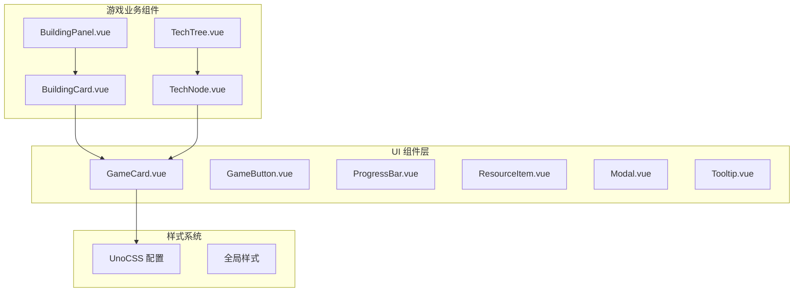
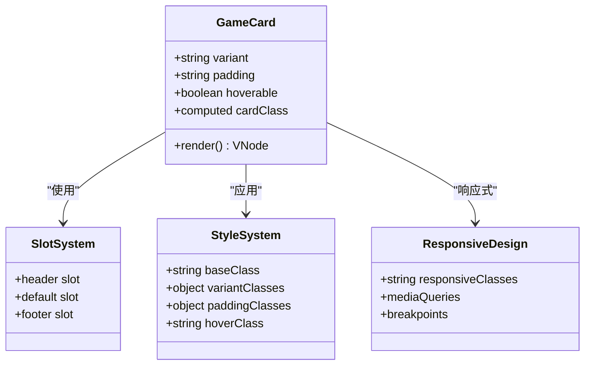
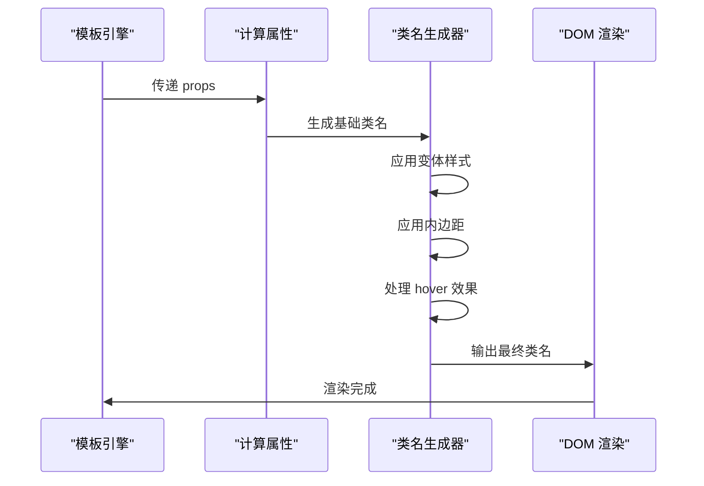
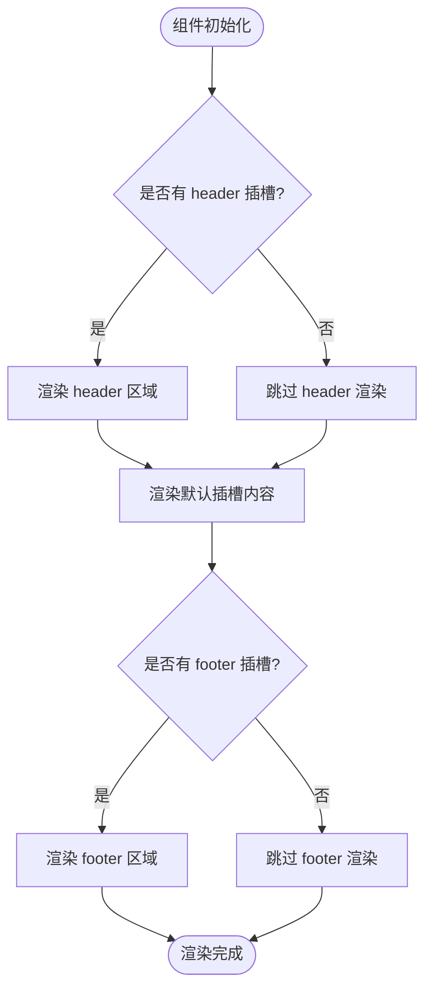
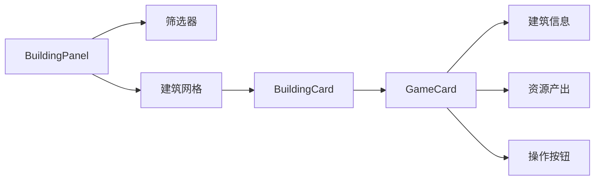
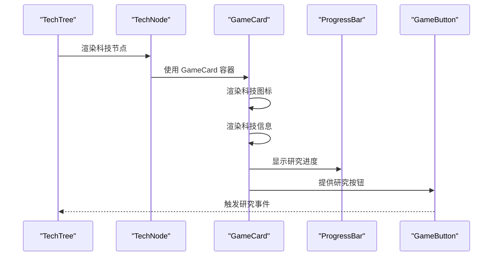
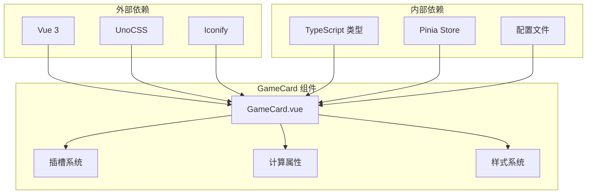

# GameCard 组件

<cite>
**本文档引用的文件**
- [GameCard.vue](file://civilization-game/src/components/ui/GameCard.vue)
- [BuildingCard.vue](file://civilization-game/src/components/game/BuildingCard.vue)
- [TechNode.vue](file://civilization-game/src/components/game/TechNode.vue)
- [BuildingPanel.vue](file://civilization-game/src/components/game/BuildingPanel.vue)
- [TechTree.vue](file://civilization-game/src/components/game/TechTree.vue)
- [ResourceItem.vue](file://civilization-game/src/components/ui/ResourceItem.vue)
- [ProgressBar.vue](file://civilization-game/src/components/ui/ProgressBar.vue)
- [uno.config.ts](file://civilization-game/uno.config.ts)
- [ui/index.ts](file://civilization-game/src/components/ui/index.ts)
</cite>

## 目录
1. [简介](#简介)
2. [项目结构](#项目结构)
3. [核心组件](#核心组件)
4. [架构概览](#架构概览)
5. [详细组件分析](#详细组件分析)
6. [依赖关系分析](#依赖关系分析)
7. [性能考虑](#性能考虑)
8. [故障排除指南](#故障排除指南)
9. [结论](#结论)

## 简介

GameCard 是一个高度灵活且响应式的卡片组件，专为游戏界面设计。它提供了多种视觉变体、内边距选项和交互效果，是 Civilization 游戏中构建用户界面的基础组件之一。该组件支持插槽系统，允许开发者自定义头部、主体内容和底部区域，同时集成了 UnoCSS 样式系统和响应式设计原则。

## 项目结构

GameCard 组件位于游戏项目的 UI 组件层，作为通用界面元素服务于多个业务组件。



**图表来源**
- [GameCard.vue](file://civilization-game/src/components/ui/GameCard.vue#L1-L60)
- [BuildingCard.vue](file://civilization-game/src/components/game/BuildingCard.vue#L1-L50)
- [TechNode.vue](file://civilization-game/src/components/game/TechNode.vue#L1-L50)

**章节来源**
- [ui/index.ts](file://civilization-game/src/components/ui/index.ts#L1-L6)

## 核心组件

GameCard 组件是一个基于 Vue 3 Composition API 的响应式卡片组件，具有以下核心特性：

### 主要功能特性

- **多种视觉变体**：支持 default、outlined 和 elevated 三种样式变体
- **灵活的内边距系统**：提供 none、sm、md、lg 四种内边距选项
- **交互效果**：可选的 hoverable 属性提供悬停动画效果
- **插槽系统**：支持 header、default 和 footer 三个插槽
- **响应式设计**：完全适配移动端和桌面端界面
- **样式集成**：深度集成 UnoCSS 样式系统

### 技术栈

- **框架**：Vue 3 Composition API
- **样式**：UnoCSS 预处理器
- **类型系统**：TypeScript
- **图标**：Iconify 图标库

**章节来源**
- [GameCard.vue](file://civilization-game/src/components/ui/GameCard.vue#L1-L60)

## 架构概览

GameCard 组件采用模块化设计，通过插槽系统实现内容的灵活组织，同时保持一致的视觉风格。



**图表来源**
- [GameCard.vue](file://civilization-game/src/components/ui/GameCard.vue#L15-L45)

## 详细组件分析

### GameCard 组件核心实现

GameCard 组件的核心逻辑集中在模板渲染和计算属性上，通过动态类名生成实现样式控制。



**图表来源**
- [GameCard.vue](file://civilization-game/src/components/ui/GameCard.vue#L15-L45)

#### 变体属性详解

GameCard 支持三种主要的变体样式：

1. **Default 变体**：默认白色背景，带阴影效果
2. **Outlined 变体**：透明背景，带描边边框
3. **Elevated 变体**：白色背景，更明显的阴影效果

#### 内边距系统

组件提供四种内边距选项：
- **none**：无内边距
- **sm**：小内边距 (2px)
- **md**：中等内边距 (4px)
- **lg**：大内边距 (6px)

#### Hoverable 交互效果

当启用 hoverable 属性时，组件会在鼠标悬停时：
- 增加阴影深度 (shadow-xl)
- 放大 5% (scale-105)
- 显示指针光标 (cursor-pointer)

**章节来源**
- [GameCard.vue](file://civilization-game/src/components/ui/GameCard.vue#L15-L45)

### 插槽系统使用

GameCard 采用 Vue 3 的插槽系统，提供灵活的内容组织方式：



**图表来源**
- [GameCard.vue](file://civilization-game/src/components/ui/GameCard.vue#L2-L12)

#### Header 插槽使用示例

在 BuildingCard 中，header 插槽用于显示建筑名称、图标和状态信息：

```vue
<template #header>
  <div class="flex items-start md:items-center justify-between gap-2">
    <div class="flex items-start md:items-center gap-2 md:gap-3 flex-1 min-w-0">
      <Icon :icon="building.icon" class="text-2xl md:text-3xl text-blue-500 flex-shrink-0" />
      <div class="flex-1 min-w-0">
        <h3 class="text-base md:text-lg font-bold text-gray-900 dark:text-white truncate">
          {{ building.name }}
          <span v-if="instance" class="text-xs md:text-sm text-gray-500">Lv.{{ instance.level }}</span>
        </h3>
        <p class="text-xs md:text-sm text-gray-600 dark:text-gray-400 line-clamp-2">
          {{ building.description }}
        </p>
      </div>
    </div>
    
    <div v-if="instance" class="building-status flex-shrink-0">
      <span :class="statusClass" class="text-xs md:text-sm">{{ statusText }}</span>
    </div>
  </div>
</template>
```

#### Footer 插槽使用示例

footer 插槽通常用于放置操作按钮或状态指示器：

```vue
<template #footer>
  <GameButton
    v-if="!instance || (instance.status === 'built' && instance.level < building.maxLevel)"
    :disabled="!canBuild"
    :variant="canBuild ? 'primary' : 'secondary'"
    size="sm"
    class="w-full text-xs md:text-sm"
    @click="handleBuild"
  >
    {{ instance ? `升级到 Lv.${instance.level + 1}` : '建造' }}
  </GameButton>
</template>
```

**章节来源**
- [BuildingCard.vue](file://civilization-game/src/components/game/BuildingCard.vue#L1-L50)
- [BuildingCard.vue](file://civilization-game/src/components/game/BuildingCard.vue#L120-L140)

### 实际业务组件中的应用

#### BuildingPanel 中的应用

在 BuildingPanel 组件中，GameCard 被用作建筑卡片的基础容器：



**图表来源**
- [BuildingPanel.vue](file://civilization-game/src/components/game/BuildingPanel.vue#L40-L50)
- [BuildingCard.vue](file://civilization-game/src/components/game/BuildingCard.vue#L1-L50)

#### TechTree 中的应用

在 TechTree 组件中，GameCard 与 TechNode 结合使用，展示科技信息：



**图表来源**
- [TechTree.vue](file://civilization-game/src/components/game/TechTree.vue#L1-L50)
- [TechNode.vue](file://civilization-game/src/components/game/TechNode.vue#L1-L100)

**章节来源**
- [BuildingPanel.vue](file://civilization-game/src/components/game/BuildingPanel.vue#L40-L78)
- [TechTree.vue](file://civilization-game/src/components/game/TechTree.vue#L1-L150)

### UnoCSS 样式集成

GameCard 深度集成了 UnoCSS 样式系统，通过预定义的类名实现响应式设计：

#### 响应式设计实现

```typescript
// 基础类名
const baseClass = 'rounded-lg transition-all duration-200'

// 响应式断点处理
// sm: 640px
// md: 768px
// lg: 1024px
```

#### 样式覆盖机制

通过 UnoCSS 的快捷方式系统，GameCard 可以轻松被其他组件覆盖样式：

```typescript
// UnoCSS 快捷方式定义
shortcuts: {
  'card': 'bg-white dark:bg-gray-800 rounded-lg shadow-md p-4'
}
```

**章节来源**
- [uno.config.ts](file://civilization-game/uno.config.ts#L1-L32)

## 依赖关系分析

GameCard 组件的依赖关系相对简单，主要依赖于 Vue 3 的核心功能和 UnoCSS 样式系统。



**图表来源**
- [GameCard.vue](file://civilization-game/src/components/ui/GameCard.vue#L1-L15)

**章节来源**
- [GameCard.vue](file://civilization-game/src/components/ui/GameCard.vue#L1-L15)

## 性能考虑

### 渲染优化

GameCard 组件采用了多项性能优化策略：

1. **计算属性缓存**：cardClass 计算属性利用 Vue 的响应式缓存机制
2. **条件渲染**：仅在存在插槽内容时才渲染对应区域
3. **类名合并**：使用数组合并的方式生成最终类名，避免字符串拼接开销

### 内存管理

- 组件生命周期短，无复杂的状态管理
- 使用 withDefaults 提供默认值，减少运行时检查
- 插槽系统避免了不必要的 DOM 节点创建

### 响应式性能

- 使用 UnoCSS 的原子类名，避免 CSS 文件大小问题
- 基础类名固定，只在需要时添加变体类名
- hover 效果使用 CSS 过渡，避免 JavaScript 动画开销

## 故障排除指南

### 常见问题及解决方案

#### 1. 样式不生效

**问题描述**：GameCard 的样式没有正确应用

**可能原因**：
- UnoCSS 配置未正确加载
- 类名冲突
- 缺少必要的 CSS 变量

**解决方案**：
```typescript
// 检查 UnoCSS 配置
// 在 uno.config.ts 中确保正确导入 presetUno()

// 检查类名拼写
// 确保使用正确的变体和内边距类名
```

#### 2. 插槽内容不显示

**问题描述**：header 或 footer 插槽内容没有渲染

**可能原因**：
- 插槽内容为空
- 条件渲染导致插槽被跳过
- CSS 样式隐藏了插槽内容

**解决方案**：
```vue
<!-- 确保插槽内容存在 -->
<template #header>
  <div>插槽内容</div>
</template>

<!-- 检查条件渲染 -->
<div v-if="$slots.header" class="card-header">
  <slot name="header" />
</div>
```

#### 3. 响应式布局问题

**问题描述**：在不同屏幕尺寸下布局异常

**可能原因**：
- 缺少适当的断点类名
- UnoCSS 响应式前缀使用错误
- Flexbox/Grid 布局设置不当

**解决方案**：
```vue
<!-- 正确使用响应式类名 -->
<div class="flex flex-col md:flex-row gap-2 md:gap-4">
  <!-- 内容 -->
</div>
```

**章节来源**
- [GameCard.vue](file://civilization-game/src/components/ui/GameCard.vue#L2-L12)

## 最佳实践指导

### 与其他UI组件的组合使用

#### ResourceItem 组合使用

GameCard 与 ResourceItem 组件结合使用，展示资源信息：

```vue
<GameCard variant="outlined" padding="sm">
  <template #header>
    <h3 class="text-lg font-bold">资源面板</h3>
  </template>
  
  <div class="space-y-2">
    <ResourceItem
      v-for="resource in resources"
      :key="resource.id"
      :name="resource.name"
      :icon="resource.icon"
      :amount="resource.amount"
      :limit="resource.limit"
      :change="resource.change"
    />
  </div>
</GameCard>
```

#### ProgressBar 组合使用

在 TechNode 中，GameCard 与 ProgressBar 结合使用展示进度信息：

```vue
<GameCard variant="elevated" hoverable>
  <template #header>
    <h3 class="text-xl font-bold">{{ tech.name }}</h3>
  </template>
  
  <ProgressBar
    v-if="isResearching"
    :percentage="researchProgress"
    :estimated-time="remainingTime"
    show-text
    color="blue"
  />
  
  <template #footer>
    <GameButton @click="handleResearch">
      {{ isResearching ? '取消研究' : '开始研究' }}
    </GameButton>
  </template>
</GameCard>
```

### 设计模式建议

#### 1. 卡片变体选择

- **Default**：适用于主要内容区域
- **Outlined**：适用于次要信息或对比展示
- **Elevated**：适用于重要操作或关键信息

#### 2. 内边距策略

- **Small**：紧凑布局，适合列表视图
- **Medium**：标准布局，适合大多数场景
- **Large**：宽松布局，适合详情页面
- **None**：极简布局，适合装饰性卡片

#### 3. 交互设计

- **Hoverable**：仅在需要强调交互行为时使用
- **状态反馈**：结合状态类名提供视觉反馈
- **过渡效果**：合理使用 CSS 过渡提升用户体验

#### 4. 响应式设计

- **移动优先**：先设计移动端体验，再扩展到桌面端
- **断点策略**：使用 UnoCSS 的响应式前缀
- **内容优先**：根据内容需求调整布局

### 代码示例

#### 基础使用示例

```vue
<GameCard>
  <template #header>
    <h2 class="text-xl font-bold">标题</h2>
  </template>
  
  <p>这是卡片的主要内容。</p>
  
  <template #footer>
    <button>操作按钮</button>
  </template>
</GameCard>
```

#### 高级使用示例

```vue
<GameCard
  variant="elevated"
  padding="lg"
  hoverable
  class="custom-card"
>
  <template #header>
    <div class="flex items-center justify-between">
      <h2 class="text-2xl font-bold">高级卡片</h2>
      <span class="badge">新功能</span>
    </div>
  </template>
  
  <div class="grid grid-cols-1 md:grid-cols-2 gap-4">
    <div v-for="item in items" :key="item.id">
      <h3>{{ item.title }}</h3>
      <p>{{ item.description }}</p>
    </div>
  </div>
  
  <template #footer>
    <div class="flex gap-2">
      <button class="btn btn-primary">确认</button>
      <button class="btn btn-secondary">取消</button>
    </div>
  </template>
</GameCard>
```

## 结论

GameCard 组件是一个设计精良、功能丰富的卡片组件，它成功地平衡了灵活性和易用性。通过其插槽系统、多样化的样式选项和响应式设计，GameCard 为 Civilization 游戏的用户界面提供了坚实的基础。

### 主要优势

1. **高度可定制**：通过变体、内边距和交互效果提供丰富的视觉选项
2. **灵活的内容组织**：插槽系统支持复杂的布局需求
3. **优秀的性能**：轻量级实现，高效的渲染机制
4. **响应式设计**：完美适配各种设备和屏幕尺寸
5. **样式集成**：与 UnoCSS 的无缝集成简化了样式管理

### 发展方向

1. **更多变体**：可以考虑添加更多视觉变体以满足不同的设计需求
2. **动画扩展**：增加更多的动画效果选项
3. **无障碍支持**：增强键盘导航和屏幕阅读器支持
4. **主题系统**：建立完整的主题系统支持深色/浅色模式切换

GameCard 组件的设计理念和实现方式为其他 UI 组件的开发提供了很好的参考，其模块化的设计和清晰的接口使得维护和扩展变得简单高效。