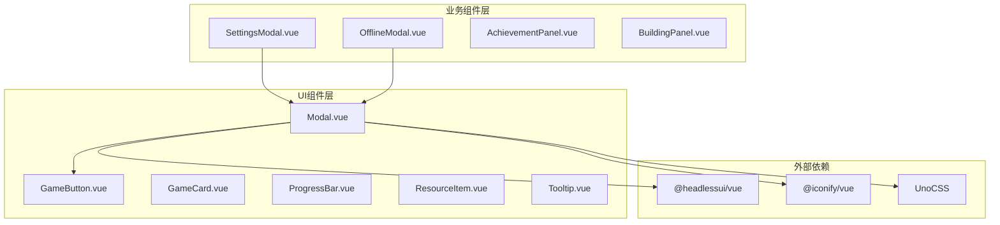
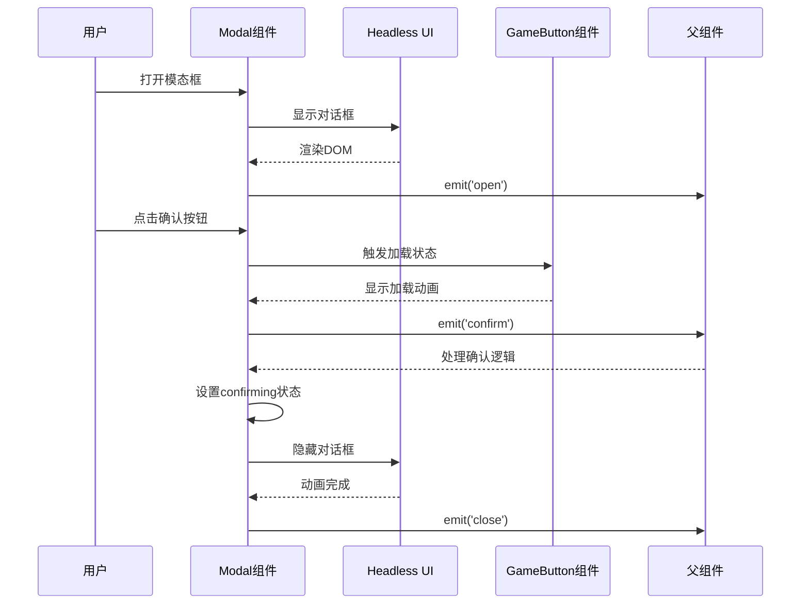
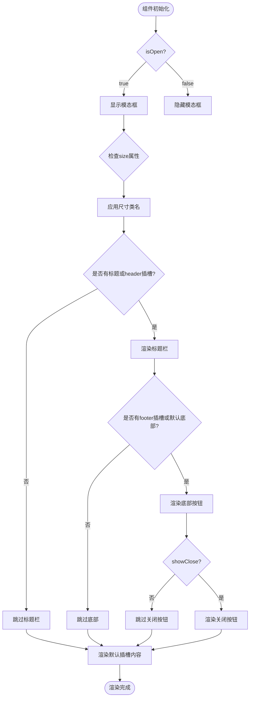
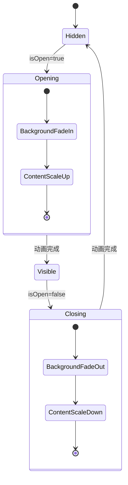
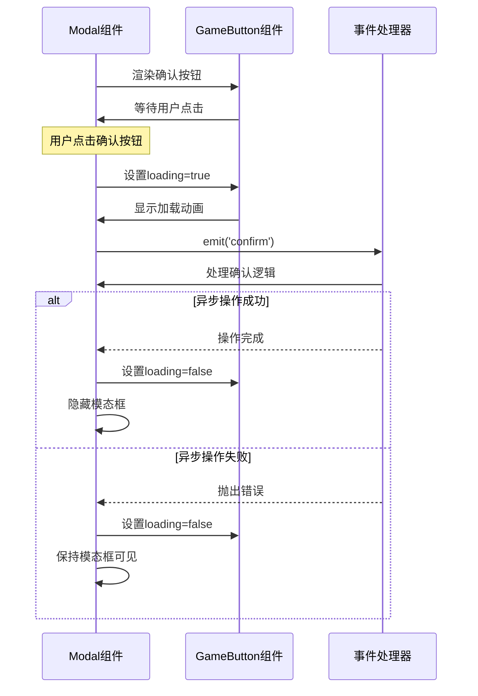
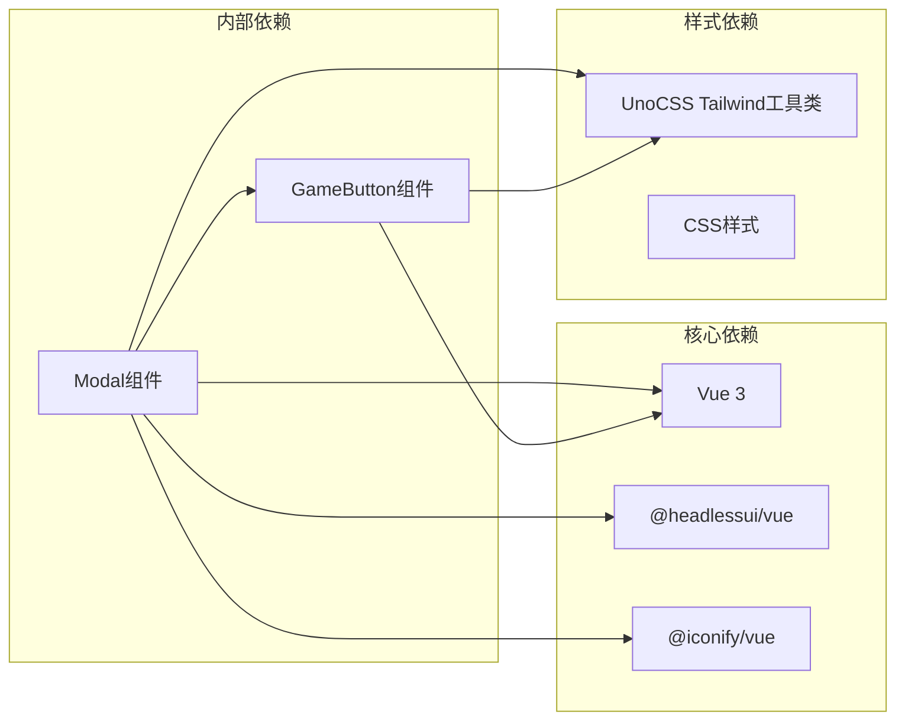

# Modal 组件

<cite>
**本文档中引用的文件**
- [Modal.vue](file://civilization-game/src/components/ui/Modal.vue)
- [GameButton.vue](file://civilization-game/src/components/ui/GameButton.vue)
- [SettingsModal.vue](file://civilization-game/src/components/game/SettingsModal.vue)
- [OfflineModal.vue](file://civilization-game/src/components/game/OfflineModal.vue)
- [index.ts](file://civilization-game/src/components/ui/index.ts)
- [package.json](file://civilization-game/package.json)
</cite>

## 目录
1. [简介](#简介)
2. [项目结构](#项目结构)
3. [核心组件](#核心组件)
4. [架构概览](#架构概览)
5. [详细组件分析](#详细组件分析)
6. [依赖关系分析](#依赖关系分析)
7. [性能考虑](#性能考虑)
8. [故障排除指南](#故障排除指南)
9. [结论](#结论)

## 简介

Modal组件是一个基于Headless UI的无样式组件，提供了灵活且可访问的模态对话框解决方案。该组件采用现代化的Vue 3 Composition API设计，支持多种尺寸、自定义标题、插槽布局和动画过渡效果。通过与GameButton组件的深度集成，实现了确认对话框的标准模式，并提供了丰富的业务场景应用示例。

## 项目结构

Modal组件位于`src/components/ui/`目录下，作为UI组件库的核心部分，与其他UI组件如GameButton、GameCard等形成完整的组件生态系统。



**图表来源**
- [Modal.vue](file://civilization-game/src/components/ui/Modal.vue#L1-L144)
- [GameButton.vue](file://civilization-game/src/components/ui/GameButton.vue#L1-L67)
- [SettingsModal.vue](file://civilization-game/src/components/game/SettingsModal.vue#L1-L339)
- [OfflineModal.vue](file://civilization-game/src/components/game/OfflineModal.vue#L1-L211)

**章节来源**
- [index.ts](file://civilization-game/src/components/ui/index.ts#L1-L8)

## 核心组件

Modal组件的核心特性包括：

### 无样式架构设计
基于Headless UI的无样式架构，提供完全的样式控制自由度，同时保持可访问性和语义化的HTML结构。

### 多尺寸支持
支持sm、md、lg、xl、full五种尺寸选项，适应不同的内容展示需求。

### 插槽系统
提供header、default、footer三个插槽，实现灵活的内容布局和自定义。

### 动画过渡
内置TransitionRoot和TransitionChild组件，提供平滑的进入和退出动画效果。

**章节来源**
- [Modal.vue](file://civilization-game/src/components/ui/Modal.vue#L1-L144)

## 架构概览

Modal组件采用了分层架构设计，将展示逻辑、交互逻辑和动画效果分离，确保代码的可维护性和扩展性。



**图表来源**
- [Modal.vue](file://civilization-game/src/components/ui/Modal.vue#L100-L144)
- [GameButton.vue](file://civilization-game/src/components/ui/GameButton.vue#L1-L67)

## 详细组件分析

### Modal组件核心属性

Modal组件通过TypeScript接口定义了以下核心属性：

```typescript
interface Props {
  isOpen: boolean
  title?: string
  size?: 'sm' | 'md' | 'lg' | 'xl' | 'full'
  showClose?: boolean
  showDefaultFooter?: boolean
  confirmText?: string
  cancelText?: string
  closeOnClickOutside?: boolean
}
```

#### 属性控制逻辑



**图表来源**
- [Modal.vue](file://civilization-game/src/components/ui/Modal.vue#L15-L91)

#### 尺寸类名映射

Modal组件通过computed属性动态计算面板类名：

```typescript
const panelClass = computed(() => {
  const sizeClasses = {
    sm: 'max-w-sm',
    md: 'max-w-md',
    lg: 'max-w-lg',
    xl: 'max-w-xl',
    full: 'max-w-full mx-4'
  }
  
  return [
    'w-full rounded-xl bg-white dark:bg-gray-800 p-6 shadow-2xl',
    'transform transition-all',
    sizeClasses[props.size]
  ].join(' ')
})
```

**章节来源**
- [Modal.vue](file://civilization-game/src/components/ui/Modal.vue#L70-L85)

### 动画过渡机制

Modal组件使用Headless UI的TransitionRoot和TransitionChild组件实现动画效果：

#### 背景模糊效果
```html
<div class="fixed inset-0 bg-black/60 backdrop-blur-sm" />
```

#### 进入动画
- **背景**: 300ms渐显动画
- **内容**: 300ms缩放和透明度动画

#### 退出动画
- **背景**: 200ms渐隐动画
- **内容**: 200ms缩放和透明度动画



**图表来源**
- [Modal.vue](file://civilization-game/src/components/ui/Modal.vue#L2-L25)

### GameButton集成模式

Modal组件与GameButton组件形成了标准的确认对话框模式：

#### 确认对话框流程


**图表来源**
- [Modal.vue](file://civilization-game/src/components/ui/Modal.vue#L100-L144)
- [GameButton.vue](file://civilization-game/src/components/ui/GameButton.vue#L1-L67)

**章节来源**
- [Modal.vue](file://civilization-game/src/components/ui/Modal.vue#L100-L144)
- [GameButton.vue](file://civilization-game/src/components/ui/GameButton.vue#L1-L67)

### 实际业务场景应用

#### SettingsModal应用示例

SettingsModal展示了Modal组件在复杂业务场景中的应用：

```typescript
// SettingsModal中的Modal使用
<Modal
  :isOpen="show"
  title="游戏设置"
  size="lg"
  showClose
  showDefaultFooter
  @close="close"
  @confirm="handleConfirm"
/>
```

#### OfflineModal应用示例

OfflineModal展示了Modal组件在离线收益场景中的应用：

```typescript
// OfflineModal中的Modal使用
<Modal
  :isOpen="show"
  title="欢迎回来!"
  size="md"
  showClose
  @close="handleClose"
  @confirm="handleClaim"
/>
```

**章节来源**
- [SettingsModal.vue](file://civilization-game/src/components/game/SettingsModal.vue#L1-L339)
- [OfflineModal.vue](file://civilization-game/src/components/game/OfflineModal.vue#L1-L211)

## 依赖关系分析

Modal组件的依赖关系体现了清晰的分层架构：



**图表来源**
- [Modal.vue](file://civilization-game/src/components/ui/Modal.vue#L1-L10)
- [package.json](file://civilization-game/package.json#L1-L35)

**章节来源**
- [Modal.vue](file://civilization-game/src/components/ui/Modal.vue#L1-L10)
- [package.json](file://civilization-game/package.json#L1-L35)

## 性能考虑

### 异步操作处理
Modal组件通过`confirming`状态变量管理异步操作，避免重复提交和界面冻结。

### 动画性能优化
- 使用CSS transforms进行动画，避免重排
- 合理设置动画持续时间，平衡用户体验和性能
- 利用GPU加速的backdrop-blur效果

### 可访问性最佳实践
- 使用语义化的HTML结构
- 支持键盘导航和屏幕阅读器
- 提供适当的ARIA标签和角色

## 故障排除指南

### 常见问题及解决方案

#### 1. 模态框无法关闭
**问题**: 点击关闭按钮或遮罩区域后模态框不消失
**解决方案**: 检查`closeOnClickOutside`属性设置，确保正确绑定`@close`事件

#### 2. 动画效果异常
**问题**: 模态框出现时没有动画效果
**解决方案**: 确保Headless UI组件正确导入，检查CSS类名是否正确应用

#### 3. GameButton状态同步问题
**问题**: 确认按钮的加载状态与异步操作不同步
**解决方案**: 在`handleConfirm`方法中正确管理`confirming`状态，使用try-finally确保状态重置

**章节来源**
- [Modal.vue](file://civilization-game/src/components/ui/Modal.vue#L100-L144)

## 结论

Modal组件作为一个基于Headless UI的无样式组件，成功地实现了现代化的模态对话框解决方案。通过灵活的属性控制系统、强大的插槽机制、完善的动画过渡效果和与GameButton的深度集成，为整个游戏应用提供了统一且可扩展的对话框组件。

该组件的设计充分体现了Vue 3的最佳实践，包括Composition API的使用、TypeScript类型安全、响应式编程模式以及可访问性考虑。在SettingsModal和OfflineModal等实际业务场景中的应用证明了其灵活性和实用性。

未来可以考虑添加更多高级功能，如拖拽移动、嵌套模态框支持、更丰富的动画效果等，进一步提升用户体验和组件能力。