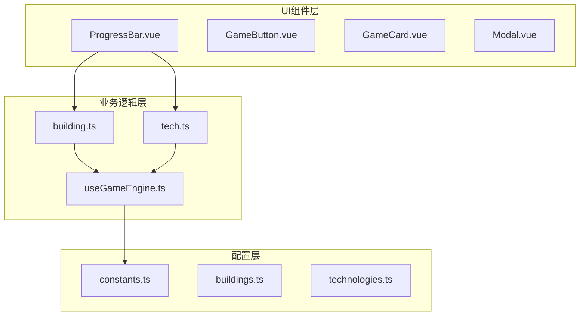
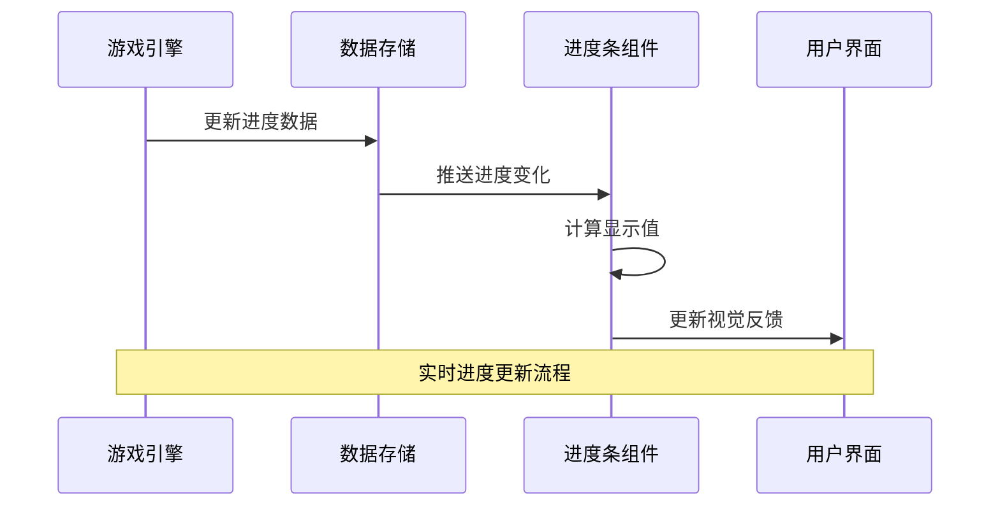
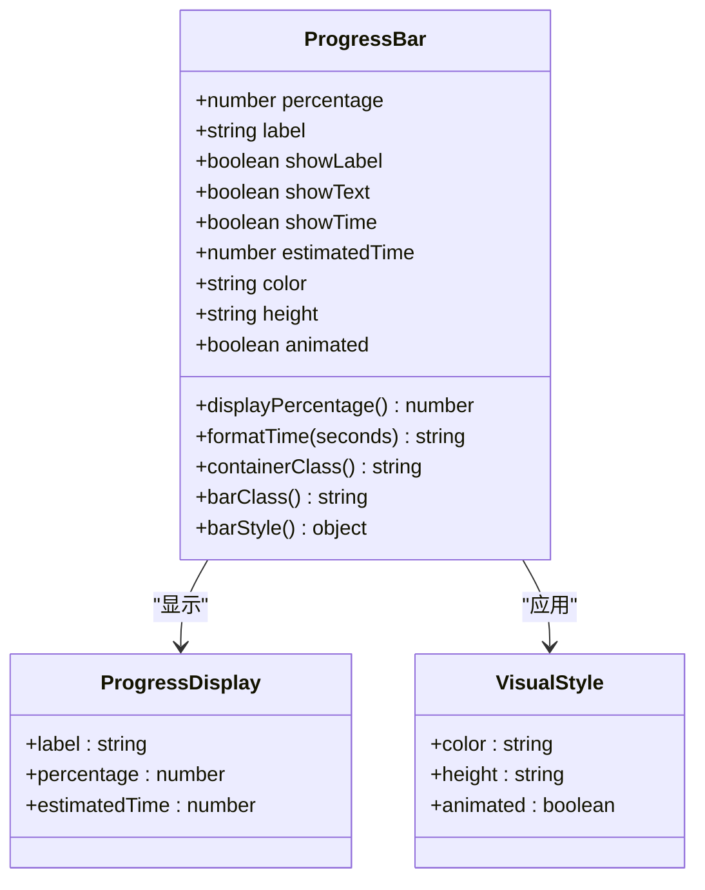
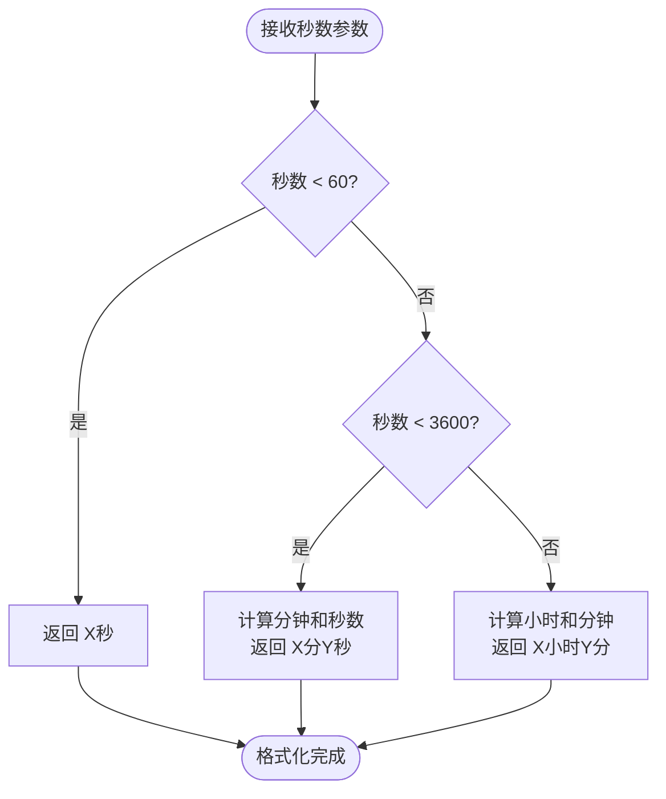
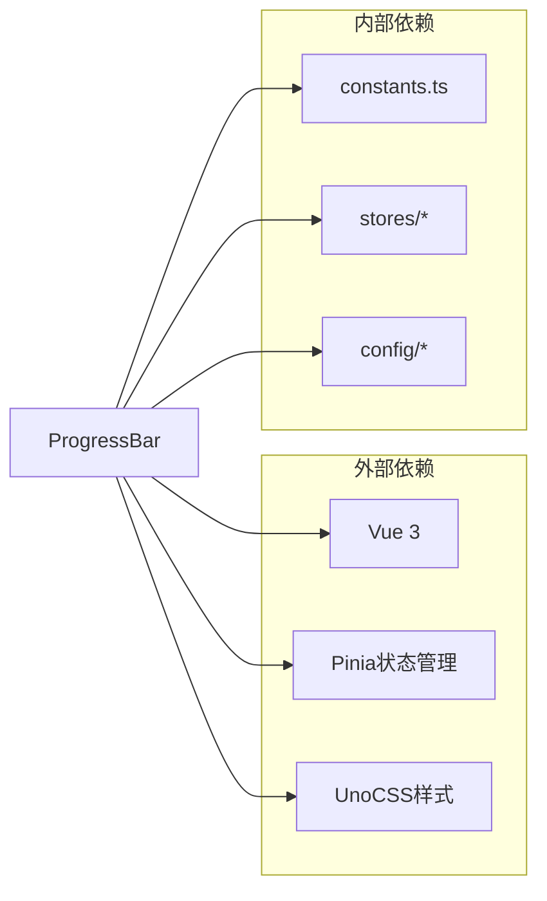

# ProgressBar 组件

<cite>
**本文档引用的文件**
- [ProgressBar.vue](file://civilization-game/src/components/ui/ProgressBar.vue)
- [useGameEngine.ts](file://civilization-game/src/composables/useGameEngine.ts)
- [building.ts](file://civilization-game/src/stores/building.ts)
- [tech.ts](file://civilization-game/src/stores/tech.ts)
- [constants.ts](file://civilization-game/src/config/constants.ts)
- [TechNode.vue](file://civilization-game/src/components/game/TechNode.vue)
- [BuildingCard.vue](file://civilization-game/src/components/game/BuildingCard.vue)
- [style.css](file://civilization-game/src/style.css)
</cite>

## 目录
1. [简介](#简介)
2. [项目结构](#项目结构)
3. [核心组件](#核心组件)
4. [架构概览](#架构概览)
5. [详细组件分析](#详细组件分析)
6. [依赖关系分析](#依赖关系分析)
7. [性能考虑](#性能考虑)
8. [故障排除指南](#故障排除指南)
9. [结论](#结论)

## 简介

ProgressBar组件是文明建设游戏中用于显示进度条的核心UI组件。它提供了丰富的功能，包括百分比显示、标签管理、时间估算、多种颜色主题和高度选项。该组件广泛应用于建筑建造进度、科技研究进度等场景，为玩家提供直观的进度反馈。

## 项目结构

ProgressBar组件位于UI组件层，作为游戏界面的重要组成部分：



**图表来源**
- [ProgressBar.vue](file://civilization-game/src/components/ui/ProgressBar.vue#L1-L105)
- [building.ts](file://civilization-game/src/stores/building.ts#L1-L50)
- [tech.ts](file://civilization-game/src/stores/tech.ts#L1-L50)

## 核心组件

ProgressBar组件是一个Vue 3组合式API组件，具有以下核心特性：

- **响应式数据绑定**：通过computed属性实现数据的实时更新
- **灵活的配置选项**：支持多种颜色、高度和动画设置
- **时间格式化**：智能的时间显示格式化功能
- **无障碍支持**：良好的可访问性设计

**章节来源**
- [ProgressBar.vue](file://civilization-game/src/components/ui/ProgressBar.vue#L25-L40)

## 架构概览

ProgressBar组件采用模块化设计，与游戏引擎紧密集成：



**图表来源**
- [useGameEngine.ts](file://civilization-game/src/composables/useGameEngine.ts#L30-L80)
- [building.ts](file://civilization-game/src/stores/building.ts#L120-L170)

## 详细组件分析

### 属性配置详解

ProgressBar组件提供了丰富的属性配置选项：

#### 基础属性
- **percentage**：必需属性，表示完成百分比（0-100）
- **label**：可选标签文本，用于描述进度含义
- **showLabel**：控制是否显示标签区域，默认为true
- **showText**：控制是否在进度条内显示百分比文本，默认为true
- **showTime**：控制是否显示剩余时间，默认为false
- **estimatedTime**：剩余时间（秒），仅当showTime为true时生效

#### 视觉配置
- **color**：进度条颜色主题，支持：blue（蓝色）、green（绿色）、yellow（黄色）、red（红色）、purple（紫色）
- **height**：进度条高度，支持：sm（小）、md（中）、lg（大）
- **animated**：是否启用动画效果，默认为true



**图表来源**
- [ProgressBar.vue](file://civilization-game/src/components/ui/ProgressBar.vue#L25-L40)

### 数据绑定机制

组件使用Vue 3的响应式系统实现数据绑定：

```typescript
// 显示百分比计算逻辑
const displayPercentage = computed(() => {
  return Math.min(100, Math.max(0, Math.round(props.percentage)))
})

// 容器类名动态生成
const containerClass = computed(() => {
  const heightClasses = {
    sm: 'h-2',
    md: 'h-4',
    lg: 'h-6'
  }
  
  return [
    'w-full bg-gray-200 dark:bg-gray-700 rounded-full overflow-hidden',
    heightClasses[props.height]
  ].join(' ')
})
```

### 时间格式化工具

formatTime函数提供智能的时间格式化功能：



**图表来源**
- [ProgressBar.vue](file://civilization-game/src/components/ui/ProgressBar.vue#L85-L100)

**章节来源**
- [ProgressBar.vue](file://civilization-game/src/components/ui/ProgressBar.vue#L53-L103)

### 使用场景示例

#### 建筑建造进度

在BuildingCard组件中，ProgressBar用于显示建筑建造和升级进度：

```typescript
// 建造进度计算
const progress = computed(() => {
  if (!instance.value) return 0
  return buildingStore.getBuildingProgress(props.building.id)
})

// 剩余时间计算
const remainingTime = computed(() => {
  if (!instance.value) return 0
  return buildingStore.getRemainingTime(props.building.id)
})
```

#### 科技研究进度

在TechNode组件中，ProgressBar显示科技研究进度：

```vue
<ProgressBar
  v-if="isResearching"
  :percentage="researchProgress"
  :estimated-time="remainingTime"
  class="mt-2"
/>
```

**章节来源**
- [BuildingCard.vue](file://civilization-game/src/components/game/BuildingCard.vue#L187-L200)
- [TechNode.vue](file://civilization-game/src/components/game/TechNode.vue#L136-L140)

## 依赖关系分析

ProgressBar组件与多个系统模块存在依赖关系：



**图表来源**
- [ProgressBar.vue](file://civilization-game/src/components/ui/ProgressBar.vue#L1-L10)
- [building.ts](file://civilization-game/src/stores/building.ts#L1-L10)

**章节来源**
- [ProgressBar.vue](file://civilization-game/src/components/ui/ProgressBar.vue#L1-L10)

## 性能考虑

### 动画性能优化

组件提供了动画开关功能，以适应不同设备的性能需求：

```typescript
const barClass = computed(() => {
  const colorClasses = {
    blue: 'bg-blue-500',
    green: 'bg-green-500',
    yellow: 'bg-yellow-500',
    red: 'bg-red-500',
    purple: 'bg-purple-500'
  }
  
  return [
    'h-full flex items-center justify-center transition-all duration-500 ease-out',
    colorClasses[props.color],
    props.animated ? 'animate-pulse' : ''
  ].join(' ')
})
```

### 游戏引擎集成

在useGameEngine中实现了性能监控和优化：

```typescript
// FPS计算和性能监控
if (currentTime - fpsLastTime >= 1000) {
  currentFPS = frameCount
  frameCount = 0
  fpsLastTime = currentTime
  
  // 如果FPS低于50，进行性能调整
  if (currentFPS < 50) {
    console.warn(`Low FPS detected: ${currentFPS}, consider performance optimization`)
  }
}
```

### 低端设备适配策略

1. **动画禁用**：当检测到低FPS时，可以考虑禁用动画效果
2. **简化渲染**：减少不必要的DOM操作和样式计算
3. **批量更新**：通过requestAnimationFrame优化更新频率

**章节来源**
- [ProgressBar.vue](file://civilization-game/src/components/ui/ProgressBar.vue#L65-L75)
- [useGameEngine.ts](file://civilization-game/src/composables/useGameEngine.ts#L30-L50)

## 故障排除指南

### 常见问题及解决方案

#### 进度显示异常
- **问题**：进度条显示超过100%或小于0%
- **原因**：percentage属性值未正确验证
- **解决**：确保使用displayPercentage计算属性

#### 时间格式错误
- **问题**：剩余时间显示不正确
- **原因**：estimatedTime参数类型错误
- **解决**：确保传递数字类型的秒数

#### 动画性能问题
- **问题**：低端设备上动画卡顿
- **原因**：动画效果占用过多GPU/CPU资源
- **解决**：设置animated=false禁用动画

### 调试技巧

1. **使用Vue DevTools**：检查组件属性和状态
2. **性能监控**：观察FPS变化和内存使用
3. **网络调试**：检查资源加载情况

**章节来源**
- [ProgressBar.vue](file://civilization-game/src/components/ui/ProgressBar.vue#L53-L60)
- [useGameEngine.ts](file://civilization-game/src/composables/useGameEngine.ts#L30-L50)

## 结论

ProgressBar组件是文明建设游戏中的关键UI元素，它通过精心设计的架构和丰富的功能配置，为玩家提供了直观、流畅的进度反馈体验。组件的模块化设计使其能够轻松集成到不同的游戏场景中，同时提供了完善的性能优化和无障碍支持。

通过合理使用组件的各种配置选项，开发者可以根据具体的游戏场景需求，创建出既美观又实用的进度显示效果。组件与游戏引擎的深度集成确保了实时性和准确性，而性能优化策略则保证了在各种设备上的良好表现。