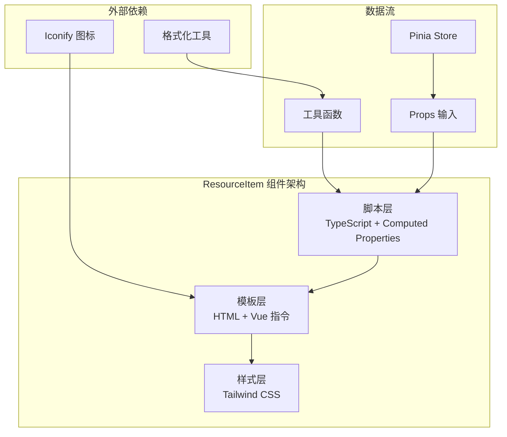
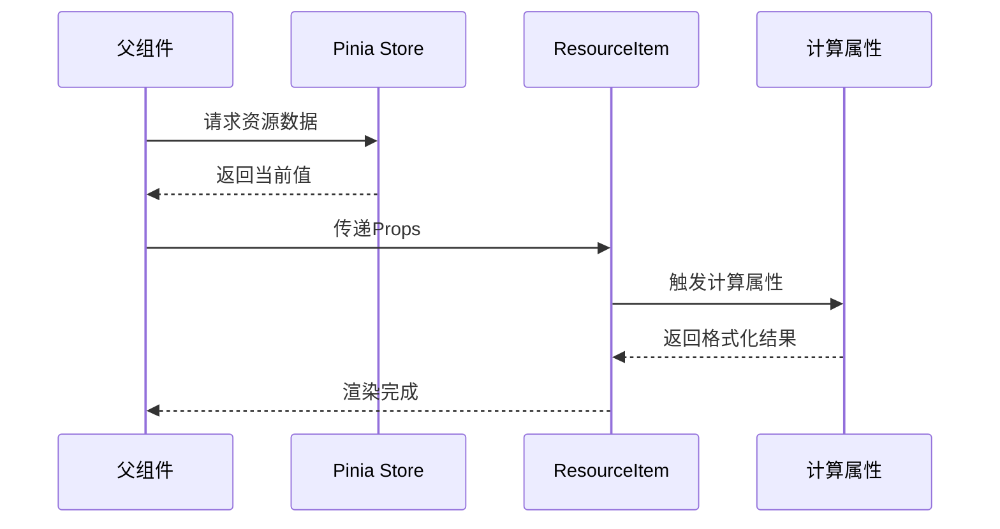
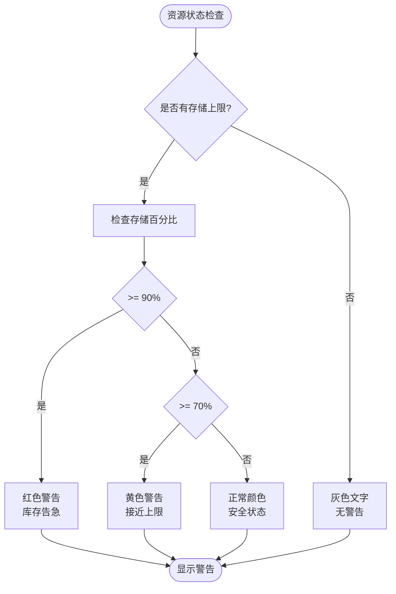
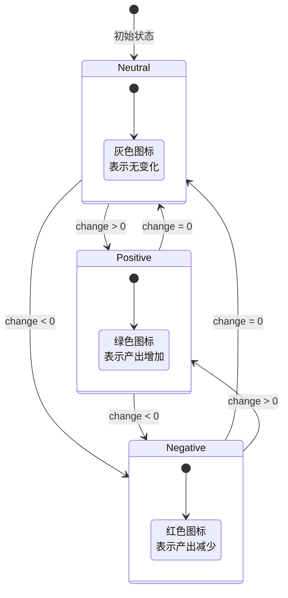
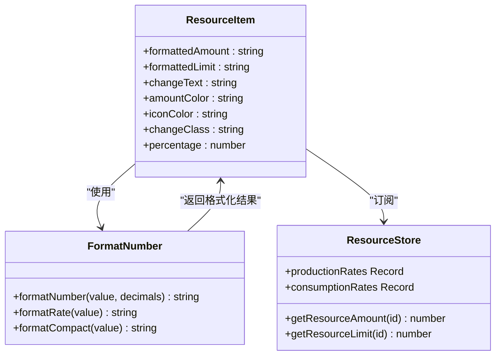
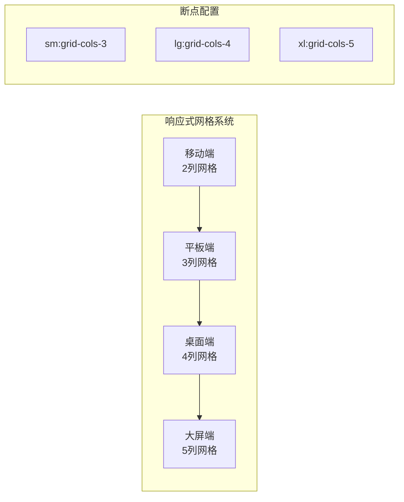
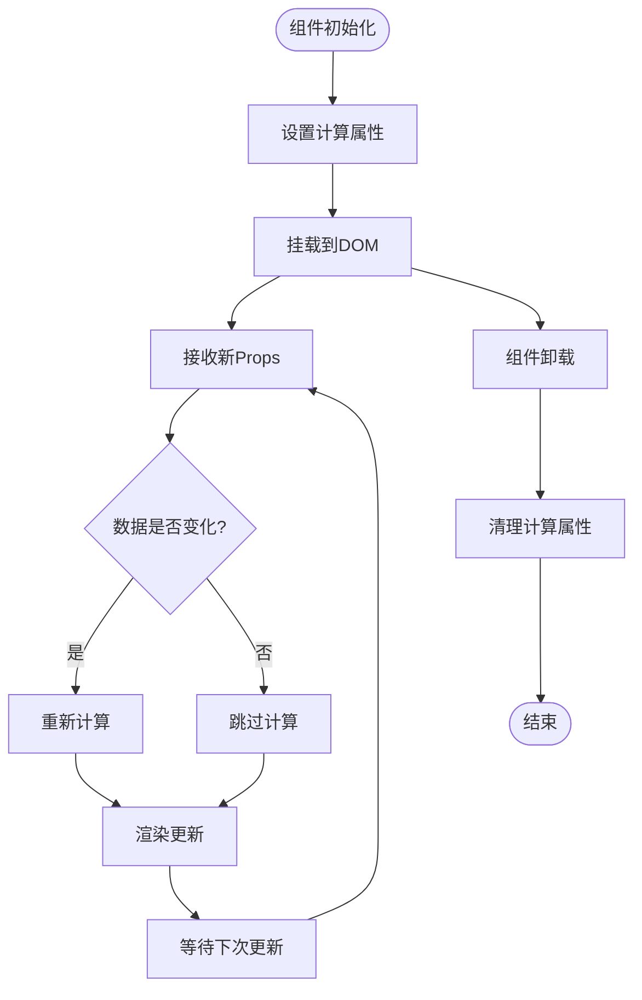
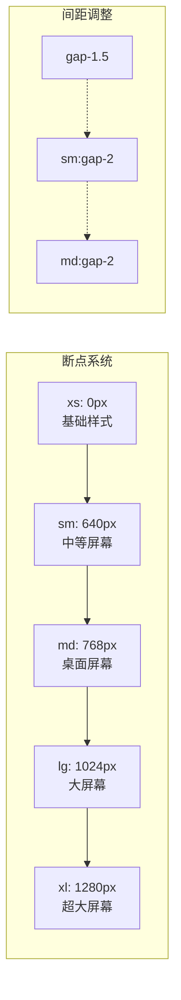

# ResourceItem 组件深度文档

<cite>
**本文档引用的文件**
- [ResourceItem.vue](file://civilization-game/src/components/ui/ResourceItem.vue)
- [ResourcePanel.vue](file://civilization-game/src/components/game/ResourcePanel.vue)
- [formatNumber.ts](file://civilization-game/src/utils/formatNumber.ts)
- [resources.ts](file://civilization-game/src/config/resources.ts)
- [resource.ts](file://civilization-game/src/stores/resource.ts)
- [useGameEngine.ts](file://civilization-game/src/composables/useGameEngine.ts)
- [index.ts](file://civilization-game/src/types/index.ts)
</cite>

## 目录
1. [简介](#简介)
2. [组件架构概览](#组件架构概览)
3. [核心属性详解](#核心属性详解)
4. [计算属性与数据绑定](#计算属性与数据绑定)
5. [视觉反馈系统](#视觉反馈系统)
6. [工具函数集成](#工具函数集成)
7. [批量渲染模式](#批量渲染模式)
8. [性能优化策略](#性能优化策略)
9. [响应式布局适配](#响应式布局适配)
10. [故障排除指南](#故障排除指南)
11. [总结](#总结)

## 简介

ResourceItem组件是文明建设游戏中资源管理系统的核心UI组件，负责以直观的方式展示各种资源的状态信息。该组件通过精心设计的数据绑定机制、动态格式化系统和视觉反馈机制，为玩家提供了清晰的资源状态可视化体验。

组件支持多种资源类型，包括基础资源（食物、木材、石头）、中级资源（铜矿、铁矿、煤炭）、高级资源（钢铁、石油、电力）以及特殊资源（黄金、知识、文化）。每个资源项都能实时反映其数量、上限、变化趋势和存储进度。

## 组件架构概览



**图表来源**
- [ResourceItem.vue](file://civilization-game/src/components/ui/ResourceItem.vue#L1-L104)

**章节来源**
- [ResourceItem.vue](file://civilization-game/src/components/ui/ResourceItem.vue#L1-L104)

## 核心属性详解

### 基础属性配置

ResourceItem组件通过以下核心属性实现灵活的资源展示：

```typescript
interface Props {
  name: string                    // 资源名称（显示文本）
  icon: string                    // 资源图标（Iconify 图标名称）
  amount: number                  // 当前资源数量
  limit?: number                  // 资源存储上限
  change?: number                 // 每秒变化量（净产出）
  showLimit?: boolean             // 是否显示存储上限
  showChange?: boolean            // 是否显示变化趋势
  showProgressBar?: boolean       // 是否显示进度条
}
```

### 属性默认值与验证

组件使用withDefaults提供智能默认值：

- `limit`: 默认为0（无上限显示）
- `change`: 默认为0（无变化趋势）
- `showLimit`: 默认为true（显示存储上限）
- `showChange`: 默认为true（显示变化趋势）
- `showProgressBar`: 默认为false（不显示进度条）

### 数据绑定机制



**图表来源**
- [ResourcePanel.vue](file://civilization-game/src/components/game/ResourcePanel.vue#L1-L47)
- [resource.ts](file://civilization-game/src/stores/resource.ts#L1-L202)

**章节来源**
- [ResourceItem.vue](file://civilization-game/src/components/ui/ResourceItem.vue#L40-L55)

## 计算属性与数据绑定

### 格式化计算属性

ResourceItem实现了多个计算属性来处理数据格式化：

```typescript
// 格式化资源数量
const formattedAmount = computed(() => {
  return formatNumber(props.amount, 1)
})

// 格式化存储上限
const formattedLimit = computed(() => {
  return formatNumber(props.limit, 1)
})

// 计算存储百分比
const percentage = computed(() => {
  if (props.limit <= 0) return 0
  return Math.min(100, (props.amount / props.limit) * 100)
})
```

### 动态颜色系统

组件通过计算属性实现智能的颜色选择：

```typescript
// 资源数量颜色
const amountColor = computed(() => {
  if (!props.showLimit || props.limit <= 0) {
    return 'text-gray-900 dark:text-white'
  }
  
  const percent = percentage.value
  if (percent >= 90) return 'text-red-600 dark:text-red-400'
  if (percent >= 70) return 'text-yellow-600 dark:text-yellow-400'
  return 'text-gray-900 dark:text-white'
})

// 图标颜色
const iconColor = computed(() => {
  if (props.change > 0) return 'text-green-500'
  if (props.change < 0) return 'text-red-500'
  return 'text-gray-500'
})

// 变化趋势颜色
const changeClass = computed(() => {
  return props.change > 0 
    ? 'text-green-600 dark:text-green-400' 
    : 'text-red-600 dark:text-red-400'
})
```

### 变化文本格式化

```typescript
// 格式化变化趋势文本
const changeText = computed(() => {
  return formatRate(props.change)
})
```

**章节来源**
- [ResourceItem.vue](file://civilization-game/src/components/ui/ResourceItem.vue#L56-L104)

## 视觉反馈系统

### 存储状态可视化

ResourceItem通过多层次的视觉反馈系统展示资源状态：



**图表来源**
- [ResourceItem.vue](file://civilization-game/src/components/ui/ResourceItem.vue#L70-L85)

### 进度条系统

对于具有存储上限的资源，组件提供渐进式进度条：

```html
<div v-if="showProgressBar && limit > 0" class="mt-1">
  <div class="w-full h-1 bg-gray-300 dark:bg-gray-600 rounded-full overflow-hidden">
    <div 
      class="h-full bg-blue-500 transition-all duration-300"
      :style="{ width: `${percentage}%` }"
    />
  </div>
</div>
```

### 图标颜色动态变化



**图表来源**
- [ResourceItem.vue](file://civilization-game/src/components/ui/ResourceItem.vue#L86-L95)

**章节来源**
- [ResourceItem.vue](file://civilization-game/src/components/ui/ResourceItem.vue#L86-L104)

## 工具函数集成

### formatNumber工具函数

ResourceItem与formatNumber工具函数紧密集成，提供智能的数字格式化：

```typescript
// 格式化大数字为可读格式
export function formatNumber(value: number, decimals: number = 2): string {
  if (value === 0) return '0'
  if (value < 0) return '-' + formatNumber(-value, decimals)
  
  // 小于1000直接显示
  if (value < 1000) {
    return value % 1 === 0 ? value.toString() : value.toFixed(decimals)
  }
  
  // 使用单位后缀
  const suffixes = ['', 'K', 'M', 'B', 'T', 'Qa', 'Qi', 'Sx', 'Sp', 'Oc', 'No', 'Dc']
  const tier = Math.floor(Math.log10(value) / 3)
  
  if (tier < suffixes.length) {
    const suffix = suffixes[tier]
    const scale = Math.pow(10, tier * 3)
    const scaled = value / scale
    return scaled.toFixed(decimals) + suffix
  }
  
  // 超大数字使用科学计数法
  return value.toExponential(decimals)
}
```

### formatRate工具函数

```typescript
// 格式化增长率
export function formatRate(value: number): string {
  const prefix = value >= 0 ? '+' : ''
  return prefix + formatNumber(value, 2) + '/秒'
}
```

### 集成方式



**图表来源**
- [ResourceItem.vue](file://civilization-game/src/components/ui/ResourceItem.vue#L56-L104)
- [formatNumber.ts](file://civilization-game/src/utils/formatNumber.ts#L1-L120)

**章节来源**
- [ResourceItem.vue](file://civilization-game/src/components/ui/ResourceItem.vue#L56-L104)
- [formatNumber.ts](file://civilization-game/src/utils/formatNumber.ts#L1-L120)

## 批量渲染模式

### ResourcePanel集成

ResourcePanel展示了ResourceItem的批量渲染能力：

```vue
<template>
  <div class="resource-panel grid grid-cols-2 sm:grid-cols-3 lg:grid-cols-4 xl:grid-cols-5 gap-2 md:gap-3">
    <ResourceItem
      v-for="resource in displayedResources"
      :key="resource.id"
      :name="resource.name"
      :icon="resource.icon"
      :amount="getAmount(resource.id)"
      :limit="getLimit(resource.id)"
      :change="getChange(resource.id)"
      :show-limit="resource.category !== 'special'"
      :show-progress-bar="resource.category !== 'special'"
    />
  </div>
</template>
```

### 动态资源过滤

```typescript
// 根据当前时代筛选应该显示的资源
const displayedResources = computed(() => {
  return resources.filter(resource => {
    const amount = resourceStore.getResourceAmount(resource.id)
    // 显示有数量的资源,或者基础资源始终显示
    return amount > 0 || resource.category === 'basic' || resource.category === 'special'
  })
})
```

### 批量数据获取

```typescript
function getAmount(resourceId: ResourceType): number {
  return resourceStore.getResourceAmount(resourceId)
}

function getLimit(resourceId: ResourceType): number {
  return resourceStore.getResourceLimit(resourceId)
}

function getChange(resourceId: ResourceType): number {
  const production = resourceStore.productionRates[resourceId] || 0
  const consumption = resourceStore.consumptionRates[resourceId] || 0
  return production - consumption
}
```

### 响应式网格布局



**图表来源**
- [ResourcePanel.vue](file://civilization-game/src/components/game/ResourcePanel.vue#L1-L47)

**章节来源**
- [ResourcePanel.vue](file://civilization-game/src/components/game/ResourcePanel.vue#L1-L47)

## 性能优化策略

### 高频率更新场景优化

在游戏引擎中，资源状态每秒更新60次（60fps），ResourceItem组件采用以下优化策略：

```typescript
// 游戏循环中的资源更新
function updateGame(deltaTime: number) {
  if (gameStore.isPaused) return
  
  // 更新资源产出
  resourceStore.updateResources(deltaTime)
  
  // 每10秒检查一次成就，优化性能
  achievementCheckCounter += deltaTime
  if (achievementCheckCounter >= 10) {
    achievementStore.checkAchievements()
    achievementCheckCounter = 0
  }
}
```

### 计算属性缓存机制

Vue的计算属性天然具备缓存特性，在资源状态不变时不会重复计算：

```typescript
// 计算属性自动缓存，只有当依赖变化时才重新计算
const percentage = computed(() => {
  if (props.limit <= 0) return 0
  return Math.min(100, (props.amount / props.limit) * 100)
})
```

### 条件渲染优化

```html
<!-- 只在需要时渲染元素，减少DOM操作 -->
<span v-if="showChange && change !== 0" :class="changeClass">
  {{ changeText }}
</span>

<div v-if="showProgressBar && limit > 0" class="mt-1">
  <div class="w-full h-1 bg-gray-300 dark:bg-gray-600 rounded-full overflow-hidden">
    <div class="h-full bg-blue-500 transition-all duration-300" :style="{ width: `${percentage}%` }" />
  </div>
</div>
```

### 内存管理



**图表来源**
- [useGameEngine.ts](file://civilization-game/src/composables/useGameEngine.ts#L1-L143)

**章节来源**
- [useGameEngine.ts](file://civilization-game/src/composables/useGameEngine.ts#L1-L143)

## 响应式布局适配

### Tailwind CSS 响应式系统

ResourceItem组件完全基于Tailwind CSS的响应式系统：

```html
<div class="resource-item flex items-center gap-1.5 md:gap-2 px-2 md:px-3 py-1.5 md:py-2 bg-gray-50 dark:bg-gray-700 rounded-lg">
  <Icon :icon="icon" class="text-lg md:text-xl flex-shrink-0" :class="iconColor" />
  
  <div class="flex-1 min-w-0">
    <!-- 内容结构 -->
  </div>
</div>
```

### 断点策略



### 字体大小适配

```css
/* 基础字体 */
.text-xs md:text-sm font-medium text-gray-700 dark:text-gray-300

/* 数量显示 */
.text-base md:text-lg font-bold truncate

/* 辅助信息 */
.text-xs md:text-sm text-gray-500 dark:text-gray-400
```

**章节来源**
- [ResourceItem.vue](file://civilization-game/src/components/ui/ResourceItem.vue#L1-L20)

## 故障排除指南

### 常见问题诊断

#### 1. 资源显示异常

**症状**: 资源数量显示为NaN或错误格式
**原因**: Props传入的amount或limit值无效
**解决方案**:
```typescript
// 确保传入有效的数值
const safeAmount = isNaN(props.amount) ? 0 : props.amount
const safeLimit = isNaN(props.limit) ? 0 : props.limit
```

#### 2. 颜色显示不正确

**症状**: 资源颜色不符合预期
**原因**: percentage计算错误或条件判断失效
**解决方案**:
```typescript
// 添加调试日志
console.log('Amount:', props.amount, 'Limit:', props.limit, 'Percentage:', percentage.value)
```

#### 3. 进度条不显示

**症状**: showProgressBar为true但进度条不出现
**原因**: limit值为0或负数
**解决方案**:
```typescript
// 确保limit大于0
const showProgressBar = computed(() => props.showProgressBar && props.limit > 0)
```

### 性能问题排查

#### 1. 渲染性能下降

**症状**: 大量ResourceItem同时渲染时卡顿
**解决方案**:
- 使用虚拟滚动技术
- 实现组件懒加载
- 优化CSS动画

#### 2. 内存泄漏

**症状**: 长时间运行后内存占用持续增长
**解决方案**:
- 确保计算属性正确缓存
- 检查事件监听器是否正确移除
- 使用Vue DevTools监控组件生命周期

### 调试工具推荐

```typescript
// 开发环境调试辅助
if (process.env.NODE_ENV === 'development') {
  // 添加详细日志
  console.log('[ResourceItem Debug]', {
    name: props.name,
    amount: props.amount,
    limit: props.limit,
    change: props.change,
    percentage: percentage.value,
    amountColor: amountColor.value,
    iconColor: iconColor.value
  })
}
```

## 总结

ResourceItem组件是一个高度优化的资源展示组件，通过以下关键特性为玩家提供了优秀的用户体验：

### 核心优势

1. **智能数据绑定**: 通过计算属性实现高效的数据绑定和自动更新
2. **动态视觉反馈**: 基于资源状态的智能颜色变化和进度条显示
3. **响应式设计**: 完整的移动优先响应式布局系统
4. **性能优化**: 针对高频更新场景的优化策略
5. **可扩展性**: 支持多种资源类型的灵活配置

### 技术亮点

- **计算属性缓存**: 充分利用Vue的响应式系统实现高性能
- **工具函数集成**: 与formatNumber等工具函数无缝集成
- **条件渲染**: 智能的条件渲染减少不必要的DOM操作
- **类型安全**: 完整的TypeScript类型定义确保开发安全性

### 应用场景

ResourceItem组件适用于：
- 游戏资源面板的批量展示
- 实时资源状态监控
- 多种资源类型的统一展示界面
- 需要动态视觉反馈的UI场景

通过合理使用这些特性，开发者可以构建出既美观又高效的资源管理系统，为玩家提供清晰直观的游戏体验。