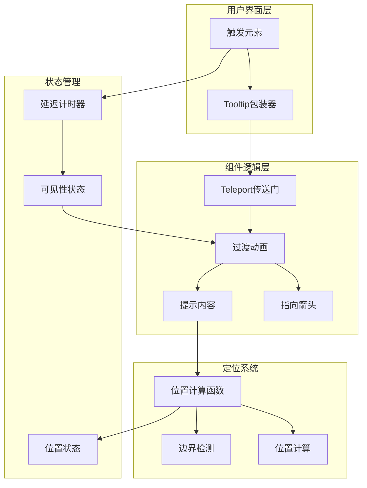
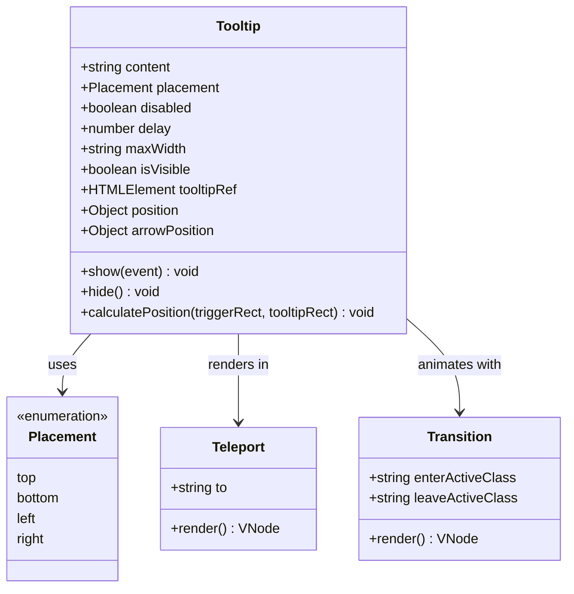

# Tooltip 组件

<cite>
**本文档引用的文件**
- [Tooltip.vue](file://civilization-game/src/components/ui/Tooltip.vue)
- [index.ts](file://civilization-game/src/components/ui/index.ts)
- [TechNode.vue](file://civilization-game/src/components/game/TechNode.vue)
- [AchievementPanel.vue](file://civilization-game/src/components/game/AchievementPanel.vue)
- [BuildingCard.vue](file://civilization-game/src/components/game/BuildingCard.vue)
- [types/index.ts](file://civilization-game/src/types/index.ts)
- [style.css](file://civilization-game/src/style.css)
</cite>

## 目录
1. [简介](#简介)
2. [核心特性](#核心特性)
3. [架构概览](#架构概览)
4. [详细组件分析](#详细组件分析)
5. [属性详解](#属性详解)
6. [使用示例](#使用示例)
7. [性能优化](#性能优化)
8. [移动端适配](#移动端适配)
9. [视觉规范](#视觉规范)
10. [故障排除指南](#故障排除指南)
11. [总结](#总结)

## 简介

Tooltip组件是一个基于Vue 3的现代化提示框组件，专为文明游戏设计。它采用Teleport技术实现脱离文档流的渲染机制，确保提示框不会影响页面布局。该组件提供了智能定位系统、延迟显示机制和边界检测算法，能够自动调整位置以确保提示框始终可见。

## 核心特性

### 基于Teleport的脱离文档流渲染
- 使用Vue 3的Teleport功能将提示框渲染到body元素下
- 避免CSS层级问题和布局干扰
- 提供更好的Z-index管理

### 智能定位系统
- 支持四种定位方向：top、bottom、left、right
- 自动计算最佳位置以避免超出视口边界
- 精确的箭头定位算法

### 延迟显示机制
- 可配置的显示延迟（默认200ms）
- 隐藏延迟（默认100ms）
- 防止频繁闪烁

### 边界检测算法
- 自动检测视口边界
- 智能调整位置以确保完全可见
- 保持与触发元素的适当间距

## 架构概览



**图表来源**
- [Tooltip.vue](file://civilization-game/src/components/ui/Tooltip.vue#L1-L201)

## 详细组件分析

### 组件结构



**图表来源**
- [Tooltip.vue](file://civilization-game/src/components/ui/Tooltip.vue#L20-L35)

### 关键方法分析

#### show() 方法
负责处理鼠标悬停事件，实现延迟显示机制：

```typescript
function show(event: MouseEvent) {
  if (props.disabled) return
  
  if (hideTimeout) {
    clearTimeout(hideTimeout)
    hideTimeout = null
  }
  
  showTimeout = window.setTimeout(async () => {
    isVisible.value = true
    
    await nextTick()
    
    if (tooltipRef.value) {
      const triggerEl = event.target as HTMLElement
      const triggerRect = triggerEl.getBoundingClientRect()
      const tooltipRect = tooltipRef.value.getBoundingClientRect()
      
      calculatePosition(triggerRect, tooltipRect)
    }
  }, props.delay)
}
```

#### hide() 方法
处理鼠标移出事件，实现隐藏延迟：

```typescript
function hide() {
  if (showTimeout) {
    clearTimeout(showTimeout)
    showTimeout = null
  }
  
  hideTimeout = window.setTimeout(() => {
    isVisible.value = false
  }, 100)
}
```

#### calculatePosition() 方法
核心定位算法，实现智能位置计算：

```typescript
function calculatePosition(triggerRect: DOMRect, tooltipRect: DOMRect) {
  const gap = 8 // 间距
  let x = 0
  let y = 0
  
  switch (props.placement) {
    case 'top':
      x = triggerRect.left + (triggerRect.width - tooltipRect.width) / 2
      y = triggerRect.top - tooltipRect.height - gap
      arrowPosition.value = {
        x: tooltipRect.width / 2 - 4,
        y: 0
      }
      break
    
    case 'bottom':
      x = triggerRect.left + (triggerRect.width - tooltipRect.width) / 2
      y = triggerRect.bottom + gap
      arrowPosition.value = {
        x: tooltipRect.width / 2 - 4,
        y: 0
      }
      break
  }
  
  // 边界检测逻辑...
}
```

**章节来源**
- [Tooltip.vue](file://civilization-game/src/components/ui/Tooltip.vue#L75-L127)

## 属性详解

### content 属性
- **类型**: `string`
- **默认值**: `undefined`
- **描述**: 提示框的文本内容。如果未设置，会使用默认插槽的内容。

### placement 属性
- **类型**: `'top' | 'bottom' | 'left' | 'right'`
- **默认值**: `'top'`
- **描述**: 定义提示框相对于触发元素的位置。组件会根据可用空间自动调整最佳位置。

### disabled 属性
- **类型**: `boolean`
- **默认值**: `false`
- **描述**: 禁用整个Tooltip组件。当设置为true时，所有交互都被禁用。

### delay 属性
- **类型**: `number`
- **默认值**: `200`
- **描述**: 显示延迟时间（毫秒）。防止快速移动鼠标时的频繁闪烁。

### maxWidth 属性
- **类型**: `string`
- **默认值**: `'300px'`
- **描述**: 设置提示框的最大宽度，支持CSS长度单位。

### isVisible 控制
- **类型**: `ref<boolean>`
- **描述**: 内部可见性状态，由组件内部管理，外部无法直接修改。

**章节来源**
- [Tooltip.vue](file://civilization-game/src/components/ui/Tooltip.vue#L20-L35)

## 使用示例

### 基本用法

```vue
<template>
  <Tooltip content="这是一个基础提示">
    <button>悬停我</button>
  </Tooltip>
</template>
```

### 不同位置的提示

```vue
<template>
  <div class="flex gap-4">
    <Tooltip content="顶部提示" placement="top">
      <button>上</button>
    </Tooltip>
    
    <Tooltip content="右侧提示" placement="right">
      <button>右</button>
    </Tooltip>
    
    <Tooltip content="底部提示" placement="bottom">
      <button>下</button>
    </Tooltip>
    
    <Tooltip content="左侧提示" placement="left">
      <button>左</button>
    </Tooltip>
  </div>
</template>
```

### 禁用状态

```vue
<template>
  <Tooltip content="禁用的提示" disabled>
    <button>不可触发</button>
  </Tooltip>
</template>
```

### 自定义延迟

```vue
<template>
  <Tooltip content="较长延迟" :delay="500">
    <button>500ms后显示</button>
  </Tooltip>
</template>
```

### 科技节点中的使用

在TechNode组件中，Tooltip常用于显示科技详情：

```vue
<template>
  <div class="tech-node">
    <div class="tech-icon">
      <Icon :icon="tech.icon" width="32" height="32" />
      <Tooltip :content="tech.description" placement="top">
        <div class="tooltip-trigger"></div>
      </Tooltip>
    </div>
  </div>
</template>
```

### 成就条目中的使用

```vue
<template>
  <div class="achievement-card">
    <div class="achievement-icon">
      <Icon :icon="achievement.icon" />
      <Tooltip :content="achievement.description" placement="top">
        <div class="tooltip-trigger"></div>
      </Tooltip>
    </div>
  </div>
</template>
```

**章节来源**
- [TechNode.vue](file://civilization-game/src/components/game/TechNode.vue#L1-L266)
- [AchievementPanel.vue](file://civilization-game/src/components/game/AchievementPanel.vue#L1-L198)

## 性能优化

### 避免过度渲染

1. **合理使用disabled属性**
   ```vue
   <Tooltip v-if="shouldShowTooltip" :content="content" :disabled="!isEnabled">
     <button>触发元素</button>
   </Tooltip>
   ```

2. **控制maxWidth避免过大容器**
   ```vue
   <Tooltip :max-width="isMobile ? '200px' : '300px'" content="内容">
     <button>触发元素</button>
   </Tooltip>
   ```

3. **使用虚拟DOM优化**
   ```vue
   <Tooltip :content="dynamicContent" :delay="0">
     <button>立即显示</button>
   </Tooltip>
   ```

### 内存管理

- 组件自动清理定时器，避免内存泄漏
- 使用nextTick确保DOM更新完成后再计算位置
- 合理设置延迟时间平衡用户体验和性能

## 移动端适配

### 触摸设备支持

```vue
<template>
  <Tooltip 
    :content="content" 
    :delay="300"
    @touchstart="handleTouchStart"
    @touchend="handleTouchEnd"
  >
    <button>触摸显示</button>
  </Tooltip>
</template>

<script setup>
function handleTouchStart() {
  // 移动端特殊处理
}

function handleTouchEnd() {
  // 移动端特殊处理
}
</script>
```

### 尺寸适配

```vue
<template>
  <Tooltip 
    :content="content" 
    :max-width="isMobile ? '250px' : '300px'"
    placement="top"
  >
    <button>响应式提示</button>
  </Tooltip>
</template>
```

## 视觉规范

### 与Icon组件结合使用

```vue
<template>
  <div class="icon-tooltip-container">
    <Icon 
      :icon="icon" 
      width="24" 
      height="24"
      class="icon-element"
    />
    <Tooltip :content="tooltipContent" placement="top">
      <div class="tooltip-overlay"></div>
    </Tooltip>
  </div>
</template>

<style>
.icon-tooltip-container {
  position: relative;
  display: inline-block;
}

.tooltip-overlay {
  position: absolute;
  top: 0;
  left: 0;
  right: 0;
  bottom: 0;
  cursor: help;
}
</style>
```

### 主题适配

```vue
<template>
  <Tooltip 
    :content="content"
    class="theme-dark"
  >
    <button>深色主题</button>
  </Tooltip>
</template>

<style>
.theme-dark .tooltip-content {
  background-color: #333;
  color: #fff;
}

.theme-dark .tooltip-arrow {
  background-color: #333;
}
</style>
```

### 动画效果

```vue
<template>
  <Tooltip 
    :content="content"
    class="animated-tooltip"
  >
    <button>带动画的提示</button>
  </Tooltip>
</template>

<style>
.animated-tooltip .tooltip-enter-active {
  transition: opacity 0.3s ease, transform 0.3s ease;
}

.animated-tooltip .tooltip-leave-active {
  transition: opacity 0.2s ease, transform 0.2s ease;
}

.animated-tooltip .tooltip-enter-from,
.animated-tooltip .tooltip-leave-to {
  opacity: 0;
  transform: translateY(-10px);
}
</style>
```

## 故障排除指南

### 常见问题及解决方案

#### 1. 提示框不显示
**原因**: `disabled`属性被设置为true或`content`为空
**解决方案**: 
```vue
<!-- 检查disabled属性 -->
<Tooltip :disabled="false" content="内容">
  <button>触发元素</button>
</Tooltip>
```

#### 2. 位置异常
**原因**: 触发元素尺寸变化或父容器定位问题
**解决方案**:
```vue
<template>
  <div class="relative">
    <Tooltip :content="content">
      <button>相对定位的触发元素</button>
    </Tooltip>
  </div>
</template>
```

#### 3. 边界检测失效
**原因**: 触发元素在iframe内或有复杂的CSS变换
**解决方案**:
```vue
<template>
  <Tooltip 
    :content="content"
    :max-width="viewportWidth > 768 ? '300px' : '200px'"
  >
    <button>响应式宽度</button>
  </Tooltip>
</template>
```

#### 4. 性能问题
**原因**: 频繁的重新渲染或大量Tooltip实例
**解决方案**:
```vue
<template>
  <div v-for="item in items" :key="item.id">
    <Tooltip 
      :content="item.content" 
      :delay="item.delay || 200"
    >
      <button>{{ item.label }}</button>
    </Tooltip>
  </div>
</template>
```

### 调试技巧

1. **启用开发模式日志**
   ```javascript
   // 在开发环境中添加调试信息
   console.log('Tooltip position:', position.value)
   console.log('Tooltip visibility:', isVisible.value)
   ```

2. **检查DOM结构**
   ```javascript
   // 检查Teleport是否正确渲染
   console.log(document.querySelector('.tooltip-content'))
   ```

3. **监控性能指标**
   ```javascript
   // 监控Tooltip的渲染性能
   performance.mark('tooltip-start')
   // ... Tooltip渲染逻辑
   performance.mark('tooltip-end')
   performance.measure('tooltip-render', 'tooltip-start', 'tooltip-end')
   ```

## 总结

Tooltip组件是一个功能完善、性能优化的现代化提示框组件。它通过以下关键特性为文明游戏提供了优秀的用户体验：

### 核心优势

1. **脱离文档流渲染**: 使用Teleport技术确保提示框不会影响页面布局
2. **智能定位系统**: 四种定位方向和自动边界检测确保提示框始终可见
3. **延迟显示机制**: 防止频繁闪烁，提升用户体验
4. **高性能设计**: 合理的内存管理和渲染优化
5. **移动端适配**: 完善的触摸设备支持

### 最佳实践

- 合理使用`disabled`属性控制显示状态
- 根据内容长度调整`maxWidth`属性
- 在移动端使用更长的延迟时间
- 结合Icon组件实现更丰富的交互体验
- 注意主题适配和视觉一致性

### 扩展建议

- 添加自定义动画效果
- 支持动态内容更新
- 实现多语言本地化
- 增加无障碍访问支持
- 优化大规模使用场景的性能

通过合理使用这些特性和遵循最佳实践，开发者可以创建出既美观又实用的提示框体验，为玩家提供清晰的信息反馈和良好的交互体验。