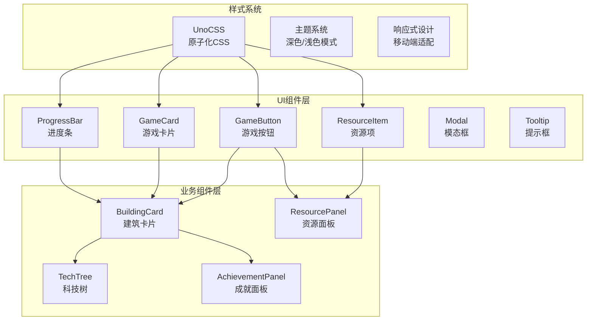
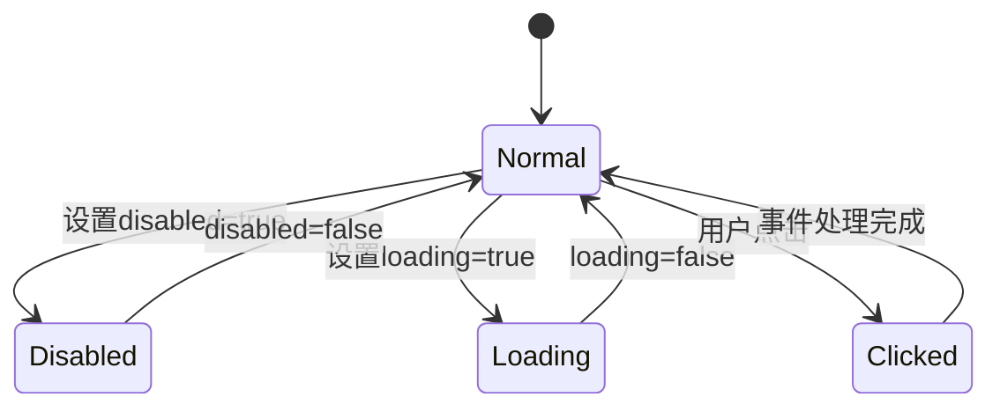
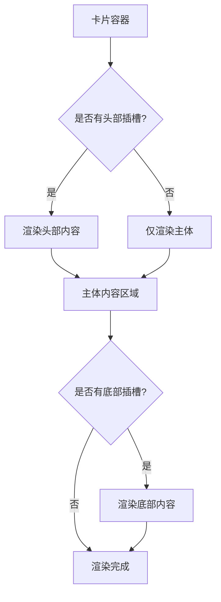
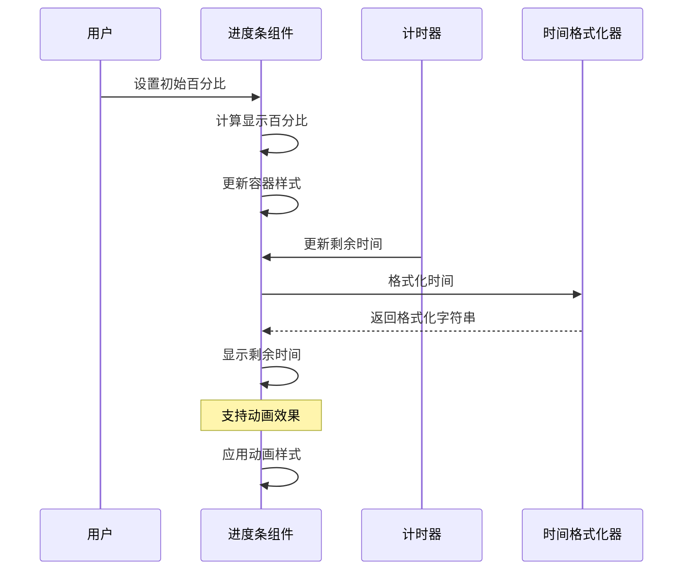
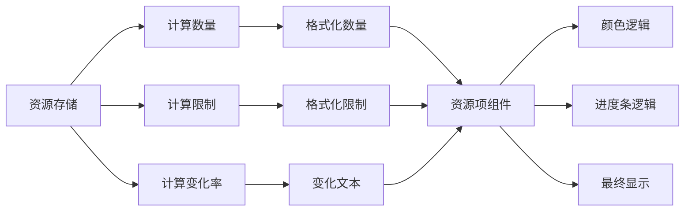
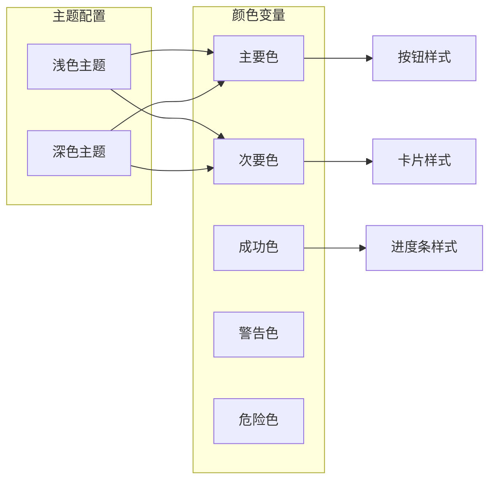
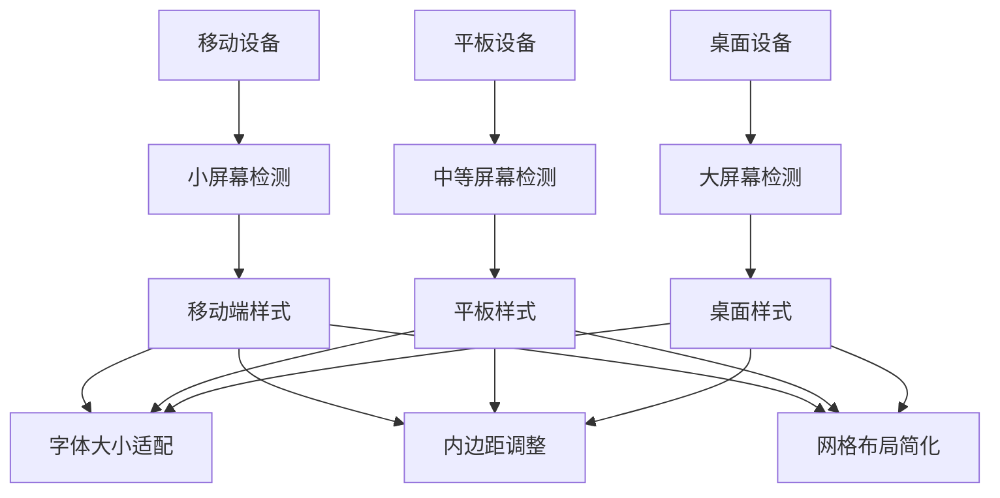

# UI组件系统文档

<cite>
**本文档引用的文件**
- [GameButton.vue](file://civilization-game/src/components/ui/GameButton.vue)
- [GameCard.vue](file://civilization-game/src/components/ui/GameCard.vue)
- [ProgressBar.vue](file://civilization-game/src/components/ui/ProgressBar.vue)
- [ResourceItem.vue](file://civilization-game/src/components/ui/ResourceItem.vue)
- [Modal.vue](file://civilization-game/src/components/ui/Modal.vue)
- [Tooltip.vue](file://civilization-game/src/components/ui/Tooltip.vue)
- [index.ts](file://civilization-game/src/components/ui/index.ts)
- [BuildingCard.vue](file://civilization-game/src/components/game/BuildingCard.vue)
- [ResourcePanel.vue](file://civilization-game/src/components/game/ResourcePanel.vue)
- [uno.config.ts](file://civilization-game/uno.config.ts)
- [style.css](file://civilization-game/src/style.css)
- [main.ts](file://civilization-game/src/main.ts)
- [resources.ts](file://civilization-game/src/config/resources.ts)
- [buildings.ts](file://civilization-game/src/config/buildings.ts)
- [types/index.ts](file://civilization-game/src/types/index.ts)
</cite>

## 目录
1. [简介](#简介)
2. [项目架构概览](#项目架构概览)
3. [核心UI组件](#核心ui组件)
4. [组件详细分析](#组件详细分析)
5. [样式系统与UnoCSS集成](#样式系统与unocss集成)
6. [游戏业务组件集成](#游戏业务组件集成)
7. [响应式设计与适配](#响应式设计与适配)
8. [最佳实践与使用指南](#最佳实践与使用指南)
9. [性能优化建议](#性能优化建议)
10. [故障排除指南](#故障排除指南)

## 简介

本游戏项目采用Vue 3 + TypeScript构建，包含一套完整的UI组件系统，专为文明建设类游戏设计。UI组件系统提供了基础的游戏界面元素，包括按钮、卡片、进度条、资源项等，支持多种视觉变体和交互状态，确保游戏体验的一致性和可访问性。

## 项目架构概览



**图表来源**
- [GameButton.vue](file://civilization-game/src/components/ui/GameButton.vue#L1-L67)
- [GameCard.vue](file://civilization-game/src/components/ui/GameCard.vue#L1-L60)
- [ProgressBar.vue](file://civilization-game/src/components/ui/ProgressBar.vue#L1-L105)
- [ResourceItem.vue](file://civilization-game/src/components/ui/ResourceItem.vue#L1-L104)

## 核心UI组件

UI组件系统包含以下核心组件：

### 组件导出结构

```typescript
// UI 组件统一导出
export { default as GameButton } from './GameButton.vue'
export { default as GameCard } from './GameCard.vue'
export { default as ProgressBar } from './ProgressBar.vue'
export { default as ResourceItem } from './ResourceItem.vue'
export { default as Modal } from './Modal.vue'
export { default as Tooltip } from './Tooltip.vue'
```

所有组件都通过统一的入口文件导出，便于模块化管理和使用。

**章节来源**
- [index.ts](file://civilization-game/src/components/ui/index.ts#L1-L8)

## 组件详细分析

### GameButton - 游戏按钮组件

GameButton是游戏界面中的核心交互元素，支持多种视觉变体和状态管理。

#### 属性配置

```typescript
interface Props {
  variant?: 'primary' | 'secondary' | 'danger' | 'success'
  disabled?: boolean
  loading?: boolean
  size?: 'sm' | 'md' | 'lg'
}
```

#### 视觉变体

- **Primary**: 主要操作按钮，蓝色背景
- **Secondary**: 次要操作按钮，紫色背景  
- **Danger**: 危险操作按钮，红色背景
- **Success**: 成功操作按钮，绿色背景

#### 尺寸规格

- **Small**: 适合内联操作，紧凑布局
- **Medium**: 默认尺寸，适用于大多数场景
- **Large**: 重要操作按钮，突出显示

#### 交互状态



**图表来源**
- [GameButton.vue](file://civilization-game/src/components/ui/GameButton.vue#L10-L15)

#### 使用示例

```vue
<!-- 基础主按钮 -->
<GameButton variant="primary" size="md" @click="handleClick">
  确认操作
</GameButton>

<!-- 加载状态 -->
<GameButton variant="primary" size="md" :loading="isLoading">
  正在处理...
</GameButton>

<!-- 禁用状态 -->
<GameButton variant="primary" size="md" :disabled="!canProceed">
  {{ buttonText }}
</GameButton>

<!-- 危险操作 -->
<GameButton variant="danger" size="sm" @click="deleteItem">
  删除项目
</GameButton>
```

**章节来源**
- [GameButton.vue](file://civilization-game/src/components/ui/GameButton.vue#L1-L67)

### GameCard - 游戏卡片组件

GameCard提供灵活的内容容器，支持头部、主体和底部插槽，适用于各种游戏界面元素。

#### 变体配置

```typescript
interface Props {
  variant?: 'default' | 'outlined' | 'elevated'
  padding?: 'none' | 'sm' | 'md' | 'lg'
  hoverable?: boolean
}
```

#### 变体特性

- **Default**: 标准卡片，带阴影效果
- **Outlined**: 边框卡片，无背景色
- **Elevated**: 浮动卡片，增强立体感

#### 插槽系统



**图表来源**
- [GameCard.vue](file://civilization-game/src/components/ui/GameCard.vue#L1-L15)

#### 使用示例

```vue
<!-- 基础卡片 -->
<GameCard>
  <div>卡片主体内容</div>
</GameCard>

<!-- 带标题的卡片 -->
<GameCard>
  <template #header>
    <h3 class="text-lg font-bold">建筑详情</h3>
  </template>
  
  <div>建筑的具体信息</div>
  
  <template #footer>
    <div class="text-right">
      <GameButton size="sm">查看详情</GameButton>
    </div>
  </template>
</GameCard>

<!-- 可悬停的卡片 -->
<GameCard variant="elevated" hoverable>
  <div>悬停时会有放大效果</div>
</GameCard>
```

**章节来源**
- [GameCard.vue](file://civilization-game/src/components/ui/GameCard.vue#L1-L60)

### ProgressBar - 游戏进度条组件

ProgressBar专门设计用于显示游戏进程、升级进度和资源填充状态。

#### 属性配置

```typescript
interface Props {
  percentage: number
  label?: string
  showLabel?: boolean
  showText?: boolean
  showTime?: boolean
  estimatedTime?: number
  color?: 'blue' | 'green' | 'yellow' | 'red' | 'purple'
  height?: 'sm' | 'md' | 'lg'
  animated?: boolean
}
```

#### 时间格式化

```typescript
function formatTime(seconds: number): string {
  if (seconds < 60) {
    return `${Math.floor(seconds)}秒`
  } else if (seconds < 3600) {
    const minutes = Math.floor(seconds / 60)
    const secs = Math.floor(seconds % 60)
    return `${minutes}分${secs}秒`
  } else {
    const hours = Math.floor(seconds / 3600)
    const minutes = Math.floor((seconds % 3600) / 60)
    return `${hours}小时${minutes}分`
  }
}
```

#### 进度条状态



**图表来源**
- [ProgressBar.vue](file://civilization-game/src/components/ui/ProgressBar.vue#L70-L85)

#### 使用示例

```vue
<!-- 基础进度条 -->
<ProgressBar :percentage="75" />

<!-- 带标签和时间显示 -->
<ProgressBar 
  :percentage="progress"
  :estimated-time="remainingTime"
  show-label
  show-text
  show-time
  label="建造进度"
/>

<!-- 自定义颜色和高度 -->
<ProgressBar 
  :percentage="health"
  color="red"
  height="lg"
  :animated="false"
/>
```

**章节来源**
- [ProgressBar.vue](file://civilization-game/src/components/ui/ProgressBar.vue#L1-L105)

### ResourceItem - 游戏资源项组件

ResourceItem是资源管理的核心组件，提供资源数量、限制、变化率的可视化展示。

#### 数据绑定属性

```typescript
interface Props {
  name: string
  icon: string
  amount: number
  limit?: number
  change?: number
  showLimit?: boolean
  showChange?: boolean
  showProgressBar?: boolean
}
```

#### 可视化规则

- **数量颜色**: 根据资源使用率动态调整
  - 90%+: 红色警告
  - 70%+: 黄色提醒
  - 正常: 灰色文本

- **图标颜色**: 根据变化趋势显示
  - 正增长: 绿色
  - 负增长: 红色
  - 平衡: 灰色

#### 实时更新机制



**图表来源**
- [ResourceItem.vue](file://civilization-game/src/components/ui/ResourceItem.vue#L40-L80)

#### 使用示例

```vue
<!-- 基础资源项 -->
<ResourceItem 
  name="食物"
  icon="game-icons:meal"
  :amount="foodAmount"
  :limit="foodLimit"
/>

<!-- 带变化率和进度条 -->
<ResourceItem 
  name="人口"
  icon="game-icons:people"
  :amount="population"
  :limit="populationLimit"
  :change="populationGrowth"
  show-change
  show-progress-bar
/>

<!-- 特殊资源 -->
<ResourceItem 
  name="金币"
  icon="game-icons:coins"
  :amount="gold"
  :limit="goldLimit"
  :change="goldPerSecond"
  show-limit
/>
```

**章节来源**
- [ResourceItem.vue](file://civilization-game/src/components/ui/ResourceItem.vue#L1-L104)

## 样式系统与UnoCSS集成

项目采用UnoCSS作为原子化CSS框架，提供高效的样式管理和主题支持。

### UnoCSS配置

```typescript
export default defineConfig({
  presets: [
    presetUno(),
    presetAttributify(),
    presetIcons({
      scale: 1.2,
      warn: true
    })
  ],
  theme: {
    colors: {
      primary: '#3b82f6',
      secondary: '#8b5cf6',
      success: '#10b981',
      warning: '#f59e0b',
      danger: '#ef4444',
      dark: '#1e293b',
      light: '#f1f5f9'
    }
  },
  shortcuts: {
    'btn': 'px-4 py-2 rounded-lg cursor-pointer transition-all duration-200',
    'btn-primary': 'btn bg-primary text-white hover:bg-blue-600',
    'btn-secondary': 'btn bg-secondary text-white hover:bg-purple-600',
    'btn-disabled': 'btn bg-gray-400 text-gray-200 cursor-not-allowed',
    'card': 'bg-white dark:bg-gray-800 rounded-lg shadow-md p-4',
    'input': 'px-3 py-2 border border-gray-300 rounded-md focus:outline-none focus:ring-2 focus:ring-primary'
  }
})
```

### 主题系统



**图表来源**
- [uno.config.ts](file://civilization-game/uno.config.ts#L1-L32)

### 响应式断点

- **Mobile**: 最小宽度320px
- **Tablet**: 最小宽度640px  
- **Desktop**: 最小宽度1024px
- **Large Desktop**: 最小宽度1280px

**章节来源**
- [uno.config.ts](file://civilization-game/uno.config.ts#L1-L32)
- [style.css](file://civilization-game/src/style.css#L1-L80)

## 游戏业务组件集成

UI组件在游戏业务组件中发挥重要作用，以下是典型的应用场景。

### BuildingCard - 建筑卡片集成

BuildingCard展示了如何将多个UI组件组合使用：

```vue
<template>
  <GameCard :hoverable="!isDisabled" class="building-card">
    <!-- 头部插槽 -->
    <template #header>
      <div class="flex items-start md:items-center justify-between gap-2">
        <div class="flex items-start md:items-center gap-2">
          <Icon :icon="building.icon" class="text-2xl text-blue-500" />
          <div>
            <h3 class="text-base font-bold">{{ building.name }}</h3>
            <p class="text-xs text-gray-600">{{ building.description }}</p>
          </div>
        </div>
      </div>
    </template>

    <!-- 主体内容 -->
    <div class="space-y-2">
      <!-- 生产信息 -->
      <div v-if="production">
        <div class="text-xs font-semibold text-gray-700">产出:</div>
        <div class="flex flex-wrap gap-1">
          <div v-for="(amount, resource) in production" :key="resource">
            <span>+{{ amount.toFixed(1) }}/s</span>
          </div>
        </div>
      </div>

      <!-- 成本信息 -->
      <div>
        <div class="text-xs font-semibold">建造成本:</div>
        <div class="flex flex-wrap gap-1">
          <div v-for="(amount, resource) in cost" :key="resource">
            <span>{{ amount }}</span>
          </div>
        </div>
      </div>
    </div>

    <!-- 进度条 -->
    <div v-if="showProgress">
      <ProgressBar
        :percentage="progress"
        :estimated-time="remainingTime"
        :show-time="true"
        color="blue"
      />
    </div>

    <!-- 底部按钮 -->
    <template #footer>
      <GameButton
        :disabled="!canBuild"
        :variant="canBuild ? 'primary' : 'secondary'"
        size="sm"
        @click="handleBuild"
      >
        {{ instance ? '升级' : '建造' }}
      </GameButton>
    </template>
  </GameCard>
</template>
```

### ResourcePanel - 资源面板集成

ResourcePanel展示了批量使用ResourceItem组件的方式：

```vue
<template>
  <div class="resource-panel grid grid-cols-2 sm:grid-cols-3 lg:grid-cols-4 xl:grid-cols-5 gap-2">
    <ResourceItem
      v-for="resource in displayedResources"
      :key="resource.id"
      :name="resource.name"
      :icon="resource.icon"
      :amount="getAmount(resource.id)"
      :limit="getLimit(resource.id)"
      :change="getChange(resource.id)"
      :show-limit="resource.category !== 'special'"
      :show-progress-bar="resource.category !== 'special'"
    />
  </div>
</template>
```

**章节来源**
- [BuildingCard.vue](file://civilization-game/src/components/game/BuildingCard.vue#L1-L237)
- [ResourcePanel.vue](file://civilization-game/src/components/game/ResourcePanel.vue#L1-L49)

## 响应式设计与适配

### 移动端适配策略



### 具体适配实现

```css
/* 响应式断点 */
.resource-item {
  /* 移动端 */
  @media (max-width: 640px) {
    padding: 0.5rem;
    gap: 0.5rem;
  }
  
  /* 平板端 */
  @media (min-width: 641px) and (max-width: 1024px) {
    padding: 0.75rem;
    gap: 0.75rem;
  }
  
  /* 桌面端 */
  @media (min-width: 1025px) {
    padding: 1rem;
    gap: 1rem;
  }
}
```

### 图标缩放策略

```typescript
// UnoCSS配置中的图标缩放
presetIcons({
  scale: 1.2,  // 图标放大1.2倍
  warn: true   // 启用警告
})
```

## 最佳实践与使用指南

### 组件使用原则

1. **语义化使用**: 根据功能选择合适的组件变体
2. **一致性**: 在相同场景下保持组件风格一致
3. **可访问性**: 确保足够的对比度和适当的尺寸
4. **性能**: 合理使用插槽和动态内容

### 推荐的使用模式

```vue
<!-- 按钮使用模式 -->
<GameButton 
  variant="primary" 
  :disabled="loading"
  :loading="processing"
  @click="handleSubmit"
>
  {{ loading ? '处理中...' : '提交' }}
</GameButton>

<!-- 卡片使用模式 -->
<GameCard variant="elevated" hoverable>
  <template #header>
    <h3 class="text-lg font-bold">{{ title }}</h3>
  </template>
  
  <div class="space-y-2">
    <slot />
  </div>
  
  <template #footer>
    <div class="flex justify-end gap-2">
      <GameButton size="sm" @click="cancel">取消</GameButton>
      <GameButton variant="primary" size="sm" @click="confirm">确认</GameButton>
    </div>
  </template>
</GameCard>
```

### 错误处理模式

```vue
<!-- 容错组件包装 -->
<template>
  <GameCard v-if="componentData" variant="outlined">
    <template #header>
      <h3>{{ componentData.title }}</h3>
    </template>
    
    <div v-if="componentData.content">
      {{ componentData.content }}
    </div>
    
    <div v-else class="text-center text-gray-500">
      内容加载失败，请重试
    </div>
  </GameCard>
  
  <GameCard v-else variant="danger">
    <div class="text-center">
      <Icon icon="mdi:alert-circle" class="text-2xl" />
      <p class="mt-2">组件初始化失败</p>
    </div>
  </GameCard>
</template>
```

## 性能优化建议

### 组件懒加载

```typescript
// 对于大型组件使用动态导入
const LazyBuildingCard = defineAsyncComponent(() =>
  import('@/components/ui/BuildingCard.vue')
)
```

### 虚拟滚动

```vue
<!-- 对于大量列表使用虚拟滚动 -->
<template>
  <VirtualList
    :items="resourceItems"
    :item-height="48"
    :container-height="600"
  >
    <template #default="{ item }">
      <ResourceItem
        :name="item.name"
        :icon="item.icon"
        :amount="item.amount"
        :limit="item.limit"
      />
    </template>
  </VirtualList>
</template>
```

### 缓存策略

```typescript
// 使用computed缓存复杂计算
const formattedAmount = computed(() => {
  return formatNumber(props.amount, 1)
})

const percentage = computed(() => {
  if (props.limit <= 0) return 0
  return Math.min(100, (props.amount / props.limit) * 100)
})
```

## 故障排除指南

### 常见问题与解决方案

#### 1. 样式不生效

**问题**: 组件样式没有正确应用
**解决方案**: 
- 检查UnoCSS配置是否正确导入
- 确认CSS类名拼写正确
- 验证主题配置是否包含所需颜色

#### 2. 组件交互异常

**问题**: 按钮点击无响应或状态异常
**解决方案**:
- 检查disabled和loading属性设置
- 验证事件监听器绑定
- 确认组件内部状态逻辑

#### 3. 响应式布局问题

**问题**: 在不同设备上显示异常
**解决方案**:
- 检查断点设置
- 验证媒体查询语法
- 确认Flexbox/Grid布局配置

#### 4. 性能问题

**问题**: 组件渲染缓慢或卡顿
**解决方案**:
- 使用v-memo缓存静态内容
- 实现虚拟滚动
- 优化复杂计算逻辑

### 调试技巧

```typescript
// 开发环境调试
if (process.env.NODE_ENV === 'development') {
  console.log('Component props:', props)
  console.log('Computed values:', {
    formattedAmount: formattedAmount.value,
    percentage: percentage.value
  })
}
```

### 测试建议

```vue
<!-- 单元测试示例 -->
<template>
  <GameButton ref="testButton" @click="handleTestClick">
    测试按钮
  </GameButton>
</template>

<script setup>
const testButton = ref(null)

// 测试方法
async function testButtonClick() {
  await testButton.value.$el.click()
  expect(handleTestClick).toHaveBeenCalled()
}
</script>
```

通过遵循这些最佳实践和故障排除指南，开发者可以有效地使用和维护UI组件系统，确保游戏界面的一致性和用户体验的质量。