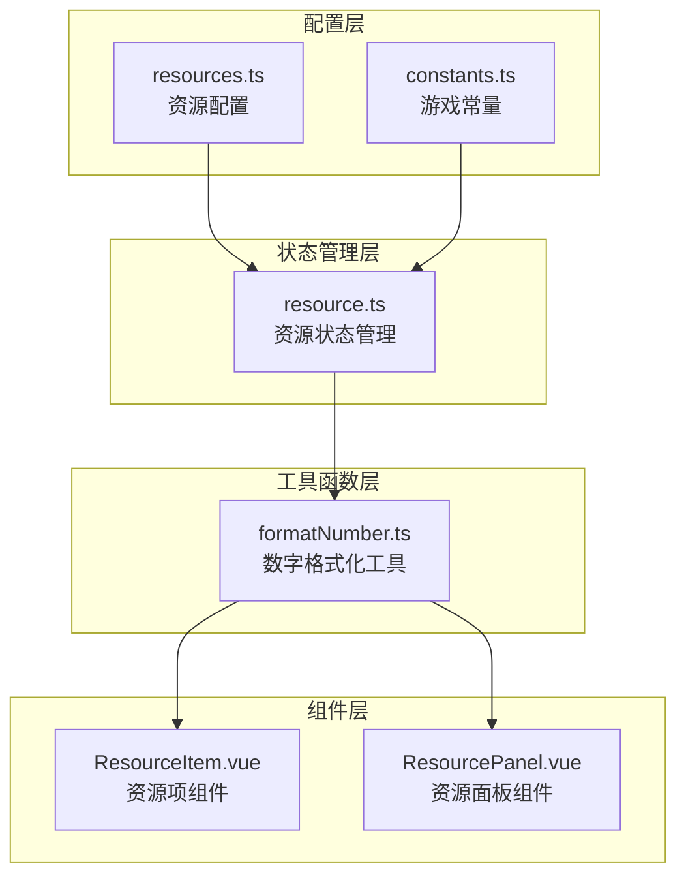
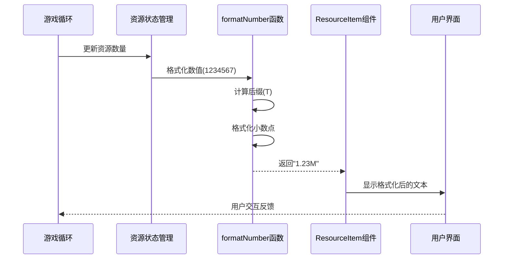
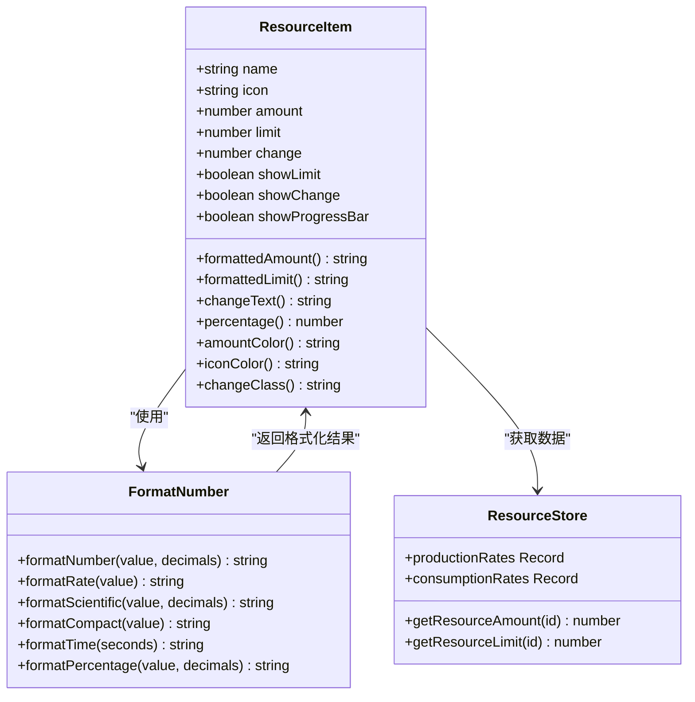
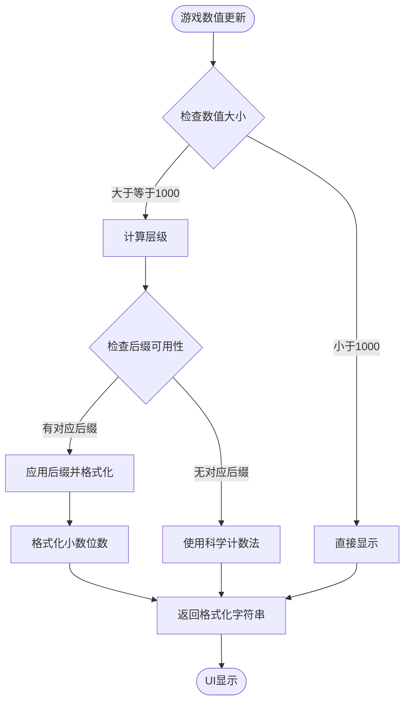
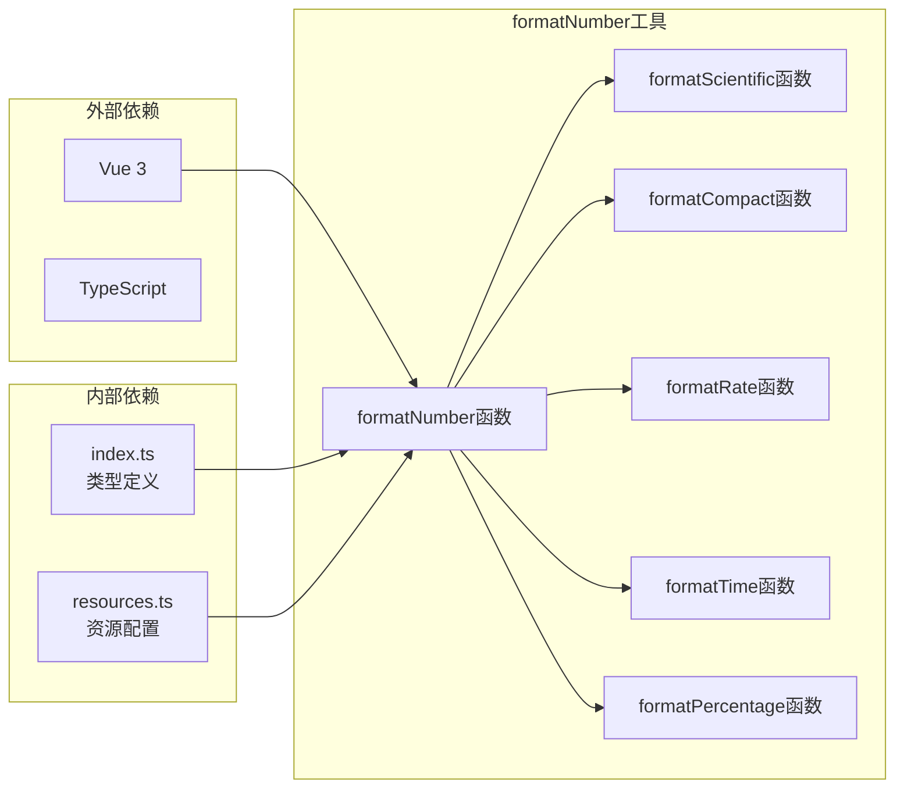

# 工具函数文档

<cite>
**本文档中引用的文件**
- [formatNumber.ts](file://civilization-game/src/utils/formatNumber.ts)
- [ResourceItem.vue](file://civilization-game/src/components/ui/ResourceItem.vue)
- [ResourcePanel.vue](file://civilization-game/src/components/game/ResourcePanel.vue)
- [resource.ts](file://civilization-game/src/stores/resource.ts)
- [resources.ts](file://civilization-game/src/config/resources.ts)
- [constants.ts](file://civilization-game/src/config/constants.ts)
- [index.ts](file://civilization-game/src/types/index.ts)
</cite>

## 目录
1. [简介](#简介)
2. [项目结构](#项目结构)
3. [核心组件](#核心组件)
4. [架构概览](#架构概览)
5. [详细组件分析](#详细组件分析)
6. [依赖关系分析](#依赖关系分析)
7. [性能考虑](#性能考虑)
8. [故障排除指南](#故障排除指南)
9. [结论](#结论)

## 简介

本文档专注于分析文明游戏项目中的formatNumber工具函数，这是一个专门用于格式化大数值的实用工具。该函数在游戏后期处理巨大数值时发挥着关键作用，将复杂的数字转换为用户友好的可读格式，如"1.23M"或"4.56T"，极大地提升了用户体验。

formatNumber函数是游戏UI系统的核心组成部分，特别是在ResourceItem组件中广泛使用，用于显示各种资源的数量、存储上限和变化率。随着玩家进入太空时代甚至更高阶段，资源数量可能达到天文数字级别，这种格式化功能变得不可或缺。

## 项目结构

文明游戏采用模块化的Vue 3 + TypeScript架构，工具函数位于`src/utils/`目录下，与其他核心模块保持清晰的分离。



**图表来源**
- [formatNumber.ts](file://civilization-game/src/utils/formatNumber.ts#L1-L48)
- [ResourceItem.vue](file://civilization-game/src/components/ui/ResourceItem.vue#L1-L104)
- [resource.ts](file://civilization-game/src/stores/resource.ts#L1-L202)

**章节来源**
- [formatNumber.ts](file://civilization-game/src/utils/formatNumber.ts#L1-L118)
- [ResourceItem.vue](file://civilization-game/src/components/ui/ResourceItem.vue#L1-L104)

## 核心组件

### formatNumber函数

formatNumber函数是整个工具库的核心，负责将大数值转换为可读格式。该函数采用智能算法，根据数值大小自动选择合适的表示方式。

```typescript
export function formatNumber(value: number, decimals: number = 2): string {
  if (value === 0) return '0'
  if (value < 0) return '-' + formatNumber(-value, decimals)
  
  // 小于1000直接显示
  if (value < 1000) {
    return value % 1 === 0 ? value.toString() : value.toFixed(decimals)
  }
  
  // 使用单位后缀
  const suffixes = ['', 'K', 'M', 'B', 'T', 'Qa', 'Qi', 'Sx', 'Sp', 'Oc', 'No', 'Dc']
  const tier = Math.floor(Math.log10(value) / 3)
  
  if (tier === 0) {
    return value.toFixed(decimals)
  }
  
  if (tier < suffixes.length) {
    const suffix = suffixes[tier]
    const scale = Math.pow(10, tier * 3)
    const scaled = value / scale
    return scaled.toFixed(decimals) + suffix
  }
  
  // 超大数字使用科学计数法
  return value.toExponential(decimals)
}
```

### 支持的后缀系统

formatNumber函数支持完整的后缀系统，涵盖从千(K)到十垓(Dc)的所有标准计量单位：

- K (千) - 10³
- M (百万) - 10⁶  
- B (十亿) - 10⁹
- T (万亿) - 10¹²
- Qa (千万亿) - 10¹⁵
- Qi (十垓) - 10¹⁸
- Sx (百垓) - 10²¹
- Sp (千垓) - 10²⁴
- Oc (亿垓) - 10²⁷
- No (十亿垓) - 10³⁰
- Dc (百亿垓) - 10³³

这种设计确保了即使在游戏达到超维时代时，也能优雅地处理极其庞大的数值。

**章节来源**
- [formatNumber.ts](file://civilization-game/src/utils/formatNumber.ts#L8-L48)

## 架构概览

formatNumber工具函数在整个游戏架构中扮演着桥梁角色，连接着底层的数据处理和上层的用户界面展示。



**图表来源**
- [resource.ts](file://civilization-game/src/stores/resource.ts#L100-L120)
- [ResourceItem.vue](file://civilization-game/src/components/ui/ResourceItem.vue#L40-L50)

## 详细组件分析

### ResourceItem组件集成

ResourceItem组件是formatNumber函数的主要使用者，它展示了如何在实际UI中应用数字格式化功能。



**图表来源**
- [ResourceItem.vue](file://civilization-game/src/components/ui/ResourceItem.vue#L30-L80)
- [formatNumber.ts](file://civilization-game/src/utils/formatNumber.ts#L8-L48)

#### 核心格式化逻辑

ResourceItem组件通过以下方式集成formatNumber函数：

1. **资源数量格式化**：`formattedAmount = formatNumber(props.amount, 1)`
2. **存储上限格式化**：`formattedLimit = formatNumber(props.limit, 1)`
3. **变化率格式化**：`changeText = formatRate(props.change)`

这种设计确保了所有数值都以一致的方式显示，无论其大小范围如何。

### 其他辅助函数

除了主要的formatNumber函数外，工具库还提供了多个专门用途的格式化函数：

#### formatScientific函数
用于科学计数法显示，适用于特别巨大的数值：
```typescript
export function formatScientific(value: number, decimals: number = 2): string {
  if (value === 0) return '0'
  return value.toExponential(decimals)
}
```

#### formatCompact函数
专为紧凑空间设计的简化格式化：
```typescript
export function formatCompact(value: number): string {
  if (value < 1000) return Math.floor(value).toString()
  if (value < 1000000) return (value / 1000).toFixed(1) + 'K'
  if (value < 1000000000) return (value / 1000000).toFixed(1) + 'M'
  if (value < 1000000000000) return (value / 1000000000).toFixed(1) + 'B'
  return (value / 1000000000000).toFixed(1) + 'T'
}
```

#### formatRate函数
专门用于显示每秒变化率：
```typescript
export function formatRate(value: number): string {
  const prefix = value >= 0 ? '+' : ''
  return prefix + formatNumber(value, 2) + '/秒'
}
```

**章节来源**
- [ResourceItem.vue](file://civilization-game/src/components/ui/ResourceItem.vue#L40-L50)
- [formatNumber.ts](file://civilization-game/src/utils/formatNumber.ts#L50-L118)

### 数据流分析



**图表来源**
- [formatNumber.ts](file://civilization-game/src/utils/formatNumber.ts#L8-L48)

## 依赖关系分析

formatNumber工具函数具有最小的外部依赖，这使得它易于维护和测试。



**图表来源**
- [formatNumber.ts](file://civilization-game/src/utils/formatNumber.ts#L1-L118)
- [index.ts](file://civilization-game/src/types/index.ts#L1-L198)

**章节来源**
- [formatNumber.ts](file://civilization-game/src/utils/formatNumber.ts#L1-L118)
- [ResourceItem.vue](file://civilization-game/src/components/ui/ResourceItem.vue#L1-L104)

## 性能考虑

formatNumber函数经过精心优化，确保在游戏运行时不会成为性能瓶颈：

### 算法复杂度分析
- **时间复杂度**：O(1)，所有操作都是常数时间
- **空间复杂度**：O(1)，不使用额外的内存分配
- **计算开销**：仅涉及简单的数学运算和数组索引

### 优化策略
1. **缓存计算结果**：对于重复的数值格式化，可以考虑缓存机制
2. **批量处理**：在需要格式化大量数值时，可以批量调用函数
3. **延迟计算**：只在数值真正需要显示时才进行格式化

### 内存使用
formatNumber函数完全避免了内存分配，所有操作都在栈上完成，这对于频繁调用的UI组件至关重要。

## 故障排除指南

### 常见问题及解决方案

#### 问题1：数值显示异常
**症状**：资源数量显示为NaN或Infinity
**原因**：传入了无效的数值参数
**解决方案**：
```typescript
// 在调用前验证输入
if (isNaN(value) || !isFinite(value)) {
  return '0'
}
```

#### 问题2：小数位数不正确
**症状**：格式化后的数值小数位数超过预期
**原因**：decimals参数设置不当
**解决方案**：
```typescript
// 明确指定小数位数
const formatted = formatNumber(value, 2) // 始终显示两位小数
```

#### 问题3：负数格式化错误
**症状**：负数显示为"-1.23M"而不是"-1.23M"
**原因**：递归调用未正确处理符号
**解决方案**：函数已内置负数处理逻辑，无需额外处理

**章节来源**
- [formatNumber.ts](file://civilization-game/src/utils/formatNumber.ts#L8-L48)

## 结论

formatNumber工具函数是文明游戏架构中的关键组件，它成功解决了游戏后期处理巨大数值的技术挑战。通过智能的后缀系统、科学计数法支持和简洁的API设计，该函数为玩家提供了直观的数值显示体验。

### 主要优势
1. **可扩展性**：支持从千到十垓的完整后缀系统
2. **易用性**：简单直观的API设计，只需传入数值即可获得格式化结果
3. **性能**：常数时间复杂度，适合高频调用场景
4. **准确性**：精确的小数位控制和科学计数法支持

### 应用价值
在文明游戏中，随着玩家发展到太空时代甚至更高阶段，资源数量可能达到10^12以上的级别。formatNumber函数确保这些数值能够以用户友好的方式显示，大大提升了游戏的可玩性和用户体验。

该工具函数的设计体现了现代前端开发的最佳实践，包括清晰的职责分离、最小依赖原则和优秀的错误处理。它不仅满足了当前的游戏需求，也为未来的功能扩展奠定了坚实的基础。