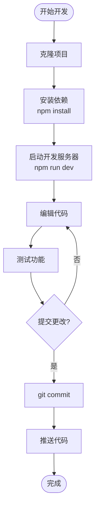
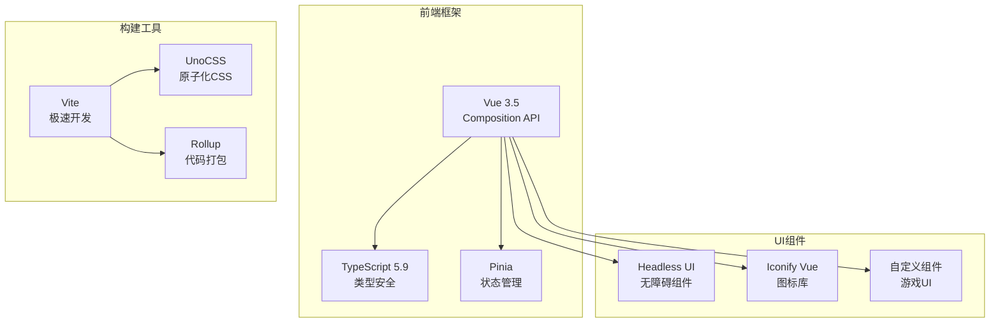
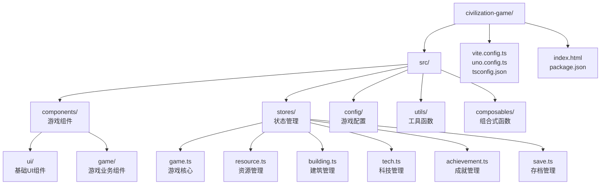

# 快速开始

<cite>
**本文档引用的文件**
- [package.json](file://civilization-game/package.json)
- [vite.config.ts](file://civilization-game/vite.config.ts)
- [README.md](file://README.md)
- [tsconfig.json](file://civilization-game/tsconfig.json)
- [tsconfig.app.json](file://civilization-game/tsconfig.app.json)
</cite>

## 目录
1. [项目简介](#项目简介)
2. [环境要求](#环境要求)
3. [项目设置](#项目设置)
4. [开发流程](#开发流程)
5. [技术架构](#技术架构)
6. [配置详解](#配置详解)
7. [常见问题解决](#常见问题解决)
8. [最佳实践](#最佳实践)

## 项目简介

这是一个基于Vue 3 + TypeScript开发的纯前端文明发展模拟游戏，从石器时代发展到超维时代，体验人类文明的完整演进历程。游戏采用现代化前端技术栈，提供流畅的60fps游戏体验和丰富的游戏玩法。

### 核心特色
- 🏗️ **丰富建筑系统** - 86个独特建筑，覆盖8个文明时代
- 🔬 **完整科技树** - 55+个科技，逐步解锁高级功能
- 🏆 **成就系统** - 50个成就等待解锁，每个都有独特奖励
- ⏱️ **离线收益** - 离线时也能积累资源（最多8小时）
- 📱 **移动端适配** - 完美支持手机、平板、桌面多端体验
- 💾 **智能存档** - 自动保存+压缩，存档体积减少50%
- ⚡ **高性能** - 60fps流畅运行，实时FPS监控

## 环境要求

### Node.js 和 npm 版本要求

```bash
# 检查Node.js版本
node --version
# 应该 >= 18.0.0

# 检查npm版本
npm --version
# 应该 >= 9.0.0
```

### 推荐环境配置

- **操作系统**：Windows 10+, macOS 10.15+, 或 Linux
- **内存**：至少4GB RAM
- **存储**：至少2GB可用空间
- **网络**：稳定的互联网连接（用于下载依赖）

## 项目设置

### 步骤1：克隆项目

```bash
# 克隆项目到本地
git clone https://github.com/18567359392/game.git

# 进入项目目录
cd game/civilization-game
```

### 步骤2：安装依赖

```bash
# 安装所有必要的依赖包
npm install
```

**安装过程说明**：
- 下载并安装Vue 3.5.22
- 安装TypeScript 5.9.3
- 安装Vite构建工具
- 安装Pinia状态管理
- 安装各种开发工具和库

### 步骤3：验证安装

```bash
# 检查依赖是否正确安装
npm list vue pinia vite typescript
```

## 开发流程

### 启动开发服务器

```bash
# 启动开发服务器
npm run dev
```

**开发服务器特性**：
- 启动在 http://localhost:5173/
- 支持热模块替换(HMR)
- 实时错误提示
- 支持TypeScript类型检查

### 开发工作流



**图表来源**
- [package.json](file://civilization-game/package.json#L6-L10)

### 构建生产版本

```bash
# 生产构建
npm run build

# 预览构建结果
npm run preview
```

**构建过程说明**：
- TypeScript编译
- 代码压缩和混淆
- 资源优化
- 生成静态文件

## 技术架构

### 核心技术栈



**图表来源**
- [package.json](file://civilization-game/package.json#L12-L28)
- [vite.config.ts](file://civilization-game/vite.config.ts#L8-L15)

### 项目结构概览



**图表来源**
- [README.md](file://README.md#L200-L250)

## 配置详解

### package.json 脚本配置

```json
{
  "scripts": {
    "dev": "vite",
    "build": "vue-tsc -b && vite build",
    "preview": "vite preview"
  }
}
```

**脚本说明**：
- `dev`：启动开发服务器，支持热重载
- `build`：先进行TypeScript编译，然后构建生产版本
- `preview`：预览生产构建结果

### Vite 配置详解

```typescript
export default defineConfig({
  plugins: [
    vue({
      script: {
        defineModel: true,
        propsDestructure: true
      }
    }),
    UnoCSS()
  ],
  resolve: {
    alias: {
      '@': fileURLToPath(new URL('./src', import.meta.url))
    }
  },
  build: {
    target: 'es2020',
    rollupOptions: {
      output: {
        manualChunks(id) {
          if (id.includes('node_modules')) {
            if (id.includes('vue') || id.includes('pinia')) {
              return 'vue-vendor'
            }
            if (id.includes('@iconify')) {
              return 'iconify'
            }
          }
        }
      }
    },
    chunkSizeWarningLimit: 1000,
    minify: 'esbuild'
  }
})
```

**配置要点**：
- **插件设置**：Vue 3.5 + UnoCSS
- **别名配置**：`@`指向`src`目录
- **代码分割**：Vue相关库独立打包
- **性能优化**：ES2020目标 + esbuild压缩

### TypeScript 配置

```json
{
  "extends": "@vue/tsconfig/tsconfig.dom.json",
  "compilerOptions": {
    "strict": true,
    "noUnusedLocals": true,
    "noUnusedParameters": true,
    "noFallthroughCasesInSwitch": true
  }
}
```

**严格模式特性**：
- 严格的类型检查
- 未使用变量警告
- switch语句完整性检查
- 无副作用导入检查

**章节来源**
- [package.json](file://civilization-game/package.json#L1-L35)
- [vite.config.ts](file://civilization-game/vite.config.ts#L1-L45)
- [tsconfig.app.json](file://civilization-game/tsconfig.app.json#L1-L21)

## 常见问题解决

### 依赖安装失败

**问题症状**：
```bash
npm install
# 错误：无法找到包或网络连接问题
```

**解决方案**：

1. **清理缓存**：
```bash
npm cache clean --force
```

2. **使用淘宝镜像**：
```bash
npm install --registry=https://registry.npmmirror.com
```

3. **检查网络连接**：
```bash
# 测试npm registry连通性
curl -I https://registry.npmjs.org/
```

### 端口冲突

**问题症状**：
```bash
PORT 5173 is already in use
```

**解决方案**：

1. **更换端口**：
```bash
# 创建.env.development文件
echo "VITE_PORT=5174" > .env.development
```

2. **查找并终止占用进程**：
```bash
# Windows
netstat -ano | findstr :5173
taskkill /PID <PID> /F

# macOS/Linux
lsof -ti:5173 | xargs kill -9
```

### TypeScript 编译错误

**问题症状**：
```bash
npm run build
# 错误：TypeScript编译失败
```

**解决方案**：

1. **检查TypeScript版本**：
```bash
npx tsc --version
# 应该匹配package.json中的版本
```

2. **清理构建缓存**：
```bash
rm -rf node_modules/.cache
```

3. **单独运行类型检查**：
```bash
npm run type-check
```

### 内存不足

**问题症状**：
```bash
JavaScript heap out of memory
```

**解决方案**：

1. **增加Node内存限制**：
```bash
# Windows
set NODE_OPTIONS=--max-old-space-size=4096
npm run dev

# macOS/Linux
export NODE_OPTIONS=--max-old-space-size=4096
npm run dev
```

2. **调整Vite配置**：
```javascript
// vite.config.ts
export default defineConfig({
  server: {
    watch: {
      usePolling: true
    }
  }
})
```

## 最佳实践

### 开发环境设置

1. **IDE推荐配置**：
   - VS Code + Vue扩展
   - TypeScript配置文件
   - ESLint + Prettier

2. **开发工具**：
   - Vue DevTools
   - Pinia DevTools
   - Network Monitor

3. **调试技巧**：
   ```javascript
   // 在代码中添加调试信息
   console.log('[DEBUG]', { state, action })
   
   // 使用Vue DevTools检查状态
   window.__VUE_DEVTOOLS_GLOBAL_HOOK__ = true
   ```

### 代码质量保证

1. **类型安全**：
   ```typescript
   // 使用严格的类型定义
   interface Building {
     id: string
     name: string
     type: BuildingType
     level: number
   }
   ```

2. **状态管理**：
   ```typescript
   // 使用Pinia进行状态管理
   export const useGameStore = defineStore('game', () => {
     const gameTime = ref(0)
     
     function tick(delta: number) {
       gameTime.value += delta
     }
     
     return { gameTime, tick }
   })
   ```

3. **性能优化**：
   ```typescript
   // 使用requestAnimationFrame优化游戏循环
   function gameLoop(timestamp: number) {
     const deltaTime = timestamp - lastTimestamp
     updateGame(deltaTime)
     requestAnimationFrame(gameLoop)
   }
   ```

### 项目维护

1. **定期更新依赖**：
```bash
# 检查过期依赖
npm outdated

# 更新依赖
npm update
```

2. **代码格式化**：
```bash
# 格式化代码
npm run lint:fix

# 类型检查
npm run type-check
```

3. **构建优化**：
```bash
# 分析构建产物
npm run build -- --analyze

# 生成报告
npm run build -- --report
```

**章节来源**
- [README.md](file://README.md#L700-L881)