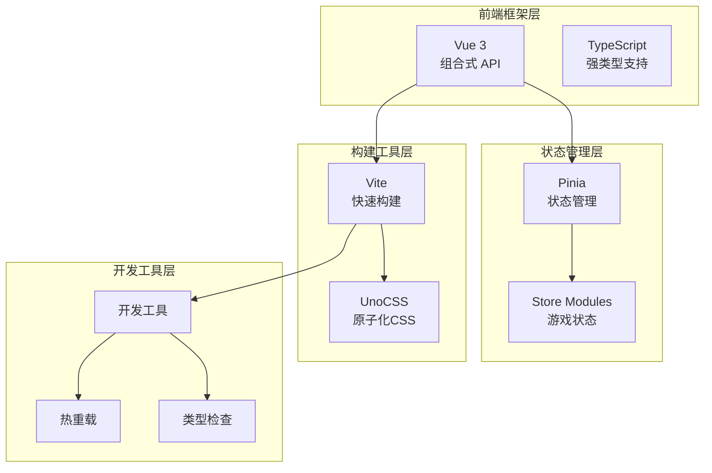
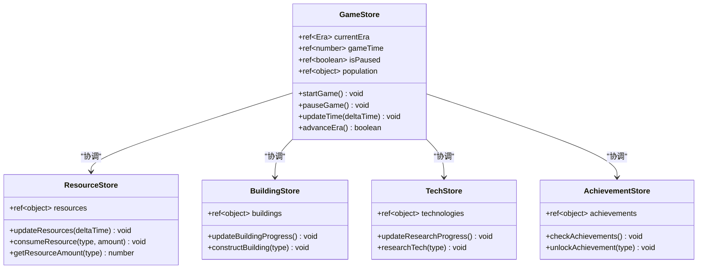

# 技术栈与依赖

<cite>
**本文档中引用的文件**
- [package.json](file://civilization-game/package.json)
- [tsconfig.json](file://civilization-game/tsconfig.json)
- [tsconfig.app.json](file://civilization-game/tsconfig.app.json)
- [uno.config.ts](file://civilization-game/uno.config.ts)
- [vite.config.ts](file://civilization-game/vite.config.ts)
- [src/main.ts](file://civilization-game/src/main.ts)
- [src/App.vue](file://civilization-game/src/App.vue)
- [src/composables/useGameEngine.ts](file://civilization-game/src/composables/useGameEngine.ts)
- [src/stores/game.ts](file://civilization-game/src/stores/game.ts)
</cite>

## 目录
1. [项目概述](#项目概述)
2. [核心技术栈](#核心技术栈)
3. [Vue 3 组合式 API 架构](#vue-3-组合式-api-架构)
4. [TypeScript 类型系统](#typescript-类型系统)
5. [状态管理解决方案](#状态管理解决方案)
6. [构建工具链](#构建工具链)
7. [样式系统](#样式系统)
8. [关键依赖分析](#关键依赖分析)
9. [配置详解](#配置详解)
10. [性能优化策略](#性能优化策略)
11. [总结](#总结)

## 项目概述

本项目是一个基于 Vue 3 的文明建设类游戏，采用了现代化的前端技术栈，包括 Vue 3 组合式 API、TypeScript、Pinia 状态管理、Vite 构建工具和 UnoCSS 样式系统。项目展现了现代前端开发的最佳实践，提供了优秀的开发体验和高性能的运行时表现。

## 核心技术栈



**图表来源**
- [src/main.ts](file://civilization-game/src/main.ts#L1-L13)
- [vite.config.ts](file://civilization-game/vite.config.ts#L1-L45)

## Vue 3 组合式 API 架构

Vue 3 的组合式 API 为项目提供了强大的响应式编程能力，特别是在复杂的游戏逻辑中展现出了卓越的可维护性。

### 响应式系统设计

项目采用组合式 API 来组织游戏逻辑，通过 `ref` 和 `computed` 实现响应式状态管理：

```typescript
// 游戏状态定义
const currentEra = ref<Era>(Era.STONE)
const gameTime = ref(0)
const isPaused = ref(false)
const population = ref({
  current: POPULATION.initialPopulation,
  max: POPULATION.initialMaxPopulation,
  growthRate: POPULATION.baseGrowthRate
})
```

### 生命周期管理

通过 `onMounted` 和 `onUnmounted` 钩子实现游戏引擎的生命周期控制：

```typescript
let autoSaveInterval: number | null = null

onMounted(() => {
  // 初始化游戏状态
  if (saveStore.hasSave()) {
    saveStore.loadGame()
  } else {
    resourceStore.initializeResources()
    techStore.initializeTechs()
    achievementStore.initializeAchievements()
  }
  
  // 启动游戏引擎
  startEngine()
  
  // 启动自动保存
  autoSaveInterval = window.setInterval(() => {
    saveStore.saveGame()
  }, AUTO_SAVE_INTERVAL)
})
```

**章节来源**
- [src/App.vue](file://civilization-game/src/App.vue#L1-L101)
- [src/composables/useGameEngine.ts](file://civilization-game/src/composables/useGameEngine.ts#L1-L143)

## TypeScript 类型系统

项目配置了严格的 TypeScript 编译选项，确保代码质量和类型安全。

### 编译器配置

```json
{
  "strict": true,
  "noUnusedLocals": true,
  "noUnusedParameters": true,
  "erasableSyntaxOnly": true,
  "noFallthroughCasesInSwitch": true,
  "noUncheckedSideEffectImports": true
}
```

### 类型系统优势

1. **严格的类型检查**：防止运行时错误
2. **智能提示**：提升开发效率
3. **重构安全**：确保代码修改的安全性
4. **文档化**：类型本身就是最好的文档

**章节来源**
- [tsconfig.app.json](file://civilization-game/tsconfig.app.json#L1-L21)

## 状态管理解决方案

Pinia 作为 Vue 3 的官方状态管理库，在项目中提供了集中式的状态管理方案。

### Store 架构设计



**图表来源**
- [src/stores/game.ts](file://civilization-game/src/stores/game.ts#L1-L268)

### 状态持久化

项目实现了完整的状态持久化机制：

```typescript
function loadGameState(state: GameState) {
  currentEra.value = state.currentEra
  gameTime.value = state.gameTime
  lastSaveTime.value = state.lastSaveTime
  lastPlayTime.value = state.lastPlayTime
  population.value = { ...state.population }
}

function resetGame() {
  currentEra.value = Era.STONE
  gameTime.value = 0
  lastSaveTime.value = Date.now()
  lastPlayTime.value = Date.now()
  isPaused.value = false
  gameSpeed.value = 1.0
  population.value = {
    current: POPULATION.initialPopulation,
    max: POPULATION.initialMaxPopulation,
    growthRate: POPULATION.baseGrowthRate
  }
}
```

**章节来源**
- [src/stores/game.ts](file://civilization-game/src/stores/game.ts#L1-L268)

## 构建工具链

Vite 作为现代前端构建工具，为项目提供了极速的开发体验和高效的生产构建。

### Vite 配置优化

```typescript
export default defineConfig({
  plugins: [
    vue({
      script: {
        defineModel: true,
        propsDestructure: true
      }
    }),
    UnoCSS()
  ],
  resolve: {
    alias: {
      '@': fileURLToPath(new URL('./src', import.meta.url))
    }
  },
  build: {
    target: 'es2020',
    rollupOptions: {
      output: {
        manualChunks(id) {
          if (id.includes('node_modules')) {
            if (id.includes('vue') || id.includes('pinia')) {
              return 'vue-vendor'
            }
            if (id.includes('@iconify')) {
              return 'iconify'
            }
          }
        }
      }
    },
    chunkSizeWarningLimit: 1000,
    minify: 'esbuild'
  }
})
```

### 构建优化策略

1. **代码分割**：按依赖类型进行手动分包
2. **ESBuild**：快速的 JavaScript 打包
3. **Rollup**：高效的模块打包
4. **缓存优化**：利用浏览器缓存策略

**章节来源**
- [vite.config.ts](file://civilization-game/vite.config.ts#L1-L45)

## 样式系统

UnoCSS 提供了原子化 CSS 解决方案，实现了按需生成和高度可定制的样式系统。

### UnoCSS 配置

```typescript
export default defineConfig({
  presets: [
    presetUno(),
    presetAttributify(),
    presetIcons({
      scale: 1.2,
      warn: true
    })
  ],
  theme: {
    colors: {
      primary: '#3b82f6',
      secondary: '#8b5cf6',
      success: '#10b981',
      warning: '#f59e0b',
      danger: '#ef4444',
      dark: '#1e293b',
      light: '#f1f5f9'
    }
  },
  shortcuts: {
    'btn': 'px-4 py-2 rounded-lg cursor-pointer transition-all duration-200',
    'btn-primary': 'btn bg-primary text-white hover:bg-blue-600',
    'btn-secondary': 'btn bg-secondary text-white hover:bg-purple-600',
    'btn-disabled': 'btn bg-gray-400 text-gray-200 cursor-not-allowed',
    'card': 'bg-white dark:bg-gray-800 rounded-lg shadow-md p-4',
    'input': 'px-3 py-2 border border-gray-300 rounded-md focus:outline-none focus:ring-2 focus:ring-primary'
  }
})
```

### 原子化 CSS 优势

1. **按需生成**：只生成实际使用的样式
2. **高性能**：最小化的 CSS 文件大小
3. **可维护性**：统一的样式命名规范
4. **主题支持**：内置暗黑模式支持

**章节来源**
- [uno.config.ts](file://civilization-game/uno.config.ts#L1-L32)

## 关键依赖分析

### 生产依赖

| 包名 | 版本 | 作用 |
|------|------|------|
| `vue` | ^3.5.22 | 核心框架，提供响应式系统和组件化开发 |
| `pinia` | ^3.0.3 | 状态管理库，替代 Vuex，提供更好的 TypeScript 支持 |

### 开发依赖

| 包名 | 版本 | 作用 |
|------|------|------|
| `@vitejs/plugin-vue` | ^6.0.1 | Vite 的 Vue 插件，支持单文件组件 |
| `vite` | npm:rolldown-vite@7.1.14 | 构建工具，提供快速开发体验 |
| `typescript` | ~5.9.3 | 类型检查和编译 |
| `unocss` | ^66.5.4 | 原子化 CSS 框架 |
| `@iconify/vue` | ^5.0.0 | 图标库集成 |
| `dayjs` | ^1.11.18 | 日期时间处理 |
| `@vueuse/core` | ^14.0.0 | Vue 组合式 API 工具函数 |
| `number-precision` | ^1.6.0 | 数字精度处理 |

### 依赖选择理由

1. **Vue 3**：提供最新的组合式 API 和更好的性能
2. **Pinia**：官方推荐的状态管理解决方案，TypeScript 友好
3. **Vite**：极速的开发服务器和构建工具
4. **UnoCSS**：轻量级原子化 CSS，按需生成
5. **TypeScript**：静态类型检查，提升代码质量

**章节来源**
- [package.json](file://civilization-game/package.json#L1-L35)

## 配置详解

### 多配置文件结构

项目采用多配置文件的方式组织 TypeScript 配置：

```json
{
  "files": [],
  "references": [
    { "path": "./tsconfig.app.json" },
    { "path": "./tsconfig.node.json" }
  ]
}
```

### 应用配置特点

1. **路径别名**：`@/*` 指向 `./src/*`
2. **严格模式**：启用所有严格类型检查选项
3. **类型声明**：包含 Vite 客户端类型
4. **模块解析**：支持 ES 模块语法

**章节来源**
- [tsconfig.json](file://civilization-game/tsconfig.json#L1-L8)
- [tsconfig.app.json](file://civilization-game/tsconfig.app.json#L1-L21)

## 性能优化策略

### 游戏引擎性能监控

```typescript
function gameLoop(currentTime: number) {
  const deltaTime = currentTime - lastUpdateTime
  lastUpdateTime = currentTime
  accumulator += deltaTime
  
  // FPS计算
  frameCount++
  if (currentTime - fpsLastTime >= 1000) {
    currentFPS = frameCount
    frameCount = 0
    fpsLastTime = currentTime
    
    // 性能警告
    if (currentFPS < 50) {
      console.warn(`Low FPS detected: ${currentFPS}, consider performance optimization`)
    }
  }
  
  // 避免帧跳过
  const maxAccumulator = GAME_TICK_INTERVAL * 3
  if (accumulator > maxAccumulator) {
    console.warn(`Frame skip: accumulator ${accumulator}ms exceeded limit`)
    accumulator = maxAccumulator
  }
}
```

### 内存管理

1. **动画帧清理**：组件卸载时自动停止动画循环
2. **事件监听器管理**：及时移除不需要的事件监听器
3. **定时器清理**：自动清理定时器避免内存泄漏

**章节来源**
- [src/composables/useGameEngine.ts](file://civilization-game/src/composables/useGameEngine.ts#L1-L143)

## 总结

本项目展示了现代前端技术栈的最佳实践，通过以下关键技术实现了高质量的开发体验：

### 技术选型优势

1. **Vue 3 + 组合式 API**：提供灵活且强大的响应式编程模型
2. **TypeScript**：确保代码质量和开发效率
3. **Pinia**：简洁高效的状态管理解决方案
4. **Vite**：极速的开发体验和构建性能
5. **UnoCSS**：轻量级原子化 CSS，按需生成样式

### 开发体验

- **快速热重载**：Vite 提供秒级的开发服务器启动
- **智能类型提示**：完整的 TypeScript 支持
- **零配置构建**：开箱即用的构建工具
- **模块化架构**：清晰的代码组织结构

### 性能表现

- **高效的状态管理**：Pinia 的响应式系统优化
- **按需样式加载**：UnoCSS 的原子化 CSS 优势
- **内存友好**：完善的生命周期管理和资源清理
- **性能监控**：内置的 FPS 监控和性能警告

这套技术栈不仅适用于游戏开发，也为其他复杂的前端应用提供了优秀的参考架构。通过合理的配置和最佳实践的应用，项目在开发效率和运行性能之间取得了良好的平衡。