# 数据模型

<cite>
**本文档引用的文件**
- [index.ts](file://civilization-game/src/types/index.ts)
- [game.ts](file://civilization-game/src/stores/game.ts)
- [save.ts](file://civilization-game/src/stores/save.ts)
- [constants.ts](file://civilization-game/src/config/constants.ts)
- [formatNumber.ts](file://civilization-game/src/utils/formatNumber.ts)
- [resources.ts](file://civilization-game/src/config/resources.ts)
- [buildings.ts](file://civilization-game/src/config/buildings.ts)
- [BuildingCard.vue](file://civilization-game/src/components/game/BuildingCard.vue)
</cite>

## 目录
1. [简介](#简介)
2. [项目结构概览](#项目结构概览)
3. [核心数据类型](#核心数据类型)
4. [游戏状态管理](#游戏状态管理)
5. [存档系统设计](#存档系统设计)
6. [大数字处理策略](#大数字处理策略)
7. [类型安全与架构优势](#类型安全与架构优势)
8. [性能优化考虑](#性能优化考虑)
9. [故障排除指南](#故障排除指南)
10. [总结](#总结)

## 简介

本文档详细介绍了文明游戏项目的完整数据模型体系。该系统采用TypeScript构建，通过严格的类型定义确保代码的健壮性和可维护性。数据模型涵盖了从基础资源到复杂科技树的全方位游戏状态管理，支持多时代发展、资源生产和建筑升级等核心机制。

## 项目结构概览

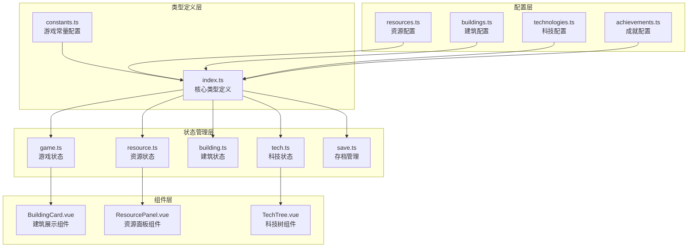

**图表来源**
- [index.ts](file://civilization-game/src/types/index.ts#L1-L198)
- [game.ts](file://civilization-game/src/stores/game.ts#L1-L50)
- [save.ts](file://civilization-game/src/stores/save.ts#L1-L50)

## 核心数据类型

### 游戏时代枚举 (Era)

游戏包含八个不同的时代阶段，每个时代代表技术和社会发展的不同阶段：

```typescript
export const Era = {
  STONE: 'stone',
  BRONZE: 'bronze',
  IRON: 'iron',
  INDUSTRIAL: 'industrial',
  INFORMATION: 'information',
  SPACE: 'space',
  INTERSTELLAR: 'interstellar',
  HYPERDIMENSIONAL: 'hyperdimensional'
} as const

export type Era = typeof Era[keyof typeof Era]
```

**时代特性：**
- **石器时代**：基础生存资源（食物、木材、石头）
- **青铜时代**：中级资源（铜矿、黏土）和农业发展
- **铁器时代**：铁矿和煤炭，人口增长
- **工业时代**：钢铁、石油和电力，工业化进程
- **信息时代**：芯片和数据，信息技术革命
- **太空时代**：火箭燃料、合金和氦-3，太空探索
- **星际时代**：反物质、暗物质，星际旅行
- **超维时代**：量子能量、时空晶体，维度技术

### 资源类型系统

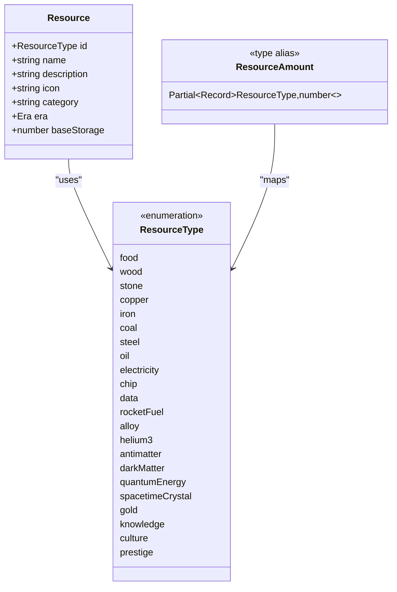

**图表来源**
- [index.ts](file://civilization-game/src/types/index.ts#L10-L30)
- [index.ts](file://civilization-game/src/types/index.ts#L32-L45)

### 建筑系统架构

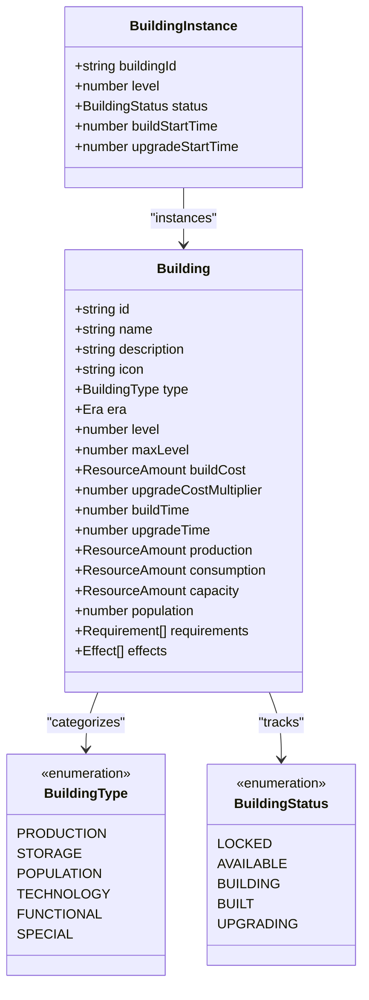

**图表来源**
- [index.ts](file://civilization-game/src/types/index.ts#L50-L85)
- [index.ts](file://civilization-game/src/types/index.ts#L87-L95)

### 科技树系统

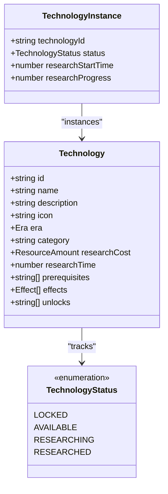

**图表来源**
- [index.ts](file://civilization-game/src/types/index.ts#L100-L125)
- [index.ts](file://civilization-game/src/types/index.ts#L127-L135)

**章节来源**
- [index.ts](file://civilization-game/src/types/index.ts#L1-L198)

## 游戏状态管理

### GameState 接口设计

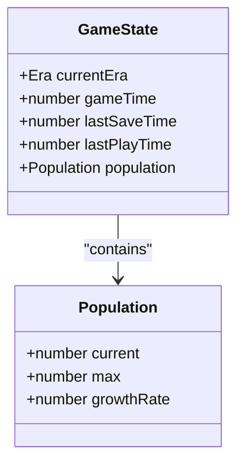

**图表来源**
- [index.ts](file://civilization-game/src/types/index.ts#L140-L155)
- [game.ts](file://civilization-game/src/stores/game.ts#L10-L25)

### 状态计算与更新

游戏状态通过Pinia store进行管理，提供了以下核心功能：

1. **实时时间更新**：每秒更新游戏时间，支持游戏速度调节
2. **人口动态管理**：根据当前人口和上限自动调整增长
3. **时代推进控制**：验证并执行时代切换逻辑
4. **事件系统集成**：支持状态变更事件通知

```typescript
// 游戏时间更新示例
function updateTime(deltaTime: number) {
  if (!isPaused.value) {
    gameTime.value += deltaTime * gameSpeed.value
  }
}

// 人口增长计算
function updatePopulationGrowth(deltaTime: number) {
  if (isPaused.value) return
  
  if (population.value.current < population.value.max) {
    const growth = population.value.growthRate * deltaTime
    population.value.current = Math.min(
      population.value.current + growth,
      population.value.max
    )
  }
}
```

**章节来源**
- [game.ts](file://civilization-game/src/stores/game.ts#L50-L100)

## 存档系统设计

### SaveData 结构分析

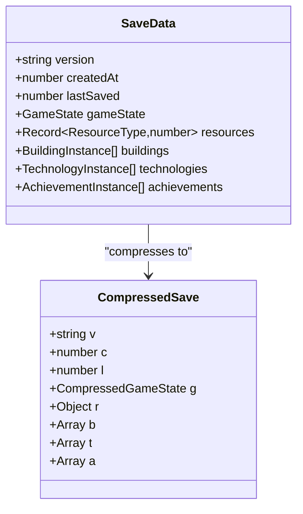

**图表来源**
- [index.ts](file://civilization-game/src/types/index.ts#L160-L175)
- [save.ts](file://civilization-game/src/stores/save.ts#L20-L60)

### 版本控制与兼容性

存档系统实现了完善的版本控制机制：

```typescript
// 版本检查逻辑
if (saveData.version !== GAME_VERSION) {
  console.warn('存档版本不匹配,可能需要迁移')
}

// 自动迁移策略
function migrateSaveData(oldVersion: string, newData: SaveData): SaveData {
  // 版本迁移逻辑
  // 处理字段添加、删除或重命名
  // 保持向后兼容性
}
```

### 压缩优化策略

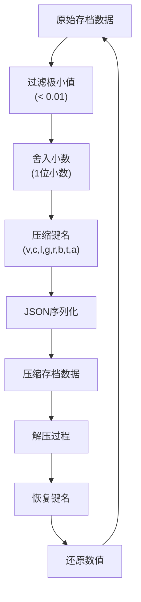

**图表来源**
- [save.ts](file://civilization-game/src/stores/save.ts#L20-L60)

**章节来源**
- [save.ts](file://civilization-game/src/stores/save.ts#L1-L100)

## 大数字处理策略

### 数字格式化系统

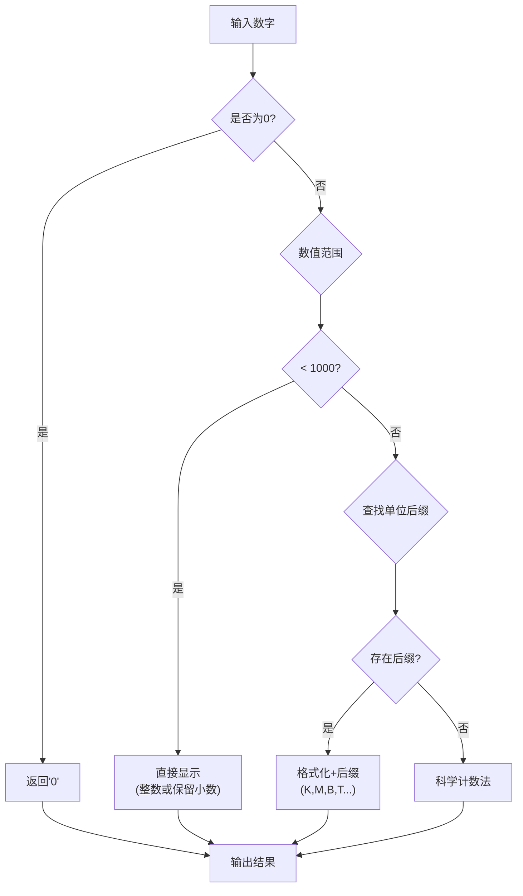

**图表来源**
- [formatNumber.ts](file://civilization-game/src/utils/formatNumber.ts#L10-L40)

### 格式化函数实现

系统提供了多种数字格式化方法：

```typescript
// 主要格式化函数
export function formatNumber(value: number, decimals: number = 2): string {
  if (value === 0) return '0'
  if (value < 0) return '-' + formatNumber(-value, decimals)
  
  // 小于1000直接显示
  if (value < 1000) {
    return value % 1 === 0 ? value.toString() : value.toFixed(decimals)
  }
  
  // 使用单位后缀
  const suffixes = ['', 'K', 'M', 'B', 'T', 'Qa', 'Qi', 'Sx', 'Sp', 'Oc', 'No', 'Dc']
  const tier = Math.floor(Math.log10(value) / 3)
  
  if (tier < suffixes.length) {
    const suffix = suffixes[tier]
    const scale = Math.pow(10, tier * 3)
    const scaled = value / scale
    return scaled.toFixed(decimals) + suffix
  }
  
  // 超大数字使用科学计数法
  return value.toExponential(decimals)
}
```

### 精度处理策略

1. **浮点数精度问题**：使用适当的舍入策略避免显示误差
2. **大数显示优化**：自动选择合适的表示方式
3. **性能考虑**：对频繁显示的数值使用缓存机制

**章节来源**
- [formatNumber.ts](file://civilization-game/src/utils/formatNumber.ts#L1-L120)

## 类型安全与架构优势

### 类型系统设计原则

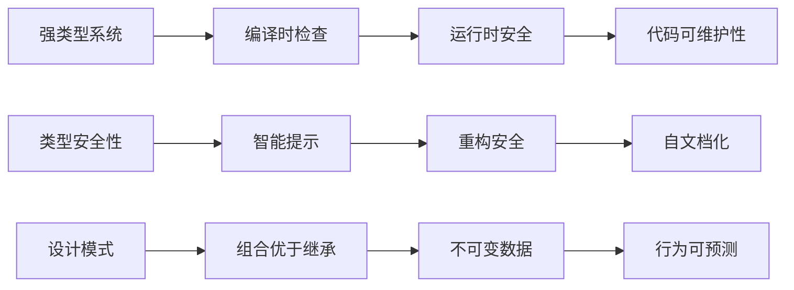

### 枚举类型的优势

1. **值域限制**：确保只能使用预定义的有效值
2. **自动补全**：IDE提供完整的选项建议
3. **编译时验证**：防止拼写错误和无效值
4. **文档化**：类型定义本身就是良好的文档

```typescript
// 示例：有效的枚举使用
const validEra: Era = Era.STONE // ✅ 正确
const invalidEra: Era = 'invalid' // ❌ 编译错误

// 类型保护
function isValidEra(era: string): era is Era {
  return Object.values(Era).includes(era as Era)
}
```

### 接口继承与扩展

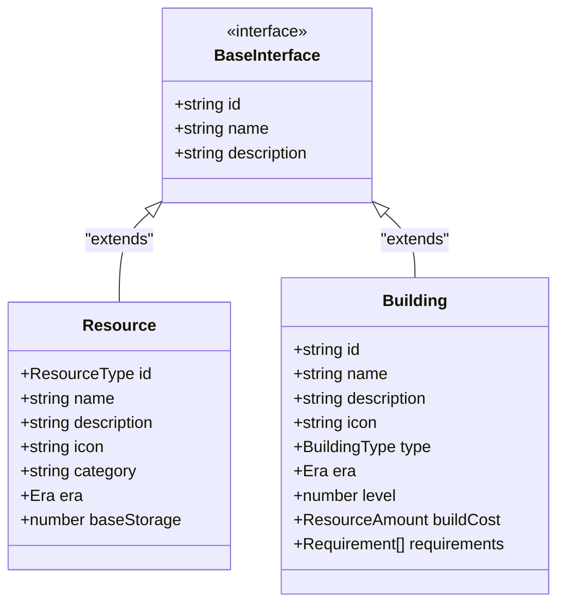

**图表来源**
- [index.ts](file://civilization-game/src/types/index.ts#L32-L45)
- [index.ts](file://civilization-game/src/types/index.ts#L50-L85)

**章节来源**
- [index.ts](file://civilization-game/src/types/index.ts#L1-L198)

## 性能优化考虑

### 内存管理策略

1. **对象池模式**：重用频繁创建的对象实例
2. **懒加载**：按需加载大型配置数据
3. **弱引用**：避免内存泄漏
4. **批量更新**：合并多个状态变更操作

### 计算属性优化

```typescript
// Vue计算属性的缓存机制
const formattedGameTime = computed(() => {
  const hours = Math.floor(gameTime.value / 3600)
  const minutes = Math.floor((gameTime.value % 3600) / 60)
  const seconds = Math.floor(gameTime.value % 60)
  return `${hours}:${minutes.toString().padStart(2, '0')}:${seconds.toString().padStart(2, '0')}`
})
```

### 存档压缩算法

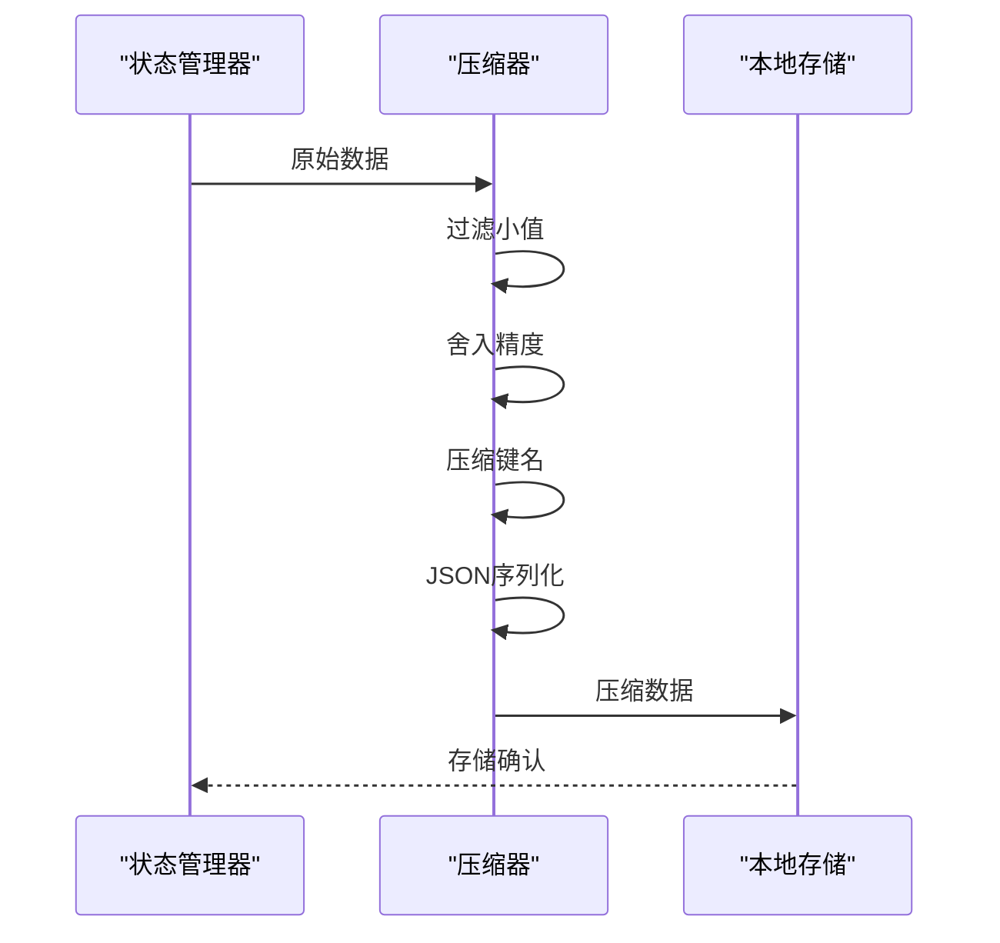

**图表来源**
- [save.ts](file://civilization-game/src/stores/save.ts#L20-L60)

## 故障排除指南

### 常见类型错误

1. **枚举值错误**
   ```typescript
   // 错误：使用了不存在的枚举值
   const era: Era = 'future' // ❌ 编译错误
   
   // 正确：使用有效枚举值
   const era: Era = Era.INDUSTRIAL // ✅ 正确
   ```

2. **类型不匹配**
   ```typescript
   // 错误：类型不兼容
   const resources: ResourceAmount = { food: '100' } // ❌ number期望
   
   // 正确：使用正确的类型
   const resources: ResourceAmount = { food: 100 } // ✅ 正确
   ```

3. **可选属性访问**
   ```typescript
   // 安全的可选属性访问
   const production = building.production ?? {}
   const totalProduction = Object.values(production).reduce((sum, val) => sum + (val || 0), 0)
   ```

### 存档问题诊断

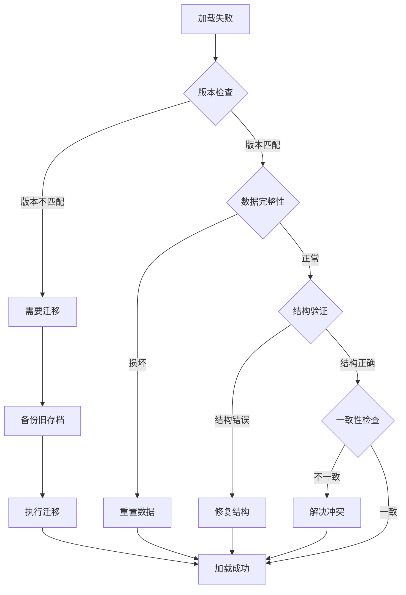

**章节来源**
- [save.ts](file://civilization-game/src/stores/save.ts#L100-L150)

## 总结

该文明游戏的数据模型系统展现了现代TypeScript应用的最佳实践：

### 核心优势

1. **类型安全**：通过严格的类型定义确保代码质量
2. **模块化设计**：清晰的职责分离和依赖关系
3. **性能优化**：智能的缓存和压缩策略
4. **可扩展性**：易于添加新的资源、建筑和科技
5. **向后兼容**：完善的版本控制和迁移机制

### 技术亮点

- **枚举类型**：提供值域限制和自动补全
- **接口继承**：实现类型安全的扩展机制
- **计算属性**：Vue响应式系统的高效利用
- **存档压缩**：平衡存储空间和性能的优化方案
- **大数处理**：优雅的数字格式化解决方案

### 发展方向

1. **性能监控**：添加内存使用和性能指标
2. **类型扩展**：支持更多游戏机制的类型定义
3. **工具增强**：开发更多的类型辅助工具
4. **测试覆盖**：完善类型相关的单元测试

这套数据模型不仅为当前的游戏功能提供了坚实的基础，也为未来的功能扩展和性能优化奠定了良好的架构基础。