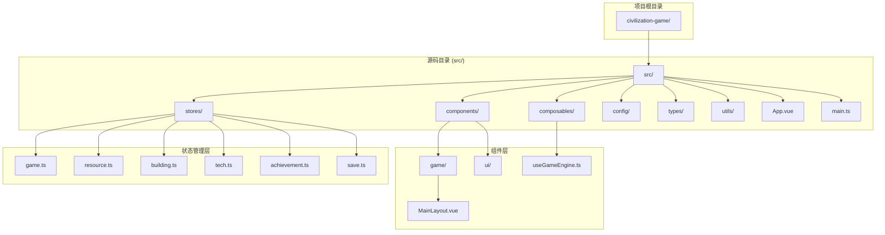
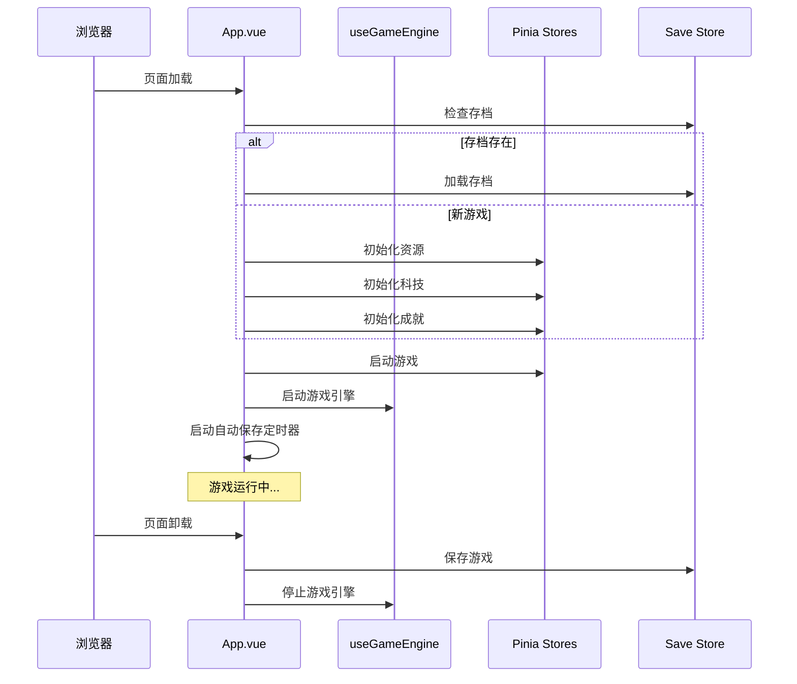
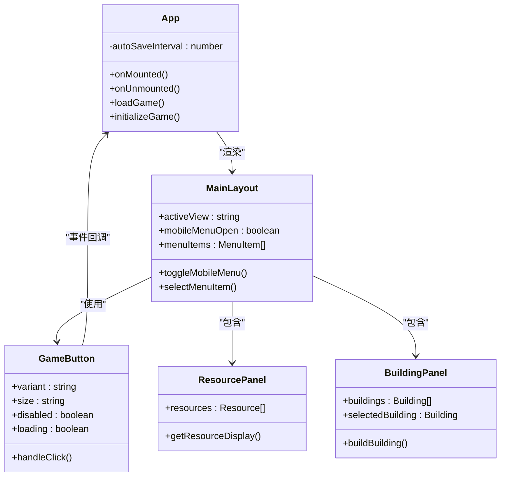
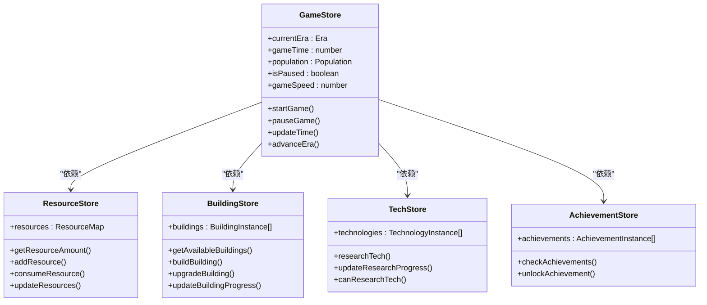
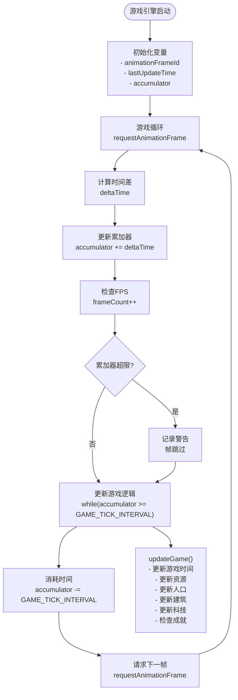
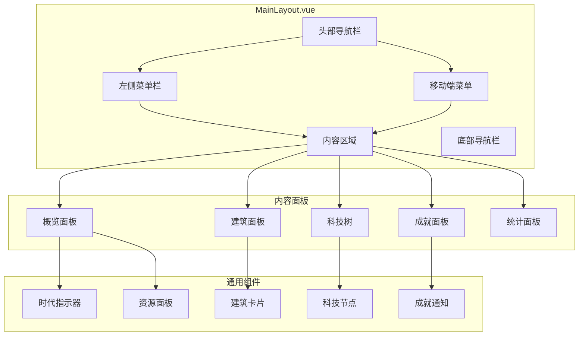
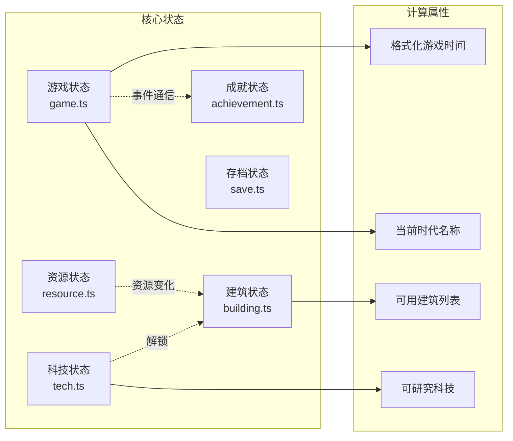
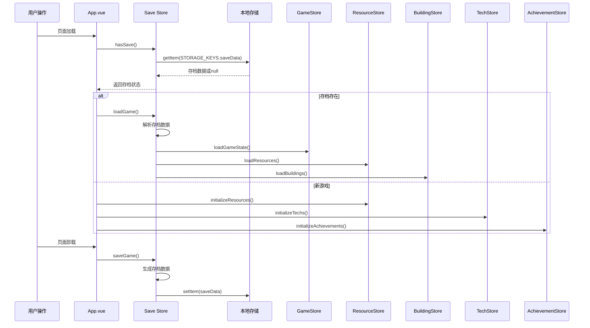
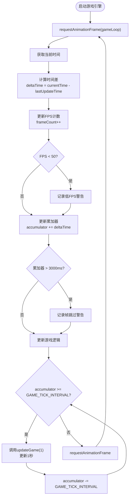
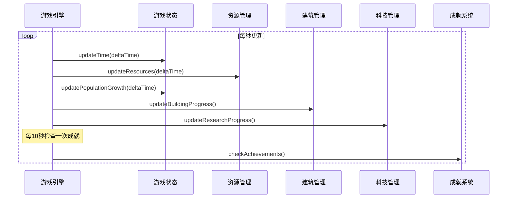

# 核心架构文档

<cite>
**本文档引用的文件**
- [main.ts](file://civilization-game/src/main.ts)
- [App.vue](file://civilization-game/src/App.vue)
- [MainLayout.vue](file://civilization-game/src/components/game/MainLayout.vue)
- [useGameEngine.ts](file://civilization-game/src/composables/useGameEngine.ts)
- [game.ts](file://civilization-game/src/stores/game.ts)
- [constants.ts](file://civilization-game/src/config/constants.ts)
- [index.ts](file://civilization-game/src/types/index.ts)
- [GameButton.vue](file://civilization-game/src/components/ui/GameButton.vue)
</cite>

## 目录
1. [项目概述](#项目概述)
2. [项目结构分析](#项目结构分析)
3. [应用入口与初始化](#应用入口与初始化)
4. [MVVM架构模式](#mvvm架构模式)
5. [组件层次结构](#组件层次结构)
6. [状态管理系统](#状态管理系统)
7. [游戏引擎架构](#游戏引擎架构)
8. [设计原则与可维护性](#设计原则与可维护性)
9. [总结](#总结)

## 项目概述

这是一个基于Vue 3和TypeScript构建的文明发展模拟游戏，采用现代化前端架构模式。项目展现了清晰的分层架构，通过MVVM模式实现了视图、模型和视图模型的有效分离，同时利用Pinia进行状态管理，确保了代码的可维护性和扩展性。

## 项目结构分析



**图表来源**
- [main.ts](file://civilization-game/src/main.ts#L1-L13)
- [App.vue](file://civilization-game/src/App.vue#L1-L101)

**章节来源**
- [main.ts](file://civilization-game/src/main.ts#L1-L13)
- [App.vue](file://civilization-game/src/App.vue#L1-L101)

## 应用入口与初始化

### main.ts - 应用启动核心

应用的启动过程遵循标准的Vue 3应用程序初始化模式：

```typescript
import { createApp } from 'vue'
import { createPinia } from 'pinia'
import '@unocss/reset/tailwind.css'
import 'uno.css'
import './style.css'
import App from './App.vue'

const app = createApp(App)
const pinia = createPinia()

app.use(pinia)
app.mount('#app')
```

这个简洁的启动文件展示了现代前端应用的最佳实践：
- **模块化导入**：按需导入必要的依赖
- **CSS预处理**：集成了UnoCSS和Tailwind CSS重置样式
- **状态管理集成**：Pinia作为状态管理解决方案
- **渐进式增强**：支持CSS重置和自定义样式

### App.vue - 应用根组件

App.vue作为整个应用的根组件，承担着协调各个子系统的重要职责：



**图表来源**
- [App.vue](file://civilization-game/src/App.vue#L25-L55)
- [useGameEngine.ts](file://civilization-game/src/composables/useGameEngine.ts#L100-L120)

**章节来源**
- [main.ts](file://civilization-game/src/main.ts#L1-L13)
- [App.vue](file://civilization-game/src/App.vue#L1-L101)

## MVVM架构模式

### 视图层 (View) - Vue组件

项目采用了高度模块化的组件架构，每个组件都有明确的职责边界：



**图表来源**
- [App.vue](file://civilization-game/src/App.vue#L1-L20)
- [MainLayout.vue](file://civilization-game/src/components/game/MainLayout.vue#L150-L200)
- [GameButton.vue](file://civilization-game/src/components/ui/GameButton.vue#L1-L30)

### 模型层 (Model) - Pinia Stores

Pinia stores作为数据模型层，提供了响应式的状态管理：



**图表来源**
- [game.ts](file://civilization-game/src/stores/game.ts#L1-L50)
- [useGameEngine.ts](file://civilization-game/src/composables/useGameEngine.ts#L10-L20)

### 视图模型层 (ViewModel) - 组合式函数

useGameEngine作为核心的组合式函数，封装了游戏逻辑：



**图表来源**
- [useGameEngine.ts](file://civilization-game/src/composables/useGameEngine.ts#L25-L80)

**章节来源**
- [App.vue](file://civilization-game/src/App.vue#L1-L101)
- [useGameEngine.ts](file://civilization-game/src/composables/useGameEngine.ts#L1-L143)
- [game.ts](file://civilization-game/src/stores/game.ts#L1-L199)

## 组件层次结构

### 主布局组件 MainLayout

MainLayout是整个游戏界面的核心容器，负责协调各个功能模块：



**图表来源**
- [MainLayout.vue](file://civilization-game/src/components/game/MainLayout.vue#L1-L100)

### 响应式布局设计

项目采用了移动优先的响应式设计策略：

- **桌面端**：固定侧边栏菜单，最大化内容显示空间
- **移动端**：抽屉式菜单，底部导航栏，优化触摸交互
- **断点适配**：768px断点用于区分移动设备和平板设备

**章节来源**
- [MainLayout.vue](file://civilization-game/src/components/game/MainLayout.vue#L1-L275)

## 状态管理系统

### Pinia Store架构

项目采用单一状态树设计，所有游戏状态都集中管理：



**图表来源**
- [game.ts](file://civilization-game/src/stores/game.ts#L1-L100)
- [constants.ts](file://civilization-game/src/config/constants.ts#L1-L61)

### 状态持久化机制

项目实现了完整的状态持久化系统：



**图表来源**
- [App.vue](file://civilization-game/src/App.vue#L25-L45)
- [constants.ts](file://civilization-game/src/config/constants.ts#L45-L50)

**章节来源**
- [game.ts](file://civilization-game/src/stores/game.ts#L1-L199)
- [App.vue](file://civilization-game/src/App.vue#L25-L55)

## 游戏引擎架构

### 实时游戏循环系统

useGameEngine实现了高性能的游戏循环系统：



**图表来源**
- [useGameEngine.ts](file://civilization-game/src/composables/useGameEngine.ts#L25-L80)

### 游戏逻辑更新流程



**图表来源**
- [useGameEngine.ts](file://civilization-game/src/composables/useGameEngine.ts#L50-L80)

**章节来源**
- [useGameEngine.ts](file://civilization-game/src/composables/useGameEngine.ts#L1-L143)

## 设计原则与可维护性

### 类型安全设计

项目充分利用TypeScript的强大类型系统：

```typescript
// 类型定义示例
export interface Building {
  id: string
  name: string
  description: string
  icon: string
  type: BuildingType
  era: Era
  level: number
  maxLevel: number
  buildCost: ResourceAmount
  production?: ResourceAmount
  consumption?: ResourceAmount
  capacity?: ResourceAmount
  population?: number
  requirements: Requirement[]
  effects?: Effect[]
}
```

### 配置驱动开发

项目采用配置文件管理游戏常量和规则：

```typescript
// 常量配置示例
export const GAME_TICK_INTERVAL = 1000 // 游戏循环间隔
export const AUTO_SAVE_INTERVAL = 30000 // 自动保存间隔
export const POPULATION = {
  baseGrowthRate: 1 / 60,
  foodConsumptionPerPop: 0.5,
  initialPopulation: 10,
  initialMaxPopulation: 20
}
```

### 模块化架构优势

1. **高内聚低耦合**：每个模块职责单一，便于维护和测试
2. **可扩展性**：新增功能只需添加新的store或组件
3. **类型安全**：编译时错误检查，减少运行时问题
4. **开发效率**：清晰的目录结构和命名规范

**章节来源**
- [constants.ts](file://civilization-game/src/config/constants.ts#L1-L61)
- [index.ts](file://civilization-game/src/types/index.ts#L1-L198)

## 总结

本项目展现了现代前端开发的最佳实践，通过以下关键特性实现了高质量的架构设计：

### 技术亮点

1. **现代化框架选择**：Vue 3 + TypeScript + Pinia的完美组合
2. **清晰的架构分层**：MVVM模式的完整实现
3. **高性能游戏引擎**：基于requestAnimationFrame的实时循环
4. **完善的类型系统**：全面的TypeScript类型定义
5. **响应式设计**：移动端优先的适配方案

### 架构优势

- **可维护性**：模块化设计，职责分离明确
- **可扩展性**：易于添加新功能和新组件
- **可测试性**：清晰的依赖关系，便于单元测试
- **用户体验**：流畅的动画效果和响应式交互

### 发展方向

该项目为未来的功能扩展奠定了坚实基础，可以轻松添加：
- 更多游戏时代和科技树
- 社交功能和多人协作
- 更丰富的UI组件和动画效果
- 跨平台部署支持

这种架构设计不仅保证了当前功能的稳定运行，也为未来的发展提供了无限可能。