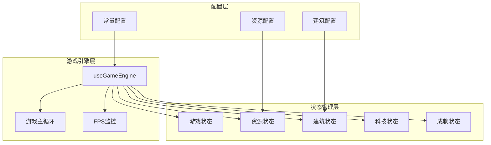
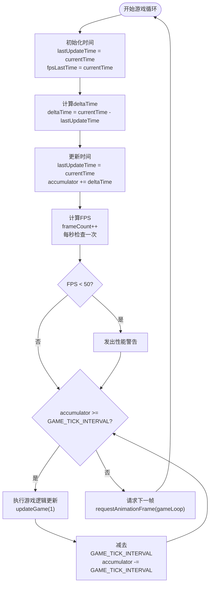
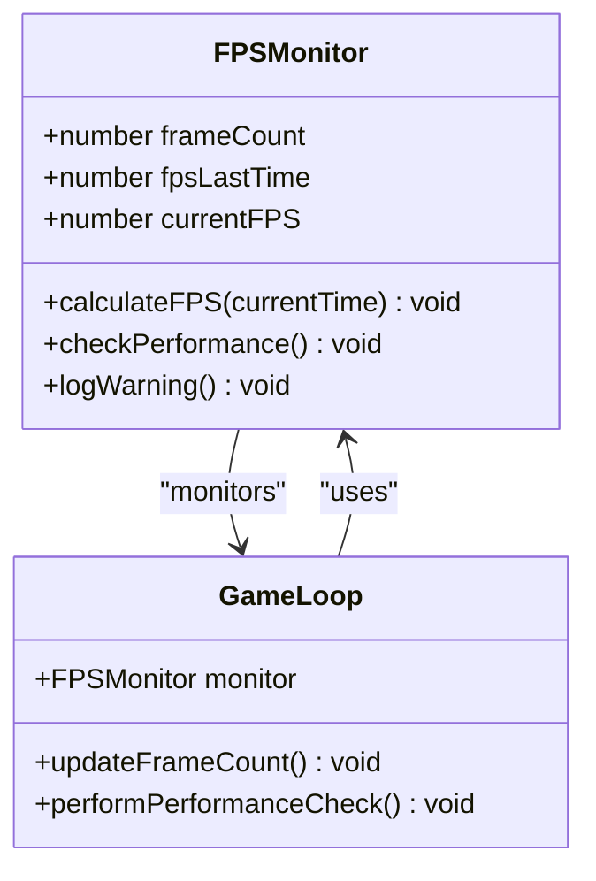
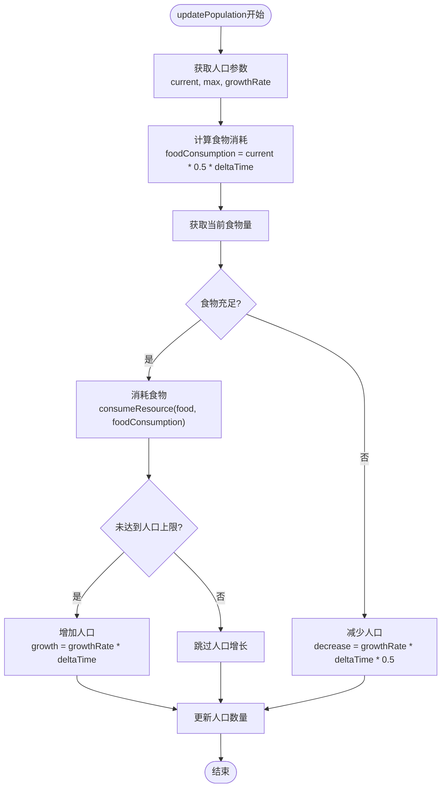
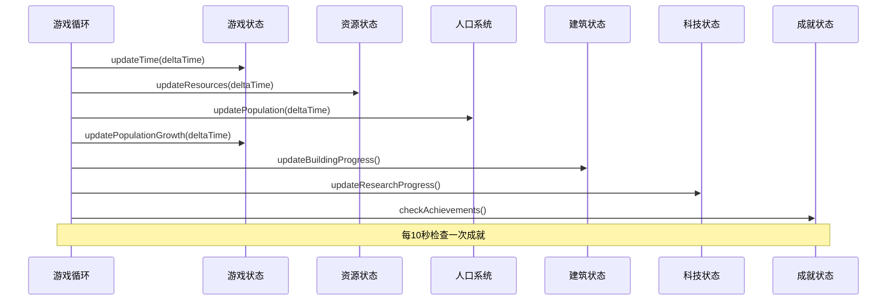
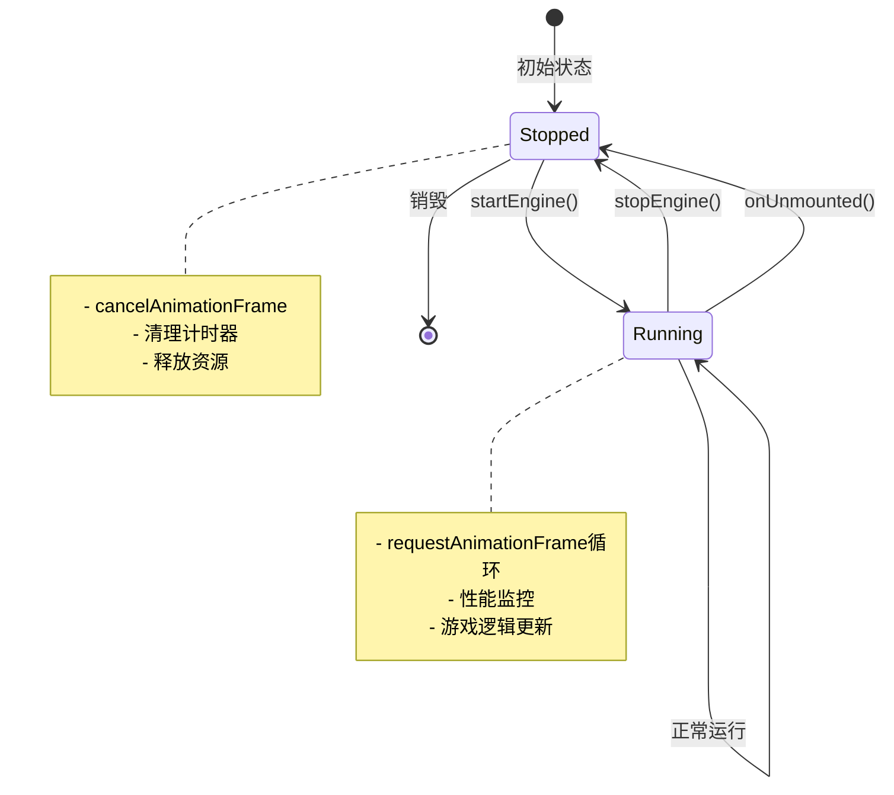
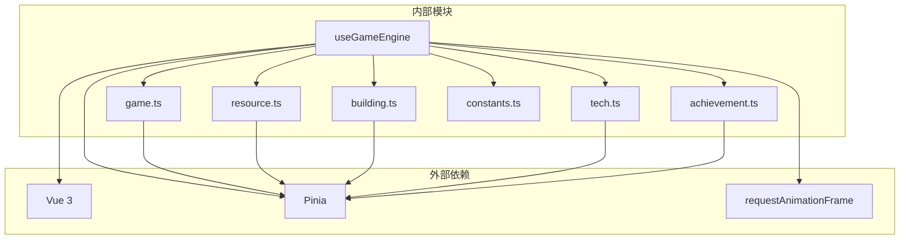

# 游戏引擎

<cite>
**本文档引用的文件**
- [useGameEngine.ts](file://civilization-game/src/composables/useGameEngine.ts)
- [constants.ts](file://civilization-game/src/config/constants.ts)
- [game.ts](file://civilization-game/src/stores/game.ts)
- [resource.ts](file://civilization-game/src/stores/resource.ts)
- [building.ts](file://civilization-game/src/stores/building.ts)
- [index.ts](file://civilization-game/src/types/index.ts)
- [resources.ts](file://civilization-game/src/config/resources.ts)
- [App.vue](file://civilization-game/src/App.vue)
</cite>

## 目录
1. [简介](#简介)
2. [项目结构](#项目结构)
3. [核心组件](#核心组件)
4. [架构概览](#架构概览)
5. [详细组件分析](#详细组件分析)
6. [依赖关系分析](#依赖关系分析)
7. [性能考虑](#性能考虑)
8. [故障排除指南](#故障排除指南)
9. [结论](#结论)

## 简介

游戏引擎是这个文明建设模拟游戏的核心系统，负责管理游戏的主循环、时间流逝、资源产出、人口增长、建筑建造和科技研究等核心功能。该引擎采用基于`requestAnimationFrame`的高效游戏循环机制，确保流畅的游戏体验同时保持精确的时间控制。

引擎的主要特点包括：
- 基于`requestAnimationFrame`的主循环机制
- 精确的deltaTime处理和时间累加器
- 帧跳过保护机制防止卡顿
- 每秒一次的游戏逻辑更新协调
- 内置的FPS监控和性能告警系统
- 动态的人口平衡机制
- 生命周期管理（自动停止）

## 项目结构

游戏引擎位于`src/composables/useGameEngine.ts`文件中，作为Vue 3组合式函数提供核心游戏逻辑。整个游戏系统采用模块化设计，通过Pinia状态管理器连接各个子系统。



**图表来源**
- [useGameEngine.ts](file://civilization-game/src/composables/useGameEngine.ts#L1-L143)
- [constants.ts](file://civilization-game/src/config/constants.ts#L1-L61)

## 核心组件

### useGameEngine组合式函数

`useGameEngine`是游戏引擎的核心入口点，它封装了整个游戏系统的运行逻辑。该函数返回两个关键方法：`startEngine`和`stopEngine`，用于控制游戏引擎的生命周期。

```typescript
export function useGameEngine() {
  const gameStore = useGameStore()
  const resourceStore = useResourceStore()
  const buildingStore = useBuildingStore()
  const techStore = useTechStore()
  const achievementStore = useAchievementStore()
  
  let animationFrameId: number | null = null
  let lastUpdateTime = 0
  let accumulator = 0
  let achievementCheckCounter = 0
  
  // 性能监控
  let frameCount = 0
  let fpsLastTime = 0
  let currentFPS = 60
}
```

**章节来源**
- [useGameEngine.ts](file://civilization-game/src/composables/useGameEngine.ts#L8-L20)

## 架构概览

游戏引擎采用分层架构设计，每一层都有明确的职责分工：

```mermaid
sequenceDiagram
participant App as 应用程序
participant Engine as 游戏引擎
participant Loop as 主循环
participant Stores as 状态存储
participant Monitor as 性能监控
App->>Engine : startEngine()
Engine->>Loop : requestAnimationFrame(gameLoop)
Loop->>Monitor : 计算FPS
Loop->>Loop : 更新accumulator
Loop->>Stores : updateGame(deltaTime)
Stores->>Stores : 更新资源产出
Stores->>Stores : 更新人口
Stores->>Stores : 更新建筑进度
Stores->>Stores : 更新科技进度
Loop->>Loop : 检查帧跳过
Loop->>Loop : requestAnimationFrame(gameLoop)
Note over App,Monitor : 每秒执行一次游戏逻辑更新
```

**图表来源**
- [useGameEngine.ts](file://civilization-game/src/composables/useGameEngine.ts#L22-L60)
- [App.vue](file://civilization-game/src/App.vue#L15-L47)

## 详细组件分析

### 基于requestAnimationFrame的游戏主循环

游戏引擎的核心是基于`requestAnimationFrame`的主循环机制，这种机制提供了与浏览器刷新率同步的高效渲染循环。



**图表来源**
- [useGameEngine.ts](file://civilization-game/src/composables/useGameEngine.ts#L22-L60)

#### 时间累加器（Accumulator）工作原理

时间累加器是游戏引擎的关键特性，它确保游戏逻辑以固定的时间间隔更新，即使帧率不稳定：

1. **累加机制**：每次循环将deltaTime累加到accumulator变量
2. **阈值检查**：当accumulator超过`GAME_TICK_INTERVAL`（1000ms）时触发逻辑更新
3. **帧跳过保护**：设置最大累加时间限制（3秒），防止长时间卡顿导致大量帧跳过
4. **精确控制**：确保游戏逻辑每秒只更新一次，保持游戏节奏的一致性

```typescript
const maxAccumulator = GAME_TICK_INTERVAL * 3 // 最多积累3秒
if (accumulator > maxAccumulator) {
  console.warn(`Frame skip: accumulator ${accumulator}ms exceeded limit`)
  accumulator = maxAccumulator
}

while (accumulator >= GAME_TICK_INTERVAL) {
  updateGame(1) // 更新1秒
  accumulator -= GAME_TICK_INTERVAL
}
```

**章节来源**
- [useGameEngine.ts](file://civilization-game/src/composables/useGameEngine.ts#L45-L55)

### FPS监控系统

引擎内置了完整的FPS监控系统，实时跟踪渲染性能并提供性能告警：



**图表来源**
- [useGameEngine.ts](file://civilization-game/src/composables/useGameEngine.ts#L15-L20)
- [useGameEngine.ts](file://civilization-game/src/composables/useGameEngine.ts#L30-L40)

FPS监控的具体实现：

```typescript
// FPS计算
frameCount++
if (currentTime - fpsLastTime >= 1000) {
  currentFPS = frameCount
  frameCount = 0
  fpsLastTime = currentTime
  
  // 如果FPS低于50，进行性能调整
  if (currentFPS < 50) {
    console.warn(`Low FPS detected: ${currentFPS}, consider performance optimization`)
  }
}
```

**章节来源**
- [useGameEngine.ts](file://civilization-game/src/composables/useGameEngine.ts#L30-L40)

### updatePopulation函数的人口平衡机制

人口系统实现了复杂的动态平衡机制，根据食物资源状况调节人口增长或减少：



**图表来源**
- [useGameEngine.ts](file://civilization-game/src/composables/useGameEngine.ts#L62-L85)

人口平衡机制的核心逻辑：

```typescript
function updatePopulation(deltaTime: number) {
  const { current, max, growthRate } = gameStore.population
  
  // 检查食物是否充足
  const foodConsumption = current * 0.5 * deltaTime // 每人口消耗0.5食物/秒
  const currentFood = resourceStore.getResourceAmount('food')
  
  if (currentFood >= foodConsumption) {
    // 消耗食物
    resourceStore.consumeResource('food', foodConsumption)
    
    // 人口增长(如果未达到上限)
    if (current < max) {
      const growth = growthRate * deltaTime
      gameStore.updatePopulation(current + growth)
    }
  } else {
    // 食物不足,人口减少
    const decrease = growthRate * deltaTime * 0.5
    gameStore.updatePopulation(Math.max(0, current - decrease))
  }
}
```

**章节来源**
- [useGameEngine.ts](file://civilization-game/src/composables/useGameEngine.ts#L62-L85)

### 游戏逻辑更新协调

`updateGame`函数协调所有游戏逻辑的每秒更新，确保各个子系统同步运行：



**图表来源**
- [useGameEngine.ts](file://civilization-game/src/composables/useGameEngine.ts#L87-L105)

### startEngine和stopEngine生命周期管理

游戏引擎提供了完整的生命周期管理，支持手动控制和自动清理：



**图表来源**
- [useGameEngine.ts](file://civilization-game/src/composables/useGameEngine.ts#L107-L125)
- [App.vue](file://civilization-game/src/App.vue#L49-L55)

**章节来源**
- [useGameEngine.ts](file://civilization-game/src/composables/useGameEngine.ts#L107-L125)

## 依赖关系分析

游戏引擎的依赖关系体现了清晰的分层架构设计：



**图表来源**
- [useGameEngine.ts](file://civilization-game/src/composables/useGameEngine.ts#L1-L7)
- [constants.ts](file://civilization-game/src/config/constants.ts#L1-L10)

**章节来源**
- [useGameEngine.ts](file://civilization-game/src/composables/useGameEngine.ts#L1-L7)

## 性能考虑

### 避免卡顿的最佳实践

1. **帧跳过保护**：通过设置最大累加时间限制（3秒）防止长时间卡顿
2. **成就检查优化**：每10秒检查一次成就，而不是每帧检查
3. **性能监控**：实时监控FPS并在低性能时发出警告
4. **状态更新频率**：游戏逻辑每秒更新一次，降低CPU占用

### 性能调优建议

- **减少DOM操作**：尽量使用CSS动画而非JavaScript动画
- **优化状态更新**：避免不必要的状态变更和响应式更新
- **批量处理**：将多个小的操作合并为批量处理
- **内存管理**：及时清理不再使用的对象和事件监听器

## 故障排除指南

### 常见问题及解决方案

1. **FPS过低问题**
   - 检查控制台输出的FPS警告
   - 减少复杂度高的UI组件
   - 优化图片和媒体资源

2. **人口异常增长或减少**
   - 检查食物资源是否充足
   - 验证人口上限设置
   - 查看控制台错误信息

3. **游戏引擎未启动**
   - 确认`startEngine()`被正确调用
   - 检查组件的`onUnmounted`钩子
   - 验证依赖注入是否正常

**章节来源**
- [useGameEngine.ts](file://civilization-game/src/composables/useGameEngine.ts#L35-L40)
- [useGameEngine.ts](file://civilization-game/src/composables/useGameEngine.ts#L120-L125)

### 调试技巧

1. **控制台日志**：利用引擎提供的各种console.log语句
2. **性能监控**：关注FPS变化和性能警告
3. **状态检查**：定期检查各状态存储的状态
4. **时间同步**：验证游戏时间和现实时间的同步

## 结论

这个游戏引擎展现了现代Web游戏开发的最佳实践，通过以下关键特性提供了优秀的游戏体验：

1. **高效的主循环机制**：基于`requestAnimationFrame`的循环确保流畅的渲染
2. **精确的时间控制**：时间累加器保证游戏逻辑的稳定更新
3. **智能的性能管理**：内置的FPS监控和帧跳过保护机制
4. **模块化的架构设计**：清晰的职责分离和依赖管理
5. **完善的生命周期管理**：自动清理和资源释放

该引擎为文明建设模拟游戏提供了坚实的技术基础，能够支持复杂的游戏逻辑和大量的状态管理，同时保持良好的性能表现。通过合理的优化和维护，这个引擎可以支持更大规模的游戏内容和更复杂的交互逻辑。