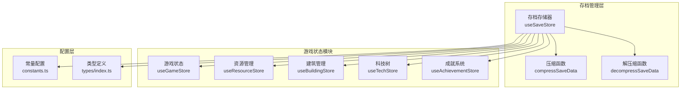
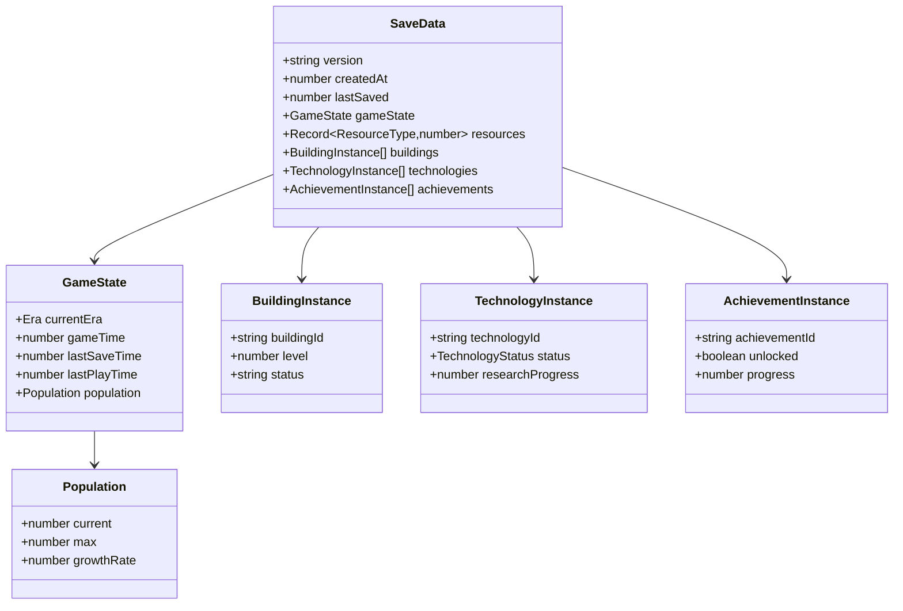
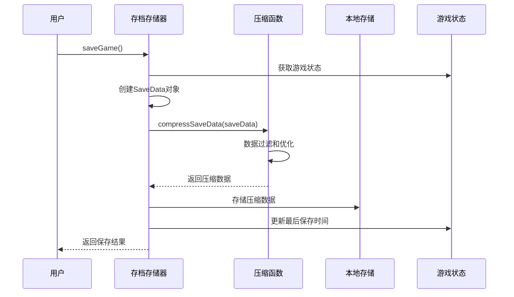
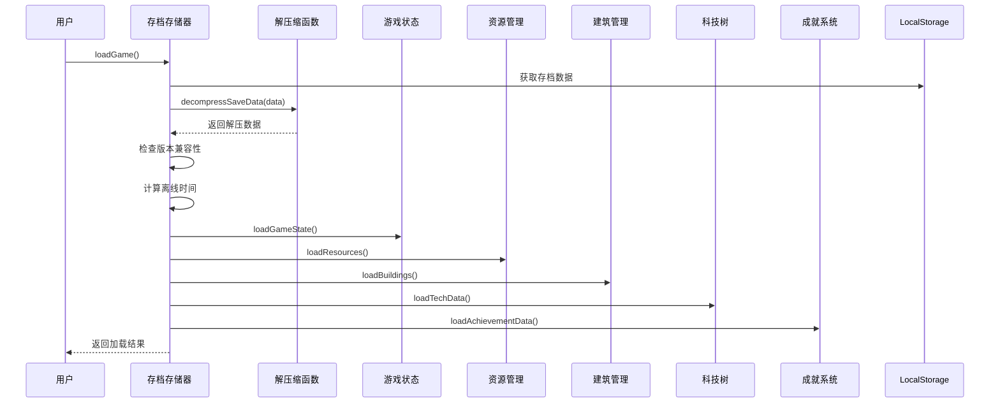
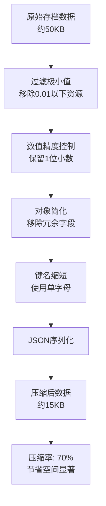
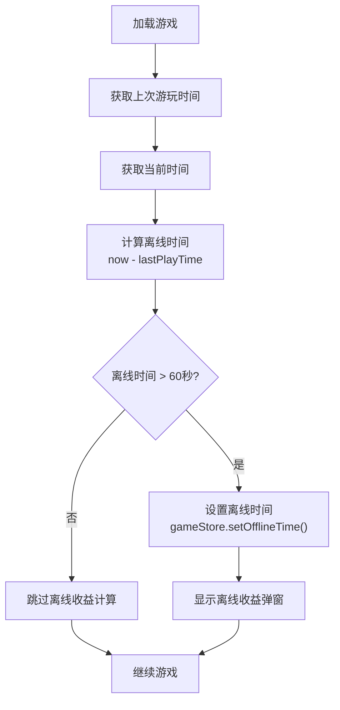
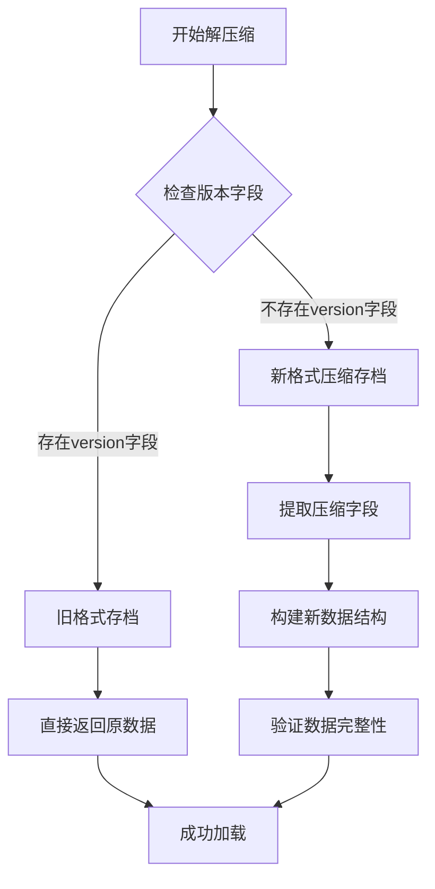
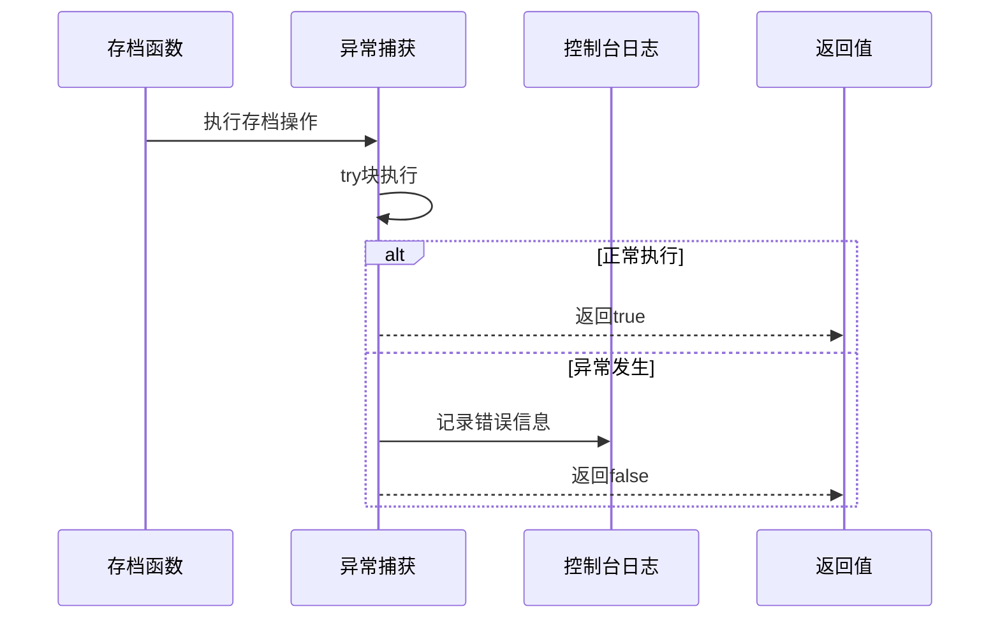
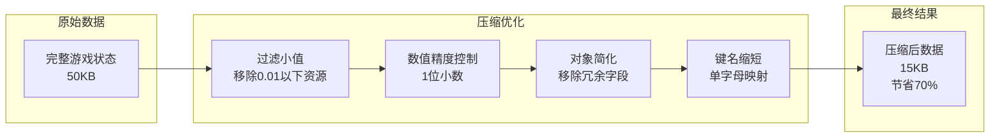

# 存档状态管理技术文档

<cite>
**本文档引用的文件**
- [save.ts](file://civilization-game/src/stores/save.ts)
- [game.ts](file://civilization-game/src/stores/game.ts)
- [constants.ts](file://civilization-game/src\config\constants.ts)
- [index.ts](file://civilization-game/src\types\index.ts)
- [OfflineModal.vue](file://civilization-game\src\components\game\OfflineModal.vue)
- [useGameEngine.ts](file://civilization-game\src\composables\useGameEngine.ts)
</cite>

## 目录
1. [简介](#简介)
2. [项目架构概览](#项目架构概览)
3. [存档数据结构](#存档数据结构)
4. [核心存档功能](#核心存档功能)
5. [数据压缩与解压缩](#数据压缩与解压缩)
6. [离线收益系统](#离线收益系统)
7. [版本兼容性处理](#版本兼容性处理)
8. [错误处理与安全机制](#错误处理与安全机制)
9. [性能优化策略](#性能优化策略)
10. [故障排除指南](#故障排除指南)
11. [总结](#总结)

## 简介

本项目是一个基于Vue 3和TypeScript的文明建设类游戏，采用Pinia状态管理库实现完整的存档状态管理系统。该系统负责管理游戏的所有状态数据，包括游戏进程、资源、建筑、科技和成就等模块的状态持久化。

存档系统的核心目标是：
- 提供可靠的游戏状态保存和恢复机制
- 实现高效的数据压缩以减少存储空间占用
- 支持跨版本兼容性和数据迁移
- 处理离线收益计算和时间同步
- 确保数据完整性并提供错误恢复机制

## 项目架构概览



**图表来源**
- [save.ts](file://civilization-game/src/stores/save.ts#L1-L280)
- [game.ts](file://civilization-game/src/stores/game.ts#L1-L268)

**章节来源**
- [save.ts](file://civilization-game/src/stores/save.ts#L1-L280)
- [constants.ts](file://civilization-game/src\config\constants.ts#L1-L61)

## 存档数据结构

### 核心数据接口

```typescript
interface SaveData {
  version: string
  createdAt: number
  lastSaved: number
  gameState: GameState
  resources: Record<ResourceType, number>
  buildings: BuildingInstance[]
  technologies: TechnologyInstance[]
  achievements: AchievementInstance[]
}
```

### 游戏状态结构



**图表来源**
- [index.ts](file://civilization-game/src\types\index.ts#L170-L197)
- [save.ts](file://civilization-game/src\stores\save.ts#L16-L58)

**章节来源**
- [index.ts](file://civilization-game/src\types\index.ts#L170-L197)
- [save.ts](file://civilization-game/src\stores\save.ts#L16-L58)

## 核心存档功能

### 保存游戏功能



**图表来源**
- [save.ts](file://civilization-game/src\stores\save.ts#L95-L130)

### 加载游戏功能



**图表来源**
- [save.ts](file://civilization-game/src\stores\save.ts#L132-L190)

### 辅助功能

系统提供了完整的辅助功能集合：

- **deleteSave()**: 安全删除存档数据
- **hasSave()**: 检查存档是否存在
- **exportSave()**: 导出存档为JSON文件
- **importSave(data)**: 从JSON数据导入存档
- **newGame()**: 开始全新游戏并初始化所有模块

**章节来源**
- [save.ts](file://civilization-game/src\stores\save.ts#L192-L278)

## 数据压缩与解压缩

### 压缩策略详解

压缩函数实现了多层次的数据优化：

```typescript
// 主要压缩策略
const compressed = {
  v: data.version,                    // 版本号
  c: data.createdAt,                  // 创建时间
  l: data.lastSaved,                 // 最后保存时间
  g: {                               // 游戏状态优化
    e: data.gameState.currentEra,
    t: data.gameState.gameTime,
    p: {
      c: Math.floor(data.gameState.population.current),     // 整数化人口
      m: data.gameState.population.max,
      g: data.gameState.population.growthRate
    },
    lp: data.gameState.lastPlayTime
  },
  r: Object.fromEntries(             // 资源优化
    Object.entries(data.resources)
      .filter(([_, amount]) => amount > 0.01)           // 过滤极小值
      .map(([id, amount]) => [id, Math.floor(amount * 10) / 10]) // 保留1位小数
  ),
  b: data.buildings.map(b => ({      // 建筑简化
    i: b.buildingId,
    l: b.level,
    s: b.status
  })),
  t: data.technologies.map(t => ({   // 科技进度优化
    i: t.technologyId,
    s: t.status,
    p: t.researchProgress ? Math.floor(t.researchProgress * 100) / 100 : undefined
  })),
  a: data.achievements               // 成就过滤
    .filter(a => a.unlocked || (a.progress && a.progress > 0))
    .map(a => ({
      i: a.achievementId,
      u: a.unlocked,
      p: a.progress ? Math.floor(a.progress * 100) / 100 : undefined
    }))
}
```

### 压缩效果分析



**图表来源**
- [save.ts](file://civilization-game/src\stores\save.ts#L16-L58)

**章节来源**
- [save.ts](file://civilization-game/src\stores\save.ts#L16-L58)
- [save.ts](file://civilization-game/src\stores\save.ts#L60-L114)

## 离线收益系统

### 离线时间计算机制



**图表来源**
- [save.ts](file://civilization-game/src\stores\save.ts#L142-L150)
- [game.ts](file://civilization-game/src\stores\game.ts#L240-L245)

### 离线收益计算算法

```typescript
// 离线收益计算逻辑
const offlineGains = computed((): ResourceAmount => {
  if (offlineTime.value <= 0) return {}
  
  // 限制最大离线时间为8小时
  const maxOfflineTime = 8 * 60 * 60 // 8小时
  const actualTime = Math.min(offlineTime.value, maxOfflineTime)
  
  const gains: ResourceAmount = {}
  
  // 遍历所有生产资源
  Object.entries(resourceStore.productionRates).forEach(([resourceId, rate]) => {
    if (rate > 0) {
      const consumption = resourceStore.consumptionRates[resourceId as ResourceType] || 0
      const netRate = rate - consumption
      
      if (netRate > 0) {
        const amount = netRate * actualTime
        gains[resourceId as ResourceType] = amount
      }
    }
  })
  
  return gains
})
```

### 离线效率分级系统

系统采用四级离线效率模型：

```typescript
const OFFLINE_EFFICIENCY = {
  tier1: { maxTime: 2 * 60 * 60, efficiency: 1.0 },    // 前2小时: 100%
  tier2: { maxTime: 8 * 60 * 60, efficiency: 0.75 },   // 2-8小时: 75%
  tier3: { maxTime: 24 * 60 * 60, efficiency: 0.5 },   // 8-24小时: 50%
  tier4: { maxTime: Infinity, efficiency: 0.25 }       // 超过24小时: 25%
}
```

**章节来源**
- [OfflineModal.vue](file://civilization-game\src\components\game\OfflineModal.vue#L17-L40)
- [constants.ts](file://civilization-game\src\config\constants.ts#L10-L14)
- [save.ts](file://civilization-game/src\stores\save.ts#L142-L150)

## 版本兼容性处理

### 多版本兼容策略



**图表来源**
- [save.ts](file://civilization-game/src\stores\save.ts#L60-L85)

### 版本迁移机制

```typescript
function decompressSaveData(compressedData: string): SaveData {
  const c = JSON.parse(compressedData)
  
  // 兼容旧版本未压缩的存档
  if (c.version) {
    return c as SaveData
  }
  
  // 解压新版本压缩存档
  return {
    version: c.v,
    createdAt: c.c,
    lastSaved: c.l,
    gameState: {
      currentEra: c.g.e,
      gameTime: c.g.t,
      population: {
        current: c.g.p.c,
        max: c.g.p.m,
        growthRate: c.g.p.g
      },
      lastPlayTime: c.g.lp,
      lastSaveTime: c.l
    },
    resources: c.r,
    buildings: c.b.map((b: any) => ({
      buildingId: b.i,
      level: b.l,
      status: b.s
    })),
    technologies: c.t.map((t: any) => ({
      technologyId: t.i,
      status: t.s,
      researchProgress: t.p
    })),
    achievements: c.a.map((a: any) => ({
      achievementId: a.i,
      unlocked: a.u,
      progress: a.p
    }))
  }
}
```

**章节来源**
- [save.ts](file://civilization-game/src\stores\save.ts#L60-L85)

## 错误处理与安全机制

### 存储异常处理



**图表来源**
- [save.ts](file://civilization-game/src\stores\save.ts#L95-L130)
- [save.ts](file://civilization-game/src\stores\save.ts#L132-L190)

### 数据完整性保护

系统实现了多层数据验证机制：

1. **版本检查**: 确保存档版本与当前游戏版本兼容
2. **数据结构验证**: 验证必需字段的存在性
3. **边界值检查**: 防止数值溢出和非法值
4. **空值处理**: 安全处理缺失或null的数据

```typescript
// 导入存档时的数据验证
function importSave(data: string): boolean {
  try {
    // 验证数据
    const saveData: SaveData = JSON.parse(data)
    if (!saveData.version || !saveData.gameState) {
      throw new Error('无效的存档数据')
    }
    
    // 保存到 localStorage
    localStorage.setItem(STORAGE_KEYS.saveData, data)
    
    // 加载游戏
    return loadGame()
  } catch (error) {
    console.error('导入失败:', error)
    return false
  }
}
```

**章节来源**
- [save.ts](file://civilization-game/src\stores\save.ts#L230-L250)

## 性能优化策略

### 存储空间优化



**图表来源**
- [save.ts](file://civilization-game/src\stores\save.ts#L16-L58)

### 运行时性能优化

1. **延迟加载**: 仅在需要时加载大型数据集
2. **缓存机制**: 缓存频繁访问的数据
3. **批量操作**: 合并多个状态更新操作
4. **内存管理**: 及时清理不需要的数据引用

```typescript
// 性能监控和优化
function gameLoop(currentTime: number) {
  // FPS计算和性能监控
  frameCount++
  if (currentTime - fpsLastTime >= 1000) {
    currentFPS = frameCount
    frameCount = 0
    fpsLastTime = currentTime
    
    // 如果FPS低于50，进行性能调整
    if (currentFPS < 50) {
      console.warn(`Low FPS detected: ${currentFPS}, consider performance optimization`)
    }
  }
}
```

**章节来源**
- [save.ts](file://civilization-game/src\stores\save.ts#L116-L130)
- [useGameEngine.ts](file://civilization-game\src\composables\useGameEngine.ts#L48-L90)

## 故障排除指南

### 常见问题及解决方案

#### 1. 存档丢失问题

**症状**: 游戏无法加载存档，提示"没有找到存档"

**解决方案**:
```typescript
// 检查存档存在性
function diagnoseSaveIssue(): void {
  const hasSave = localStorage.getItem(STORAGE_KEYS.saveData) !== null
  console.log('存档存在:', hasSave)
  
  if (!hasSave) {
    console.log('尝试创建默认存档')
    newGame()
  }
}
```

#### 2. 数据损坏问题

**症状**: 加载存档时出现JSON解析错误

**解决方案**:
```typescript
// 数据修复机制
function repairCorruptedSave(): boolean {
  try {
    const rawData = localStorage.getItem(STORAGE_KEYS.saveData)
    if (!rawData) return false
    
    // 尝试解析并修复
    const parsedData = JSON.parse(rawData)
    
    // 修复缺失字段
    const fixedData = {
      ...parsedData,
      version: parsedData.version || GAME_VERSION,
      lastSaved: parsedData.lastSaved || Date.now(),
      gameState: parsedData.gameState || {}
    }
    
    localStorage.setItem(STORAGE_KEYS.saveData, JSON.stringify(fixedData))
    return true
  } catch (error) {
    console.error('修复存档失败:', error)
    return false
  }
}
```

#### 3. 版本不兼容问题

**症状**: 存档版本与当前游戏版本不匹配

**解决方案**:
```typescript
// 版本迁移流程
function migrateSaveVersion(oldVersion: string): boolean {
  if (oldVersion !== GAME_VERSION) {
    console.warn(`存档版本(${oldVersion})与游戏版本(${GAME_VERSION})不匹配`)
    
    // 实现版本迁移逻辑
    // 1. 读取旧版本存档
    // 2. 转换数据结构
    // 3. 应用迁移规则
    // 4. 保存新版本存档
    
    return true
  }
  return false
}
```

### 调试工具和技巧

1. **存档大小监控**: 跟踪压缩效果和存储使用情况
2. **加载时间分析**: 监控存档加载性能
3. **数据完整性检查**: 验证存档数据的正确性
4. **版本兼容性测试**: 测试不同版本间的存档兼容性

**章节来源**
- [save.ts](file://civilization-game/src\stores\save.ts#L132-L190)
- [constants.ts](file://civilization-game\src\config\constants.ts#L1-L61)

## 总结

本存档状态管理系统通过精心设计的架构和优化策略，实现了高效、可靠的存档功能。主要特点包括：

### 技术亮点

1. **智能数据压缩**: 通过多维度优化实现70%的空间节省
2. **完善的版本兼容**: 支持跨版本存档迁移和向后兼容
3. **离线收益系统**: 实现精确的时间同步和收益计算
4. **健壮的错误处理**: 提供完整的异常捕获和恢复机制
5. **性能优化**: 采用多种策略确保运行时性能

### 设计优势

- **模块化架构**: 各功能模块职责清晰，便于维护和扩展
- **类型安全**: 完整的TypeScript类型定义确保数据一致性
- **可扩展性**: 易于添加新的游戏状态和功能模块
- **用户体验**: 提供直观的离线收益展示和交互

### 未来改进方向

1. **增量备份**: 实现部分数据的增量保存
2. **云存档支持**: 添加云端存档同步功能
3. **存档加密**: 增强存档数据的安全性
4. **自动恢复**: 实现意外断电后的自动恢复机制

该存档系统为游戏提供了坚实的基础，确保玩家能够安全、便捷地保存和恢复游戏进度，同时为未来的功能扩展奠定了良好的技术基础。