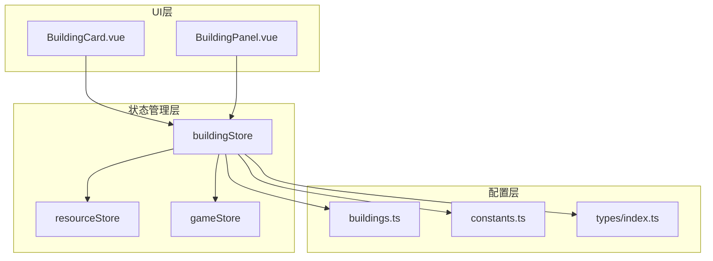
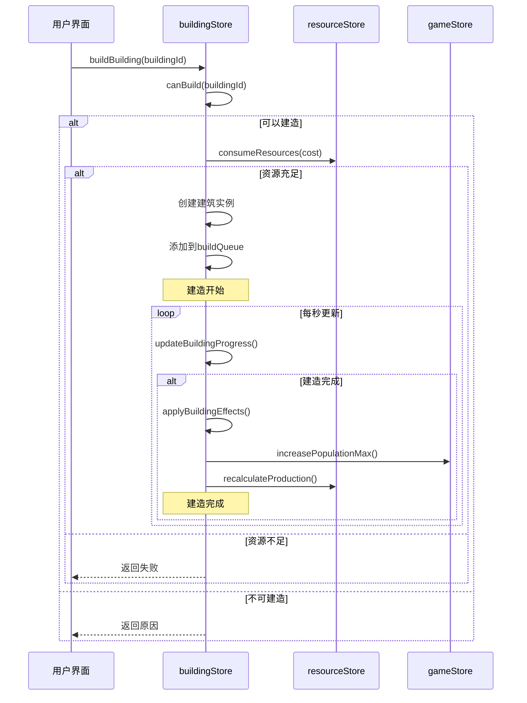
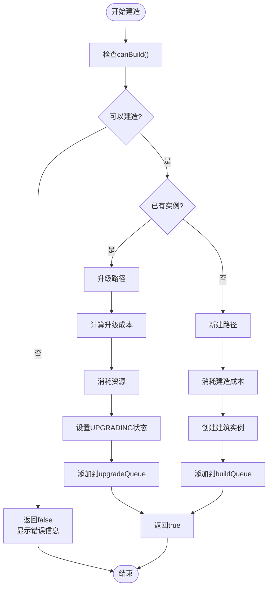
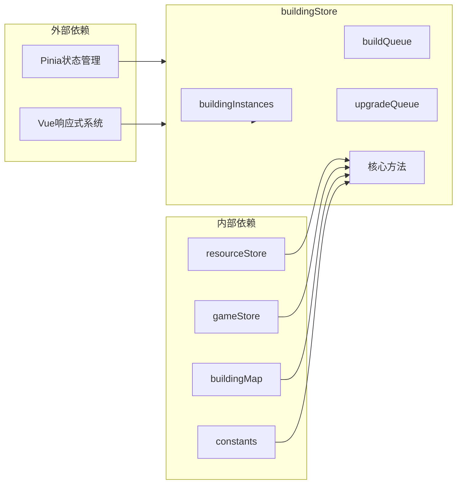

# 建筑状态管理

<cite>
**本文档中引用的文件**
- [building.ts](file://civilization-game/src/stores/building.ts)
- [types/index.ts](file://civilization-game/src/types/index.ts)
- [config/buildings.ts](file://civilization-game/src/config/buildings.ts)
- [config/constants.ts](file://civilization-game/src/config/constants.ts)
- [stores/game.ts](file://civilization-game/src/stores/game.ts)
- [stores/resource.ts](file://civilization-game/src/stores/resource.ts)
- [components/game/BuildingCard.vue](file://civilization-game/src/components/game/BuildingCard.vue)
</cite>

## 目录
1. [简介](#简介)
2. [项目结构](#项目结构)
3. [核心组件](#核心组件)
4. [架构概览](#架构概览)
5. [详细组件分析](#详细组件分析)
6. [依赖关系分析](#依赖关系分析)
7. [性能考虑](#性能考虑)
8. [故障排除指南](#故障排除指南)
9. [结论](#结论)

## 简介

buildingStore是文明建设游戏中负责管理建筑状态的核心状态管理模块。它统一处理建筑的建造、升级、状态跟踪和效果应用，为整个游戏提供了完整的建筑生命周期管理功能。该模块通过Pinia状态管理库实现，采用响应式设计，确保UI组件能够实时反映建筑状态的变化。

## 项目结构

buildingStore位于`src/stores/building.ts`文件中，作为游戏状态管理的重要组成部分。其结构设计遵循模块化原则，与其他核心模块如资源管理、游戏状态和科技树紧密协作。



**图表来源**
- [building.ts](file://civilization-game/src/stores/building.ts#L1-L320)
- [resource.ts](file://civilization-game/src/stores/resource.ts#L1-L202)
- [game.ts](file://civilization-game/src/stores/game.ts#L1-L268)

## 核心组件

buildingStore包含以下核心状态和方法：

### 状态集合
- **buildingInstances**: 已建造的建筑实例数组
- **buildQueue**: 正在建造中的建筑队列
- **upgradeQueue**: 正在升级中的建筑队列

### 关键方法
- **canBuild**: 条件检查函数
- **buildBuilding**: 统一建造/升级入口
- **updateBuildingProgress**: 进度更新控制器
- **applyBuildingEffects**: 效果应用处理器
- **recalculateAllEffects**: 效果重计算引擎

**章节来源**
- [building.ts](file://civilization-game/src/stores/building.ts#L15-L30)
- [building.ts](file://civilization-game/src/stores/building.ts#L84-L125)

## 架构概览

buildingStore采用事件驱动的状态管理模式，通过队列系统管理建筑的异步操作。整个架构围绕建筑生命周期展开，从建造请求到效果应用形成完整的闭环。



**图表来源**
- [building.ts](file://civilization-game/src/stores/building.ts#L84-L125)
- [building.ts](file://civilization-game/src/stores/building.ts#L127-L169)
- [building.ts](file://civilization-game/src/stores/building.ts#L171-L218)

## 详细组件分析

### canBuild条件检查逻辑

canBuild方法实现了复杂的条件验证机制，确保建筑建造的合理性：

```typescript
function canBuild(buildingId: string): { can: boolean; reason?: string } {
  const config = getBuildingConfig(buildingId)
  if (!config) {
    return { can: false, reason: '建筑不存在' }
  }

  // 检查是否已达到最大数量
  const instance = getBuildingInstance(buildingId)
  if (instance && instance.level >= config.maxLevel) {
    return { can: false, reason: '已达到最大等级' }
  }

  // 检查解锁条件
  for (const req of config.requirements) {
    if (req.type === 'era') {
      if (gameStore.currentEra !== req.id) {
        return { can: false, reason: `需要${req.id}时代` }
      }
    }
    // 其他条件检查(科技、建筑等)待实现
  }

  // 检查资源
  const cost = instance ? calculateUpgradeCost(buildingId) : config.buildCost
  if (!resourceStore.hasEnoughResources(cost)) {
    return { can: false, reason: '资源不足' }
  }

  return { can: true }
}
```

#### 时代限制检查
系统严格遵循时代顺序，只有在正确时代才能解锁相应建筑。例如：
- 石器时代建筑只能在STONE时代建造
- 青铜时代建筑需要BRONZE时代
- 工业时代建筑需要INDUSTRIAL时代

#### 资源验证机制
资源验证采用两阶段检查：
1. **预计算成本**: 根据当前等级计算升级成本
2. **实际验证**: 检查资源库存是否充足

#### 等级上限判断
每个建筑都有最大等级限制，防止无限升级导致的游戏失衡。

**章节来源**
- [building.ts](file://civilization-game/src/stores/building.ts#L43-L78)

### buildBuilding方法统一处理

buildBuilding方法作为建造/升级的统一入口，实现了智能的流程控制：



**图表来源**
- [building.ts](file://civilization-game/src/stores/building.ts#L84-L125)

#### 新建与升级流程差异
- **新建建筑**: 创建新的BuildingInstance，添加到buildingInstances
- **升级建筑**: 在现有实例上修改，保持buildingId不变

#### 资源管理策略
- 使用原子性操作确保资源一致性
- 失败时自动回滚资源消耗

**章节来源**
- [building.ts](file://civilization-game/src/stores/building.ts#L84-L125)

### updateBuildingProgress时序控制

updateBuildingProgress方法负责管理建造和升级队列的时序控制：

```typescript
function updateBuildingProgress() {
  const now = Date.now()

  // 检查建造队列
  buildQueue.value.forEach((buildingId, index) => {
    const instance = getBuildingInstance(buildingId)
    const config = getBuildingConfig(buildingId)
    if (!instance || !config || !instance.buildStartTime) return

    const elapsed = (now - instance.buildStartTime) / 1000
    if (elapsed >= config.buildTime) {
      // 建造完成
      instance.status = BuildingStatus.BUILT
      delete instance.buildStartTime
      buildQueue.value.splice(index, 1)
      
      // 应用建筑效果
      applyBuildingEffects(buildingId)
      
      console.log(`建筑完成: ${config.name}`)
    }
  })

  // 检查升级队列
  upgradeQueue.value.forEach((buildingId, index) => {
    const instance = getBuildingInstance(buildingId)
    const config = getBuildingConfig(buildingId)
    if (!instance || !config || !instance.upgradeStartTime) return

    const elapsed = (now - instance.upgradeStartTime) / 1000
    const upgradeTime = config.upgradeTime * Math.pow(BUILDING.timeMultiplier, instance.level - 1)
    
    if (elapsed >= upgradeTime) {
      // 升级完成
      instance.level++
      instance.status = BuildingStatus.BUILT
      delete instance.upgradeStartTime
      upgradeQueue.value.splice(index, 1)
      
      // 重新计算建筑效果
      recalculateAllEffects()
      
      console.log(`建筑升级完成: ${config.name} Lv.${instance.level}`)
    }
  })
}
```

#### 异步进度计算
- 使用时间差计算进度百分比
- 支持动态调整升级时间（基于等级）

#### 队列管理机制
- 实现FIFO（先进先出）队列
- 自动移除已完成任务

#### 性能优化策略
- 避免不必要的遍历操作
- 使用索引定位队列元素

**章节来源**
- [building.ts](file://civilization-game/src/stores/building.ts#L127-L169)
- [building.ts](file://civilization-game/src/stores/building.ts#L171-L218)

### applyBuildingEffects效果应用

applyBuildingEffects方法负责将建筑效果应用到游戏系统中：

```typescript
function applyBuildingEffects(buildingId: string) {
  const config = getBuildingConfig(buildingId)
  const instance = getBuildingInstance(buildingId)
  if (!config || !instance) return

  // 增加人口上限
  if (config.population) {
    gameStore.increasePopulationMax(config.population)
  }

  // 增加存储容量
  if (config.capacity) {
    Object.entries(config.capacity).forEach(([resource, amount]) => {
      resourceStore.increaseResourceLimit(resource as any, amount)
    })
  }

  // 重新计算资源产出
  recalculateAllEffects()
}
```

#### 人口系统集成
- 直接调用gameStore.increasePopulationMax()
- 确保人口上限与建筑能力匹配

#### 存储系统扩展
- 支持多种资源类型的存储扩展
- 实现增量式容量增加

#### 资源产出重计算
- 触发recalculateAllEffects()重新计算
- 确保所有产出值准确反映建筑效果

**章节来源**
- [building.ts](file://civilization-game/src/stores/building.ts#L219-L242)

### recalculateAllEffects效果重计算

recalculateAllEffects方法实现了全局效果重计算机制：

```typescript
function recalculateAllEffects() {
  // 重置所有产出
  resourceStore.recalculateProduction()

  // 遍历所有已建造的建筑
  buildingInstances.value.forEach(instance => {
    if (instance.status !== BuildingStatus.BUILT) return

    const config = getBuildingConfig(instance.buildingId)
    if (!config) return

    // 计算产出
    if (config.production) {
      const production = calculateProduction(instance.buildingId)
      Object.entries(production).forEach(([resource, amount]) => {
        const current = resourceStore.productionRates[resource as ResourceType] || 0
        resourceStore.setProductionRate(resource as ResourceType, current + amount)
      })
    }

    // 计算消耗
    if (config.consumption) {
      Object.entries(config.consumption).forEach(([resource, amount]) => {
        const levelBonus = 1 + BUILDING.productionIncreasePerLevel * (instance.level - 1)
        const consumption = (amount || 0) * levelBonus
        const current = resourceStore.consumptionRates[resource as ResourceType] || 0
        resourceStore.setConsumptionRate(resource as ResourceType, current + consumption)
      })
    }
  })
}
```

#### 产出计算机制
- 基于基础产出和等级倍增计算
- 支持多资源产出

#### 消耗计算逻辑
- 考虑等级对消耗的影响
- 实现动态消耗调整

#### 效果叠加原理
- 支持多个相同建筑的效果叠加
- 确保计算结果的准确性

**章节来源**
- [building.ts](file://civilization-game/src/stores/building.ts#L244-L282)

### 辅助方法使用场景

#### getBuildingProgress进度查询
```typescript
function getBuildingProgress(buildingId: string): number {
  const instance = getBuildingInstance(buildingId)
  const config = getBuildingConfig(buildingId)
  if (!instance || !config) return 0

  if (instance.status === BuildingStatus.BUILDING && instance.buildStartTime) {
    const elapsed = (Date.now() - instance.buildStartTime) / 1000
    return Math.min(100, (elapsed / config.buildTime) * 100)
  }

  if (instance.status === BuildingStatus.UPGRADING && instance.upgradeStartTime) {
    const elapsed = (Date.now() - instance.upgradeStartTime) / 1000
    const upgradeTime = config.upgradeTime * Math.pow(BUILDING.timeMultiplier, instance.level - 1)
    return Math.min(100, (elapsed / upgradeTime) * 100)
  }

  return 0
}
```

#### getRemainingTime剩余时间计算
```typescript
function getRemainingTime(buildingId: string): number {
  const instance = getBuildingInstance(buildingId)
  const config = getBuildingConfig(buildingId)
  if (!instance || !config) return 0

  if (instance.status === BuildingStatus.BUILDING && instance.buildStartTime) {
    const elapsed = (Date.now() - instance.buildStartTime) / 1000
    return Math.max(0, config.buildTime - elapsed)
  }

  if (instance.status === BuildingStatus.UPGRADING && instance.upgradeStartTime) {
    const elapsed = (Date.now() - instance.upgradeStartTime) / 1000
    const upgradeTime = config.upgradeTime * Math.pow(BUILDING.timeMultiplier, instance.level - 1)
    return Math.max(0, upgradeTime - elapsed)
  }

  return 0
}
```

这些辅助方法为UI组件提供了精确的进度显示和时间预测功能。

**章节来源**
- [building.ts](file://civilization-game/src/stores/building.ts#L250-L288)

## 依赖关系分析

buildingStore与多个核心模块存在密切的依赖关系：



**图表来源**
- [building.ts](file://civilization-game/src/stores/building.ts#L1-L10)
- [building.ts](file://civilization-game/src/stores/building.ts#L15-L30)

### 与资源系统的交互
- **资源消耗**: 建造和升级时消耗资源
- **产出计算**: 基于建筑配置计算资源产出
- **存储管理**: 扩展资源存储容量

### 与游戏状态的集成
- **时代同步**: 根据当前时代解锁建筑
- **人口管理**: 增加人口上限
- **事件触发**: 建造完成时触发相关事件

**章节来源**
- [building.ts](file://civilization-game/src/stores/building.ts#L1-L10)
- [building.ts](file://civilization-game/src/stores/building.ts#L219-L242)

## 性能考虑

### 内存管理策略
- 使用ref创建响应式状态，避免内存泄漏
- 及时清理完成的任务，释放队列空间
- 合理使用对象池减少GC压力

### 计算优化技术
- 缓存建筑配置信息，避免重复查找
- 实现增量计算，只更新变化的部分
- 使用索引加速队列查找操作

### 并发处理机制
- 支持同时进行多个建筑的建造/升级
- 实现非阻塞的进度更新
- 避免长时间运行的操作影响UI响应

## 故障排除指南

### 常见问题及解决方案

#### 建造失败问题
**症状**: canBuild返回false但没有明确错误信息
**可能原因**:
- 资源不足
- 时代限制未满足
- 建筑等级已达上限

**解决方法**:
```typescript
const check = buildingStore.canBuild(buildingId)
console.log('建造检查结果:', check)
// 根据reason字段确定具体原因
```

#### 进度更新异常
**症状**: 建筑进度不更新或显示错误
**可能原因**:
- 时间戳计算错误
- 队列状态不一致
- 状态同步问题

**解决方法**:
- 检查updateBuildingProgress调用频率
- 验证时间计算逻辑
- 确认队列状态一致性

#### 效果应用失效
**症状**: 建筑效果未生效
**可能原因**:
- recalculateAllEffects未被调用
- 效果计算逻辑错误
- 状态同步延迟

**解决方法**:
- 确保在applyBuildingEffects后调用recalculateAllEffects
- 验证效果计算公式
- 检查状态同步机制

**章节来源**
- [building.ts](file://civilization-game/src/stores/building.ts#L43-L78)
- [building.ts](file://civilization-game/src/stores/building.ts#L127-L169)

## 结论

buildingStore作为文明建设游戏的核心状态管理模块，成功实现了建筑生命周期的完整管理。通过精心设计的状态结构、队列管理和效果应用机制，为玩家提供了流畅的建筑体验。

### 主要优势
- **模块化设计**: 清晰的职责分离和接口定义
- **响应式更新**: 实时的状态变化反馈
- **性能优化**: 高效的计算和内存管理
- **扩展性强**: 支持新建筑类型的轻松添加

### 改进建议
- 实现建筑依赖关系的可视化
- 增强错误处理和日志记录
- 优化大规模建筑群的性能表现
- 添加建筑效果的调试工具

buildingStore的设计充分体现了现代前端应用的最佳实践，为构建复杂的游戏状态管理系统提供了优秀的参考范例。