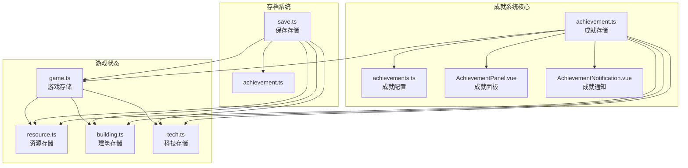
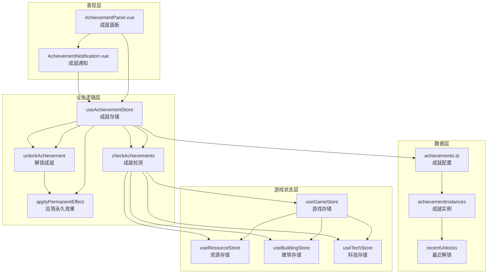
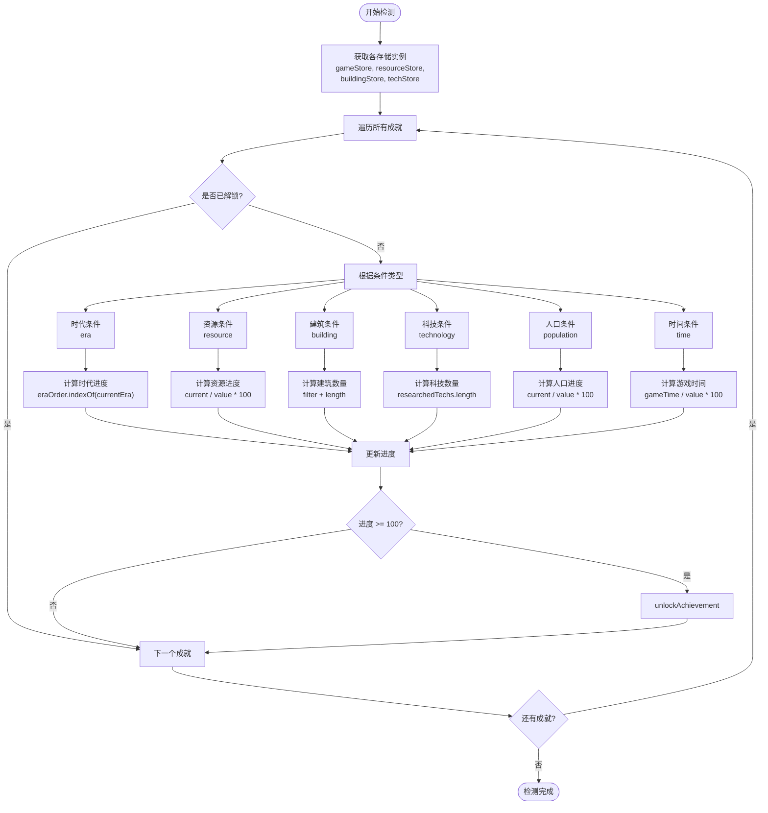
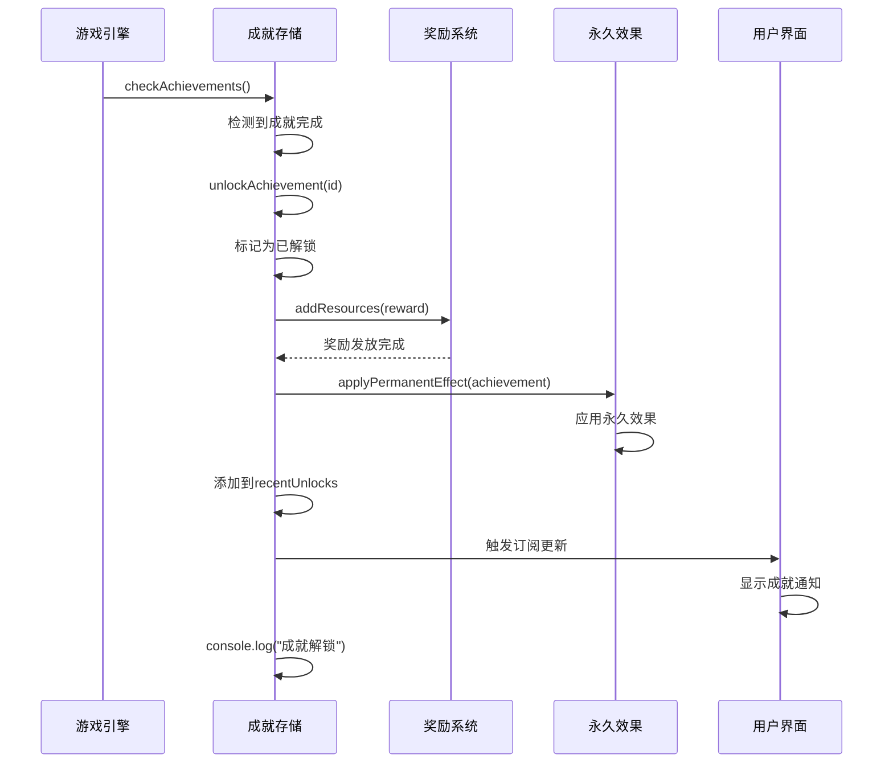
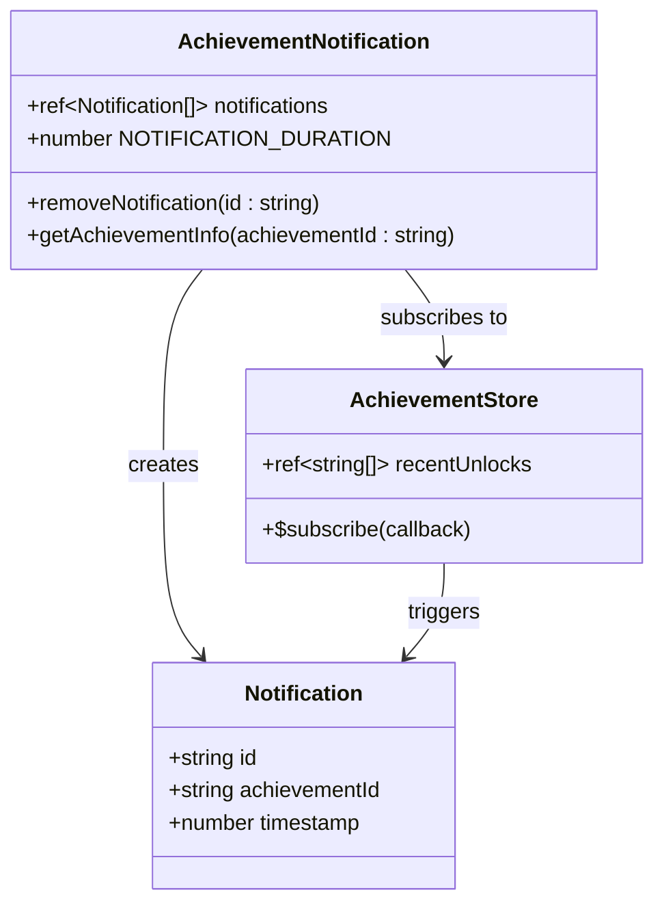
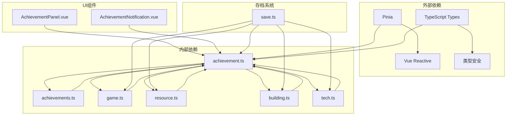

# 成就状态管理系统

<cite>
**本文档引用的文件**
- [achievement.ts](file://civilization-game/src/stores/achievement.ts)
- [achievements.ts](file://civilization-game/src/config/achievements.ts)
- [AchievementPanel.vue](file://civilization-game/src/components/game/AchievementPanel.vue)
- [AchievementNotification.vue](file://civilization-game/src/components/game/AchievementNotification.vue)
- [game.ts](file://civilization-game/src/stores/game.ts)
- [resource.ts](file://civilization-game/src/stores/resource.ts)
- [building.ts](file://civilization-game/src/stores/building.ts)
- [tech.ts](file://civilization-game/src/stores/tech.ts)
- [save.ts](file://civilization-game/src/stores/save.ts)
- [index.ts](file://civilization-game/src/types/index.ts)
</cite>

## 目录
1. [简介](#简介)
2. [项目结构概览](#项目结构概览)
3. [核心组件分析](#核心组件分析)
4. [架构概览](#架构概览)
5. [详细组件分析](#详细组件分析)
6. [依赖关系分析](#依赖关系分析)
7. [性能考虑](#性能考虑)
8. [故障排除指南](#故障排除指南)
9. [结论](#结论)

## 简介

成就状态管理系统是《文明游戏》中的核心功能模块，负责管理玩家在游戏中解锁的各种成就。该系统通过响应式状态管理、实时成就检测和用户界面集成，为玩家提供丰富的游戏体验和成就感。

系统主要包含以下核心功能：
- **成就实例管理**：跟踪每个成就的状态和进度
- **实时成就检测**：根据游戏状态动态检查成就条件
- **奖励发放机制**：解锁成就时自动发放奖励和永久效果
- **通知系统**：提供视觉反馈和用户体验优化
- **存档系统**：支持成就数据的序列化和恢复

## 项目结构概览

成就系统的文件组织结构清晰，遵循模块化设计原则：



**图表来源**
- [achievement.ts](file://civilization-game/src/stores/achievement.ts#L1-L278)
- [achievements.ts](file://civilization-game/src/config/achievements.ts#L1-L755)

**章节来源**
- [achievement.ts](file://civilization-game/src/stores/achievement.ts#L1-L278)
- [achievements.ts](file://civilization-game/src/config/achievements.ts#L1-L755)

## 核心组件分析

### 成就存储 (achievement.ts)

成就存储是整个系统的核心，使用Pinia进行状态管理，提供了完整的响应式状态管理和计算属性。

#### 状态管理

```typescript
// 主要状态
const achievementInstances = ref<Map<string, AchievementInstance>>(new Map())
const recentUnlocks = ref<string[]>([]) // 最近解锁的成就ID列表
```

#### 计算属性

系统提供了三个关键的计算属性来反映成就状态：

```typescript
// 已解锁的成就列表
const unlockedAchievements = computed(() => {
  const unlocked: Achievement[] = []
  achievementInstances.value.forEach((instance, id) => {
    if (instance.unlocked) {
      const achievement = getAchievement(id)
      if (achievement) unlocked.push(achievement)
    }
  })
  return unlocked
})

// 锁定的成就列表
const lockedAchievements = computed(() => {
  return achievements.filter(achievement => {
    const instance = achievementInstances.value.get(achievement.id)
    return !instance?.unlocked
  })
})

// 成就进度统计
const achievementProgress = computed(() => {
  const total = achievements.length
  const unlocked = unlockedAchievements.value.length
  return {
    unlocked,
    total,
    percentage: (unlocked / total) * 100
  }
})
```

**章节来源**
- [achievement.ts](file://civilization-game/src/stores/achievement.ts#L11-L47)
- [achievement.ts](file://civilization-game/src/stores/achievement.ts#L17-L47)

## 架构概览

成就系统采用分层架构设计，确保了良好的模块分离和可维护性：



**图表来源**
- [achievement.ts](file://civilization-game/src/stores/achievement.ts#L1-L278)
- [AchievementPanel.vue](file://civilization-game/src/components/game/AchievementPanel.vue#L1-L198)
- [AchievementNotification.vue](file://civilization-game/src/components/game/AchievementNotification.vue#L1-L204)

## 详细组件分析

### checkAchievements 成就检测机制

`checkAchievements`函数是成就系统的核心，负责实时监控游戏状态并检测成就条件：



**图表来源**
- [achievement.ts](file://civilization-game/src/stores/achievement.ts#L48-L120)

#### 各类成就条件的检测逻辑

##### 时代成就 (Era Conditions)

```typescript
case 'era':
  const eraOrder = ['stone', 'bronze', 'iron', 'industrial', 'information', 'space', 'interstellar', 'hyperdimensional']
  const currentEraIndex = eraOrder.indexOf(gameStore.currentEra)
  progress = currentEraIndex >= condition.value ? 100 : (currentEraIndex / condition.value) * 100
  break
```

##### 资源成就 (Resource Conditions)

```typescript
case 'resource':
  if (condition.target) {
    const current = resourceStore.getResourceAmount(condition.target as ResourceType)
    progress = Math.min((current / condition.value) * 100, 100)
  }
  break
```

##### 建筑成就 (Building Conditions)

```typescript
case 'building':
  const buildings = buildingStore.buildingInstances
  let count = 0
  
  if (condition.target === 'max_level') {
    // 检查是否有满级建筑
    count = buildings.filter(b => {
      const config = buildingStore.getBuildingConfig(b.buildingId)
      return config && b.level >= config.maxLevel
    }).length
  } else if (condition.target) {
    // 检查特定类型建筑
    count = buildings.filter(b => {
      const config = buildingStore.getBuildingConfig(b.buildingId)
      return config && config.type === condition.target
    }).length
  } else {
    // 检查总建筑数
    count = buildings.length
  }
  
  progress = Math.min((count / condition.value) * 100, 100)
  break
```

**章节来源**
- [achievement.ts](file://civilization-game/src/stores/achievement.ts#L48-L120)

### unlockAchievement 解锁机制

当成就条件满足时，`unlockAchievement`函数负责处理成就解锁的完整流程：



**图表来源**
- [achievement.ts](file://civilization-game/src/stores/achievement.ts#L122-L170)

#### 奖励发放机制

```typescript
// 发放奖励
const resourceStore = useResourceStore()
if (achievement.reward) {
  resourceStore.addResources(achievement.reward)
}
```

#### 永久效果应用

```typescript
// 应用永久效果
if (achievement.permanentEffect) {
  applyPermanentEffect(achievement)
}
```

#### 永久效果类型

```typescript
function applyPermanentEffect(achievement: Achievement) {
  if (!achievement.permanentEffect) return
  
  const effect = achievement.permanentEffect
  const resourceStore = useResourceStore()
  const gameStore = useGameStore()
  
  switch (effect.type) {
    case 'resourceMultiplier':
      if (effect.target) {
        const current = resourceStore.resourceMultipliers[effect.target] || 1.0
        resourceStore.resourceMultipliers[effect.target] = current * effect.value
      }
      break
      
    case 'researchSpeedBonus':
      gameStore.emitEvent('achievementEffect', {
        type: 'researchSpeedBonus',
        value: effect.value
      })
      break
      
    case 'buildSpeedBonus':
      gameStore.emitEvent('achievementEffect', {
        type: 'buildSpeedBonus',
        value: effect.value
      })
      break
  }
}
```

**章节来源**
- [achievement.ts](file://civilization-game/src/stores/achievement.ts#L122-L170)
- [achievement.ts](file://civilization-game/src/stores/achievement.ts#L172-L200)

### 成就通知系统

成就通知系统提供了优秀的用户体验设计，包括视觉反馈和交互设计：



**图表来源**
- [AchievementNotification.vue](file://civilization-game/src/components/game/AchievementNotification.vue#L1-L50)

#### 通知管理机制

```typescript
// 监听成就解锁
achievementStore.$subscribe((_mutation, state) => {
  // 检查是否有新解锁的成就
  state.recentUnlocks.forEach(achievementId => {
    // 检查是否已经在通知列表中
    const exists = notifications.value.some(n => n.achievementId === achievementId)
    if (!exists) {
      const notification: Notification = {
        id: `${achievementId}-${Date.now()}`,
        achievementId,
        timestamp: Date.now()
      }
      notifications.value.push(notification)
      
      // 5秒后自动移除
      setTimeout(() => {
        removeNotification(notification.id)
      }, NOTIFICATION_DURATION)
    }
  })
})
```

#### 用户体验设计

通知系统采用了以下设计原则：
- **自动消失**：5秒后自动移除通知
- **防重复**：防止同一成就多次通知
- **视觉反馈**：动态动画效果
- **交互设计**：点击关闭和点击跳转

**章节来源**
- [AchievementNotification.vue](file://civilization-game/src/components/game/AchievementNotification.vue#L17-L35)

### 存档系统

成就系统的存档功能确保了玩家进度的持久化：

```mermaid
flowchart LR
subgraph "导出流程"
A[exportAchievementData] --> B[Array.from(achievementInstances)]
B --> C[返回成就实例数组]
end
subgraph "加载流程"
D[loadAchievementData] --> E[清空现有实例]
E --> F[遍历数据]
F --> G[设置新实例]
end
subgraph "存档集成"
H[saveGame] --> I[包含成就数据]
J[loadGame] --> K[恢复成就状态]
end
C --> H
G --> J
```

**图表来源**
- [achievement.ts](file://civilization-game/src/stores/achievement.ts#L220-L230)
- [save.ts](file://civilization-game/src/stores/save.ts#L1-L280)

#### 存档序列化实现

```typescript
// 导出成就数据
function exportAchievementData(): AchievementInstance[] {
  return Array.from(achievementInstances.value.values())
}

// 加载成就数据
function loadAchievementData(data: AchievementInstance[]) {
  achievementInstances.value.clear()
  data.forEach(instance => {
    achievementInstances.value.set(instance.achievementId, { ...instance })
  })
}
```

#### 竞态问题和重复解锁防护

系统通过以下机制防止竞态问题和重复解锁：

1. **状态检查**：在解锁前检查成就是否已解锁
2. **进度验证**：只有当进度达到100%时才解锁
3. **唯一标识**：使用成就ID作为唯一标识符
4. **原子操作**：解锁过程是一个原子操作

```typescript
function unlockAchievement(achievementId: string) {
  const instance = achievementInstances.value.get(achievementId)
  if (!instance || instance.unlocked) return  // 防止重复解锁
  
  const achievement = getAchievement(achievementId)
  if (!achievement) return
  
  // 标记为已解锁
  instance.unlocked = true
  instance.unlockedAt = Date.now()
  instance.progress = 100
  
  // ... 奖励和效果处理
}
```

**章节来源**
- [achievement.ts](file://civilization-game/src/stores/achievement.ts#L220-L230)
- [achievement.ts](file://civilization-game/src/stores/achievement.ts#L122-L170)

## 依赖关系分析

成就系统的依赖关系体现了良好的模块化设计：



**图表来源**
- [achievement.ts](file://civilization-game/src/stores/achievement.ts#L1-L10)
- [save.ts](file://civilization-game/src/stores/save.ts#L1-L15)

### 关键依赖说明

1. **Pinia**：提供响应式状态管理
2. **Vue Reactive**：支持计算属性和响应式更新
3. **TypeScript**：确保类型安全和开发效率
4. **游戏状态**：与各个游戏子系统紧密集成

**章节来源**
- [achievement.ts](file://civilization-game/src/stores/achievement.ts#L1-L10)

## 性能考虑

### 状态更新优化

成就系统采用了多种性能优化策略：

1. **计算属性缓存**：避免重复计算
2. **条件检查优化**：快速跳过已解锁成就
3. **批量处理**：一次性处理多个成就
4. **内存管理**：及时清理不需要的数据

### 内存使用优化

```typescript
// 使用Map提高查找效率
const achievementInstances = ref<Map<string, AchievementInstance>>(new Map())

// 限制通知数量
if (recentUnlocks.value.length > 5) {
  recentUnlocks.value.pop()
}
```

### 响应式更新策略

系统利用Vue的响应式系统实现高效的UI更新：

- **局部更新**：只更新受影响的组件
- **批量更新**：合并多个状态变更
- **延迟更新**：避免频繁的DOM操作

## 故障排除指南

### 常见问题和解决方案

#### 成就无法解锁

**问题症状**：成就条件满足但未解锁

**可能原因**：
1. 进度计算错误
2. 状态检查失败
3. 奖励发放异常

**解决方案**：
```typescript
// 检查成就实例状态
console.log('成就状态:', achievementStore.getAchievementInstance(achievementId))

// 检查进度计算
console.log('当前进度:', progress)

// 检查条件类型
console.log('条件类型:', achievement.condition.type)
```

#### 通知不显示

**问题症状**：成就解锁但通知未出现

**可能原因**：
1. 通知组件未正确注册
2. 订阅机制失效
3. 通知队列溢出

**解决方案**：
```typescript
// 检查通知状态
console.log('通知列表:', notifications.value)

// 检查最近解锁
console.log('最近解锁:', achievementStore.recentUnlocks.value)
```

#### 存档数据丢失

**问题症状**：游戏加载后成就数据丢失

**可能原因**：
1. 数据格式不兼容
2. 序列化错误
3. 存储空间不足

**解决方案**：
```typescript
// 检查存档完整性
console.log('存档版本:', saveData.version)
console.log('成就数量:', saveData.achievements.length)

// 验证数据格式
try {
  const parsed = JSON.parse(compressedData)
  console.log('解析成功')
} catch (error) {
  console.error('解析失败:', error)
}
```

**章节来源**
- [achievement.ts](file://civilization-game/src/stores/achievement.ts#L122-L170)
- [AchievementNotification.vue](file://civilization-game/src/components/game/AchievementNotification.vue#L17-L35)

## 结论

成就状态管理系统是一个设计精良、功能完善的模块，具有以下特点：

### 技术优势

1. **模块化设计**：清晰的职责分离和依赖管理
2. **响应式架构**：基于Vue的响应式状态管理
3. **类型安全**：完整的TypeScript类型定义
4. **性能优化**：高效的算法和内存管理

### 功能完整性

1. **全面的成就类型**：涵盖进度、资源、建筑、科技等多个维度
2. **实时检测机制**：动态监控游戏状态
3. **丰富的奖励系统**：即时奖励和永久效果
4. **优秀的用户体验**：直观的通知和界面设计

### 扩展性

系统设计具有良好的扩展性，可以轻松添加新的成就类型和条件：

- **新成就类型**：只需扩展`AchievementCondition`接口
- **新检测逻辑**：在`checkAchievements`函数中添加新的case分支
- **新奖励效果**：在`applyPermanentEffect`函数中添加新的effect类型

成就系统不仅提升了游戏的可玩性和成就感，也为开发者提供了一个优秀的状态管理范例。通过合理的架构设计和性能优化，系统能够在保持高性能的同时提供丰富的功能和良好的用户体验。