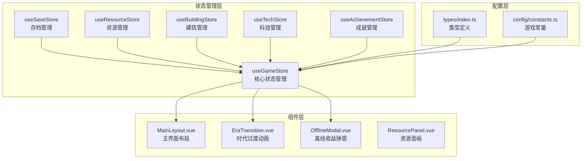
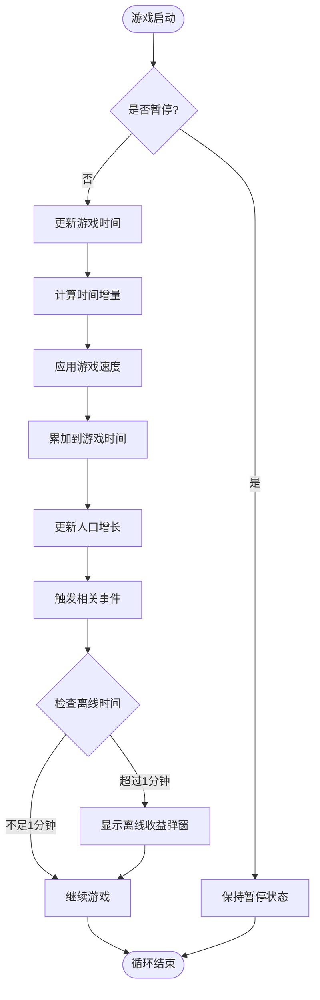
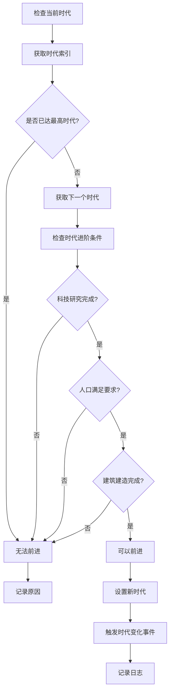
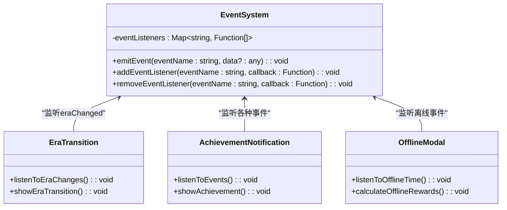
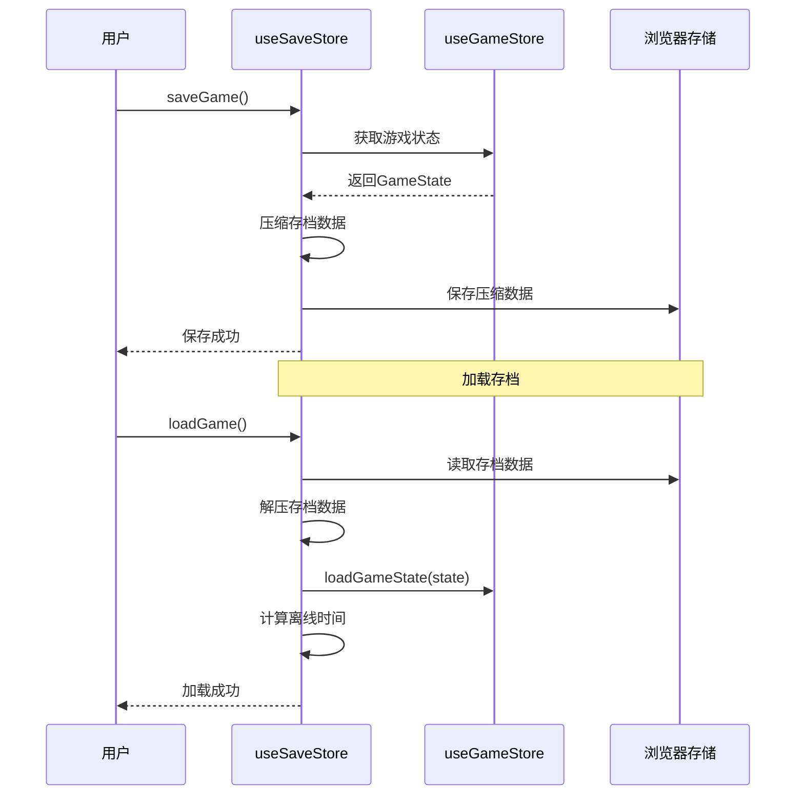

# 游戏核心状态管理

<cite>
**本文档引用的文件**
- [game.ts](file://civilization-game/src/stores/game.ts)
- [index.ts](file://civilization-game/src/types/index.ts)
- [constants.ts](file://civilization-game/src/config/constants.ts)
- [MainLayout.vue](file://civilization-game/src/components/game/MainLayout.vue)
- [save.ts](file://civilization-game/src/stores/save.ts)
- [EraTransition.vue](file://civilization-game/src/components/game/EraTransition.vue)
- [main.ts](file://civilization-game/src/main.ts)
</cite>

## 目录
1. [简介](#简介)
2. [项目结构](#项目结构)
3. [核心状态字段](#核心状态字段)
4. [游戏控制方法](#游戏控制方法)
5. [时代演进系统](#时代演进系统)
6. [事件系统](#事件系统)
7. [状态持久化](#状态持久化)
8. [组件使用示例](#组件使用示例)
9. [最佳实践](#最佳实践)
10. [总结](#总结)

## 简介

useGameStore是整个游戏的核心状态管理器，负责管理游戏的主要状态和行为。它采用Pinia状态管理库实现，提供了完整的游戏生命周期管理、时代演进、人口增长、时间管理和事件通信等功能。

该store包含了游戏的基本状态字段如currentEra（当前时代）、gameTime（游戏时间）、population（人口）等，以及相应的操作方法。同时实现了事件驱动的架构，支持跨模块通信和状态同步。

## 项目结构



**图表来源**
- [game.ts](file://civilization-game/src/stores/game.ts#L1-L268)
- [save.ts](file://civilization-game/src/stores/save.ts#L1-L280)
- [MainLayout.vue](file://civilization-game/src/components/game/MainLayout.vue#L1-L275)

## 核心状态字段

### 主要状态变量

useGameStore定义了以下核心状态字段：

```typescript
// 当前游戏时代
const currentEra = ref<Era>(Era.STONE)

// 游戏总时间（秒）
const gameTime = ref(0)

// 上次保存时间戳
const lastSaveTime = ref(Date.now())

// 上次游玩时间戳
const lastPlayTime = ref(Date.now())

// 游戏暂停状态
const isPaused = ref(false)

// 游戏速度倍数
const gameSpeed = ref(1.0)

// 人口状态
const population = ref({
  current: POPULATION.initialPopulation,
  max: POPULATION.initialMaxPopulation,
  growthRate: POPULATION.baseGrowthRate
})
```

### 人口系统

人口系统是一个复杂的子状态对象，包含三个关键属性：

- **current**: 当前人口数量
- **max**: 人口上限
- **growthRate**: 人口增长率（每秒）

初始配置来自constants.ts：
- 基础增长率：1人口/60秒
- 初始人口：10人
- 初始人口上限：20人
- 每人口每秒消耗食物：0.5单位

### 离线时间系统

```typescript
// 离线时间追踪
const offlineTime = ref<number>(0)
const showOfflineModal = ref<boolean>(false)
```

离线时间系统用于计算玩家离线期间的游戏进度，当离线时间超过1分钟时会显示收益弹窗。

**章节来源**
- [game.ts](file://civilization-game/src/stores/game.ts#L7-L25)
- [constants.ts](file://civilization-game/src/config/constants.ts#L25-L35)

## 游戏控制方法

### 基础游戏控制



**图表来源**
- [game.ts](file://civilization-game/src/stores/game.ts#L50-L55)

#### startGame() 和 pauseGame()

这两个方法控制游戏的运行状态：

```typescript
function startGame() {
  isPaused.value = false
  lastPlayTime.value = Date.now()
}

function pauseGame() {
  isPaused.value = true
}
```

#### updateTime(deltaTime: number)

核心的时间更新方法，根据游戏速度调整实际游戏时间的增长：

```typescript
function updateTime(deltaTime: number) {
  if (!isPaused.value) {
    gameTime.value += deltaTime * gameSpeed.value
  }
}
```

#### updatePopulationGrowth(deltaTime: number)

人口增长的核心算法，只有在当前人口低于上限时才会增长：

```typescript
function updatePopulationGrowth(deltaTime: number) {
  if (isPaused.value) return
  
  if (population.value.current < population.value.max) {
    const growth = population.value.growthRate * deltaTime
    population.value.current = Math.min(
      population.value.current + growth,
      population.value.max
    )
  }
}
```

### 游戏速度控制

```typescript
function setGameSpeed(speed: number) {
  gameSpeed.value = speed
}
```

支持四种预设速度：
- CASUAL: 0.5倍速（休闲模式）
- NORMAL: 1.0倍速（标准模式）
- FAST: 2.0倍速（快速模式）
- TURBO: 4.0倍速（极速模式）

**章节来源**
- [game.ts](file://civilization-game/src/stores/game.ts#L47-L85)

## 时代演进系统

### 时代枚举和顺序

游戏定义了八个时代阶段：

```typescript
export const Era = {
  STONE: 'stone',
  BRONZE: 'bronze',
  IRON: 'iron',
  INDUSTRIAL: 'industrial',
  INFORMATION: 'information',
  SPACE: 'space',
  INTERSTELLAR: 'interstellar',
  HYPERDIMENSIONAL: 'hyperdimensional'
} as const
```

### 时代演进逻辑



**图表来源**
- [game.ts](file://civilization-game/src/stores/game.ts#L95-L125)

#### canAdvanceEra() 方法

这个方法检查是否可以进入下一个时代：

```typescript
function canAdvanceEra(): { can: boolean; nextEra?: Era; reason?: string } {
  const eraOrder = [
    Era.STONE, Era.BRONZE, Era.IRON, Era.INDUSTRIAL,
    Era.INFORMATION, Era.SPACE, Era.INTERSTELLAR, Era.HYPERDIMENSIONAL
  ]
  
  const currentIndex = eraOrder.indexOf(currentEra.value)
  if (currentIndex === -1) {
    return { can: false, reason: '当前时代无效' }
  }
  
  if (currentIndex >= eraOrder.length - 1) {
    return { can: false, reason: '已达到最高时代' }
  }
  
  const nextEra = eraOrder[currentIndex + 1]
  return { can: true, nextEra }
}
```

#### advanceEra() 方法

执行时代前进操作：

```typescript
function advanceEra(): boolean {
  const check = canAdvanceEra()
  if (!check.can || !check.nextEra) {
    console.warn(`无法进入下一时代: ${check.reason}`)
    return false
  }
  
  setEra(check.nextEra)
  return true
}
```

#### setEra(era: Era) 方法

设置新的时代并触发相关事件：

```typescript
function setEra(era: Era) {
  const oldEra = currentEra.value
  currentEra.value = era
  
  // 触发时代变化事件
  emitEvent('eraChanged', { oldEra, newEra: era })
  
  console.log(`✨ 进入新时代: ${era}`)
}
```

**章节来源**
- [game.ts](file://civilization-game/src/stores/game.ts#L95-L130)
- [index.ts](file://civilization-game/src/types/index.ts#L1-L15)

## 事件系统

### 事件监听器架构

useGameStore实现了完整的事件驱动架构，支持跨模块通信：



**图表来源**
- [game.ts](file://civilization-game/src/stores/game.ts#L132-L155)
- [EraTransition.vue](file://civilization-game/src/components/game/EraTransition.vue#L50-L65)

### 事件系统实现

#### emitEvent(eventName: string, data?: any)

触发指定名称的事件，通知所有注册的监听器：

```typescript
function emitEvent(eventName: string, data?: any) {
  const listeners = eventListeners.get(eventName)
  if (listeners) {
    listeners.forEach(listener => listener(data))
  }
}
```

#### addEventListener(eventName: string, callback: (data: any) => void)

添加事件监听器：

```typescript
function addEventListener(eventName: string, callback: (data: any) => void) {
  if (!eventListeners.has(eventName)) {
    eventListeners.set(eventName, [])
  }
  eventListeners.get(eventName)!.push(callback)
}
```

#### removeEventListener(eventName: string, callback: (data: any) => void)

移除特定的事件监听器，防止内存泄漏：

```typescript
function removeEventListener(eventName: string, callback: (data: any) => void) {
  const listeners = eventListeners.get(eventName)
  if (listeners) {
    const index = listeners.indexOf(callback)
    if (index > -1) {
      listeners.splice(index, 1)
    }
  }
}
```

### 实际使用示例

在EraTransition组件中，我们看到事件系统的典型用法：

```typescript
// 监听时代变化事件
gameStore.addEventListener('eraChanged', (data: { oldEra: string; newEra: string }) => {
  const config = eraConfig[data.newEra as keyof typeof eraConfig]
  if (config) {
    currentEraName.value = config.name
    eraIcon.value = config.icon
    eraDescription.value = config.description
    show.value = true
    
    // 3秒后自动关闭
    setTimeout(() => {
      show.value = false
    }, 3000)
  }
})
```

**章节来源**
- [game.ts](file://civilization-game/src/stores/game.ts#L132-L155)
- [EraTransition.vue](file://civilization-game/src/components/game/EraTransition.vue#L50-L65)

## 状态持久化

### 存档系统架构



**图表来源**
- [save.ts](file://civilization-game/src/stores/save.ts#L70-L120)
- [game.ts](file://civilization-game/src/stores/game.ts#L157-L162)

### 压缩算法

save.ts实现了高效的存档压缩算法：

```typescript
function compressSaveData(data: SaveData): string {
  const compressed = {
    v: data.version,
    c: data.createdAt,
    l: data.lastSaved,
    g: {
      e: data.gameState.currentEra,
      t: data.gameState.gameTime,
      p: {
        c: Math.floor(data.gameState.population.current),
        m: data.gameState.population.max,
        g: data.gameState.population.growthRate
      },
      lp: data.gameState.lastPlayTime
    },
    r: Object.fromEntries(
      Object.entries(data.resources)
        .filter(([_, amount]) => amount > 0.01)
        .map(([id, amount]) => [id, Math.floor(amount * 10) / 10])
    ),
    // ... 更多压缩逻辑
  }
  
  return JSON.stringify(compressed)
}
```

### 离线收益计算

当玩家长时间离线后，系统会计算这段时间内的游戏收益：

```typescript
// 计算离线时间
const now = Date.now()
const offlineTime = (now - saveData.gameState.lastPlayTime) / 1000 // 转换为秒

if (offlineTime > 60) { // 离线超过1分钟才计算收益
  console.log(`离线时间: ${(offlineTime / 60).toFixed(1)}分钟`)
  gameStore.setOfflineTime(offlineTime)
}
```

离线收益效率分级：
- 前2小时：100%效率
- 2-8小时：75%效率
- 8-24小时：50%效率
- 超过24小时：25%效率

**章节来源**
- [save.ts](file://civilization-game/src/stores/save.ts#L25-L70)
- [game.ts](file://civilization-game/src/stores/game.ts#L157-L162)

## 组件使用示例

### 在MainLayout.vue中使用

MainLayout是游戏的主要界面组件，展示了如何使用gameStore：

```typescript
<script setup lang="ts">
import { ref, computed } from 'vue'
import { useGameStore } from '@/stores/game'

const gameStore = useGameStore()

// 计算属性：格式化游戏时间
const formattedGameTime = computed(() => {
  const hours = Math.floor(gameStore.gameTime / 3600)
  const minutes = Math.floor((gameStore.gameTime % 3600) / 60)
  const seconds = Math.floor(gameStore.gameTime % 60)
  return `${hours}:${minutes.toString().padStart(2, '0')}:${seconds.toString().padStart(2, '0')}`
})

// 计算属性：时代名称
const eraName = computed(() => {
  const eraNames: Record<Era, string> = {
    [Era.STONE]: '石器时代',
    [Era.BRONZE]: '青铜时代',
    [Era.IRON]: '铁器时代',
    [Era.INDUSTRIAL]: '工业时代',
    [Era.INFORMATION]: '信息时代',
    [Era.SPACE]: '太空时代',
    [Era.INTERSTELLAR]: '星际时代',
    [Era.HYPERDIMENSIONAL]: '超维时代'
  }
  return eraNames[gameStore.currentEra]
})
</script>
```

### 在EraTransition.vue中使用事件系统

```typescript
// 监听时代变化事件
gameStore.addEventListener('eraChanged', (data: { oldEra: string; newEra: string }) => {
  const config = eraConfig[data.newEra as keyof typeof eraConfig]
  if (config) {
    currentEraName.value = config.name
    eraIcon.value = config.icon
    eraDescription.value = config.description
    show.value = true
    
    // 3秒后自动关闭
    setTimeout(() => {
      show.value = false
    }, 3000)
  }
})
```

### 在组件中访问状态

```typescript
// 直接访问响应式状态
const currentPopulation = gameStore.population.current
const maxPopulation = gameStore.population.max
const currentEra = gameStore.currentEra

// 访问计算属性
const formattedTime = gameStore.formattedGameTime
const gameState = gameStore.getGameState
```

**章节来源**
- [MainLayout.vue](file://civilization-game/src/components/game/MainLayout.vue#L150-L180)
- [EraTransition.vue](file://civilization-game/src/components/game/EraTransition.vue#L50-L65)

## 最佳实践

### 1. 避免事件监听器泄漏

在Vue组件中使用事件监听器时，必须在组件卸载时清理监听器：

```typescript
import { onUnmounted } from 'vue'
import { useGameStore } from '@/stores/game'

const gameStore = useGameStore()

// 添加监听器
gameStore.addEventListener('eraChanged', handleEraChange)

// 清理监听器
onUnmounted(() => {
  gameStore.removeEventListener('eraChanged', handleEraChange)
})
```

### 2. 合理使用计算属性

利用Pinia的计算属性特性来优化性能：

```typescript
// 在store中定义计算属性
const formattedGameTime = computed(() => {
  const hours = Math.floor(gameTime.value / 3600)
  const minutes = Math.floor((gameTime.value % 3600) / 60)
  const seconds = Math.floor(gameTime.value % 60)
  return `${hours}:${minutes.toString().padStart(2, '0')}:${seconds.toString().padStart(2, '0')}`
})
```

### 3. 状态重置策略

实现完整的状态重置功能：

```typescript
function resetGame() {
  currentEra.value = Era.STONE
  gameTime.value = 0
  lastSaveTime.value = Date.now()
  lastPlayTime.value = Date.now()
  isPaused.value = false
  gameSpeed.value = 1.0
  population.value = {
    current: POPULATION.initialPopulation,
    max: POPULATION.initialMaxPopulation,
    growthRate: POPULATION.baseGrowthRate
  }
}
```

### 4. 错误处理和日志记录

在关键操作中添加错误处理和日志记录：

```typescript
function advanceEra(): boolean {
  const check = canAdvanceEra()
  if (!check.can || !check.nextEra) {
    console.warn(`无法进入下一时代: ${check.reason}`)
    return false
  }
  
  try {
    setEra(check.nextEra)
    return true
  } catch (error) {
    console.error('时代前进失败:', error)
    return false
  }
}
```

### 5. 性能优化建议

- 使用ref而非reactive来减少不必要的响应式开销
- 合理使用computed来缓存复杂计算结果
- 对于频繁更新的状态，考虑使用防抖或节流
- 在大型组件中，按需加载和懒初始化

## 总结

useGameStore作为游戏的核心状态管理器，提供了完整的游戏生命周期管理功能。它不仅管理着游戏的基本状态，还实现了事件驱动的架构，支持跨模块通信和状态同步。

### 主要特性

1. **完整的状态管理**：包括时代演进、时间管理、人口系统等核心功能
2. **事件驱动架构**：支持跨模块通信和松耦合设计
3. **高效的状态持久化**：实现了压缩算法和离线收益计算
4. **响应式设计**：基于Vue 3的响应式系统，提供良好的用户体验
5. **可扩展性**：模块化的设计便于添加新功能

### 设计优势

- **单一职责原则**：每个store专注于特定的功能领域
- **事件解耦**：通过事件系统实现模块间的松耦合
- **状态集中管理**：所有游戏状态都集中在store中统一管理
- **类型安全**：完整的TypeScript类型定义确保代码质量

### 扩展方向

未来可以考虑以下扩展：
- 添加更多游戏状态字段如科技树进度、建筑队列等
- 实现更复杂的时代进阶条件检查
- 增强事件系统的类型安全性
- 添加状态快照和回滚功能
- 实现多人协作模式下的状态同步

通过useGameStore的设计和实现，我们可以看到一个现代前端应用中状态管理的最佳实践，它不仅解决了游戏开发中的复杂问题，也为其他类型的应用提供了宝贵的参考价值。