# 状态管理

<cite>
**本文档引用的文件**
- [game.ts](file://civilization-game/src/stores/game.ts)
- [resource.ts](file://civilization-game/src/stores/resource.ts)
- [building.ts](file://civilization-game/src/stores/building.ts)
- [tech.ts](file://civilization-game/src/stores/tech.ts)
- [save.ts](file://civilization-game/src/stores/save.ts)
- [achievement.ts](file://civilization-game/src/stores/achievement.ts)
- [index.ts](file://civilization-game/src/types/index.ts)
- [resources.ts](file://civilization-game/src/config/resources.ts)
- [buildings.ts](file://civilization-game/src/config/buildings.ts)
- [constants.ts](file://civilization-game/src/config/constants.ts)
</cite>

## 目录
1. [简介](#简介)
2. [项目结构概览](#项目结构概览)
3. [核心状态管理架构](#核心状态管理架构)
4. [useGameStore - 游戏核心状态](#usegamestore---游戏核心状态)
5. [资源系统 - useResourceStore](#资源系统---useresourcestore)
6. [建筑系统 - useBuildingStore](#建筑系统---usebuildingstore)
7. [科技系统 - useTechStore](#科技系统---usetechstore)
8. [成就系统 - useAchievementStore](#成就系统---useachievementstore)
9. [存档系统 - useSaveStore](#存档系统---usesavestore)
10. [store间依赖关系](#store间依赖关系)
11. [事件通信机制](#事件通信机制)
12. [状态持久化策略](#状态持久化策略)
13. [性能优化建议](#性能优化建议)
14. [常见问题与解决方案](#常见问题与解决方案)
15. [总结](#总结)

## 简介

本项目采用Pinia作为状态管理库，构建了一个复杂而完整的文明建设类游戏。状态管理系统通过多个专门的store模块协同工作，实现了游戏核心状态、资源管理、建筑系统、科技树、成就系统等功能的统一管理。

每个store都负责特定的游戏功能领域，通过清晰的职责分离和事件通信机制，确保了系统的可维护性和扩展性。这种设计模式不仅提高了代码的组织性，还使得状态更新和组件间的通信更加直观和高效。

## 项目结构概览

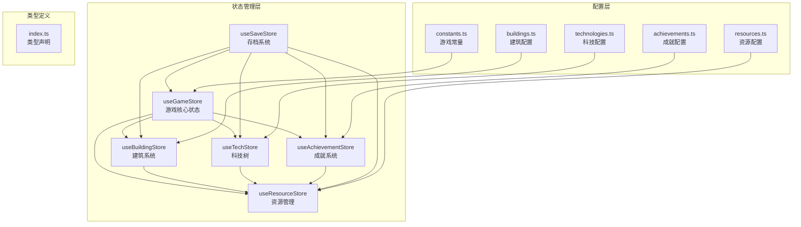

**图表来源**
- [game.ts](file://civilization-game/src/stores/game.ts#L1-L268)
- [resource.ts](file://civilization-game/src/stores/resource.ts#L1-L202)
- [building.ts](file://civilization-game/src/stores/building.ts#L1-L320)
- [tech.ts](file://civilization-game/src/stores/tech.ts#L1-L417)
- [achievement.ts](file://civilization-game/src/stores/achievement.ts#L1-L278)
- [save.ts](file://civilization-game/src/stores/save.ts#L1-L280)

## 核心状态管理架构

Pinia提供了Vue 3应用程序的状态管理解决方案，相比Vuex具有更好的TypeScript支持和更简洁的API。在本项目中，我们利用了Pinia的以下特性：

### 主要优势
- **TypeScript友好**: 完整的类型推断和编译时检查
- **模块化设计**: 每个store独立管理特定功能域
- **组合式API**: 更灵活的状态管理和副作用处理
- **热重载支持**: 开发时无需刷新即可看到状态变更
- **插件系统**: 支持中间件和调试工具集成

### 状态管理模式
```typescript
// store的基本结构
export const useStore = defineStore('storeName', () => {
  // 状态
  const state = ref(initialValue)
  
  // 计算属性
  const computedState = computed(() => /* 计算逻辑 */)
  
  // 方法
  function updateState(newValue) {
    state.value = newValue
  }
  
  return {
    state,
    computedState,
    updateState
  }
})
```

## useGameStore - 游戏核心状态

useGameStore是整个游戏的核心状态管理器，负责管理游戏的基本运行状态和全局控制逻辑。

### 核心状态管理

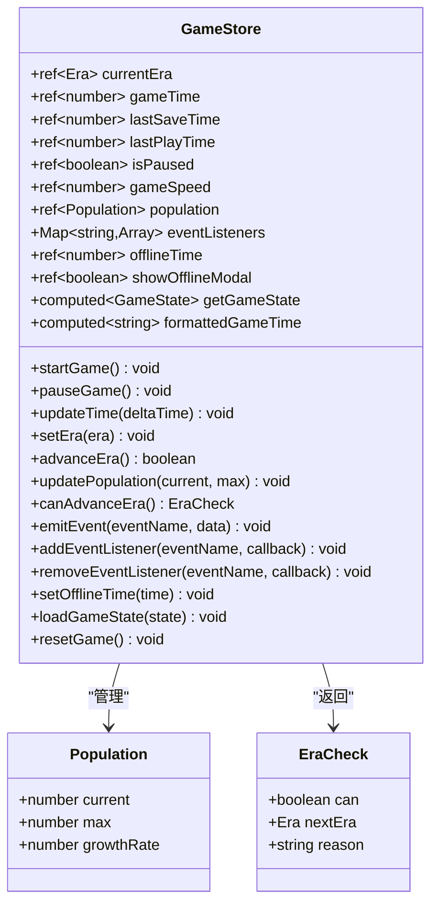

**图表来源**
- [game.ts](file://civilization-game/src/stores/game.ts#L7-L268)

### 关键功能实现

#### 时代管理系统
```typescript
function setEra(era: Era) {
  const oldEra = currentEra.value
  currentEra.value = era
  
  // 触发时代变化事件
  emitEvent('eraChanged', { oldEra, newEra: era })
  
  console.log(`✨ 进入新时代: ${era}`)
}

function canAdvanceEra(): { can: boolean; nextEra?: Era; reason?: string } {
  const eraOrder = [
    Era.STONE, Era.BRONZE, Era.IRON, Era.INDUSTRIAL,
    Era.INFORMATION, Era.SPACE, Era.INTERSTELLAR, Era.HYPERDIMENSIONAL
  ]
  
  const currentIndex = eraOrder.indexOf(currentEra.value)
  if (currentIndex >= eraOrder.length - 1) {
    return { can: false, reason: '已达到最高时代' }
  }
  
  const nextEra = eraOrder[currentIndex + 1]
  return { can: true, nextEra }
}
```

#### 人口增长系统
```typescript
function updatePopulationGrowth(deltaTime: number) {
  if (isPaused.value) return
  
  // 只有当前人口小于上限时才增长
  if (population.value.current < population.value.max) {
    const growth = population.value.growthRate * deltaTime
    population.value.current = Math.min(
      population.value.current + growth,
      population.value.max
    )
  }
}
```

**章节来源**
- [game.ts](file://civilization-game/src/stores/game.ts#L7-L268)

## 资源系统 - useResourceStore

useResourceStore专门管理游戏中所有的资源类型，包括基础资源、中级资源、高级资源等，支持实时的资源产出、消耗和存储管理。

### 资源系统架构

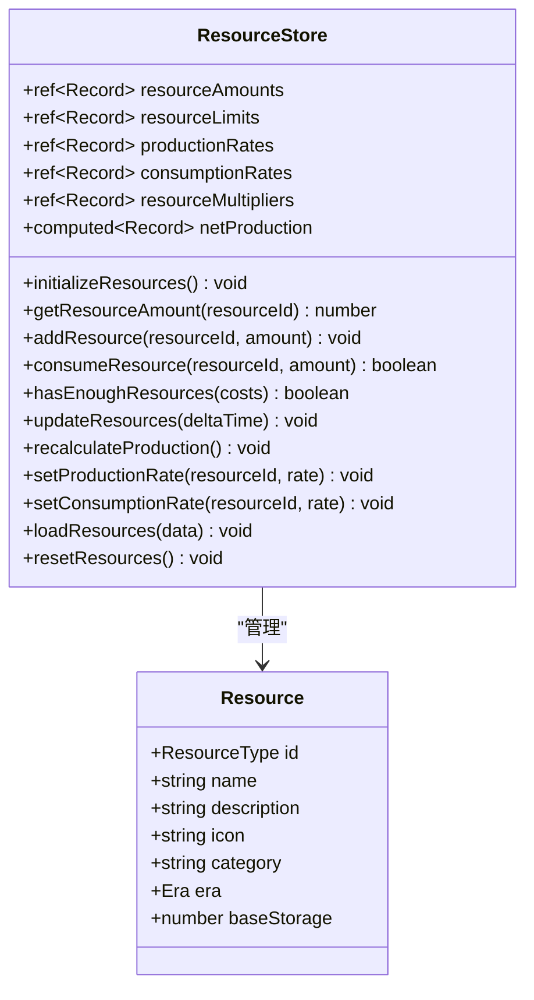

**图表来源**
- [resource.ts](file://civilization-game/src/stores/resource.ts#L7-L202)

### 资源更新机制

资源系统采用每秒更新的方式处理资源的产出和消耗：

```typescript
function updateResources(deltaTime: number = 1) {
  Object.keys(resourceAmounts.value).forEach((resourceId) => {
    const id = resourceId as ResourceType
    const production = productionRates.value[id] || 0
    const consumption = consumptionRates.value[id] || 0
    const netProduction = (production - consumption) * deltaTime
    
    if (netProduction > 0) {
      addResource(id, netProduction)
    } else if (netProduction < 0) {
      const currentAmount = getResourceAmount(id)
      const consumeAmount = Math.abs(netProduction)
      if (currentAmount >= consumeAmount) {
        consumeResource(id, consumeAmount)
      } else {
        resourceAmounts.value[id] = 0
      }
    }
  })
}
```

### 资源类型分类

系统支持多种资源类别，每种资源都有其特定的用途和管理规则：

- **基础资源**: food, wood, stone - 维持基本生存
- **中级资源**: copper, iron, coal - 制造工具和武器
- **高级资源**: steel, oil, electricity - 工业生产和科技发展
- **太空资源**: rocketFuel, alloy, helium3 - 太空探索
- **星际资源**: antimatter, darkMatter - 星际旅行
- **超维资源**: quantumEnergy, spacetimeCrystal - 超维度技术
- **特殊资源**: gold, knowledge, culture, prestige - 通用货币和特殊用途

**章节来源**
- [resource.ts](file://civilization-game/src/stores/resource.ts#L7-L202)
- [resources.ts](file://civilization-game/src/config/resources.ts#L1-L247)

## 建筑系统 - useBuildingStore

useBuildingStore管理所有建筑物的建造、升级和效果应用，是连接资源系统和游戏进程的重要桥梁。

### 建筑系统流程

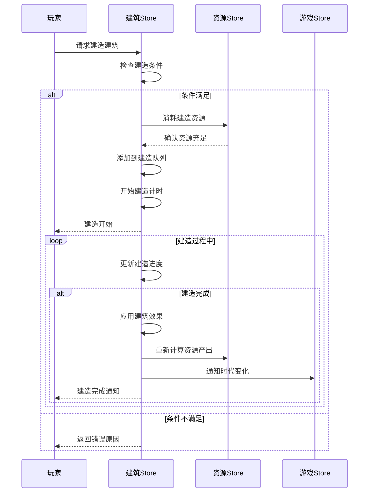

**图表来源**
- [building.ts](file://civilization-game/src/stores/building.ts#L7-L320)

### 建筑状态管理

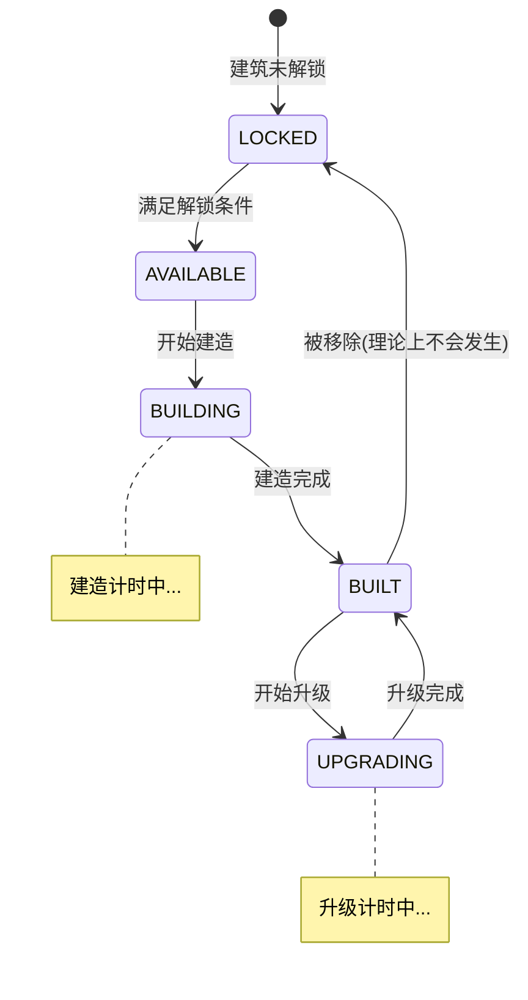

### 建筑效果系统

建筑系统通过事件机制与其他store通信，实现复杂的相互作用：

```typescript
function applyBuildingEffects(buildingId: string) {
  const config = getBuildingConfig(buildingId)
  const instance = getBuildingInstance(buildingId)
  if (!config || !instance) return

  // 增加人口上限
  if (config.population) {
    gameStore.increasePopulationMax(config.population)
  }

  // 增加存储容量
  if (config.capacity) {
    Object.entries(config.capacity).forEach(([resource, amount]) => {
      resourceStore.increaseResourceLimit(resource as any, amount)
    })
  }

  // 重新计算资源产出
  recalculateAllEffects()
}
```

### 建筑升级机制

```typescript
function calculateUpgradeCost(buildingId: string): ResourceAmount {
  const config = getBuildingConfig(buildingId)
  const instance = getBuildingInstance(buildingId)
  if (!config || !instance) return {}

  const multiplier = Math.pow(config.upgradeCostMultiplier, instance.level)
  const cost: ResourceAmount = {}
  
  Object.entries(config.buildCost).forEach(([resource, amount]) => {
    cost[resource as keyof ResourceAmount] = Math.ceil(amount * multiplier)
  })
  
  return cost
}
```

**章节来源**
- [building.ts](file://civilization-game/src/stores/building.ts#L7-L320)

## 科技系统 - useTechStore

useTechStore管理科技树的研究进度、解锁条件和效果应用，是推动游戏进程和技术发展的核心系统。

### 科技系统架构

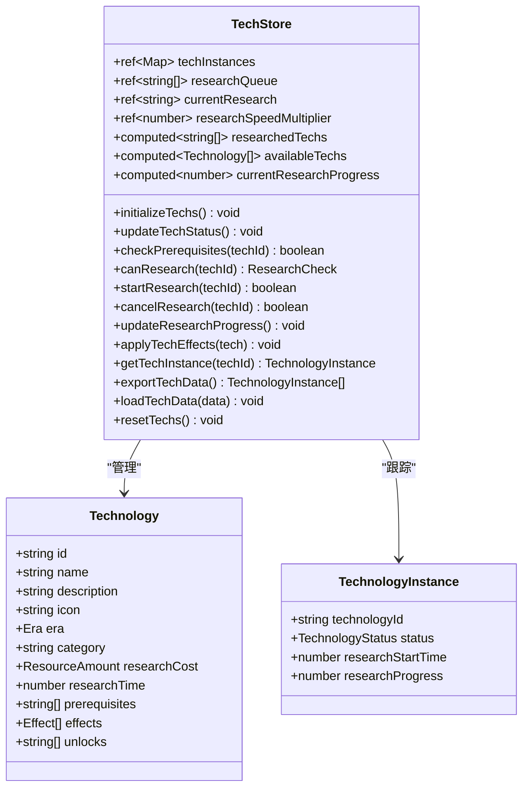

**图表来源**
- [tech.ts](file://civilization-game/src/stores/tech.ts#L7-L417)

### 科研进度系统

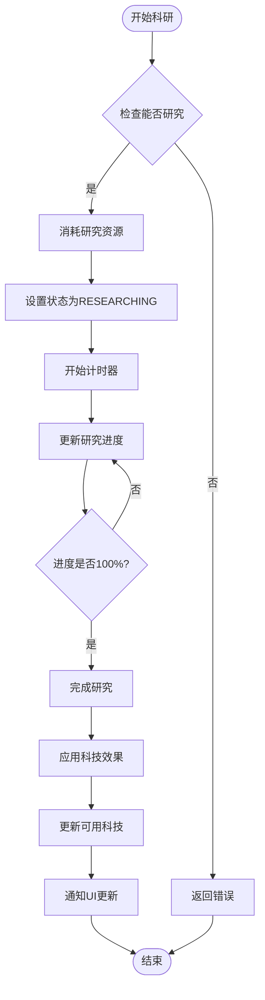

### 科技效果应用

科技系统通过事件机制向其他store传递效果：

```typescript
function applyTechEffects(tech: Technology) {
  const resourceStore = useResourceStore()
  const gameStore = useGameStore()

  tech.effects.forEach(effect => {
    switch (effect.type) {
      case 'resourceMultiplier':
        if (effect.target) {
          const currentMultiplier = resourceStore.resourceMultipliers[effect.target] || 1.0
          resourceStore.resourceMultipliers[effect.target] = currentMultiplier * effect.value
        }
        break

      case 'researchSpeedBonus':
        researchSpeedMultiplier.value *= effect.value
        break

      case 'buildSpeedBonus':
        gameStore.emitEvent('techEffectApplied', {
          type: 'buildSpeedBonus',
          value: effect.value
        })
        break

      case 'populationGrowth':
        gameStore.emitEvent('techEffectApplied', {
          type: 'populationGrowth',
          value: effect.value
        })
        break
    }
  })
}
```

**章节来源**
- [tech.ts](file://civilization-game/src/stores/tech.ts#L7-L417)

## 成就系统 - useAchievementStore

useAchievementStore管理成就的解锁条件、进度跟踪和奖励发放，为玩家提供持续的游戏目标和成就感。

### 成就系统设计

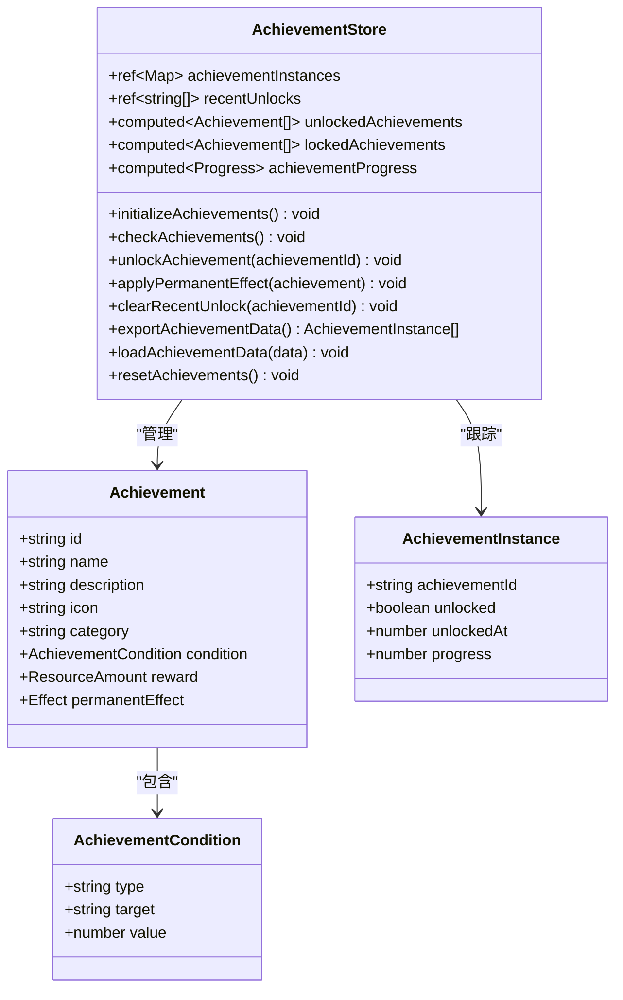

**图表来源**
- [achievement.ts](file://civilization-game/src/stores/achievement.ts#L7-L278)

### 成就检测机制

成就系统定期检查所有成就条件，自动解锁符合条件的成就：

```typescript
function checkAchievements() {
  const gameStore = useGameStore()
  const resourceStore = useResourceStore()
  const buildingStore = useBuildingStore()
  const techStore = useTechStore()
  
  achievements.forEach(achievement => {
    const instance = achievementInstances.value.get(achievement.id)
    if (!instance || instance.unlocked) return
    
    let progress = 0
    let condition = achievement.condition
    
    switch (condition.type) {
      case 'era':
        const eraOrder = ['stone', 'bronze', 'iron', 'industrial', 'information', 'space', 'interstellar', 'hyperdimensional']
        const currentEraIndex = eraOrder.indexOf(gameStore.currentEra)
        progress = currentEraIndex >= condition.value ? 100 : (currentEraIndex / condition.value) * 100
        break
        
      case 'resource':
        if (condition.target) {
          const current = resourceStore.getResourceAmount(condition.target as ResourceType)
          progress = Math.min((current / condition.value) * 100, 100)
        }
        break
        
      case 'building':
        const buildings = buildingStore.buildingInstances
        let count = 0
        if (condition.target === 'max_level') {
          count = buildings.filter(b => {
            const config = buildingStore.getBuildingConfig(b.buildingId)
            return config && b.level >= config.maxLevel
          }).length
        } else if (condition.target) {
          count = buildings.filter(b => {
            const config = buildingStore.getBuildingConfig(b.buildingId)
            return config && config.type === condition.target
          }).length
        } else {
          count = buildings.length
        }
        progress = Math.min((count / condition.value) * 100, 100)
        break
    }
    
    instance.progress = progress
    
    if (progress >= 100) {
      unlockAchievement(achievement.id)
    }
  })
}
```

### 成就奖励系统

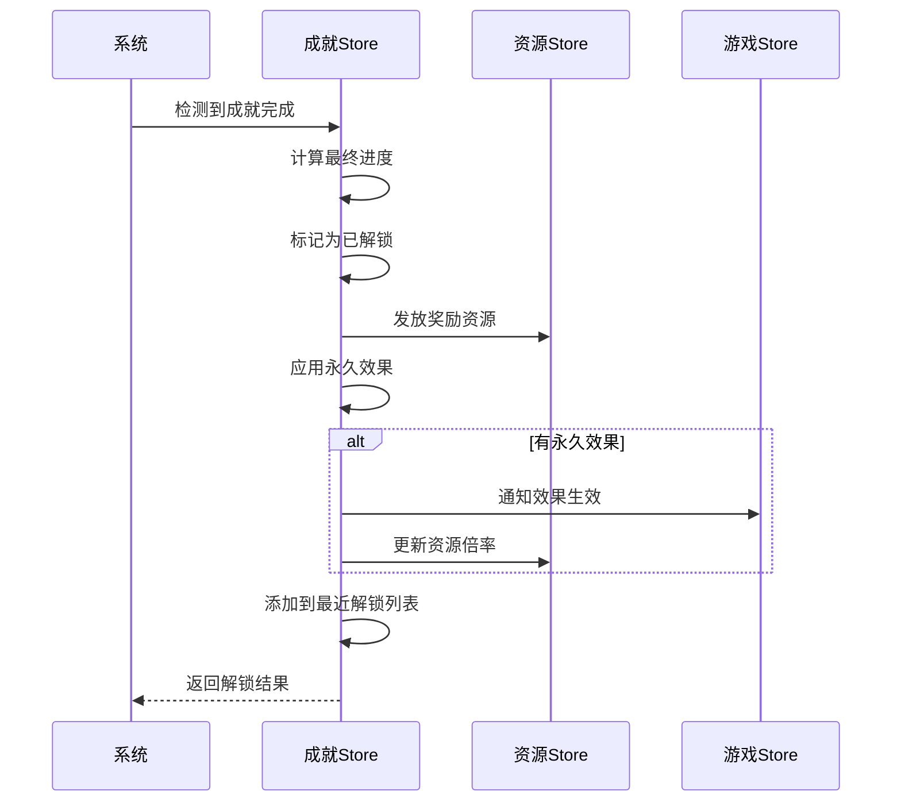

**图表来源**
- [achievement.ts](file://civilization-game/src/stores/achievement.ts#L7-L278)

**章节来源**
- [achievement.ts](file://civilization-game/src/stores/achievement.ts#L7-L278)

## 存档系统 - useSaveStore

useSaveStore负责游戏数据的序列化、压缩、存储和恢复，确保玩家进度的安全保存和跨会话延续。

### 存档系统架构

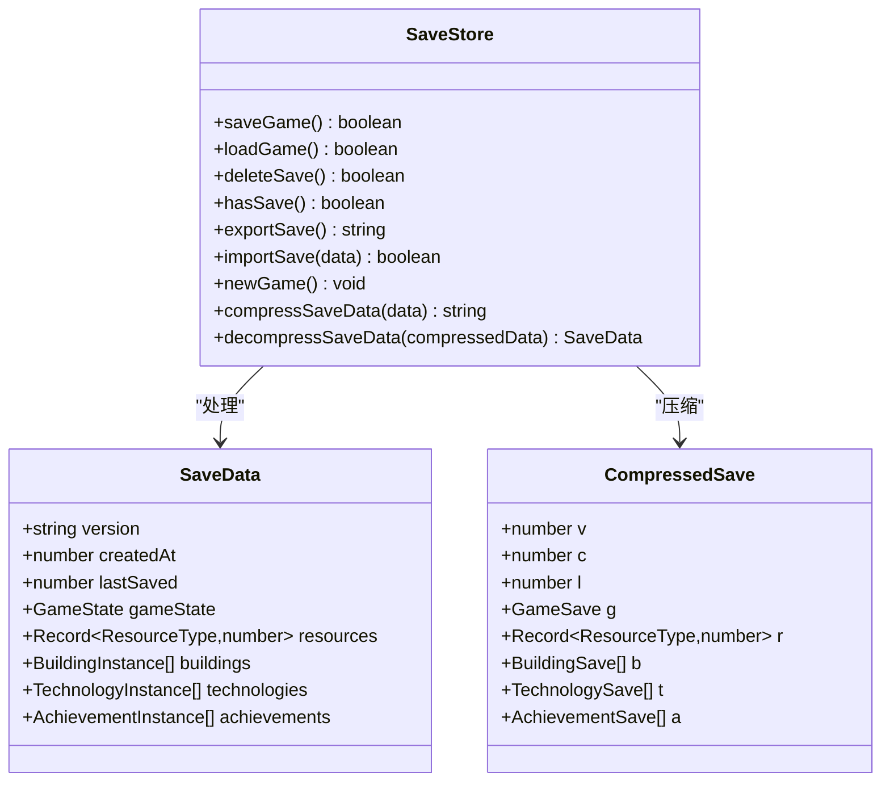

**图表来源**
- [save.ts](file://civilization-game/src/stores/save.ts#L7-L280)

### 数据压缩策略

存档系统采用了智能压缩算法来减少存储空间：

```typescript
function compressSaveData(data: SaveData): string {
  const compressed = {
    v: data.version,
    c: data.createdAt,
    l: data.lastSaved,
    g: {
      e: data.gameState.currentEra,
      t: data.gameState.gameTime,
      p: {
        c: Math.floor(data.gameState.population.current),
        m: data.gameState.population.max,
        g: data.gameState.population.growthRate
      },
      lp: data.gameState.lastPlayTime
    },
    r: Object.fromEntries(
      Object.entries(data.resources)
        .filter(([_, amount]) => amount > 0.01) // 过滤掉极小值
        .map(([id, amount]) => [id, Math.floor(amount * 10) / 10]) // 保留1位小数
    ),
    b: data.buildings.map(b => ({
      i: b.buildingId,
      l: b.level,
      s: b.status
    })),
    t: data.technologies.map(t => ({
      i: t.technologyId,
      s: t.status,
      p: t.researchProgress ? Math.floor(t.researchProgress * 100) / 100 : undefined
    })),
    a: data.achievements
      .filter(a => a.unlocked || (a.progress && a.progress > 0))
      .map(a => ({
        i: a.achievementId,
        u: a.unlocked,
        p: a.progress ? Math.floor(a.progress * 100) / 100 : undefined
      }))
  }
  
  return JSON.stringify(compressed)
}
```

### 离线收益计算

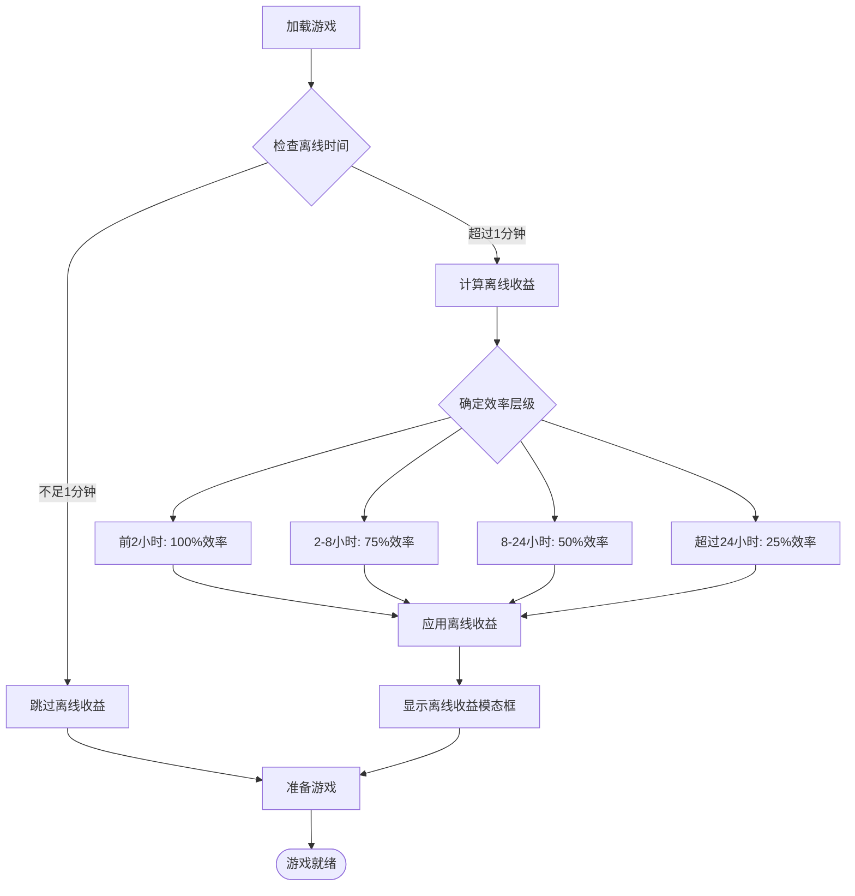

**章节来源**
- [save.ts](file://civilization-game/src/stores/save.ts#L7-L280)

## store间依赖关系

各个store之间存在明确的依赖关系和协作模式，形成了一个有机的整体。

### 依赖关系图

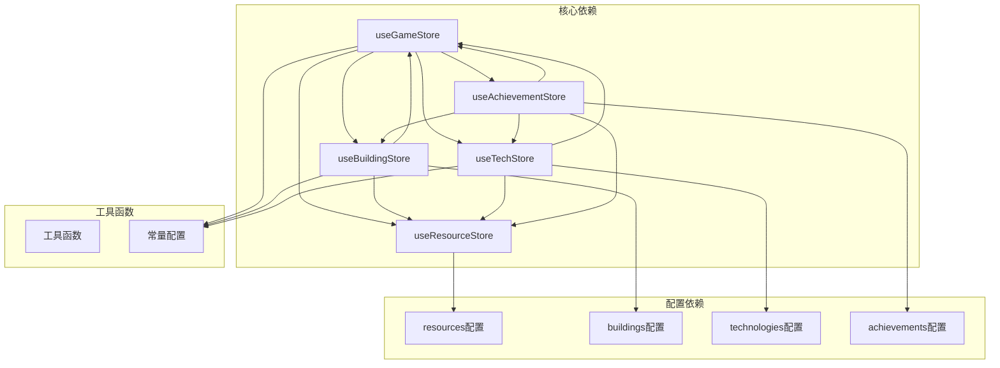

### 依赖注入模式

```typescript
// 在store中使用其他store
export const useBuildingStore = defineStore('building', () => {
  const resourceStore = useResourceStore()
  const gameStore = useGameStore()
  
  // 使用其他store的方法
  function buildBuilding(buildingId: string): boolean {
    const check = canBuild(buildingId)
    if (!check.can) return false
    
    const config = getBuildingConfig(buildingId)!
    const cost = calculateUpgradeCost(buildingId)
    
    // 使用资源store进行资源操作
    if (!resourceStore.consumeResources(cost)) {
      return false
    }
    
    // 使用游戏store进行状态更新
    applyBuildingEffects(buildingId)
    
    return true
  }
})
```

**章节来源**
- [building.ts](file://civilization-game/src/stores/building.ts#L7-L320)
- [tech.ts](file://civilization-game/src/stores/tech.ts#L7-L417)
- [achievement.ts](file://civilization-game/src/stores/achievement.ts#L7-L278)

## 事件通信机制

系统采用事件驱动的通信模式，通过自定义的事件系统实现store间的松耦合通信。

### 事件系统架构

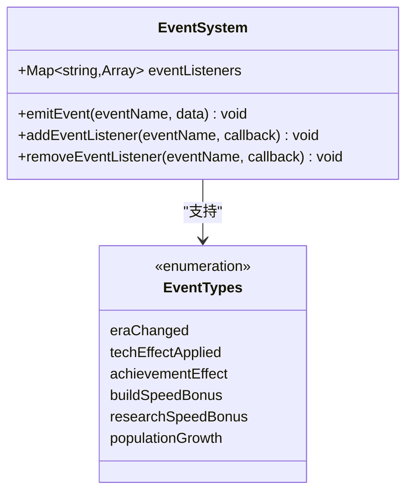

### 事件通信流程

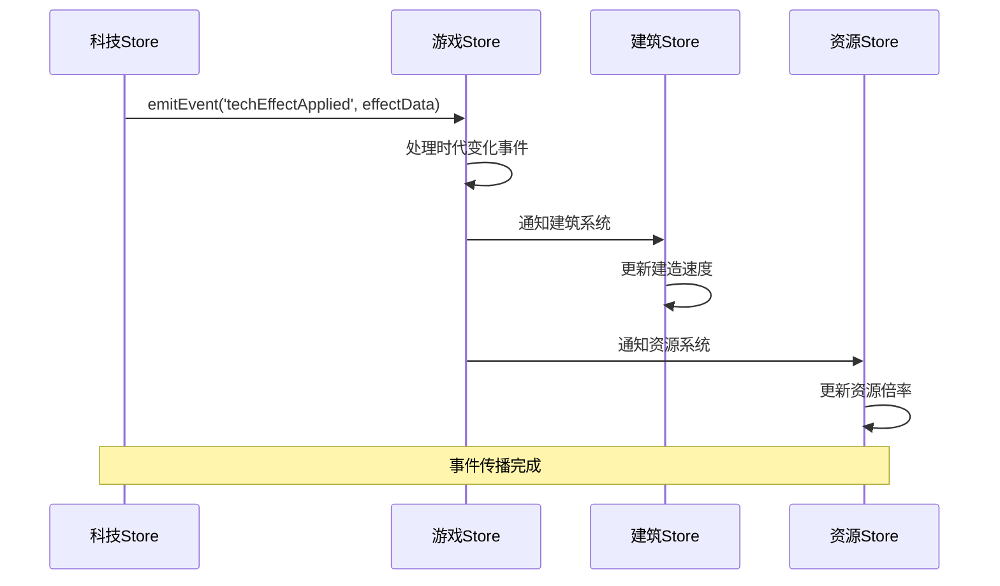

### 事件监听器管理

```typescript
// 事件系统的核心实现
function emitEvent(eventName: string, data?: any) {
  const listeners = eventListeners.get(eventName)
  if (listeners) {
    listeners.forEach(listener => listener(data))
  }
}

function addEventListener(eventName: string, callback: (data: any) => void) {
  if (!eventListeners.has(eventName)) {
    eventListeners.set(eventName, [])
  }
  eventListeners.get(eventName)!.push(callback)
}

function removeEventListener(eventName: string, callback: (data: any) => void) {
  const listeners = eventListeners.get(eventName)
  if (listeners) {
    const index = listeners.indexOf(callback)
    if (index > -1) {
      listeners.splice(index, 1)
    }
  }
}
```

### 实际应用示例

```typescript
// 在建筑系统中监听科技效果
function applyBuildingEffects(buildingId: string) {
  const config = getBuildingConfig(buildingId)
  if (!config) return
  
  // 监听科技效果事件
  const unsubscribe = gameStore.addEventListener('techEffectApplied', (effect) => {
    if (effect.type === 'buildSpeedBonus') {
      // 应用建造速度加成
      applyBuildSpeedBonus(effect.value)
    }
  })
  
  // 应用建筑效果
  // ...
  
  // 记得清理监听器
  return unsubscribe
}
```

**章节来源**
- [game.ts](file://civilization-game/src/stores/game.ts#L240-L268)
- [tech.ts](file://civilization-game/src/stores/tech.ts#L280-L320)

## 状态持久化策略

系统实现了多层次的状态持久化策略，确保游戏进度的安全保存和快速恢复。

### 持久化层次

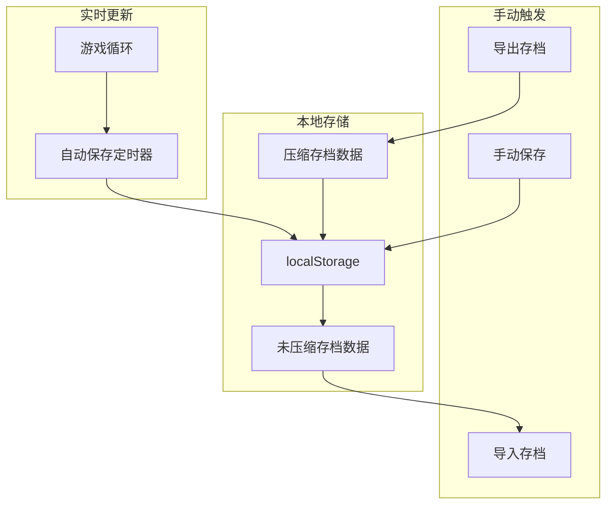

### 自动保存机制

```typescript
// 自动保存配置
export const GAME_TICK_INTERVAL = 1000 // 游戏循环间隔
export const AUTO_SAVE_INTERVAL = 30000 // 自动保存间隔

// 自动保存实现
function autoSave() {
  setInterval(() => {
    const saveSuccess = saveStore.saveGame()
    if (saveSuccess) {
      console.log('游戏已自动保存')
    }
  }, AUTO_SAVE_INTERVAL)
}
```

### 离线收益系统

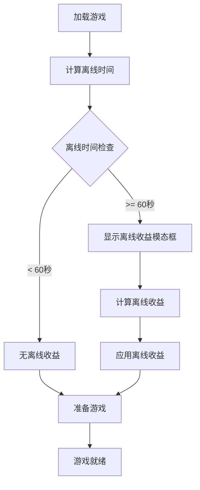

### 存档版本兼容性

```typescript
function loadGame(): boolean {
  try {
    const data = localStorage.getItem(STORAGE_KEYS.saveData)
    if (!data) return false
    
    const saveData = decompressSaveData(data)
    
    // 版本检查
    if (saveData.version !== GAME_VERSION) {
      console.warn('存档版本不匹配,可能需要迁移')
      // 处理版本迁移逻辑
    }
    
    // 计算离线时间
    const now = Date.now()
    const offlineTime = (now - saveData.gameState.lastPlayTime) / 1000
    
    if (offlineTime > 60) {
      gameStore.setOfflineTime(offlineTime)
    }
    
    // 加载各store数据
    gameStore.loadGameState(saveData.gameState)
    resourceStore.loadResources(saveData.resources)
    buildingStore.loadBuildings(saveData.buildings)
    techStore.loadTechData(saveData.technologies)
    achievementStore.loadAchievementData(saveData.achievements)
    
    return true
  } catch (error) {
    console.error('加载失败:', error)
    return false
  }
}
```

**章节来源**
- [save.ts](file://civilization-game/src/stores/save.ts#L7-L280)
- [constants.ts](file://civilization-game/src/config/constants.ts#L1-L61)

## 性能优化建议

为了确保游戏的流畅运行和良好的用户体验，以下是一些关键的性能优化建议。

### 计算属性的合理使用

```typescript
// ✅ 推荐：使用计算属性缓存复杂计算
const netProduction = computed(() => {
  const result: Record<ResourceType, number> = {} as Record<ResourceType, number>
  Object.keys(resourceAmounts.value).forEach((resourceId) => {
    const id = resourceId as ResourceType
    const production = productionRates.value[id] || 0
    const consumption = consumptionRates.value[id] || 0
    result[id] = production - consumption
  })
  return result
})

// ❌ 避免：在模板中直接进行复杂计算
// {{ Object.keys(resourceAmounts).reduce((acc, id) => {
//     acc[id] = productionRates[id] - consumptionRates[id]
//     return acc
//   }, {}) }}
```

### 避免不必要的订阅

```typescript
// ✅ 推荐：使用条件订阅
function useBuildingEffects() {
  const gameStore = useGameStore()
  
  // 只在需要时订阅事件
  if (shouldSubscribe()) {
    const unsubscribe = gameStore.addEventListener('eraChanged', handleEraChange)
    onUnmounted(unsubscribe)
  }
}

// ❌ 避免：总是订阅而不清理
function alwaysSubscribe() {
  const gameStore = useGameStore()
  // 没有清理函数，可能导致内存泄漏
  gameStore.addEventListener('eraChanged', handleEraChange)
}
```

### 批量状态更新

```typescript
// ✅ 推荐：批量更新以减少重渲染
function batchUpdateStates(updates: Partial<GameState>) {
  // 使用Vue的批量更新机制
  nextTick(() => {
    Object.entries(updates).forEach(([key, value]) => {
      state[key] = value
    })
  })
}

// ❌ 避免：逐个更新导致多次重渲染
function individualUpdates(updates: Partial<GameState>) {
  Object.entries(updates).forEach(([key, value]) => {
    state[key] = value // 每次更新都会触发重渲染
  })
}
```

### 内存管理最佳实践

```typescript
// ✅ 推荐：及时清理事件监听器
function manageLifecycle() {
  const unsubscribeList: (() => void)[] = []
  
  // 添加监听器并记录清理函数
  const unsubscribe1 = gameStore.addEventListener('eraChanged', handler1)
  const unsubscribe2 = techStore.addEventListener('researchComplete', handler2)
  
  unsubscribeList.push(unsubscribe1, unsubscribe2)
  
  // 在组件卸载时清理
  onUnmounted(() => {
    unsubscribeList.forEach(unsubscribe => unsubscribe())
  })
}

// ✅ 推荐：使用WeakMap避免内存泄漏
const buildingCache = new WeakMap<BuildingInstance, BuildingEffects>()

function cacheBuildingEffects(instance: BuildingInstance, effects: BuildingEffects) {
  buildingCache.set(instance, effects)
}
```

### 异步操作优化

```typescript
// ✅ 推荐：使用防抖和节流
const debouncedSave = debounce(() => saveStore.saveGame(), 1000)

// ✅ 推荐：批量异步操作
async function batchLoadStores() {
  await Promise.all([
    gameStore.loadGameState(),
    resourceStore.loadResources(),
    buildingStore.loadBuildings(),
    techStore.loadTechData(),
    achievementStore.loadAchievementData()
  ])
}
```

## 常见问题与解决方案

在开发和使用状态管理系统时，可能会遇到一些常见问题。以下是这些问题及其解决方案。

### 状态不一致问题

**问题描述**: 不同store之间的状态出现不一致，导致游戏行为异常。

**解决方案**:
```typescript
// 使用事件系统确保状态同步
function syncBuildingAndResourceState(buildingId: string) {
  const building = buildingStore.getBuildingInstance(buildingId)
  const config = buildingStore.getBuildingConfig(buildingId)
  
  if (building && config) {
    // 同步资源消耗
    if (config.consumption) {
      Object.entries(config.consumption).forEach(([resource, amount]) => {
        resourceStore.setConsumptionRate(resource as ResourceType, amount)
      })
    }
    
    // 同步资源产出
    if (config.production) {
      Object.entries(config.production).forEach(([resource, amount]) => {
        resourceStore.setProductionRate(resource as ResourceType, amount)
      })
    }
  }
}
```

### 事件泄漏问题

**问题描述**: 事件监听器没有正确清理，导致内存泄漏和意外的事件触发。

**解决方案**:
```typescript
// 使用cleanup函数确保事件清理
function setupBuildingEvents(buildingId: string) {
  const unsubscribeList: (() => void)[] = []
  
  const unsubscribe1 = gameStore.addEventListener('eraChanged', handleEraChange)
  const unsubscribe2 = resourceStore.addEventListener('resourceUpdated', handleResourceUpdate)
  
  unsubscribeList.push(unsubscribe1, unsubscribe2)
  
  // 在组件卸载时清理
  onUnmounted(() => {
    unsubscribeList.forEach(unsubscribe => unsubscribe())
  })
}
```

### 性能瓶颈问题

**问题描述**: 大量状态更新导致性能下降。

**解决方案**:
```typescript
// 使用批量更新减少重渲染
class BatchUpdater {
  private updates: Map<string, any> = new Map()
  private timeout: number | null = null
  
  scheduleUpdate(key: string, value: any) {
    this.updates.set(key, value)
    
    if (this.timeout === null) {
      this.timeout = setTimeout(() => {
        this.flushUpdates()
      }, 16) // 16ms ≈ 60fps
    }
  }
  
  flushUpdates() {
    if (this.timeout !== null) {
      clearTimeout(this.timeout)
      this.timeout = null
    }
    
    const updates = Object.fromEntries(this.updates)
    this.updates.clear()
    
    // 批量更新状态
    Object.entries(updates).forEach(([key, value]) => {
      state[key] = value
    })
  }
}
```

### 存档数据损坏问题

**问题描述**: 存档数据损坏导致游戏无法正常加载。

**解决方案**:
```typescript
// 实现数据验证和修复机制
function validateAndRepairSaveData(data: SaveData): SaveData {
  // 验证必要字段
  if (!data.gameState || !data.resources) {
    throw new Error('存档数据不完整')
  }
  
  // 修复缺失的字段
  if (!data.version) {
    data.version = '0.1.0-alpha'
  }
  
  if (!data.lastSaved) {
    data.lastSaved = Date.now()
  }
  
  // 修复资源数据
  Object.keys(data.resources).forEach(key => {
    const value = data.resources[key as ResourceType]
    if (typeof value !== 'number' || isNaN(value)) {
      data.resources[key as ResourceType] = 0
    }
  })
  
  return data
}
```

### 并发访问问题

**问题描述**: 多个组件同时修改同一状态导致竞态条件。

**解决方案**:
```typescript
// 使用原子操作确保状态一致性
class AtomicOperation {
  private queue: Array<() => void> = []
  private isProcessing = false
  
  enqueue(operation: () => void) {
    this.queue.push(operation)
    this.processQueue()
  }
  
  private async processQueue() {
    if (this.isProcessing) return
    this.isProcessing = true
    
    while (this.queue.length > 0) {
      const operation = this.queue.shift()!
      await operation()
    }
    
    this.isProcessing = false
  }
}

// 使用原子操作更新状态
const atomicOp = new AtomicOperation()

function updateBuildingLevel(buildingId: string, newLevel: number) {
  atomicOp.enqueue(() => {
    const building = buildingStore.getBuildingInstance(buildingId)
    if (building) {
      building.level = newLevel
    }
  })
}
```

## 总结

本项目的状态管理系统展现了现代前端应用中复杂状态管理的最佳实践。通过Pinia的模块化设计和事件驱动架构，我们成功构建了一个功能完整、性能优良的文明建设类游戏。

### 主要特点

1. **模块化设计**: 每个store专注于特定的功能领域，职责清晰，易于维护
2. **事件驱动通信**: 通过自定义事件系统实现store间的松耦合通信
3. **性能优化**: 合理使用计算属性、批量更新和内存管理技巧
4. **数据持久化**: 实现了智能压缩、版本兼容和离线收益系统
5. **类型安全**: 完整的TypeScript支持确保开发时的类型安全

### 技术亮点

- **状态分层**: 从游戏核心状态到具体业务逻辑的清晰分层
- **依赖管理**: 明确的store依赖关系和合理的循环依赖避免
- **事件系统**: 自定义事件机制支持复杂的跨store通信
- **性能优化**: 多层次的性能优化策略确保流畅的游戏体验
- **错误处理**: 完善的错误处理和数据验证机制

### 未来改进方向

1. **状态快照**: 实现状态快照功能支持撤销/重做操作
2. **状态监控**: 添加状态变更监控和调试工具
3. **性能分析**: 实现详细的性能分析和优化建议
4. **移动端适配**: 优化移动端的性能和用户体验
5. **云存档**: 支持云端存档和多设备同步

这个状态管理系统不仅为当前的游戏项目提供了坚实的技术基础，也为未来的功能扩展和性能优化奠定了良好的架构基础。通过遵循这些最佳实践和优化建议，开发者可以构建出更加稳定、高效和可维护的复杂Web应用。