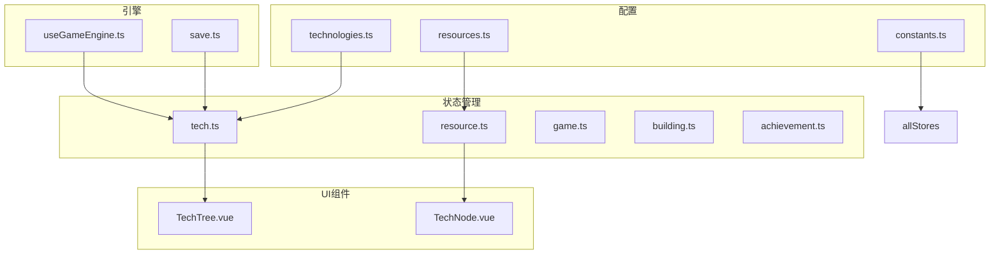
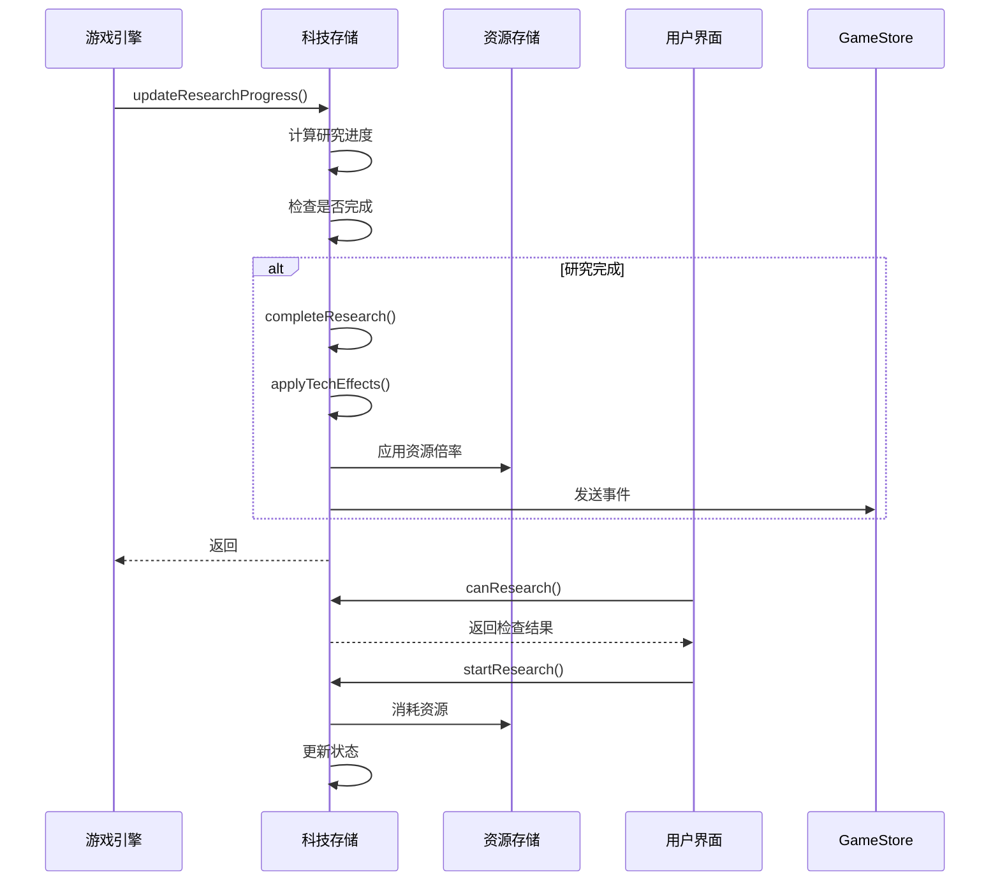
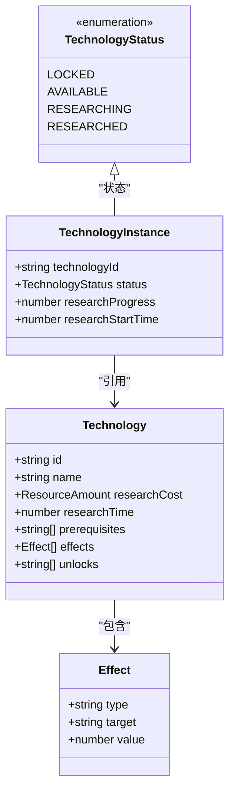
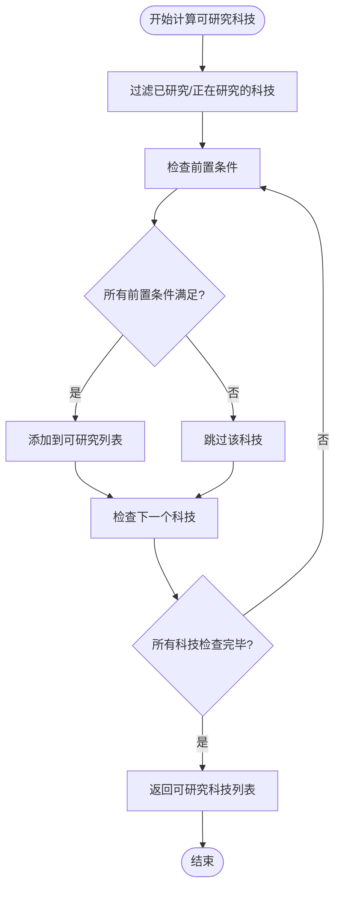
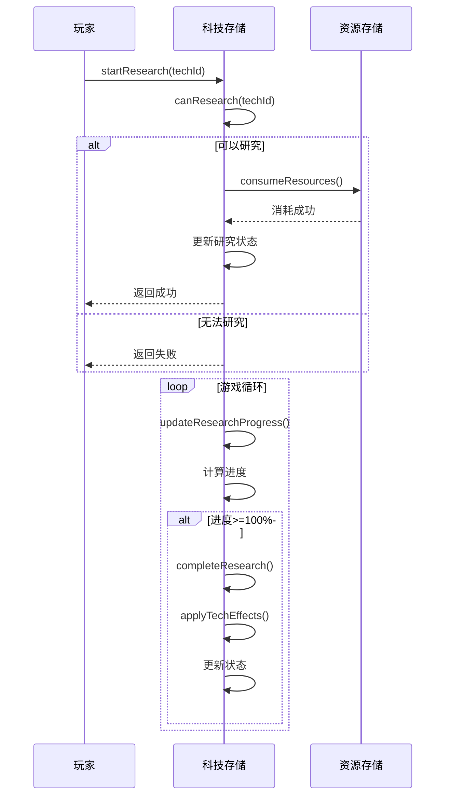
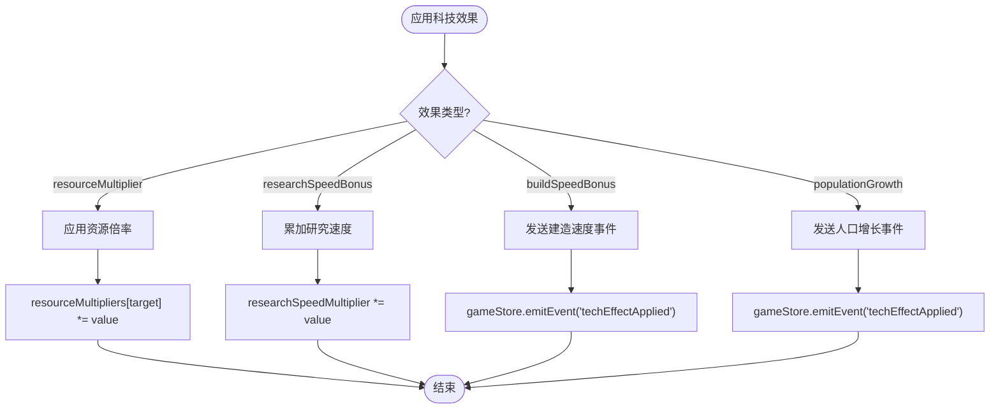
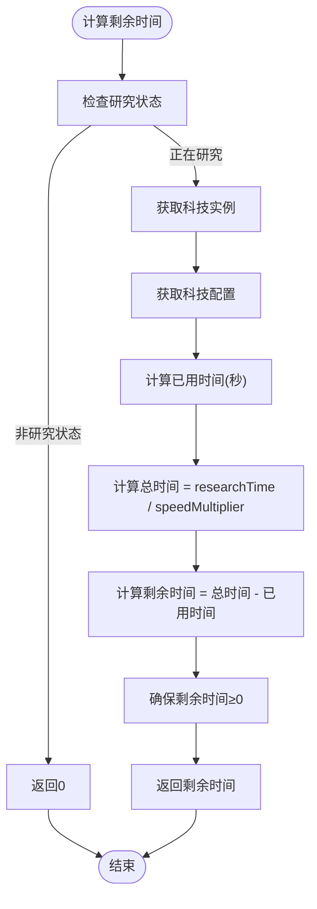
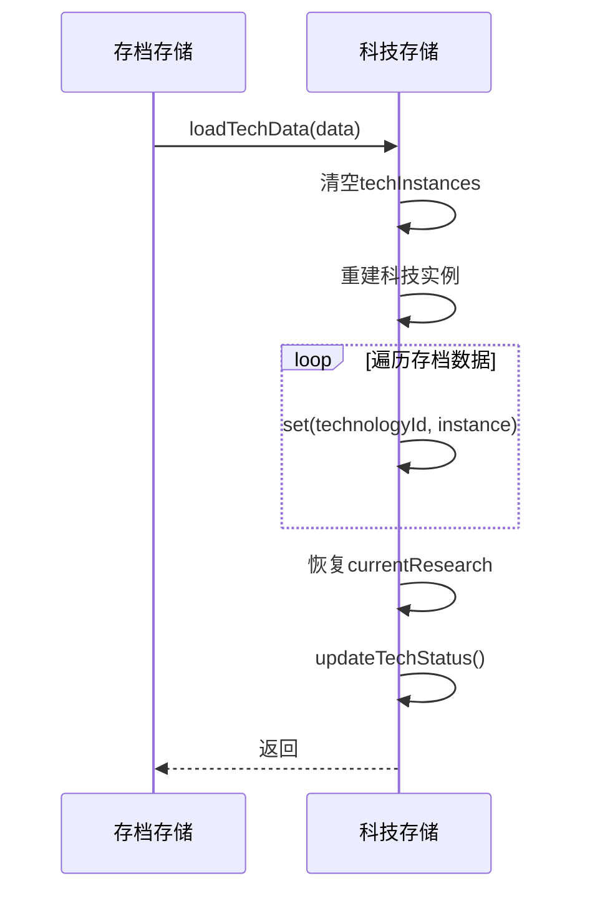
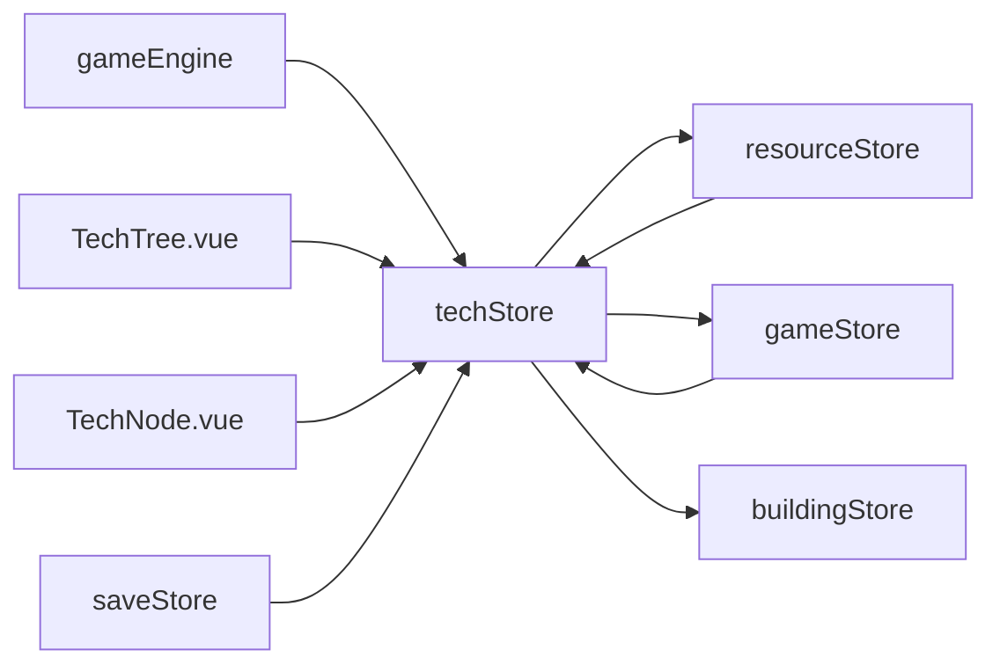

# 科技状态管理

<cite>
**本文档引用文件**  
- [technologies.ts](file://civilization-game\src\config\technologies.ts)
- [tech.ts](file://civilization-game\src\stores\tech.ts)
- [types.ts](file://civilization-game\src\types\index.ts)
- [useGameEngine.ts](file://civilization-game\src\composables\useGameEngine.ts)
- [game.ts](file://civilization-game\src\stores\game.ts)
- [save.ts](file://civilization-game\src\stores\save.ts)
- [resource.ts](file://civilization-game\src\stores\resource.ts)
- [resources.ts](file://civilization-game\src\config\resources.ts)
- [building.ts](file://civilization-game\src\stores\building.ts)
- [buildings.ts](file://civilization-game\src\config\buildings.ts)
- [achievement.ts](file://civilization-game\src\stores\achievement.ts)
- [achievements.ts](file://civilization-game\src\config\achievements.ts)
- [constants.ts](file://civilization-game\src\config\constants.ts)
- [TechTree.vue](file://civilization-game\src\components\game\TechTree.vue)
- [TechNode.vue](file://civilization-game\src\components\game\TechNode.vue)
</cite>

## 目录
1. [引言](#引言)
2. [项目结构](#项目结构)
3. [核心组件](#核心组件)
4. [架构概述](#架构概述)
5. [详细组件分析](#详细组件分析)
6. [依赖分析](#依赖分析)
7. [性能考量](#性能考量)
8. [故障排除指南](#故障排除指南)
9. [结论](#结论)

## 引言
本技术文档深入解析文明类游戏中的科技状态管理系统，重点阐述`techStore`中`techInstances`、`researchQueue`、`currentResearch`等状态对象的设计意图。文档详细解析了`availableTechs`计算属性如何基于前置条件动态计算可研究科技列表，说明了`startResearch`、`cancelResearch`、`updateResearchProgress`等方法构成的研究生命周期管理机制。同时，深入讲解了`applyTechEffects`中不同类型科技效果的分发与应用策略，描述了`getRemainingTime`的时间计算逻辑和精度处理，并提供了`loadTechData`中存档恢复的实现细节，包括研究进度的持久化与重建，以及科技树循环依赖的检测与预防措施。

## 项目结构
本项目采用基于Vue 3和Pinia的状态管理架构，科技系统主要由配置文件、状态存储、类型定义和UI组件构成。核心科技逻辑位于`src/stores/tech.ts`中，通过Pinia store管理科技状态。科技配置数据定义在`src/config/technologies.ts`中，包含所有时代的科技树。类型定义在`src/types/index.ts`中，UI组件位于`src/components/game/`目录下。

**Diagram sources**
- [technologies.ts](file://civilization-game\src\config\technologies.ts)
- [tech.ts](file://civilization-game\src\stores\tech.ts)
- [resource.ts](file://civilization-game\src\stores\resource.ts)
- [game.ts](file://civilization-game\src\stores\game.ts)
- [building.ts](file://civilization-game\src\stores\building.ts)
- [achievement.ts](file://civilization-game\src\stores\achievement.ts)
- [save.ts](file://civilization-game\src\stores\save.ts)
- [useGameEngine.ts](file://civilization-game\src\composables\useGameEngine.ts)
- [TechTree.vue](file://civilization-game\src\components\game\TechTree.vue)
- [TechNode.vue](file://civilization-game\src\components\game\TechNode.vue)

**Section sources**
- [technologies.ts](file://civilization-game\src\config\technologies.ts)
- [tech.ts](file://civilization-game\src\stores\tech.ts)
- [types.ts](file://civilization-game\src\types\index.ts)

## 核心组件
`techStore`是科技系统的核心，通过`defineStore`创建Pinia store，管理所有科技相关的状态和逻辑。`techInstances`使用`Map`存储每个科技的实例，包含状态、研究进度等信息。`researchQueue`数组管理研究队列，`currentResearch`记录当前正在研究的科技ID。`researchSpeedMultiplier`是研究速度加成倍率，通过科技效果动态调整。

**Section sources**
- [tech.ts](file://civilization-game\src\stores\tech.ts#L1-L50)
- [types.ts](file://civilization-game\src\types\index.ts#L150-L197)

## 架构概述
科技系统采用响应式架构，通过Vue的`computed`属性实现动态计算。`availableTechs`计算属性实时过滤出可研究的科技，`currentResearchProgress`计算当前研究进度。系统通过`gameEngine`的`gameLoop`每秒调用`updateResearchProgress`更新研究进度。存档系统通过`exportTechData`和`loadTechData`实现科技状态的持久化。

**Diagram sources**
- [tech.ts](file://civilization-game\src\stores\tech.ts#L200-L300)
- [useGameEngine.ts](file://civilization-game\src\composables\useGameEngine.ts#L100-L120)
- [resource.ts](file://civilization-game\src\stores\resource.ts#L100-L150)
- [game.ts](file://civilization-game\src\stores\game.ts#L200-L250)

## 详细组件分析
### 科技状态管理分析
`techStore`通过`TechnologyInstance`接口管理每个科技的实例状态，包含`technologyId`、`status`、`researchProgress`等属性。状态机采用`LOCKED`、`AVAILABLE`、`RESEARCHING`、`RESEARCHED`四种状态，通过`updateTechStatus`方法根据前置条件动态更新状态。

**Diagram sources**
- [types.ts](file://civilization-game\src\types\index.ts#L150-L197)
- [tech.ts](file://civilization-game\src\stores\tech.ts#L1-L100)

#### 可研究科技计算逻辑
`availableTechs`计算属性是科技系统的核心逻辑，它通过`technologies`配置数组和`checkPrerequisites`方法动态计算可研究的科技列表。该计算属性会过滤掉已研究或正在研究的科技，并检查每个科技的前置条件是否满足。

**Diagram sources**
- [tech.ts](file://civilization-game\src\stores\tech.ts#L28-L70)
- [technologies.ts](file://civilization-game\src\config\technologies.ts#L1-L100)

#### 研究生命周期管理
研究生命周期由`startResearch`、`updateResearchProgress`、`completeResearch`和`cancelResearch`四个核心方法构成。`startResearch`方法首先检查研究条件，消耗资源后启动研究。`updateResearchProgress`在游戏循环中被调用，计算当前进度。`completeResearch`在研究完成后应用科技效果并更新状态。

**Diagram sources**
- [tech.ts](file://civilization-game\src\stores\tech.ts#L150-L300)
- [resource.ts](file://civilization-game\src\stores\resource.ts#L150-L200)

#### 科技效果应用策略
`applyTechEffects`方法根据科技效果类型分发和应用不同的游戏机制。`resourceMultiplier`类型直接修改`resourceStore`中的资源倍率，`researchSpeedBonus`类型累加到`researchSpeedMultiplier`，而`buildSpeedBonus`和`populationGrowth`类型通过`gameStore`的事件系统通知其他系统。

**Diagram sources**
- [tech.ts](file://civilization-game\src\stores\tech.ts#L250-L280)
- [resource.ts](file://civilization-game\src\stores\resource.ts#L50-L100)
- [game.ts](file://civilization-game\src\stores\game.ts#L200-L250)

#### 时间计算与精度处理
`getRemainingTime`方法精确计算科技研究的剩余时间，考虑了研究速度加成的影响。该方法首先检查科技是否正在研究，然后根据`researchStartTime`和`researchTime`计算剩余时间，确保返回值不为负数。

**Diagram sources**
- [tech.ts](file://civilization-game\src\stores\tech.ts#L300-L320)
- [types.ts](file://civilization-game\src\types\index.ts#L150-L197)

#### 存档恢复与持久化
`loadTechData`方法负责从存档中恢复科技状态，包括`techInstances`的重建和`currentResearch`的恢复。该方法首先清空现有状态，然后逐个重建科技实例，最后通过`updateTechStatus`同步状态。

**Diagram sources**
- [tech.ts](file://civilization-game\src\stores\tech.ts#L352-L370)
- [save.ts](file://civilization-game\src\stores\save.ts#L100-L150)

## 依赖分析
科技系统与多个核心系统紧密耦合，形成复杂依赖网络。`techStore`依赖`resourceStore`进行资源管理，依赖`gameStore`进行事件分发，同时被`gameEngine`和UI组件依赖。存档系统`saveStore`依赖`techStore`进行数据导出和导入。

**Diagram sources**
- [tech.ts](file://civilization-game\src\stores\tech.ts)
- [resource.ts](file://civilization-game\src\stores\resource.ts)
- [game.ts](file://civilization-game\src\stores\game.ts)
- [building.ts](file://civilization-game\src\stores\building.ts)
- [useGameEngine.ts](file://civilization-game\src\composables\useGameEngine.ts)
- [save.ts](file://civilization-game\src\stores\save.ts)
- [TechTree.vue](file://civilization-game\src\components\game\TechTree.vue)
- [TechNode.vue](file://civilization-game\src\components\game\TechNode.vue)

**Section sources**
- [tech.ts](file://civilization-game\src\stores\tech.ts)
- [resource.ts](file://civilization-game\src\stores\resource.ts)
- [game.ts](file://civilization-game\src\stores\game.ts)
- [building.ts](file://civilization-game\src\stores\building.ts)
- [save.ts](file://civilization-game\src\stores\save.ts)

## 性能考量
科技系统在性能方面进行了多项优化。`availableTechs`计算属性利用Vue的响应式系统，仅在相关依赖变化时重新计算。`updateResearchProgress`方法在游戏循环中高效执行，避免不必要的计算。存档系统通过`compressSaveData`方法压缩数据，减少存储空间和加载时间。

**Section sources**
- [tech.ts](file://civilization-game\src\stores\tech.ts#L200-L300)
- [save.ts](file://civilization-game\src\stores\save.ts#L1-L100)

## 故障排除指南
### 科技无法研究
当科技无法研究时，应检查以下条件：
1. 前置科技是否已研究完成
2. 是否有足够的研究资源
3. 是否已有其他科技正在研究
4. 科技状态是否为`LOCKED`或`RESEARCHED`

### 研究进度不更新
如果研究进度不更新，应检查：
1. `gameEngine`是否正常运行
2. `updateResearchProgress`是否被正确调用
3. `currentResearch`是否设置正确
4. `researchStartTime`是否正确记录

### 存档加载失败
存档加载失败时，应检查：
1. 存档数据是否完整
2. 版本是否兼容
3. `loadTechData`方法是否正确执行
4. 状态是否正确同步

**Section sources**
- [tech.ts](file://civilization-game\src\stores\tech.ts#L100-L300)
- [save.ts](file://civilization-game\src\stores\save.ts#L100-L200)

## 结论
科技状态管理系统是文明类游戏的核心机制之一，通过精心设计的状态管理、计算属性和生命周期方法，实现了复杂的科技树功能。系统采用模块化设计，各组件职责清晰，依赖关系明确。通过响应式计算和事件驱动架构，确保了系统的高效性和可维护性。未来可进一步优化循环依赖检测，增强存档系统的兼容性，并提供更多调试工具。