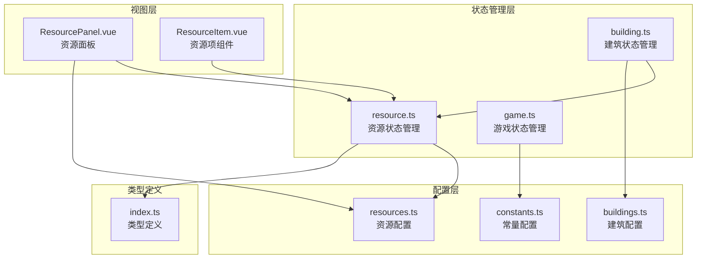
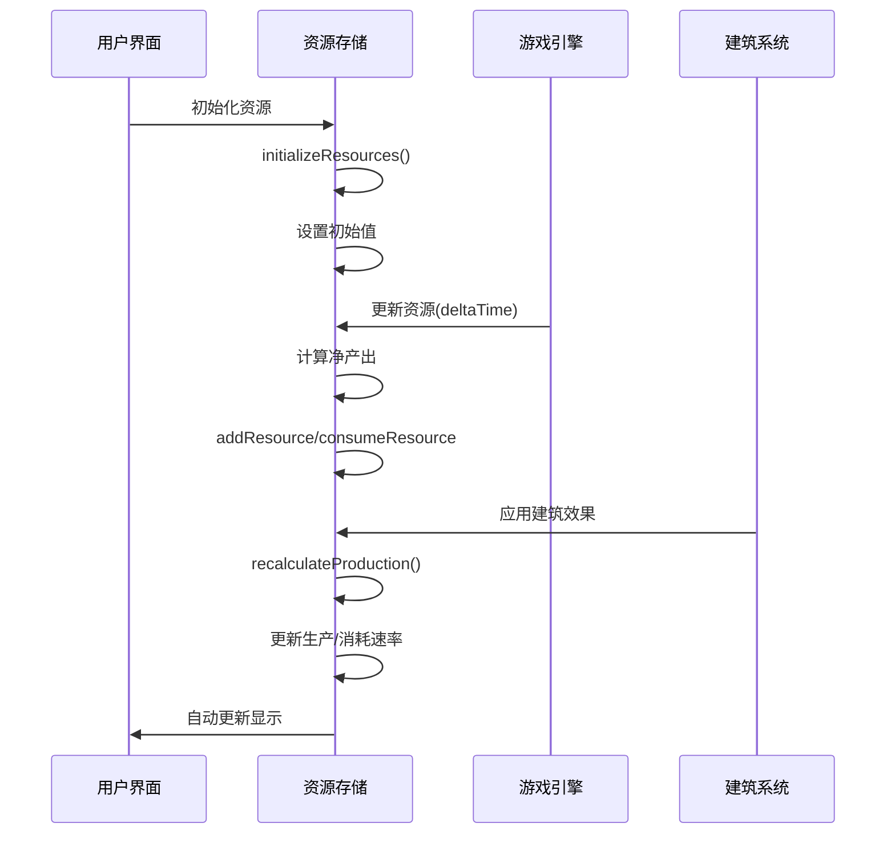
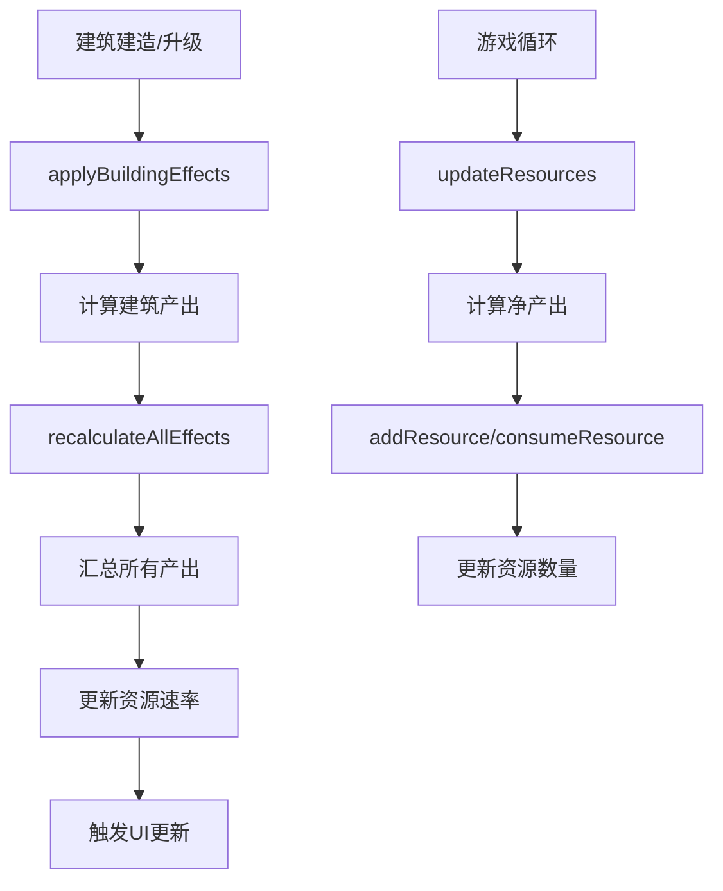
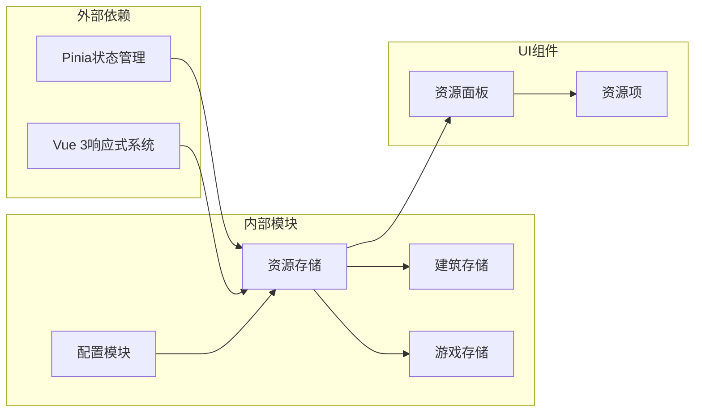

# 资源状态管理系统技术文档

<cite>
**本文档引用的文件**
- [src/stores/resource.ts](file://civilization-game/src/stores/resource.ts)
- [src/config/resources.ts](file://civilization-game/src/config/resources.ts)
- [src/types/index.ts](file://civilization-game/src/types/index.ts)
- [src/composables/useGameEngine.ts](file://civilization-game/src/composables/useGameEngine.ts)
- [src/config/constants.ts](file://civilization-game/src/config/constants.ts)
- [src/components/game/ResourcePanel.vue](file://civilization-game/src/components/game/ResourcePanel.vue)
- [src/components/ui/ResourceItem.vue](file://civilization-game/src/components/ui/ResourceItem.vue)
- [src/config/buildings.ts](file://civilization-game/src/config/buildings.ts)
- [src/stores/building.ts](file://civilization-game/src/stores/building.ts)
- [src/stores/game.ts](file://civilization-game/src/stores/game.ts)
</cite>

## 目录
1. [简介](#简介)
2. [项目结构概览](#项目结构概览)
3. [核心状态对象设计](#核心状态对象设计)
4. [架构概览](#架构概览)
5. [详细组件分析](#详细组件分析)
6. [依赖关系分析](#依赖关系分析)
7. [性能考虑](#性能考虑)
8. [故障排除指南](#故障排除指南)
9. [结论](#结论)

## 简介

资源状态管理系统是《文明游戏》的核心组件之一，负责管理游戏中各种资源的状态、产出、消耗和存储。该系统采用Vue 3的组合式API和Pinia状态管理库，提供了完整的资源生命周期管理功能，包括初始化、增减、上限控制、产出计算和UI同步等功能。

系统支持多种类型的资源，从基础的食品、木材、石头到高级的钢铁、电力、芯片等，每个资源都有独立的状态管理和计算逻辑。通过精心设计的数据结构和算法，确保了资源系统的高效运行和良好的用户体验。

## 项目结构概览

资源状态管理系统主要分布在以下关键文件中：



**图表来源**
- [src/stores/resource.ts](file://civilization-game/src/stores/resource.ts#L1-L202)
- [src/config/resources.ts](file://civilization-game/src/config/resources.ts#L1-L247)
- [src/types/index.ts](file://civilization-game/src/types/index.ts#L1-L198)

**章节来源**
- [src/stores/resource.ts](file://civilization-game/src/stores/resource.ts#L1-L202)
- [src/config/resources.ts](file://civilization-game/src/config/resources.ts#L1-L247)

## 核心状态对象设计

### 资源数量管理

系统使用`ref<Record<ResourceType, number>>`来管理资源数量，这种设计提供了响应式的数据绑定和高效的查找性能：

```typescript
const resourceAmounts = ref<Record<ResourceType, number>>({} as Record<ResourceType, number>)
```

### 资源存储上限

资源存储上限通过`resourceLimits`状态对象管理，支持动态调整：

```typescript
const resourceLimits = ref<Record<ResourceType, number>>({} as Record<ResourceType, number>)
```

### 生产和消费速率

系统维护两个独立的速率对象来跟踪资源的产出和消耗：

```typescript
const productionRates = ref<Record<ResourceType, number>>({} as Record<ResourceType, number>)
const consumptionRates = ref<Record<ResourceType, number>>({} as Record<ResourceType, number>)
```

### 资源倍率系统

为了支持科技和成就带来的资源加成，系统引入了资源倍率机制：

```typescript
const resourceMultipliers = ref<Record<string, number>>({})
```

**章节来源**
- [src/stores/resource.ts](file://civilization-game/src/stores/resource.ts#L8-L15)

## 架构概览

资源状态管理系统采用分层架构设计，各层职责明确，耦合度低：



**图表来源**
- [src/stores/resource.ts](file://civilization-game/src/stores/resource.ts#L20-L150)
- [src/composables/useGameEngine.ts](file://civilization-game/src/composables/useGameEngine.ts#L40-L80)

## 详细组件分析

### 初始化资源函数

`initializeResources`函数负责设置游戏开始时的资源状态：

```typescript
function initializeResources() {
  resources.forEach(resource => {
    resourceAmounts.value[resource.id] = 0
    resourceLimits.value[resource.id] = resource.baseStorage
    productionRates.value[resource.id] = 0
    consumptionRates.value[resource.id] = 0
  })
  
  // 设置初始资源
  resourceAmounts.value.food = 100
  resourceAmounts.value.wood = 50
  resourceAmounts.value.stone = 50
}
```

该函数的特点：
- 遍历所有资源配置，初始化基础状态
- 设置默认存储上限
- 为关键资源设置初始值
- 支持动态扩展新的资源类型

### 核心资源操作方法

#### addResource方法

`addResource`方法实现了安全的资源增加逻辑：

```typescript
function addResource(resourceId: ResourceType, amount: number) {
  const current = resourceAmounts.value[resourceId] || 0
  const limit = resourceLimits.value[resourceId] || Infinity
  resourceAmounts.value[resourceId] = Math.min(current + amount, limit)
}
```

**边界条件处理：**
- 资源不存在时自动创建
- 存储上限保护
- 防止负值溢出

#### consumeResource方法

`consumeResource`方法提供了原子性的资源消耗操作：

```typescript
function consumeResource(resourceId: ResourceType, amount: number): boolean {
  const current = resourceAmounts.value[resourceId] || 0
  if (current >= amount) {
    resourceAmounts.value[resourceId] = current - amount
    return true
  }
  return false
}
```

**异常处理：**
- 资源不足时返回false
- 不会修改状态直到确认有足够的资源
- 支持事务性操作

#### 批量操作方法

系统提供了批量资源操作方法，提高性能和代码简洁性：

```typescript
function addResources(resources: ResourceAmount) {
  Object.entries(resources).forEach(([resourceId, amount]) => {
    addResource(resourceId as ResourceType, amount)
  })
}

function consumeResources(costs: ResourceAmount): boolean {
  if (!hasEnoughResources(costs)) {
    return false
  }
  Object.entries(costs).forEach(([resourceId, amount]) => {
    consumeResource(resourceId as ResourceType, amount)
  })
  return true
}
```

### 净产出计算机制

`netProduction`计算属性提供了实时的资源净产出信息：

```typescript
const netProduction = computed(() => {
  const result: Record<ResourceType, number> = {} as Record<ResourceType, number>
  Object.keys(resourceAmounts.value).forEach((resourceId) => {
    const id = resourceId as ResourceType
    const production = productionRates.value[id] || 0
    const consumption = consumptionRates.value[id] || 0
    result[id] = production - consumption
  })
  return result
})
```

**实现特点：**
- 响应式计算，自动更新
- 支持所有资源类型的净产出
- 零值处理和默认值设置
- 高效的遍历算法

### 资源上限管理

#### setResourceLimit方法

```typescript
function setResourceLimit(resourceId: ResourceType, limit: number) {
  resourceLimits.value[resourceId] = limit
}
```

#### increaseResourceLimit方法

```typescript
function increaseResourceLimit(resourceId: ResourceType, amount: number) {
  const current = resourceLimits.value[resourceId] || 0
  resourceLimits.value[resourceId] = current + amount
}
```

这些方法支持动态调整资源存储能力，配合建筑升级和科技研究使用。

### 资源更新机制

`updateResources`方法是资源系统的核心更新逻辑：

```typescript
function updateResources(deltaTime: number = 1) {
  Object.keys(resourceAmounts.value).forEach((resourceId) => {
    const id = resourceId as ResourceType
    const production = productionRates.value[id] || 0
    const consumption = consumptionRates.value[id] || 0
    const netProduction = (production - consumption) * deltaTime
    
    if (netProduction > 0) {
      addResource(id, netProduction)
    } else if (netProduction < 0) {
      const currentAmount = getResourceAmount(id)
      const consumeAmount = Math.abs(netProduction)
      if (currentAmount >= consumeAmount) {
        consumeResource(id, consumeAmount)
      } else {
        resourceAmounts.value[id] = 0
      }
    }
  })
}
```

**更新逻辑：**
1. 遍历所有资源
2. 计算净产出（产出 - 消耗）
3. 正值：增加资源，受存储上限限制
4. 负值：消耗资源，优先保证资源不为负
5. 支持非整数时间增量

**章节来源**
- [src/stores/resource.ts](file://civilization-game/src/stores/resource.ts#L20-L150)

### 建筑集成机制

资源系统与建筑系统紧密集成，通过`recalculateProduction`方法汇总所有建筑的产出：

```typescript
function recalculateProduction() {
  // 重置所有产出和消耗
  Object.keys(productionRates.value).forEach((resourceId) => {
    productionRates.value[resourceId as ResourceType] = 0
    consumptionRates.value[resourceId as ResourceType] = 0
  })
  // 这个方法会在建筑Store中调用,汇总所有建筑的产出
}
```

建筑系统通过以下方式与资源系统交互：



**图表来源**
- [src/stores/building.ts](file://civilization-game/src/stores/building.ts#L200-L230)
- [src/stores/resource.ts](file://civilization-game/src/stores/resource.ts#L151-L155)

**章节来源**
- [src/stores/resource.ts](file://civilization-game/src/stores/resource.ts#L151-L155)
- [src/stores/building.ts](file://civilization-game/src/stores/building.ts#L200-L230)

## 依赖关系分析

资源状态管理系统的依赖关系如下：



**图表来源**
- [src/stores/resource.ts](file://civilization-game/src/stores/resource.ts#L1-L5)
- [src/stores/building.ts](file://civilization-game/src/stores/building.ts#L1-L10)

**章节来源**
- [src/stores/resource.ts](file://civilization-game/src/stores/resource.ts#L1-L5)
- [src/stores/building.ts](file://civilization-game/src/stores/building.ts#L1-L10)

## 性能考虑

### 频繁更新优化

为了避免频繁的ref更新导致的性能问题，系统采用了以下优化策略：

1. **批量操作**：使用`addResources`和`consumeResources`方法进行批量处理
2. **条件更新**：只有在资源数量发生变化时才触发更新
3. **计算属性缓存**：利用Vue的计算属性缓存机制

### 内存管理

系统通过以下方式优化内存使用：

1. **延迟初始化**：资源对象只在首次访问时创建
2. **对象复用**：避免不必要的对象创建
3. **清理机制**：在重置时清理不需要的数据

### 游戏循环集成

资源更新与游戏循环集成，每秒执行一次：

```typescript
// 在gameLoop中调用
while (accumulator >= GAME_TICK_INTERVAL) {
  updateGame(1) // 更新1秒
  accumulator -= GAME_TICK_INTERVAL
}
```

**性能监控**：
- FPS检测和警告
- 帧跳过机制防止卡顿
- 性能阈值调整

**章节来源**
- [src/composables/useGameEngine.ts](file://civilization-game/src/composables/useGameEngine.ts#L40-L60)

## 故障排除指南

### 常见问题及解决方案

#### 资源数量异常

**问题**：资源数量显示异常或超出预期
**解决方案**：
1. 检查`addResource`和`consumeResource`的调用
2. 验证存储上限设置
3. 确认`updateResources`的deltaTime参数

#### 资源上限失效

**问题**：资源超过存储上限
**解决方案**：
1. 检查`setResourceLimit`的调用
2. 验证`increaseResourceLimit`的累积效果
3. 确认`addResource`中的上限检查逻辑

#### 净产出计算错误

**问题**：资源净产出显示不正确
**解决方案**：
1. 检查`productionRates`和`consumptionRates`的设置
2. 验证`recalculateProduction`的调用时机
3. 确认`netProduction`计算属性的依赖关系

### 调试技巧

1. **状态检查**：使用Vue DevTools检查资源状态
2. **日志记录**：在关键方法中添加console.log
3. **单元测试**：为核心方法编写测试用例

**章节来源**
- [src/stores/resource.ts](file://civilization-game/src/stores/resource.ts#L40-L80)

## 结论

资源状态管理系统是一个设计精良、功能完备的游戏资源管理框架。它通过以下特性确保了系统的高效性和可靠性：

### 主要优势

1. **响应式设计**：基于Vue 3的响应式系统，确保UI与数据的一致性
2. **类型安全**：完整的TypeScript类型定义，提供编译时检查
3. **模块化架构**：清晰的职责分离和低耦合设计
4. **性能优化**：智能的更新策略和缓存机制
5. **扩展性强**：支持新资源类型的轻松添加

### 技术亮点

- **零值处理**：优雅处理未初始化的资源状态
- **边界保护**：完善的资源数量和存储上限检查
- **事务性操作**：原子性的资源增减操作
- **实时计算**：响应式的净产出计算
- **集成友好**：与建筑系统和游戏引擎无缝集成

### 应用场景

该系统适用于各种资源管理类游戏，特别是：
- 文明建设类游戏
- 资源管理模拟游戏
- 建造和升级类游戏
- 多层次资源系统的游戏

通过深入理解这些设计原理和实现细节，开发者可以更好地维护和扩展这个资源管理系统，为玩家提供流畅而富有深度的游戏体验。