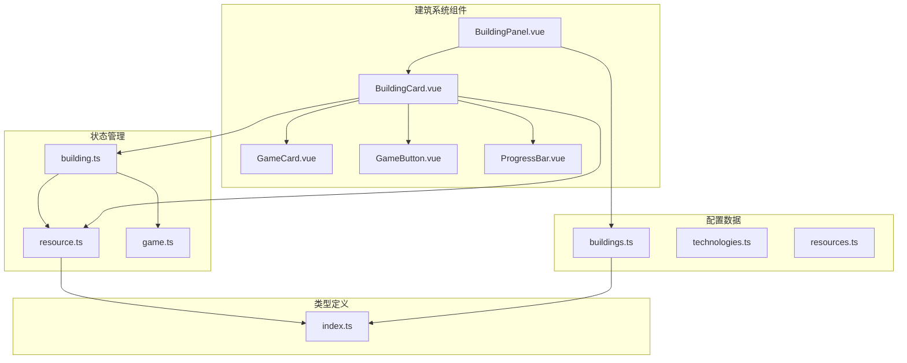
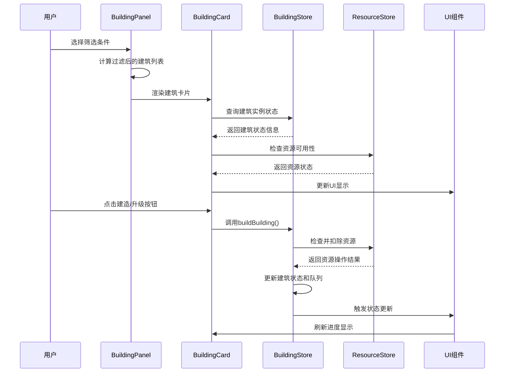
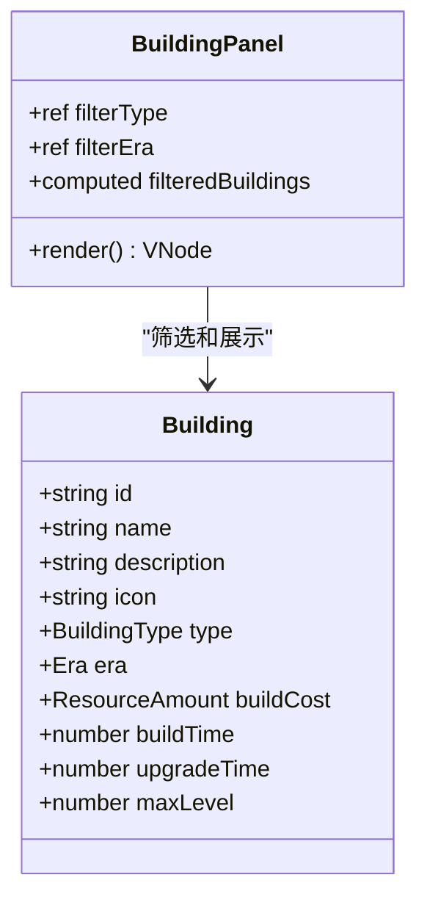
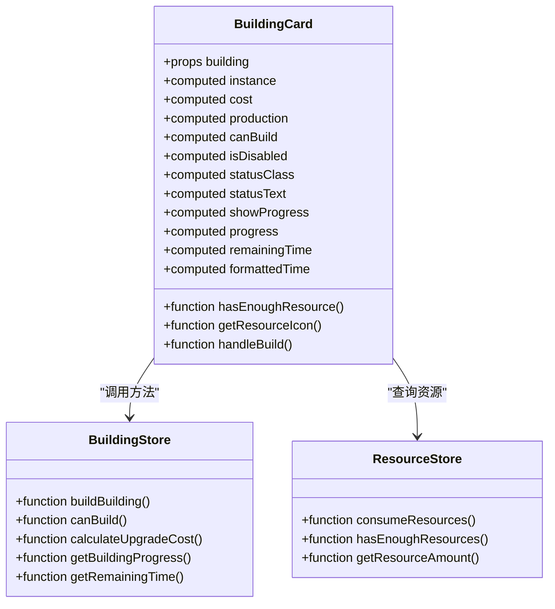
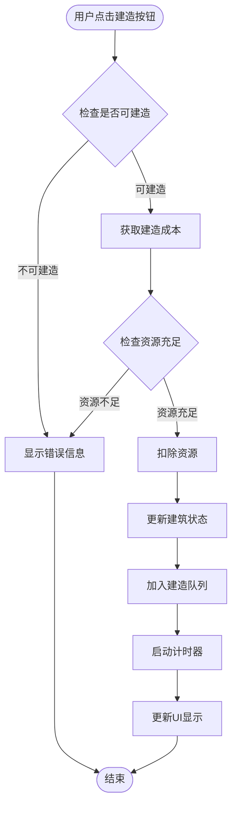
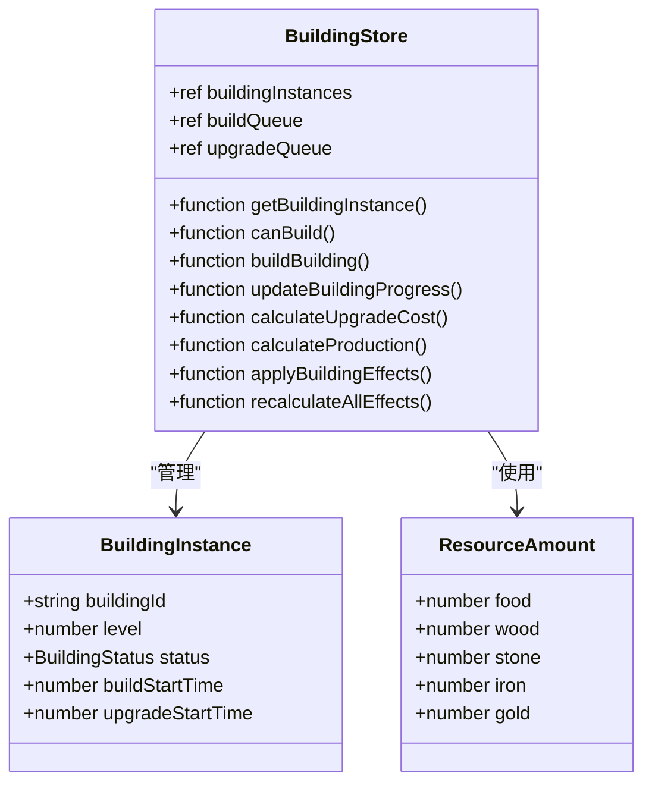
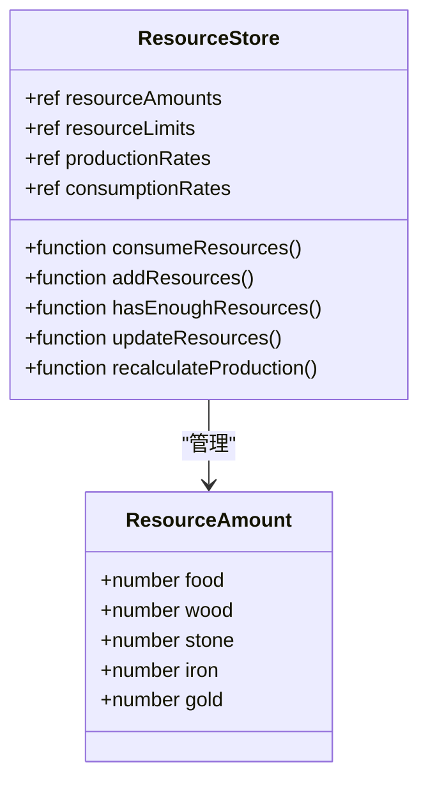

# 建筑面板组件

<cite>
**本文档引用的文件**
- [BuildingPanel.vue](file://civilization-game/src/components/game/BuildingPanel.vue)
- [BuildingCard.vue](file://civilization-game/src/components/game/BuildingCard.vue)
- [building.ts](file://civilization-game/src/stores/building.ts)
- [resource.ts](file://civilization-game/src/stores/resource.ts)
- [buildings.ts](file://civilization-game/src/config/buildings.ts)
- [index.ts](file://civilization-game/src/types/index.ts)
</cite>

## 目录
1. [简介](#简介)
2. [项目结构](#项目结构)
3. [核心组件](#核心组件)
4. [架构概览](#架构概览)
5. [详细组件分析](#详细组件分析)
6. [依赖关系分析](#依赖关系分析)
7. [性能考虑](#性能考虑)
8. [故障排除指南](#故障排除指南)
9. [结论](#结论)

## 简介

BuildingPanel及其子组件BuildingCard是文明游戏中的核心建筑管理系统。该系统负责从building store中读取所有可建造建筑列表，并通过BuildingCard组件渲染每个建筑的详细信息，包括名称、描述、成本、建造时间及当前状态。用户可以通过点击建造按钮触发完整的建造流程，系统会进行资源校验、资源扣除、启动建造计时、状态更新和UI刷新。

## 项目结构



**图表来源**
- [BuildingPanel.vue](file://civilization-game/src/components/game/BuildingPanel.vue#L1-L78)
- [BuildingCard.vue](file://civilization-game/src/components/game/BuildingCard.vue#L1-L237)
- [building.ts](file://civilization-game/src/stores/building.ts#L1-L320)

## 核心组件

### BuildingPanel组件

BuildingPanel作为主容器组件，提供了建筑筛选和展示功能：

- **筛选功能**：支持按建筑类型（生产类、存储类、人口类、功能类）和时代（石器时代、青铜时代等）进行筛选
- **网格布局**：使用响应式网格布局展示建筑卡片
- **空状态处理**：当没有符合条件的建筑时显示友好的提示信息

### BuildingCard组件

BuildingCard是单个建筑的详细展示组件，具有以下特性：

- **状态显示**：根据建筑的不同状态（建造中、升级中、已建造）显示相应的状态文本和样式
- **资源成本可视化**：实时显示建造/升级成本，并根据资源充足情况高亮显示
- **进度条展示**：在建筑建造或升级过程中显示进度条和剩余时间
- **交互控制**：根据建筑的解锁条件、研究依赖和资源可用性动态调整按钮状态

**章节来源**
- [BuildingPanel.vue](file://civilization-game/src/components/game/BuildingPanel.vue#L1-L78)
- [BuildingCard.vue](file://civilization-game/src/components/game/BuildingCard.vue#L1-L237)

## 架构概览



**图表来源**
- [BuildingCard.vue](file://civilization-game/src/components/game/BuildingCard.vue#L220-L235)
- [building.ts](file://civilization-game/src/stores/building.ts#L100-L140)

## 详细组件分析

### BuildingPanel详细分析

BuildingPanel组件实现了完整的建筑筛选和展示功能：



**图表来源**
- [BuildingPanel.vue](file://civilization-game/src/components/game/BuildingPanel.vue#L40-L78)
- [buildings.ts](file://civilization-game/src/config/buildings.ts#L1-L50)

#### 筛选逻辑实现

BuildingPanel使用组合式API实现智能筛选：

```typescript
const filteredBuildings = computed(() => {
  return buildings.filter(building => {
    if (filterType.value !== 'all' && building.type !== filterType.value) {
      return false
    }
    if (filterEra.value !== 'all' && building.era !== filterEra.value) {
      return false
    }
    return true
  })
})
```

**章节来源**
- [BuildingPanel.vue](file://civilization-game/src/components/game/BuildingPanel.vue#L40-L78)

### BuildingCard详细分析

BuildingCard组件是整个建筑系统的核心交互组件：



**图表来源**
- [BuildingCard.vue](file://civilization-game/src/components/game/BuildingCard.vue#L92-L134)
- [building.ts](file://civilization-game/src/stores/building.ts#L100-L140)

#### 建造流程实现



**图表来源**
- [building.ts](file://civilization-game/src/stores/building.ts#L100-L140)

#### 资源校验和扣除机制

BuildingCard组件通过computed属性实现智能资源校验：

```typescript
const canBuild = computed(() => {
  const check = buildingStore.canBuild(props.building.id)
  return check.can
})

function hasEnoughResource(resource: string, amount: number): boolean {
  return resourceStore.getResourceAmount(resource as any) >= amount
}
```

**章节来源**
- [BuildingCard.vue](file://civilization-game/src/components/game/BuildingCard.vue#L70-L90)
- [building.ts](file://civilization-game/src/stores/building.ts#L35-L55)

### BuildingStore状态管理

BuildingStore是建筑系统的中央状态管理器：



**图表来源**
- [building.ts](file://civilization-game/src/stores/building.ts#L15-L30)
- [index.ts](file://civilization-game/src/types/index.ts#L75-L95)

#### 建造队列管理

```typescript
// 建造队列
const buildQueue = ref<string[]>([])

// 升级队列
const upgradeQueue = ref<string[]>([])

// 更新建造/升级进度
function updateBuildingProgress() {
  const now = Date.now()

  // 检查建造队列
  buildQueue.value.forEach((buildingId, index) => {
    const instance = getBuildingInstance(buildingId)
    const config = getBuildingConfig(buildingId)
    if (!instance || !config || !instance.buildStartTime) return

    const elapsed = (now - instance.buildStartTime) / 1000
    if (elapsed >= config.buildTime) {
      // 建造完成
      instance.status = BuildingStatus.BUILT
      delete instance.buildStartTime
      buildQueue.value.splice(index, 1)
      
      // 应用建筑效果
      applyBuildingEffects(buildingId)
    }
  })
}
```

**章节来源**
- [building.ts](file://civilization-game/src/stores/building.ts#L140-L180)

### ResourceStore资源管理

ResourceStore负责管理游戏中所有资源的增减和状态：



**图表来源**
- [resource.ts](file://civilization-game/src/stores/resource.ts#L10-L30)

#### 资源扣除实现

```typescript
// 批量消耗资源
function consumeResources(costs: ResourceAmount): boolean {
  if (!hasEnoughResources(costs)) {
    return false
  }
  Object.entries(costs).forEach(([resourceId, amount]) => {
    consumeResource(resourceId as ResourceType, amount)
  })
  return true
}

// 检查是否有足够的资源
function hasEnoughResources(costs: ResourceAmount): boolean {
  return Object.entries(costs).every(([resourceId, amount]) => {
    return getResourceAmount(resourceId as ResourceType) >= amount
  })
}
```

**章节来源**
- [resource.ts](file://civilization-game/src/stores/resource.ts#L77-L90)

## 依赖关系分析

```mermaid
graph TB
subgraph "外部依赖"
Vue[Vue 3]
Pinia[Pinia]
Iconify[@iconify/vue]
end
subgraph "内部模块"
BuildingPanel --> BuildingCard
BuildingPanel --> BuildingsConfig
BuildingCard --> BuildingStore
BuildingCard --> ResourceStore
BuildingCard --> GameCard
BuildingCard --> GameButton
BuildingCard --> ProgressBar
BuildingStore --> ResourceStore
BuildingStore --> GameStore
ResourceStore --> ResourcesConfig
end
BuildingPanel --> Vue
BuildingCard --> Vue
BuildingStore --> Pinia
ResourceStore --> Pinia
BuildingCard --> Iconify
```

**图表来源**
- [BuildingPanel.vue](file://civilization-game/src/components/game/BuildingPanel.vue#L1-L20)
- [BuildingCard.vue](file://civilization-game/src/components/game/BuildingCard.vue#L1-L30)

**章节来源**
- [BuildingPanel.vue](file://civilization-game/src/components/game/BuildingPanel.vue#L1-L20)
- [BuildingCard.vue](file://civilization-game/src/components/game/BuildingCard.vue#L1-L30)

## 性能考虑

### 计算属性优化

BuildingCard组件大量使用Vue的computed属性来实现响应式更新：

- **懒计算**：只有在依赖变化时才重新计算
- **缓存机制**：计算结果会被缓存直到依赖改变
- **细粒度更新**：每个计算属性独立更新，避免不必要的重渲染

### 状态同步策略

- **集中式状态管理**：所有建筑状态由BuildingStore统一管理
- **事件驱动更新**：通过Pinia的状态变更自动触发UI更新
- **批量操作**：资源和建筑效果的计算采用批量处理

## 故障排除指南

### 常见问题和解决方案

#### 1. 建筑无法建造

**症状**：建筑按钮被禁用，无法点击

**可能原因**：
- 资源不足
- 未满足解锁条件
- 建筑已达最大等级

**解决方法**：
```typescript
// 检查具体原因
const check = buildingStore.canBuild(buildingId)
console.log('建造检查结果:', check)
```

#### 2. 进度条不更新

**症状**：建筑正在建造但进度条不动

**可能原因**：
- updateBuildingProgress函数未被调用
- 时间计算错误
- 状态同步问题

**解决方法**：
- 确保游戏循环中定期调用`buildingStore.updateBuildingProgress()`
- 检查时间计算逻辑
- 验证状态同步机制

#### 3. 资源扣除异常

**症状**：资源被扣除但建筑未开始建造

**可能原因**：
- 资源扣除成功但状态更新失败
- 队列管理错误
- 异步操作问题

**解决方法**：
- 检查资源扣除的返回值
- 验证队列状态
- 添加调试日志

**章节来源**
- [building.ts](file://civilization-game/src/stores/building.ts#L35-L55)
- [building.ts](file://civilization-game/src/stores/building.ts#L140-L180)

## 结论

BuildingPanel及其子组件BuildingCard构成了一个完整、高效的建筑管理系统。该系统通过清晰的组件分离、响应式的状态管理和智能的资源校验机制，为玩家提供了流畅的建筑建造体验。

### 主要优势

1. **模块化设计**：组件职责明确，易于维护和扩展
2. **响应式更新**：基于Vue 3的响应式系统，确保UI与状态同步
3. **资源管理**：完善的资源校验和扣除机制
4. **用户体验**：直观的状态显示和进度反馈
5. **可扩展性**：支持多时代、多类型的建筑系统

### 改进建议

1. **错误处理**：增强错误处理和用户反馈机制
2. **性能优化**：考虑大规模建筑场景的性能优化
3. **动画效果**：添加更多的视觉反馈动画
4. **无障碍支持**：改进键盘导航和屏幕阅读器支持

该建筑系统为文明游戏提供了坚实的基础，能够支持复杂的建筑建造和升级逻辑，同时保持良好的用户体验和系统性能。