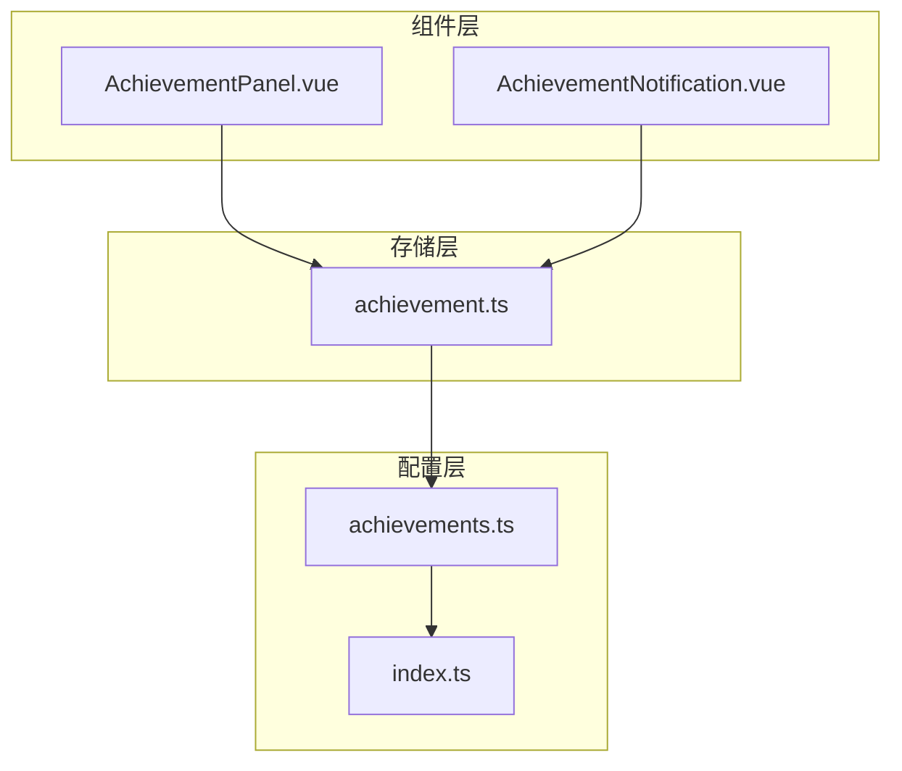
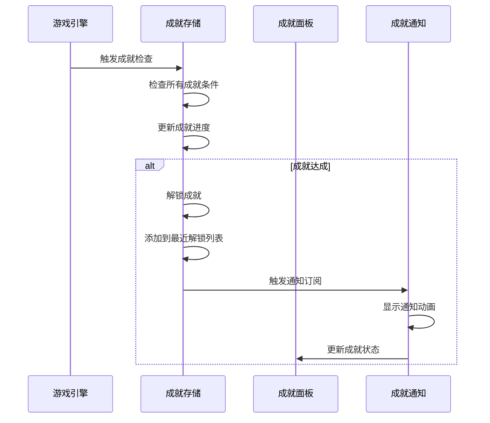
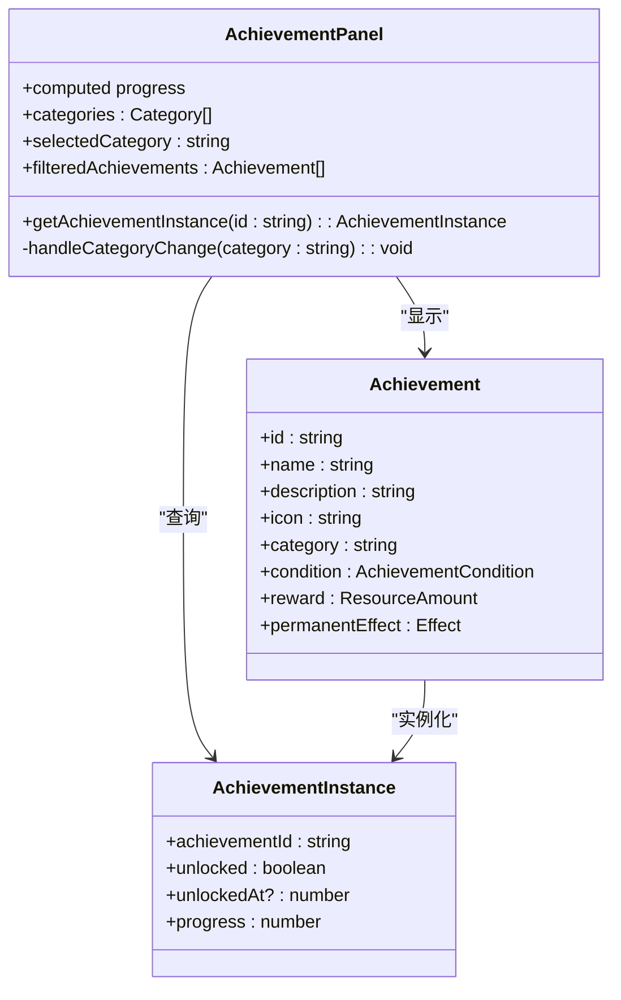
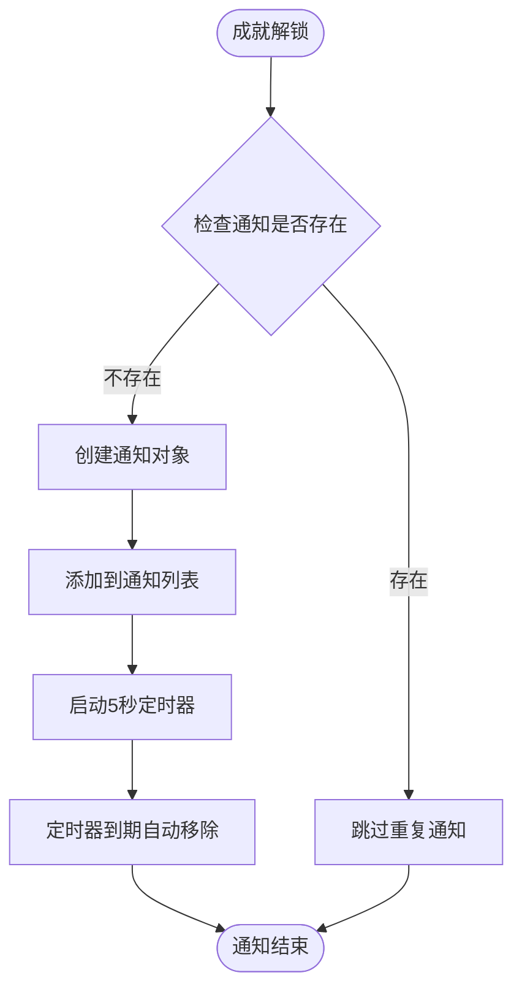
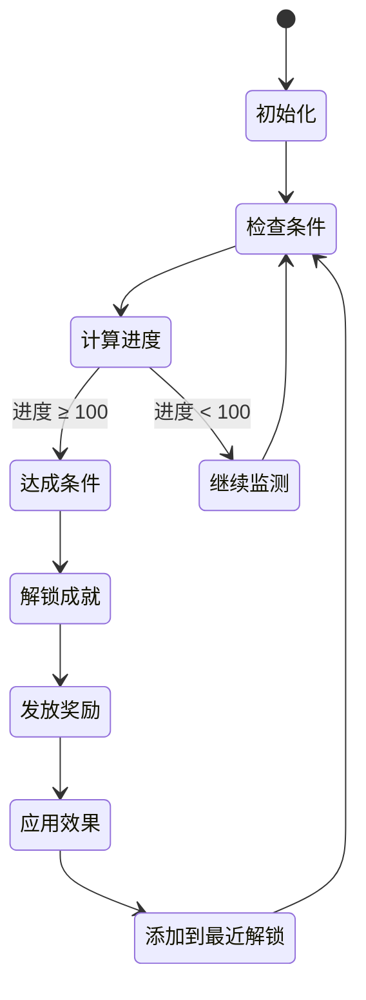
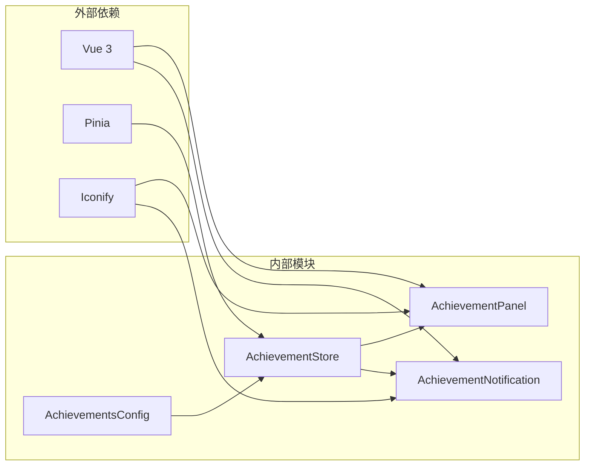

# 成就面板组件

<cite>
**本文档引用的文件**
- [AchievementPanel.vue](file://civilization-game/src/components/game/AchievementPanel.vue)
- [AchievementNotification.vue](file://civilization-game/src/components/game/AchievementNotification.vue)
- [achievement.ts](file://civilization-game/src/stores/achievement.ts)
- [achievements.ts](file://civilization-game/src/config/achievements.ts)
- [index.ts](file://civilization-game/src/types/index.ts)
</cite>

## 目录
1. [简介](#简介)
2. [项目结构](#项目结构)
3. [核心组件](#核心组件)
4. [架构概览](#架构概览)
5. [详细组件分析](#详细组件分析)
6. [依赖关系分析](#依赖关系分析)
7. [性能考虑](#性能考虑)
8. [故障排除指南](#故障排除指南)
9. [结论](#结论)

## 简介

成就面板组件是文明建设游戏中一个重要的用户界面元素，负责展示玩家在游戏中解锁的所有成就。该系统包含两个主要组件：`AchievementPanel`用于展示成就列表和进度，`AchievementNotification`用于在成就达成时弹出通知动画。

成就系统采用基于条件的动态检测机制，能够实时跟踪玩家的游戏进度，并在满足特定条件时自动解锁成就。系统支持多种类型的成就条件，包括时代进展、资源收集、建筑建造、科技研究等。

## 项目结构

成就面板组件位于游戏的组件目录中，与UI组件保持分离：



**图表来源**
- [AchievementPanel.vue](file://civilization-game/src/components/game/AchievementPanel.vue#L1-L10)
- [AchievementNotification.vue](file://civilization-game/src/components/game/AchievementNotification.vue#L1-L10)
- [achievement.ts](file://civilization-game/src/stores/achievement.ts#L1-L20)

**章节来源**
- [AchievementPanel.vue](file://civilization-game/src/components/game/AchievementPanel.vue#L1-L198)
- [AchievementNotification.vue](file://civilization-game/src/components/game/AchievementNotification.vue#L1-L204)

## 核心组件

### 成就面板 (AchievementPanel)

成就面板是一个响应式的Vue组件，负责展示所有成就的状态和进度。它提供了以下核心功能：

- **成就分类浏览**：支持按类别筛选成就（全部、进度、资源、建筑、科技、人口、特殊）
- **实时进度显示**：显示每个成就的完成百分比和具体数值
- **视觉反馈**：已解锁成就具有不同的视觉样式和动画效果
- **响应式设计**：适配不同屏幕尺寸的显示效果

### 成就通知 (AchievementNotification)

成就通知组件负责在成就达成时向玩家展示视觉和动画反馈：

- **自动通知**：当检测到新成就解锁时自动生成通知
- **动画效果**：包含滑入、发光和弹跳等动画效果
- **用户交互**：支持点击关闭和手动关闭功能
- **持续时间控制**：通知会在指定时间后自动消失

**章节来源**
- [AchievementPanel.vue](file://civilization-game/src/components/game/AchievementPanel.vue#L1-L50)
- [AchievementNotification.vue](file://civilization-game/src/components/game/AchievementNotification.vue#L1-L50)

## 架构概览

成就系统采用分层架构设计，确保组件间的松耦合和高内聚：



**图表来源**
- [achievement.ts](file://civilization-game/src/stores/achievement.ts#L60-L120)
- [AchievementNotification.vue](file://civilization-game/src/components/game/AchievementNotification.vue#L20-L40)

## 详细组件分析

### 成就面板组件分析

成就面板组件使用Vue 3的组合式API构建，实现了复杂的数据处理和UI渲染逻辑：



**图表来源**
- [AchievementPanel.vue](file://civilization-game/src/components/game/AchievementPanel.vue#L1-L30)
- [achievements.ts](file://civilization-game/src/config/achievements.ts#L1-L50)
- [index.ts](file://civilization-game/src/types/index.ts#L130-L150)

#### 成就分类系统

成就面板支持七种不同的分类方式：

1. **全部 (all)**：显示所有成就
2. **进度 (progress)**：时代进展相关成就
3. **资源 (resource)**：资源收集相关成就
4. **建筑 (building)**：建筑建造相关成就
5. **科技 (technology)**：科技研究相关成就
6. **人口 (population)**：人口增长相关成就
7. **特殊 (special)**：特殊挑战成就

#### 进度条显示机制

成就面板包含一个全局进度条，显示已解锁成就的总体进度：

```typescript
const progress = computed(() => achievementStore.achievementProgress)
```

进度条具有渐变色彩和平滑过渡效果，提供直观的视觉反馈。

**章节来源**
- [AchievementPanel.vue](file://civilization-game/src/components/game/AchievementPanel.vue#L1-L100)

### 成就通知组件分析

成就通知组件实现了复杂的动画系统和状态管理：



**图表来源**
- [AchievementNotification.vue](file://civilization-game/src/components/game/AchievementNotification.vue#L20-L45)

#### 通知动画系统

成就通知包含多个层次的动画效果：

1. **滑入动画**：通知卡片从右侧滑入页面
2. **发光效果**：成就图标和卡片边缘的动态发光
3. **弹跳动画**：成就图标的轻微弹跳效果
4. **缩放动画**：鼠标悬停时的卡片放大效果

#### 通知状态管理

通知组件使用响应式数组管理多个通知实例：

```typescript
interface Notification {
  id: string
  achievementId: string
  timestamp: number
}
```

每条通知都有唯一的标识符，防止重复显示相同成就的通知。

**章节来源**
- [AchievementNotification.vue](file://civilization-game/src/components/game/AchievementNotification.vue#L1-L100)

### 成就存储状态管理

成就存储是整个成就系统的核心，负责状态管理和业务逻辑：



**图表来源**
- [achievement.ts](file://civilization-game/src/stores/achievement.ts#L60-L120)

#### 成就条件检测机制

成就存储实现了多种条件类型的检测逻辑：

1. **时代条件**：根据当前时代等级计算进度
2. **资源条件**：基于资源收集量计算进度
3. **建筑条件**：统计建筑数量和等级
4. **科技条件**：跟踪已研究科技的数量
5. **人口条件**：监控人口增长进度
6. **时间条件**：测量游戏持续时间

#### 永久效果系统

成功解锁的成就可以应用永久的游戏效果：

- **资源倍率提升**：增加特定资源的产出倍率
- **研究速度加成**：提高科技研究效率
- **建造速度加成**：加快建筑建造速度

**章节来源**
- [achievement.ts](file://civilization-game/src/stores/achievement.ts#L60-L200)

## 依赖关系分析

成就系统的组件间依赖关系清晰且层次分明：



**图表来源**
- [AchievementPanel.vue](file://civilization-game/src/components/game/AchievementPanel.vue#L1-L10)
- [AchievementNotification.vue](file://civilization-game/src/components/game/AchievementNotification.vue#L1-L10)
- [achievement.ts](file://civilization-game/src/stores/achievement.ts#L1-L10)

### 组件耦合分析

- **低耦合设计**：面板和通知组件通过共享的成就存储进行通信
- **单向数据流**：通知组件监听存储的变化，不直接修改存储状态
- **类型安全**：使用TypeScript确保组件间的数据传递正确性

**章节来源**
- [achievement.ts](file://civilization-game/src/stores/achievement.ts#L1-L50)

## 性能考虑

### 成就面板性能优化

成就面板采用了多项性能优化策略：

1. **虚拟滚动**：虽然当前实现为完整渲染，但架构支持未来添加虚拟滚动
2. **计算属性缓存**：使用Vue的计算属性缓存过滤和排序结果
3. **条件渲染**：只渲染可见的成就卡片，减少DOM节点数量
4. **CSS动画优化**：使用transform和opacity属性进行硬件加速

### 通知系统性能

成就通知系统针对性能进行了专门优化：

1. **有限队列**：最多只显示5个通知，避免内存泄漏
2. **定时器管理**：使用setTimeout自动清理过期通知
3. **事件委托**：使用@click.stop阻止事件冒泡，提高响应性能
4. **CSS动画**：利用GPU加速的CSS变换实现流畅动画

## 故障排除指南

### 常见问题及解决方案

#### 成就无法解锁

**症状**：成就条件已满足但未解锁
**可能原因**：
- 成就检查函数未被调用
- 条件检测逻辑错误
- 存储状态同步问题

**解决方法**：
1. 检查游戏循环中是否调用了`checkAchievements()`方法
2. 验证成就配置中的条件值是否正确
3. 查看浏览器控制台是否有错误日志

#### 通知不显示

**症状**：成就解锁但没有通知出现
**可能原因**：
- 通知组件未正确挂载
- $subscribe监听器失效
- CSS样式冲突

**解决方法**：
1. 确认通知组件在应用根组件中正确引入
2. 检查成就存储的$subscribe方法是否正常工作
3. 验证CSS类名和样式规则

#### 性能问题

**症状**：大量成就导致界面卡顿
**可能原因**：
- DOM节点过多
- 复杂的CSS选择器
- 频繁的重新渲染

**解决方法**：
1. 实现虚拟滚动或分页加载
2. 优化CSS选择器性能
3. 使用Vue的v-once指令缓存静态内容

**章节来源**
- [achievement.ts](file://civilization-game/src/stores/achievement.ts#L200-L278)

## 结论

成就面板组件系统展现了现代前端开发的最佳实践，通过清晰的架构设计、高效的性能优化和优雅的用户体验，为玩家提供了丰富的成就体验。

### 主要优势

1. **模块化设计**：组件职责明确，易于维护和扩展
2. **响应式架构**：基于Vue 3的响应式系统，确保数据一致性
3. **性能优化**：采用多种技术手段保证良好的用户体验
4. **类型安全**：完整的TypeScript类型定义，减少运行时错误

### 扩展建议

1. **虚拟滚动**：为大量成就提供更好的渲染性能
2. **成就搜索**：添加搜索功能帮助玩家快速定位目标
3. **成就分享**：集成社交媒体分享功能
4. **移动端优化**：进一步优化移动设备上的显示效果

该成就系统为文明建设游戏提供了坚实的基础，支持未来的功能扩展和性能优化需求。