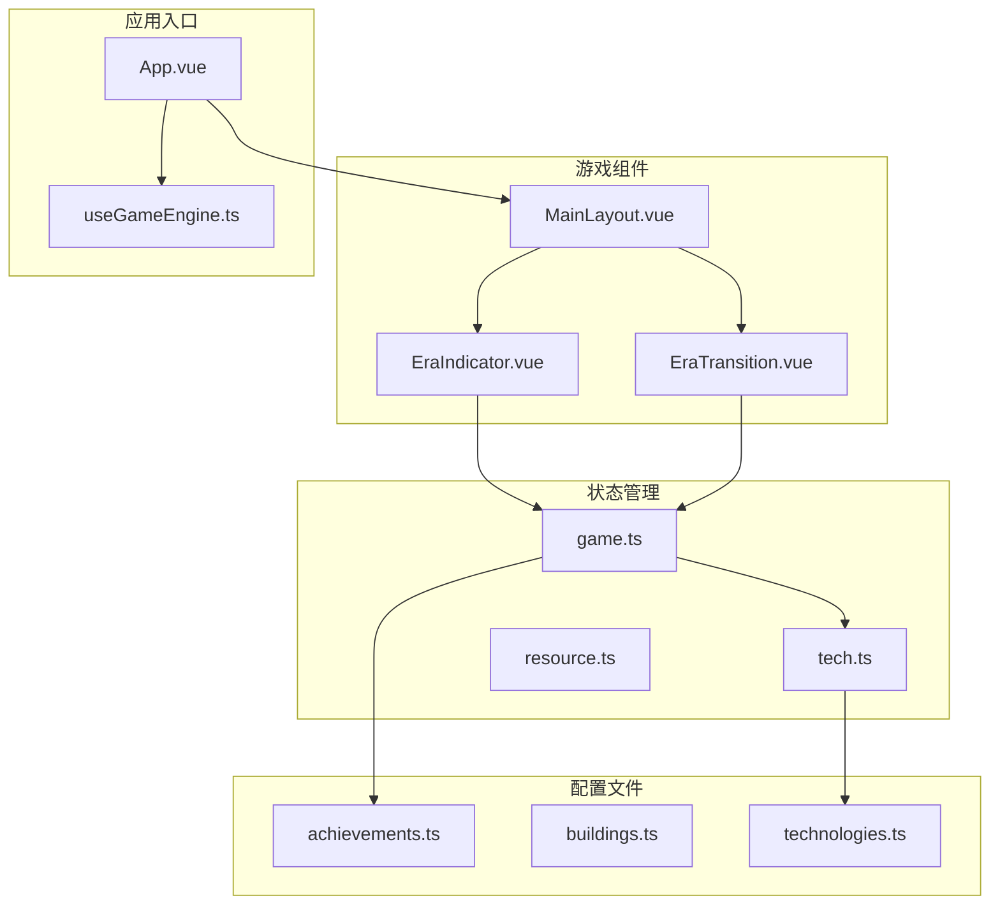
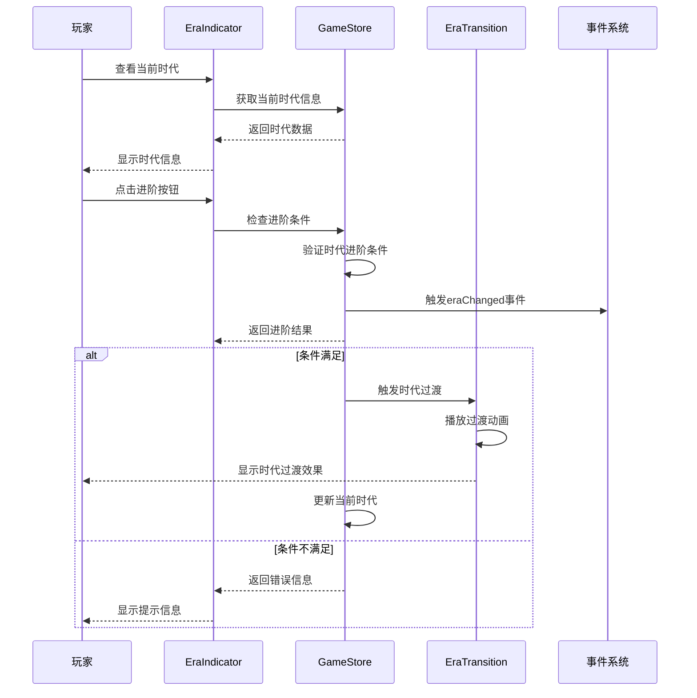
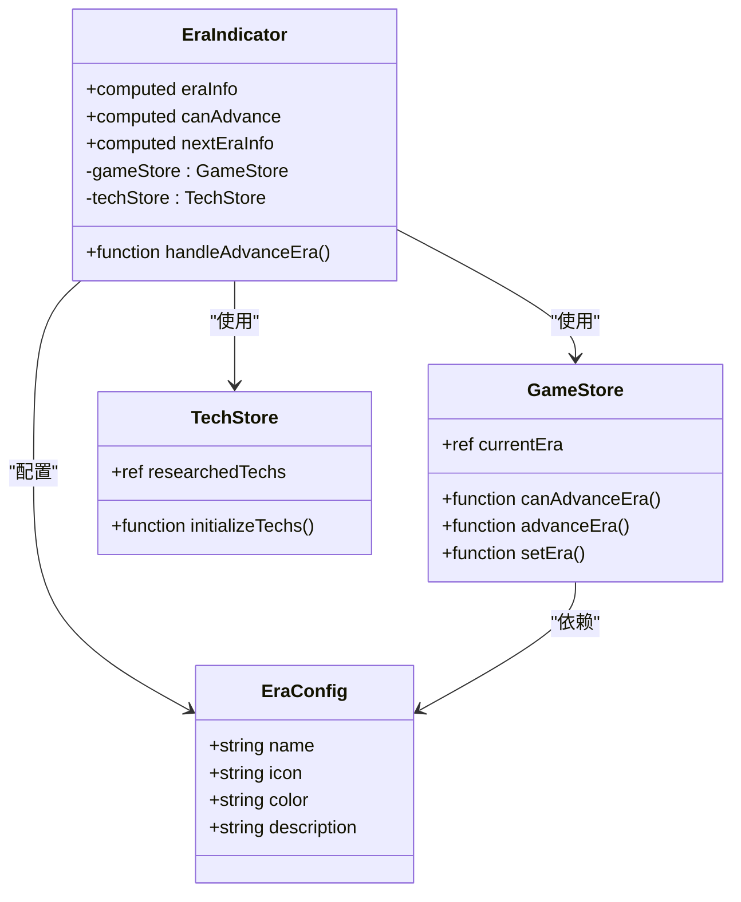
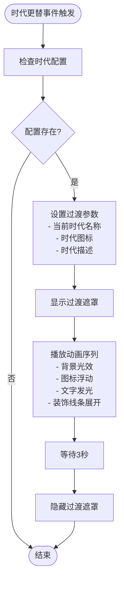
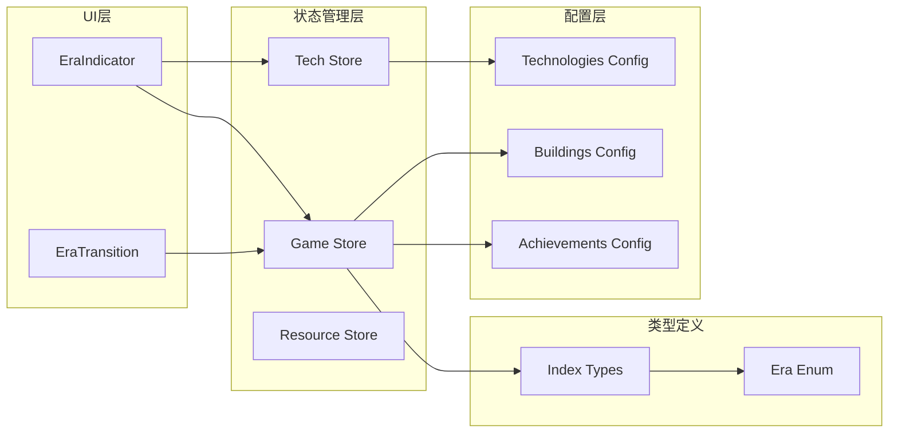

# 时代指示器组件

<cite>
**本文档引用的文件**
- [EraIndicator.vue](file://civilization-game/src/components/game/EraIndicator.vue)
- [EraTransition.vue](file://civilization-game/src/components/game/EraTransition.vue)
- [game.ts](file://civilization-game/src/stores/game.ts)
- [tech.ts](file://civilization-game/src/stores/tech.ts)
- [index.ts](file://civilization-game/src/types/index.ts)
- [achievements.ts](file://civilization-game/src/config/achievements.ts)
- [buildings.ts](file://civilization-game/src/config/buildings.ts)
- [technologies.ts](file://civilization-game/src/config/technologies.ts)
- [App.vue](file://civilization-game/src/App.vue)
</cite>

## 目录
1. [简介](#简介)
2. [项目结构](#项目结构)
3. [核心组件](#核心组件)
4. [架构概览](#架构概览)
5. [详细组件分析](#详细组件分析)
6. [依赖关系分析](#依赖关系分析)
7. [性能考虑](#性能考虑)
8. [故障排除指南](#故障排除指南)
9. [结论](#结论)

## 简介

EraIndicator和EraTransition是《文明游戏》中的两个核心UI组件，负责管理游戏中的时代系统。EraIndicator组件从game store中读取当前文明所处的时代，并以视觉化方式展示时代名称、图标和描述信息。EraTransition组件则在时代更替时提供动画过渡效果，增强玩家的游戏体验。

这两个组件紧密协作，共同构成了游戏时代系统的用户界面层。当玩家满足特定条件时，系统会触发时代更替事件，EraTransition组件负责播放过渡动画，而EraIndicator组件则更新显示新的时代信息。

## 项目结构



**图表来源**
- [App.vue](file://civilization-game/src/App.vue#L1-L50)
- [MainLayout.vue](file://civilization-game/src/components/game/MainLayout.vue)
- [game.ts](file://civilization-game/src/stores/game.ts#L1-L50)

## 核心组件

### EraIndicator组件

EraIndicator是一个响应式的Vue组件，负责显示当前时代的信息和提供时代进阶功能。它集成了Iconify图标库，使用多种视觉元素来增强用户体验。

主要功能包括：
- 显示当前时代名称、图标和描述
- 展示时代进阶所需的科技数量和人口统计
- 提供时代进阶按钮，允许玩家手动推进时代
- 使用动态颜色系统反映不同时代的特点

### EraTransition组件

EraTransition是一个全屏过渡动画组件，当游戏检测到时代更替时自动激活。它提供了视觉上震撼的过渡效果，增强游戏的沉浸感。

主要功能包括：
- 全屏淡入淡出效果
- 时代徽章的浮动动画
- 背景光效和装饰线条
- 自动定时关闭机制
- 响应式设计支持

**章节来源**
- [EraIndicator.vue](file://civilization-game/src/components/game/EraIndicator.vue#L1-L175)
- [EraTransition.vue](file://civilization-game/src/components/game/EraTransition.vue#L1-L251)

## 架构概览



**图表来源**
- [game.ts](file://civilization-game/src/stores/game.ts#L95-L153)
- [EraIndicator.vue](file://civilization-game/src/components/game/EraIndicator.vue#L130-L140)
- [EraTransition.vue](file://civilization-game/src/components/game/EraTransition.vue#L50-L70)

## 详细组件分析

### EraIndicator组件详细分析

#### 组件结构和数据流



**图表来源**
- [EraIndicator.vue](file://civilization-game/src/components/game/EraIndicator.vue#L1-L30)
- [game.ts](file://civilization-game/src/stores/game.ts#L1-L30)

#### 时代配置系统

EraIndicator组件维护了一个完整的时代配置系统，每个时代都有独特的视觉标识：

```typescript
const eraInfo = computed(() => {
  const info: Record<Era, { name: string; icon: string; color: string; description: string }> = {
    [Era.STONE]: {
      name: '石器时代',
      icon: 'game-icons:stone-axe',
      color: 'bg-gray-600',
      description: '使用石制工具的原始时代'
    },
    // ... 其他时代配置
  }
  return info[gameStore.currentEra]
})
```

#### 时代进阶逻辑

组件实现了智能的进阶判断逻辑，确保只有在满足必要条件时才允许时代推进：

```typescript
const canAdvance = computed(() => {
  const result = gameStore.canAdvanceEra()
  return result.can
})

const nextEraInfo = computed(() => {
  const result = gameStore.canAdvanceEra()
  if (!result.can || !result.nextEra) return null
  
  // 返回下一个时代的配置信息
  return info[result.nextEra]
})
```

**章节来源**
- [EraIndicator.vue](file://civilization-game/src/components/game/EraIndicator.vue#L10-L50)
- [EraIndicator.vue](file://civilization-game/src/components/game/EraIndicator.vue#L52-L70)

### EraTransition组件详细分析

#### 动画系统架构



**图表来源**
- [EraTransition.vue](file://civilization-game/src/components/game/EraTransition.vue#L50-L70)

#### CSS动画实现

EraTransition组件使用了复杂的CSS动画系统，包含多个层次的动画效果：

```css
/* 主要动画序列 */
.era-transition-enter-active,
.era-transition-leave-active {
  transition: opacity 0.5s ease;
}

.era-transition-enter-from,
.era-transition-leave-to {
  opacity: 0;
}

/* 缩放淡入动画 */
@keyframes fadeInScale {
  from {
    opacity: 0;
    transform: scale(0.8);
  }
  to {
    opacity: 1;
    transform: scale(1);
  }
}

/* 图标浮动动画 */
@keyframes iconFloat {
  0%, 100% {
    transform: translateY(0);
  }
  50% {
    transform: translateY(-20px);
  }
}
```

#### 事件驱动机制

组件通过事件监听器响应时代变化：

```typescript
// 监听时代变化事件
gameStore.addEventListener('eraChanged', (data: { oldEra: string; newEra: string }) => {
  const config = eraConfig[data.newEra as keyof typeof eraConfig]
  if (config) {
    currentEraName.value = config.name
    eraIcon.value = config.icon
    eraDescription.value = config.description
    show.value = true
    
    // 3秒后自动关闭
    setTimeout(() => {
      show.value = false
    }, 3000)
  }
})
```

**章节来源**
- [EraTransition.vue](file://civilization-game/src/components/game/EraTransition.vue#L15-L50)
- [EraTransition.vue](file://civilization-game/src/components/game/EraTransition.vue#L150-L200)

### 时代系统集成

#### 时代进阶条件

游戏定义了严格的进阶条件来控制时代转换：

```typescript
function canAdvanceEra(): { can: boolean; nextEra?: Era; reason?: string } {
  const eraOrder = [
    Era.STONE, Era.BRONZE, Era.IRON, Era.INDUSTRIAL,
    Era.INFORMATION, Era.SPACE, Era.INTERSTELLAR, Era.HYPERDIMENSIONAL
  ]
  
  const currentIndex = eraOrder.indexOf(currentEra.value)
  if (currentIndex === -1) {
    return { can: false, reason: '当前时代无效' }
  }
  
  if (currentIndex >= eraOrder.length - 1) {
    return { can: false, reason: '已达到最高时代' }
  }
  
  const nextEra = eraOrder[currentIndex + 1]
  
  // 时代进阶条件:
  // 1. 需要研究对应时代的关键科技
  // 2. 需要达到一定人口数量
  // 3. 需要建造特定建筑
  
  return { can: true, nextEra }
}
```

#### 时代变化事件通知

当时代发生变化时，系统会触发相应的事件通知：

```typescript
function setEra(era: Era) {
  const oldEra = currentEra.value
  currentEra.value = era
  
  // 触发时代变化事件
  emitEvent('eraChanged', { oldEra, newEra: era })
  
  console.log(`✨ 进入新时代: ${era}`)
}
```

**章节来源**
- [game.ts](file://civilization-game/src/stores/game.ts#L95-L153)
- [game.ts](file://civilization-game/src/stores/game.ts#L60-L70)

## 依赖关系分析



**图表来源**
- [EraIndicator.vue](file://civilization-game/src/components/game/EraIndicator.vue#L1-L10)
- [EraTransition.vue](file://civilization-game/src/components/game/EraTransition.vue#L1-L10)
- [game.ts](file://civilization-game/src/stores/game.ts#L1-L10)

**章节来源**
- [EraIndicator.vue](file://civilization-game/src/components/game/EraIndicator.vue#L1-L10)
- [EraTransition.vue](file://civilization-game/src/components/game/EraTransition.vue#L1-L10)
- [game.ts](file://civilization-game/src/stores/game.ts#L1-L10)

## 性能考虑

### 组件性能优化

1. **计算属性缓存**: EraIndicator使用Vue的computed属性来缓存昂贵的计算操作，避免重复计算时代信息。

2. **条件渲染**: EraTransition只在需要时显示，通过v-if指令控制DOM元素的创建和销毁。

3. **事件监听器管理**: 组件正确处理事件监听器的生命周期，防止内存泄漏。

4. **CSS动画优化**: 使用transform和opacity属性进行动画，这些属性具有硬件加速特性。

### 内存管理

- 组件在卸载时自动清理事件监听器
- 使用ref而不是reactive来存储简单的状态值
- 合理使用Teleport组件避免DOM层级过深

## 故障排除指南

### 常见问题及解决方案

#### 时代无法进阶

**症状**: EraIndicator中的进阶按钮不可用或灰色显示

**可能原因**:
1. 当前时代已经是最高级别
2. 科技研究未完成
3. 人口数量不足
4. 必需建筑未建造

**解决方案**:
1. 检查gameStore.canAdvanceEra()返回的结果
2. 验证相关科技的研究状态
3. 确认人口统计数据
4. 检查必需建筑的建造情况

#### 过渡动画不显示

**症状**: 时代更替时没有出现EraTransition动画

**可能原因**:
1. 事件监听器未正确注册
2. 时代配置缺失
3. Teleport目标不存在

**解决方案**:
1. 检查console日志确认事件触发
2. 验证eraConfig对象中是否存在对应时代配置
3. 确认HTML中存在body元素作为Teleport目标

#### 样式问题

**症状**: 组件样式异常或动画效果不正常

**可能原因**:
1. Tailwind CSS类名冲突
2. CSS变量未正确定义
3. 动画关键帧定义错误

**解决方案**:
1. 检查浏览器开发者工具中的样式覆盖
2. 验证CSS变量的定义和作用域
3. 确认@keyframes规则的语法正确性

**章节来源**
- [game.ts](file://civilization-game/src/stores/game.ts#L95-L153)
- [EraTransition.vue](file://civilization-game/src/components/game/EraTransition.vue#L50-L70)

## 结论

EraIndicator和EraTransition组件构成了《文明游戏》时代系统的核心UI层。它们通过精心设计的架构和动画效果，为玩家提供了直观且富有沉浸感的时代体验。

### 主要优势

1. **模块化设计**: 组件职责清晰，易于维护和扩展
2. **响应式交互**: 实时反映游戏状态变化
3. **视觉吸引力**: 丰富的动画效果提升用户体验
4. **可扩展性**: 支持未来添加新的时代和功能

### 技术亮点

1. **事件驱动架构**: 通过事件系统实现松耦合的组件通信
2. **状态管理集成**: 与Pinia store无缝集成，确保数据一致性
3. **CSS动画系统**: 使用原生CSS实现高性能动画效果
4. **TypeScript类型安全**: 完整的类型定义确保开发时的类型检查

### 未来改进方向

1. **自定义主题支持**: 允许玩家自定义时代颜色方案
2. **多语言国际化**: 支持不同语言的文字显示
3. **无障碍访问**: 增强屏幕阅读器支持
4. **性能监控**: 添加性能指标收集和分析

这两个组件的成功实现展示了现代前端框架在复杂游戏UI开发中的强大能力，为其他类似项目提供了宝贵的参考价值。