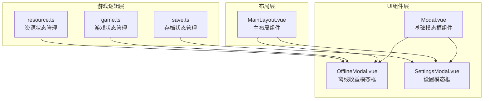
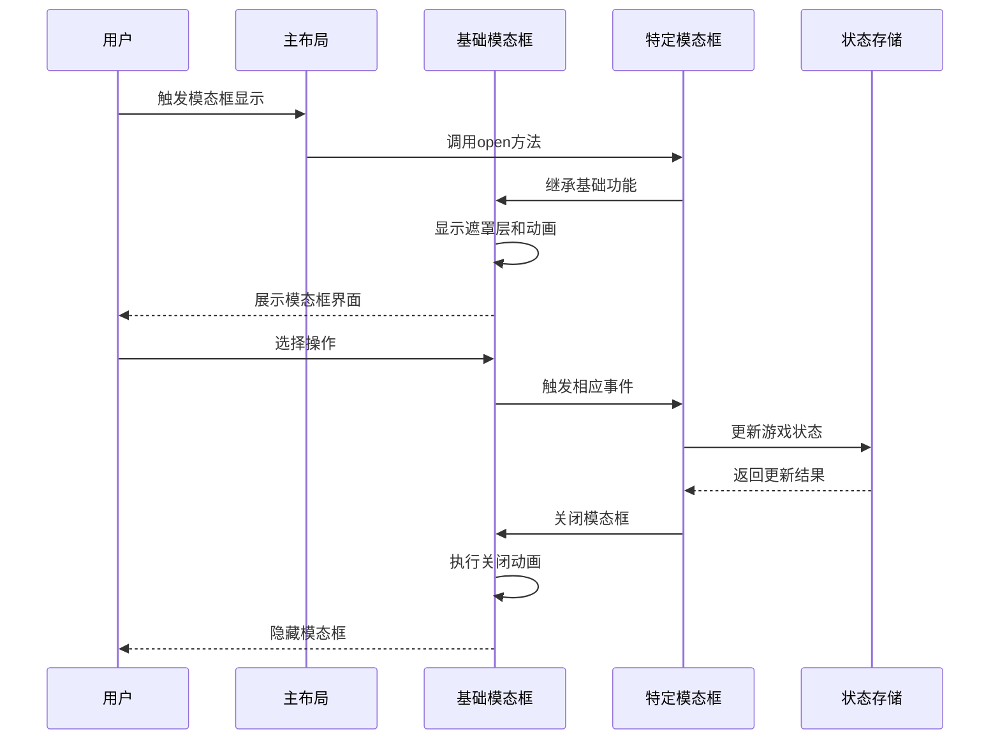
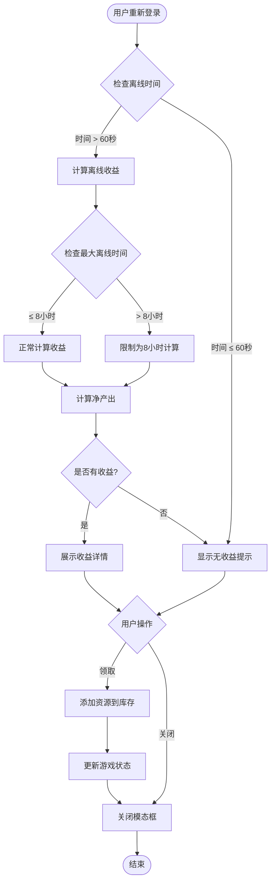
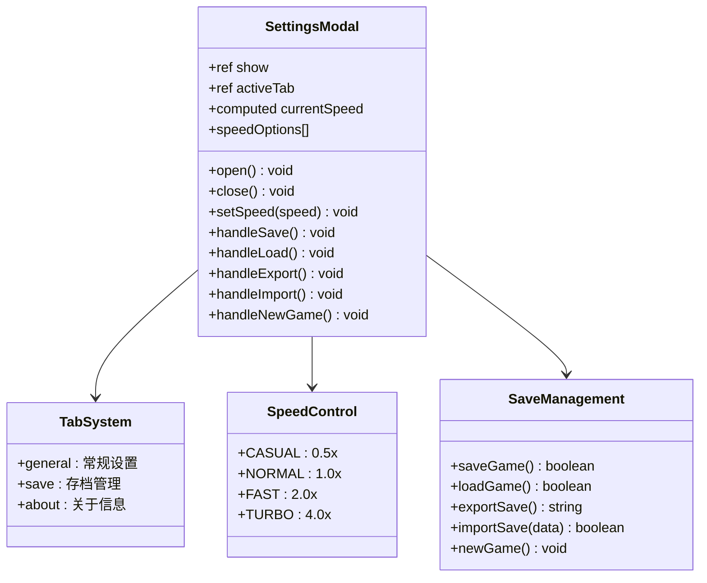
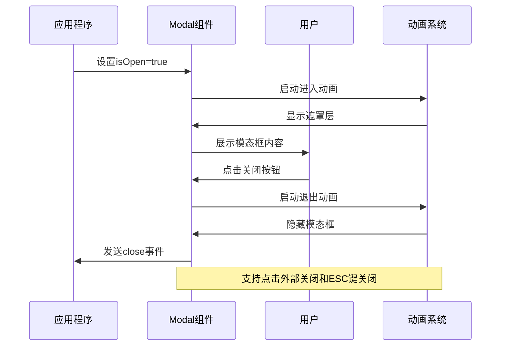
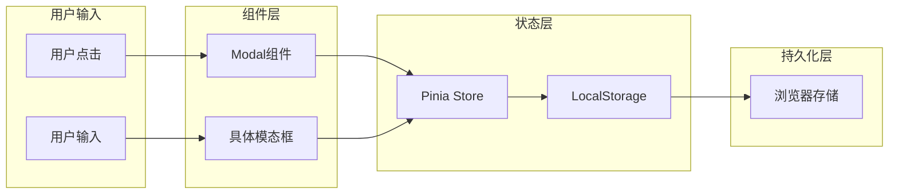

# 模态窗口组件

<cite>
**本文档引用的文件**
- [Modal.vue](file://civilization-game/src/components/ui/Modal.vue)
- [OfflineModal.vue](file://civilization-game/src/components/game/OfflineModal.vue)
- [SettingsModal.vue](file://civilization-game/src/components/game/SettingsModal.vue)
- [MainLayout.vue](file://civilization-game/src/components/game/MainLayout.vue)
- [game.ts](file://civilization-game/src/stores/game.ts)
- [resource.ts](file://civilization-game/src/stores/resource.ts)
- [save.ts](file://civilization-game/src/stores/save.ts)
- [constants.ts](file://civilization-game/src/config/constants.ts)
</cite>

## 目录
1. [简介](#简介)
2. [项目结构](#项目结构)
3. [核心组件](#核心组件)
4. [架构概览](#架构概览)
5. [详细组件分析](#详细组件分析)
6. [依赖关系分析](#依赖关系分析)
7. [性能考虑](#性能考虑)
8. [故障排除指南](#故障排除指南)
9. [结论](#结论)

## 简介

本文档详细介绍了Civilization游戏中的两个重要模态窗口组件：OfflineModal（离线收益模态框）和SettingsModal（设置模态框）。这两个组件是游戏UI层的核心组成部分，负责处理用户交互、状态管理和数据持久化。

OfflineModal组件专门处理玩家离线期间的资源收益计算和展示，而SettingsModal则提供了游戏的各种配置选项界面。它们都基于统一的Modal基础组件构建，确保了一致的用户体验和交互模式。

## 项目结构

模态窗口组件在项目中的组织结构如下：



**图表来源**
- [Modal.vue](file://civilization-game/src/components/ui/Modal.vue#L1-L144)
- [OfflineModal.vue](file://civilization-game/src/components/game/OfflineModal.vue#L1-L211)
- [SettingsModal.vue](file://civilization-game/src/components/game/SettingsModal.vue#L1-L339)
- [MainLayout.vue](file://civilization-game/src/components/game/MainLayout.vue#L1-L275)

## 核心组件

### Modal基础组件

Modal组件是所有模态框的基础，提供了统一的遮罩层、动画效果和通用交互功能：

- **遮罩层**：使用backdrop-blur实现模糊背景效果
- **动画系统**：基于Vue Transition组件的淡入淡出动画
- **响应式设计**：支持多种尺寸（sm、md、lg、xl、full）
- **键盘交互**：支持ESC键关闭模态框
- **点击外部关闭**：可配置的点击遮罩层关闭功能

### OfflineModal组件

OfflineModal专门处理玩家离线期间的资源收益计算和展示：

- **离线时间计算**：自动计算玩家离线时长
- **收益计算引擎**：根据生产率和消耗率计算净产出
- **收益展示**：以网格形式展示各种资源的离线收益
- **领取机制**：一键领取所有离线收益并更新游戏状态

### SettingsModal组件

SettingsModal提供游戏的各种配置选项界面：

- **游戏速度设置**：支持休闲、标准、快速、极速四种模式
- **存档管理**：保存、加载、导出、导入、新游戏功能
- **标签页导航**：分为常规、存档、关于三个标签页
- **实时信息显示**：显示当前游戏时间、时代、人口等信息

**章节来源**
- [Modal.vue](file://civilization-game/src/components/ui/Modal.vue#L1-L144)
- [OfflineModal.vue](file://civilization-game/src/components/game/OfflineModal.vue#L1-L211)
- [SettingsModal.vue](file://civilization-game/src/components/game/SettingsModal.vue#L1-L339)

## 架构概览

模态窗口组件采用分层架构设计，确保了代码的可维护性和可扩展性：



**图表来源**
- [MainLayout.vue](file://civilization-game/src/components/game/MainLayout.vue#L250-L275)
- [Modal.vue](file://civilization-game/src/components/ui/Modal.vue#L1-L144)
- [OfflineModal.vue](file://civilization-game/src/components/game/OfflineModal.vue#L1-L211)

## 详细组件分析

### OfflineModal详细分析

OfflineModal组件实现了复杂的离线收益计算逻辑：



**图表来源**
- [OfflineModal.vue](file://civilization-game/src/components/game/OfflineModal.vue#L15-L45)
- [game.ts](file://civilization-game/src/stores/game.ts#L240-L250)

#### 离线收益计算算法

OfflineModal使用以下算法计算离线收益：

1. **时间限制**：最多计算8小时的离线收益，防止作弊
2. **净产出计算**：`netRate = productionRate - consumptionRate`
3. **收益公式**：`amount = netRate × actualTime`
4. **过滤逻辑**：只计算净产出大于0的资源类型

#### 收益展示组件

收益展示采用网格布局，每个资源项包含：
- 资源图标
- 资源名称
- 收益数量（保留一位小数）

**章节来源**
- [OfflineModal.vue](file://civilization-game/src/components/game/OfflineModal.vue#L15-L85)
- [resource.ts](file://civilization-game/src/stores/resource.ts#L15-L50)

### SettingsModal详细分析

SettingsModal组件提供了丰富的配置选项：



**图表来源**
- [SettingsModal.vue](file://civilization-game/src/components/game/SettingsModal.vue#L1-L50)
- [constants.ts](file://civilization-game/src/config/constants.ts#L50-L60)

#### 标签页系统

SettingsModal采用标签页设计，分为三个主要区域：

1. **常规设置**：游戏速度、当前游戏信息
2. **存档管理**：保存、加载、导出、导入、新游戏
3. **关于信息**：版本号、技术栈、游戏介绍

#### 存档管理系统

存档管理功能包括：
- **自动保存**：每30秒自动保存一次游戏进度
- **手动保存**：用户随时可以手动保存游戏
- **存档压缩**：使用JSON压缩减少存储空间
- **版本兼容**：支持不同版本间的存档迁移

**章节来源**
- [SettingsModal.vue](file://civilization-game/src/components/game/SettingsModal.vue#L1-L339)
- [save.ts](file://civilization-game/src/stores/save.ts#L80-L120)

### Modal基础组件分析

Modal组件作为所有模态框的基础，提供了统一的交互体验：



**图表来源**
- [Modal.vue](file://civilization-game/src/components/ui/Modal.vue#L1-L50)

#### 动画系统

Modal组件使用Vue Transition组件实现平滑的动画效果：

- **进入动画**：淡入 + 缩放效果（scale 0.9 → 1.0）
- **退出动画**：淡出 + 缩放效果（scale 1.0 → 0.9）
- **持续时间**：进入300ms，退出200ms
- **缓动函数**：ease-out 和 ease-in

#### 通用交互功能

- **遮罩层点击关闭**：可配置的点击遮罩层关闭功能
- **ESC键关闭**：监听键盘ESC键事件
- **焦点管理**：确保模态框内的元素可以正确接收焦点
- **响应式设计**：适配不同屏幕尺寸

**章节来源**
- [Modal.vue](file://civilization-game/src/components/ui/Modal.vue#L1-L144)

## 依赖关系分析

模态窗口组件的依赖关系展现了清晰的分层架构：

```mermaid
graph LR
subgraph "外部依赖"
Vue[Vue 3]
HeadlessUI[@headlessui/vue]
Iconify[@iconify/vue]
end
subgraph "UI层"
Modal[Modal.vue]
GameButton[GameButton.vue]
GameCard[GameCard.vue]
end
subgraph "业务层"
OfflineModal[OfflineModal.vue]
SettingsModal[SettingsModal.vue]
end
subgraph "状态管理层"
GameStore[game.ts]
ResourceStore[resource.ts]
SaveStore[save.ts]
end
subgraph "配置层"
Constants[constants.ts]
Resources[resources.ts]
end
Vue --> Modal
HeadlessUI --> Modal
Iconify --> Modal
Iconify --> OfflineModal
Iconify --> SettingsModal
Modal --> GameButton
Modal --> GameCard
GameStore --> OfflineModal
ResourceStore --> OfflineModal
SaveStore --> SettingsModal
Constants --> GameStore
Constants --> SaveStore
Resources --> ResourceStore
```

**图表来源**
- [Modal.vue](file://civilization-game/src/components/ui/Modal.vue#L1-L10)
- [OfflineModal.vue](file://civilization-game/src/components/game/OfflineModal.vue#L1-L10)
- [SettingsModal.vue](file://civilization-game/src/components/game/SettingsModal.vue#L1-L10)

### 组件间通信

模态窗口组件通过以下方式实现组件间通信：

1. **Props传递**：父组件通过props向子组件传递数据
2. **事件发射**：子组件通过emit向父组件发送事件
3. **Pinia状态管理**：共享全局状态
4. **Teleport传送门**：将模态框渲染到body节点

### 数据流分析



**图表来源**
- [game.ts](file://civilization-game/src/stores/game.ts#L240-L260)
- [save.ts](file://civilization-game/src/stores/save.ts#L80-L120)

**章节来源**
- [game.ts](file://civilization-game/src/stores/game.ts#L1-L268)
- [resource.ts](file://civilization-game/src/stores/resource.ts#L1-L202)
- [save.ts](file://civilization-game/src/stores/save.ts#L1-L280)

## 性能考虑

模态窗口组件在设计时充分考虑了性能优化：

### 渲染优化

1. **条件渲染**：只有当模态框显示时才渲染内容
2. **Teleport优化**：使用Teleport避免DOM层级过深
3. **懒加载**：模态框内容按需加载

### 内存管理

1. **事件清理**：模态框关闭时自动清理事件监听器
2. **状态重置**：关闭模态框时重置内部状态
3. **垃圾回收**：及时释放不需要的对象引用

### 动画性能

1. **GPU加速**：使用CSS transform和opacity实现硬件加速
2. **动画队列**：避免同时执行多个动画
3. **帧率优化**：使用requestAnimationFrame优化动画

## 故障排除指南

### 常见问题及解决方案

#### 离线收益计算异常

**问题症状**：离线收益显示为0或计算错误

**可能原因**：
1. 生产率或消耗率为0
2. 离线时间计算错误
3. 资源存储上限设置问题

**解决方案**：
```typescript
// 检查生产率和消耗率
console.log('生产率:', productionRates)
console.log('消耗率:', consumptionRates)

// 检查离线时间
console.log('离线时间:', offlineTime)

// 检查资源存储上限
console.log('存储上限:', resourceLimits)
```

#### 设置模态框无法打开

**问题症状**：点击设置按钮后模态框不显示

**可能原因**：
1. 引用对象未正确初始化
2. Teleport目标不存在
3. Z-index层级冲突

**解决方案**：
```typescript
// 检查引用对象
console.log('SettingsModal引用:', settingsModal.value)

// 检查Teleport目标
console.log('Body元素:', document.body)

// 检查Z-index
console.log('当前Z-index:', getComputedStyle(modalElement).zIndex)
```

#### 存档加载失败

**问题症状**：存档加载后游戏状态异常

**可能原因**：
1. 存档版本不兼容
2. 数据格式错误
3. 状态同步问题

**解决方案**：
```typescript
// 检查存档版本
console.log('存档版本:', saveData.version)
console.log('当前版本:', GAME_VERSION)

// 验证数据完整性
console.log('游戏状态:', saveData.gameState)
console.log('资源数据:', saveData.resources)
```

**章节来源**
- [OfflineModal.vue](file://civilization-game/src/components/game/OfflineModal.vue#L15-L45)
- [SettingsModal.vue](file://civilization-game/src/components/game/SettingsModal.vue#L1-L50)
- [save.ts](file://civilization-game/src/stores/save.ts#L100-L150)

## 结论

OfflineModal和SettingsModal组件展现了现代前端应用中模态窗口的最佳实践。它们不仅提供了优秀的用户体验，还展示了良好的代码架构和可维护性。

### 主要特点总结

1. **统一的设计语言**：基于相同的Modal基础组件，确保一致的用户体验
2. **模块化的架构**：清晰的职责分离和组件化设计
3. **强大的状态管理**：通过Pinia实现复杂的状态同步
4. **完善的错误处理**：全面的边界情况处理和用户反馈
5. **性能优化**：合理的渲染策略和内存管理

### 扩展建议

未来的扩展可以考虑：

1. **更多模态框类型**：如成就解锁、任务完成等
2. **自定义主题**：支持用户自定义模态框外观
3. **无障碍支持**：增强键盘导航和屏幕阅读器支持
4. **国际化**：支持多语言界面
5. **动画定制**：允许用户自定义动画效果

这些模态窗口组件为整个游戏的UI系统奠定了坚实的基础，展示了如何在保持代码质量的同时实现复杂的功能需求。