# 游戏业务组件

<cite>
**本文档引用的文件**
- [ResourcePanel.vue](file://civilization-game/src/components/game/ResourcePanel.vue)
- [BuildingPanel.vue](file://civilization-game/src/components/game/BuildingPanel.vue)
- [TechTree.vue](file://civilization-game/src/components/game/TechTree.vue)
- [AchievementPanel.vue](file://civilization-game/src/components/game/AchievementPanel.vue)
- [EraIndicator.vue](file://civilization-game/src/components/game/EraIndicator.vue)
- [OfflineModal.vue](file://civilization-game/src/components/game/OfflineModal.vue)
- [SettingsModal.vue](file://civilization-game/src/components/game/SettingsModal.vue)
- [MainLayout.vue](file://civilization-game/src/components/game/MainLayout.vue)
- [resources.ts](file://civilization-game/src/config/resources.ts)
- [buildings.ts](file://civilization-game/src/config/buildings.ts)
- [technologies.ts](file://civilization-game/src/config/technologies.ts)
- [resource.ts](file://civilization-game/src/stores/resource.ts)
- [index.ts](file://civilization-game/src/types/index.ts)
</cite>

## 目录
1. [简介](#简介)
2. [项目结构](#项目结构)
3. [核心组件概述](#核心组件概述)
4. [ResourcePanel资源面板](#resourcepanel资源面板)
5. [BuildingPanel建筑面板](#buildingpanel建筑面板)
6. [TechTree科技树组件](#techtreetech树组件)
7. [AchievementPanel成就面板](#achievementpanel成就面板)
8. [EraIndicator时代指示器](#eraindicatorera指示器)
9. [弹窗组件](#弹窗组件)
10. [组件间通信机制](#组件间通信机制)
11. [架构设计](#架构设计)
12. [性能考虑](#性能考虑)
13. [故障排除指南](#故障排除指南)
14. [总结](#总结)

## 简介

本文档详细介绍了基于Vue 3 + TypeScript的文明发展模拟游戏中的核心业务组件。这些组件构成了游戏的核心UI界面，负责展示资源状态、建筑列表、科技树、成就系统以及时代转换等功能。每个组件都采用响应式设计，支持移动端和桌面端，并通过Pinia状态管理实现组件间的数据共享和通信。

## 项目结构

游戏业务组件位于`src/components/game/`目录下，包含以下核心组件：


**图表来源**
- [MainLayout.vue](file://civilization-game/src/components/game/MainLayout.vue#L1-L50)
- [ResourcePanel.vue](file://civilization-game/src/components/game/ResourcePanel.vue#L1-L20)
- [BuildingPanel.vue](file://civilization-game/src/components/game/BuildingPanel.vue#L1-L20)

## 核心组件概述

游戏业务组件采用模块化设计，每个组件都有明确的职责和清晰的接口：

- **ResourcePanel**: 展示所有资源及其生产/消耗速率
- **BuildingPanel**: 列出可建造建筑并处理建造逻辑
- **TechTree**: 可视化科技树和研究状态
- **AchievementPanel**: 显示已解锁和未解锁的成就
- **EraIndicator**: 显示当前时代并提供时代推进功能
- **OfflineModal**: 处理离线收益结算
- **SettingsModal**: 提供游戏设置和存档管理

## ResourcePanel资源面板

ResourcePanel是游戏的核心UI组件之一，负责实时展示玩家拥有的各种资源及其相关状态。

### 组件功能特性


**图表来源**
- [ResourcePanel.vue](file://civilization-game/src/components/game/ResourcePanel.vue#L15-L45)
- [resource.ts](file://civilization-game/src/stores/resource.ts#L10-L50)

### 资源过滤逻辑

ResourcePanel实现了智能的资源显示逻辑，根据当前时代动态筛选需要展示的资源：

```typescript
// 根据当前时代筛选应该显示的资源
const displayedResources = computed(() => {
  return resources.filter(resource => {
    const amount = resourceStore.getResourceAmount(resource.id)
    // 显示有数量的资源,或者基础资源始终显示
    return amount > 0 || resource.category === 'basic' || resource.category === 'special'
  })
})
```

### 生产/消耗速率计算

组件通过计算函数动态获取资源的净变化率：

```typescript
function getChange(resourceId: ResourceType): number {
  const production = resourceStore.productionRates[resourceId] || 0
  const consumption = resourceStore.consumptionRates[resourceId] || 0
  return production - consumption
}
```

**章节来源**
- [ResourcePanel.vue](file://civilization-game/src/components/game/ResourcePanel.vue#L1-L49)
- [resource.ts](file://civilization-game/src/stores/resource.ts#L1-L100)

## BuildingPanel建筑面板

BuildingPanel提供了完整的建筑浏览和筛选功能，允许玩家查看不同类型的建筑并进行筛选。

### 筛选功能架构

```mermaid
flowchart TD
Start[用户打开建筑面板] --> LoadBuildings[加载所有建筑配置]
LoadBuildings --> FilterType{选择建筑类型}
FilterType --> |生产类| FilterProduction[筛选生产建筑]
FilterType --> |存储类| FilterStorage[筛选存储建筑]
FilterType --> |人口类| FilterPopulation[筛选人口建筑]
FilterType --> |功能类| FilterFunctional[筛选功能建筑]
FilterType --> |所有建筑| ShowAll[显示所有建筑]
FilterProduction --> FilterEra{选择时代}
FilterStorage --> FilterEra
FilterPopulation --> FilterEra
FilterFunctional --> FilterEra
ShowAll --> FilterEra
FilterEra --> |石器时代| EraStone[筛选石器时代建筑]
FilterEra --> |青铜时代| EraBronze[筛选青铜时代建筑]
FilterEra --> |铁器时代| EraIron[筛选铁器时代建筑]
FilterEra --> |工业时代| EraIndustrial[筛选工业时代建筑]
FilterEra --> |信息时代| EraInformation[筛选信息时代建筑]
FilterEra --> |太空时代| EraSpace[筛选太空时代建筑]
FilterEra --> |星际时代| EraInterstellar[筛选星际时代建筑]
FilterEra --> |超维时代| EraHyperdimensional[筛选超维时代建筑]
FilterEra --> |所有时代| ShowAllEras[显示所有时代建筑]
EraStone --> RenderResults[渲染筛选结果]
EraBronze --> RenderResults
EraIron --> RenderResults
EraIndustrial --> RenderResults
EraInformation --> RenderResults
EraSpace --> RenderResults
EraInterstellar --> RenderResults
EraHyperdimensional --> RenderResults
ShowAllEras --> RenderResults
RenderResults --> EmptyState{是否有建筑}
EmptyState --> |否| ShowEmpty[显示空状态]
EmptyState --> |是| ShowCards[显示建筑卡片]
```



**图表来源**
- [BuildingPanel.vue](file://civilization-game/src/components/game/BuildingPanel.vue#L40-L70)

### 建筑卡片组件

每个建筑都会以卡片形式展示，包含以下信息：
- 建筑图标和名称
- 建造成本和升级成本
- 生产/消耗速率
- 人口影响
- 存储容量
- 解锁条件

**章节来源**
- [BuildingPanel.vue](file://civilization-game/src/components/game/BuildingPanel.vue#L1-L78)
- [buildings.ts](file://civilization-game/src/config/buildings.ts#L1-L100)

## TechTree科技树组件

TechTree是游戏的核心科技系统组件，提供了完整的科技树可视化和研究管理功能。

### 科技树架构设计


**图表来源**
- [TechTree.vue](file://civilization-game/src/components/game/TechTree.vue#L10-L50)
- [TechNode.vue](file://civilization-game/src/components/game/TechNode.vue)

### 时代选择机制

TechTree支持8个不同的游戏时代，每个时代都有独特的科技树：

```typescript
const eras = [
  { id: Era.STONE, name: '石器时代', icon: 'game-icons:stone-axe' },
  { id: Era.BRONZE, name: '青铜时代', icon: 'game-icons:metal-bar' },
  { id: Era.IRON, name: '铁器时代', icon: 'game-icons:anvil' },
  { id: Era.INDUSTRIAL, name: '工业时代', icon: 'game-icons:factory' },
  { id: Era.INFORMATION, name: '信息时代', icon: 'mdi:desktop-classic' },
  { id: Era.SPACE, name: '太空时代', icon: 'game-icons:rocket' },
  { id: Era.INTERSTELLAR, name: '星际时代', icon: 'game-icons:space-station' },
  { id: Era.HYPERDIMENSIONAL, name: '超维时代', icon: 'game-icons:wormhole' }
]
```

### 科技节点状态管理

每个科技节点都有四种可能的状态：
- **锁定状态**: 需要前置科技才能解锁
- **可用状态**: 可以开始研究
- **研究中**: 正在研究中
- **已研究**: 已完成研究

**章节来源**
- [TechTree.vue](file://civilization-game/src/components/game/TechTree.vue#L1-L150)
- [technologies.ts](file://civilization-game/src/config/technologies.ts#L1-L100)

## AchievementPanel成就面板

AchievementPanel提供了完整的成就系统界面，展示玩家的成就进度和解锁状态。

### 成就分类系统


**图表来源**
- [AchievementPanel.vue](file://civilization-game/src/components/game/AchievementPanel.vue#L10-L30)

### 成就进度可视化

成就面板使用进度条和图标来直观展示成就状态：

```typescript
const categories = [
  { id: 'all', name: '全部', icon: 'mdi:trophy' },
  { id: 'progress', name: '进度', icon: 'mdi:flag' },
  { id: 'resource', name: '资源', icon: 'game-icons:ore' },
  { id: 'building', name: '建筑', icon: 'game-icons:castle' },
  { id: 'technology', name: '科技', icon: 'mdi:flask' },
  { id: 'population', name: '人口', icon: 'game-icons:people' },
  { id: 'special', name: '特殊', icon: 'mdi:star' }
]
```

### 成就进度计算

组件会计算整体成就进度并提供百分比显示：

```typescript
const progress = computed(() => ({
  unlocked: achievementStore.achievementProgress.unlocked,
  total: achievementStore.achievementProgress.total,
  percentage: (achievementStore.achievementProgress.unlocked / achievementStore.achievementProgress.total) * 100
}))
```

**章节来源**
- [AchievementPanel.vue](file://civilization-game/src/components/game/AchievementPanel.vue#L1-L198)

## EraIndicator时代指示器

EraIndicator负责显示当前游戏时代，并提供时代推进功能。

### 时代信息结构


**图表来源**
- [EraIndicator.vue](file://civilization-game/src/components/game/EraIndicator.vue#L10-L50)

### 时代推进条件

时代推进需要满足特定条件：

```typescript
const canAdvance = computed(() => {
  const result = gameStore.canAdvanceEra()
  return result.can
})

const nextEraInfo = computed(() => {
  const result = gameStore.canAdvanceEra()
  if (!result.can || !result.nextEra) return null
  return info[result.nextEra]
})
```

### 时代进度指标

每个时代都有对应的进度指标：
- **科技研究数量**: 显示已研究的科技数量
- **人口数量**: 显示当前人口和最大人口
- **时代推进按钮**: 在满足条件时显示

**章节来源**
- [EraIndicator.vue](file://civilization-game/src/components/game/EraIndicator.vue#L1-L175)

## 弹窗组件

游戏包含两个重要的弹窗组件：OfflineModal和SettingsModal。

### OfflineModal离线收益弹窗

OfflineModal处理玩家离线期间的资源收益结算：


**图表来源**
- [OfflineModal.vue](file://civilization-game/src/components/game/OfflineModal.vue#L20-L60)

### SettingsModal设置弹窗

SettingsModal提供全面的游戏设置和存档管理功能：


**图表来源**
- [SettingsModal.vue](file://civilization-game/src/components/game/SettingsModal.vue#L50-L100)

**章节来源**
- [OfflineModal.vue](file://civilization-game/src/components/game/OfflineModal.vue#L1-L211)
- [SettingsModal.vue](file://civilization-game/src/components/game/SettingsModal.vue#L1-L339)

## 组件间通信机制

游戏业务组件通过Vue 3的组合式API和Pinia状态管理实现组件间通信。

### 状态管理模式


**图表来源**
- [MainLayout.vue](file://civilization-game/src/components/game/MainLayout.vue#L100-L150)

### 事件通信模式

组件间通过以下方式进行通信：

1. **Props传递**: 父组件向子组件传递数据
2. **Emits事件**: 子组件向父组件发送事件
3. **Pinia Store**: 全局状态共享
4. **Provide/Inject**: 深层组件通信

### 实时更新机制

当一个组件的状态发生变化时，其他依赖该状态的组件会自动更新：

```typescript
// ResourcePanel监听资源变化
const displayedResources = computed(() => {
  return resources.filter(resource => {
    const amount = resourceStore.getResourceAmount(resource.id)
    return amount > 0 || resource.category === 'basic' || resource.category === 'special'
  })
})
```

**章节来源**
- [MainLayout.vue](file://civilization-game/src/components/game/MainLayout.vue#L1-L275)

## 架构设计

游戏业务组件采用分层架构设计，确保代码的可维护性和扩展性。

### 组件层次结构


### 设计模式应用

1. **组合式API模式**: 使用Vue 3的组合式API组织组件逻辑
2. **响应式编程模式**: 利用Vue的响应式系统实现自动更新
3. **状态管理模式**: 使用Pinia进行全局状态管理
4. **配置驱动模式**: 通过配置文件定义游戏内容

## 性能考虑

游戏业务组件在设计时充分考虑了性能优化：

### 渲染优化

- **虚拟滚动**: 对于大量数据的列表使用虚拟滚动
- **懒加载**: 按需加载组件和数据
- **防抖节流**: 对频繁触发的操作进行防抖处理
- **计算属性缓存**: 使用computed缓存复杂计算结果

### 内存管理

- **及时清理**: 组件销毁时清理定时器和事件监听器
- **弱引用**: 对不需要强引用的对象使用WeakMap
- **内存泄漏检测**: 定期检测和修复内存泄漏问题

### 网络优化

- **请求合并**: 合并多个API请求减少网络开销
- **缓存策略**: 合理使用浏览器缓存和应用缓存
- **增量更新**: 只传输变化的数据而不是全量数据

## 故障排除指南

### 常见问题及解决方案

1. **资源显示异常**
   - 检查资源配置是否正确
   - 验证资源存储状态
   - 确认计算属性依赖关系

2. **建筑筛选失效**
   - 检查筛选条件逻辑
   - 验证建筑配置数据
   - 确认筛选状态绑定

3. **科技树显示错误**
   - 检查科技配置完整性
   - 验证前置科技关系
   - 确认时代切换逻辑

4. **成就进度不更新**
   - 检查成就状态同步
   - 验证进度计算逻辑
   - 确认成就存储状态

### 调试技巧

- 使用Vue DevTools监控组件状态
- 利用浏览器开发者工具调试网络请求
- 通过控制台输出关键变量值
- 使用断点调试复杂逻辑

**章节来源**
- [ResourcePanel.vue](file://civilization-game/src/components/game/ResourcePanel.vue#L1-L49)
- [BuildingPanel.vue](file://civilization-game/src/components/game/BuildingPanel.vue#L1-L78)

## 总结

游戏业务组件构成了文明发展模拟游戏的核心UI框架，通过精心设计的组件架构实现了丰富的游戏功能。每个组件都有明确的职责分工，通过统一的状态管理和事件通信机制实现了良好的协作关系。

主要特点包括：

1. **模块化设计**: 每个组件职责单一，便于维护和扩展
2. **响应式更新**: 利用Vue 3的响应式系统实现自动状态同步
3. **类型安全**: 使用TypeScript确保代码质量和开发体验
4. **用户体验**: 注重移动端适配和交互体验优化
5. **性能优化**: 采用多种技术手段确保流畅的游戏体验

这些组件不仅展示了现代前端开发的最佳实践，也为类似项目的开发提供了有价值的参考。通过合理的架构设计和组件划分，实现了复杂游戏逻辑的清晰表达和高效执行。