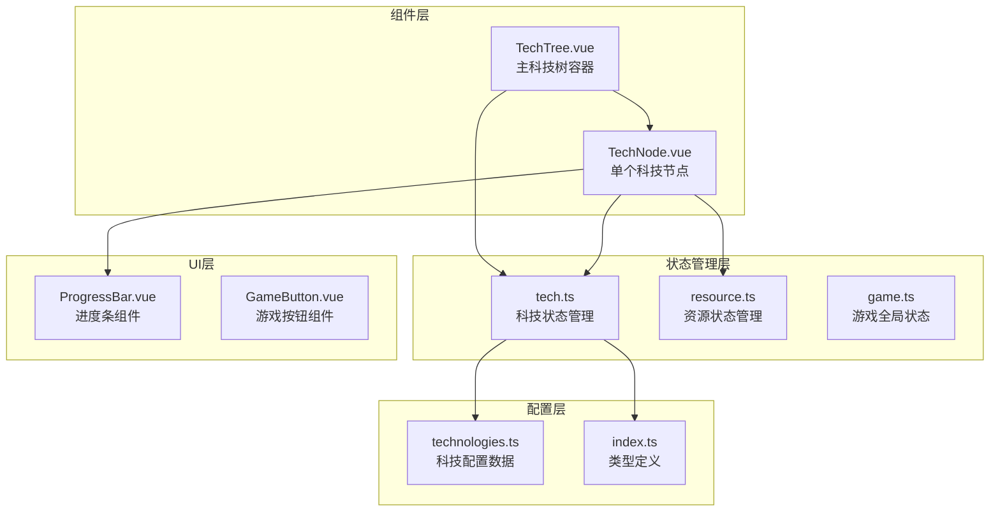
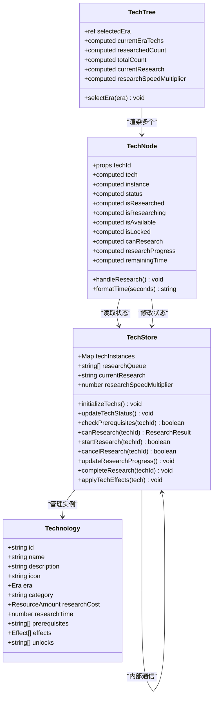
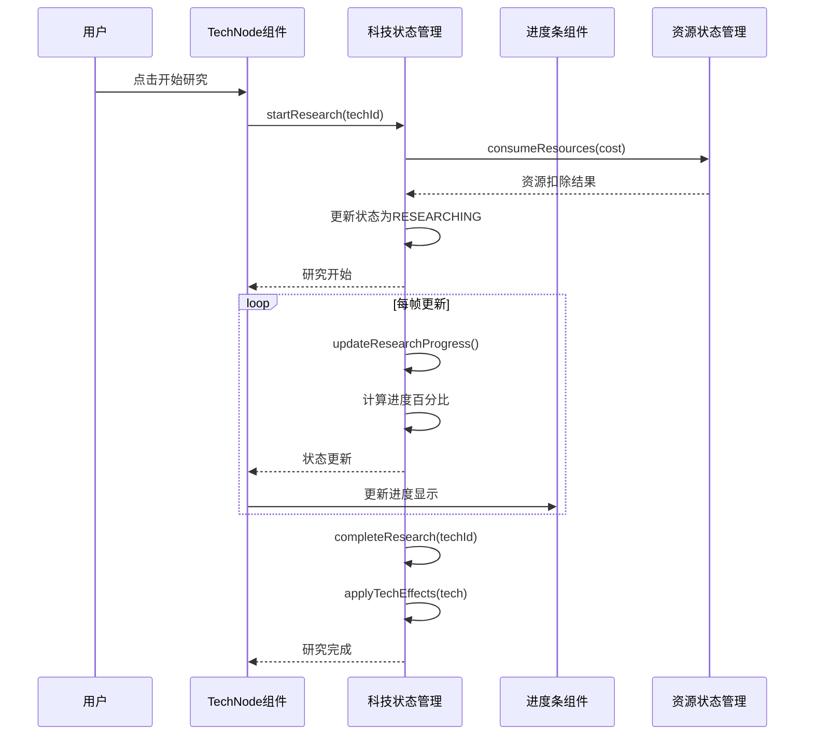
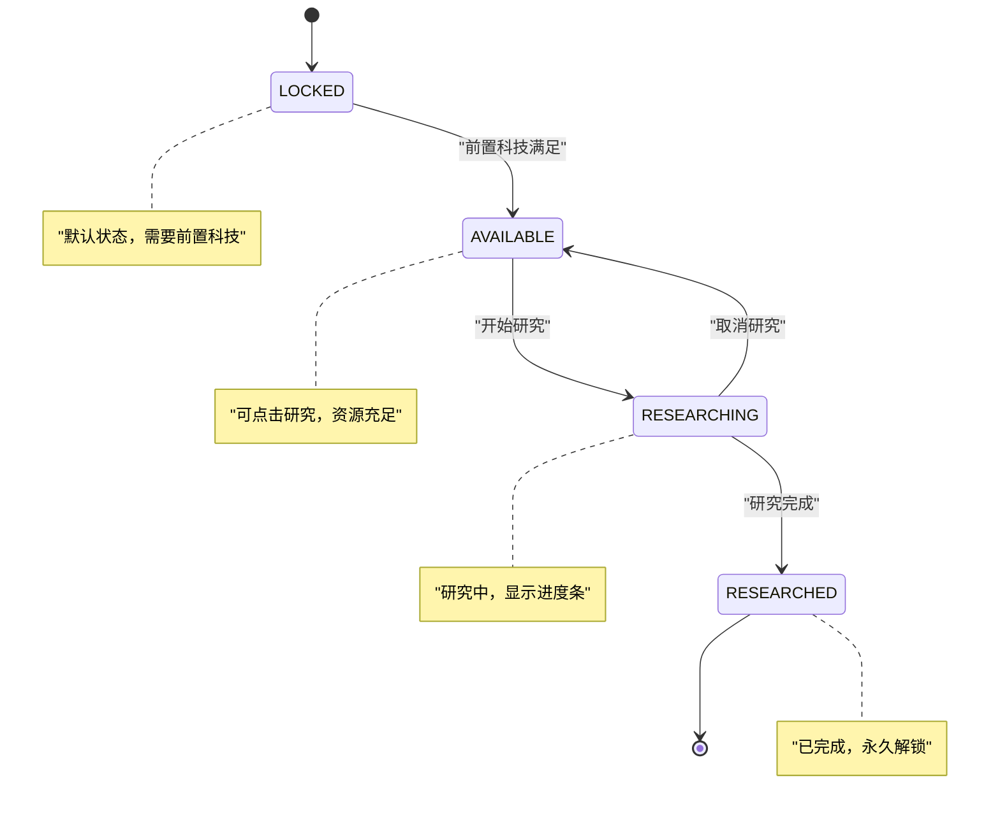

# 科技树组件系统

<cite>
**本文档引用的文件**
- [TechTree.vue](file://civilization-game/src/components/game/TechTree.vue)
- [TechNode.vue](file://civilization-game/src/components/game/TechNode.vue)
- [tech.ts](file://civilization-game/src/stores/tech.ts)
- [technologies.ts](file://civilization-game/src/config/technologies.ts)
- [index.ts](file://civilization-game/src/types/index.ts)
- [ProgressBar.vue](file://civilization-game/src/components/ui/ProgressBar.vue)
</cite>

## 目录
1. [简介](#简介)
2. [项目结构](#项目结构)
3. [核心组件架构](#核心组件架构)
4. [TechTree组件详解](#techtree组件详解)
5. [TechNode组件详解](#technode组件详解)
6. [科技状态管理](#科技状态管理)
7. [科技配置系统](#科技配置系统)
8. [UI组件集成](#ui组件集成)
9. [性能优化策略](#性能优化策略)
10. [故障排除指南](#故障排除指南)
11. [总结](#总结)

## 简介

TechTree和TechNode是Civilization游戏中的核心科技树系统，负责构建和管理玩家可研究的科技树结构。该系统基于technologies.ts配置数据，展示了科技之间的依赖关系和解锁路径，同时提供了直观的用户界面来跟踪研究进度和管理科技研究。

科技树系统采用Vue 3 Composition API设计，结合Pinia状态管理，实现了响应式的科技状态更新和动态的UI渲染。系统支持多时代科技树，每个时代包含不同类型的科技，包括生产、军事、文化和经济类别的科技。

## 项目结构

科技树组件系统的核心文件组织如下：



**图表来源**
- [TechTree.vue](file://civilization-game/src/components/game/TechTree.vue#L1-L150)
- [TechNode.vue](file://civilization-game/src/components/game/TechNode.vue#L1-L266)
- [tech.ts](file://civilization-game/src/stores/tech.ts#L1-L417)

## 核心组件架构

科技树系统采用分层架构设计，确保了组件间的清晰职责分离和高度的可维护性。



**图表来源**
- [TechTree.vue](file://civilization-game/src/components/game/TechTree.vue#L1-L150)
- [TechNode.vue](file://civilization-game/src/components/game/TechNode.vue#L1-L266)
- [tech.ts](file://civilization-game/src/stores/tech.ts#L1-L417)
- [technologies.ts](file://civilization-game/src/config/technologies.ts#L1-L887)

**章节来源**
- [TechTree.vue](file://civilization-game/src/components/game/TechTree.vue#L1-L150)
- [TechNode.vue](file://civilization-game/src/components/game/TechNode.vue#L1-L266)
- [tech.ts](file://civilization-game/src/stores/tech.ts#L1-L417)

## TechTree组件详解

TechTree组件作为科技树系统的主容器，负责管理整个科技树的显示和交互逻辑。

### 组件功能特性

1. **多时代科技树管理**：支持8个不同的游戏时代，每个时代包含不同类型的科技
2. **实时状态监控**：显示当前研究状态、研究速度倍率和时代进度
3. **动态网格布局**：根据屏幕尺寸自动调整科技节点的网格布局
4. **空状态处理**：当某个时代没有科技时显示友好的提示信息

### 核心实现逻辑

```typescript
// 时代选择和状态管理
const selectedEra = ref<Era>(gameStore.currentEra)
const currentEraTechs = computed(() => {
  return getTechnologiesByEra(selectedEra.value)
})

// 研究进度统计
const researchedCount = computed(() => {
  const allTechs = getTechnologiesByEra(selectedEra.value)
  return allTechs.filter(tech => techStore.isTechResearched(tech.id)).length
})

// 当前研究状态
const currentResearch = computed(() => techStore.currentResearch)
const researchSpeedMultiplier = computed(() => techStore.getResearchSpeedMultiplier())
```

### UI布局设计

TechTree采用现代化的响应式设计，使用CSS Grid布局实现灵活的科技节点排列：

```css
.tech-grid {
  @apply grid grid-cols-1 md:grid-cols-2 lg:grid-cols-3 gap-4;
}
```

这种设计允许：
- 小屏幕设备显示单列布局
- 中等屏幕设备显示双列布局
- 大屏幕设备显示三列布局

**章节来源**
- [TechTree.vue](file://civilization-game/src/components/game/TechTree.vue#L1-L150)

## TechNode组件详解

TechNode组件是科技树系统中最复杂的单个组件，负责渲染和管理每个科技节点的完整生命周期。

### 状态管理机制

TechNode组件通过计算属性实现精确的状态管理：

```typescript
const status = computed(() => instance.value?.status || TechnologyStatus.LOCKED)
const isResearched = computed(() => status.value === TechnologyStatus.RESEARCHED)
const isResearching = computed(() => status.value === TechnologyStatus.RESEARCHING)
const isAvailable = computed(() => status.value === TechnologyStatus.AVAILABLE)
const isLocked = computed(() => status.value === TechnologyStatus.LOCKED)
```

### 研究进度系统

科技研究进度通过以下机制实现：



**图表来源**
- [TechNode.vue](file://civilization-game/src/components/game/TechNode.vue#L60-L80)
- [tech.ts](file://civilization-game/src/stores/tech.ts#L150-L200)

### 科技效果应用

当科技研究完成后，系统会自动应用相应的游戏效果：

```typescript
function applyTechEffects(tech: Technology) {
  const resourceStore = useResourceStore()
  const gameStore = useGameStore()

  tech.effects.forEach(effect => {
    switch (effect.type) {
      case 'resourceMultiplier':
        if (effect.target) {
          const currentMultiplier = resourceStore.resourceMultipliers[effect.target] || 1.0
          resourceStore.resourceMultipliers[effect.target] = currentMultiplier * effect.value
        }
        break

      case 'researchSpeedBonus':
        researchSpeedMultiplier.value *= effect.value
        break

      case 'buildSpeedBonus':
        gameStore.emitEvent('techEffectApplied', {
          type: 'buildSpeedBonus',
          value: effect.value
        })
        break
    }
  })
}
```

### 用户交互设计

TechNode组件提供了丰富的用户交互功能：

1. **研究控制**：支持开始研究和取消研究
2. **资源显示**：实时显示研究成本和资源状态
3. **进度反馈**：通过进度条显示研究进度和剩余时间
4. **效果展示**：详细列出科技带来的各种游戏效果

**章节来源**
- [TechNode.vue](file://civilization-game/src/components/game/TechNode.vue#L1-L266)
- [tech.ts](file://civilization-game/src/stores/tech.ts#L250-L300)

## 科技状态管理

科技状态管理是整个系统的核心，负责维护所有科技的状态信息和研究进度。

### 状态类型系统

系统定义了四种主要的科技状态：

```typescript
export const TechnologyStatus = {
  LOCKED: 'locked',           // 已锁定，需要前置科技
  AVAILABLE: 'available',     // 可研究，前置科技已满足
  RESEARCHING: 'researching', // 正在研究中
  RESEARCHED: 'researched'    // 已研究完成
} as const
```

### 状态转换机制



### 研究进度算法

研究进度计算采用基于时间的算法：

```typescript
function updateResearchProgress() {
  if (!currentResearch.value) return

  const instance = techInstances.value.get(currentResearch.value)
  if (!instance || instance.status !== TechnologyStatus.RESEARCHING) {
    currentResearch.value = null
    return
  }

  const tech = getTechnology(currentResearch.value)
  if (!tech || !instance.researchStartTime) return

  const now = Date.now()
  const elapsed = (now - instance.researchStartTime) / 1000 // 转换为秒
  const totalTime = tech.researchTime / researchSpeedMultiplier.value
  const progress = Math.min((elapsed / totalTime) * 100, 100)

  instance.researchProgress = progress

  if (progress >= 100) {
    completeResearch(currentResearch.value)
  }
}
```

**章节来源**
- [tech.ts](file://civilization-game/src/stores/tech.ts#L1-L417)
- [index.ts](file://civilization-game/src/types/index.ts#L120-L140)

## 科技配置系统

科技配置系统基于technologies.ts文件，提供了完整的科技数据定义和管理。

### 科技数据结构

每个科技包含以下关键属性：

```typescript
interface Technology {
  id: string                    // 唯一标识符
  name: string                 // 显示名称
  description: string          // 详细描述
  icon: string                // 图标标识
  era: Era                    // 所属时代
  category: string            // 科技类别
  researchCost: ResourceAmount // 研究成本
  researchTime: number        // 研究时间(秒)
  prerequisites: string[]     // 前置科技ID数组
  effects: Effect[]           // 科技效果数组
  unlocks: string[]           // 解锁的建筑ID数组
}
```

### 时代科技分布

系统支持8个不同的游戏时代，每个时代都有特定的科技主题：

1. **石器时代**：基础生存科技，如火的使用、石器工具
2. **青铜时代**：金属加工和农业发展
3. **铁器时代**：工程技术和哲学思想
4. **工业时代**：机械化和工业化进程
5. **信息时代**：计算机和信息技术
6. **太空时代**：航天技术和宇宙探索
7. **星际时代**：跨星系文明发展
8. **超维时代**：维度理论和超自然科技

### 前置条件检查

系统实现了复杂的前置条件检查机制：

```typescript
function checkPrerequisites(techId: string): boolean {
  const tech = getTechnology(techId)
  if (!tech) return false

  // 检查所有前置科技是否已研究
  return tech.prerequisites.every(prereqId => {
    const prereq = techInstances.value.get(prereqId)
    return prereq?.status === TechnologyStatus.RESEARCHED
  })
}
```

**章节来源**
- [technologies.ts](file://civilization-game/src/config/technologies.ts#L1-L887)
- [index.ts](file://civilization-game/src/types/index.ts#L120-L140)

## UI组件集成

科技树系统集成了多个UI组件来提供丰富的用户体验。

### ProgressBar组件集成

TechNode组件集成了专门的ProgressBar组件来显示研究进度：

```vue
<ProgressBar
  v-if="isResearching"
  :percentage="researchProgress"
  :estimated-time="remainingTime"
  class="mt-2"
/>
```

ProgressBar组件具有以下特性：
- 支持多种颜色主题
- 可配置的高度设置
- 实时时间格式化
- 动画效果支持

### GameButton组件集成

研究按钮使用GameButton组件提供一致的游戏风格：

```vue
<GameButton
  v-if="!isResearched"
  :disabled="!canResearch && !isResearching"
  :variant="isResearching ? 'secondary' : 'primary'"
  class="mt-3"
  @click="handleResearch"
>
  {{ isResearching ? '取消研究' : '开始研究' }}
</GameButton>
```

### 图标系统

系统使用Iconify图标库提供统一的视觉元素：

```vue
<Icon icon="game-icons:tech-tree" width="24" height="24" />
<Icon :icon="tech.icon" width="32" height="32" />
```

**章节来源**
- [TechNode.vue](file://civilization-game/src/components/game/TechNode.vue#L150-L200)
- [ProgressBar.vue](file://civilization-game/src/components/ui/ProgressBar.vue#L1-L105)

## 性能优化策略

科技树系统采用了多种性能优化策略来确保流畅的游戏体验。

### Vue 3 Composition API优化

- 使用`computed`属性缓存复杂计算结果
- 利用`ref`和`reactive`实现细粒度的状态更新
- 通过`watch`监听器实现必要的状态同步

### 状态更新策略

```typescript
// 批量更新科技状态
function updateTechStatus() {
  techInstances.value.forEach((instance, techId) => {
    if (instance.status === TechnologyStatus.LOCKED) {
      const canResearch = checkPrerequisites(techId)
      if (canResearch) {
        instance.status = TechnologyStatus.AVAILABLE
      }
    }
  })
}
```

### 内存管理

- 使用Map数据结构存储科技实例，提供O(1)的查找性能
- 实现了完整的存档和恢复机制
- 提供了重置功能以清理内存占用

### 渲染优化

- 条件渲染减少不必要的DOM元素
- 使用CSS类名动态控制样式，避免频繁的DOM操作
- 合理使用v-if/v-show指令优化渲染性能

## 故障排除指南

### 常见问题及解决方案

1. **科技无法研究**
   - 检查前置科技是否已研究
   - 验证资源是否充足
   - 确认没有其他科技正在研究中

2. **研究进度异常**
   - 检查研究时间配置是否正确
   - 验证研究速度倍率计算
   - 确认时间戳记录的准确性

3. **UI状态不同步**
   - 检查状态管理器的数据一致性
   - 验证组件的响应式更新
   - 确认事件监听器的正确绑定

### 调试技巧

```typescript
// 在开发模式下启用调试日志
if (process.env.NODE_ENV === 'development') {
  console.log('科技状态更新:', techId, status)
}
```

### 性能监控

系统提供了内置的性能监控功能：

```typescript
// 监控研究进度更新频率
let updateCount = 0
setInterval(() => {
  console.log('每秒更新次数:', updateCount)
  updateCount = 0
}, 1000)
```

**章节来源**
- [tech.ts](file://civilization-game/src/stores/tech.ts#L150-L200)

## 总结

TechTree和TechNode组件系统是一个设计精良、功能完备的科技树管理解决方案。系统具有以下核心优势：

### 技术特点

1. **模块化设计**：清晰的组件分离和职责划分
2. **响应式架构**：基于Vue 3的现代前端技术栈
3. **状态管理**：完善的Pinia状态管理模式
4. **类型安全**：完整的TypeScript类型定义

### 功能完整性

1. **多时代支持**：涵盖8个不同的游戏时代
2. **依赖关系**：复杂的前置科技依赖系统
3. **效果应用**：多样化的游戏效果实现
4. **用户交互**：丰富的交互反馈和提示

### 扩展性

系统设计充分考虑了未来的扩展需求：
- 新时代的科技树轻松添加
- 新的效果类型易于扩展
- UI组件可以独立升级
- 状态管理支持复杂的游戏逻辑

这个科技树系统为Civilization游戏提供了坚实的技术基础，确保了游戏的可玩性和长期发展潜力。通过合理的架构设计和性能优化，系统能够在各种设备上提供流畅的游戏体验，同时保持良好的可维护性和扩展性。