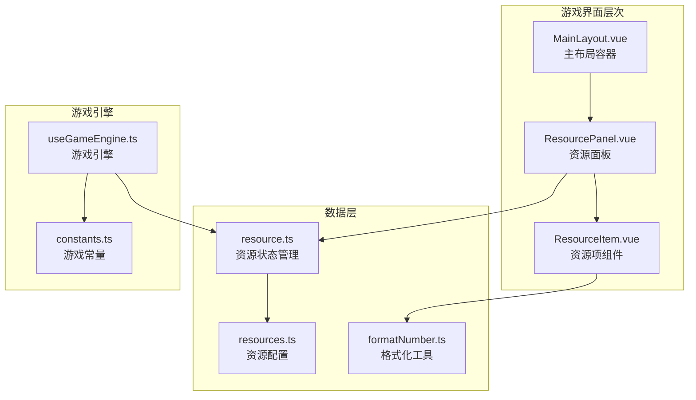
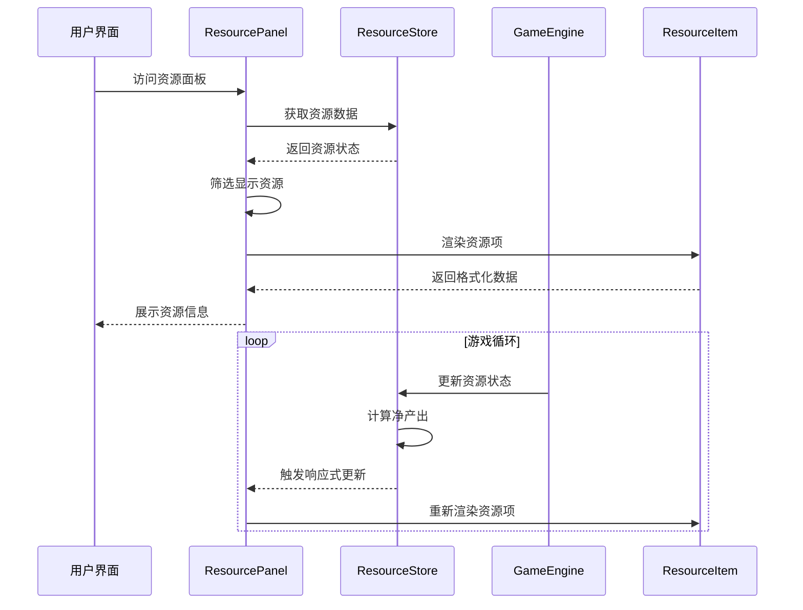
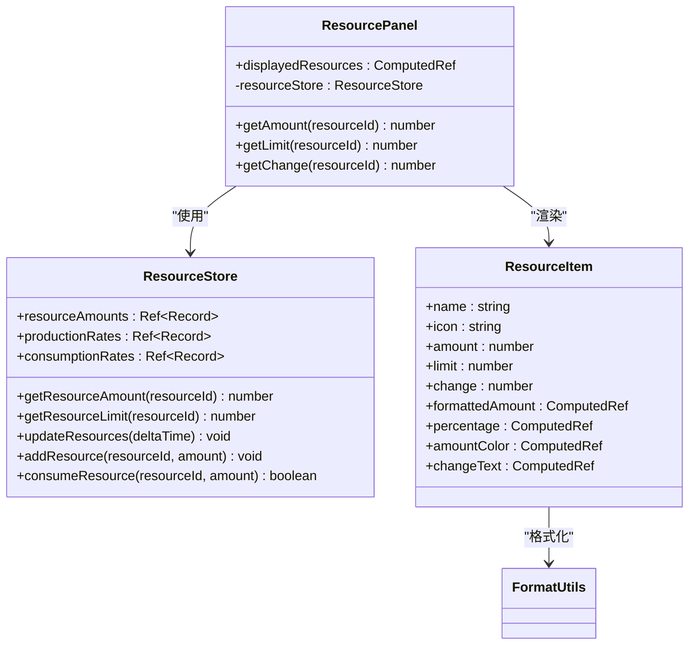
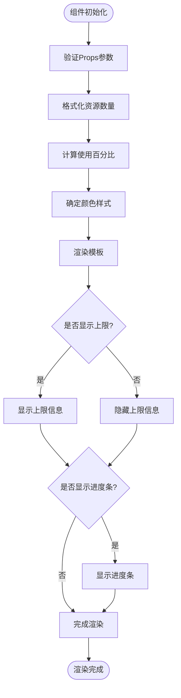
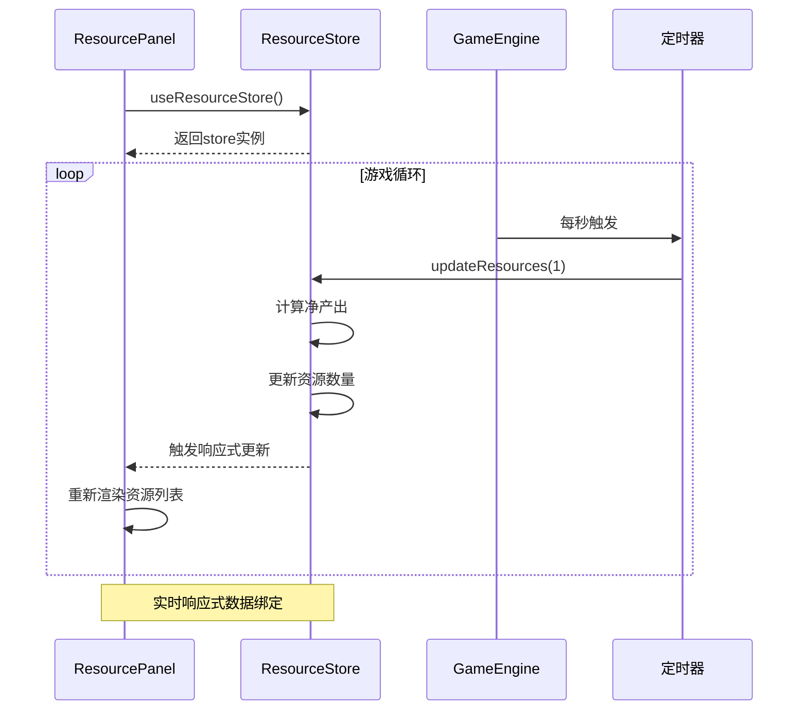
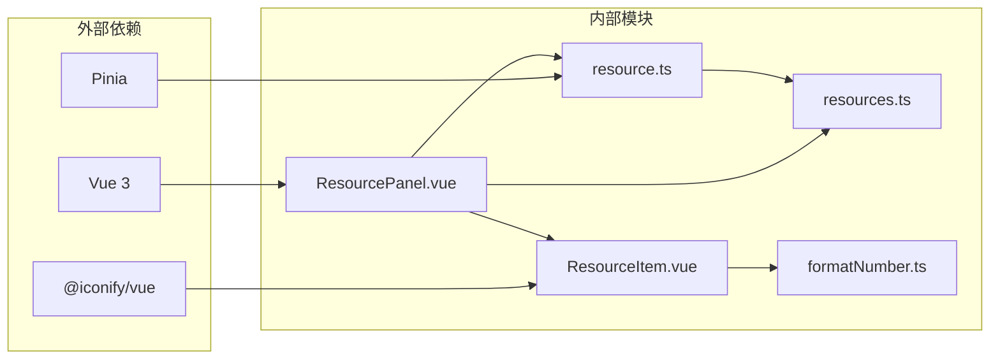

# 资源面板组件

<cite>
**本文档引用的文件**
- [ResourcePanel.vue](file://civilization-game/src/components/game/ResourcePanel.vue)
- [ResourceItem.vue](file://civilization-game/src/components/ui/ResourceItem.vue)
- [resource.ts](file://civilization-game/src/stores/resource.ts)
- [resources.ts](file://civilization-game/src/config/resources.ts)
- [formatNumber.ts](file://civilization-game/src/utils/formatNumber.ts)
- [MainLayout.vue](file://civilization-game/src/components/game/MainLayout.vue)
- [useGameEngine.ts](file://civilization-game/src/composables/useGameEngine.ts)
- [constants.ts](file://civilization-game/src/config/constants.ts)
</cite>

## 目录
1. [简介](#简介)
2. [项目结构](#项目结构)
3. [核心组件](#核心组件)
4. [架构概览](#架构概览)
5. [详细组件分析](#详细组件分析)
6. [依赖关系分析](#依赖关系分析)
7. [性能考虑](#性能考虑)
8. [故障排除指南](#故障排除指南)
9. [结论](#结论)

## 简介

ResourcePanel组件是文明发展模拟游戏的核心UI组件之一，负责实时展示玩家拥有的各类资源信息。该组件从Pinia的resource store中获取资源数据，包括资源数量、存储上限、生产速率和消耗速率，并以直观的方式呈现给用户。

组件采用响应式设计，能够根据屏幕尺寸自动调整布局，支持移动端和桌面端的不同显示需求。通过与游戏引擎的时间循环系统集成，确保资源数据显示始终保持最新状态。

## 项目结构

ResourcePanel组件位于游戏界面的主布局中，作为资源状态展示的核心区域。其组织结构体现了清晰的模块化设计理念：



**图表来源**
- [MainLayout.vue](file://civilization-game/src/components/game/MainLayout.vue#L1-L50)
- [ResourcePanel.vue](file://civilization-game/src/components/game/ResourcePanel.vue#L1-L47)
- [resource.ts](file://civilization-game/src/stores/resource.ts#L1-L39)

**章节来源**
- [MainLayout.vue](file://civilization-game/src/components/game/MainLayout.vue#L1-L275)
- [ResourcePanel.vue](file://civilization-game/src/components/game/ResourcePanel.vue#L1-L47)

## 核心组件

### ResourcePanel组件架构

ResourcePanel组件采用了简洁而高效的架构设计，主要包含以下核心功能：

1. **响应式资源过滤**：根据当前游戏状态动态筛选需要显示的资源
2. **实时数据绑定**：与Pinia store建立双向数据绑定
3. **网格布局系统**：自适应不同屏幕尺寸的响应式布局
4. **性能优化**：通过computed属性和节流机制优化渲染性能

组件的核心实现逻辑如下：

```typescript
// 根据当前时代筛选应该显示的资源
const displayedResources = computed(() => {
  return resources.filter(resource => {
    const amount = resourceStore.getResourceAmount(resource.id)
    // 显示有数量的资源,或者基础资源始终显示
    return amount > 0 || resource.category === 'basic' || resource.category === 'special'
  })
})
```

**章节来源**
- [ResourcePanel.vue](file://civilization-game/src/components/game/ResourcePanel.vue#L15-L25)

## 架构概览

ResourcePanel组件的整体架构展现了现代Vue.js应用的最佳实践，通过清晰的分层设计实现了高度的可维护性和扩展性：



**图表来源**
- [ResourcePanel.vue](file://civilization-game/src/components/game/ResourcePanel.vue#L25-L47)
- [resource.ts](file://civilization-game/src/stores/resource.ts#L112-L140)
- [useGameEngine.ts](file://civilization-game/src/composables/useGameEngine.ts#L40-L80)

## 详细组件分析

### ResourcePanel组件详细分析

ResourcePanel组件是整个资源管理系统的核心入口点，其设计体现了Vue.js组合式API的强大功能：



**图表来源**
- [ResourcePanel.vue](file://civilization-game/src/components/game/ResourcePanel.vue#L15-L47)
- [resource.ts](file://civilization-game/src/stores/resource.ts#L1-L202)
- [ResourceItem.vue](file://civilization-game/src/components/ui/ResourceItem.vue#L1-L104)

#### 资源筛选逻辑

组件实现了智能的资源筛选机制，确保只显示对玩家有意义的资源：

```typescript
// 根据当前时代筛选应该显示的资源
const displayedResources = computed(() => {
  return resources.filter(resource => {
    const amount = resourceStore.getResourceAmount(resource.id)
    // 显示有数量的资源,或者基础资源始终显示
    return amount > 0 || resource.category === 'basic' || resource.category === 'special'
  })
})
```

这种设计的优势：
- **用户体验优化**：避免显示无意义的零值资源
- **性能提升**：减少不必要的DOM渲染
- **信息聚焦**：突出显示关键资源信息

#### 数据获取方法

组件提供了三个核心的数据获取方法：

```typescript
function getAmount(resourceId: ResourceType): number {
  return resourceStore.getResourceAmount(resourceId)
}

function getLimit(resourceId: ResourceType): number {
  return resourceStore.getResourceLimit(resourceId)
}

function getChange(resourceId: ResourceType): number {
  const production = resourceStore.productionRates[resourceId] || 0
  const consumption = resourceStore.consumptionRates[resourceId] || 0
  return production - consumption
}
```

这些方法的设计特点：
- **类型安全**：使用TypeScript确保类型正确性
- **默认值处理**：优雅处理未定义的资源情况
- **计算逻辑封装**：将复杂的计算逻辑封装在简单的方法中

**章节来源**
- [ResourcePanel.vue](file://civilization-game/src/components/game/ResourcePanel.vue#L25-L47)

### ResourceItem组件详细分析

ResourceItem组件是ResourcePanel的子组件，负责单个资源项的渲染和交互：



**图表来源**
- [ResourceItem.vue](file://civilization-game/src/components/ui/ResourceItem.vue#L40-L104)

#### 响应式计算属性

ResourceItem组件大量使用了Vue的计算属性来实现响应式数据处理：

```typescript
const formattedAmount = computed(() => {
  return formatNumber(props.amount, 1)
})

const percentage = computed(() => {
  if (props.limit <= 0) return 0
  return Math.min(100, (props.amount / props.limit) * 100)
})

const amountColor = computed(() => {
  if (!props.showLimit || props.limit <= 0) {
    return 'text-gray-900 dark:text-white'
  }
  
  const percent = percentage.value
  if (percent >= 90) return 'text-red-600 dark:text-red-400'
  if (percent >= 70) return 'text-yellow-600 dark:text-yellow-400'
  return 'text-gray-900 dark:text-white'
})
```

这些计算属性的设计优势：
- **性能优化**：只有当依赖数据变化时才重新计算
- **代码复用**：避免重复计算相同的值
- **可维护性**：将复杂的逻辑封装在独立的计算属性中

#### 格式化工具集成

ResourceItem组件集成了专门的格式化工具函数，确保资源数据显示的一致性和可读性：

```typescript
// 格式化资源数量(带颜色标识)
export function hasEnoughResource(current: number, required: number): boolean {
  return current >= required
}

// 缩短数字显示(用于小空间显示)
export function formatCompact(value: number): string {
  if (value < 1000) return Math.floor(value).toString()
  if (value < 1000000) return (value / 1000).toFixed(1) + 'K'
  if (value < 1000000000) return (value / 1000000).toFixed(1) + 'M'
  if (value < 1000000000000) return (value / 1000000000).toFixed(1) + 'B'
  return (value / 1000000000000).toFixed(1) + 'T'
}

// 格式化增长率
export function formatRate(value: number): string {
  const prefix = value >= 0 ? '+' : ''
  return prefix + formatNumber(value, 2) + '/秒'
}
```

**章节来源**
- [ResourceItem.vue](file://civilization-game/src/components/ui/ResourceItem.vue#L40-L104)
- [formatNumber.ts](file://civilization-game/src/utils/formatNumber.ts#L80-L120)

### Pinia Store集成

ResourcePanel组件与Pinia store的集成展示了现代Vue应用的状态管理模式：



**图表来源**
- [resource.ts](file://civilization-game/src/stores/resource.ts#L112-L140)
- [useGameEngine.ts](file://civilization-game/src/composables/useGameEngine.ts#L40-L80)

#### 资源状态管理

ResourceStore提供了完整的资源状态管理功能：

```typescript
// 资源数量
const resourceAmounts = ref<Record<ResourceType, number>>({} as Record<ResourceType, number>)

// 资源存储上限
const resourceLimits = ref<Record<ResourceType, number>>({} as Record<ResourceType, number>)

// 资源产出速率(每秒)
const productionRates = ref<Record<ResourceType, number>>({} as Record<ResourceType, number>)

// 资源消耗速率(每秒)
const consumptionRates = ref<Record<ResourceType, number>>({} as Record<ResourceType, number>)
```

这些状态变量的设计特点：
- **类型安全**：使用TypeScript泛型确保类型正确
- **默认值设置**：避免未定义值导致的错误
- **响应式特性**：利用Vue的响应式系统自动更新视图

**章节来源**
- [resource.ts](file://civilization-game/src/stores/resource.ts#L7-L15)

## 依赖关系分析

ResourcePanel组件的依赖关系展现了清晰的分层架构：



**图表来源**
- [ResourcePanel.vue](file://civilization-game/src/components/game/ResourcePanel.vue#L1-L15)
- [ResourceItem.vue](file://civilization-game/src/components/ui/ResourceItem.vue#L1-L15)

### 关键依赖说明

1. **Vue 3 Composition API**：提供响应式数据绑定和生命周期管理
2. **Pinia**：状态管理库，提供集中式的状态存储
3. **@iconify/vue**：图标库，提供丰富的视觉元素
4. **formatNumber工具函数**：专门的数字格式化工具

**章节来源**
- [ResourcePanel.vue](file://civilization-game/src/components/game/ResourcePanel.vue#L1-L15)
- [ResourceItem.vue](file://civilization-game/src/components/ui/ResourceItem.vue#L1-L15)

## 性能考虑

ResourcePanel组件在设计时充分考虑了性能优化，采用了多种策略确保流畅的用户体验：

### 响应式优化策略

1. **Computed属性缓存**：利用Vue的计算属性缓存机制避免重复计算
2. **条件渲染**：只渲染实际需要显示的资源项
3. **事件节流**：在游戏循环中合理控制更新频率

### 渲染性能优化

```typescript
// 使用computed属性缓存筛选结果
const displayedResources = computed(() => {
  return resources.filter(resource => {
    const amount = resourceStore.getResourceAmount(resource.id)
    return amount > 0 || resource.category === 'basic' || resource.category === 'special'
  })
})
```

### 格式化性能优化

formatNumber工具函数针对大数字进行了特殊优化：

```typescript
export function formatNumber(value: number, decimals: number = 2): string {
  if (value === 0) return '0'
  if (value < 0) return '-' + formatNumber(-value, decimals)
  
  // 小于1000直接显示
  if (value < 1000) {
    return value % 1 === 0 ? value.toString() : value.toFixed(decimals)
  }
  
  // 使用单位后缀
  const suffixes = ['', 'K', 'M', 'B', 'T', 'Qa', 'Qi', 'Sx', 'Sp', 'Oc', 'No', 'Dc']
  const tier = Math.floor(Math.log10(value) / 3)
  
  if (tier === 0) {
    return value.toFixed(decimals)
  }
  
  if (tier < suffixes.length) {
    const suffix = suffixes[tier]
    const scale = Math.pow(10, tier * 3)
    const scaled = value / scale
    return scaled.toFixed(decimals) + suffix
  }
  
  // 超大数字使用科学计数法
  return value.toExponential(decimals)
}
```

这种优化策略的优势：
- **内存效率**：避免创建不必要的中间对象
- **计算优化**：使用数学运算替代字符串操作
- **可读性**：保持代码的清晰性和可维护性

## 故障排除指南

### 常见问题及解决方案

1. **资源显示异常**
   - 检查Pinia store是否正确初始化
   - 验证资源数据是否正确加载
   - 确认资源筛选逻辑是否正常工作

2. **性能问题**
   - 检查是否有过多的资源项导致渲染压力
   - 验证格式化函数是否被频繁调用
   - 监控游戏循环的帧率表现

3. **样式问题**
   - 确认CSS类名是否正确应用
   - 检查响应式断点设置是否合理
   - 验证暗黑模式样式是否正常

### 调试技巧

```typescript
// 在开发环境中启用调试模式
if (process.env.NODE_ENV === 'development') {
  console.log('ResourcePanel debug:', {
    displayedResources: displayedResources.value,
    resourceAmounts: resourceStore.resourceAmounts.value,
    productionRates: resourceStore.productionRates.value
  })
}
```

**章节来源**
- [ResourcePanel.vue](file://civilization-game/src/components/game/ResourcePanel.vue#L15-L25)
- [resource.ts](file://civilization-game/src/stores/resource.ts#L25-L35)

## 结论

ResourcePanel组件是文明发展模拟游戏中一个设计精良、功能完善的UI组件。它成功地将复杂的游戏状态转化为直观的用户界面，为玩家提供了清晰的资源管理体验。

### 主要优势

1. **响应式设计**：完美适配不同设备和屏幕尺寸
2. **性能优化**：通过多种技术手段确保流畅的用户体验
3. **可维护性**：清晰的代码结构和模块化设计
4. **扩展性**：良好的架构支持未来功能扩展

### 技术亮点

- **组合式API**：充分利用Vue 3的新特性
- **响应式编程**：实现真正的双向数据绑定
- **类型安全**：完整的TypeScript支持
- **性能监控**：内置的性能检测和优化机制

### 改进建议

1. **虚拟滚动**：对于大量资源项的情况，可以考虑实现虚拟滚动
2. **动画效果**：增加平滑的过渡动画提升用户体验
3. **无障碍支持**：增强对屏幕阅读器的支持
4. **国际化**：添加多语言支持以服务全球用户

ResourcePanel组件不仅是一个功能性的UI组件，更是现代Vue.js应用开发最佳实践的典型代表。它的设计思路和实现方式值得在类似项目中借鉴和应用。