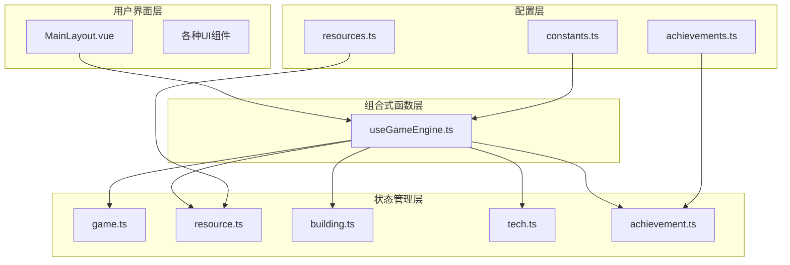
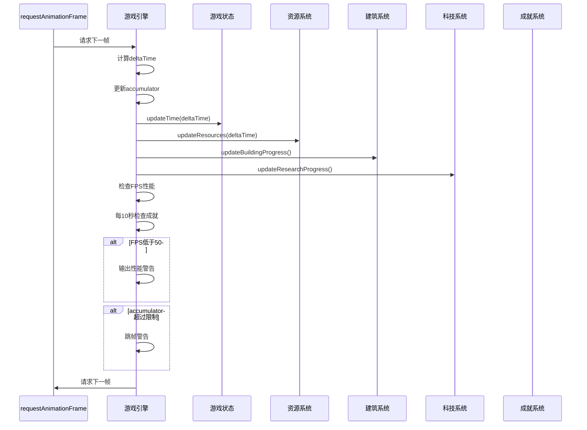
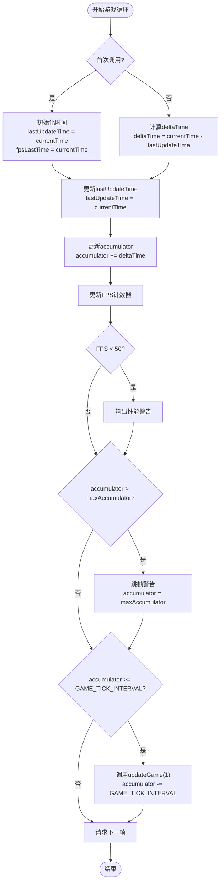
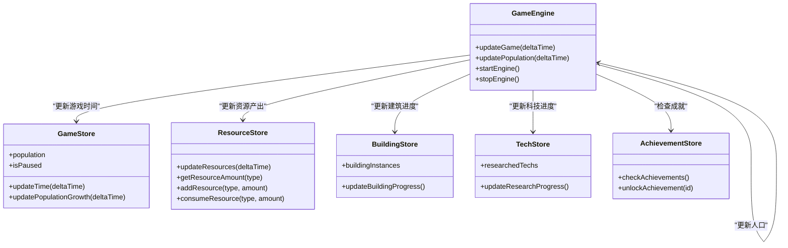
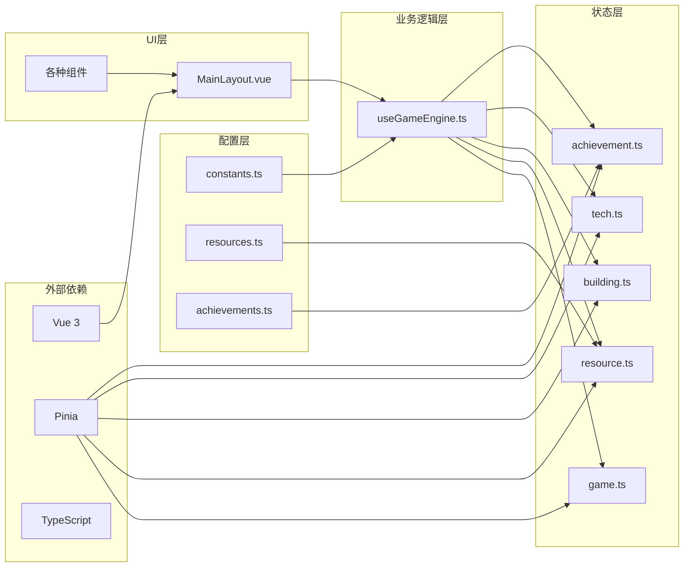

# 游戏引擎详细文档

<cite>
**本文档中引用的文件**
- [useGameEngine.ts](file://civilization-game/src/composables/useGameEngine.ts)
- [constants.ts](file://civilization-game/src/config/constants.ts)
- [game.ts](file://civilization-game/src/stores/game.ts)
- [resource.ts](file://civilization-game/src/stores/resource.ts)
- [resources.ts](file://civilization-game/src/config/resources.ts)
- [achievement.ts](file://civilization-game/src/stores/achievement.ts)
- [achievements.ts](file://civilization-game/src/config/achievements.ts)
- [index.ts](file://civilization-game/src/types/index.ts)
- [MainLayout.vue](file://civilization-game/src/components/game/MainLayout.vue)
</cite>

## 目录
1. [简介](#简介)
2. [项目结构](#项目结构)
3. [核心组件](#核心组件)
4. [架构概览](#架构概览)
5. [详细组件分析](#详细组件分析)
6. [依赖关系分析](#依赖关系分析)
7. [性能考虑](#性能考虑)
8. [故障排除指南](#故障排除指南)
9. [结论](#结论)

## 简介

本游戏引擎是一个基于Vue 3和TypeScript的文明建设模拟游戏的核心系统。它采用requestAnimationFrame实现60fps的游戏循环，通过固定时间步长（GAME_TICK_INTERVAL）确保逻辑更新的稳定性，并通过deltaTime和accumulator机制优雅地处理帧率变化。游戏引擎设计注重性能优化，包含完善的FPS监控和性能警告机制，以及智能的成就检测降频处理策略。

## 项目结构

游戏引擎采用模块化架构，主要分为以下几个层次：



**图表来源**
- [useGameEngine.ts](file://civilization-game/src/composables/useGameEngine.ts#L1-L143)
- [game.ts](file://civilization-game/src/stores/game.ts#L1-L268)
- [resource.ts](file://civilization-game/src/stores/resource.ts#L1-L202)

**章节来源**
- [useGameEngine.ts](file://civilization-game/src/composables/useGameEngine.ts#L1-L143)
- [MainLayout.vue](file://civilization-game/src/components/game/MainLayout.vue#L1-L275)

## 核心组件

### useGameEngine组合式函数

`useGameEngine.ts`是整个游戏引擎的核心，负责管理游戏循环、性能监控和各个子系统的协调工作。

```typescript
export function useGameEngine() {
  const gameStore = useGameStore()
  const resourceStore = useResourceStore()
  const buildingStore = useBuildingStore()
  const techStore = useTechStore()
  const achievementStore = useAchievementStore()
  
  let animationFrameId: number | null = null
  let lastUpdateTime = 0
  let accumulator = 0
  let achievementCheckCounter = 0
  
  // 性能监控
  let frameCount = 0
  let fpsLastTime = 0
  let currentFPS = 60
}
```

**章节来源**
- [useGameEngine.ts](file://civilization-game/src/composables/useGameEngine.ts#L7-L20)

## 架构概览

游戏引擎采用经典的事件驱动架构，结合固定时间步长的物理引擎设计：



**图表来源**
- [useGameEngine.ts](file://civilization-game/src/composables/useGameEngine.ts#L22-L60)
- [game.ts](file://civilization-game/src/stores/game.ts#L50-L60)

## 详细组件分析

### 游戏循环机制

游戏循环是引擎的核心，使用`requestAnimationFrame`实现60fps更新：



**图表来源**
- [useGameEngine.ts](file://civilization-game/src/composables/useGameEngine.ts#L22-L60)

### 固定时间步长设计

游戏引擎使用`GAME_TICK_INTERVAL = 1000ms`（1秒）作为固定时间步长，确保逻辑更新的一致性：

```typescript
const GAME_TICK_INTERVAL = 1000 // 游戏循环间隔(毫秒)

while (accumulator >= GAME_TICK_INTERVAL) {
  updateGame(1) // 更新1秒
  accumulator -= GAME_TICK_INTERVAL
}
```

这种设计的优势：
- **稳定性**：无论帧率如何变化，游戏逻辑保持一致
- **可预测性**：玩家体验不会受到帧率波动的影响
- **性能平衡**：避免过度频繁的逻辑更新

**章节来源**
- [useGameEngine.ts](file://civilization-game/src/composables/useGameEngine.ts#L50-L55)
- [constants.ts](file://civilization-game/src/config/constants.ts#L6-L6)

### FPS监控和性能警告

引擎内置了完整的FPS监控系统：

```typescript
let frameCount = 0
let fpsLastTime = 0
let currentFPS = 60

function gameLoop(currentTime: number) {
  // FPS计算
  frameCount++
  if (currentTime - fpsLastTime >= 1000) {
    currentFPS = frameCount
    frameCount = 0
    fpsLastTime = currentTime
    
    // 如果FPS低于50，进行性能调整
    if (currentFPS < 50) {
      console.warn(`Low FPS detected: ${currentFPS}, consider performance optimization`)
    }
  }
}
```

性能监控的关键特性：
- **实时监控**：每秒计算一次FPS
- **阈值警告**：当FPS低于50时发出警告
- **性能优化提示**：帮助开发者识别性能瓶颈

**章节来源**
- [useGameEngine.ts](file://civilization-game/src/composables/useGameEngine.ts#L30-L40)

### 成就检测优化

成就系统采用了智能的降频处理策略，每10秒检查一次成就：

```typescript
let achievementCheckCounter = 0

function updateGame(deltaTime: number) {
  // 检查成就(每10秒检查一次，优化性能)
  achievementCheckCounter += deltaTime
  if (achievementCheckCounter >= 10) {
    achievementStore.checkAchievements()
    achievementCheckCounter = 0
  }
}
```

这种设计的优势：
- **性能优化**：减少不必要的成就检查频率
- **用户体验**：成就解锁仍然及时反馈
- **资源节约**：降低CPU使用率

**章节来源**
- [useGameEngine.ts](file://civilization-game/src/composables/useGameEngine.ts#L75-L80)

### 主循环协调机制

主循环中调用的`updateGame`函数协调多个子系统的更新：



**图表来源**
- [useGameEngine.ts](file://civilization-game/src/composables/useGameEngine.ts#L62-L85)
- [game.ts](file://civilization-game/src/stores/game.ts#L50-L60)
- [resource.ts](file://civilization-game/src/stores/resource.ts#L100-L120)

**章节来源**
- [useGameEngine.ts](file://civilization-game/src/composables/useGameEngine.ts#L62-L85)

### 人口管理系统

人口系统实现了复杂的动态增长机制：

```typescript
function updatePopulation(deltaTime: number) {
  const { current, max, growthRate } = gameStore.population
  
  // 检查食物是否充足
  const foodConsumption = current * 0.5 * deltaTime // 每人口消耗0.5食物/秒
  const currentFood = resourceStore.getResourceAmount('food')
  
  if (currentFood >= foodConsumption) {
    // 消耗食物
    resourceStore.consumeResource('food', foodConsumption)
    
    // 人口增长(如果未达到上限)
    if (current < max) {
      const growth = growthRate * deltaTime
      gameStore.updatePopulation(current + growth)
    }
  } else {
    // 食物不足,人口减少
    const decrease = growthRate * deltaTime * 0.5
    gameStore.updatePopulation(Math.max(0, current - decrease))
  }
}
```

人口管理的关键特性：
- **食物约束**：人口增长受食物供应限制
- **动态调整**：食物不足时人口会减少
- **渐进增长**：基于增长率的平滑人口增长

**章节来源**
- [useGameEngine.ts](file://civilization-game/src/composables/useGameEngine.ts#L87-L110)

## 依赖关系分析

游戏引擎的依赖关系呈现清晰的分层结构：



**图表来源**
- [useGameEngine.ts](file://civilization-game/src/composables/useGameEngine.ts#L1-L6)
- [game.ts](file://civilization-game/src/stores/game.ts#L1-L5)

**章节来源**
- [useGameEngine.ts](file://civilization-game/src/composables/useGameEngine.ts#L1-L6)
- [game.ts](file://civilization-game/src/stores/game.ts#L1-L5)

## 性能考虑

### 优化策略

1. **成就检测降频**：每10秒检查一次成就，而不是每帧检查
2. **最大累积时间限制**：防止accumulator无限增长导致卡顿
3. **FPS监控**：实时监控性能并提供优化建议
4. **状态管理优化**：使用Pinia实现高效的响应式状态管理

### 性能监控指标

- **目标FPS**：60fps
- **警告阈值**：FPS < 50
- **最大累积时间**：GAME_TICK_INTERVAL * 3（3秒）
- **成就检查频率**：每10秒一次

### 内存管理

- **自动清理**：组件卸载时自动停止游戏引擎
- **状态隔离**：每个store独立管理自己的状态
- **事件监听器清理**：避免内存泄漏

## 故障排除指南

### 常见问题及解决方案

1. **FPS下降问题**
   - 检查控制台性能警告
   - 减少复杂UI组件的数量
   - 优化成就检查逻辑

2. **游戏卡顿问题**
   - 检查accumulator是否超过限制
   - 查看跳帧警告日志
   - 优化资源更新频率

3. **成就不触发问题**
   - 检查成就条件配置
   - 确认成就检查计数器正常工作
   - 验证成就奖励发放逻辑

**章节来源**
- [useGameEngine.ts](file://civilization-game/src/composables/useGameEngine.ts#L35-L40)
- [useGameEngine.ts](file://civilization-game/src/composables/useGameEngine.ts#L50-L55)

## 结论

本游戏引擎通过精心设计的架构和优化策略，成功实现了稳定、高效的游戏运行环境。其核心优势包括：

1. **稳定的逻辑更新**：固定时间步长确保游戏体验一致性
2. **智能性能监控**：实时FPS监控和性能警告机制
3. **高效的成就系统**：降频处理策略减少性能开销
4. **模块化的架构设计**：清晰的职责分离便于维护和扩展

该引擎为文明建设模拟游戏提供了坚实的技术基础，能够支持复杂的游戏逻辑和丰富的交互功能，同时保持良好的性能表现。