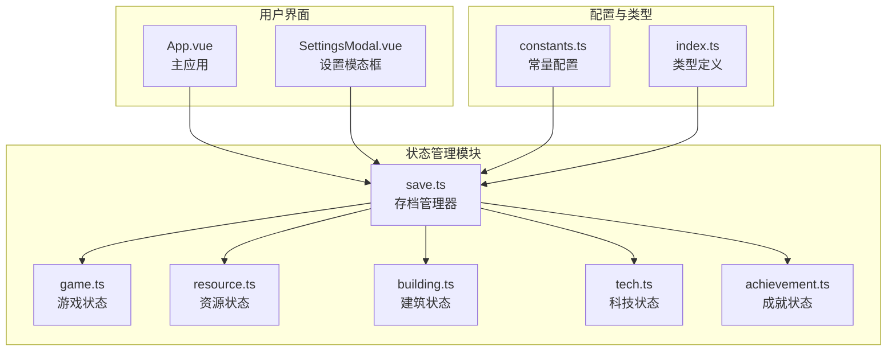
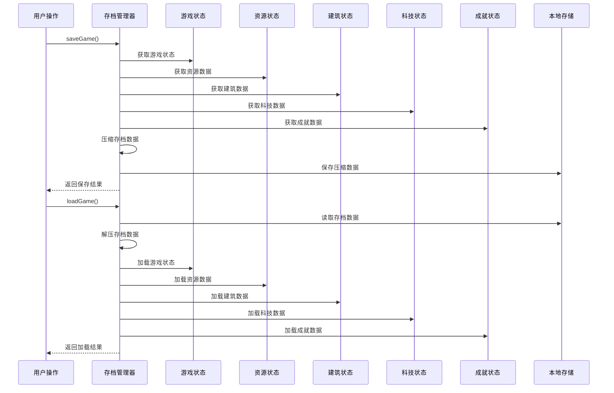
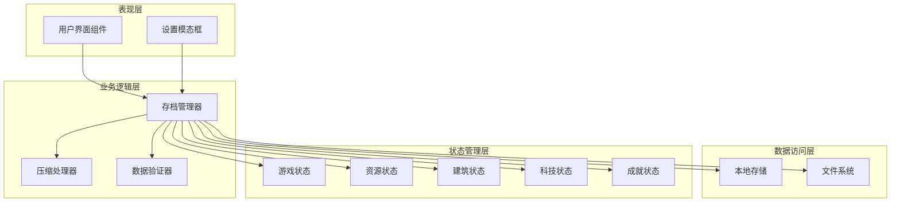
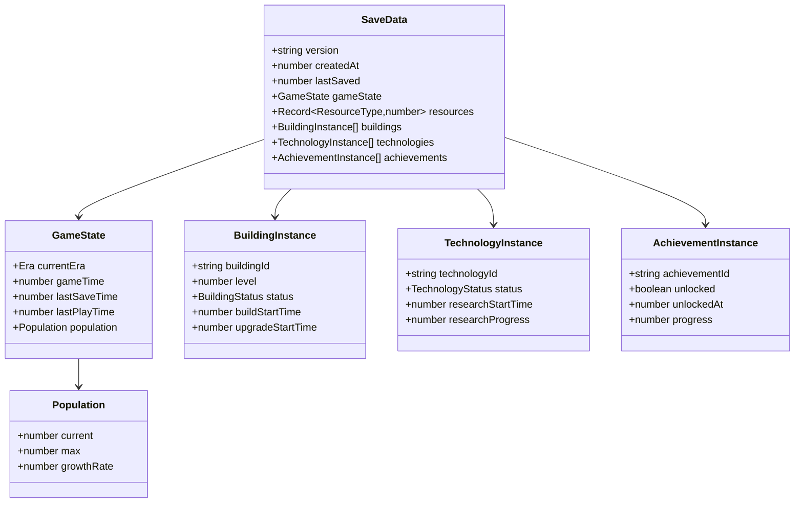
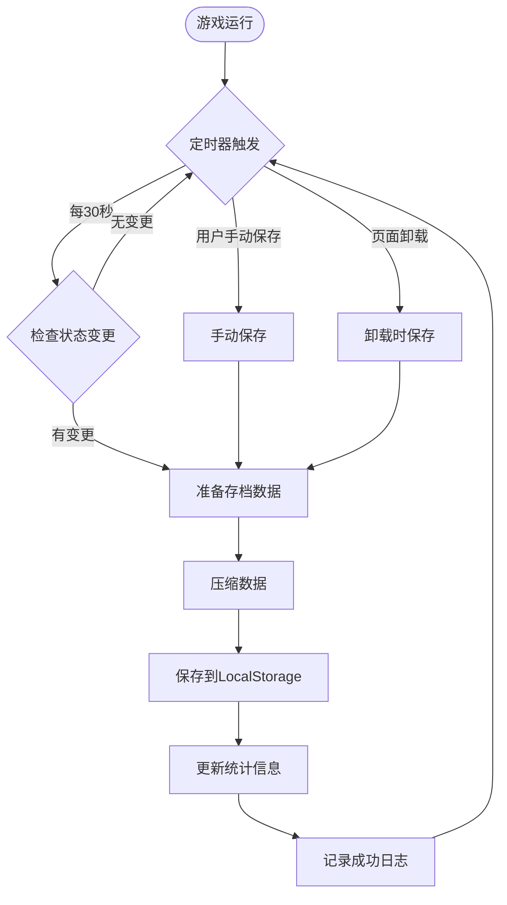
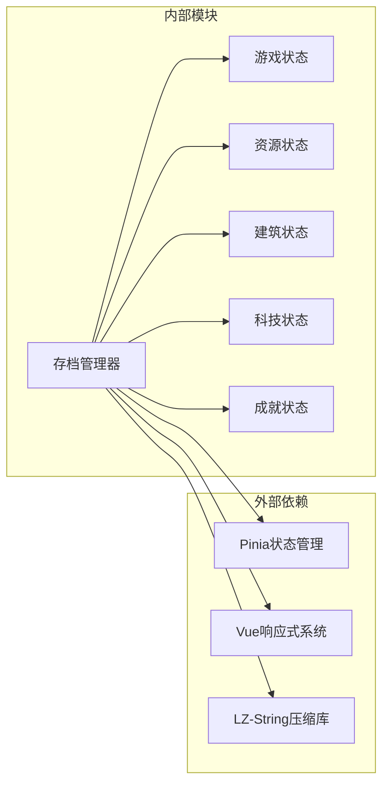
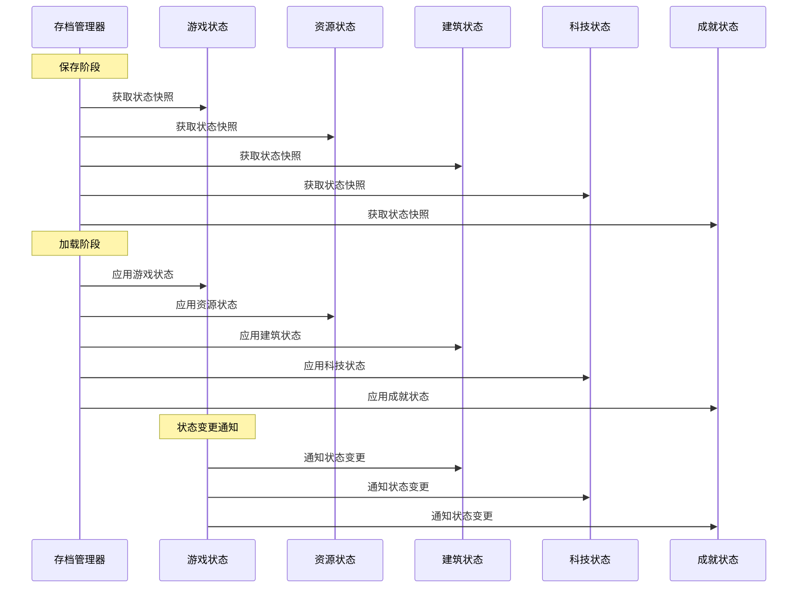

# 存档状态管理系统

<cite>
**本文档引用的文件**
- [save.ts](file://civilization-game/src/stores/save.ts)
- [game.ts](file://civilization-game/src/stores/game.ts)
- [resource.ts](file://civilization-game/src/stores/resource.ts)
- [building.ts](file://civilization-game/src/stores/building.ts)
- [tech.ts](file://civilization-game/src/stores/tech.ts)
- [achievement.ts](file://civilization-game/src/stores/achievement.ts)
- [constants.ts](file://civilization-game/src/config/constants.ts)
- [index.ts](file://civilization-game/src/types/index.ts)
- [App.vue](file://civilization-game/src/App.vue)
- [SettingsModal.vue](file://civilization-game/src/components/game/SettingsModal.vue)
</cite>

## 目录
1. [简介](#简介)
2. [项目结构概览](#项目结构概览)
3. [核心组件分析](#核心组件分析)
4. [架构概览](#架构概览)
5. [详细组件分析](#详细组件分析)
6. [依赖关系分析](#依赖关系分析)
7. [性能考虑](#性能考虑)
8. [故障排除指南](#故障排除指南)
9. [结论](#结论)

## 简介

存档状态管理系统是文明发展模拟游戏的核心组件，负责将游戏的所有状态数据进行序列化、压缩和持久化存储。该系统通过Pinia状态管理库整合了游戏状态、资源状态、建筑状态、科技状态和成就状态等多个子系统的数据，确保玩家的游戏进度能够安全保存并在需要时准确恢复。

系统采用LocalStorage作为主要存储介质，支持自动保存、手动保存、存档导入导出以及新游戏等功能。通过智能压缩算法和版本兼容性处理，系统能够在保证数据完整性的同时优化存储空间和加载性能。

## 项目结构概览

存档系统的核心文件组织如下：



**图表来源**
- [save.ts](file://civilization-game/src/stores/save.ts#L1-L280)
- [game.ts](file://civilization-game/src/stores/game.ts#L1-L50)
- [resource.ts](file://civilization-game/src/stores/resource.ts#L1-L50)

**章节来源**
- [save.ts](file://civilization-game/src/stores/save.ts#L1-L280)
- [constants.ts](file://civilization-game/src/config/constants.ts#L1-L61)

## 核心组件分析

### SaveStore - 存档管理器

SaveStore是整个存档系统的核心控制器，负责协调各个子状态模块的数据收集、序列化和持久化操作。

#### 主要功能特性

1. **多状态整合**: 统一收集gameStore、resourceStore、buildingStore、techStore和achievementStore的状态数据
2. **智能压缩**: 使用自定义压缩算法减少存档文件大小
3. **版本兼容**: 支持不同版本间的存档迁移
4. **错误处理**: 完善的异常捕获和恢复机制
5. **性能监控**: 实时跟踪压缩率和存储效率

#### 数据流处理



**图表来源**
- [save.ts](file://civilization-game/src/stores/save.ts#L85-L120)
- [save.ts](file://civilization-game/src/stores/save.ts#L122-L180)

**章节来源**
- [save.ts](file://civilization-game/src/stores/save.ts#L1-L280)

## 架构概览

### 系统架构设计

存档系统采用分层架构设计，确保各组件职责清晰且相互独立：



**图表来源**
- [save.ts](file://civilization-game/src/stores/save.ts#L1-L20)
- [App.vue](file://civilization-game/src/App.vue#L1-L30)

### 数据模型设计

系统使用统一的SaveData接口来规范存档数据结构：



**图表来源**
- [index.ts](file://civilization-game/src/types/index.ts#L170-L197)
- [index.ts](file://civilization-game/src/types/index.ts#L150-L169)

**章节来源**
- [index.ts](file://civilization-game/src/types/index.ts#L150-L197)

## 详细组件分析

### 压缩与解压机制

#### 压缩算法实现

系统采用智能压缩算法来优化存档文件大小：

```typescript
// 压缩存档数据的核心逻辑
function compressSaveData(data: SaveData): string {
  const compressed = {
    v: data.version,
    c: data.createdAt,
    l: data.lastSaved,
    g: {
      e: data.gameState.currentEra,
      t: data.gameState.gameTime,
      p: {
        c: Math.floor(data.gameState.population.current),
        m: data.gameState.population.max,
        g: data.gameState.population.growthRate
      },
      lp: data.gameState.lastPlayTime
    },
    r: Object.fromEntries(
      Object.entries(data.resources)
        .filter(([_, amount]) => amount > 0.01) // 过滤掉极小值
        .map(([id, amount]) => [id, Math.floor(amount * 10) / 10]) // 保留1位小数
    ),
    b: data.buildings.map(b => ({
      i: b.buildingId,
      l: b.level,
      s: b.status
    })),
    t: data.technologies.map(t => ({
      i: t.technologyId,
      s: t.status,
      p: t.researchProgress ? Math.floor(t.researchProgress * 100) / 100 : undefined
    })),
    a: data.achievements
      .filter(a => a.unlocked || (a.progress && a.progress > 0))
      .map(a => ({
        i: a.achievementId,
        u: a.unlocked,
        p: a.progress ? Math.floor(a.progress * 100) / 100 : undefined
      }))
  }
  
  return JSON.stringify(compressed)
}
```

#### 解压兼容性处理

系统具备强大的版本兼容性处理能力：

```typescript
function decompressSaveData(compressedData: string): SaveData {
  const c = JSON.parse(compressedData)
  
  // 兼容旧版本未压缩的存档
  if (c.version) {
    return c as SaveData
  }
  
  // 解压新版本压缩存档
  return {
    version: c.v,
    createdAt: c.c,
    lastSaved: c.l,
    gameState: {
      currentEra: c.g.e,
      gameTime: c.g.t,
      population: {
        current: c.g.p.c,
        max: c.g.p.m,
        growthRate: c.g.p.g
      },
      lastPlayTime: c.g.lp,
      lastSaveTime: c.l
    },
    resources: c.r,
    buildings: c.b.map((b: any) => ({
      buildingId: b.i,
      level: b.l,
      status: b.s
    })),
    technologies: c.t.map((t: any) => ({
      technologyId: t.i,
      status: t.s,
      researchProgress: t.p
    })),
    achievements: c.a.map((a: any) => ({
      achievementId: a.i,
      unlocked: a.u,
      progress: a.p
    }))
  }
}
```

### 自动保存机制

#### 保存触发条件

系统实现了智能的自动保存机制：



**图表来源**
- [save.ts](file://civilization-game/src/stores/save.ts#L85-L120)
- [constants.ts](file://civilization-game/src/config/constants.ts#L8-L9)

#### 保存性能监控

系统实时监控保存操作的性能指标：

```typescript
// 计算压缩率
const originalSize = JSON.stringify(saveData).length
const compressedSize = compressedData.length
const ratio = ((1 - compressedSize / originalSize) * 100).toFixed(1)
console.log(`游戏已保存 (压缩率: ${ratio}%, ${originalSize}B → ${compressedSize}B)`)
```

### 离线时间处理

#### 离线收益计算

系统智能处理长时间离线期间的游戏收益：

```typescript
// 计算离线时间
const now = Date.now()
const offlineTime = (now - saveData.gameState.lastPlayTime) / 1000 // 转换为秒

if (offlineTime > 60) { // 离线超过1分钟才计算收益
  console.log(`离线时间: ${(offlineTime / 60).toFixed(1)}分钟`)
  gameStore.setOfflineTime(offlineTime)
}
```

#### 离线收益衰减机制

系统采用分级衰减机制处理不同时间段的离线收益：

```typescript
export const OFFLINE_EFFICIENCY = {
  tier1: { maxTime: 2 * 60 * 60, efficiency: 1.0 },    // 前2小时: 100%
  tier2: { maxTime: 8 * 60 * 60, efficiency: 0.75 },   // 2-8小时: 75%
  tier3: { maxTime: 24 * 60 * 60, efficiency: 0.5 },   // 8-24小时: 50%
  tier4: { maxTime: Infinity, efficiency: 0.25 }       // 超过24小时: 25%
}
```

**章节来源**
- [save.ts](file://civilization-game/src/stores/save.ts#L25-L80)
- [constants.ts](file://civilization-game/src/config/constants.ts#L10-L15)

### 存档导入导出

#### 导出功能实现

```typescript
function exportSave(): string | null {
  try {
    const data = localStorage.getItem(STORAGE_KEYS.saveData)
    if (!data) return null
    
    const blob = new Blob([data], { type: 'application/json' })
    const url = URL.createObjectURL(blob)
    
    const a = document.createElement('a')
    a.href = url
    a.download = `civilization-save-${Date.now()}.json`
    a.click()
    
    URL.revokeObjectURL(url)
    console.log('存档已导出')
    return data
  } catch (error) {
    console.error('导出失败:', error)
    return null
  }
}
```

#### 导入功能实现

```typescript
function importSave(data: string): boolean {
  try {
    // 验证数据
    const saveData: SaveData = JSON.parse(data)
    if (!saveData.version || !saveData.gameState) {
      throw new Error('无效的存档数据')
    }

    // 保存到 localStorage
    localStorage.setItem(STORAGE_KEYS.saveData, data)
    
    // 加载游戏
    return loadGame()
  } catch (error) {
    console.error('导入失败:', error)
    return false
  }
}
```

**章节来源**
- [save.ts](file://civilization-game/src/stores/save.ts#L182-L220)

## 依赖关系分析

### 组件耦合度分析



**图表来源**
- [save.ts](file://civilization-game/src/stores/save.ts#L1-L10)

### 状态同步机制

系统通过Pinia的响应式特性确保状态的一致性：



**图表来源**
- [save.ts](file://civilization-game/src/stores/save.ts#L12-L17)
- [game.ts](file://civilization-game/src/stores/game.ts#L180-L190)

**章节来源**
- [save.ts](file://civilization-game/src/stores/save.ts#L1-L280)

## 性能考虑

### 存储优化策略

1. **数据过滤**: 只保存有意义的数据，过滤掉极小值和未解锁的内容
2. **精度控制**: 对数值进行适当的舍入处理，减少存储空间
3. **字段精简**: 使用简短的字段名替代完整名称
4. **增量更新**: 只保存发生变化的状态数据

### 内存管理

系统采用以下策略优化内存使用：

```typescript
// 智能数据过滤
r: Object.fromEntries(
  Object.entries(data.resources)
    .filter(([_, amount]) => amount > 0.01) // 过滤掉极小值
    .map(([id, amount]) => [id, Math.floor(amount * 10) / 10]) // 保留1位小数
),

// 条件性数据包含
a: data.achievements
  .filter(a => a.unlocked || (a.progress && a.progress > 0))
  .map(a => ({ /* 精简数据 */ }))
```

### 加载性能优化

1. **批量加载**: 一次性加载所有状态数据，减少多次IO操作
2. **异步处理**: 在后台线程中处理数据解压和验证
3. **缓存机制**: 缓存常用的存档元数据，避免重复计算

## 故障排除指南

### 常见问题及解决方案

#### 存档损坏处理

当检测到存档损坏时，系统提供多种恢复策略：

```typescript
// 错误处理和恢复
try {
  const saveData = decompressSaveData(data)
  // 正常加载流程
} catch (error) {
  console.error('加载失败:', error)
  // 提供恢复选项
  if (confirm('存档损坏，是否尝试恢复？')) {
    // 实现恢复逻辑
  }
}
```

#### 版本兼容性问题

```typescript
// 版本检查和迁移
if (saveData.version !== GAME_VERSION) {
  console.warn('存档版本不匹配,可能需要迁移')
  // 实现版本迁移逻辑
}
```

#### 存储空间不足

系统会监控存储空间使用情况：

```typescript
// 检查存储空间
const storageUsed = localStorage.getItem(STORAGE_KEYS.saveData)?.length || 0
const storageAvailable = localStorage.length * 2 // 简化估算
if (storageUsed > storageAvailable * 0.8) {
  console.warn('存储空间不足，建议清理存档')
}
```

### 调试工具

系统提供了丰富的调试信息：

```typescript
// 详细的保存日志
console.log(`游戏已保存 (压缩率: ${ratio}%, ${originalSize}B → ${compressedSize}B)`)

// 加载进度跟踪
console.log('游戏已加载')
console.log(`离线时间: ${(offlineTime / 60).toFixed(1)}分钟`)
```

**章节来源**
- [save.ts](file://civilization-game/src/stores/save.ts#L122-L180)

## 结论

存档状态管理系统是一个设计精良、功能完备的游戏存档解决方案。它通过以下特点确保了游戏体验的质量：

### 核心优势

1. **完整性保障**: 整合所有游戏状态，确保存档的完整性
2. **性能优化**: 智能压缩算法显著减少存储空间占用
3. **用户体验**: 自动保存和离线收益处理提升玩家体验
4. **可靠性**: 完善的错误处理和数据验证机制
5. **扩展性**: 模块化设计便于功能扩展和维护

### 技术亮点

- **多状态协调**: 通过Pinia实现多个状态模块的统一管理
- **智能压缩**: 自定义压缩算法平衡存储效率和数据精度
- **版本兼容**: 完善的版本迁移机制支持向后兼容
- **性能监控**: 实时跟踪系统性能指标
- **错误恢复**: 多层次的错误处理和恢复策略

### 未来改进方向

1. **云存档支持**: 集成云存储服务实现跨设备同步
2. **增量备份**: 实现增量备份机制减少存储开销
3. **压缩算法优化**: 探索更高效的压缩算法
4. **并发控制**: 实现更精细的并发存档控制
5. **数据分析**: 添加存档使用情况分析功能

该存档系统为文明发展模拟游戏提供了坚实的技术基础，确保玩家的游戏进度能够安全可靠地保存和恢复，同时为未来的功能扩展预留了充足的空间。