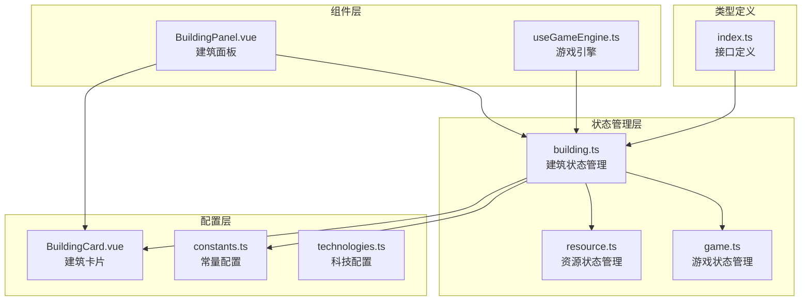
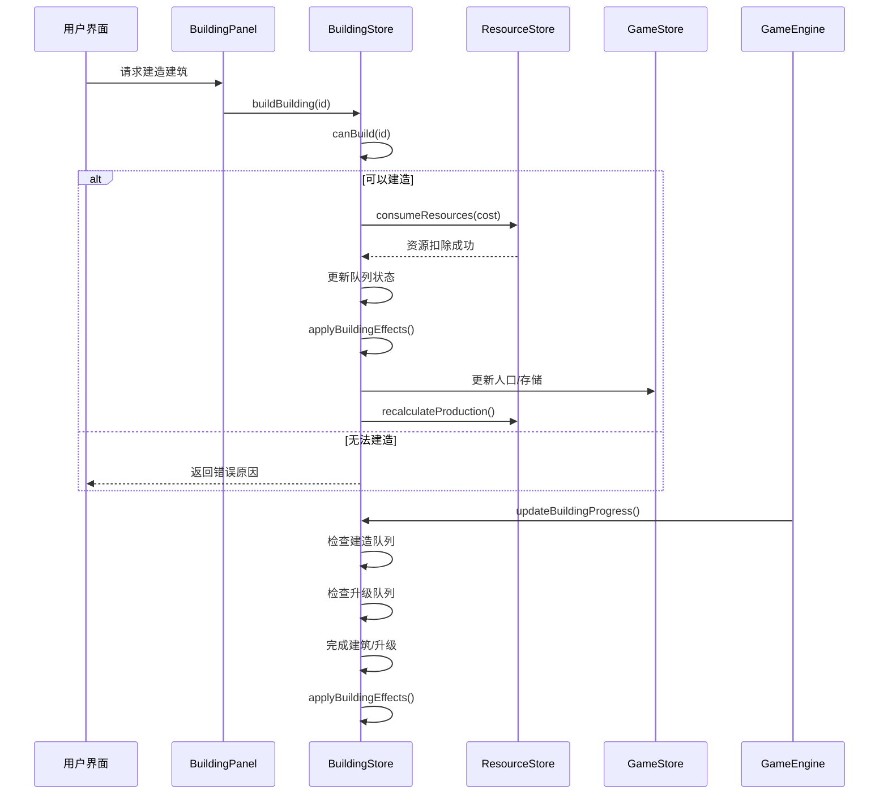
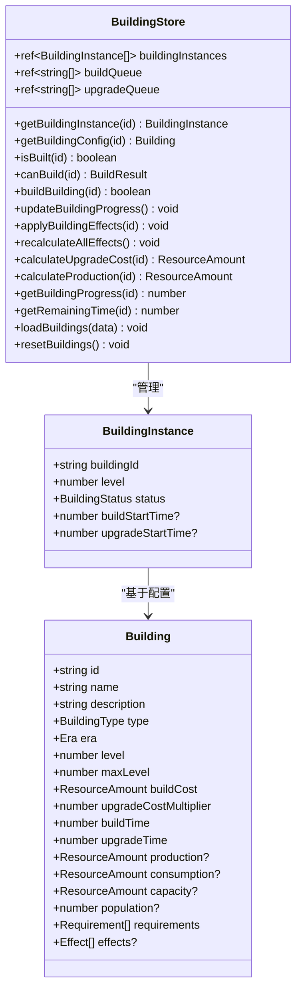
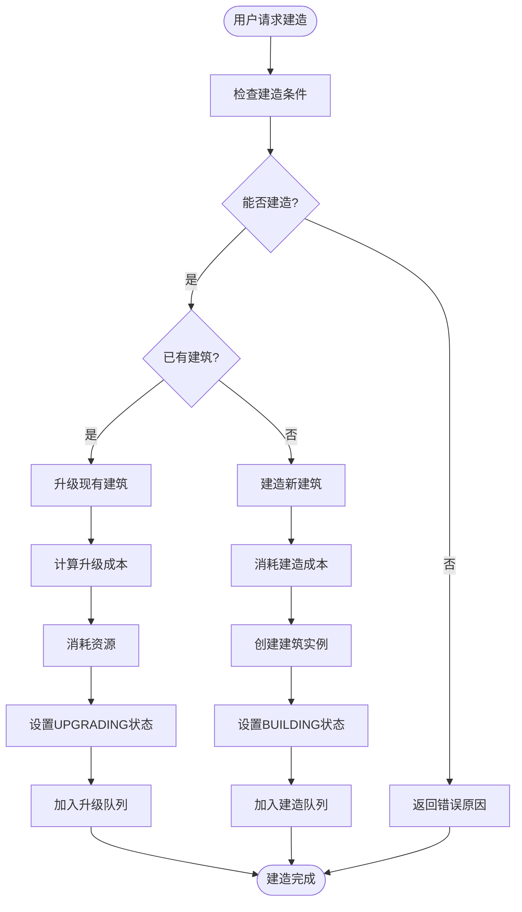
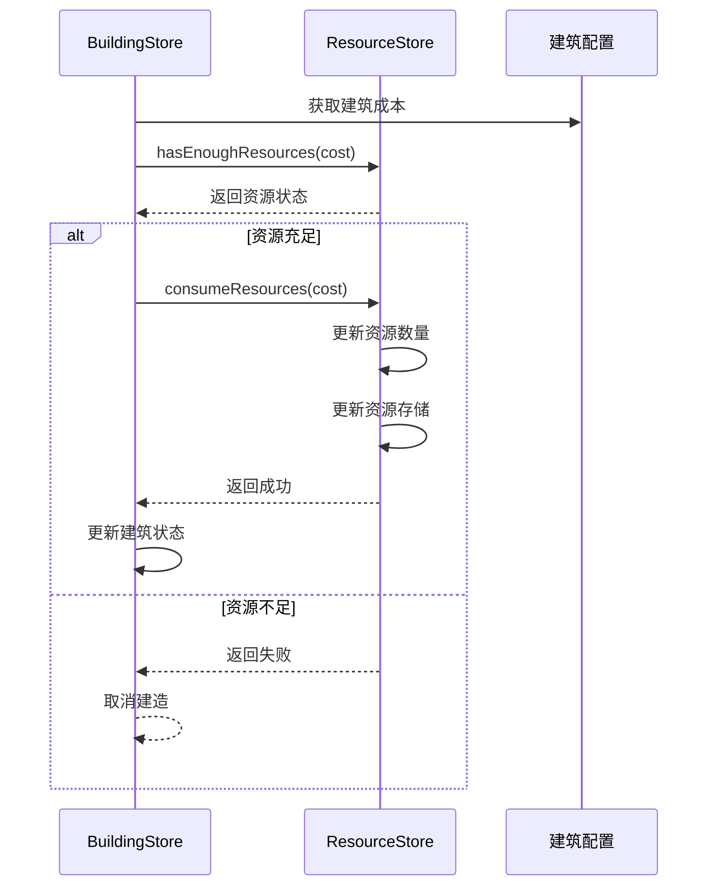
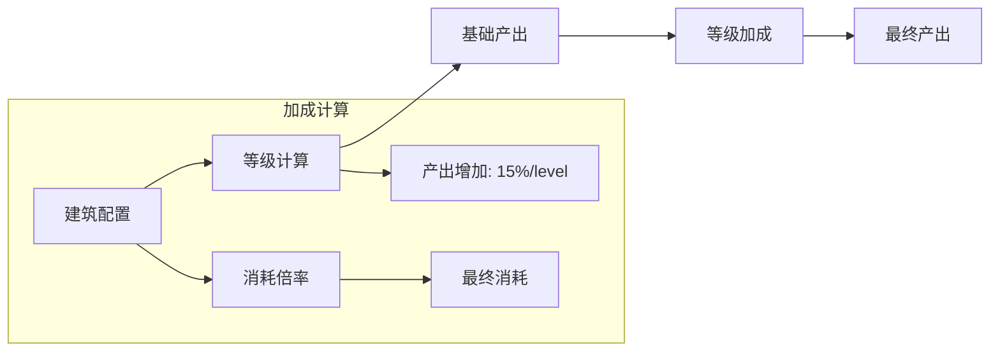
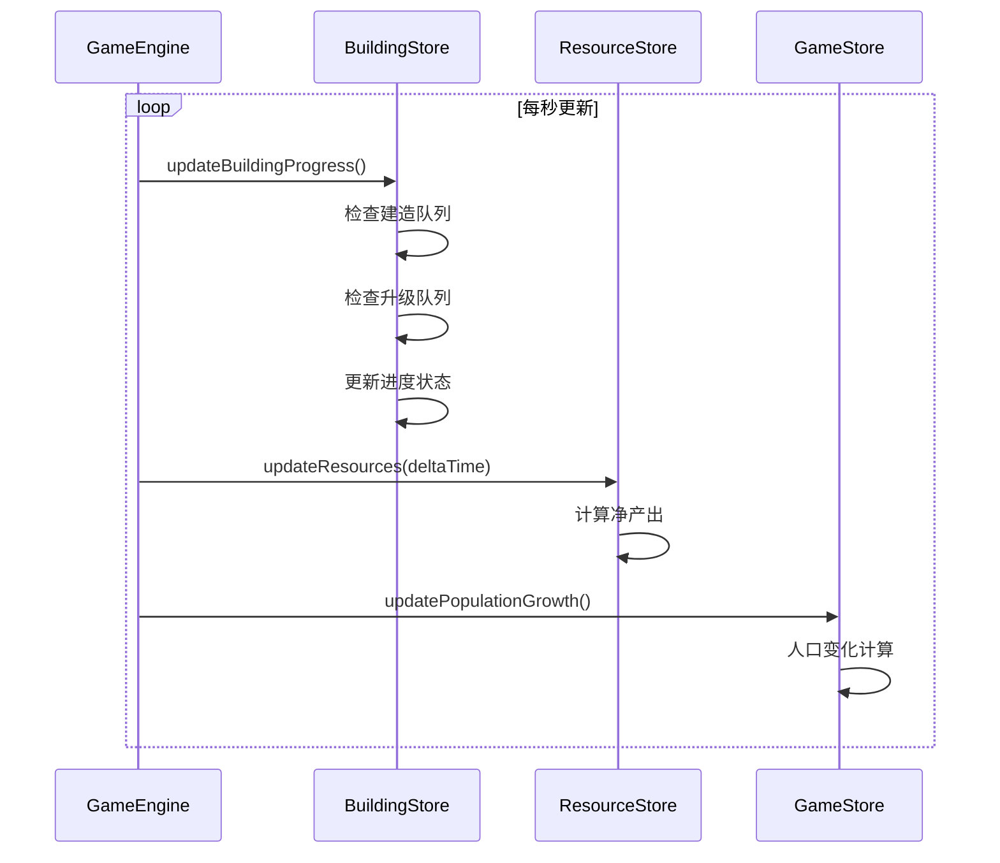
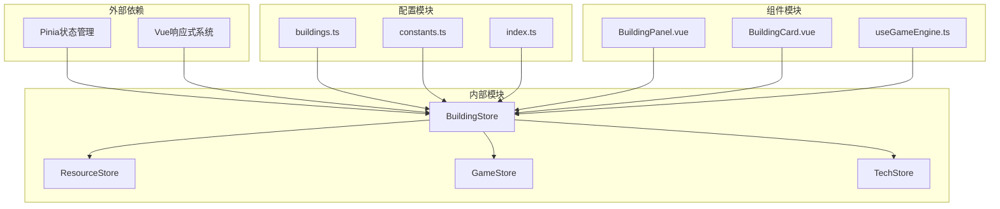
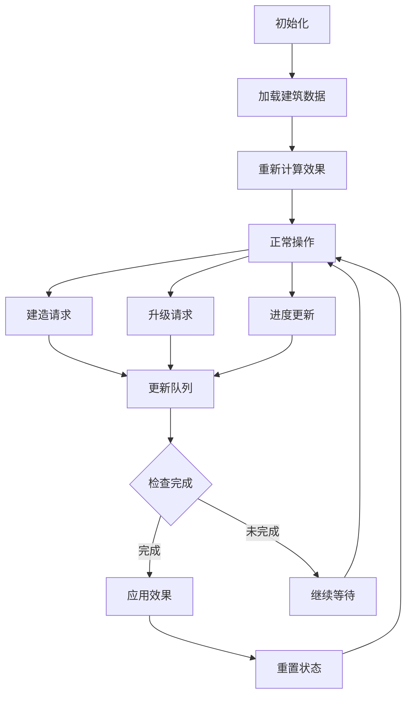
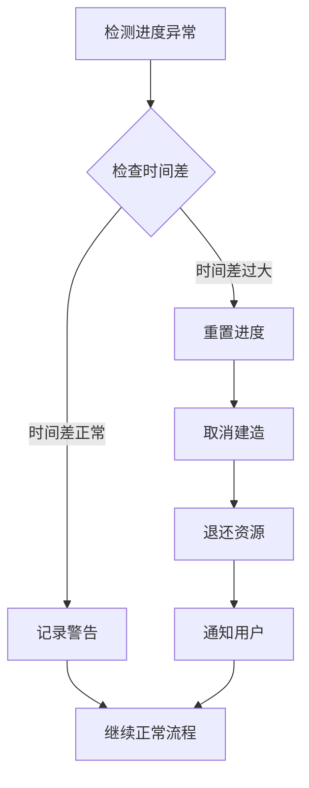

# 建筑状态管理

<cite>
**本文档引用的文件**
- [building.ts](file://civilization-game/src/stores/building.ts)
- [buildings.ts](file://civilization-game/src/config/buildings.ts)
- [resource.ts](file://civilization-game/src/stores/resource.ts)
- [useGameEngine.ts](file://civilization-game/src/composables/useGameEngine.ts)
- [BuildingPanel.vue](file://civilization-game/src/components/game/BuildingPanel.vue)
- [index.ts](file://civilization-game/src/types/index.ts)
- [constants.ts](file://civilization-game/src/config/constants.ts)
</cite>

## 目录
1. [简介](#简介)
2. [项目结构概览](#项目结构概览)
3. [核心组件分析](#核心组件分析)
4. [架构概览](#架构概览)
5. [详细组件分析](#详细组件分析)
6. [依赖关系分析](#依赖关系分析)
7. [性能考虑](#性能考虑)
8. [故障排除指南](#故障排除指南)
9. [结论](#结论)

## 简介

建筑状态管理系统是文明模拟游戏的核心组件之一，负责管理游戏中所有建筑的状态、建造进度、升级过程以及资源消耗。该系统通过Pinia状态管理库实现，提供了完整的建筑生命周期管理功能，包括建造、升级、效果应用和状态同步。

系统采用模块化设计，将建筑配置与实例状态分离，支持多种建筑类型（生产、存储、人口、功能等），并实现了复杂的依赖关系检查机制。通过与资源存储和游戏引擎的紧密集成，确保了游戏状态的一致性和实时性。

## 项目结构概览

建筑状态管理系统由以下核心文件组成：



**图表来源**
- [building.ts](file://civilization-game/src/stores/building.ts#L1-L320)
- [resource.ts](file://civilization-game/src/stores/resource.ts#L1-L202)
- [useGameEngine.ts](file://civilization-game/src/composables/useGameEngine.ts#L1-L143)

**章节来源**
- [building.ts](file://civilization-game/src/stores/building.ts#L1-L320)
- [buildings.ts](file://civilization-game/src/config/buildings.ts#L1-L2419)

## 核心组件分析

### 建筑实例结构设计

建筑系统的核心是`BuildingInstance`接口，它定义了每个建筑实例的基本状态：

```typescript
interface BuildingInstance {
  buildingId: string
  level: number
  status: BuildingStatus
  buildStartTime?: number
  upgradeStartTime?: number
}
```

这种设计允许：
- **唯一标识**：通过`buildingId`关联到配置表
- **等级管理**：支持多级建筑升级
- **状态跟踪**：实时跟踪建造和升级进度
- **时间记录**：精确记录开始时间用于进度计算

### 建筑状态枚举

系统定义了四种主要状态：

```typescript
enum BuildingStatus {
  LOCKED = 'locked',      // 锁定状态：未解锁或不可建造
  AVAILABLE = 'available', // 可用状态：已解锁但未建造
  BUILDING = 'building',   // 建造中：正在建造过程中
  BUILT = 'built',        // 已建成：正常运行状态
  UPGRADING = 'upgrading' // 升级中：正在升级过程中
}
```

**章节来源**
- [index.ts](file://civilization-game/src/types/index.ts#L45-L55)
- [building.ts](file://civilization-game/src/stores/building.ts#L1-L50)

## 架构概览

建筑状态管理系统采用分层架构设计，确保了模块间的松耦合和高内聚：



**图表来源**
- [building.ts](file://civilization-game/src/stores/building.ts#L100-L150)
- [useGameEngine.ts](file://civilization-game/src/composables/useGameEngine.ts#L40-L80)

## 详细组件分析

### BuildingStore 核心功能

BuildingStore是整个建筑系统的核心，提供了完整的状态管理和业务逻辑：

#### 状态管理



**图表来源**
- [building.ts](file://civilization-game/src/stores/building.ts#L10-L50)
- [index.ts](file://civilization-game/src/types/index.ts#L56-L85)

#### 建造流程管理

建造系统实现了复杂的状态转换和进度跟踪：



**图表来源**
- [building.ts](file://civilization-game/src/stores/building.ts#L100-L150)

#### 资源消耗联动机制

BuildingStore与ResourceStore通过紧密的协作实现资源管理：



**图表来源**
- [building.ts](file://civilization-game/src/stores/building.ts#L100-L130)
- [resource.ts](file://civilization-game/src/stores/resource.ts#L60-L90)

**章节来源**
- [building.ts](file://civilization-game/src/stores/building.ts#L100-L200)
- [resource.ts](file://civilization-game/src/stores/resource.ts#L60-L120)

### 建筑配置系统

建筑配置系统提供了丰富的建筑定义能力：

#### 建筑类型分类

```typescript
enum BuildingType {
  PRODUCTION = 'production',  // 资源生产
  STORAGE = 'storage',        // 资源存储
  POPULATION = 'population',  // 人口
  TECHNOLOGY = 'technology',  // 科技
  FUNCTIONAL = 'functional',  // 功能
  SPECIAL = 'special'         // 特殊
}
```

#### 建筑效果系统

建筑支持多种效果类型：

```typescript
interface Effect {
  type: 'resourceMultiplier' | 'buildSpeedBonus' | 'researchSpeedBonus' | 'populationGrowth'
  target?: ResourceType | string
  value: number
}
```

**章节来源**
- [index.ts](file://civilization-game/src/types/index.ts#L30-L50)
- [buildings.ts](file://civilization-game/src/config/buildings.ts#L1-L100)

### 资源存储系统集成

资源存储系统为建筑提供基础的数据支撑：

#### 资源产出计算



**图表来源**
- [building.ts](file://civilization-game/src/stores/building.ts#L84-L100)
- [constants.ts](file://civilization-game/src/config/constants.ts#L30-L40)

**章节来源**
- [resource.ts](file://civilization-game/src/stores/resource.ts#L150-L200)

### 游戏引擎集成

建筑系统与游戏引擎紧密集成，实现实时状态更新：

#### 游戏循环集成



**图表来源**
- [useGameEngine.ts](file://civilization-game/src/composables/useGameEngine.ts#L40-L80)
- [building.ts](file://civilization-game/src/stores/building.ts#L130-L180)

**章节来源**
- [useGameEngine.ts](file://civilization-game/src/composables/useGameEngine.ts#L40-L100)

## 依赖关系分析

建筑状态管理系统具有清晰的依赖层次结构：



**图表来源**
- [building.ts](file://civilization-game/src/stores/building.ts#L1-L10)
- [useGameEngine.ts](file://civilization-game/src/composables/useGameEngine.ts#L1-L10)

**章节来源**
- [building.ts](file://civilization-game/src/stores/building.ts#L1-L20)
- [useGameEngine.ts](file://civilization-game/src/composables/useGameEngine.ts#L1-L20)

## 性能考虑

### 状态更新优化

系统采用了多种性能优化策略：

1. **增量更新**：只更新发生变化的建筑状态
2. **队列管理**：使用队列而非轮询减少CPU占用
3. **条件检查**：在更新前进行状态验证
4. **批量处理**：一次性处理多个建筑状态

### 内存管理



**图表来源**
- [building.ts](file://civilization-game/src/stores/building.ts#L130-L180)

### 异常恢复机制

系统具备完善的异常处理和恢复能力：

- **状态一致性检查**：定期验证建筑状态完整性
- **进度补偿**：长时间离线后的进度补偿
- **资源回滚**：建造失败时的资源回滚
- **队列清理**：无效队列项的自动清理

## 故障排除指南

### 常见问题诊断

#### 建造失败问题

1. **检查资源充足性**
   ```typescript
   // 检查资源是否足够
   const hasResources = resourceStore.hasEnoughResources(buildCost)
   ```

2. **验证建筑条件**
   ```typescript
   // 检查建筑是否已达到最大等级
   const instance = buildingStore.getBuildingInstance(buildingId)
   if (instance && instance.level >= config.maxLevel) {
     return { can: false, reason: '已达到最大等级' }
   }
   ```

3. **确认时代要求**
   ```typescript
   // 检查时代解锁条件
   if (gameStore.currentEra !== requiredEra) {
     return { can: false, reason: `需要${requiredEra}时代` }
   }
   ```

#### 进度异常处理

当建筑进度出现异常时，系统会自动进行恢复：



**章节来源**
- [building.ts](file://civilization-game/src/stores/building.ts#L130-L180)

### 性能监控

系统内置了性能监控机制：

```typescript
// FPS监控
if (currentTime - fpsLastTime >= 1000) {
  currentFPS = frameCount
  frameCount = 0
  fpsLastTime = currentTime
  
  if (currentFPS < 50) {
    console.warn(`Low FPS detected: ${currentFPS}, consider performance optimization`)
  }
}
```

## 结论

建筑状态管理系统是一个设计精良、功能完备的游戏核心组件。它通过模块化的架构设计、清晰的职责分离和完善的错误处理机制，为文明模拟游戏提供了可靠的建筑管理基础。

### 主要优势

1. **模块化设计**：清晰的职责分离和低耦合度
2. **状态管理**：完整的生命周期管理和状态转换
3. **资源联动**：与资源系统的深度集成
4. **性能优化**：高效的队列管理和增量更新
5. **扩展性强**：易于添加新的建筑类型和效果

### 改进建议

1. **缓存优化**：增加配置缓存减少重复查询
2. **批量操作**：支持批量建造和升级操作
3. **异步处理**：对于大型操作考虑异步处理
4. **调试工具**：增加开发时的调试和监控工具

该系统为游戏开发者提供了一个坚实的基础，能够支持复杂的文明模拟需求，同时保持良好的可维护性和扩展性。