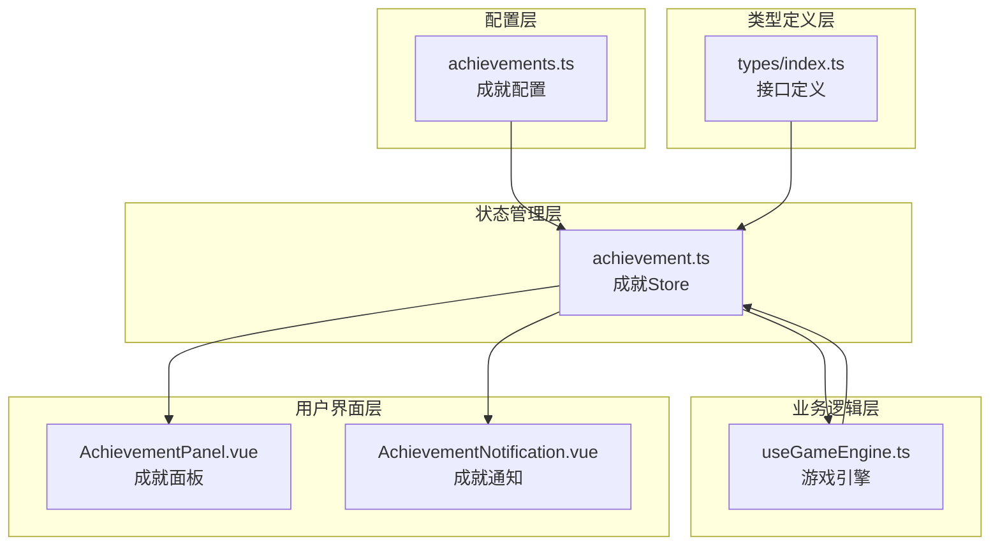
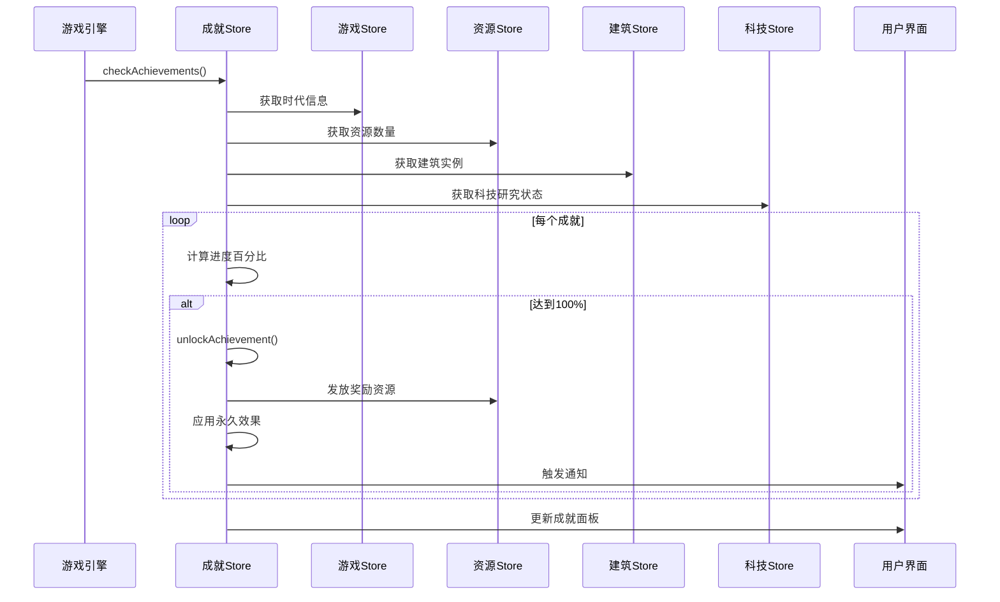
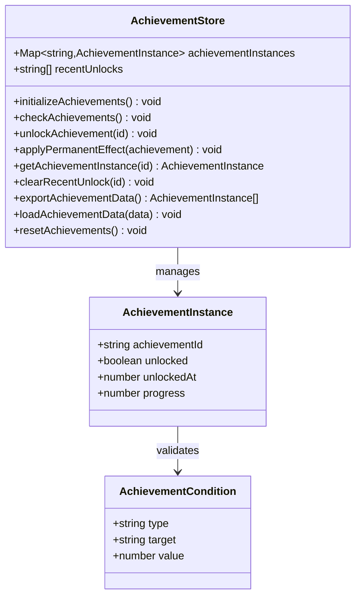
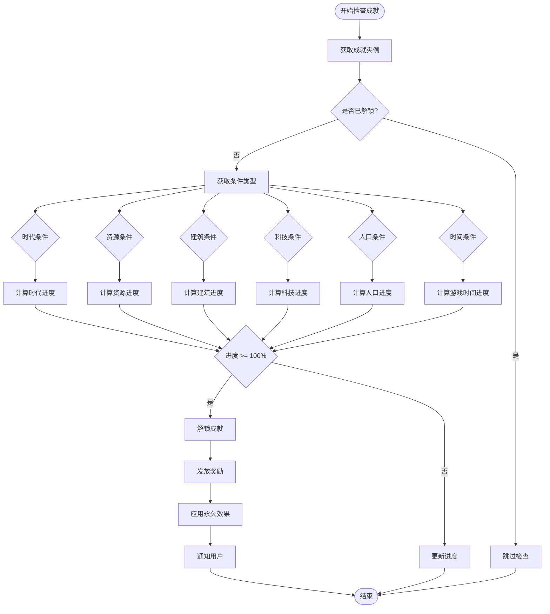
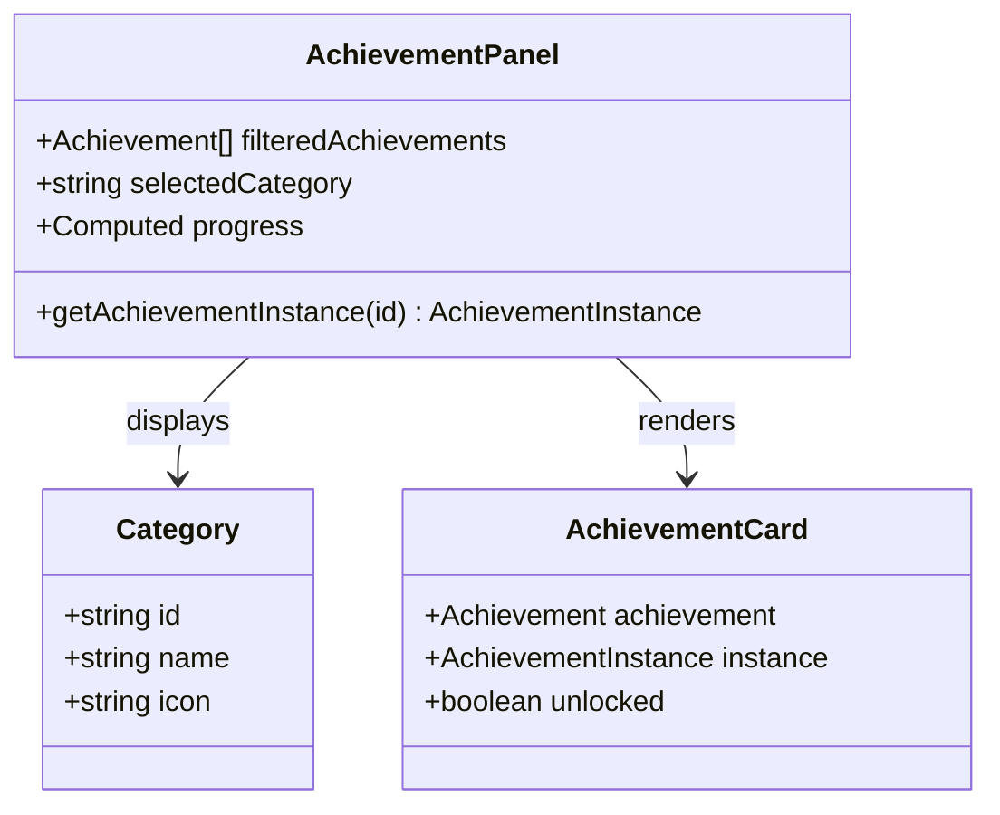
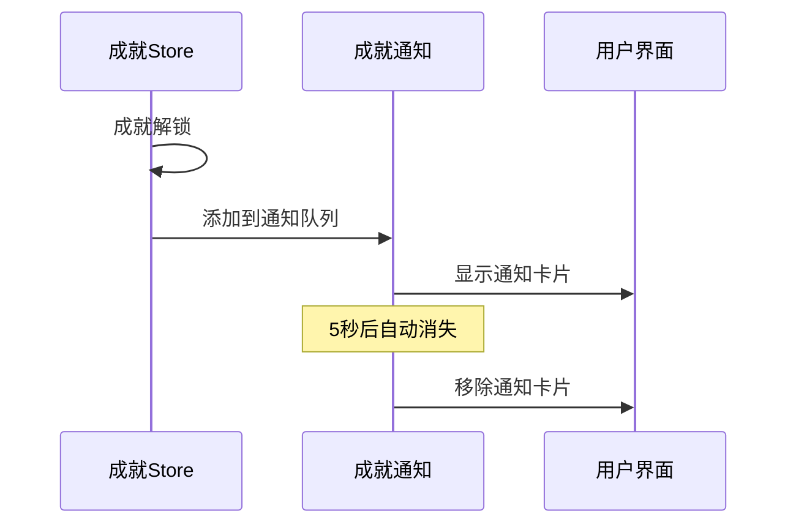
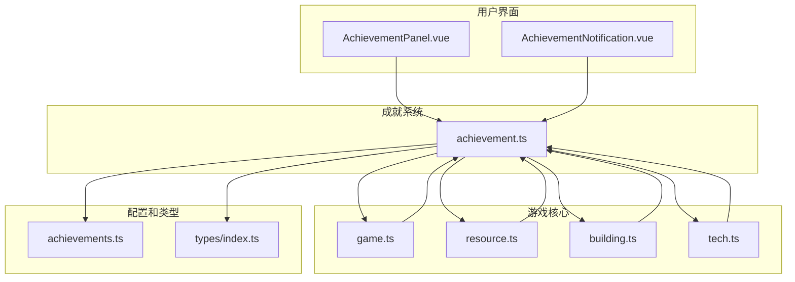

# 成就状态管理

<cite>
**本文档引用的文件**
- [achievements.ts](file://civilization-game/src/config/achievements.ts)
- [achievement.ts](file://civilization-game/src/stores/achievement.ts)
- [types/index.ts](file://civilization-game/src/types/index.ts)
- [useGameEngine.ts](file://civilization-game/src/composables/useGameEngine.ts)
- [AchievementPanel.vue](file://civilization-game/src/components/game/AchievementPanel.vue)
- [AchievementNotification.vue](file://civilization-game/src/components/game/AchievementNotification.vue)
</cite>

## 目录
1. [简介](#简介)
2. [项目结构](#项目结构)
3. [核心组件](#核心组件)
4. [架构概览](#架构概览)
5. [详细组件分析](#详细组件分析)
6. [依赖关系分析](#依赖关系分析)
7. [性能考虑](#性能考虑)
8. [故障排除指南](#故障排除指南)
9. [结论](#结论)

## 简介

成就状态管理系统是文明游戏的核心功能之一，负责跟踪玩家的游戏进度、解锁成就以及发放相应的奖励。该系统采用基于配置的成就定义方式，支持多种类型的成就条件检查，并通过响应式状态管理确保实时更新。

系统的主要功能包括：
- 成就配置的集中管理
- 实时成就条件检查
- 进度追踪和奖励发放
- 永久效果应用
- 用户界面展示
- 数据持久化

## 项目结构

成就系统的核心文件组织如下：



**图表来源**
- [achievements.ts](file://civilization-game/src/config/achievements.ts#L1-L755)
- [achievement.ts](file://civilization-game/src/stores/achievement.ts#L1-L278)
- [types/index.ts](file://civilization-game/src/types/index.ts#L1-L198)

## 核心组件

### 成就配置系统

成就配置系统通过`achievements.ts`文件定义了30个基础成就，每个成就都包含以下关键属性：

- **基本信息**：ID、名称、描述、图标
- **分类**：进度、资源、建筑、科技、人口、特殊
- **条件**：类型、目标值、具体参数
- **奖励**：资源奖励和永久效果

### 成就状态存储

成就状态存储通过Pinia Store实现，主要包含以下核心状态：

- `achievementInstances`：Map结构存储所有成就实例
- `recentUnlocks`：最近解锁的成就ID列表
- 计算属性：已解锁成就、未解锁成就、进度统计

**章节来源**
- [achievements.ts](file://civilization-game/src/config/achievements.ts#L1-L755)
- [achievement.ts](file://civilization-game/src/stores/achievement.ts#L1-L278)

## 架构概览

成就系统采用分层架构设计，确保职责分离和可维护性：



**图表来源**
- [achievement.ts](file://civilization-game/src/stores/achievement.ts#L50-L150)
- [useGameEngine.ts](file://civilization-game/src/composables/useGameEngine.ts#L70-L80)

## 详细组件分析

### 成就配置模块

成就配置模块定义了完整的成就数据结构和验证逻辑：

```typescript
interface Achievement {
  id: string
  name: string
  description: string
  icon: string
  category: 'progress' | 'resource' | 'building' | 'technology' | 'population' | 'special'
  condition: AchievementCondition
  reward: ResourceAmount
  permanentEffect?: Effect
}
```

成就类型分为六个类别：
- **进度类**：时代进展、游戏时长等
- **资源类**：累计资源收集量
- **建筑类**：建筑建造数量和等级
- **科技类**：科技研究数量
- **人口类**：人口数量
- **特殊类**：组合条件成就

### 成就状态管理器

成就状态管理器是系统的核心，负责：



**图表来源**
- [achievement.ts](file://civilization-game/src/stores/achievement.ts#L10-L50)
- [types/index.ts](file://civilization-game/src/types/index.ts#L140-L170)

### 条件检查机制

成就条件检查采用策略模式，根据不同条件类型执行相应的检查逻辑：



**图表来源**
- [achievement.ts](file://civilization-game/src/stores/achievement.ts#L50-L150)

### 用户界面集成

成就系统通过两个主要组件向用户提供交互界面：

#### 成就面板组件

成就面板提供完整的成就浏览和进度查看功能：



**图表来源**
- [AchievementPanel.vue](file://civilization-game/src/components/game/AchievementPanel.vue#L1-L50)

#### 成就通知组件

成就通知组件提供即时的成就解锁反馈：



**图表来源**
- [AchievementNotification.vue](file://civilization-game/src/components/game/AchievementNotification.vue#L20-L40)

**章节来源**
- [achievement.ts](file://civilization-game/src/stores/achievement.ts#L1-L278)
- [AchievementPanel.vue](file://civilization-game/src/components/game/AchievementPanel.vue#L1-L198)
- [AchievementNotification.vue](file://civilization-game/src/components/game/AchievementNotification.vue#L1-L204)

## 依赖关系分析

成就系统与其他游戏模块存在复杂的依赖关系：



**图表来源**
- [achievement.ts](file://civilization-game/src/stores/achievement.ts#L1-L10)
- [useGameEngine.ts](file://civilization-game/src/composables/useGameEngine.ts#L1-L10)

### 关键依赖说明

1. **游戏状态依赖**：成就系统依赖游戏当前时代、人口、游戏时间等状态
2. **资源状态依赖**：需要访问资源数量和存储上限
3. **建筑状态依赖**：需要获取建筑实例和配置信息
4. **科技状态依赖**：需要跟踪科技研究进度

**章节来源**
- [achievement.ts](file://civilization-game/src/stores/achievement.ts#L1-L10)
- [useGameEngine.ts](file://civilization-game/src/composables/useGameEngine.ts#L1-L10)

## 性能考虑

### 成就检查频率优化

成就系统采用智能检查策略，避免频繁的性能开销：

```typescript
// 每10秒检查一次成就，而不是每帧检查
achievementCheckCounter += deltaTime
if (achievementCheckCounter >= 10) {
  achievementStore.checkAchievements()
  achievementCheckCounter = 0
}
```

### 进度计算优化

- 使用`Math.min()`确保进度百分比不超过100%
- 采用早期返回策略避免不必要的计算
- 缓存计算结果减少重复运算

### 内存管理

- 使用Map结构存储成就实例，提供高效的查找性能
- 限制最近解锁通知数量为5个，防止内存泄漏
- 实现适当的清理机制

## 故障排除指南

### 常见问题及解决方案

#### 成就无法解锁

**可能原因**：
1. 条件检查逻辑错误
2. 状态同步问题
3. 数据持久化失败

**调试步骤**：
1. 检查成就实例的状态
2. 验证条件检查逻辑
3. 查看控制台日志输出
4. 检查数据持久化状态

#### 进度显示不正确

**可能原因**：
1. 资源数量计算错误
2. 类型转换问题
3. 浮点数精度问题

**解决方案**：
1. 使用`Math.min()`限制进度范围
2. 确保正确的类型转换
3. 实现适当的数值处理

#### 性能问题

**症状**：游戏运行缓慢，特别是成就检查时

**优化措施**：
1. 减少检查频率
2. 实现更高效的条件检查算法
3. 使用缓存机制

### 调试工具和技巧

#### 控制台日志

系统会在控制台输出详细的调试信息：

```typescript
console.log(`🏆 成就解锁: ${achievement.name}`)
console.warn(`Low FPS detected: ${currentFPS}, consider performance optimization`)
```

#### 状态监控

通过Vue DevTools可以监控成就状态的变化：

```typescript
// 在开发环境中启用调试模式
if (process.env.NODE_ENV === 'development') {
  console.log('Achievement state:', achievementStore.achievementInstances.value)
}
```

**章节来源**
- [achievement.ts](file://civilization-game/src/stores/achievement.ts#L150-L200)
- [useGameEngine.ts](file://civilization-game/src/composables/useGameEngine.ts#L30-L50)

## 结论

成就状态管理系统是一个设计精良、功能完善的模块，具有以下特点：

### 主要优势

1. **模块化设计**：清晰的职责分离和良好的封装
2. **可扩展性**：基于配置的成就定义便于添加新成就
3. **性能优化**：智能的检查策略和优化的计算逻辑
4. **用户体验**：及时的反馈和直观的界面展示
5. **数据持久化**：完整的存档和恢复机制

### 改进建议

1. **批量处理**：对于大量成就，可以考虑批量检查优化
2. **条件缓存**：对复杂条件进行缓存以提高性能
3. **异步处理**：对于耗时的成就检查，可以考虑异步处理
4. **测试覆盖**：增加单元测试和集成测试覆盖率

### 最佳实践

1. **遵循单一职责原则**：每个成就只负责一个明确的目标
2. **保持状态一致性**：确保成就状态与游戏状态同步
3. **提供清晰的反馈**：让用户清楚地知道如何达成成就
4. **考虑性能影响**：避免过于频繁的成就检查

成就系统作为游戏的核心激励机制，其设计充分体现了现代游戏开发的最佳实践，为玩家提供了丰富的游戏体验和持续的挑战目标。