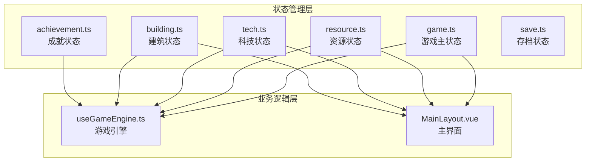
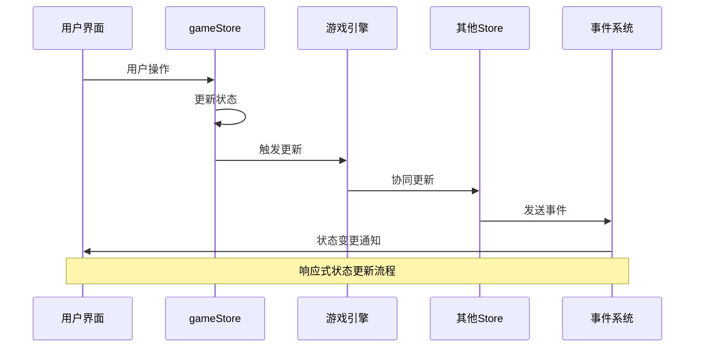
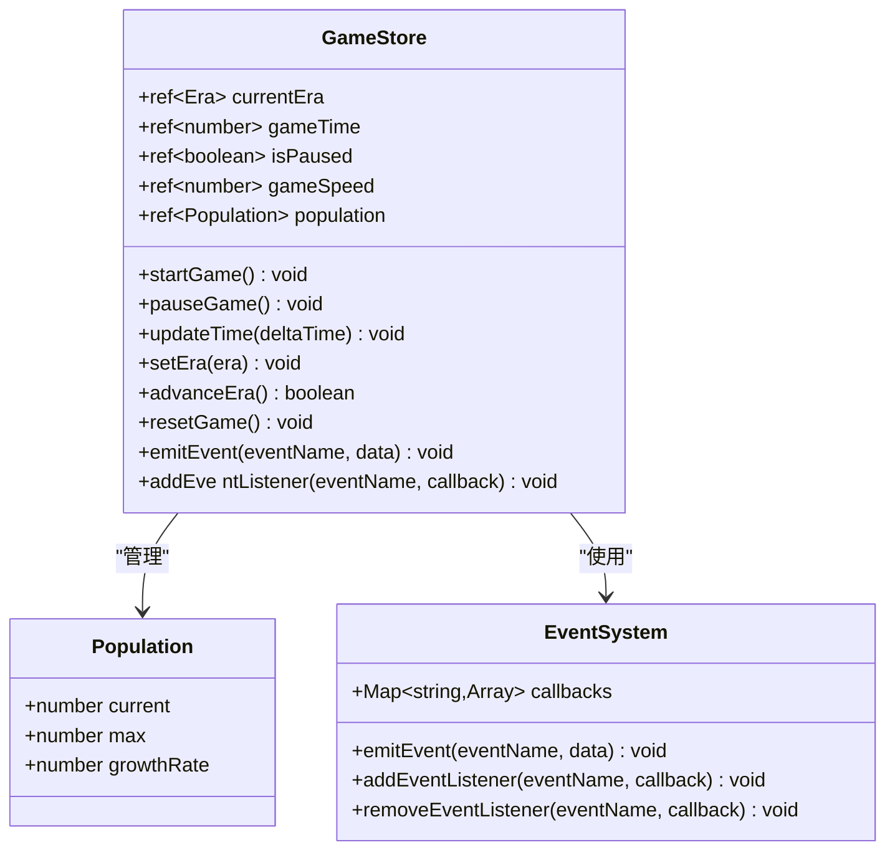
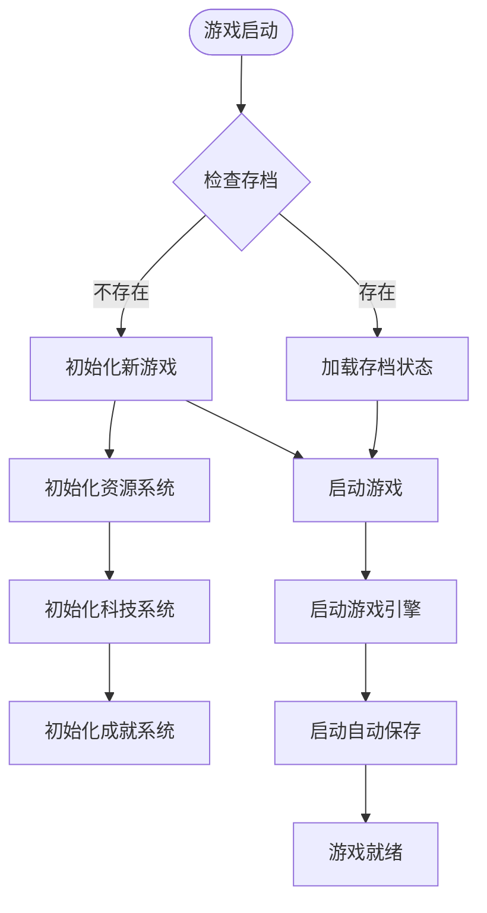
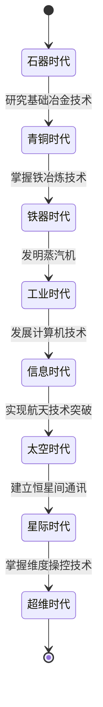
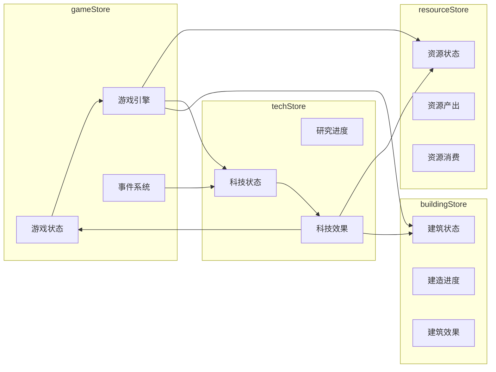

# 游戏状态管理

<cite>
**本文档引用的文件**
- [game.ts](file://civilization-game/src/stores/game.ts)
- [MainLayout.vue](file://civilization-game/src/components/game/MainLayout.vue)
- [useGameEngine.ts](file://civilization-game/src/composables/useGameEngine.ts)
- [resource.ts](file://civilization-game/src/stores/resource.ts)
- [tech.ts](file://civilization-game/src/stores/tech.ts)
- [constants.ts](file://civilization-game/src/config/constants.ts)
- [types/index.ts](file://civilization-game/src/types/index.ts)
- [App.vue](file://civilization-game/src/App.vue)
</cite>

## 目录
1. [简介](#简介)
2. [项目结构](#项目结构)
3. [核心状态字段](#核心状态字段)
4. [架构概览](#架构概览)
5. [详细组件分析](#详细组件分析)
6. [状态交互关系](#状态交互关系)
7. [性能考虑](#性能考虑)
8. [故障排除指南](#故障排除指南)
9. [结论](#结论)

## 简介

本游戏采用基于Pinia的状态管理系统，通过集中式的gameStore作为全局状态中枢，协调各个子系统的状态流转。gameStore负责管理游戏的核心状态，包括时代进程、游戏时间、人口动态等关键要素，为整个游戏提供统一的状态管理机制。

## 项目结构

游戏状态管理模块位于`src/stores/`目录下，包含多个专门的store模块：



**图表来源**
- [game.ts](file://civilization-game/src/stores/game.ts#L1-L268)
- [useGameEngine.ts](file://civilization-game/src/composables/useGameEngine.ts#L1-L143)

## 核心状态字段

### 主要状态变量

gameStore定义了以下核心状态字段：

```typescript
// 游戏时代状态
const currentEra = ref<Era>(Era.STONE)
const gameTime = ref(0)
const lastSaveTime = ref(Date.now())
const lastPlayTime = ref(Date.now())

// 游戏控制状态
const isPaused = ref(false)
const gameSpeed = ref(1.0)

// 人口状态
const population = ref({
  current: POPULATION.initialPopulation,
  max: POPULATION.initialMaxPopulation,
  growthRate: POPULATION.baseGrowthRate
})

// 离线状态
const offlineTime = ref<number>(0)
const showOfflineModal = ref<boolean>(false)
```

### 状态字段详解

**currentEra**: 当前游戏时代，支持从石器时代到超维时代的八个时代阶段，每个时代都有独特的特征和解锁内容。

**gameTime**: 游戏总运行时间，以秒为单位，用于计算各种时间相关的系统。

**population**: 人口状态对象，包含当前人口数、最大人口数和人口增长率三个关键属性。

**isPaused**: 游戏暂停标志，控制游戏逻辑的执行与否。

**gameSpeed**: 游戏速度倍率，支持0.5x到4x的不同游戏速度设置。

**section sources**
- [game.ts](file://civilization-game/src/stores/game.ts#L8-L25)
- [constants.ts](file://civilization-game/src/config/constants.ts#L35-L45)

## 架构概览

游戏状态管理采用分层架构设计，通过Pinia store实现状态的集中管理和响应式更新：



**图表来源**
- [game.ts](file://civilization-game/src/stores/game.ts#L100-L120)
- [useGameEngine.ts](file://civilization-game/src/composables/useGameEngine.ts#L40-L80)

## 详细组件分析

### gameStore核心功能

gameStore提供了完整的游戏状态管理功能，包括状态初始化、更新、重置和事件处理：



**图表来源**
- [game.ts](file://civilization-game/src/stores/game.ts#L8-L268)

### 状态初始化过程

游戏启动时的状态初始化遵循严格的顺序：



**图表来源**
- [App.vue](file://civilization-game/src/App.vue#L15-L50)

### 状态重置逻辑

gameStore提供了完整的状态重置功能，确保游戏能够正确恢复到初始状态：

```typescript
function resetGame() {
  currentEra.value = Era.STONE
  gameTime.value = 0
  lastSaveTime.value = Date.now()
  lastPlayTime.value = Date.now()
  isPaused.value = false
  gameSpeed.value = 1.0
  population.value = {
    current: POPULATION.initialPopulation,
    max: POPULATION.initialMaxPopulation,
    growthRate: POPULATION.baseGrowthRate
  }
}
```

**section sources**
- [game.ts](file://civilization-game/src/stores/game.ts#L220-L235)

### 时代变迁机制

游戏支持八个时代的自然演进，每个时代都有特定的解锁条件和特征：



**图表来源**
- [game.ts](file://civilization-game/src/stores/game.ts#L120-L150)

**section sources**
- [game.ts](file://civilization-game/src/stores/game.ts#L120-L170)

## 状态交互关系

### gameStore与其他Store的协作

gameStore作为全局状态中枢，与各个子系统store保持紧密的协作关系：



**图表来源**
- [useGameEngine.ts](file://civilization-game/src/composables/useGameEngine.ts#L1-L10)
- [tech.ts](file://civilization-game/src/stores/tech.ts#L380-L400)

### 事件驱动的状态同步

gameStore通过事件系统实现跨store的状态同步：

```typescript
// 科技效果应用时触发事件
function applyTechEffects(tech: Technology) {
  tech.effects.forEach(effect => {
    switch (effect.type) {
      case 'buildSpeedBonus':
        gameStore.emitEvent('techEffectApplied', {
          type: 'buildSpeedBonus',
          value: effect.value
        })
        break
      case 'populationGrowth':
        gameStore.emitEvent('techEffectApplied', {
          type: 'populationGrowth',
          value: effect.value
        })
        break
    }
  })
}
```

**section sources**
- [tech.ts](file://civilization-game/src/stores/tech.ts#L380-L410)

### MainLayout中的gameStore使用

MainLayout组件展示了gameStore在实际界面中的使用方式：

```typescript
// 在模板中直接访问gameStore状态
<div class="text-gray-300 text-xs md:text-sm">
  {{ gameStore.formattedGameTime }}
</div>

// 使用计算属性获取时代名称
const eraName = computed(() => {
  const eraNames: Record<Era, string> = {
    [Era.STONE]: '石器时代',
    [Era.BRONZE]: '青铜时代',
    [Era.IRON]: '铁器时代',
    [Era.INDUSTRIAL]: '工业时代',
    [Era.INFORMATION]: '信息时代',
    [Era.SPACE]: '太空时代',
    [Era.INTERSTELLAR]: '星际时代',
    [Era.HYPERDIMENSIONAL]: '超维时代'
  }
  return eraNames[gameStore.currentEra]
})
```

**section sources**
- [MainLayout.vue](file://civilization-game/src/components/game/MainLayout.vue#L200-L275)

## 性能考虑

### 游戏引擎性能优化

useGameEngine实现了高效的帧率控制和性能监控机制：

```typescript
function gameLoop(currentTime: number) {
  const deltaTime = currentTime - lastUpdateTime
  lastUpdateTime = currentTime
  accumulator += deltaTime
  
  // FPS计算
  frameCount++
  if (currentTime - fpsLastTime >= 1000) {
    currentFPS = frameCount
    frameCount = 0
    fpsLastTime = currentTime
    
    // 性能警告
    if (currentFPS < 50) {
      console.warn(`Low FPS detected: ${currentFPS}, consider performance optimization`)
    }
  }
  
  // 避免帧跳过导致的卡顿
  const maxAccumulator = GAME_TICK_INTERVAL * 3
  if (accumulator > maxAccumulator) {
    console.warn(`Frame skip: accumulator ${accumulator}ms exceeded limit`)
    accumulator = maxAccumulator
  }
}
```

### 状态更新频率控制

游戏状态更新采用固定的时间间隔，避免频繁的状态变更：

- **GAME_TICK_INTERVAL**: 1000ms (1秒)的游戏循环间隔
- **AUTO_SAVE_INTERVAL**: 30000ms (30秒)的自动保存间隔
- **ACHIEVEMENT_CHECK_INTERVAL**: 5000ms (5秒)的成就检测间隔

**section sources**
- [useGameEngine.ts](file://civilization-game/src/composables/useGameEngine.ts#L20-L50)
- [constants.ts](file://civilization-game/src/config/constants.ts#L6-L10)

## 故障排除指南

### 常见状态不同步问题

**问题**: 游戏界面显示与实际状态不一致

**排查步骤**:
1. 检查gameStore的状态值是否正确更新
2. 验证事件监听器是否正常工作
3. 确认其他store是否正确响应gameStore的事件

**解决方案**:
```typescript
// 添加调试日志
console.log('Current Era:', gameStore.currentEra.value)
console.log('Game Time:', gameStore.gameTime.value)
console.log('Population:', gameStore.population.value)
```

### 离线收益异常

**问题**: 离线收益计算错误或不生效

**排查步骤**:
1. 检查offlineTime状态是否正确设置
2. 验证离线收益计算逻辑
3. 确认showOfflineModal状态切换

**解决方案**:
```typescript
// 检查离线时间设置
function setOfflineTime(time: number) {
  offlineTime.value = time
  if (time > 60) { // 超过1分钟
    showOfflineModal.value = true
  }
}
```

### 性能问题诊断

**问题**: 游戏运行时出现卡顿或帧率下降

**排查步骤**:
1. 监控FPS指标
2. 检查累积的deltaTime值
3. 分析事件处理函数的复杂度

**解决方案**:
```typescript
// 性能监控改进
if (currentFPS < 30) {
  console.warn('Critical performance issue detected')
  // 实施性能优化措施
}
```

**section sources**
- [useGameEngine.ts](file://civilization-game/src/composables/useGameEngine.ts#L25-L45)
- [game.ts](file://civilization-game/src/stores/game.ts#L240-L250)

## 结论

本游戏采用基于Pinia的集中式状态管理方案，通过gameStore作为全局状态中枢，有效协调了各个子系统的状态流转。这种设计具有以下优势：

1. **状态一致性**: 通过单一状态源确保各组件间的状态同步
2. **可维护性**: 清晰的职责分离和模块化设计
3. **扩展性**: 事件驱动的架构便于添加新的状态管理需求
4. **性能**: 合理的更新频率控制和性能监控机制

未来可以考虑进一步优化的方向：
- 实现更细粒度的状态分割
- 添加状态变更的历史记录功能
- 增强状态验证和错误处理机制
- 优化大型游戏状态的序列化和反序列化性能