# 状态管理

<cite>
**本文档引用的文件**
- [game.ts](file://civilization-game/src/stores/game.ts)
- [resource.ts](file://civilization-game/src/stores/resource.ts)
- [building.ts](file://civilization-game/src/stores/building.ts)
- [tech.ts](file://civilization-game/src/stores/tech.ts)
- [achievement.ts](file://civilization-game/src/stores/achievement.ts)
- [save.ts](file://civilization-game/src/stores/save.ts)
- [index.ts](file://civilization-game/src/types/index.ts)
</cite>

## 目录
1. [简介](#简介)
2. [项目结构概览](#项目结构概览)
3. [核心状态架构](#核心状态架构)
4. [游戏核心状态管理](#游戏核心状态管理)
5. [资源系统状态管理](#资源系统状态管理)
6. [建筑系统状态管理](#建筑系统状态管理)
7. [科技系统状态管理](#科技系统状态管理)
8. [成就系统状态管理](#成就系统状态管理)
9. [存档系统状态管理](#存档系统状态管理)
10. [Store间相互依赖](#store间相互依赖)
11. [性能考虑](#性能考虑)
12. [故障排除指南](#故障排除指南)
13. [总结](#总结)

## 简介

本项目采用Pinia作为状态管理库，构建了一个复杂而高效的游戏状态管理系统。该系统涵盖了游戏的核心状态、资源管理、建筑建造、科技研究、成就追踪以及存档功能等多个方面。每个Store都负责特定的功能领域，同时通过精心设计的依赖关系实现模块间的协作。

## 项目结构概览

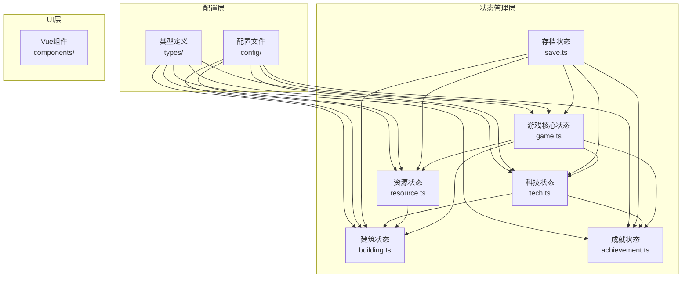

**图表来源**
- [game.ts](file://civilization-game/src/stores/game.ts#L1-L268)
- [resource.ts](file://civilization-game/src/stores/resource.ts#L1-L202)
- [building.ts](file://civilization-game/src/stores/building.ts#L1-L320)
- [tech.ts](file://civilization-game/src/stores/tech.ts#L1-L417)
- [achievement.ts](file://civilization-game/src/stores/achievement.ts#L1-L278)
- [save.ts](file://civilization-game/src/stores/save.ts#L1-L280)

## 核心状态架构

Pinia Store采用了函数式编程范式，每个Store都是一个独立的模块，具有清晰的职责边界：

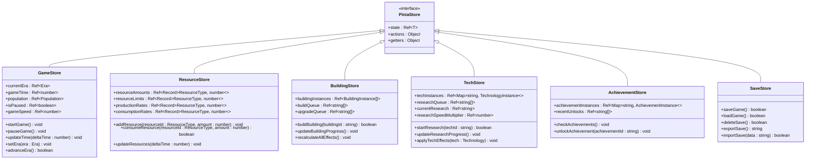

**图表来源**
- [game.ts](file://civilization-game/src/stores/game.ts#L6-L268)
- [resource.ts](file://civilization-game/src/stores/resource.ts#L6-L202)
- [building.ts](file://civilization-game/src/stores/building.ts#L8-L320)
- [tech.ts](file://civilization-game/src/stores/tech.ts#L8-L417)
- [achievement.ts](file://civilization-game/src/stores/achievement.ts#L8-L278)
- [save.ts](file://civilization-game/src/stores/save.ts#L9-L280)

## 游戏核心状态管理

game.ts是整个游戏状态的核心，负责管理游戏的基本运行状态和全局控制逻辑。

### 核心状态变量

```typescript
// 游戏时代状态
const currentEra = ref<Era>(Era.STONE)
const gameTime = ref(0)
const lastSaveTime = ref(Date.now())
const lastPlayTime = ref(Date.now())

// 人口状态
const population = ref({
  current: POPULATION.initialPopulation,
  max: POPULATION.initialMaxPopulation,
  growthRate: POPULATION.baseGrowthRate
})

// 游戏控制状态
const isPaused = ref(false)
const gameSpeed = ref(1.0)
```

### 关键功能实现

#### 时代管理系统

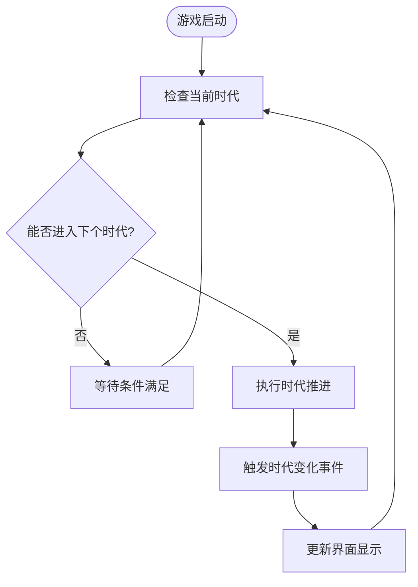

**图表来源**
- [game.ts](file://civilization-game/src/stores/game.ts#L120-L150)

#### 人口增长系统

人口增长系统实现了动态的人口管理机制：

```typescript
function updatePopulationGrowth(deltaTime: number) {
  if (isPaused.value) return
  
  // 只有当前人口小于上限时才增长
  if (population.value.current < population.value.max) {
    const growth = population.value.growthRate * deltaTime
    population.value.current = Math.min(
      population.value.current + growth,
      population.value.max
    )
  }
}
```

#### 事件系统

游戏内置了强大的事件系统，支持Store间的通信：

```typescript
// 事件监听器注册
function addEventListener(eventName: string, callback: (data: any) => void) {
  if (!eventListeners.has(eventName)) {
    eventListeners.set(eventName, [])
  }
  eventListeners.get(eventName)!.push(callback)
}

// 事件触发
function emitEvent(eventName: string, data?: any) {
  const listeners = eventListeners.get(eventName)
  if (listeners) {
    listeners.forEach(listener => listener(data))
  }
}
```

**章节来源**
- [game.ts](file://civilization-game/src/stores/game.ts#L1-L268)

## 资源系统状态管理

resource.ts专门负责管理游戏中各种资源的数量、生产和消耗。

### 资源状态结构

```typescript
// 资源数量
const resourceAmounts = ref<Record<ResourceType, number>>({} as Record<ResourceType, number>)
  
// 资源存储上限
const resourceLimits = ref<Record<ResourceType, number>>({} as Record<ResourceType, number>)
  
// 资源产出速率(每秒)
const productionRates = ref<Record<ResourceType, number>>({} as Record<ResourceType, number>)
  
// 资源消耗速率(每秒)
const consumptionRates = ref<Record<ResourceType, number>>({} as Record<ResourceType, number>)

// 资源产出倍率
const resourceMultipliers = ref<Record<string, number>>({})
```

### 资源管理算法

#### 资源更新循环

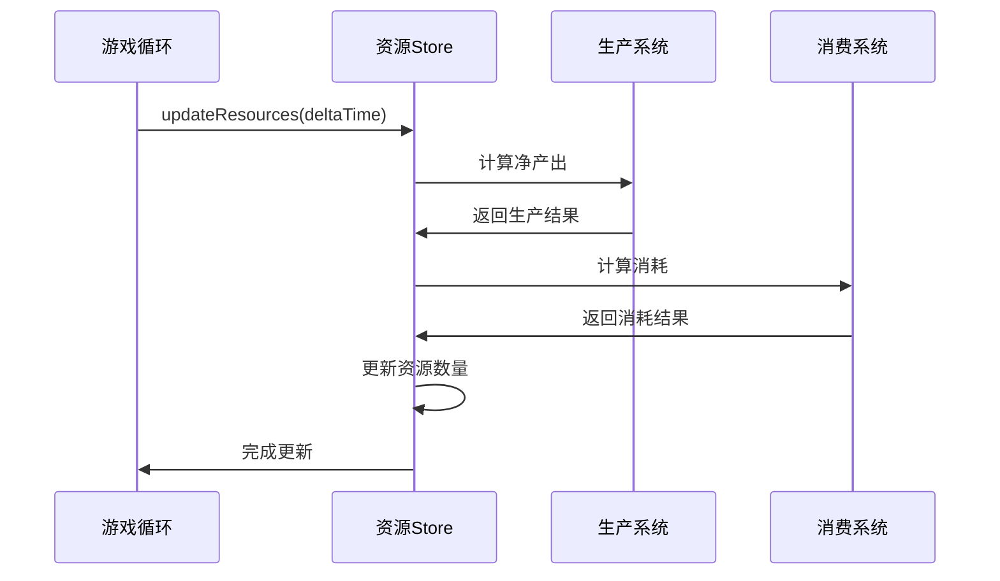

**图表来源**
- [resource.ts](file://civilization-game/src/stores/resource.ts#L100-L130)

#### 资源操作方法

```typescript
// 添加资源（带上限检查）
function addResource(resourceId: ResourceType, amount: number) {
  const current = resourceAmounts.value[resourceId] || 0
  const limit = resourceLimits.value[resourceId] || Infinity
  resourceAmounts.value[resourceId] = Math.min(current + amount, limit)
}

// 消耗资源（原子操作）
function consumeResource(resourceId: ResourceType, amount: number): boolean {
  const current = resourceAmounts.value[resourceId] || 0
  if (current >= amount) {
    resourceAmounts.value[resourceId] = current - amount
    return true
  }
  return false
}

// 批量资源操作
function consumeResources(costs: ResourceAmount): boolean {
  if (!hasEnoughResources(costs)) {
    return false
  }
  Object.entries(costs).forEach(([resourceId, amount]) => {
    consumeResource(resourceId as ResourceType, amount)
  })
  return true
}
```

### 净产出计算

```typescript
const netProduction = computed(() => {
  const result: Record<ResourceType, number> = {} as Record<ResourceType, number>
  Object.keys(resourceAmounts.value).forEach((resourceId) => {
    const id = resourceId as ResourceType
    const production = productionRates.value[id] || 0
    const consumption = consumptionRates.value[id] || 0
    result[id] = production - consumption
  })
  return result
})
```

**章节来源**
- [resource.ts](file://civilization-game/src/stores/resource.ts#L1-L202)

## 建筑系统状态管理

building.ts负责管理建筑的建造、升级和效果应用。

### 建筑状态管理

```typescript
// 已建造的建筑实例
const buildingInstances = ref<BuildingInstance[]>([])
  
// 建造队列
const buildQueue = ref<string[]>([])
  
// 升级队列
const upgradeQueue = ref<string[]>([])
```

### 建造流程管理

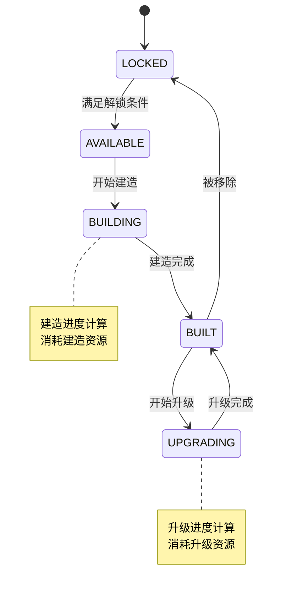

**图表来源**
- [building.ts](file://civilization-game/src/stores/building.ts#L20-L50)

### 建造进度系统

```typescript
function updateBuildingProgress() {
  const now = Date.now()

  // 检查建造队列
  buildQueue.value.forEach((buildingId, index) => {
    const instance = getBuildingInstance(buildingId)
    const config = getBuildingConfig(buildingId)
    if (!instance || !config || !instance.buildStartTime) return

    const elapsed = (now - instance.buildStartTime) / 1000
    if (elapsed >= config.buildTime) {
      // 建造完成
      instance.status = BuildingStatus.BUILT
      delete instance.buildStartTime
      buildQueue.value.splice(index, 1)
      
      // 应用建筑效果
      applyBuildingEffects(buildingId)
    }
  })

  // 检查升级队列
  upgradeQueue.value.forEach((buildingId, index) => {
    const instance = getBuildingInstance(buildingId)
    const config = getBuildingConfig(buildingId)
    if (!instance || !config || !instance.upgradeStartTime) return

    const elapsed = (now - instance.upgradeStartTime) / 1000
    const upgradeTime = config.upgradeTime * Math.pow(BUILDING.timeMultiplier, instance.level - 1)
    
    if (elapsed >= upgradeTime) {
      // 升级完成
      instance.level++
      instance.status = BuildingStatus.BUILT
      delete instance.upgradeStartTime
      upgradeQueue.value.splice(index, 1)
      
      // 重新计算建筑效果
      recalculateAllEffects()
    }
  })
}
```

### 建筑效果应用

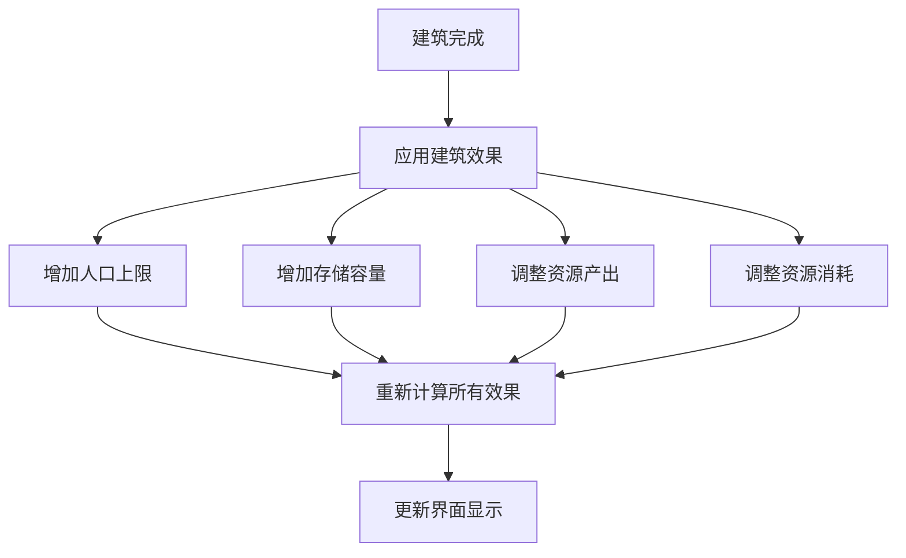

**图表来源**
- [building.ts](file://civilization-game/src/stores/building.ts#L150-L200)

**章节来源**
- [building.ts](file://civilization-game/src/stores/building.ts#L1-L320)

## 科技系统状态管理

tech.ts管理科技的研究状态、解锁条件和效果应用。

### 科技状态结构

```typescript
// 科技实例映射
const techInstances = ref<Map<string, TechnologyInstance>>(new Map())
  
// 研究队列
const researchQueue = ref<string[]>([]) 
  
// 当前正在研究的科技
const currentResearch = ref<string | null>(null) 
  
// 研究速度加成
const researchSpeedMultiplier = ref<number>(1.0)
```

### 科技状态流转

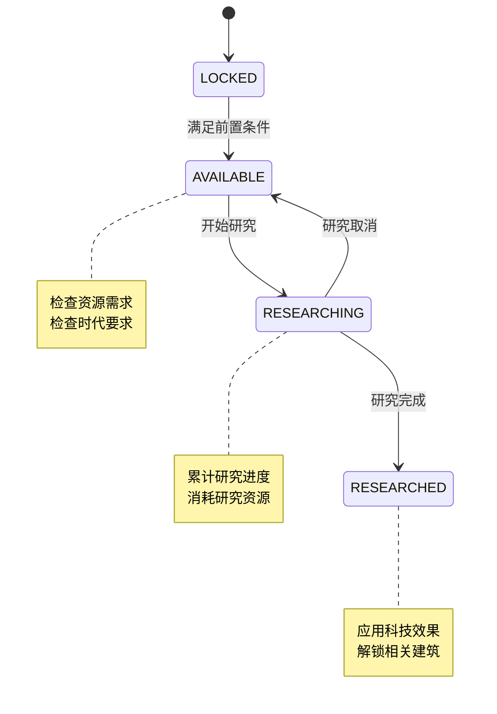

**图表来源**
- [tech.ts](file://civilization-game/src/stores/tech.ts#L20-L50)

### 科技研究算法

```typescript
function updateResearchProgress() {
  if (!currentResearch.value) return

  const instance = techInstances.value.get(currentResearch.value)
  if (!instance || instance.status !== TechnologyStatus.RESEARCHING) {
    currentResearch.value = null
    return
  }

  const tech = getTechnology(currentResearch.value)
  if (!tech || !instance.researchStartTime) return

  const now = Date.now()
  const elapsed = (now - instance.researchStartTime) / 1000 // 转换为秒
  const totalTime = tech.researchTime / researchSpeedMultiplier.value
  const progress = Math.min((elapsed / totalTime) * 100, 100)

  instance.researchProgress = progress

  // 研究完成
  if (progress >= 100) {
    completeResearch(currentResearch.value)
  }
}
```

### 科技效果应用

```typescript
function applyTechEffects(tech: Technology) {
  const resourceStore = useResourceStore()
  const gameStore = useGameStore()

  tech.effects.forEach(effect => {
    switch (effect.type) {
      case 'resourceMultiplier':
        if (effect.target) {
          const currentMultiplier = resourceStore.resourceMultipliers[effect.target] || 1.0
          resourceStore.resourceMultipliers[effect.target] = currentMultiplier * effect.value
        }
        break

      case 'researchSpeedBonus':
        researchSpeedMultiplier.value *= effect.value
        break

      case 'buildSpeedBonus':
        gameStore.emitEvent('techEffectApplied', {
          type: 'buildSpeedBonus',
          value: effect.value
        })
        break

      case 'populationGrowth':
        gameStore.emitEvent('techEffectApplied', {
          type: 'populationGrowth',
          value: effect.value
        })
        break
    }
  })
}
```

**章节来源**
- [tech.ts](file://civilization-game/src/stores/tech.ts#L1-L417)

## 成就系统状态管理

achievement.ts负责追踪成就进度、检测成就条件并应用成就效果。

### 成就状态管理

```typescript
// 成就实例映射
const achievementInstances = ref<Map<string, AchievementInstance>>(new Map())
  
// 最近解锁的成就ID列表
const recentUnlocks = ref<string[]>([])
```

### 成就检测机制

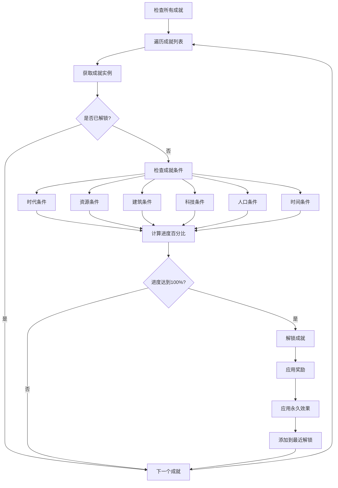

**图表来源**
- [achievement.ts](file://civilization-game/src/stores/achievement.ts#L60-L120)

### 成就条件检测

```typescript
function checkAchievements() {
  const gameStore = useGameStore()
  const resourceStore = useResourceStore()
  const buildingStore = useBuildingStore()
  const techStore = useTechStore()
  
  achievements.forEach(achievement => {
    const instance = achievementInstances.value.get(achievement.id)
    if (!instance || instance.unlocked) return
    
    let progress = 0
    let condition = achievement.condition
    
    switch (condition.type) {
      case 'era':
        // 检查时代进度
        const eraOrder = ['stone', 'bronze', 'iron', 'industrial', 'information', 'space', 'interstellar', 'hyperdimensional']
        const currentEraIndex = eraOrder.indexOf(gameStore.currentEra)
        progress = currentEraIndex >= condition.value ? 100 : (currentEraIndex / condition.value) * 100
        break
        
      case 'resource':
        if (condition.target) {
          const current = resourceStore.getResourceAmount(condition.target as ResourceType)
          progress = Math.min((current / condition.value) * 100, 100)
        }
        break
        
      case 'building':
        const buildings = buildingStore.buildingInstances
        let count = 0
        
        if (condition.target === 'max_level') {
          count = buildings.filter(b => {
            const config = buildingStore.getBuildingConfig(b.buildingId)
            return config && b.level >= config.maxLevel
          }).length
        } else if (condition.target) {
          count = buildings.filter(b => {
            const config = buildingStore.getBuildingConfig(b.buildingId)
            return config && config.type === condition.target
          }).length
        } else {
          count = buildings.length
        }
        
        progress = Math.min((count / condition.value) * 100, 100)
        break
    }
    
    instance.progress = progress
    
    // 如果达成条件,解锁成就
    if (progress >= 100) {
      unlockAchievement(achievement.id)
    }
  })
}
```

### 成就解锁流程

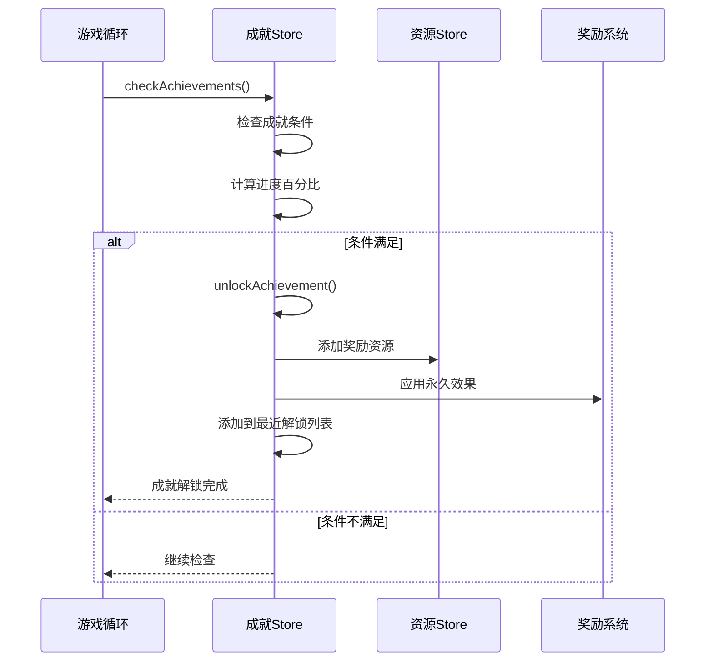

**图表来源**
- [achievement.ts](file://civilization-game/src/stores/achievement.ts#L120-L180)

**章节来源**
- [achievement.ts](file://civilization-game/src/stores/achievement.ts#L1-L278)

## 存档系统状态管理

save.ts实现了完整的存档系统，包括序列化、压缩、持久化和版本兼容性管理。

### 存档数据结构

```typescript
interface SaveData {
  version: string
  createdAt: number
  lastSaved: number
  gameState: GameState
  resources: Record<ResourceType, number>
  buildings: BuildingInstance[]
  technologies: TechnologyInstance[]
  achievements: AchievementInstance[]
}
```

### 存档压缩算法

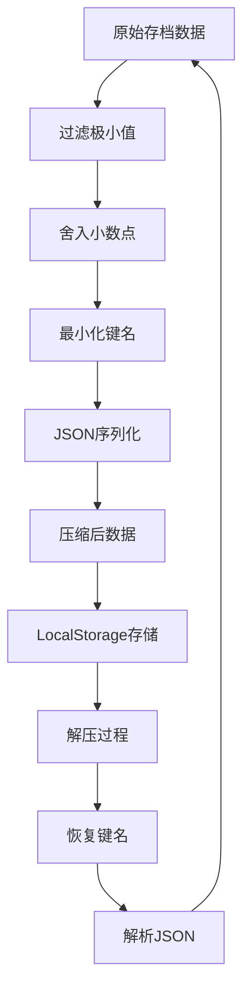

**图表来源**
- [save.ts](file://civilization-game/src/stores/save.ts#L20-L60)

### 数据压缩实现

```typescript
function compressSaveData(data: SaveData): string {
  // 移除不必要的字段,只保留关键数据
  const compressed = {
    v: data.version,
    c: data.createdAt,
    l: data.lastSaved,
    g: {
      e: data.gameState.currentEra,
      t: data.gameState.gameTime,
      p: {
        c: Math.floor(data.gameState.population.current),
        m: data.gameState.population.max,
        g: data.gameState.population.growthRate
      },
      lp: data.gameState.lastPlayTime
    },
    r: Object.fromEntries(
      Object.entries(data.resources)
        .filter(([_, amount]) => amount > 0.01) // 过滤掉极小值
        .map(([id, amount]) => [id, Math.floor(amount as number * 10) / 10]) // 保留1位小数
    ),
    b: data.buildings.map(b => ({
      i: b.buildingId,
      l: b.level,
      s: b.status
    })),
    t: data.technologies.map(t => ({
      i: t.technologyId,
      s: t.status,
      p: t.researchProgress ? Math.floor(t.researchProgress * 100) / 100 : undefined
    })),
    a: data.achievements
      .filter(a => a.unlocked || (a.progress && a.progress > 0))
      .map(a => ({
        i: a.achievementId,
        u: a.unlocked,
        p: a.progress ? Math.floor(a.progress * 100) / 100 : undefined
      }))
  }
  
  return JSON.stringify(compressed)
}
```

### 离线时间处理

```typescript
// 计算离线时间
const now = Date.now()
const offlineTime = (now - saveData.gameState.lastPlayTime) / 1000 // 转换为秒

if (offlineTime > 60) { // 离线超过1分钟才计算收益
  console.log(`离线时间: ${(offlineTime / 60).toFixed(1)}分钟`)
  gameStore.setOfflineTime(offlineTime)
}
```

### 存档版本兼容性

```typescript
// 版本检查
if (saveData.version !== GAME_VERSION) {
  console.warn('存档版本不匹配,可能需要迁移')
}

// 兼容旧版本未压缩的存档
if (c.version) {
  return c as SaveData
}
```

**章节来源**
- [save.ts](file://civilization-game/src/stores/save.ts#L1-L280)

## Store间相互依赖

各个Store之间存在复杂的依赖关系，形成了一个有机的整体。

### 依赖关系图

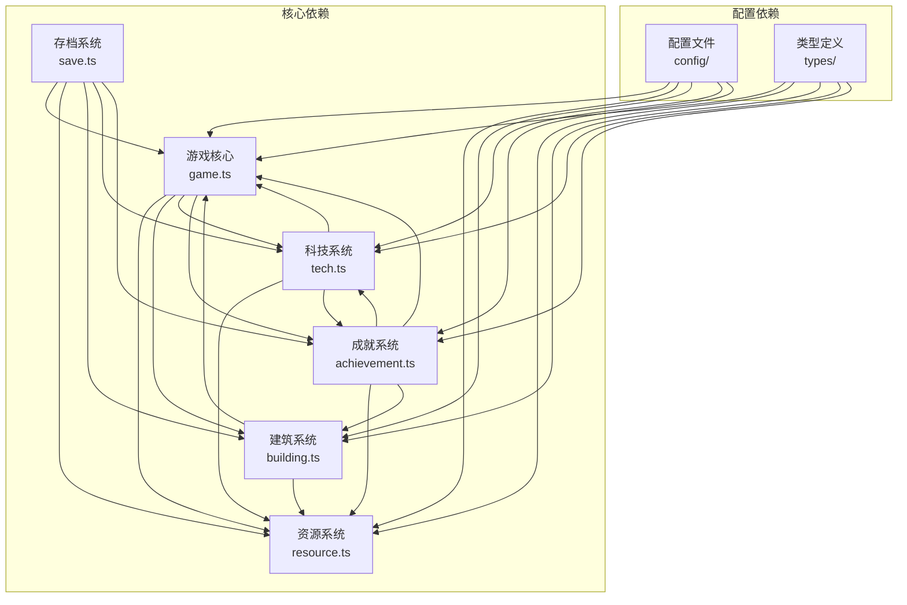

**图表来源**
- [game.ts](file://civilization-game/src/stores/game.ts#L1-L10)
- [building.ts](file://civilization-game/src/stores/building.ts#L1-L10)
- [tech.ts](file://civilization-game/src/stores/tech.ts#L1-L10)
- [achievement.ts](file://civilization-game/src/stores/achievement.ts#L1-L10)
- [save.ts](file://civilization-game/src/stores/save.ts#L1-L10)

### 实际依赖示例

#### 科技解锁对建筑可用性的影响

```typescript
// 在科技Store中应用效果时触发事件
function applyTechEffects(tech: Technology) {
  tech.effects.forEach(effect => {
    switch (effect.type) {
      case 'buildSpeedBonus':
        // 通过事件系统通知建筑系统
        gameStore.emitEvent('techEffectApplied', {
          type: 'buildSpeedBonus',
          value: effect.value
        })
        break
    }
  })
}

// 在建筑Store中监听事件
gameStore.addEventListener('techEffectApplied', (data) => {
  if (data.type === 'buildSpeedBonus') {
    // 应用建筑速度加成
    applyBuildSpeedBonus(data.value)
  }
})
```

#### 成就解锁对资源系统的永久影响

```typescript
// 成就Store应用永久效果
function applyPermanentEffect(achievement: Achievement) {
  if (!achievement.permanentEffect) return
  
  const effect = achievement.permanentEffect
  const resourceStore = useResourceStore()
  
  switch (effect.type) {
    case 'resourceMultiplier':
      if (effect.target) {
        const current = resourceStore.resourceMultipliers[effect.target] || 1.0
        resourceStore.resourceMultipliers[effect.target] = current * effect.value
      }
      break
  }
}
```

#### 存档系统中的跨Store协调

```typescript
// SaveStore协调多个Store的数据保存
function saveGame(): boolean {
  try {
    const saveData: SaveData = {
      version: GAME_VERSION,
      createdAt: Date.now(),
      lastSaved: Date.now(),
      gameState: gameStore.getGameState,
      resources: resourceStore.resourceAmounts as any,
      buildings: buildingStore.buildingInstances,
      technologies: techStore.exportTechData(),
      achievements: achievementStore.exportAchievementData()
    }

    // 使用压缩后的数据
    const compressedData = compressSaveData(saveData)
    localStorage.setItem(STORAGE_KEYS.saveData, compressedData)
    
    return true
  } catch (error) {
    console.error('保存失败:', error)
    return false
  }
}
```

**章节来源**
- [tech.ts](file://civilization-game/src/stores/tech.ts#L280-L320)
- [achievement.ts](file://civilization-game/src/stores/achievement.ts#L180-L220)
- [save.ts](file://civilization-game/src/stores/save.ts#L60-L100)

## 性能考虑

### 状态更新优化

1. **批量更新**: 将多个状态更新合并为一次操作
2. **延迟计算**: 使用computed属性避免重复计算
3. **事件节流**: 对频繁触发的事件进行节流处理

### 内存管理

1. **及时清理**: 在不需要时清除事件监听器
2. **弱引用**: 对大型对象使用弱引用避免内存泄漏
3. **状态清理**: 在重置游戏时彻底清理状态

### 存储优化

1. **数据压缩**: 使用自定义压缩算法减少存储空间
2. **增量更新**: 只保存变化的部分而非完整状态
3. **版本控制**: 支持存档格式的向后兼容

## 故障排除指南

### 常见问题及解决方案

#### 存档加载失败

```typescript
// 检查存档完整性
function validateSaveData(data: SaveData): boolean {
  return data &&
         data.version &&
         data.gameState &&
         data.resources &&
         data.buildings &&
         data.technologies &&
         data.achievements
}

// 错误处理
try {
  const saveData = decompressSaveData(data)
  if (!validateSaveData(saveData)) {
    throw new Error('存档数据不完整')
  }
} catch (error) {
  console.error('存档加载失败:', error)
  // 回退到默认设置
  return createDefaultSave()
}
```

#### 状态同步问题

```typescript
// 使用事件系统确保状态同步
gameStore.addEventListener('eraChanged', (data) => {
  // 同步其他Store的状态
  techStore.updateTechStatus()
  achievementStore.checkAchievements()
})

// 避免循环依赖
function safeUpdate() {
  try {
    // 执行状态更新
    updateState()
  } catch (error) {
    console.error('状态更新失败:', error)
    // 回滚到上一个有效状态
    rollbackState()
  }
}
```

**章节来源**
- [save.ts](file://civilization-game/src/stores/save.ts#L100-L150)
- [game.ts](file://civilization-game/src/stores/game.ts#L200-L250)

## 总结

本状态管理系统展现了现代前端应用中复杂状态管理的最佳实践。通过Pinia的模块化设计，我们成功地将游戏的各种状态分离到不同的Store中，每个Store都有明确的职责边界。

### 主要特点

1. **模块化设计**: 每个Store专注于特定的功能领域
2. **事件驱动**: 通过事件系统实现Store间的松耦合通信
3. **性能优化**: 采用多种优化策略提升性能表现
4. **数据完整性**: 实现了完善的错误处理和数据验证
5. **扩展性**: 设计支持未来的功能扩展和维护

### 技术亮点

- **响应式状态**: 利用Vue的响应式系统实现自动更新
- **类型安全**: 完整的TypeScript类型定义确保代码质量
- **存档系统**: 实现了高效的压缩和版本兼容性管理
- **事件系统**: 提供了灵活的Store间通信机制

这个状态管理系统不仅满足了当前游戏的需求，也为未来的功能扩展奠定了坚实的基础。通过合理的架构设计和最佳实践的应用，确保了系统的可维护性和可扩展性。