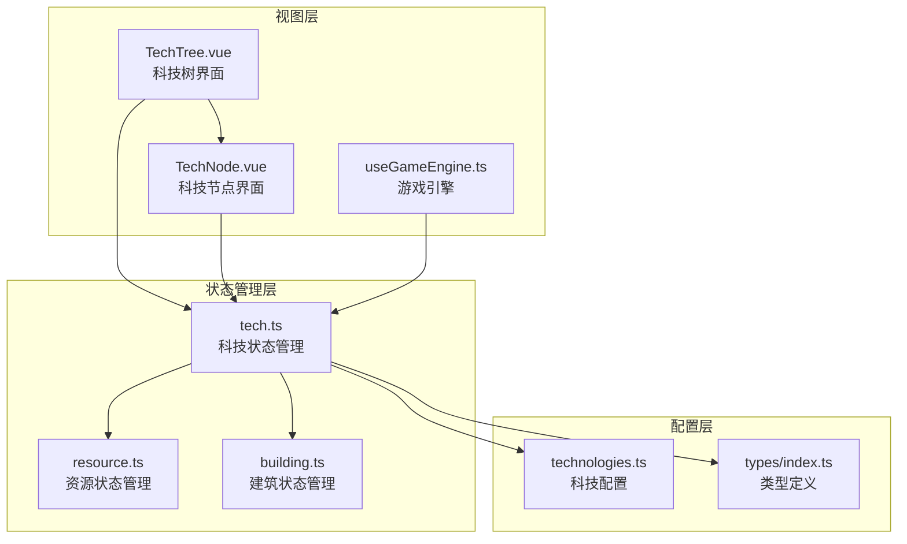
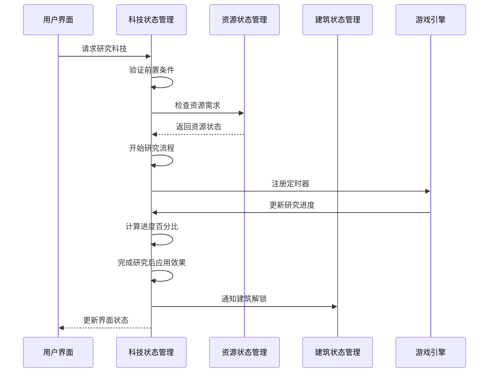
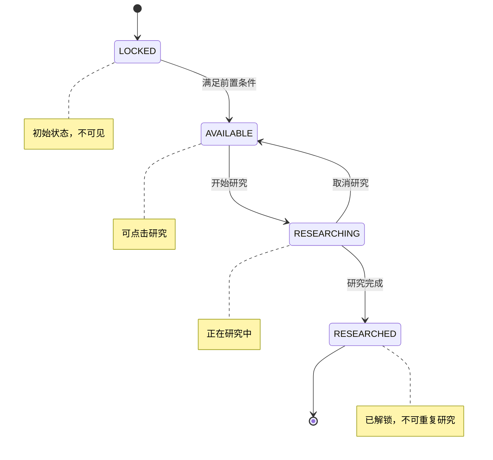
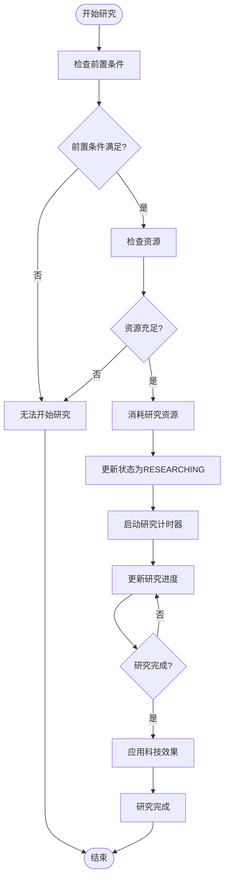
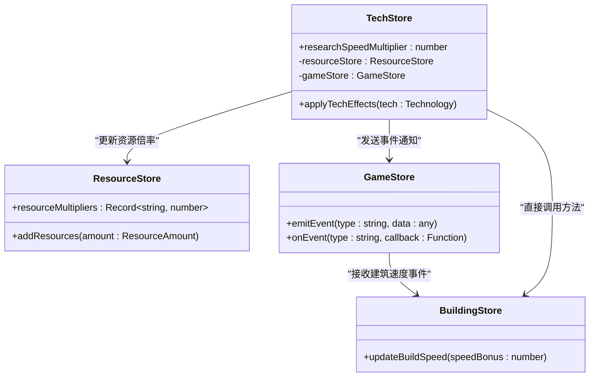
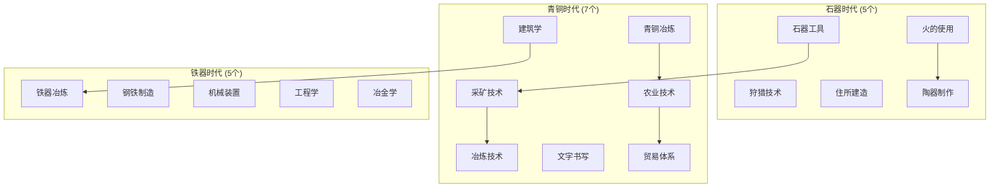
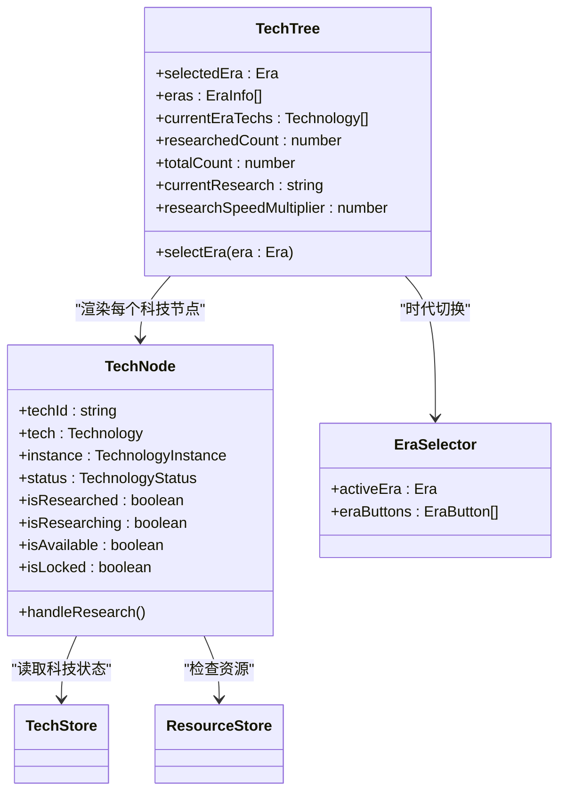
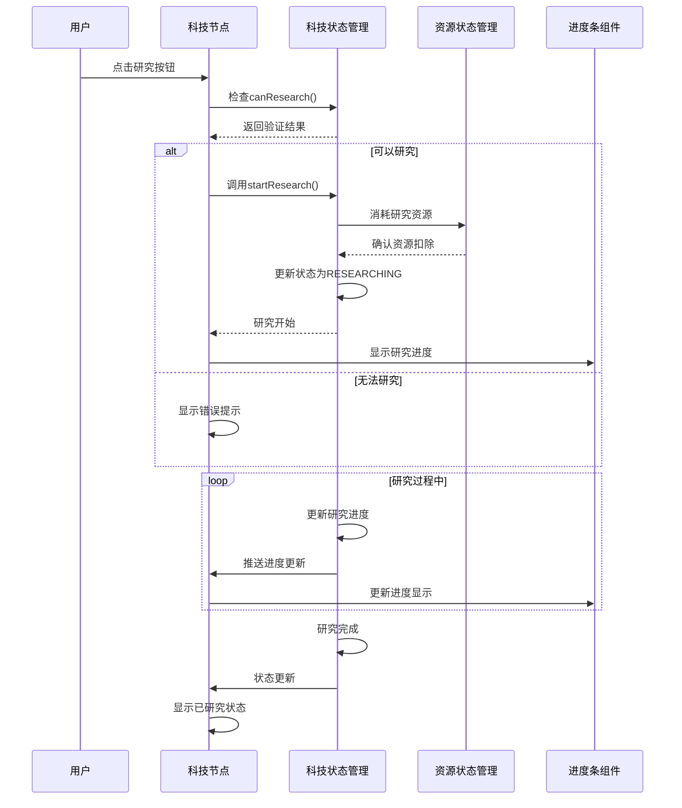
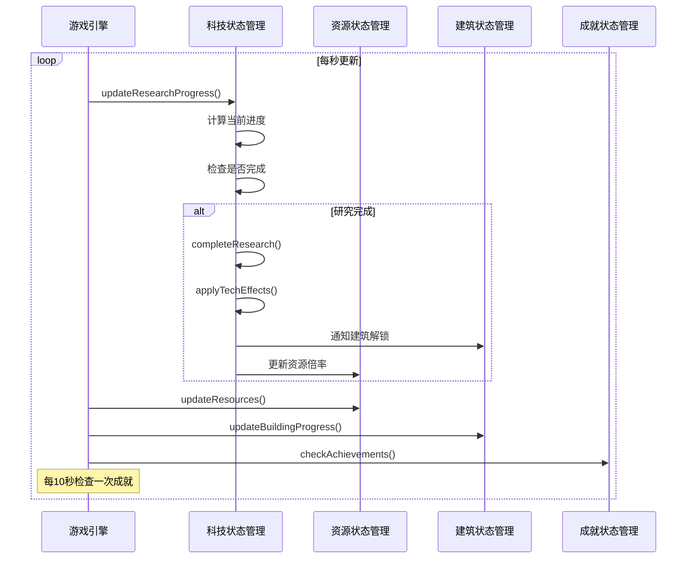

# 科技状态管理

<cite>
**本文档引用的文件**
- [tech.ts](file://civilization-game/src/stores/tech.ts)
- [technologies.ts](file://civilization-game/src/config/technologies.ts)
- [useGameEngine.ts](file://civilization-game/src/composables/useGameEngine.ts)
- [TechTree.vue](file://civilization-game/src/components/game/TechTree.vue)
- [TechNode.vue](file://civilization-game/src/components/game/TechNode.vue)
- [types/index.ts](file://civilization-game/src/types/index.ts)
- [resource.ts](file://civilization-game/src/stores/resource.ts)
- [building.ts](file://civilization-game/src/stores/building.ts)
</cite>

## 目录
1. [简介](#简介)
2. [项目结构](#项目结构)
3. [核心组件](#核心组件)
4. [架构概览](#架构概览)
5. [详细组件分析](#详细组件分析)
6. [依赖关系分析](#依赖关系分析)
7. [性能考虑](#性能考虑)
8. [故障排除指南](#故障排除指南)
9. [结论](#结论)

## 简介

科技状态管理系统是文明建设游戏中核心的游戏机制之一，负责管理科技树的构建、研究进度跟踪、前置条件验证以及与其他游戏系统的交互。该系统采用Vue 3的组合式API和Pinia状态管理库，实现了响应式的科技状态管理和实时的游戏体验。

科技系统支持8个不同的时代（石器时代到超维时代），每个时代包含多个科技节点，这些科技节点之间存在复杂的依赖关系。系统不仅管理科技的研究状态，还处理资源消耗、效果应用和状态同步等复杂功能。

## 项目结构

科技状态管理系统的核心文件分布在以下目录结构中：



**图表来源**
- [tech.ts](file://civilization-game/src/stores/tech.ts#L1-L20)
- [technologies.ts](file://civilization-game/src/config/technologies.ts#L1-L30)
- [useGameEngine.ts](file://civilization-game/src/composables/useGameEngine.ts#L1-L15)

**章节来源**
- [tech.ts](file://civilization-game/src/stores/tech.ts#L1-L417)
- [technologies.ts](file://civilization-game/src/config/technologies.ts#L1-L887)

## 核心组件

### 技术状态枚举

科技系统定义了四种基本状态，每种状态都有特定的行为和视觉表现：

```typescript
export const TechnologyStatus = {
  LOCKED: 'locked',           // 锁定状态：未解锁的科技
  AVAILABLE: 'available',     // 可研究状态：满足前置条件但未开始研究
  RESEARCHING: 'researching', // 研究中状态：正在进行研究
  RESEARCHED: 'researched'    // 已研究状态：已完成研究
} as const
```

### 科技实例结构

每个科技实例都包含完整的研究状态信息：

```typescript
interface TechnologyInstance {
  technologyId: string                    // 科技唯一标识符
  status: TechnologyStatus               // 当前状态
  researchStartTime?: number            // 研究开始时间戳
  researchProgress?: number             // 研究进度百分比(0-100)
}
```

**章节来源**
- [types/index.ts](file://civilization-game/src/types/index.ts#L100-L120)
- [tech.ts](file://civilization-game/src/stores/tech.ts#L10-L20)

## 架构概览

科技状态管理系统采用分层架构设计，确保了模块化和可维护性：



**图表来源**
- [tech.ts](file://civilization-game/src/stores/tech.ts#L150-L200)
- [useGameEngine.ts](file://civilization-game/src/composables/useGameEngine.ts#L40-L80)

## 详细组件分析

### 科技状态管理器 (tech.ts)

科技状态管理器是整个系统的核心，负责管理所有科技的状态转换和业务逻辑。

#### 状态管理



**图表来源**
- [tech.ts](file://civilization-game/src/stores/tech.ts#L10-L20)
- [types/index.ts](file://civilization-game/src/types/index.ts#L100-L110)

#### 研究流程控制

研究流程包含完整的生命周期管理：



**图表来源**
- [tech.ts](file://civilization-game/src/stores/tech.ts#L150-L200)
- [tech.ts](file://civilization-game/src/stores/tech.ts#L250-L300)

#### 科技效果应用机制

科技效果通过事件系统与其他模块通信：



**图表来源**
- [tech.ts](file://civilization-game/src/stores/tech.ts#L250-L300)
- [resource.ts](file://civilization-game/src/stores/resource.ts#L1-L50)

**章节来源**
- [tech.ts](file://civilization-game/src/stores/tech.ts#L1-L417)

### 科技配置系统 (technologies.ts)

科技配置系统定义了游戏中的所有科技及其相互关系：

#### 科技依赖树结构



**图表来源**
- [technologies.ts](file://civilization-game/src/config/technologies.ts#L1-L100)
- [technologies.ts](file://civilization-game/src/config/technologies.ts#L100-L200)

#### 科技效果类型

科技系统支持多种效果类型，每种效果对游戏有不同的影响：

```typescript
interface Effect {
  type: 'resourceMultiplier' | 'researchSpeedBonus' | 'buildSpeedBonus' | 'populationGrowth'
  target?: ResourceType | string
  value: number
}
```

**章节来源**
- [technologies.ts](file://civilization-game/src/config/technologies.ts#L1-L887)
- [types/index.ts](file://civilization-game/src/types/index.ts#L80-L90)

### 用户界面组件

#### 科技树组件 (TechTree.vue)

科技树组件提供了用户友好的科技浏览界面：



**图表来源**
- [TechTree.vue](file://civilization-game/src/components/game/TechTree.vue#L1-L50)
- [TechNode.vue](file://civilization-game/src/components/game/TechNode.vue#L1-L40)

#### 科技节点组件 (TechNode.vue)

科技节点组件展示了单个科技的详细信息和交互功能：



**图表来源**
- [TechNode.vue](file://civilization-game/src/components/game/TechNode.vue#L60-L90)
- [TechNode.vue](file://civilization-game/src/components/game/TechNode.vue#L170-L200)

**章节来源**
- [TechTree.vue](file://civilization-game/src/components/game/TechTree.vue#L1-L150)
- [TechNode.vue](file://civilization-game/src/components/game/TechNode.vue#L1-L266)

### 游戏引擎集成

科技状态管理与游戏引擎紧密集成，确保研究进度的实时更新：



**图表来源**
- [useGameEngine.ts](file://civilization-game/src/composables/useGameEngine.ts#L40-L80)
- [tech.ts](file://civilization-game/src/stores/tech.ts#L250-L300)

**章节来源**
- [useGameEngine.ts](file://civilization-game/src/composables/useGameEngine.ts#L1-L143)

## 依赖关系分析

科技状态管理系统具有复杂的依赖关系网络，涉及多个状态管理器和配置模块：

```mermaid
graph LR
subgraph "外部依赖"
Vue[Vue 3]
Pinia[Pinia]
Iconify[@iconify/vue]
end
subgraph "内部模块"
TechStore[tech.ts]
ResourceStore[resource.ts]
BuildingStore[building.ts]
GameStore[game.ts]
AchievementStore[achievement.ts]
end
subgraph "配置模块"
TechConfig[technologies.ts]
TypeDefs[types/index.ts]
Constants[constants.ts]
end
subgraph "UI组件"
TechTree[TechTree.vue]
TechNode[TechNode.vue]
ProgressBar[ProgressBar.vue]
GameButton[GameButton.vue]
end
Vue --> TechStore
Pinia --> TechStore
Iconify --> TechTree
Iconify --> TechNode
TechStore --> ResourceStore
TechStore --> BuildingStore
TechStore --> GameStore
TechStore --> AchievementStore
TechStore --> TechConfig
TechStore --> TypeDefs
TechStore --> Constants
TechTree --> TechStore
TechTree --> TechNode
TechNode --> TechStore
TechNode --> ResourceStore
TechNode --> ProgressBar
TechNode --> GameButton
```

**图表来源**
- [tech.ts](file://civilization-game/src/stores/tech.ts#L1-L10)
- [TechTree.vue](file://civilization-game/src/components/game/TechTree.vue#L1-L10)

### 循环依赖检测

系统采用了多种策略来避免循环依赖：

1. **单向依赖链**：科技状态管理器只依赖于资源和建筑状态管理器，而不被它们依赖
2. **事件驱动通信**：通过事件系统传递消息，避免直接函数调用
3. **延迟初始化**：使用函数返回值而非直接导入，减少编译时依赖

**章节来源**
- [tech.ts](file://civilization-game/src/stores/tech.ts#L1-L20)
- [building.ts](file://civilization-game/src/stores/building.ts#L1-L20)

## 性能考虑

### 研究进度更新优化

科技系统实现了高效的进度更新机制：

```typescript
// 使用requestAnimationFrame进行平滑更新
function updateResearchProgress() {
  if (!currentResearch.value) return
  
  const instance = techInstances.value.get(currentResearch.value)
  if (!instance || instance.status !== TechnologyStatus.RESEARCHING) {
    currentResearch.value = null
    return
  }
  
  const tech = getTechnology(currentResearch.value)
  if (!tech || !instance.researchStartTime) return
  
  const now = Date.now()
  const elapsed = (now - instance.researchStartTime) / 1000
  const totalTime = tech.researchTime / researchSpeedMultiplier.value
  const progress = Math.min((elapsed / totalTime) * 100, 100)
  
  instance.researchProgress = progress
  
  if (progress >= 100) {
    completeResearch(currentResearch.value)
  }
}
```

### 内存管理策略

1. **Map数据结构**：使用Map存储科技实例，提供O(1)的查找性能
2. **响应式计算属性**：利用Vue的计算属性缓存机制，避免不必要的重新计算
3. **状态压缩**：定期清理过期的状态信息，防止内存泄漏

### 渲染性能优化

1. **虚拟滚动**：对于大型科技树，使用虚拟滚动技术
2. **懒加载**：按需加载科技节点的详细信息
3. **批量更新**：将多个状态更新合并为单次DOM操作

## 故障排除指南

### 常见问题及解决方案

#### 科技状态不同步

**问题描述**：科技状态在界面和实际状态不一致

**解决方案**：
```typescript
// 强制刷新科技状态
function forceRefreshTechStatus() {
  techInstances.value.forEach((instance, techId) => {
    const tech = getTechnology(techId)
    if (tech && instance.status === TechnologyStatus.LOCKED) {
      const canResearch = checkPrerequisites(techId)
      if (canResearch) {
        instance.status = TechnologyStatus.AVAILABLE
      }
    }
  })
}
```

#### 研究进度异常

**问题描述**：研究进度显示异常或停滞

**解决方案**：
```typescript
// 重置研究进度
function resetResearchProgress(techId: string) {
  const instance = techInstances.value.get(techId)
  if (instance && instance.status === TechnologyStatus.RESEARCHING) {
    instance.researchProgress = 0
    instance.researchStartTime = Date.now()
  }
}
```

#### 资源消耗问题

**问题描述**：研究完成后资源没有正确扣除

**解决方案**：
```typescript
// 验证资源消耗
function verifyResourceConsumption(techId: string) {
  const tech = getTechnology(techId)
  const resourceStore = useResourceStore()
  
  if (tech && !resourceStore.hasEnoughResources(tech.researchCost)) {
    console.error(`资源不足: ${JSON.stringify(tech.researchCost)}`)
    return false
  }
  return true
}
```

**章节来源**
- [tech.ts](file://civilization-game/src/stores/tech.ts#L200-L250)
- [tech.ts](file://civilization-game/src/stores/tech.ts#L350-L400)

## 结论

科技状态管理系统是一个设计精良、功能完善的模块，它成功地实现了复杂的科技树管理、实时状态同步和跨模块通信。系统的主要优势包括：

1. **模块化设计**：清晰的职责分离和良好的封装
2. **响应式架构**：基于Vue 3的响应式状态管理
3. **扩展性强**：易于添加新的科技类型和效果
4. **性能优化**：高效的更新机制和内存管理
5. **用户体验**：直观的界面和流畅的操作反馈

该系统为文明建设游戏提供了坚实的科技基础，支持玩家在不同历史时期探索和发展各种科技，是整个游戏体验的重要组成部分。通过持续的优化和维护，这个系统将继续为玩家提供丰富而有趣的科技研究体验。