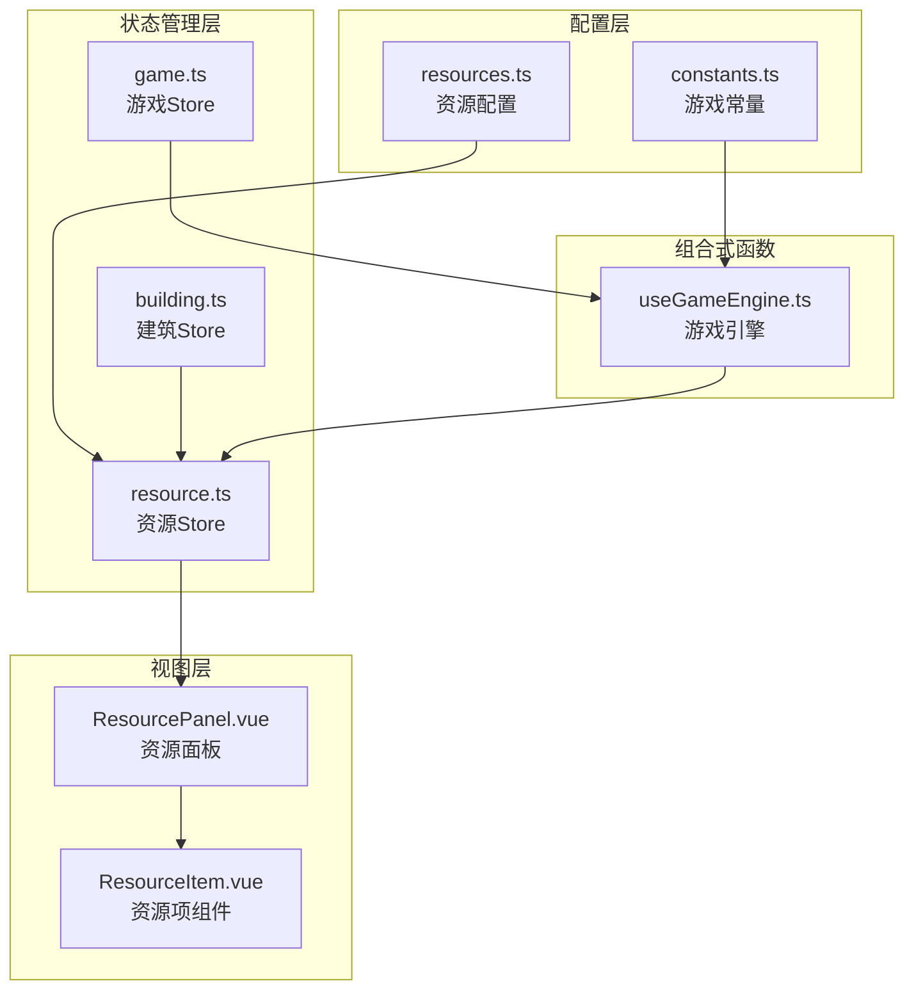
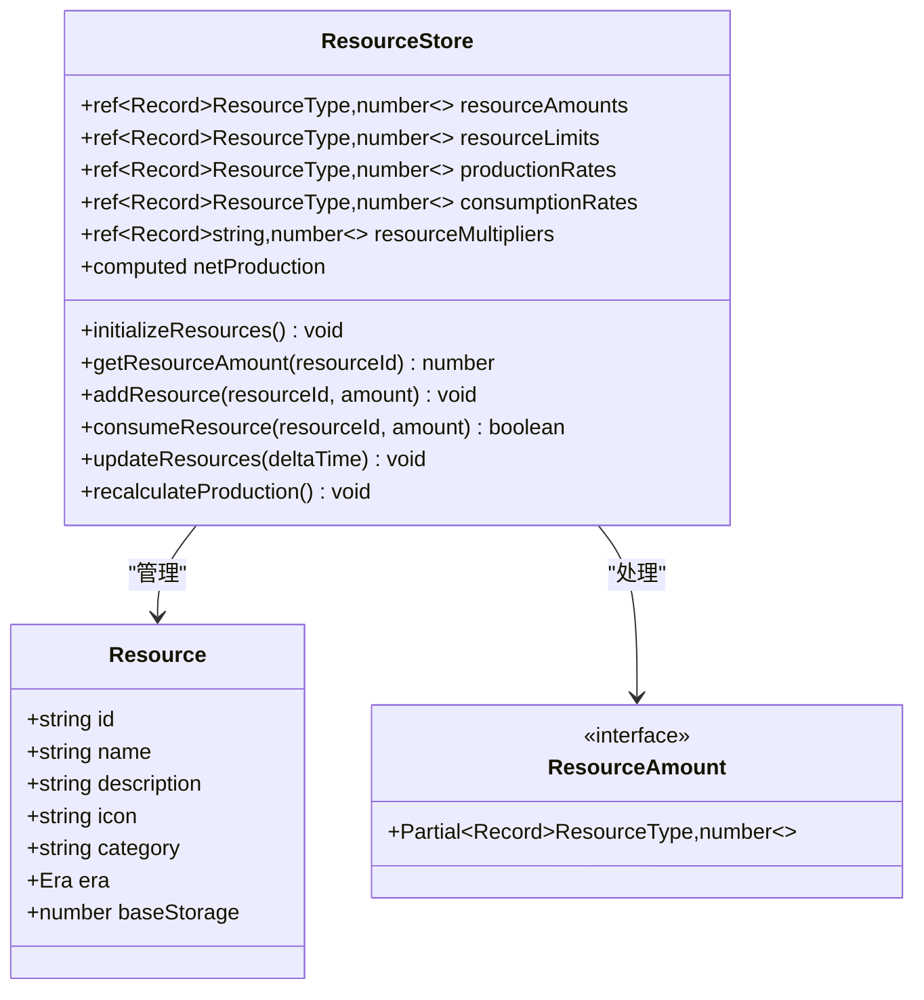
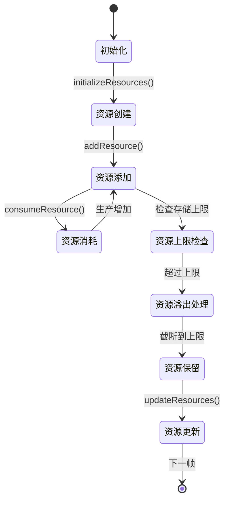
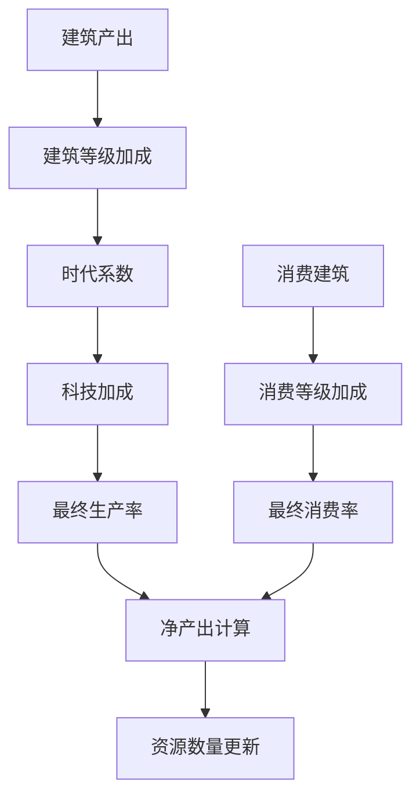
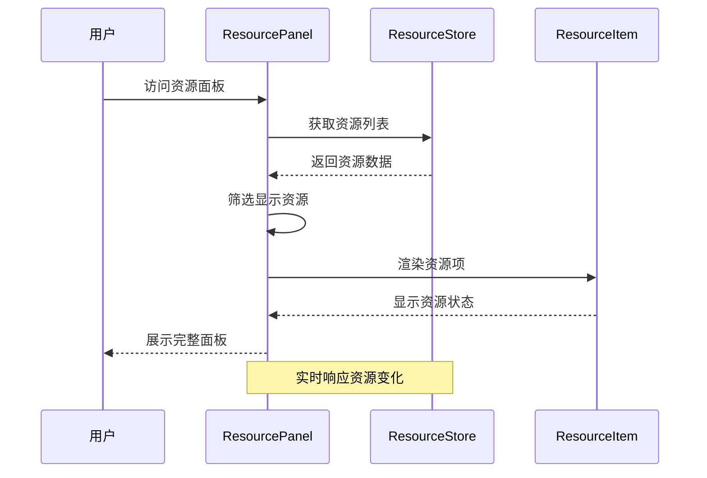
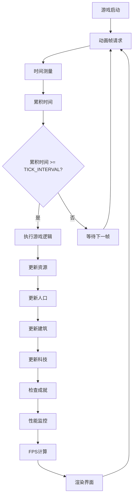
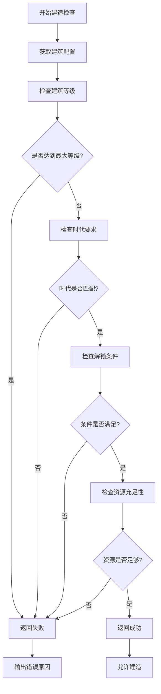

# 资源状态管理

<cite>
**本文档引用的文件**
- [resources.ts](file://civilization-game/src/config/resources.ts)
- [resource.ts](file://civilization-game/src/stores/resource.ts)
- [ResourcePanel.vue](file://civilization-game/src/components/game/ResourcePanel.vue)
- [useGameEngine.ts](file://civilization-game/src/composables/useGameEngine.ts)
- [building.ts](file://civilization-game/src/stores/building.ts)
- [index.ts](file://civilization-game/src/types/index.ts)
- [constants.ts](file://civilization-game/src/config/constants.ts)
</cite>

## 目录
1. [简介](#简介)
2. [项目结构概览](#项目结构概览)
3. [核心资源配置](#核心资源配置)
4. [资源状态管理架构](#资源状态管理架构)
5. [详细组件分析](#详细组件分析)
6. [资源生产与消耗机制](#资源生产与消耗机制)
7. [资源面板组件](#资源面板组件)
8. [游戏引擎集成](#游戏引擎集成)
9. [资源依赖检查](#资源依赖检查)
10. [性能监控与优化](#性能监控与优化)
11. [故障排除指南](#故障排除指南)
12. [总结](#总结)

## 简介

本项目是一个复杂的文明建设类游戏，采用Vue 3 + TypeScript + Pinia构建。资源状态管理系统是整个游戏的核心机制之一，负责管理各种资源的数量、生产率、消耗率以及相关的状态同步。

该系统支持从石器时代到超维时代的多种资源类型，每种资源都有其独特的属性、存储上限和时代要求。系统通过Pinia状态管理库实现响应式的数据流，确保资源变化能够实时反映在用户界面中。

## 项目结构概览

资源状态管理相关的文件主要分布在以下目录结构中：



**图表来源**
- [resources.ts](file://civilization-game/src/config/resources.ts#L1-L247)
- [resource.ts](file://civilization-game/src/stores/resource.ts#L1-L202)
- [ResourcePanel.vue](file://civilization-game/src/components/game/ResourcePanel.vue#L1-L49)

## 核心资源配置

### 资源类型定义

系统定义了丰富的资源类型，按照时代和技术发展分为多个类别：

```typescript
// 基础资源 - 石器时代
{
  id: 'food',
  name: '食物',
  description: '维持人口生存的基本资源',
  icon: 'game-icons:meal',
  category: 'basic',
  era: Era.STONE,
  baseStorage: 1000
}

// 中级资源 - 青铜时代
{
  id: 'copper',
  name: '铜矿',
  description: '制作工具和武器的重要材料',
  icon: 'game-icons:ore',
  category: 'intermediate',
  era: Era.BRONZE,
  baseStorage: 500
}
```

### 资源分类体系

系统将资源分为以下几大类别：

1. **基础资源** (`basic`)：食物、木材、石头
2. **中级资源** (`intermediate`)：铜矿、铁矿、煤炭等
3. **高级资源** (`advanced`)：钢铁、石油、电力等
4. **太空资源** (`space`)：火箭燃料、合金、氦-3等
5. **星际资源** (`interstellar`)：反物质、暗物质等
6. **超维资源** (`hyperdimensional`)：量子能量、时空晶体等
7. **特殊资源** (`special`)：黄金、知识点、文化值等

**章节来源**
- [resources.ts](file://civilization-game/src/config/resources.ts#L1-L247)

## 资源状态管理架构

### Store设计模式

资源状态管理采用Pinia Store模式，提供了完整的响应式状态管理：



**图表来源**
- [resource.ts](file://civilization-game/src/stores/resource.ts#L6-L202)
- [index.ts](file://civilization-game/src/types/index.ts#L20-L35)

### 状态流转图



**章节来源**
- [resource.ts](file://civilization-game/src/stores/resource.ts#L15-L50)

## 详细组件分析

### 资源Store核心功能

#### 状态初始化

```typescript
function initializeResources() {
  resources.forEach(resource => {
    resourceAmounts.value[resource.id] = 0
    resourceLimits.value[resource.id] = resource.baseStorage
    productionRates.value[resource.id] = 0
    consumptionRates.value[resource.id] = 0
  })
  
  // 设置初始资源
  resourceAmounts.value.food = 100
  resourceAmounts.value.wood = 50
  resourceAmounts.value.stone = 50
}
```

#### 资源操作方法

系统提供了完整的资源操作API：

1. **获取资源数量**：`getResourceAmount(resourceId)`
2. **设置资源数量**：`addResource(resourceId, amount)`
3. **消耗资源**：`consumeResource(resourceId, amount)`
4. **批量操作**：`addResources()` 和 `consumeResources()`
5. **资源检查**：`hasEnoughResources()` 和 `hasResource()`

#### 资源更新机制

```typescript
function updateResources(deltaTime: number = 1) {
  Object.keys(resourceAmounts.value).forEach((resourceId) => {
    const id = resourceId as ResourceType
    const production = productionRates.value[id] || 0
    const consumption = consumptionRates.value[id] || 0
    const netProduction = (production - consumption) * deltaTime
    
    if (netProduction > 0) {
      addResource(id, netProduction)
    } else if (netProduction < 0) {
      const currentAmount = getResourceAmount(id)
      const consumeAmount = Math.abs(netProduction)
      if (currentAmount >= consumeAmount) {
        consumeResource(id, consumeAmount)
      } else {
        resourceAmounts.value[id] = 0
      }
    }
  })
}
```

**章节来源**
- [resource.ts](file://civilization-game/src/stores/resource.ts#L25-L112)

## 资源生产与消耗机制

### 生产率计算

资源生产率通过以下公式计算：



**图表来源**
- [building.ts](file://civilization-game/src/stores/building.ts#L216-L248)
- [constants.ts](file://civilization-game/src/config/constants.ts#L45-L55)

### 消费优先级处理

当资源不足以满足消耗需求时，系统采用以下策略：

1. **优先级检查**：只有在有足够的资源时才进行消耗
2. **部分消耗**：资源不足时只消耗现有的资源
3. **状态保护**：确保资源数量不会变为负值

```typescript
// 资源不足时的处理逻辑
if (currentAmount >= consumeAmount) {
  consumeResource(id, consumeAmount)
} else {
  // 资源不足,只消耗现有的
  resourceAmounts.value[id] = 0
}
```

**章节来源**
- [resource.ts](file://civilization-game/src/stores/resource.ts#L114-L130)

## 资源面板组件

### 组件架构

ResourcePanel.vue是资源展示的核心组件，采用响应式设计：



**图表来源**
- [ResourcePanel.vue](file://civilization-game/src/components/game/ResourcePanel.vue#L1-L49)
- [resource.ts](file://civilization-game/src/stores/resource.ts#L50-L75)

### 资源显示逻辑

组件根据以下规则筛选和显示资源：

```typescript
const displayedResources = computed(() => {
  return resources.filter(resource => {
    const amount = resourceStore.getResourceAmount(resource.id)
    // 显示有数量的资源,或者基础资源始终显示
    return amount > 0 || resource.category === 'basic' || resource.category === 'special'
  })
})
```

### 资源变化计算

```typescript
function getChange(resourceId: ResourceType): number {
  const production = resourceStore.productionRates[resourceId] || 0
  const consumption = resourceStore.consumptionRates[resourceId] || 0
  return production - consumption
}
```

**章节来源**
- [ResourcePanel.vue](file://civilization-game/src/components/game/ResourcePanel.vue#L15-L49)

## 游戏引擎集成

### 游戏循环架构

useGameEngine.ts实现了完整的游戏循环系统：



**图表来源**
- [useGameEngine.ts](file://civilization-game/src/composables/useGameEngine.ts#L20-L60)

### 资源更新集成

游戏引擎每秒调用资源更新函数：

```typescript
function updateGame(deltaTime: number) {
  if (gameStore.isPaused) return

  // 更新游戏时间
  gameStore.updateTime(deltaTime)

  // 更新资源产出
  resourceStore.updateResources(deltaTime)

  // 更新人口
  updatePopulation(deltaTime)

  // 更新建筑建造进度
  buildingStore.updateBuildingProgress()

  // 更新科技研究进度
  techStore.updateResearchProgress()
}
```

### 人口与资源关系

系统实现了复杂的人口与资源交互逻辑：

```typescript
function updatePopulation(deltaTime: number) {
  const { current, max, growthRate } = gameStore.population
  
  // 检查食物是否充足
  const foodConsumption = current * 0.5 * deltaTime
  const currentFood = resourceStore.getResourceAmount('food')
  
  if (currentFood >= foodConsumption) {
    // 消耗食物
    resourceStore.consumeResource('food', foodConsumption)
    
    // 人口增长
    if (current < max) {
      const growth = growthRate * deltaTime
      gameStore.updatePopulation(current + growth)
    }
  } else {
    // 食物不足,人口减少
    const decrease = growthRate * deltaTime * 0.5
    gameStore.updatePopulation(Math.max(0, current - decrease))
  }
}
```

**章节来源**
- [useGameEngine.ts](file://civilization-game/src/composables/useGameEngine.ts#L60-L100)

## 资源依赖检查

### 建筑建造前验证

系统在建造建筑前会进行全面的资源检查：



**图表来源**
- [building.ts](file://civilization-game/src/stores/building.ts#L30-L55)

### 资源充足性检查

```typescript
function canBuild(buildingId: string): { can: boolean; reason?: string } {
  const config = getBuildingConfig(buildingId)
  if (!config) {
    return { can: false, reason: '建筑不存在' }
  }

  // 检查是否已达到最大数量
  const instance = getBuildingInstance(buildingId)
  if (instance && instance.level >= config.maxLevel) {
    return { can: false, reason: '已达到最大等级' }
  }

  // 检查资源
  const cost = instance ? calculateUpgradeCost(buildingId) : config.buildCost
  if (!resourceStore.hasEnoughResources(cost)) {
    return { can: false, reason: '资源不足' }
  }

  return { can: true }
}
```

### 批量资源操作

系统提供了安全的批量资源操作：

```typescript
function consumeResources(costs: ResourceAmount): boolean {
  if (!hasEnoughResources(costs)) {
    return false
  }
  Object.entries(costs).forEach(([resourceId, amount]) => {
    consumeResource(resourceId as ResourceType, amount)
  })
  return true
}
```

**章节来源**
- [building.ts](file://civilization-game/src/stores/building.ts#L30-L80)
- [resource.ts](file://civilization-game/src/stores/resource.ts#L77-L90)

## 性能监控与优化

### FPS监控系统

游戏引擎内置了完善的性能监控机制：

```typescript
let frameCount = 0
let fpsLastTime = 0
let currentFPS = 60

function gameLoop(currentTime: number) {
  // FPS计算
  frameCount++
  if (currentTime - fpsLastTime >= 1000) {
    currentFPS = frameCount
    frameCount = 0
    fpsLastTime = currentTime
    
    // 性能警告
    if (currentFPS < 50) {
      console.warn(`Low FPS detected: ${currentFPS}, consider performance optimization`)
    }
  }
}
```

### 性能优化策略

1. **帧跳过机制**：当累积时间超过限制时自动跳过帧
2. **成就检查优化**：每10秒检查一次成就，避免频繁检查
3. **资源更新优化**：只更新有变化的资源

```typescript
// 帧跳过保护
const maxAccumulator = GAME_TICK_INTERVAL * 3
if (accumulator > maxAccumulator) {
  console.warn(`Frame skip: accumulator ${accumulator}ms exceeded limit`)
  accumulator = maxAccumulator
}
```

### 内存管理

系统采用了有效的内存管理策略：

- 使用Ref和Computed确保响应式更新
- 合理的事件监听器清理
- 避免不必要的状态复制

**章节来源**
- [useGameEngine.ts](file://civilization-game/src/composables/useGameEngine.ts#L25-L45)

## 故障排除指南

### 常见问题诊断

#### 资源数量异常

**症状**：资源数量显示不正确或出现负值
**排查步骤**：
1. 检查资源更新函数调用频率
2. 验证资源添加和消耗逻辑
3. 确认资源上限设置

```typescript
// 调试资源状态
console.log('Resource amounts:', resourceStore.resourceAmounts.value)
console.log('Resource limits:', resourceStore.resourceLimits.value)
console.log('Net production:', resourceStore.netProduction.value)
```

#### 资源生产停滞

**症状**：资源不再自动生产
**可能原因**：
1. 生产率设置为0
2. 建筑未正确应用效果
3. 游戏引擎未运行

**解决方案**：
```typescript
// 重新计算生产率
resourceStore.recalculateProduction()
// 检查游戏引擎状态
console.log('Game engine running:', animationFrameId !== null)
```

#### 资源面板显示问题

**症状**：资源面板不显示或显示错误
**排查方法**：
1. 检查资源过滤逻辑
2. 验证资源数据绑定
3. 确认组件生命周期

```typescript
// 调试显示逻辑
console.log('Displayed resources:', displayedResources.value)
console.log('Resource amounts:', resourceStore.resourceAmounts.value)
```

### 性能问题解决

#### FPS下降问题

**症状**：游戏运行缓慢，FPS低于预期
**优化措施**：
1. 减少不必要的计算
2. 优化大型数据结构的遍历
3. 使用更高效的数据结构

#### 内存泄漏检测

**检测方法**：
```typescript
// 监控Store状态大小
setInterval(() => {
  const size = JSON.stringify(resourceStore.$state).length
  console.log('Store size:', size, 'bytes')
}, 10000)
```

### 调试工具推荐

1. **Vue DevTools**：监控Pinia状态变化
2. **浏览器开发者工具**：性能分析和内存监控
3. **自定义日志系统**：记录关键状态变化

## 总结

本资源状态管理系统展现了现代前端游戏开发的最佳实践，通过以下特点实现了高效的资源管理：

### 技术亮点

1. **模块化设计**：清晰的职责分离，便于维护和扩展
2. **响应式架构**：基于Vue 3的响应式系统，确保UI实时更新
3. **类型安全**：完整的TypeScript类型定义，减少运行时错误
4. **性能优化**：多层次的性能监控和优化策略

### 设计优势

1. **可扩展性**：支持未来新增资源类型和功能
2. **可维护性**：清晰的代码结构和完善的注释
3. **用户体验**：流畅的界面交互和及时的状态反馈
4. **稳定性**：完善的错误处理和边界情况处理

### 未来发展方向

1. **移动端优化**：针对移动设备的性能优化
2. **多人协作**：支持多人在线游戏模式
3. **AI辅助**：引入AI算法优化资源分配
4. **可视化增强**：更丰富的资源流动可视化

该系统为整个文明游戏项目奠定了坚实的基础，通过精心设计的资源管理机制，为玩家提供了丰富而真实的文明建设体验。系统的模块化设计和完善的错误处理机制，确保了在复杂的游戏环境中仍能保持稳定和高效的表现。