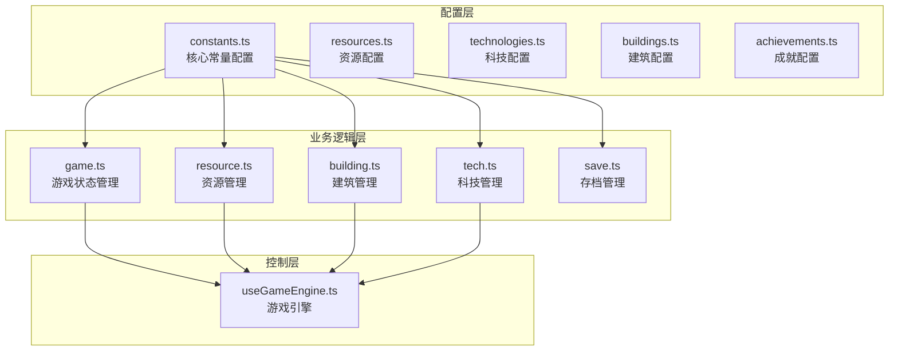
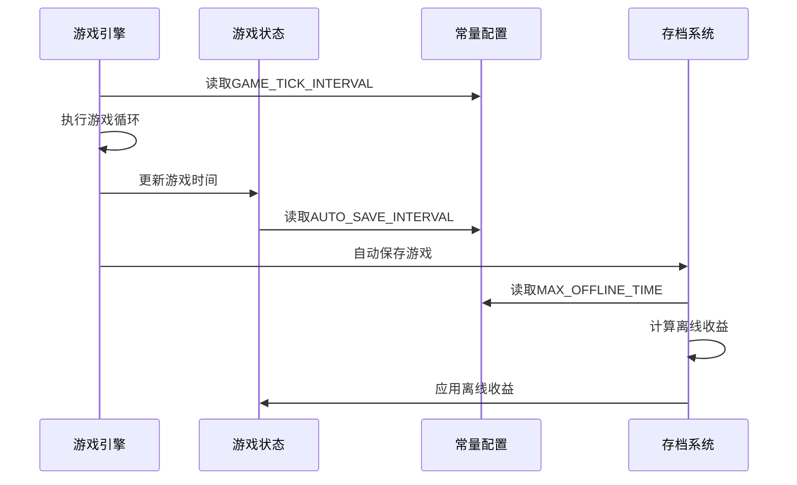
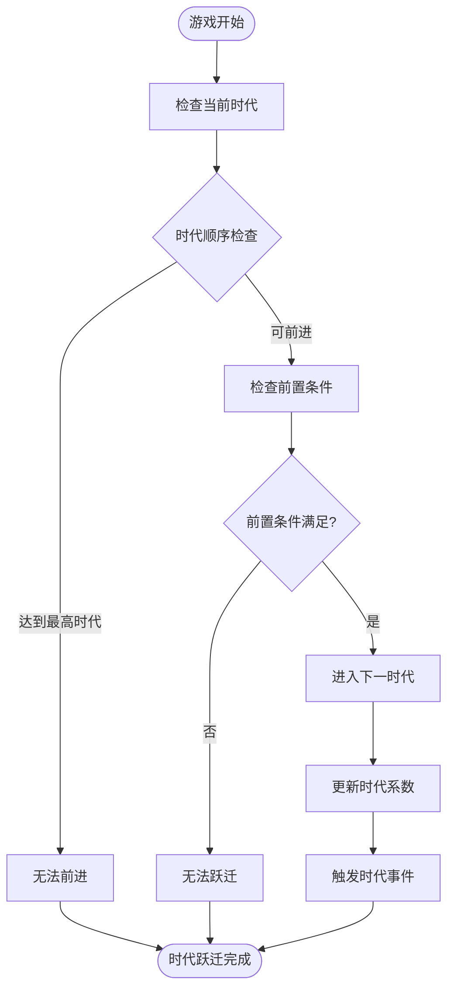
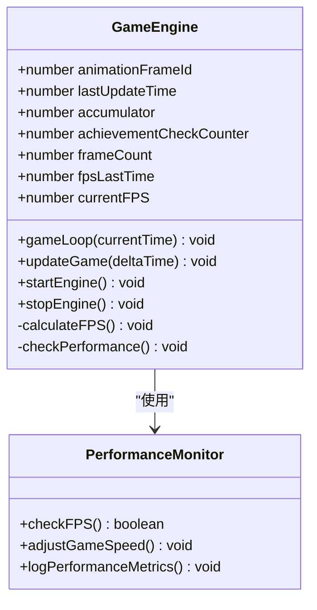
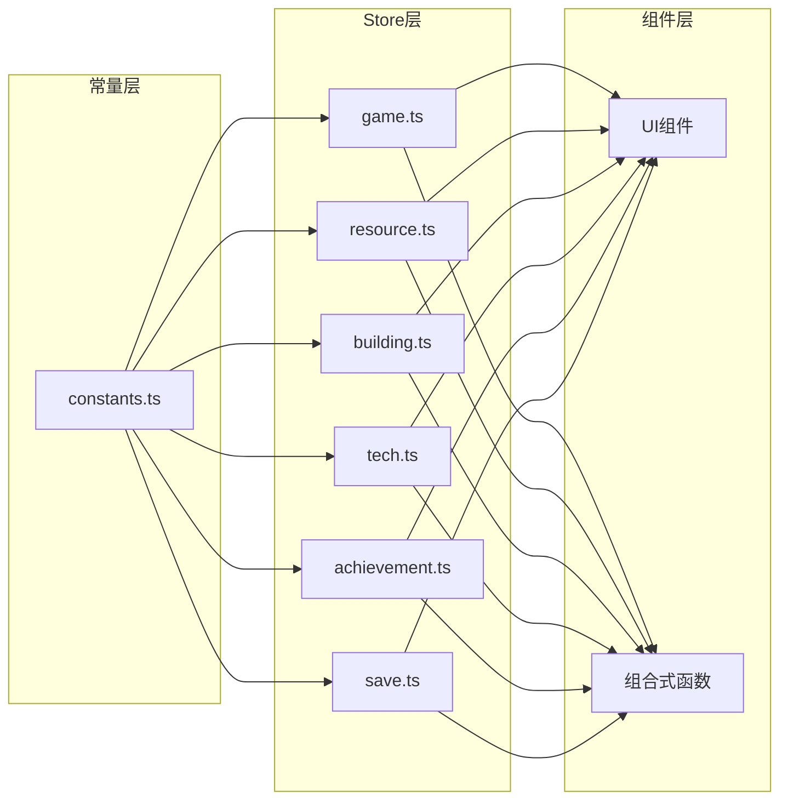

# 常量配置

<cite>
**本文档中引用的文件**
- [constants.ts](file://civilization-game/src/config/constants.ts)
- [useGameEngine.ts](file://civilization-game/src/composables/useGameEngine.ts)
- [game.ts](file://civilization-game/src/stores/game.ts)
- [save.ts](file://civilization-game/src/stores/save.ts)
- [resources.ts](file://civilization-game/src/config/resources.ts)
- [technologies.ts](file://civilization-game/src/config/technologies.ts)
- [index.ts](file://civilization-game/src/types/index.ts)
</cite>

## 目录
1. [简介](#简介)
2. [项目结构概览](#项目结构概览)
3. [核心常量分类](#核心常量分类)
4. [时间与存档系统](#时间与存档系统)
5. [游戏平衡参数](#游戏平衡参数)
6. [时代与科技系统](#时代与科技系统)
7. [性能监控与优化](#性能监控与优化)
8. [常量应用架构](#常量应用架构)
9. [性能调优建议](#性能调优建议)
10. [总结](#总结)

## 简介

本游戏采用集中式常量管理模式，将所有游戏参数统一配置在`constants.ts`文件中。这种设计模式提供了以下优势：
- **可维护性**：所有魔法数值集中管理，便于调整和维护
- **一致性**：确保游戏参数在整个系统中的一致性
- **可读性**：清晰的常量命名和分组提高了代码可读性
- **灵活性**：支持不同游戏模式（休闲、标准、快速、极速）的动态调整

## 项目结构概览



**图表来源**
- [constants.ts](file://civilization-game/src/config/constants.ts#L1-L61)
- [useGameEngine.ts](file://civilization-game/src/composables/useGameEngine.ts#L1-L143)

## 核心常量分类

### 游戏基础常量

```typescript
// 游戏版本
export const GAME_VERSION = '0.1.0-alpha'

// 游戏速度配置
export const GAME_SPEED = {
  CASUAL: 0.5,    // 休闲模式
  NORMAL: 1.0,    // 标准模式
  FAST: 2.0,      // 快速模式
  TURBO: 4.0      // 极速模式
}
```

这些基础常量为整个游戏提供了统一的版本管理和速度控制机制。

**章节来源**
- [constants.ts](file://civilization-game/src/config/constants.ts#L1-L10)

### 时间与存档系统

#### 游戏循环时间常量

```typescript
export const GAME_TICK_INTERVAL = 1000 // 游戏循环间隔(毫秒)
export const AUTO_SAVE_INTERVAL = 30000 // 自动保存间隔(毫秒)
export const ACHIEVEMENT_CHECK_INTERVAL = 5000 // 成就检测间隔(毫秒)
```

#### 离线收益系统

```typescript
export const MAX_OFFLINE_TIME = 24 * 60 * 60 // 最大离线时间(秒) - 24小时
export const OFFLINE_EFFICIENCY = {
  tier1: { maxTime: 2 * 60 * 60, efficiency: 1.0 },    // 前2小时: 100%
  tier2: { maxTime: 8 * 60 * 60, efficiency: 0.75 },   // 2-8小时: 75%
  tier3: { maxTime: 24 * 60 * 60, efficiency: 0.5 },   // 8-24小时: 50%
  tier4: { maxTime: Infinity, efficiency: 0.25 }       // 超过24小时: 25%
}
```

离线收益系统采用分层效率机制，根据离线时间长短提供不同的收益倍率，既保证了玩家体验，又防止了离线收益过高导致的游戏失衡。

**章节来源**
- [constants.ts](file://civilization-game/src/config/constants.ts#L11-L25)

## 时间与存档系统

### 游戏引擎集成



**图表来源**
- [useGameEngine.ts](file://civilization-game/src/composables/useGameEngine.ts#L15-L50)
- [game.ts](file://civilization-game/src/stores/game.ts#L40-L60)
- [save.ts](file://civilization-game/src/stores/save.ts#L120-L150)

### 自动保存机制

自动保存系统通过`AUTO_SAVE_INTERVAL`常量控制保存频率，确保游戏状态不会因意外中断而丢失。该机制在以下场景中发挥作用：

1. **定期保存**：每30秒自动保存一次游戏状态
2. **离线检测**：检测玩家离线时间并计算相应收益
3. **版本兼容**：支持存档版本检查和迁移

**章节来源**
- [save.ts](file://civilization-game/src/stores/save.ts#L100-L130)

## 游戏平衡参数

### 人口系统参数

```typescript
export const POPULATION = {
  baseGrowthRate: 1 / 60, // 基础增长率: 1人口/60秒
  foodConsumptionPerPop: 0.5, // 每人口消耗食物/秒
  initialPopulation: 10, // 初始人口
  initialMaxPopulation: 20 // 初始人口上限
}
```

### 建筑升级系统

```typescript
export const BUILDING = {
  costMultiplier: 2.0, // 升级成本倍数
  timeMultiplier: 1.8, // 升级时间倍数
  productionIncreasePerLevel: 0.15, // 每级产出提升15%
  storageIncreasePerLevel: 0.12 // 每级存储提升12%
}
```

### 时代系数系统

```typescript
export const ERA_MULTIPLIER = {
  stone: 1.0,
  bronze: 1.5,
  iron: 2.0,
  industrial: 3.0,
  information: 4.0,
  space: 6.0,
  interstellar: 10.0,
  hyperdimensional: 15.0
}
```

时代系数直接影响各个时代资源产出、科技研究速度和建筑功能的强度，确保游戏难度随着时代进步而递增。

**章节来源**
- [constants.ts](file://civilization-game/src/config/constants.ts#L26-L45)

## 时代与科技系统

### 时代跃迁逻辑



**图表来源**
- [game.ts](file://civilization-game/src/stores/game.ts#L120-L150)

### 科技研究速度

科技研究速度受到时代系数和各种加成的影响：

```typescript
// 科技研究速度 = 基础速度 × 时代系数 × 研究加成 × 技术加成
const researchSpeed = baseSpeed * eraMultiplier * researchBonus * techBonus
```

**章节来源**
- [technologies.ts](file://civilization-game/src/config/technologies.ts#L1-L50)

## 性能监控与优化

### 游戏引擎性能监控



**图表来源**
- [useGameEngine.ts](file://civilization-game/src/composables/useGameEngine.ts#L15-L40)

### 性能阈值设置

游戏引擎内置性能监控机制，当FPS低于50时会触发警告并考虑性能优化：

```typescript
// FPS计算和性能监控
if (currentTime - fpsLastTime >= 1000) {
  currentFPS = frameCount
  frameCount = 0
  fpsLastTime = currentTime
  
  // 如果FPS低于50，进行性能调整
  if (currentFPS < 50) {
    console.warn(`Low FPS detected: ${currentFPS}, consider performance optimization`)
  }
}
```

**章节来源**
- [useGameEngine.ts](file://civilization-game/src/composables/useGameEngine.ts#L30-L45)

## 常量应用架构

### Pinia Store集成



**图表来源**
- [game.ts](file://civilization-game/src/stores/game.ts#L1-L20)
- [useGameEngine.ts](file://civilization-game/src/composables/useGameEngine.ts#L1-L10)

### 常量引用模式

所有Store都通过相对路径引用constants.ts中的常量：

```typescript
// 在game.ts中引用
import { POPULATION } from '@/config/constants'

// 在save.ts中引用
import { STORAGE_KEYS, GAME_VERSION } from '@/config/constants'

// 在tech.ts中引用
import { ERA_MULTIPLIER } from '@/config/constants'
```

这种引用模式确保了常量的一致性和可维护性。

**章节来源**
- [game.ts](file://civilization-game/src/stores/game.ts#L1-L10)
- [save.ts](file://civilization-game/src/stores/save.ts#L1-L10)

## 性能调优建议

### 游戏循环优化

1. **帧跳过机制**：当累积时间超过最大限制时自动跳过帧
2. **成就检测优化**：将成就检查频率从每秒一次降低到每10秒一次
3. **性能监控**：实时监控FPS并在必要时调整游戏速度

```typescript
// 性能优化示例
const maxAccumulator = GAME_TICK_INTERVAL * 3 // 最多积累3秒
if (accumulator > maxAccumulator) {
  console.warn(`Frame skip: accumulator ${accumulator}ms exceeded limit`)
  accumulator = maxAccumulator
}
```

### 存档系统优化

1. **数据压缩**：实现存档数据压缩以减少存储空间
2. **增量保存**：只保存变化的数据而非完整状态
3. **版本兼容**：支持不同版本存档的自动迁移

**章节来源**
- [useGameEngine.ts](file://civilization-game/src/composables/useGameEngine.ts#L50-L65)
- [save.ts](file://civilization-game/src/stores/save.ts#L20-L50)

## 总结

本游戏的常量配置系统展现了优秀的软件架构设计原则：

### 主要优势

1. **集中管理**：所有游戏参数统一配置，便于维护和调整
2. **类型安全**：利用TypeScript类型系统确保常量使用的正确性
3. **模块化设计**：清晰的分层架构和职责分离
4. **性能优化**：内置性能监控和自适应优化机制
5. **扩展性**：支持不同游戏模式和未来功能扩展

### 设计亮点

- **时代系数系统**：通过ERA_MULTIPLIER实现平滑的游戏难度递增
- **离线收益机制**：分层效率设计平衡了玩家体验和游戏平衡
- **自动保存系统**：智能的存档管理和版本兼容机制
- **性能监控**：实时监控和自适应调整确保流畅的游戏体验

这种常量配置模式不仅提高了代码的可维护性，还为游戏的长期发展奠定了坚实的基础。开发者可以通过调整单一常量轻松修改游戏平衡，同时保持系统的稳定性和一致性。