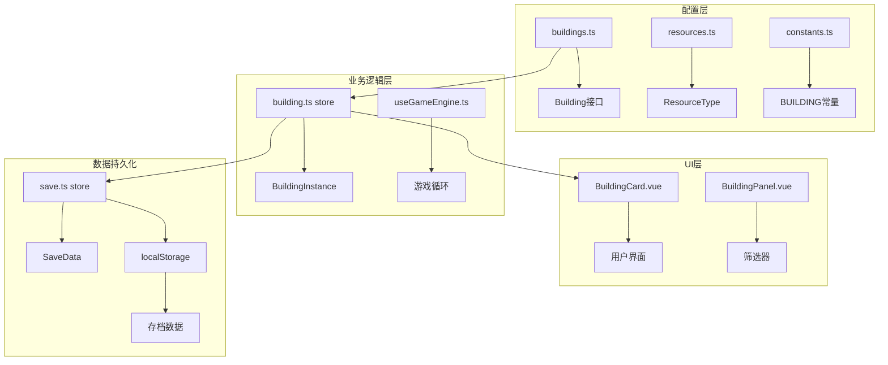
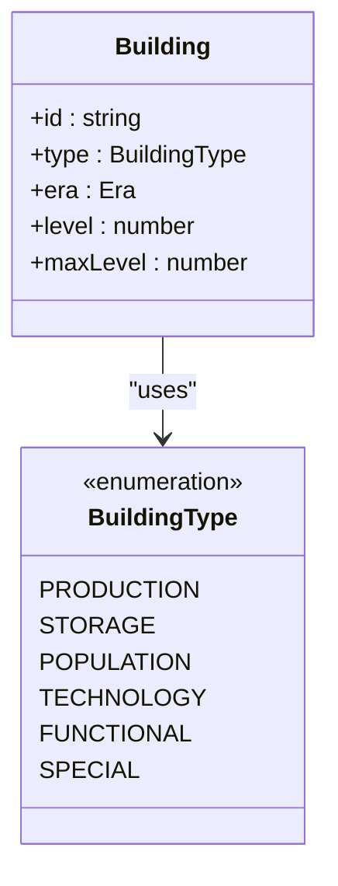
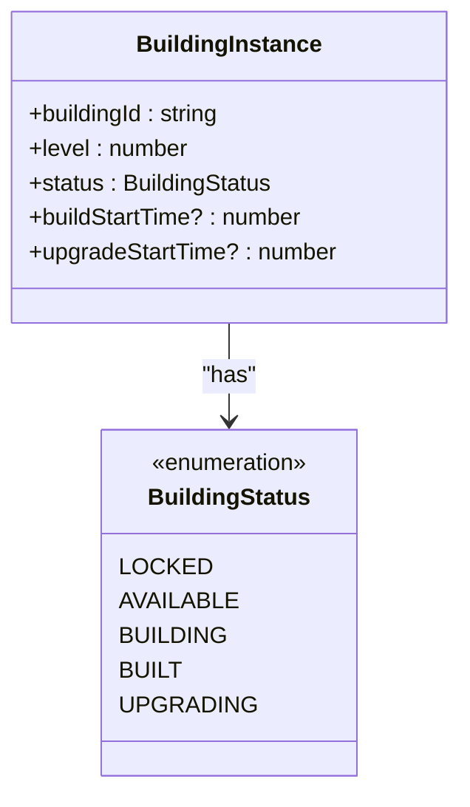
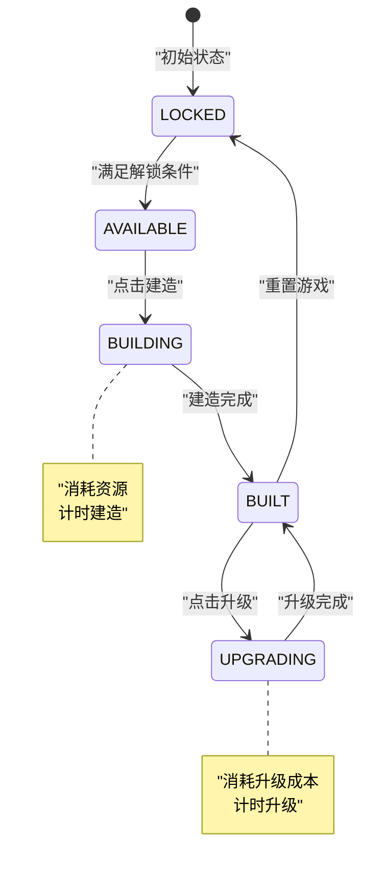
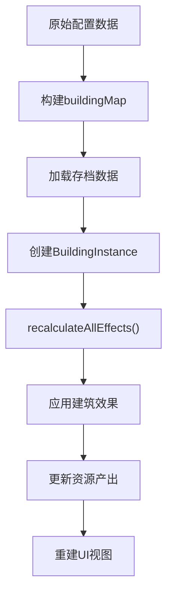
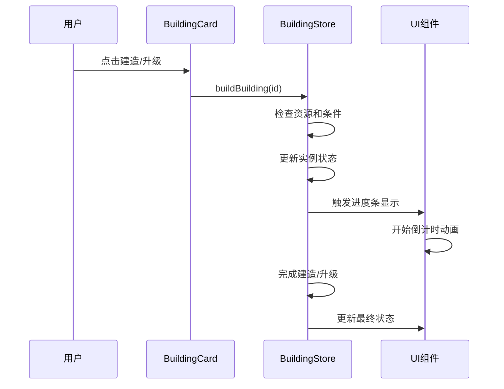
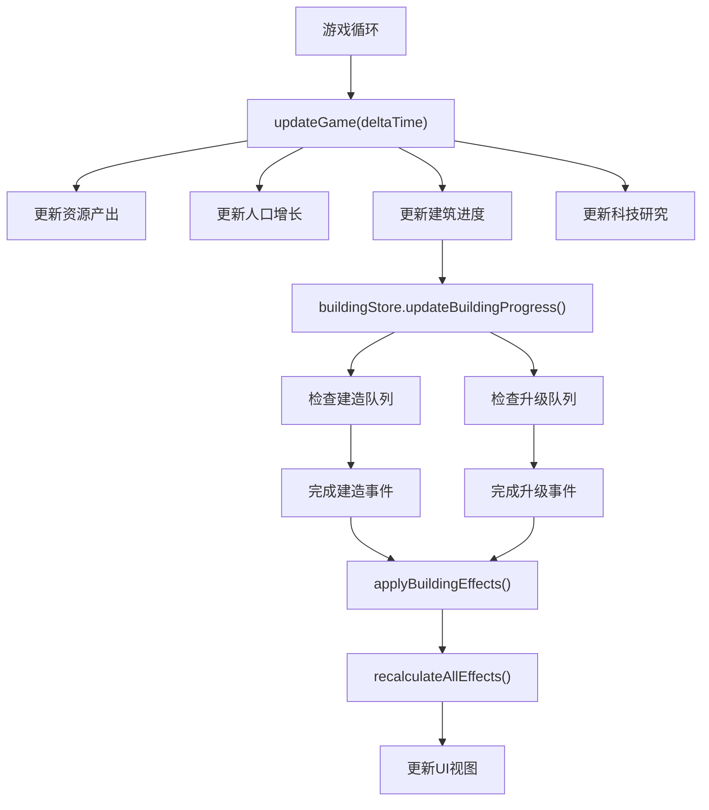

# 建筑系统配置文档

<cite>
**本文档引用的文件**
- [buildings.ts](file://civilization-game/src/config/buildings.ts)
- [index.ts](file://civilization-game/src/types/index.ts)
- [BuildingCard.vue](file://civilization-game/src/components/game/BuildingCard.vue)
- [BuildingPanel.vue](file://civilization-game/src/components/game/BuildingPanel.vue)
- [building.ts](file://civilization-game/src/stores/building.ts)
- [save.ts](file://civilization-game/src/stores/save.ts)
- [useGameEngine.ts](file://civilization-game/src/composables/useGameEngine.ts)
- [constants.ts](file://civilization-game/src/config/constants.ts)
</cite>

## 目录
1. [简介](#简介)
2. [项目结构概览](#项目结构概览)
3. [核心配置结构](#核心配置结构)
4. [建筑类型系统](#建筑类型系统)
5. [配置字段详解](#配置字段详解)
6. [运行时实例管理](#运行时实例管理)
7. [UI组件集成](#ui组件集成)
8. [扩展新建筑指南](#扩展新建筑指南)
9. [性能考虑](#性能考虑)
10. [故障排除指南](#故障排除指南)
11. [总结](#总结)

## 简介

建筑系统是《文明游戏》的核心组件之一，负责管理游戏中所有建筑物的配置、生产和升级机制。该系统采用声明式配置架构，通过`Building`接口定义建筑属性，并通过`BuildingInstance`接口管理运行时状态。

建筑系统支持从石器时代到超维时代的8个时代，包含100多个不同类型的建筑，涵盖生产、存储、人口、科技、功能和特殊建筑六大类别。

## 项目结构概览



**图表来源**
- [buildings.ts](file://civilization-game/src/config/buildings.ts#L1-L50)
- [building.ts](file://civilization-game/src/stores/building.ts#L1-L30)
- [BuildingCard.vue](file://civilization-game/src/components/game/BuildingCard.vue#L1-L30)

## 核心配置结构

### Building接口定义

建筑配置通过`Building`接口定义，包含以下核心字段：

```typescript
interface Building {
  id: string                    // 唯一标识符
  name: string                 // 显示名称
  description: string          // 建筑描述
  icon: string                // 图标标识
  type: BuildingType          // 建筑类型
  era: Era                    // 所属时代
  level: number               // 当前等级
  maxLevel: number           // 最大等级
  buildCost: ResourceAmount   // 建造成本
  upgradeCostMultiplier: number // 升级成本倍数
  buildTime: number           // 建造时间(秒)
  upgradeTime: number         // 升级时间(秒)
  production?: ResourceAmount // 生产产出
  consumption?: ResourceAmount // 资源消耗
  capacity?: ResourceAmount   // 存储容量
  population?: number         // 人口上限
  requirements: Requirement[] // 解锁条件
  effects?: Effect[]          // 特殊效果
}
```

### ResourceAmount类型

资源消耗和产出使用`ResourceAmount`类型，这是一个部分记录类型，允许任意资源类型的键值对：

```typescript
type ResourceAmount = Partial<Record<ResourceType, number>>
```

这种设计使得建筑可以灵活地指定多种资源的消耗或产出，而不需要为每种资源类型定义固定的字段。

**章节来源**
- [index.ts](file://civilization-game/src/types/index.ts#L42-L88)

## 建筑类型系统

### 建筑类型枚举



**图表来源**
- [index.ts](file://civilization-game/src/types/index.ts#L44-L52)

### 类型分类详解

1. **PRODUCTION(生产类)**: 产生各种资源，如农田、伐木场、工厂
2. **STORAGE(存储类)**: 增加资源存储上限，如粮仓、仓库、数据中心
3. **POPULATION(人口类)**: 增加人口上限，如房屋、公寓、摩天大楼
4. **TECHNOLOGY(科技类)**: 提供知识产出，如图书馆、学院、研究实验室
5. **FUNCTIONAL(功能类)**: 提供特殊效果，如提升建造速度、人口增长
6. **SPECIAL(特殊类)**: 超越常规功能的建筑，如飞升密室、宇宙熔炉

**章节来源**
- [index.ts](file://civilization-game/src/types/index.ts#L44-L52)

## 配置字段详解

### 基础字段

#### id字段
- **作用**: 建筑的唯一标识符，用于在系统中引用
- **命名规范**: 使用小写字母和下划线，如`camp`、`farm`、`computer_center`
- **重要性**: 决定建筑实例的关联关系和解锁条件

#### name和description字段
- **name**: 显示给玩家的建筑名称
- **description**: 建筑功能的详细说明
- **国际化**: 支持多语言显示（需配合UI组件）

#### icon字段
- **格式**: 使用Iconify图标库的标识符
- **示例**: `'game-icons:campfire'`、`'mdi:library'`
- **选择原则**: 与建筑功能相关联的视觉符号

### 资源消耗配置

#### buildCost字段
```typescript
buildCost: {
  wood: 10,
  stone: 5,
  gold: 100
}
```

- **数据结构**: `ResourceAmount`类型
- **特点**: 支持多种资源组合
- **验证**: 在建造前检查资源是否充足

#### upgradeCostMultiplier字段
- **作用**: 定义升级成本的增长倍数
- **计算公式**: `基础成本 × (upgradeCostMultiplier ^ 当前等级)`
- **默认值**: 2.0
- **影响**: 影响游戏经济平衡和策略深度

### 生产与消耗配置

#### production字段
```typescript
production: {
  food: 2,      // 每秒产出2单位食物
  wood: 0.5     // 每秒产出0.5单位木材
}
```

- **数据结构**: `ResourceAmount`类型
- **计算**: 受等级提升和时代系数影响
- **应用**: 实时更新到资源产出统计

#### consumption字段
```typescript
consumption: {
  coal: 1,      // 每秒消耗1单位煤炭
  electricity: 2 // 每秒消耗2单位电力
}
```

- **用途**: 表明建筑运行所需的资源消耗
- **验证**: 在升级完成后检查资源供应
- **影响**: 影响整体资源平衡

### 人口与存储配置

#### population字段
- **作用**: 建造后增加的人口上限
- **计算**: 直接添加到当前人口上限
- **限制**: 不受人口上限的绝对限制

#### capacity字段
```typescript
capacity: {
  food: 1000,      // 食物存储上限增加1000
  wood: 500,       // 木材存储上限增加500
  steel: 200       // 钢材存储上限增加200
}
```

- **作用**: 增加特定资源的最大存储量
- **应用**: 立即生效，无需等待升级完成

### 解锁条件系统

#### requirements字段
```typescript
requirements: [
  { type: 'era', id: 'bronze' },           // 需要进入青铜时代
  { type: 'technology', id: 'agriculture' }, // 需要研究农业科技
  { type: 'building', id: 'farm' },         // 需要建造农田
  { type: 'resource', id: 'gold', value: 100 }, // 需要100金币
  { type: 'population', value: 10 }         // 需要10人口
]
```

- **类型支持**: era、technology、building、resource、population
- **验证时机**: 在建造前检查所有条件是否满足
- **动态更新**: 随着游戏进程自动解锁

### 特殊效果系统

#### effects字段
```typescript
effects: [
  {
    type: 'resourceMultiplier',
    target: 'food',
    value: 0.15 // 提升15%食物产出
  },
  {
    type: 'buildSpeedBonus',
    value: 0.2 // 提升20%建造速度
  }
]
```

- **效果类型**: resourceMultiplier、buildSpeedBonus、researchSpeedBonus、populationGrowth
- **目标资源**: 可以是具体资源类型或通用字符串
- **应用时机**: 建造完成后立即生效

**章节来源**
- [buildings.ts](file://civilization-game/src/config/buildings.ts#L1-L2419)

## 运行时实例管理

### BuildingInstance接口



**图表来源**
- [index.ts](file://civilization-game/src/types/index.ts#L90-L98)

### 实例生命周期



### 存储结构

#### SaveData中的建筑数据

```typescript
interface SaveData {
  buildings: BuildingInstance[]
}
```

- **序列化**: 直接存储实例数组
- **压缩**: 只存储非默认状态的数据
- **兼容性**: 支持版本迁移和增量更新

#### 数据转换流程



**图表来源**
- [building.ts](file://civilization-game/src/stores/building.ts#L280-L320)
- [save.ts](file://civilization-game/src/stores/save.ts#L1-L50)

**章节来源**
- [building.ts](file://civilization-game/src/stores/building.ts#L1-L320)
- [save.ts](file://civilization-game/src/stores/save.ts#L1-L280)

## UI组件集成

### BuildingCard组件

BuildingCard是建筑的主要展示组件，负责：

#### 核心功能
1. **基本信息展示**: 名称、描述、图标
2. **状态指示**: 当前状态（建造中、升级中、已建成）
3. **产出信息**: 实时显示生产/消耗数据
4. **成本显示**: 建造/升级所需资源
5. **操作控制**: 建造/升级按钮

#### 数据绑定

```typescript
const cost = computed<ResourceAmount>(() => {
  if (instance.value) {
    return buildingStore.calculateUpgradeCost(props.building.id)
  }
  return props.building.buildCost
})

const production = computed<ResourceAmount | undefined>(() => {
  if (!instance.value) {
    return props.building.production
  }
  return buildingStore.calculateProduction(props.building.id)
})
```

#### 进度显示



**图表来源**
- [BuildingCard.vue](file://civilization-game/src/components/game/BuildingCard.vue#L100-L150)

### BuildingPanel组件

BuildingPanel提供建筑的筛选和浏览功能：

#### 筛选功能
- **类型筛选**: 生产类、存储类、人口类、功能类
- **时代筛选**: 石器时代到超维时代
- **实时过滤**: 根据用户选择动态更新列表

#### 布局系统
```typescript
<div class="grid grid-cols-1 sm:grid-cols-2 lg:grid-cols-3 gap-3 md:gap-4">
  <BuildingCard
    v-for="building in filteredBuildings"
    :key="building.id"
    :building="building"
  />
</div>
```

- **响应式布局**: 根据屏幕尺寸自动调整列数
- **虚拟滚动**: 对于大量建筑支持性能优化

**章节来源**
- [BuildingCard.vue](file://civilization-game/src/components/game/BuildingCard.vue#L1-L237)
- [BuildingPanel.vue](file://civilization-game/src/components/game/BuildingPanel.vue#L1-L78)

## 扩展新建筑指南

### 步骤1: 定义配置项

#### 基础配置模板
```typescript
{
  id: 'new_building',
  name: '新建筑名称',
  description: '建筑功能描述',
  icon: 'game-icons:new-icon',
  type: BuildingType.PRODUCTION,
  era: Era.INFORMATION,
  level: 1,
  maxLevel: 10,
  buildCost: {
    steel: 500,
    chip: 100,
    gold: 1000
  },
  upgradeCostMultiplier: 2.5,
  buildTime: 300,
  upgradeTime: 450,
  production: {
    data: 5
  },
  requirements: [
    { type: 'technology', id: 'advanced_computing' }
  ]
}
```

#### 配置要点
1. **唯一ID**: 使用有意义的小写标识符
2. **合理成本**: 平衡建造时间和资源消耗
3. **时代匹配**: 符合所属时代的科技水平
4. **功能定位**: 明确建筑的核心用途

### 步骤2: 设置解锁科技条件

#### 科技依赖设计
```typescript
requirements: [
  { type: 'era', id: 'information' },           // 基础时代要求
  { type: 'technology', id: 'quantumComputing' }, // 关键前置科技
  { type: 'building', id: 'computer_center' },   // 基础建筑需求
  { type: 'population', value: 50 }             // 人口要求
]
```

#### 设计原则
- **渐进式解锁**: 从简单到复杂的技术路径
- **相互依赖**: 建筑之间形成合理的依赖关系
- **平衡性**: 避免过早或过晚解锁

### 步骤3: 验证资源消耗逻辑

#### 成本计算验证
```typescript
// 升级成本计算公式
const upgradeCost = baseCost * Math.pow(upgradeCostMultiplier, currentLevel)

// 示例: 第1级到第3级的成本对比
// Level 1: 500 * 2.5^0 = 500
// Level 2: 500 * 2.5^1 = 1250
// Level 3: 500 * 2.5^2 = 3125
```

#### 时间消耗验证
- **建造时间**: 考虑资源消耗和时代系数
- **升级时间**: 通常为建造时间的1.5倍
- **平衡性**: 确保游戏节奏适中

### 步骤4: 测试和调试

#### 功能测试清单
1. **建造测试**: 验证资源消耗和状态变化
2. **升级测试**: 检查成本递增和时间计算
3. **效果测试**: 确认产出、消耗和特殊效果
4. **UI测试**: 验证界面显示和交互响应

#### 性能测试
- **内存占用**: 大量建筑实例的内存使用
- **渲染性能**: 复杂UI组件的响应速度
- **保存加载**: 存档数据的大小和加载时间

## 性能考虑

### 游戏引擎集成



**图表来源**
- [useGameEngine.ts](file://civilization-game/src/composables/useGameEngine.ts#L40-L80)

### 优化策略

#### 1. 批量更新
- **资源产出**: 每秒统一计算所有建筑的产出
- **人口增长**: 集中处理人口变化逻辑
- **建筑进度**: 分批处理建造和升级队列

#### 2. 条件缓存
- **canBuild结果**: 缓存建筑可建造状态
- **成本计算**: 预计算升级成本避免重复计算
- **效果应用**: 只在必要时重新计算总效果

#### 3. 内存管理
- **实例池**: 复用BuildingInstance对象
- **弱引用**: 避免循环引用导致的内存泄漏
- **垃圾回收**: 及时清理无效的建筑实例

#### 4. 渲染优化
- **虚拟滚动**: 对于大量建筑使用虚拟滚动
- **懒加载**: 按需加载建筑图标和图片资源
- **CSS优化**: 使用高效的CSS动画和过渡效果

**章节来源**
- [useGameEngine.ts](file://civilization-game/src/composables/useGameEngine.ts#L1-L143)
- [building.ts](file://civilization-game/src/stores/building.ts#L100-L150)

## 故障排除指南

### 常见问题及解决方案

#### 1. 建筑无法建造

**症状**: 建造按钮灰色不可点击

**排查步骤**:
```typescript
// 检查解锁条件
const check = buildingStore.canBuild(buildingId)
console.log('建造检查结果:', check)

// 检查资源是否充足
const cost = instance ? calculateUpgradeCost(buildingId) : config.buildCost
const hasResources = resourceStore.hasEnoughResources(cost)
console.log('资源充足:', hasResources)
```

**可能原因**:
- 资源不足
- 未满足科技条件
- 达到最大等级
- 时代未到达

#### 2. 建造进度异常

**症状**: 建造进度条卡住或消失

**排查方法**:
```typescript
// 检查建筑实例状态
const instance = buildingStore.getBuildingInstance(buildingId)
console.log('建筑状态:', instance?.status)

// 检查游戏引擎运行状态
console.log('游戏是否暂停:', gameStore.isPaused)
console.log('帧率:', currentFPS)
```

**解决方案**:
- 重启游戏引擎
- 检查时间同步问题
- 验证进度计算逻辑

#### 3. UI显示错误

**症状**: 建筑卡片显示异常或数据不正确

**排查流程**:
```typescript
// 检查数据绑定
const building = buildingStore.getBuildingConfig(buildingId)
const instance = buildingStore.getBuildingInstance(buildingId)

// 验证计算属性
const cost = buildingStore.calculateUpgradeCost(buildingId)
const production = buildingStore.calculateProduction(buildingId)
```

**修复措施**:
- 重置UI组件状态
- 强制刷新数据绑定
- 检查样式冲突

#### 4. 存档数据损坏

**症状**: 加载游戏时出现错误或数据丢失

**恢复方案**:
```typescript
// 检查存档完整性
try {
  const saveData = decompressSaveData(compressedData)
  validateSaveData(saveData)
} catch (error) {
  console.error('存档验证失败:', error)
  // 尝试恢复备份存档
}
```

**预防措施**:
- 定期备份存档
- 启用自动保存功能
- 监控存档大小变化

**章节来源**
- [building.ts](file://civilization-game/src/stores/building.ts#L40-L80)
- [save.ts](file://civilization-game/src/stores/save.ts#L100-L150)

## 总结

建筑系统配置文档全面介绍了《文明游戏》中建筑系统的架构设计和实现细节。通过深入分析配置结构、运行时管理和UI集成，我们可以看到：

### 核心优势

1. **模块化设计**: 清晰的配置层、业务逻辑层和UI层分离
2. **灵活性强**: 支持多种资源类型和复杂的解锁条件
3. **扩展性好**: 易于添加新建筑和修改现有配置
4. **性能优化**: 有效的缓存和批量更新机制

### 技术亮点

- **声明式配置**: 通过JSON-like配置简化开发流程
- **类型安全**: 完整的TypeScript类型定义确保代码质量
- **状态管理**: Pinia store提供集中化的状态管理
- **响应式UI**: Vue 3的响应式系统实现动态界面更新

### 发展方向

随着游戏的发展，建筑系统还可以在以下方面进一步完善：
- **动态平衡**: 根据玩家行为自动调整建筑参数
- **可视化编辑器**: 提供图形化的建筑配置工具
- **插件系统**: 支持第三方模组扩展建筑内容
- **云存档**: 实现跨设备的游戏进度同步

通过这份详细的文档，开发者可以深入理解建筑系统的工作原理，并能够有效地扩展和维护这个复杂的系统。