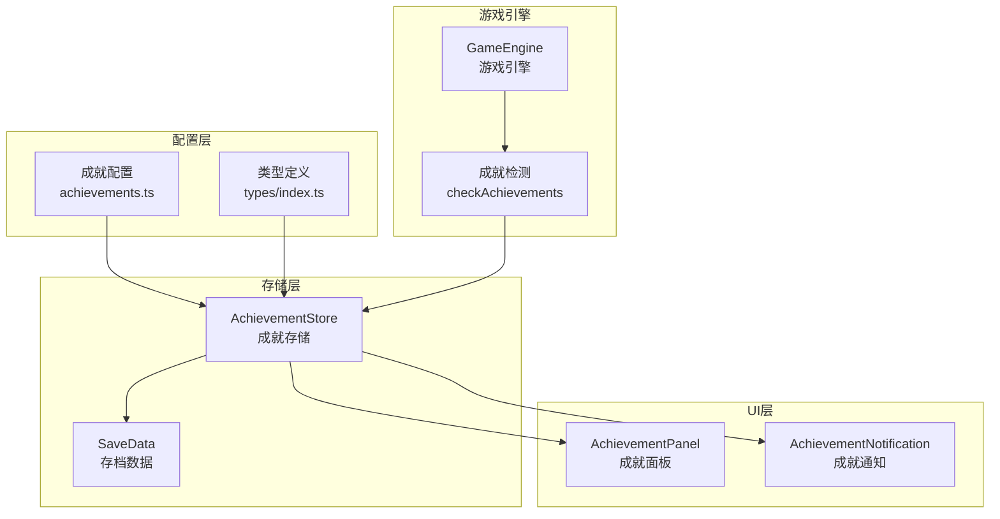
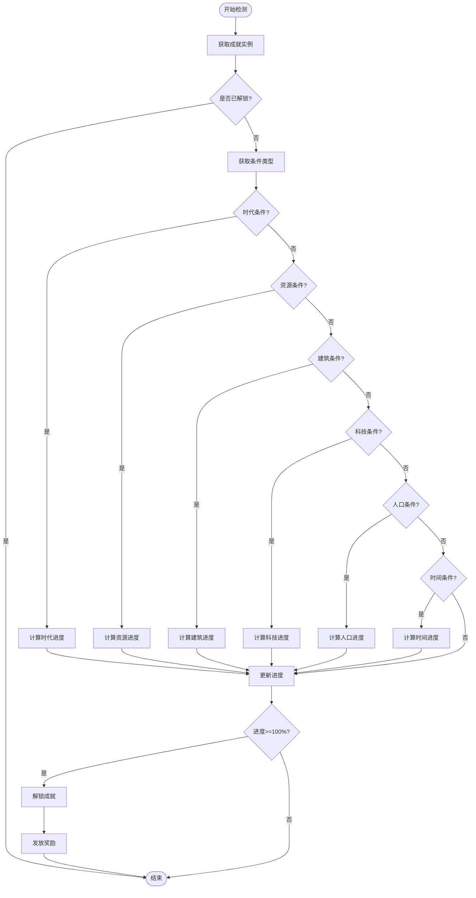
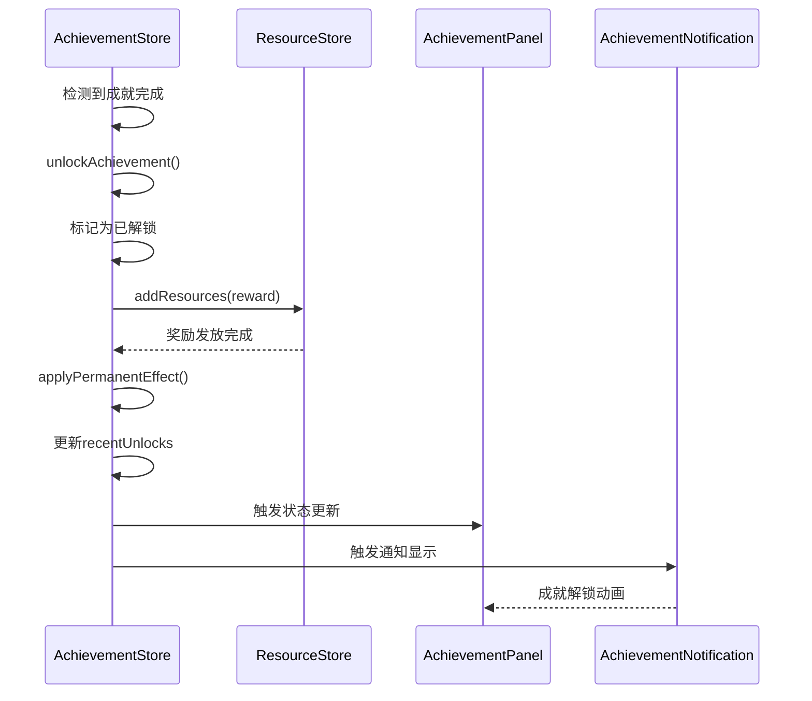
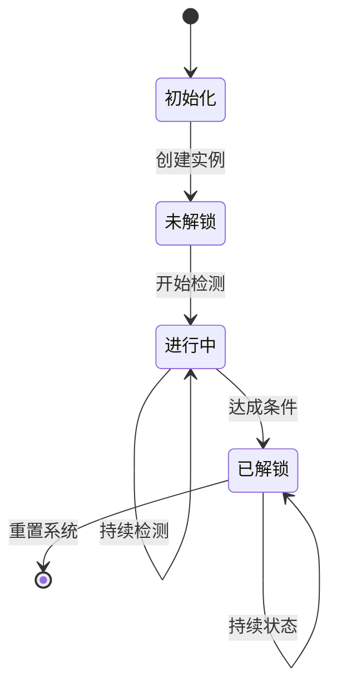
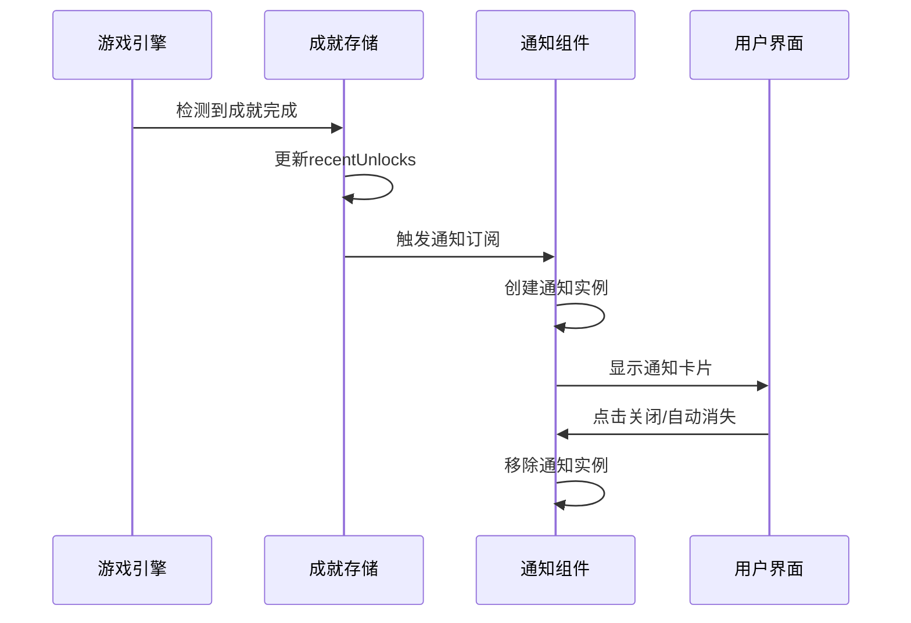
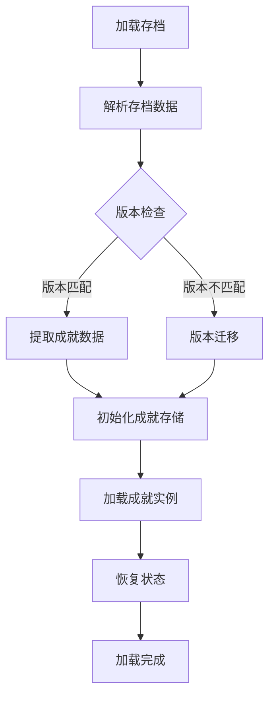

# 成就系统配置文档

<cite>
**本文档引用的文件**
- [achievements.ts](file://civilization-game/src/config/achievements.ts)
- [types/index.ts](file://civilization-game/src/types/index.ts)
- [achievement.ts](file://civilization-game/src/stores/achievement.ts)
- [AchievementPanel.vue](file://civilization-game/src/components/game/AchievementPanel.vue)
- [AchievementNotification.vue](file://civilization-game/src/components/game/AchievementNotification.vue)
- [save.ts](file://civilization-game/src/stores/save.ts)
- [useGameEngine.ts](file://civilization-game/src/composables/useGameEngine.ts)
</cite>

## 目录
1. [简介](#简介)
2. [成就系统架构](#成就系统架构)
3. [成就配置结构详解](#成就配置结构详解)
4. [成就条件机制](#成就条件机制)
5. [奖励系统](#奖励系统)
6. [成就状态管理](#成就状态管理)
7. [UI组件集成](#ui组件集成)
8. [持久化存储](#持久化存储)
9. [高级成就配置示例](#高级成就配置示例)
10. [最佳实践指南](#最佳实践指南)

## 简介

成就系统是文明建设游戏中重要的玩家激励机制，通过设定可量化的目标来增强游戏体验。本文档详细阐述了成就配置系统的设计原理、实现机制以及扩展方法。

成就系统的核心功能包括：
- **目标追踪**：实时监测玩家的游戏进度
- **条件验证**：基于多种游戏状态的动态条件判断
- **奖励发放**：解锁成就时提供即时奖励
- **视觉反馈**：通过界面组件展示成就状态
- **持久化存储**：确保成就进度在游戏重启后保持

## 成就系统架构



**图表来源**
- [achievements.ts](file://civilization-game/src/config/achievements.ts#L1-L755)
- [achievement.ts](file://civilization-game/src/stores/achievement.ts#L1-L278)

**章节来源**
- [achievement.ts](file://civilization-game/src/stores/achievement.ts#L1-L50)
- [types/index.ts](file://civilization-game/src/types/index.ts#L120-L150)

## 成就配置结构详解

### 基本成就结构

每个成就都遵循统一的接口定义，包含以下核心字段：

```typescript
interface Achievement {
  id: string                    // 唯一标识符
  name: string                 // 成就名称
  description: string          // 成就描述
  icon: string                // 图标标识
  category: string            // 成就分类
  condition: AchievementCondition  // 解锁条件
  reward: ResourceAmount      // 解锁奖励
  permanentEffect?: Effect    // 永久效果
}
```

### 字段功能详解

#### id字段
- **作用**：唯一标识成就，用于内部引用和状态管理
- **命名规范**：使用下划线分隔的小写字母组合
- **示例**：`'first_step'`, `'bronze_age'`, `'food_collector'`

#### name字段
- **作用**：显示给玩家的成就名称
- **设计原则**：简洁明了，体现成就主题
- **示例**："第一步", "青铜时代", "食物收集者"

#### description字段
- **作用**：详细描述成就要求和意义
- **长度限制**：建议控制在50字符以内
- **示例**："建造你的第一个建筑", "进入青铜时代", "累计收集1000食物"

#### icon字段
- **作用**：成就图标标识，支持多种图标库
- **格式**：字符串形式的图标标识符
- **示例**："mdi:home", "game-icons:metal-bar", "game-icons:fruit-bowl"

#### category字段
- **作用**：成就分类标签，用于界面筛选
- **可用分类**：
  - `'progress'`：进度类成就
  - `'resource'`：资源类成就
  - `'building'`：建筑类成就
  - `'technology'`：科技类成就
  - `'population'`：人口类成就
  - `'special'`：特殊成就

**章节来源**
- [achievements.ts](file://civilization-game/src/config/achievements.ts#L1-L100)
- [types/index.ts](file://civilization-game/src/types/index.ts#L120-L140)

## 成就条件机制

### 条件类型系统

成就条件采用统一的接口设计，支持多种类型的条件判断：

```typescript
interface AchievementCondition {
  type: 'era' | 'resource' | 'building' | 'technology' | 'population' | 'time'
  target?: string | ResourceType
  value: number
}
```

### 条件类型详解

#### 1. 时代条件 (era)
```typescript
{
  type: 'era',
  value: 1  // 对应青铜时代
}
```
- **用途**：基于游戏时代的解锁条件
- **实现方式**：比较当前时代索引与目标值
- **适用场景**：时代过渡成就

#### 2. 资源条件 (resource)
```typescript
{
  type: 'resource',
  target: 'food',
  value: 1000
}
```
- **用途**：累计资源收集量的条件
- **target参数**：指定资源类型
- **实现方式**：比较累计资源量与目标值

#### 3. 建筑条件 (building)
```typescript
{
  type: 'building',
  target: 'production',
  value: 5
}
```
- **用途**：建筑数量或等级的条件
- **target选项**：
  - `undefined`：总建筑数量
  - `'production'`：生产建筑数量
  - `'storage'`：存储建筑数量
  - `'max_level'`：满级建筑数量
- **实现方式**：过滤并统计符合条件的建筑实例

#### 4. 科技条件 (technology)
```typescript
{
  type: 'technology',
  value: 15
}
```
- **用途**：科技研究数量的条件
- **target选项**：可指定特定时代的研究数量
- **实现方式**：统计已研究的科技数量

#### 5. 人口条件 (population)
```typescript
{
  type: 'population',
  value: 100
}
```
- **用途**：人口数量达到目标值
- **实现方式**：直接比较当前人口与目标值

#### 6. 时间条件 (time)
```typescript
{
  type: 'time',
  value: 14400  // 4小时 = 14400秒
}
```
- **用途**：游戏持续时间达到目标
- **单位**：以秒为单位
- **实现方式**：比较游戏总时长与目标时间

### 条件检测流程



**图表来源**
- [achievement.ts](file://civilization-game/src/stores/achievement.ts#L50-L120)

**章节来源**
- [achievement.ts](file://civilization-game/src/stores/achievement.ts#L50-L120)
- [types/index.ts](file://civilization-game/src/types/index.ts#L140-L150)

## 奖励系统

### 奖励类型

成就奖励支持多种资源类型的即时奖励：

```typescript
type ResourceAmount = Partial<Record<ResourceType, number>>
```

### 支持的奖励资源

#### 基础资源
- `'food'`：食物
- `'wood'`：木材
- `'stone'`：石材

#### 中级资源
- `'copper'`：铜矿
- `'iron'`：铁矿
- `'coal'`：煤炭
- `'clay'`：黏土

#### 高级资源
- `'steel'`：钢铁
- `'oil'`：石油
- `'electricity'`：电力
- `'chip'`：芯片
- `'data'`：数据

#### 特殊资源
- `'gold'`：金币
- `'knowledge'`：知识
- `'culture'`：文化
- `'prestige'`：声望

### 奖励发放机制



**图表来源**
- [achievement.ts](file://civilization-game/src/stores/achievement.ts#L140-L180)

**章节来源**
- [achievement.ts](file://civilization-game/src/stores/achievement.ts#L140-L180)
- [types/index.ts](file://civilization-game/src/types/index.ts#L10-L30)

## 成就状态管理

### 状态数据结构

成就状态通过`AchievementInstance`接口管理：

```typescript
interface AchievementInstance {
  achievementId: string
  unlocked: boolean
  unlockedAt?: number
  progress: number
}
```

### 状态生命周期



### 状态管理功能

#### 1. 初始化管理
```typescript
function initializeAchievements() {
  achievements.forEach(achievement => {
    if (!achievementInstances.value.has(achievement.id)) {
      achievementInstances.value.set(achievement.id, {
        achievementId: achievement.id,
        unlocked: false,
        progress: 0
      })
    }
  })
}
```

#### 2. 进度计算
```typescript
const achievementProgress = computed(() => {
  const total = achievements.length
  const unlocked = unlockedAchievements.value.length
  return {
    unlocked,
    total,
    percentage: (unlocked / total) * 100
  }
})
```

#### 3. 实例查询
```typescript
function getAchievementInstance(achievementId: string): AchievementInstance | undefined {
  return achievementInstances.value.get(achievementId)
}
```

**章节来源**
- [achievement.ts](file://civilization-game/src/stores/achievement.ts#L40-L80)
- [achievement.ts](file://civilization-game/src/stores/achievement.ts#L180-L200)

## UI组件集成

### 成就面板 (AchievementPanel)

成就面板提供完整的成就浏览和进度展示功能：

#### 主要特性
- **分类筛选**：按类别快速浏览成就
- **进度显示**：实时显示未完成成就的进度
- **解锁状态**：清晰区分已解锁和未解锁成就
- **响应式设计**：适配不同屏幕尺寸

#### 界面元素
```typescript
const categories = [
  { id: 'all', name: '全部', icon: 'mdi:trophy' },
  { id: 'progress', name: '进度', icon: 'mdi:flag' },
  { id: 'resource', name: '资源', icon: 'game-icons:ore' },
  { id: 'building', name: '建筑', icon: 'game-icons:castle' },
  { id: 'technology', name: '科技', icon: 'mdi:flask' },
  { id: 'population', name: '人口', icon: 'game-icons:people' },
  { id: 'special', name: '特殊', icon: 'mdi:star' }
]
```

### 成就通知 (AchievementNotification)

成就通知组件提供即时的视觉反馈：

#### 通知特性
- **自动消失**：5秒后自动隐藏
- **点击关闭**：用户可手动关闭通知
- **动画效果**：滑入滑出动画
- **视觉强调**：高亮显示解锁成就

#### 通知流程


**图表来源**
- [AchievementNotification.vue](file://civilization-game/src/components/game/AchievementNotification.vue#L15-L40)

**章节来源**
- [AchievementPanel.vue](file://civilization-game/src/components/game/AchievementPanel.vue#L1-L50)
- [AchievementNotification.vue](file://civilization-game/src/components/game/AchievementNotification.vue#L1-L50)

## 持久化存储

### 存档数据结构

成就状态通过`SaveData`接口进行持久化：

```typescript
interface SaveData {
  version: string
  createdAt: number
  lastSaved: number
  gameState: GameState
  resources: Record<ResourceType, number>
  buildings: BuildingInstance[]
  technologies: TechnologyInstance[]
  achievements: AchievementInstance[]
}
```

### 存档序列化

成就数据采用压缩策略进行存储：

```typescript
// 只保存已解锁或有进度的成就
achievements: data.achievements
  .filter(a => a.unlocked || (a.progress && a.progress > 0))
  .map(a => ({
    i: a.achievementId,
    u: a.unlocked,
    p: a.progress ? Math.floor(a.progress * 100) / 100 : undefined
  }))
```

### 存档加载流程



**图表来源**
- [save.ts](file://civilization-game/src/stores/save.ts#L150-L200)

### 数据压缩策略

成就数据采用以下压缩策略：
- **过滤无用数据**：只保存有意义的成就状态
- **精度控制**：进度值保留两位小数
- **字段精简**：使用简短的字段名

**章节来源**
- [save.ts](file://civilization-game/src/stores/save.ts#L150-L200)
- [types/index.ts](file://civilization-game/src/types/index.ts#L180-L198)

## 高级成就配置示例

### 复杂条件配置

#### 1. 基于累计资源产量的成就
```typescript
{
  id: 'resource_magnate',
  name: '资源巨头',
  description: '累计生产10000资源',
  icon: 'game-icons:money-stack',
  category: 'resource',
  condition: {
    type: 'resource',
    target: 'cumulative_production',
    value: 10000
  },
  reward: { gold: 500, knowledge: 300 }
}
```

#### 2. 基于特定建筑数量的成就
```typescript
{
  id: 'urban_developer',
  name: '都市开发者',
  description: '同时拥有5个住宅建筑',
  icon: 'game-icons:city-hall',
  category: 'building',
  condition: {
    type: 'building',
    target: 'residential',
    value: 5
  },
  reward: { gold: 200, culture: 100 }
}
```

#### 3. 基于时代科技研究的成就
```typescript
{
  id: 'scientific_revolution',
  name: '科学革命',
  description: '在工业时代研究10个科技',
  icon: 'mdi:test-tube',
  category: 'special',
  condition: {
    type: 'technology',
    target: Era.INDUSTRIAL,
    value: 10
  },
  reward: { knowledge: 500 },
  permanentEffect: {
    type: 'researchSpeedBonus',
    value: 1.2
  }
}
```

#### 4. 多条件复合成就
```typescript
{
  id: 'balanced_civilization',
  name: '平衡文明',
  description: '同时拥有生产、存储、人口建筑各3个',
  icon: 'game-icons:balance-scale',
  category: 'special',
  condition: {
    type: 'building',
    target: 'balanced',
    value: 3
  },
  reward: { gold: 1000, culture: 500 }
}
```

### 动态条件函数

虽然当前实现中条件是静态配置的，但可以通过扩展支持动态函数：

```typescript
interface DynamicAchievementCondition {
  type: 'custom'
  validator: (context: GameContext) => boolean
  value: any
}

// 使用示例
{
  id: 'dynamic_challenge',
  name: '动态挑战',
  description: '满足自定义条件的成就',
  icon: 'mdi:brain',
  category: 'special',
  condition: {
    type: 'custom',
    validator: (context) => {
      return context.population.current > 1000 &&
             context.resources.gold > 5000 &&
             context.buildings.length > 50
    }
  },
  reward: { prestige: 100 }
}
```

## 最佳实践指南

### 成就设计原则

#### 1. 渐进式难度
- **简单目标**：新手友好，容易达成
- **中等目标**：需要一定游戏理解
- **困难目标**：高技巧要求，具有挑战性

#### 2. 明确的目标描述
```typescript
// 好的描述
{
  id: 'efficient_farmer',
  name: '高效农夫',
  description: '建造农田并使其产量达到最大值',
  icon: 'game-icons:farmer',
  category: 'building',
  condition: {
    type: 'building',
    target: 'farm',
    value: 1
  },
  reward: { food: 200 }
}

// 避免模糊描述
{
  id: 'farmer',
  name: '农民',
  description: '种植作物',
  icon: 'game-icons:farmer',
  category: 'building',
  condition: {
    type: 'building',
    value: 1
  },
  reward: { food: 100 }
}
```

#### 3. 合理的奖励设置
- **即时奖励**：提供玩家立即可用的资源
- **长期影响**：考虑永久效果对游戏平衡的影响
- **多样性**：不同类型奖励的合理搭配

### 性能优化建议

#### 1. 成就检测频率
```typescript
// 当前实现：每10秒检测一次
achievementCheckCounter += deltaTime
if (achievementCheckCounter >= 10) {
  achievementStore.checkAchievements()
  achievementCheckCounter = 0
}
```

#### 2. 条件缓存机制
对于复杂的条件计算，可以考虑添加缓存：

```typescript
const conditionCache = new Map<string, boolean>()

function checkAchievementCondition(achievement: Achievement): boolean {
  const cacheKey = `${achievement.id}_${JSON.stringify(achievement.condition)}`
  
  if (conditionCache.has(cacheKey)) {
    return conditionCache.get(cacheKey)!
  }
  
  const result = evaluateCondition(achievement.condition)
  conditionCache.set(cacheKey, result)
  
  return result
}
```

#### 3. 分批处理大型成就列表
```typescript
function batchCheckAchievements() {
  const batchSize = 10
  const achievementsArray = Array.from(achievements.values())
  
  for (let i = 0; i < achievementsArray.length; i += batchSize) {
    const batch = achievementsArray.slice(i, i + batchSize)
    batch.forEach(checkSingleAchievement)
  }
}
```

### 扩展开发指南

#### 1. 自定义条件类型
```typescript
interface CustomAchievementCondition {
  type: 'custom'
  evaluator: (gameState: GameState) => boolean
  description: string
}

// 注册自定义条件处理器
const customConditionHandlers = {
  custom: (condition: CustomAchievementCondition, state: GameState) => {
    return condition.evaluator(state)
  }
}
```

#### 2. 动态成就生成
```typescript
function generateSeasonalAchievements(season: Season): Achievement[] {
  return [
    {
      id: `season_${season}_winner`,
      name: `${season}之王`,
      description: `在${season}期间获得最高分数`,
      icon: `season:${season}`,
      category: 'special',
      condition: {
        type: 'custom',
        evaluator: (state) => {
          return state.seasonScores[season] >= state.highestScore
        }
      },
      reward: { prestige: 50 }
    }
  ]
}
```

#### 3. 成就模板系统
```typescript
const achievementTemplates = {
  resourceCollector: (resource: ResourceType, target: number): Achievement => ({
    id: `${resource}_collector_${target}`,
    name: `${getResourceName(resource)}收集者`,
    description: `累计收集${target}${getResourceUnit(resource)}`,
    icon: getResourceIcon(resource),
    category: 'resource',
    condition: {
      type: 'resource',
      target: resource,
      value: target
    },
    reward: { [resource]: target / 10 }
  })
}

// 使用模板生成成就
const foodCollector = achievementTemplates.resourceCollector('food', 5000)
```

### 测试和调试

#### 1. 成就测试工具
```typescript
function testAchievement(achievement: Achievement, gameState: GameState): boolean {
  const store = useAchievementStore()
  const instance = store.getAchievementInstance(achievement.id)
  
  if (!instance) {
    console.warn(`成就实例不存在: ${achievement.id}`)
    return false
  }
  
  const progress = calculateAchievementProgress(achievement, gameState)
  console.log(`成就: ${achievement.name}, 进度: ${progress}%`)
  
  return progress >= 100
}
```

#### 2. 条件验证
```typescript
function validateAchievementConditions(achievements: Achievement[]): void {
  achievements.forEach(achievement => {
    const condition = achievement.condition
    
    if (condition.type === 'resource' && !condition.target) {
      console.warn(`资源成就缺少target: ${achievement.id}`)
    }
    
    if (condition.type === 'building' && condition.target) {
      const validTargets = ['production', 'storage', 'residential', 'commercial']
      if (!validTargets.includes(condition.target)) {
        console.warn(`无效的建筑目标: ${condition.target}`)
      }
    }
  })
}
```

通过遵循这些最佳实践，可以创建出既有趣又平衡的成就系统，为玩家提供持续的游戏动力和成就感。