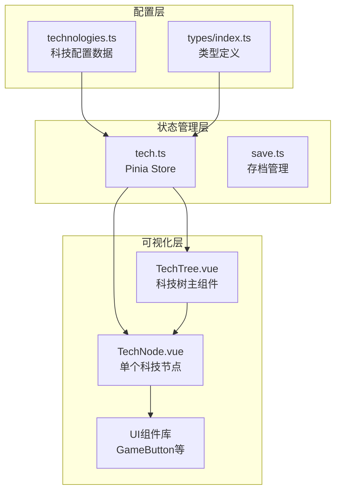
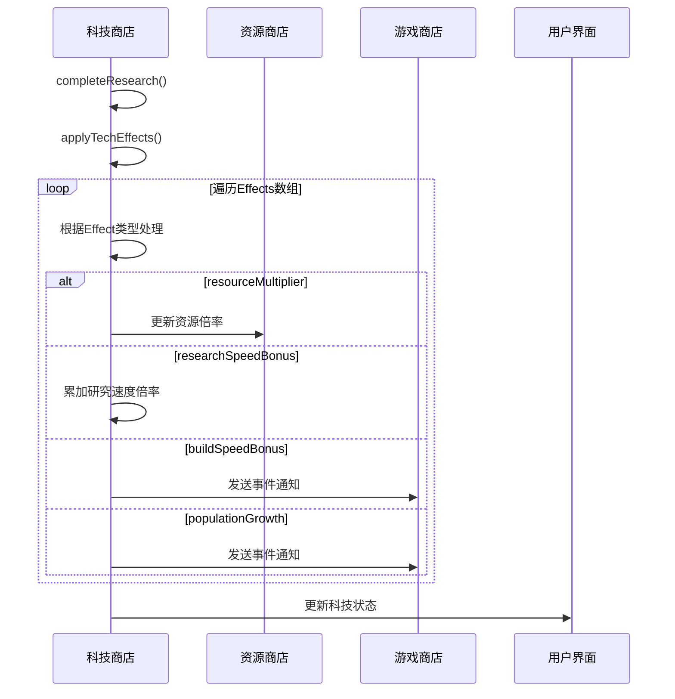
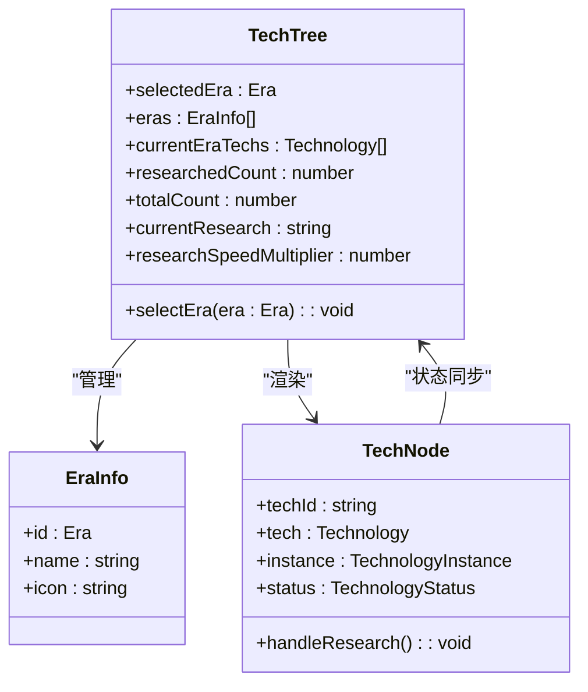
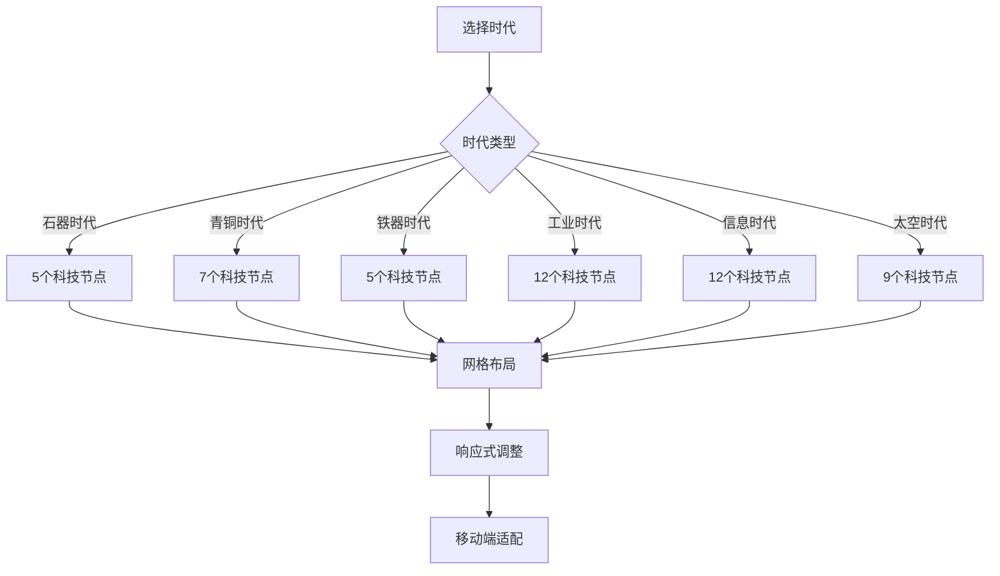
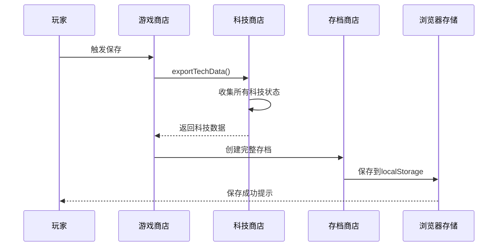

# 科技树系统配置文档

<cite>
**本文档引用的文件**
- [technologies.ts](file://civilization-game/src/config/technologies.ts)
- [types/index.ts](file://civilization-game/src/types/index.ts)
- [tech.ts](file://civilization-game/src/stores/tech.ts)
- [TechNode.vue](file://civilization-game/src/components/game/TechNode.vue)
- [TechTree.vue](file://civilization-game/src/components/game/TechTree.vue)
</cite>

## 目录
1. [简介](#简介)
2. [项目结构概览](#项目结构概览)
3. [核心配置架构](#核心配置架构)
4. [科技条目设计详解](#科技条目设计详解)
5. [Effects效果系统](#effects效果系统)
6. [科技树可视化组件](#科技树可视化组件)
7. [持久化与存档机制](#持久化与存档机制)
8. [新增科技开发指南](#新增科技开发指南)
9. [性能优化考虑](#性能优化考虑)
10. [故障排除指南](#故障排除指南)
11. [总结](#总结)

## 简介

科技树系统是《文明游戏》的核心机制之一，它通过精心设计的科技配置数据驱动整个游戏的技术发展路径。本文档深入解析了科技树系统的配置架构、实现原理以及扩展方法，帮助开发者理解和维护这个复杂的游戏机制。

科技树系统采用模块化设计，包含配置层、状态管理层和可视化层三个主要部分。每个科技条目都包含了丰富的元数据，支持复杂的前置条件检查、动态效果应用和实时状态更新。

## 项目结构概览

科技树系统的文件组织遵循清晰的分层架构：



**图表来源**
- [technologies.ts](file://civilization-game/src/config/technologies.ts#L1-L50)
- [tech.ts](file://civilization-game/src/stores/tech.ts#L1-L30)

**章节来源**
- [technologies.ts](file://civilization-game/src/config/technologies.ts#L1-L887)
- [types/index.ts](file://civilization-game/src/types/index.ts#L1-L198)

## 核心配置架构

### 科技配置数据结构

科技配置数据采用强类型的TypeScript定义，确保编译时的安全性和代码质量：

```typescript
interface Technology {
  id: string
  name: string
  description: string
  icon: string
  era: Era
  category: 'production' | 'military' | 'culture' | 'economy'
  researchCost: ResourceAmount
  researchTime: number
  prerequisites: string[]
  effects: Effect[]
  unlocks: string[]
}
```

### 时代分类系统

游戏包含8个不同的时代，每个时代都有其独特的科技主题和发展方向：


**图表来源**
- [types/index.ts](file://civilization-game/src/types/index.ts#L3-L11)

### 科技类别设计

每个科技都属于特定的发展类别，影响其在科技树中的定位和视觉表现：

- **production**: 生产类科技，直接影响资源产出
- **military**: 军事类科技，提升战斗能力
- **culture**: 文化类科技，增强文化产出和人口增长
- **economy**: 经济类科技，改善经济管理和资源流通

**章节来源**
- [technologies.ts](file://civilization-game/src/config/technologies.ts#L1-L100)
- [types/index.ts](file://civilization-game/src/types/index.ts#L120-L140)

## 科技条目设计详解

### 基础属性配置

每个科技条目都包含以下基础属性：

#### id字段 - 唯一标识符
```typescript
id: 'fire'  // 必须唯一，用于内部引用和状态追踪
```

#### name和description字段 - 用户界面显示
```typescript
name: '火的使用'
description: '学会使用火焰,提高食物生产效率'
```

#### icon字段 - 视觉标识
```typescript
icon: 'fluent:fire-24-filled'  // 使用Iconify图标的名称
```

#### era字段 - 时代归属
```typescript
era: Era.STONE  // 影响科技树的视觉布局和时代选择
```

#### category字段 - 类别分类
```typescript
category: 'production'  // 影响科技的视觉颜色和功能分类
```

### 研究成本配置

研究成本采用ResourceAmount类型，支持任意资源组合：

```typescript
researchCost: { food: 50, wood: 20 }
```

这种设计允许：
- **灵活性**: 支持单一资源或多资源组合
- **平衡性**: 不同时代和科技类型有不同的成本要求
- **策略性**: 玩家需要根据当前资源状况制定研究策略

### 研究时间配置

研究时间以秒为单位，反映科技发展的实际难度：

```typescript
researchTime: 10  // 石器时代科技通常较短
researchTime: 120 // 太空时代科技通常较长
```

### 前置科技链设计

前置科技链是科技树的核心逻辑，决定了科技的发展顺序：

```typescript
prerequisites: []  // 石器时代科技没有前置条件
prerequisites: ['fire']  // 需要先研究火的使用
prerequisites: ['bronzeWorking']  // 需要先研究青铜冶炼
```

前置科技链的设计原则：
- **线性发展**: 保持科技发展的逻辑顺序
- **分支设计**: 允许不同方向的技术发展
- **平衡性**: 避免过于复杂的依赖关系

**章节来源**
- [technologies.ts](file://civilization-game/src/config/technologies.ts#L1-L100)
- [types/index.ts](file://civilization-game/src/types/index.ts#L120-L140)

## Effects效果系统

### Effect接口定义

Effects系统是科技树的核心功能模块，通过Effect接口定义各种游戏效果：

```typescript
interface Effect {
  type: 'resourceMultiplier' | 'buildSpeedBonus' | 'researchSpeedBonus' | 'populationGrowth'
  target?: ResourceType | string
  value: number
}
```

### 支持的效果类型

#### resourceMultiplier - 资源产出倍率
```typescript
{ type: 'resourceMultiplier', target: 'food', value: 1.2 }
```
- **作用范围**: 影响指定资源的基础产出倍率
- **叠加机制**: 乘法叠加，多个效果会相乘计算
- **应用场景**: 农业技术、采矿技术等

#### buildSpeedBonus - 建造速度加成
```typescript
{ type: 'buildSpeedBonus', value: 1.2 }
```
- **作用范围**: 提升所有建筑的建造和升级速度
- **传递机制**: 通过事件系统通知建筑系统
- **应用场景**: 工程学、建筑学等

#### researchSpeedBonus - 研究速度加成
```typescript
{ type: 'researchSpeedBonus', value: 1.15 }
```
- **作用范围**: 提升整体研究速度
- **全局影响**: 影响所有科技的研究效率
- **应用场景**: 数学、科学方法等

#### populationGrowth - 人口增长加成
```typescript
{ type: 'populationGrowth', value: 1.2 }
```
- **作用范围**: 提升人口自然增长率
- **长期影响**: 对游戏后期发展有重大影响
- **应用场景**: 医学、哲学等

### Effects解析与执行流程



**图表来源**
- [tech.ts](file://civilization-game/src/stores/tech.ts#L240-L280)

**章节来源**
- [tech.ts](file://civilization-game/src/stores/tech.ts#L240-L280)
- [types/index.ts](file://civilization-game/src/types/index.ts#L100-L110)

## 科技树可视化组件

### TechTree主组件架构

TechTree组件负责整个科技树的展示和交互控制：



**图表来源**
- [TechTree.vue](file://civilization-game/src/components/game/TechTree.vue#L1-L50)
- [TechNode.vue](file://civilization-game/src/components/game/TechNode.vue#L1-L30)

### TechNode节点组件设计

TechNode组件负责单个科技节点的详细展示：

#### 状态可视化系统

```typescript
const statusColor = computed(() => {
  switch (status.value) {
    case TechnologyStatus.RESEARCHED:
      return 'bg-green-500'
    case TechnologyStatus.RESEARCHING:
      return 'bg-blue-500'
    case TechnologyStatus.AVAILABLE:
      return 'bg-yellow-500'
    default:
      return 'bg-gray-400'
  }
})
```

#### 交互功能设计

TechNode组件提供了完整的用户交互功能：

- **研究/取消研究**: 点击按钮启动或取消科技研究
- **资源检查**: 实时显示研究所需的资源是否充足
- **进度显示**: 展示研究进度条和预计完成时间
- **效果预览**: 显示科技带来的具体效果

### 科技树布局算法

科技树采用基于时代的网格布局，支持响应式设计：



**图表来源**
- [TechTree.vue](file://civilization-game/src/components/game/TechTree.vue#L80-L120)

**章节来源**
- [TechTree.vue](file://civilization-game/src/components/game/TechTree.vue#L1-L150)
- [TechNode.vue](file://civilization-game/src/components/game/TechNode.vue#L1-L266)

## 持久化与存档机制

### SaveData结构设计

科技树的状态通过SaveData接口进行持久化：

```typescript
interface SaveData {
  version: string
  createdAt: number
  lastSaved: number
  gameState: GameState
  resources: Record<ResourceType, number>
  buildings: BuildingInstance[]
  technologies: TechnologyInstance[]
  achievements: AchievementInstance[]
}
```

### TechnologyInstance状态跟踪

每个科技实例都包含完整的研究状态信息：

```typescript
interface TechnologyInstance {
  technologyId: string
  status: TechnologyStatus
  researchStartTime?: number
  researchProgress?: number
}
```

### 存档系统工作流程



**图表来源**
- [tech.ts](file://civilization-game/src/stores/tech.ts#L320-L350)

### 数据恢复机制

存档加载时的完整状态恢复过程：

```typescript
function loadTechData(data: TechnologyInstance[]) {
  techInstances.value.clear()
  data.forEach(instance => {
    techInstances.value.set(instance.technologyId, { ...instance })
  })
  
  // 恢复当前研究状态
  techInstances.value.forEach((instance, techId) => {
    if (instance.status === TechnologyStatus.RESEARCHING) {
      currentResearch.value = techId
    }
  })
  
  updateTechStatus()
}
```

**章节来源**
- [tech.ts](file://civilization-game/src/stores/tech.ts#L320-L380)
- [types/index.ts](file://civilization-game/src/types/index.ts#L180-L198)

## 新增科技开发指南

### 新科技配置模板

添加新科技的标准模板：

```typescript
{
  id: 'new_technology',
  name: '新技术名称',
  description: '详细描述新技术的功能和用途',
  icon: 'iconify-icon-name',
  era: Era.SPACE,  // 根据时代选择
  category: 'production',  // 根据功能选择
  researchCost: { 
    resource1: 1000,
    resource2: 800,
    knowledge: 1200 
  },
  researchTime: 150,  // 秒为单位
  prerequisites: ['existing_tech1', 'existing_tech2'],  // 必需的前置科技
  effects: [
    { type: 'resourceMultiplier', target: 'new_resource', value: 1.5 },
    { type: 'researchSpeedBonus', value: 0.2 }
  ],
  unlocks: ['new_building1', 'new_building2']  // 解锁的新建筑
}
```

### 前置科技链设计原则

#### 逻辑顺序原则
确保科技按照合理的顺序排列，避免出现循环依赖：

```typescript
// 正确的前置关系
scienceTech.prerequisites = []  // 科学技术作为起点
computerTech.prerequisites = ['scienceTech']  // 在科学研究基础上发展计算机
internetTech.prerequisites = ['computerTech']  // 在计算机技术基础上发展互联网
```

#### 平衡性设计
合理分配不同阶段的科技难度和收益：

- **早期科技**: 研究时间较短，成本较低，效果明显
- **中期科技**: 研究时间中等，成本适中，效果多样
- **晚期科技**: 研究时间较长，成本较高，效果深远

### 复合型增益效果配置

#### 多资源产出提升
```typescript
{
  id: 'mass_production',
  effects: [
    { type: 'resourceMultiplier', target: 'steel', value: 1.2 },
    { type: 'resourceMultiplier', target: 'coal', value: 1.2 },
    { type: 'buildSpeedBonus', value: 1.5 }
  ]
}
```

#### 多维度效果叠加
```typescript
{
  id: 'artificial_intelligence',
  effects: [
    { type: 'researchSpeedBonus', value: 0.4 },
    { type: 'resourceMultiplier', target: 'knowledge', value: 0.3 }
  ]
}
```

### 新时代科技扩展

#### 太空时代科技示例
```typescript
{
  id: 'advanced_materials',
  name: '高级材料',
  description: '研发新型合金材料',
  icon: 'game-icons:metal-bar',
  era: Era.SPACE,
  category: 'production',
  researchCost: { steel: 1000, chip: 800, knowledge: 1000 },
  researchTime: 165,
  prerequisites: ['rocketry'],
  effects: [
    { type: 'resourceMultiplier', target: 'alloy', value: 0.3 }
  ],
  unlocks: ['alloy_foundry']
}
```

**章节来源**
- [technologies.ts](file://civilization-game/src/config/technologies.ts#L848-L887)

## 性能优化考虑

### 科技状态计算优化

科技树系统采用了多种性能优化策略：

#### 响应式计算缓存
```typescript
const availableTechs = computed(() => {
  return technologies.filter(tech => {
    const instance = techInstances.value.get(tech.id)
    if (instance?.status === TechnologyStatus.RESEARCHED || 
        instance?.status === TechnologyStatus.RESEARCHING) {
      return false
    }
    
    const canResearch = checkPrerequisites(tech.id)
    return canResearch
  })
})
```

#### 状态更新批量处理
```typescript
function updateTechStatus() {
  techInstances.value.forEach((instance, techId) => {
    if (instance.status === TechnologyStatus.LOCKED) {
      const canResearch = checkPrerequisites(techId)
      if (canResearch) {
        instance.status = TechnologyStatus.AVAILABLE
      }
    }
  })
}
```

### 内存管理策略

#### Map数据结构优化
科技树使用Map结构存储科技实例，提供O(1)的查找性能：

```typescript
const techInstances = ref<Map<string, TechnologyInstance>>(new Map())
```

#### 避免频繁DOM操作
可视化组件采用虚拟滚动和条件渲染，减少DOM节点数量：

```vue
<div class="tech-grid">
  <TechNode
    v-for="tech in currentEraTechs"
    :key="tech.id"
    :tech-id="tech.id"
  />
</div>
```

### 网络请求优化

对于大型科技树，建议采用懒加载策略：

```typescript
// 按需加载特定时代的科技
const currentEraTechs = computed(() => {
  return getTechnologiesByEra(selectedEra.value)
})
```

## 故障排除指南

### 常见问题诊断

#### 科技无法解锁问题

**症状**: 科技显示为"已锁定"但应该可以研究

**排查步骤**:
1. 检查前置科技是否正确设置
2. 验证前置科技是否已研究完成
3. 确认科技实例状态是否正确

```typescript
// 调试前置条件检查
function debugPrerequisites(techId: string) {
  const tech = getTechnology(techId)
  if (!tech) return
  
  console.log(`检查科技 ${tech.name} 的前置条件`)
  tech.prerequisites.forEach(prereqId => {
    const prereq = techInstances.value.get(prereqId)
    console.log(`${prereqId}: ${prereq?.status}`)
  })
}
```

#### 研究进度异常问题

**症状**: 研究进度停滞或异常

**排查步骤**:
1. 检查研究时间计算是否正确
2. 验证研究速度倍率计算
3. 确认时间戳记录是否准确

```typescript
// 调试研究进度
function debugResearchProgress(techId: string) {
  const instance = techInstances.value.get(techId)
  const tech = getTechnology(techId)
  
  if (instance && tech && instance.status === TechnologyStatus.RESEARCHING) {
    const elapsed = (Date.now() - instance.researchStartTime!) / 1000
    const totalTime = tech.researchTime / researchSpeedMultiplier.value
    const progress = (elapsed / totalTime) * 100
    
    console.log({
      elapsed,
      totalTime,
      progress,
      multiplier: researchSpeedMultiplier.value
    })
  }
}
```

#### Effects效果不生效问题

**症状**: 科技效果没有按预期工作

**排查步骤**:
1. 验证Effect类型是否正确
2. 检查目标资源是否存在
3. 确认效果应用逻辑是否正确

```typescript
// 调试Effects应用
function debugApplyEffects(tech: Technology) {
  console.log(`应用科技 ${tech.name} 的效果`)
  tech.effects.forEach(effect => {
    console.log(`效果类型: ${effect.type}, 目标: ${effect.target}, 值: ${effect.value}`)
  })
}
```

### 性能问题诊断

#### 科技树渲染缓慢

**可能原因**:
- 科技数量过多导致DOM节点膨胀
- 频繁的状态更新触发大量重新渲染
- 复杂的CSS样式计算

**解决方案**:
```typescript
// 实现虚拟滚动
const visibleTechs = computed(() => {
  // 只渲染可见区域的科技节点
  return currentEraTechs.value.slice(0, 20)
})
```

#### 存档加载缓慢

**可能原因**:
- 科技实例数量庞大
- 复杂的状态重建逻辑
- 大量的副作用调用

**解决方案**:
```typescript
// 批量处理状态更新
function loadTechData(data: TechnologyInstance[]) {
  // 使用requestAnimationFrame批量更新
  requestAnimationFrame(() => {
    data.forEach(instance => {
      techInstances.value.set(instance.technologyId, { ...instance })
    })
    updateTechStatus()
  })
}
```

**章节来源**
- [tech.ts](file://civilization-game/src/stores/tech.ts#L200-L300)

## 总结

科技树系统是一个复杂而精密的游戏机制，它通过精心设计的配置架构、状态管理和可视化组件，为玩家提供了丰富而有深度的技术发展体验。

### 关键设计亮点

1. **模块化架构**: 清晰分离配置层、状态管理层和可视化层
2. **强类型系统**: TypeScript确保代码质量和开发效率
3. **灵活的Effects系统**: 支持多种游戏效果的动态应用
4. **完善的存档机制**: 确保玩家进度的完整保存和恢复
5. **优秀的用户体验**: 直观的界面设计和流畅的交互体验

### 扩展建议

1. **科技树分支**: 可以考虑引入更多的科技分支选项
2. **科技联盟**: 支持与其他文明共享科技的技术
3. **科技竞赛**: 引入科技竞赛模式，增加竞争元素
4. **科技成就**: 结合成就系统，提供更多激励

科技树系统的设计充分体现了游戏开发中的最佳实践，为未来的功能扩展和内容更新奠定了坚实的基础。通过本文档的详细解析，开发者可以深入理解系统的运作原理，并能够有效地进行维护和扩展。