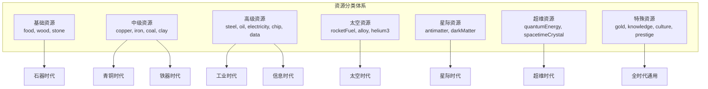
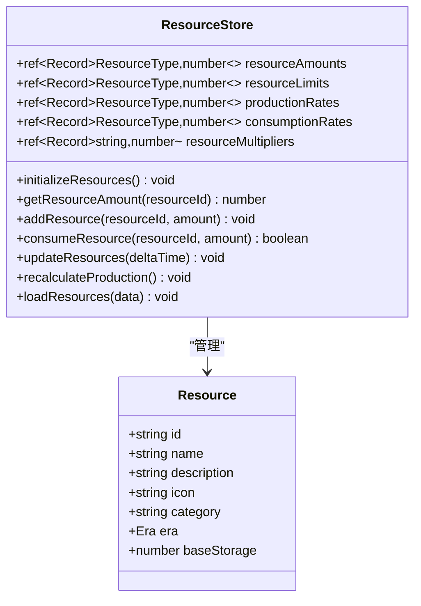
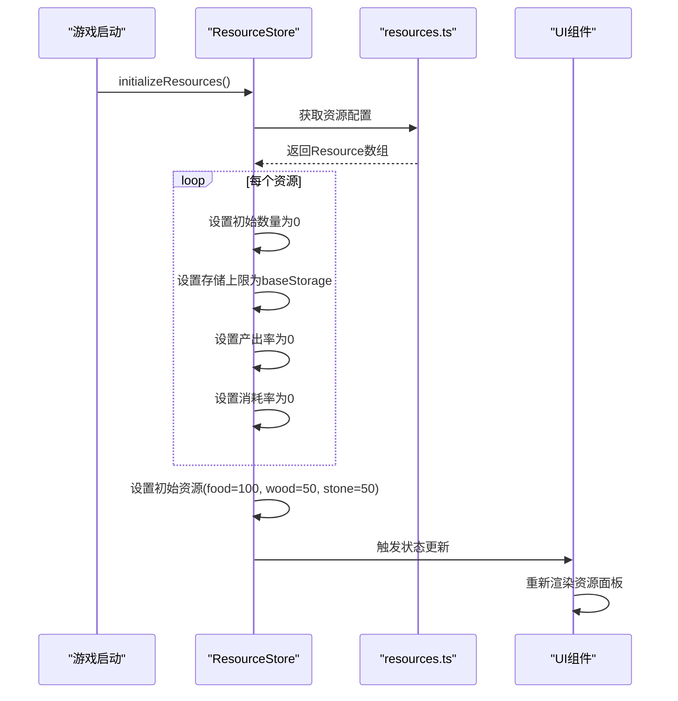
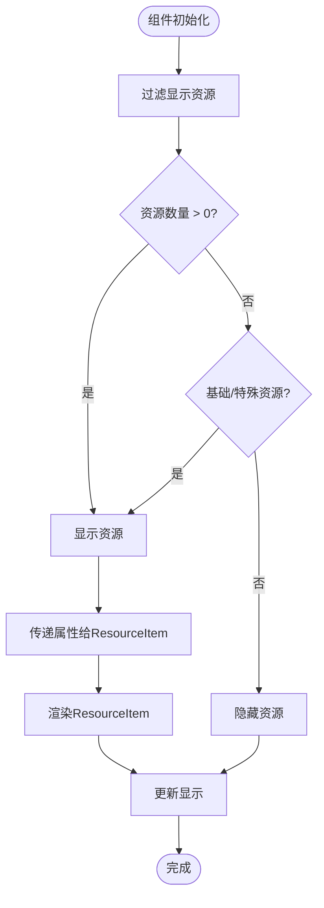
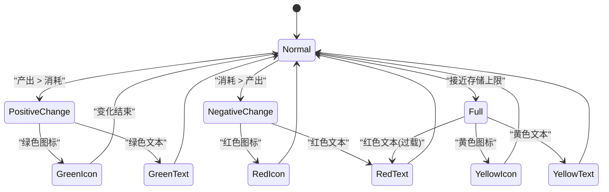
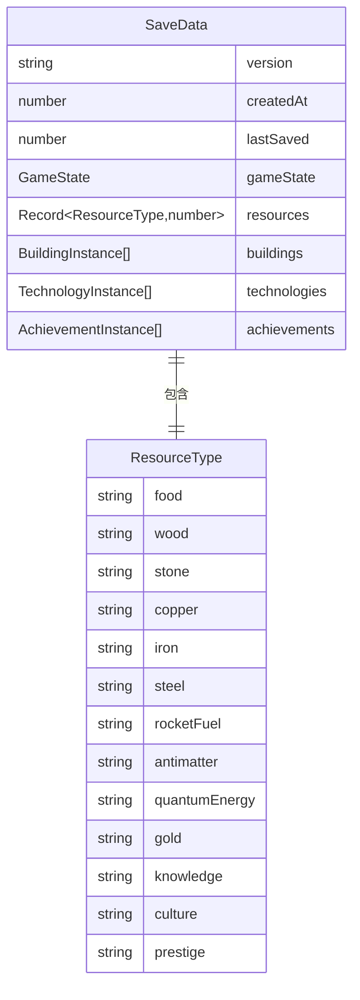
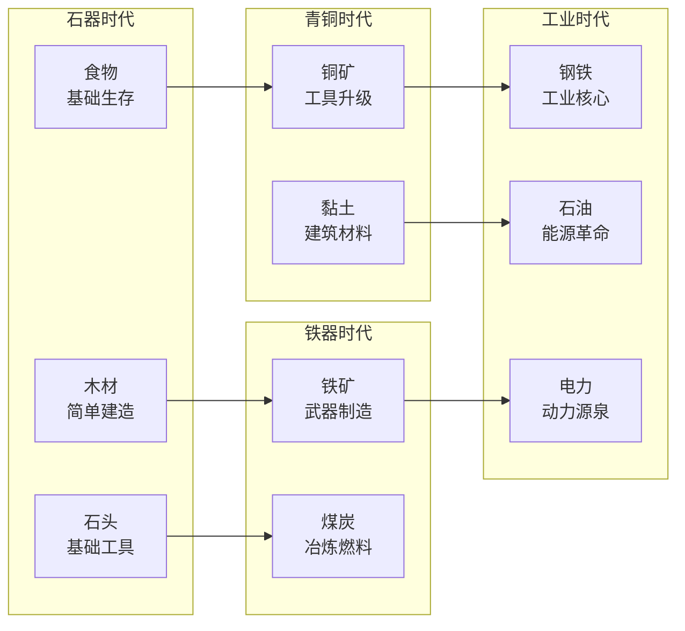

# 资源系统配置文档

<cite>
**本文档引用的文件**
- [resources.ts](file://civilization-game/src/config/resources.ts)
- [types/index.ts](file://civilization-game/src/types/index.ts)
- [resource.ts](file://civilization-game/src/stores/resource.ts)
- [ResourcePanel.vue](file://civilization-game/src/components/game/ResourcePanel.vue)
- [ResourceItem.vue](file://civilization-game/src/components/ui/ResourceItem.vue)
- [save.ts](file://civilization-game/src/stores/save.ts)
- [useGameEngine.ts](file://civilization-game/src/composables/useGameEngine.ts)
</cite>

## 目录
1. [简介](#简介)
2. [资源类型架构](#资源类型架构)
3. [资源配置详解](#资源配置详解)
4. [资源存储与管理](#资源存储与管理)
5. [UI组件集成](#ui组件集成)
6. [存档系统映射](#存档系统映射)
7. [添加新资源类型](#添加新资源类型)
8. [游戏平衡调整](#游戏平衡调整)
9. [性能考虑](#性能考虑)
10. [故障排除指南](#故障排除指南)

## 简介

资源系统是文明建设游戏中最核心的经济机制之一。本文档详细介绍了resources.ts中定义的资源类型配置系统，包括资源的结构化定义、存储管理、UI渲染以及与游戏存档系统的映射关系。

资源系统采用分层设计模式，通过TypeScript接口确保类型安全，使用Pinia状态管理实现响应式数据流，并通过Vue组件系统提供直观的用户界面。

## 资源类型架构

### 资源类型枚举

资源类型通过TypeScript联合类型定义，涵盖了从石器时代到超维时代的完整资源体系：

```typescript
export type ResourceType = 
  // 基础资源
  | 'food' | 'wood' | 'stone' 
  // 中级资源
  | 'copper' | 'iron' | 'coal' | 'clay'
  // 高级资源
  | 'steel' | 'oil' | 'electricity' | 'chip' | 'data'
  // 太空资源
  | 'rocketFuel' | 'alloy' | 'helium3' | 'titaniumOre' | 'hydrogen'
  // 星际资源
  | 'antimatter' | 'darkMatter' | 'alienOre' | 'biomass' | 'stardust'
  // 超维资源
  | 'quantumEnergy' | 'spacetimeCrystal' | 'dimensionFragment' | 'singularityEnergy'
  // 特殊资源
  | 'gold' | 'knowledge' | 'culture' | 'prestige'
```

### 资源分类体系

资源按照功能和时代特征分为以下类别：



**图表来源**
- [resources.ts](file://civilization-game/src/config/resources.ts#L1-L247)
- [types/index.ts](file://civilization-game/src/types/index.ts#L10-L30)

## 资源配置详解

### 资源接口定义

每个资源都遵循统一的Resource接口规范：

```typescript
interface Resource {
  id: ResourceType           // 资源唯一标识符
  name: string              // 显示名称
  description: string       // 资源描述
  icon: string             // 图标标识符
  category: string         // 资源类别
  era: Era                 // 解锁时代
  baseStorage: number      // 基础存储上限
}
```

### 核心字段解析

#### id字段
- **类型**: `ResourceType`
- **作用**: 资源的唯一标识符，在整个系统中作为键值使用
- **特点**: 必须严格遵循TypeScript联合类型定义

#### name字段
- **类型**: `string`
- **作用**: 用户界面中显示的资源名称
- **特点**: 支持国际化，目前为中文显示

#### icon字段
- **类型**: `string`
- **作用**: 图标库标识符，用于UI渲染
- **格式**: `game-icons:icon-name` 或 `mdi:icon-name`
- **来源**: 使用Iconify图标库

#### baseStorage字段
- **类型**: `number`
- **作用**: 定义资源的基础存储上限
- **单位**: 数量单位（如食物单位、木材立方米等）
- **影响**: 决定玩家可以存储的最大资源量

#### era字段
- **类型**: `Era`
- **作用**: 定义资源解锁的时代阶段
- **值**: `STONE`, `BRONZE`, `IRON`, `INDUSTRIAL`, `INFORMATION`, `SPACE`, `INTERSTELLAR`, `HYPERDIMENSIONAL`

**章节来源**
- [resources.ts](file://civilization-game/src/config/resources.ts#L1-L247)
- [types/index.ts](file://civilization-game/src/types/index.ts#L32-L40)

## 资源存储与管理

### Pinia状态管理

资源状态通过Pinia store进行集中管理：



**图表来源**
- [resource.ts](file://civilization-game/src/stores/resource.ts#L1-L202)

### 资源生命周期管理

#### 初始化流程



**图表来源**
- [resource.ts](file://civilization-game/src/stores/resource.ts#L18-L32)

#### 资源更新机制

资源数量通过定时更新机制保持同步：

```typescript
function updateResources(deltaTime: number = 1) {
  Object.keys(resourceAmounts.value).forEach((resourceId) => {
    const id = resourceId as ResourceType
    const production = productionRates.value[id] || 0
    const consumption = consumptionRates.value[id] || 0
    const netProduction = (production - consumption) * deltaTime
    
    if (netProduction > 0) {
      addResource(id, netProduction)
    } else if (netProduction < 0) {
      const currentAmount = getResourceAmount(id)
      const consumeAmount = Math.abs(netProduction)
      if (currentAmount >= consumeAmount) {
        consumeResource(id, consumeAmount)
      } else {
        resourceAmounts.value[id] = 0
      }
    }
  })
}
```

**章节来源**
- [resource.ts](file://civilization-game/src/stores/resource.ts#L95-L115)

## UI组件集成

### ResourcePanel组件

ResourcePanel是资源展示的主要容器组件：



**图表来源**
- [ResourcePanel.vue](file://civilization-game/src/components/game/ResourcePanel.vue#L15-L25)

### ResourceItem组件

ResourceItem负责单个资源的详细展示：

#### 属性配置

```typescript
interface Props {
  name: string                    // 资源名称
  icon: string                   // 图标标识符
  amount: number                 // 当前数量
  limit?: number                // 存储上限
  change?: number               // 每秒变化量
  showLimit?: boolean           // 是否显示上限
  showChange?: boolean          // 是否显示变化量
  showProgressBar?: boolean     // 是否显示进度条
}
```

#### 视觉反馈系统

ResourceItem实现了智能的视觉反馈机制：



**图表来源**
- [ResourceItem.vue](file://civilization-game/src/components/ui/ResourceItem.vue#L60-L85)

**章节来源**
- [ResourcePanel.vue](file://civilization-game/src/components/game/ResourcePanel.vue#L1-L49)
- [ResourceItem.vue](file://civilization-game/src/components/ui/ResourceItem.vue#L1-L104)

## 存档系统映射

### SaveData接口结构

存档系统通过SaveData接口将资源状态持久化：

```typescript
interface SaveData {
  version: string
  createdAt: number
  lastSaved: number
  gameState: GameState
  resources: Record<ResourceType, number>
  buildings: BuildingInstance[]
  technologies: TechnologyInstance[]
  achievements: AchievementInstance[]
}
```

### 资源字段映射

resources字段是一个Record对象，直接映射到ResourceType联合类型：



**图表来源**
- [types/index.ts](file://civilization-game/src/types/index.ts#L180-L197)

### 存档压缩优化

系统实现了高效的存档压缩机制：

```typescript
function compressSaveData(data: SaveData): string {
  const compressed = {
    r: Object.fromEntries(
      Object.entries(data.resources)
        .filter(([_, amount]) => amount > 0.01) // 过滤掉极小值
        .map(([id, amount]) => [id, Math.floor(amount * 10) / 10]) // 保留1位小数
    )
  }
  return JSON.stringify(compressed)
}
```

**章节来源**
- [save.ts](file://civilization-game/src/stores/save.ts#L16-L58)
- [types/index.ts](file://civilization-game/src/types/index.ts#L180-L197)

## 添加新资源类型

### 完整添加流程

添加新资源类型需要三个主要步骤：

#### 步骤1: 在resources.ts中添加配置

```typescript
// 在resources数组中添加新的资源配置
{
  id: 'newResource',           // 唯一标识符
  name: '新资源名称',          // 显示名称
  description: '资源描述',      // 详细说明
  icon: 'game-icons:new-icon', // 图标标识符
  category: 'basic',           // 资源类别
  era: Era.STONE,             // 解锁时代
  baseStorage: 1000           // 基础存储上限
}
```

#### 步骤2: 更新ResourceType枚举

```typescript
export type ResourceType = 
  // ... 现有类型
  | 'newResource'              // 添加到联合类型中
```

#### 步骤3: 实现相关生产公式

在相应的建筑或科技系统中实现资源产出逻辑：

```typescript
// 示例：建筑产出配置
const buildingProduction = {
  newResource: {
    production: 0.5,          // 每秒产出0.5单位
    multiplier: techMultiplier // 应用科技加成
  }
}
```

### 示例：添加"新能源"资源

```typescript
// 1. 在resources.ts中添加
{
  id: 'newEnergy',
  name: '新能源',
  description: '未来能源形式，具有高效率和清洁特性',
  icon: 'game-icons:fusion-reactor',
  category: 'advanced',
  era: Era.INFORMATION,
  baseStorage: 500
}

// 2. 更新ResourceType
export type ResourceType = 
  // ... 现有类型
  | 'newEnergy'

// 3. 在建筑系统中实现产出
const energyProducingBuildings = {
  solarPowerPlant: {
    production: {
      newEnergy: 1.2
    }
  },
  fusionReactor: {
    production: {
      newEnergy: 5.0
    }
  }
}
```

**章节来源**
- [resources.ts](file://civilization-game/src/config/resources.ts#L1-L247)
- [types/index.ts](file://civilization-game/src/types/index.ts#L10-L30)

## 游戏平衡调整

### 基础产量调整策略

通过修改baseProduction字段（虽然在当前版本中未直接使用，但可以通过其他方式实现）来平衡游戏性：

```typescript
// 调整特定资源的基础产量
const resourceAdjustments = {
  food: {
    baseProduction: 0.8,        // 减少食物基础产量
    storageMultiplier: 1.2      // 提高存储上限
  },
  steel: {
    baseProduction: 0.3,        // 降低钢铁产量
    unlockEra: Era.INDUSTRIAL   // 提前解锁
  }
}
```

### 时代平衡调整

不同时代的资源平衡对游戏体验至关重要：



**图表来源**
- [resources.ts](file://civilization-game/src/config/resources.ts#L1-L247)

### 资源稀缺性控制

通过调整baseStorage值来控制资源稀缺性：

```typescript
// 高价值稀有资源
const rareResources = {
  antimatter: { baseStorage: 10 },        // 极低存储上限
  spacetimeCrystal: { baseStorage: 10 },  // 极低存储上限
  darkMatter: { baseStorage: 5 }          // 极低存储上限
}

// 日常消耗资源
const commonResources = {
  food: { baseStorage: 1000 },            // 高存储上限
  wood: { baseStorage: 800 },             // 中等存储上限
  stone: { baseStorage: 800 }             // 中等存储上限
}
```

**章节来源**
- [resources.ts](file://civilization-game/src/config/resources.ts#L1-L247)

## 性能考虑

### 资源更新频率优化

游戏引擎采用固定时间步长更新机制：

```typescript
const GAME_TICK_INTERVAL = 1000 // 1秒更新间隔

function updateGame(deltaTime: number) {
  // 每秒更新一次游戏逻辑
  gameStore.updateTime(deltaTime)
  resourceStore.updateResources(deltaTime)
  // ... 其他更新逻辑
}
```

### 内存使用优化

资源存储采用稀疏矩阵优化：

```typescript
// 只存储非零资源，减少内存占用
const resourceAmounts = ref<Record<ResourceType, number>>({} as Record<ResourceType, number>)

// 只在需要时初始化资源
function initializeResources() {
  resources.forEach(resource => {
    if (!resourceAmounts.value[resource.id]) {
      resourceAmounts.value[resource.id] = 0
    }
  })
}
```

### 渲染性能优化

UI组件采用虚拟滚动和条件渲染：

```typescript
// 只渲染有数量的资源
const displayedResources = computed(() => {
  return resources.filter(resource => {
    const amount = resourceStore.getResourceAmount(resource.id)
    return amount > 0 || resource.category === 'basic' || resource.category === 'special'
  })
})
```

**章节来源**
- [useGameEngine.ts](file://civilization-game/src/composables/useGameEngine.ts#L1-L143)
- [resource.ts](file://civilization-game/src/stores/resource.ts#L18-L32)
- [ResourcePanel.vue](file://civilization-game/src/components/game/ResourcePanel.vue#L15-L25)

## 故障排除指南

### 常见问题诊断

#### 资源显示异常

**症状**: 资源数量显示错误或不更新
**排查步骤**:
1. 检查ResourceStore的状态更新
2. 验证资源ID是否正确
3. 确认UI组件的props绑定

```typescript
// 调试代码示例
console.log('Resource amounts:', resourceStore.resourceAmounts.value)
console.log('Resource limits:', resourceStore.resourceLimits.value)
console.log('Resource rates:', {
  production: resourceStore.productionRates.value,
  consumption: resourceStore.consumptionRates.value
})
```

#### 存档加载失败

**症状**: 游戏无法加载存档或数据丢失
**排查步骤**:
1. 检查SaveData接口兼容性
2. 验证资源字段映射
3. 确认数据序列化/反序列化

```typescript
// 存档验证函数
function validateSaveData(data: SaveData): boolean {
  // 检查必需字段
  if (!data.resources) {
    console.error('Missing resources field')
    return false
  }
  
  // 检查资源类型一致性
  const expectedTypes = new Set(Object.keys(data.resources))
  const actualTypes = new Set(Object.values(data.resources))
  
  return expectedTypes.size === actualTypes.size
}
```

#### 性能问题诊断

**症状**: 游戏运行缓慢或卡顿
**排查步骤**:
1. 监控帧率(FPS)
2. 分析资源更新频率
3. 检查UI组件渲染次数

```typescript
// 性能监控代码
let frameCount = 0
let fpsLastTime = 0

function gameLoop(currentTime: number) {
  frameCount++
  if (currentTime - fpsLastTime >= 1000) {
    const currentFPS = frameCount
    frameCount = 0
    fpsLastTime = currentTime
    
    if (currentFPS < 50) {
      console.warn(`Low FPS detected: ${currentFPS}`)
      // 启用性能优化模式
    }
  }
}
```

**章节来源**
- [resource.ts](file://civilization-game/src/stores/resource.ts#L95-L115)
- [save.ts](file://civilization-game/src/stores/save.ts#L16-L58)
- [useGameEngine.ts](file://civilization-game/src/composables/useGameEngine.ts#L25-L45)

## 结论

资源系统配置文档全面介绍了文明建设游戏中资源系统的架构设计、配置方法和最佳实践。通过合理配置资源类型、调整基础产量参数和优化UI渲染，开发者可以创建一个平衡且富有深度的游戏经济系统。

关键要点总结：
- 资源配置应遵循TypeScript类型安全原则
- UI组件通过响应式状态实现实时更新
- 存档系统支持高效的数据压缩和版本兼容
- 性能优化通过合理的更新频率和渲染策略实现
- 故障排除需要系统性的诊断方法和调试工具

这个资源系统为游戏提供了坚实的基础，支持从早期文明发展到星际时代的完整游戏体验。