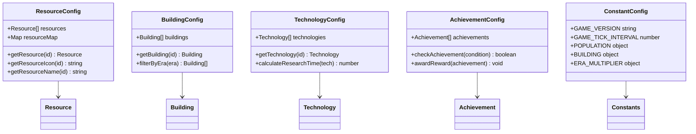

# 配置系统

<cite>
**本文档引用的文件**
- [resources.ts](file://civilization-game/src/config/resources.ts)
- [buildings.ts](file://civilization-game/src/config/buildings.ts)
- [technologies.ts](file://civilization-game/src/config/technologies.ts)
- [achievements.ts](file://civilization-game/src/config/achievements.ts)
- [constants.ts](file://civilization-game/src/config/constants.ts)
- [index.ts](file://civilization-game/src/types/index.ts)
- [game.ts](file://civilization-game/src/stores/game.ts)
</cite>

## 目录
1. [简介](#简介)
2. [项目结构概览](#项目结构概览)
3. [核心配置文件分析](#核心配置文件分析)
4. [资源系统详解](#资源系统详解)
5. [建筑系统详解](#建筑系统详解)
6. [科技系统详解](#科技系统详解)
7. [成就系统详解](#成就系统详解)
8. [常量系统详解](#常量系统详解)
9. [配置驱动开发优势](#配置驱动开发优势)
10. [扩展指南](#扩展指南)
11. [总结](#总结)

## 简介

这个文明建设游戏采用声明式配置系统设计，通过专门的配置文件管理游戏中的所有元素。这种架构模式将游戏逻辑与业务规则分离，使得游戏内容的修改和扩展变得简单直观。配置系统涵盖了资源、建筑、科技、成就等核心游戏要素，每个部分都有明确的数据结构和配置规范。

## 项目结构概览


**图表来源**
- [resources.ts](file://civilization-game/src/config/resources.ts#L1-L247)
- [buildings.ts](file://civilization-game/src/config/buildings.ts#L1-L2419)
- [technologies.ts](file://civilization-game/src/config/technologies.ts#L1-L887)
- [achievements.ts](file://civilization-game/src/config/achievements.ts#L1-L755)
- [constants.ts](file://civilization-game/src/config/constants.ts#L1-L61)

## 核心配置文件分析

配置系统的核心是五个主要的配置文件，每个文件都遵循统一的设计模式：

### 配置文件组织原则

1. **声明式设计**：所有配置都是静态声明，便于理解和维护
2. **类型安全**：通过TypeScript确保配置的一致性和正确性
3. **模块化结构**：每个配置文件专注于特定的游戏元素
4. **可扩展性**：新的配置项可以轻松添加而不影响现有代码



**图表来源**
- [resources.ts](file://civilization-game/src/config/resources.ts#L1-L247)
- [buildings.ts](file://civilization-game/src/config/buildings.ts#L1-L2419)
- [technologies.ts](file://civilization-game/src/config/technologies.ts#L1-L887)
- [achievements.ts](file://civilization-game/src/config/achievements.ts#L1-L755)
- [constants.ts](file://civilization-game/src/config/constants.ts#L1-L61)

## 资源系统详解

资源系统是游戏的基础，定义了游戏中所有的资源类型及其属性。资源按照时代和类别进行分组，支持从石器时代到超维时代的完整资源链。

### 资源分类体系


**图表来源**
- [resources.ts](file://civilization-game/src/config/resources.ts#L1-L247)

### 资源配置结构

每个资源都包含以下核心属性：

- **id**: 唯一标识符，用于程序内部引用
- **name**: 显示名称，用户界面可见
- **description**: 详细描述，帮助玩家理解资源用途
- **icon**: 图标标识，使用游戏图标库
- **category**: 分类标签，用于UI显示和过滤
- **era**: 所属时代，决定可用性和解锁条件
- **baseStorage**: 基础存储上限，随建筑等级提升

**章节来源**
- [resources.ts](file://civilization-game/src/config/resources.ts#L1-L247)
- [index.ts](file://civilization-game/src/types/index.ts#L1-L198)

## 建筑系统详解

建筑系统定义了游戏中所有可建造的建筑，包括它们的属性、成本、效果和解锁条件。建筑按照时代和功能进行分类，支持多级升级和复杂的效果叠加。

### 建筑类型系统


**图表来源**
- [buildings.ts](file://civilization-game/src/config/buildings.ts#L1-L2419)

### 建筑配置详解

每个建筑配置包含以下关键字段：

#### 基础属性
- **id**: 建筑唯一标识
- **name**: 显示名称
- **description**: 建筑功能描述
- **icon**: 图标标识
- **type**: 建筑类型
- **era**: 所属时代

#### 经济属性
- **level**: 当前等级
- **maxLevel**: 最大等级
- **buildCost**: 建造成本
- **upgradeCostMultiplier**: 升级成本倍数
- **buildTime**: 建造时间
- **upgradeTime**: 升级时间

#### 生产属性
- **production**: 每秒生产量
- **consumption**: 每秒消耗量
- **capacity**: 存储容量
- **population**: 人口上限

#### 解锁条件
- **requirements**: 解锁前置条件列表
- **effects**: 特殊效果数组

**章节来源**
- [buildings.ts](file://civilization-game/src/config/buildings.ts#L1-L2419)
- [index.ts](file://civilization-game/src/types/index.ts#L1-L198)

## 科技系统详解

科技系统构建了一个完整的科技树，涵盖从石器时代到超维时代的所有科技。每个科技都有独特的研究成本、前置条件和效果，支持复杂的解锁链和多重影响。

### 科技树结构


**图表来源**
- [technologies.ts](file://civilization-game/src/config/technologies.ts#L1-L887)

### 科技配置要素

每个科技配置包含：

#### 基础信息
- **id**: 科技唯一标识
- **name**: 显示名称
- **description**: 技术描述
- **icon**: 图标标识
- **era**: 所属时代
- **category**: 科技类别

#### 研究属性
- **researchCost**: 研究成本（资源消耗）
- **researchTime**: 研究时间（秒）
- **prerequisites**: 前置科技依赖

#### 影响效果
- **effects**: 研究后产生的效果
- **unlocks**: 解锁的建筑或科技

**章节来源**
- [technologies.ts](file://civilization-game/src/config/technologies.ts#L1-L887)
- [index.ts](file://civilization-game/src/types/index.ts#L1-L198)

## 成就系统详解

成就系统提供了丰富的游戏进度追踪和奖励机制。系统包含多种类型的成就，每种都有独特的解锁条件和永久性奖励。

### 成就分类体系


**图表来源**
- [achievements.ts](file://civilization-game/src/config/achievements.ts#L1-L755)

### 成就配置结构

每个成就包含：

#### 基础信息
- **id**: 成就唯一标识
- **name**: 显示名称
- **description**: 成就描述
- **icon**: 图标标识
- **category**: 成就类别

#### 解锁条件
- **condition**: 解锁触发条件
  - era: 达到指定时代
  - resource: 收集指定资源数量
  - building: 建造指定数量建筑
  - technology: 研究指定数量科技
  - population: 达到指定人口数量
  - time: 游戏时长

#### 奖励机制
- **reward**: 一次性奖励资源
- **permanentEffect**: 永久性效果（可选）

**章节来源**
- [achievements.ts](file://civilization-game/src/config/achievements.ts#L1-L755)
- [index.ts](file://civilization-game/src/types/index.ts#L1-L198)

## 常量系统详解

常量系统集中管理游戏中的全局参数和配置值，确保游戏平衡性和一致性。这些常量控制着游戏的核心机制和行为。

### 核心常量分类


**图表来源**
- [constants.ts](file://civilization-game/src/config/constants.ts#L1-L61)

### 关键常量详解

#### 游戏版本和时间
- **GAME_VERSION**: 游戏版本号，用于存档兼容性检查
- **GAME_TICK_INTERVAL**: 主游戏循环间隔（1秒）
- **AUTO_SAVE_INTERVAL**: 自动保存间隔（30秒）
- **ACHIEVEMENT_CHECK_INTERVAL**: 成就检测间隔（5秒）

#### 离线收益系统
- **MAX_OFFLINE_TIME**: 最大离线时间（24小时）
- **OFFLINE_EFFICIENCY**: 分阶段离线效率：
  - Tier1: 前2小时100%效率
  - Tier2: 2-8小时75%效率
  - Tier3: 8-24小时50%效率
  - Tier4: 超24小时25%效率

#### 人口管理系统
- **baseGrowthRate**: 基础人口增长率
- **foodConsumptionPerPop**: 每人口食物消耗
- **initialPopulation**: 初始人口数量
- **initialMaxPopulation**: 初始人口上限

#### 建筑升级系统
- **costMultiplier**: 升级成本倍数（2.0）
- **timeMultiplier**: 升级时间倍数（1.8）
- **productionIncreasePerLevel**: 每级产出提升（15%）
- **storageIncreasePerLevel**: 每级存储提升（12%）

#### 时代系数系统
- **ERA_MULTIPLIER**: 各时代资源产出系数：
  - 石器时代: 1.0
  - 青铜时代: 1.5
  - 铁器时代: 2.0
  - 工业时代: 3.0
  - 信息时代: 4.0
  - 太空时代: 6.0
  - 星际时代: 10.0
  - 超维时代: 15.0

**章节来源**
- [constants.ts](file://civilization-game/src/config/constants.ts#L1-L61)

## 配置驱动开发优势

配置系统采用了配置驱动开发（Configuration-Driven Development）模式，具有以下显著优势：

### 1. 灵活性和可维护性

配置驱动开发允许开发者通过修改配置文件来调整游戏行为，而无需修改代码。这种模式具有以下特点：

- **零代码修改**: 新增建筑、科技或资源只需在配置文件中添加条目
- **快速迭代**: 配置变更立即生效，无需重新编译
- **易于调试**: 配置错误容易定位和修复
- **版本控制友好**: 配置变更可以通过版本控制系统追踪

### 2. 类型安全保障

通过TypeScript的强类型系统，配置系统提供了完整的类型安全保障：

```typescript
// 类型定义确保配置的一致性
interface Building {
  id: string
  name: string
  type: BuildingType
  era: Era
  // ... 其他必需字段
}

// 编译时检查确保配置完整性
const buildings: Building[] = [
  {
    id: 'camp', // 必须是字符串
    name: '营地', // 必须是字符串
    type: BuildingType.POPULATION, // 必须是预定义类型之一
    era: Era.STONE, // 必须是预定义时代之一
    // ... 其他字段
  }
]
```

### 3. 数据驱动设计

配置系统采用数据驱动设计，使游戏内容更加灵活：

- **动态加载**: 游戏启动时自动加载配置数据
- **热更新**: 部分配置可以在运行时重新加载
- **多语言支持**: 配置文件天然支持国际化
- **平台适配**: 不同平台可以使用不同的配置

### 4. 团队协作优化

配置驱动开发特别适合团队协作：

- **职责分离**: 设计师负责配置，程序员负责逻辑
- **并行开发**: 配置和代码可以并行开发
- **知识传递**: 配置文档化程度高，便于新人上手
- **风险隔离**: 配置错误不会影响核心逻辑稳定性

## 扩展指南

### 添加新建筑

要添加新的建筑，需要遵循以下步骤：

1. **确定建筑类型和时代**
   ```typescript
   // 在 buildings.ts 中添加
   {
     id: 'new_building',
     name: '新建筑名称',
     description: '建筑功能描述',
     icon: 'game-icons:icon-name',
     type: BuildingType.PRODUCTION, // 或其他类型
     era: Era.IRON, // 属于哪个时代
     level: 1,
     maxLevel: 5,
     buildCost: { wood: 100, stone: 50 },
     upgradeCostMultiplier: 2.0,
     buildTime: 60,
     upgradeTime: 90,
     production: { food: 10 },
     requirements: [{ type: 'technology', id: 'new_technology' }]
   }
   ```

2. **更新类型定义**（如果需要新增类型）
   ```typescript
   // 在 types/index.ts 中
   export const BuildingType = {
     // ... 现有类型
     NEW_TYPE: 'new_type'
   } as const
   ```

### 添加新科技

添加新科技的流程：

1. **定义科技配置**
   ```typescript
   {
     id: 'new_technology',
     name: '新技术名称',
     description: '技术描述',
     icon: 'fluent:icon-name',
     era: Era.IRON,
     category: 'production',
     researchCost: { knowledge: 200, wood: 100 },
     researchTime: 60,
     prerequisites: ['existing_tech'],
     effects: [
       { type: 'resourceMultiplier', target: 'food', value: 1.2 }
     ],
     unlocks: ['new_building']
   }
   ```

2. **添加前置条件检查**
   ```typescript
   // 在相应的 store 中添加验证逻辑
   function canResearch(techId: string): boolean {
     const tech = getTechnology(techId)
     if (!tech) return false
     
     // 检查前置科技
     return tech.prerequisites.every(prereq => 
       isTechnologyResearched(prereq)
     )
   }
   ```

### 添加新资源

添加新资源的步骤：

1. **在资源类型中添加**
   ```typescript
   // 在 types/index.ts 中
   export type ResourceType = 
     // ... 现有资源类型
     | 'new_resource'
   ```

2. **在资源配置中添加**
   ```typescript
   // 在 resources.ts 中
   {
     id: 'new_resource',
     name: '新资源名称',
     description: '资源描述',
     icon: 'game-icons:icon-name',
     category: 'intermediate', // 或其他类别
     era: Era.IRON,
     baseStorage: 500
   }
   ```

3. **更新相关逻辑**
   ```typescript
   // 在资源管理 store 中添加处理逻辑
   function handleNewResource(resourceId: string, amount: number) {
     // 处理新资源的逻辑
   }
   ```

### 添加新成就

添加新成就的流程：

1. **定义成就配置**
   ```typescript
   {
     id: 'new_achievement',
     name: '新成就名称',
     description: '成就描述',
     icon: 'mdi:icon-name',
     category: 'progress',
     condition: {
       type: 'resource',
       target: 'new_resource',
       value: 1000
     },
     reward: { gold: 100 },
     permanentEffect: {
       type: 'resourceMultiplier',
       target: 'new_resource',
       value: 1.1
     }
   }
   ```

2. **实现成就检查逻辑**
   ```typescript
   // 在成就 store 中添加检查函数
   function checkNewResourceAchievement(resourceId: string, amount: number) {
     const achievement = getAchievement('new_achievement')
     if (achievement && resourceId === 'new_resource') {
       return amount >= achievement.condition.value
     }
     return false
   }
   ```

## 总结

这个配置系统展现了现代游戏开发中配置驱动架构的最佳实践。通过将游戏逻辑与业务规则分离，系统实现了高度的灵活性和可维护性。五大核心配置文件（resources.ts、buildings.ts、technologies.ts、achievements.ts、constants.ts）构成了一个完整的游戏配置生态系统。

### 主要优势

1. **声明式设计**: 所有游戏元素都以声明方式定义，易于理解和维护
2. **类型安全保障**: TypeScript强类型系统确保配置的正确性
3. **模块化架构**: 每个配置文件专注特定领域，降低耦合度
4. **扩展性强**: 新增元素只需修改配置文件，无需改动核心代码
5. **团队协作友好**: 设计师和开发者可以并行工作

### 应用价值

这种配置驱动的架构模式不仅适用于文明建设游戏，也可以广泛应用于其他类型的游戏开发。它提供了一种优雅的方式来管理复杂的游戏内容，同时保持代码的清晰性和可维护性。

通过深入理解这套配置系统，开发者可以更好地利用其优势来构建更加丰富和有趣的游戏体验，同时也为未来的功能扩展奠定了坚实的基础。