# 文明发展模拟游戏项目概述

<cite>
**本文档引用的文件**
- [README.md](file://README.md)
- [main.ts](file://civilization-game/src/main.ts)
- [App.vue](file://civilization-game/src/App.vue)
- [useGameEngine.ts](file://civilization-game/src/composables/useGameEngine.ts)
- [constants.ts](file://civilization-game/src/config/constants.ts)
- [game.ts](file://civilization-game/src/stores/game.ts)
- [resource.ts](file://civilization-game/src/stores/resource.ts)
- [building.ts](file://civilization-game/src/stores/building.ts)
- [tech.ts](file://civilization-game/src/stores/tech.ts)
- [save.ts](file://civilization-game/src/stores/save.ts)
- [MainLayout.vue](file://civilization-game/src/components/game/MainLayout.vue)
- [buildings.ts](file://civilization-game/src/config/buildings.ts)
- [index.ts](file://civilization-game/src/types/index.ts)
</cite>

## 目录
1. [项目简介](#项目简介)
2. [核心架构](#核心架构)
3. [游戏引擎系统](#游戏引擎系统)
4. [资源管理系统](#资源管理系统)
5. [建筑系统](#建筑系统)
6. [科技树系统](#科技树系统)
7. [时代演进系统](#时代演进系统)
8. [人口系统](#人口系统)
9. [离线收益系统](#离线收益系统)
10. [成就系统](#成就系统)
11. [存档系统](#存档系统)
12. [UI组件架构](#ui组件架构)
13. [性能优化](#性能优化)
14. [移动端适配](#移动端适配)
15. [总结](#总结)

## 项目简介

文明发展模拟游戏是一款基于Vue 3和TypeScript的纯前端增量建造类游戏，从石器时代发展到超维时代，体验人类文明的完整演进历程。该游戏采用现代Web技术栈，提供60fps流畅的游戏体验，支持移动端和桌面端跨平台游玩。

### 核心特色

- **丰富建筑系统**：包含86个独特建筑，覆盖8个文明时代
- **完整科技树**：55+个科技，逐步解锁高级功能
- **成就系统**：50个成就等待解锁，每个都有独特奖励
- **离线收益**：离线时也能积累资源（最多8小时）
- **移动端适配**：完美支持手机、平板、桌面多端体验
- **智能存档**：自动保存+压缩，存档体积减少50%
- **高性能**：60fps流畅运行，实时FPS监控

## 核心架构

游戏采用现代化的前端架构，基于Vue 3 Composition API和Pinia状态管理，结合TypeScript提供类型安全保障。

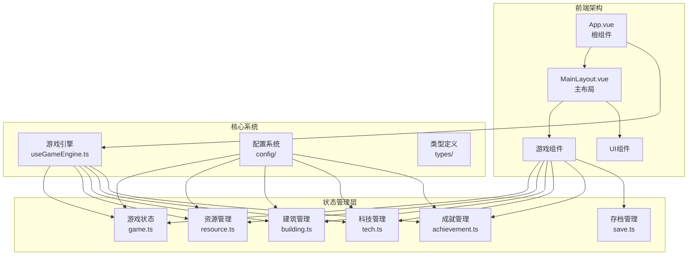

**图表来源**
- [App.vue](file://civilization-game/src/App.vue#L1-L101)
- [MainLayout.vue](file://civilization-game/src/components/game/MainLayout.vue#L1-L275)
- [useGameEngine.ts](file://civilization-game/src/composables/useGameEngine.ts#L1-L143)

**章节来源**
- [README.md](file://README.md#L1-L881)
- [main.ts](file://civilization-game/src/main.ts#L1-L13)

## 游戏引擎系统

游戏引擎是整个系统的核心，基于`requestAnimationFrame`实现60fps的流畅游戏循环，采用固定时间步长更新机制确保游戏逻辑的一致性。

### 核心架构

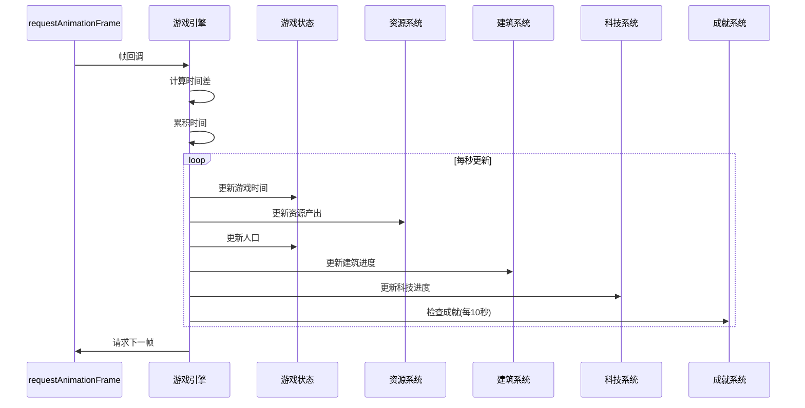

**图表来源**
- [useGameEngine.ts](file://civilization-game/src/composables/useGameEngine.ts#L25-L85)

### 游戏循环实现

游戏引擎采用以下核心逻辑：

```typescript
function gameLoop(currentTime: number) {
  const deltaTime = currentTime - lastUpdateTime
  accumulator += deltaTime
  
  // FPS监控
  frameCount++
  if (currentTime - fpsLastTime >= 1000) {
    currentFPS = frameCount
    frameCount = 0
  }
  
  // 固定时间步长更新（每1秒）
  while (accumulator >= GAME_TICK_INTERVAL) {
    updateGame(1)
    accumulator -= GAME_TICK_INTERVAL
  }
  
  animationFrameId = requestAnimationFrame(gameLoop)
}
```

### 性能监控与优化

引擎内置完善的性能监控系统：

- **FPS监控**：实时计算当前帧率，低于50fps时发出警告
- **帧跳过保护**：最多积累3秒的游戏时间，避免卡顿
- **成就检测降频**：从每帧检测改为每10秒检测一次，减少80%计算量

**章节来源**
- [useGameEngine.ts](file://civilization-game/src/composables/useGameEngine.ts#L1-L143)
- [constants.ts](file://civilization-game/src/config/constants.ts#L1-L61)

## 资源管理系统

资源管理系统负责处理游戏中20+种不同类型的资源，包括基础资源、中级资源、高级资源、太空资源、星际资源和超维资源。

### 资源类型分类

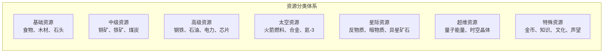

### 资源系统架构

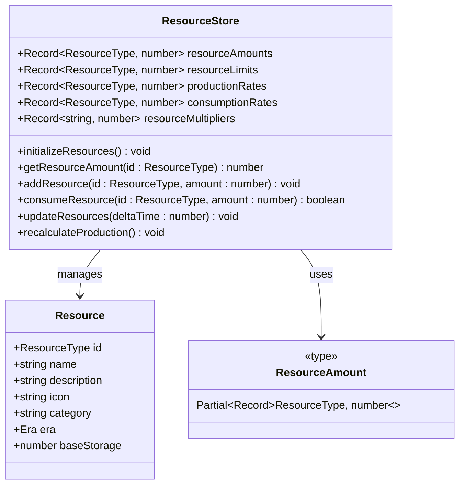

**图表来源**
- [resource.ts](file://civilization-game/src/stores/resource.ts#L1-L202)
- [index.ts](file://civilization-game/src/types/index.ts#L1-L198)

### 资源产出与消耗机制

资源系统采用净产出计算模型：

```typescript
// 更新资源逻辑
function updateResources(deltaTime: number = 1) {
  Object.keys(resourceAmounts.value).forEach((resourceId) => {
    const id = resourceId as ResourceType
    const production = productionRates.value[id] || 0
    const consumption = consumptionRates.value[id] || 0
    const netProduction = (production - consumption) * deltaTime
    
    if (netProduction > 0) {
      addResource(id, netProduction)
    } else if (netProduction < 0) {
      const currentAmount = getResourceAmount(id)
      const consumeAmount = Math.abs(netProduction)
      if (currentAmount >= consumeAmount) {
        consumeResource(id, consumeAmount)
      } else {
        resourceAmounts.value[id] = 0
      }
    }
  })
}
```

### 复杂资源链示例

资源之间存在复杂的生产链关系：

```
煤炭 (发电厂) → 电力 (芯片工厂) → 芯片 (数据中心) → 数据
铁矿 (钢铁厂) → 钢铁 (机械厂) → 机械 (工厂) → 产品
```

**章节来源**
- [resource.ts](file://civilization-game/src/stores/resource.ts#L1-L202)
- [index.ts](file://civilization-game/src/types/index.ts#L1-L198)

## 建筑系统

建筑系统是游戏的核心机制之一，包含86个独特建筑，分为生产类、存储类、人口类、研究类、功能类和特殊类六种类型。

### 建筑类型与状态

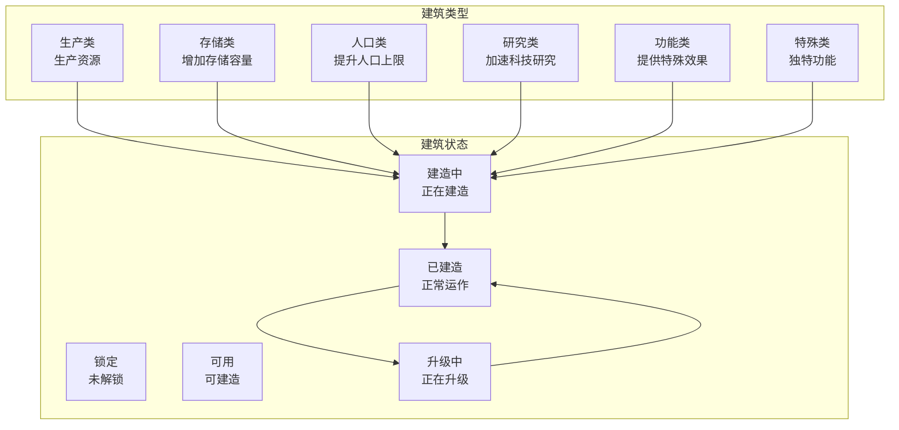

### 建筑配置系统

每个建筑都有详细的配置参数：

```typescript
interface Building {
  id: string
  name: string
  description: string
  icon: string
  type: BuildingType
  era: Era
  level: number
  maxLevel: number
  buildCost: ResourceAmount
  upgradeCostMultiplier: number
  buildTime: number
  upgradeTime: number
  production?: ResourceAmount
  consumption?: ResourceAmount
  capacity?: ResourceAmount
  population?: number
  requirements: Requirement[]
  effects?: Effect[]
}
```

### 建筑建造与升级机制

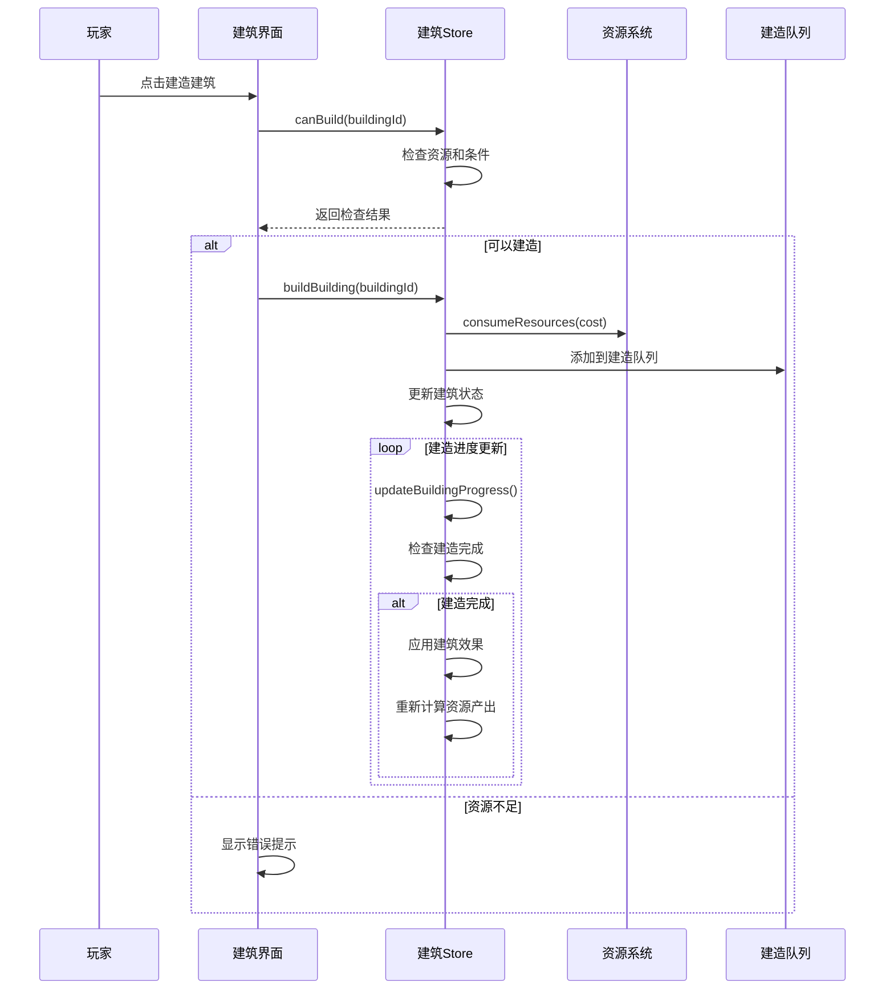

**图表来源**
- [building.ts](file://civilization-game/src/stores/building.ts#L1-L320)

### 建筑效果计算

建筑升级时会重新计算其对游戏系统的影响力：

```typescript
function calculateProduction(buildingId: string): ResourceAmount {
  const config = getBuildingConfig(buildingId)
  const instance = getBuildingInstance(buildingId)
  if (!config || !instance || !config.production) return {}

  const production: ResourceAmount = {}
  const levelBonus = 1 + BUILDING.productionIncreasePerLevel * (instance.level - 1)
  
  Object.entries(config.production).forEach(([resource, amount]) => {
    production[resource as keyof ResourceAmount] = amount * levelBonus
  })
  
  return production
}
```

**章节来源**
- [building.ts](file://civilization-game/src/stores/building.ts#L1-L320)
- [buildings.ts](file://civilization-game/src/config/buildings.ts#L1-L800)

## 科技树系统

科技树系统包含55+个科技，分布在8个文明时代中，每个科技都有独特的效果和前置条件。

### 科技树架构

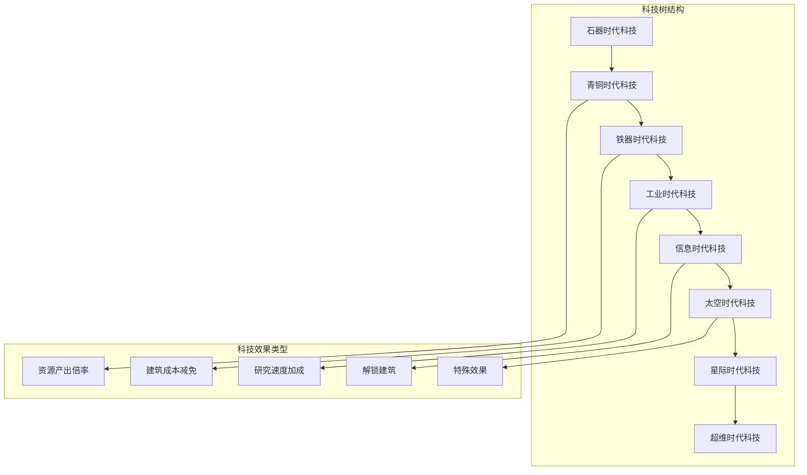

### 科技研究流程

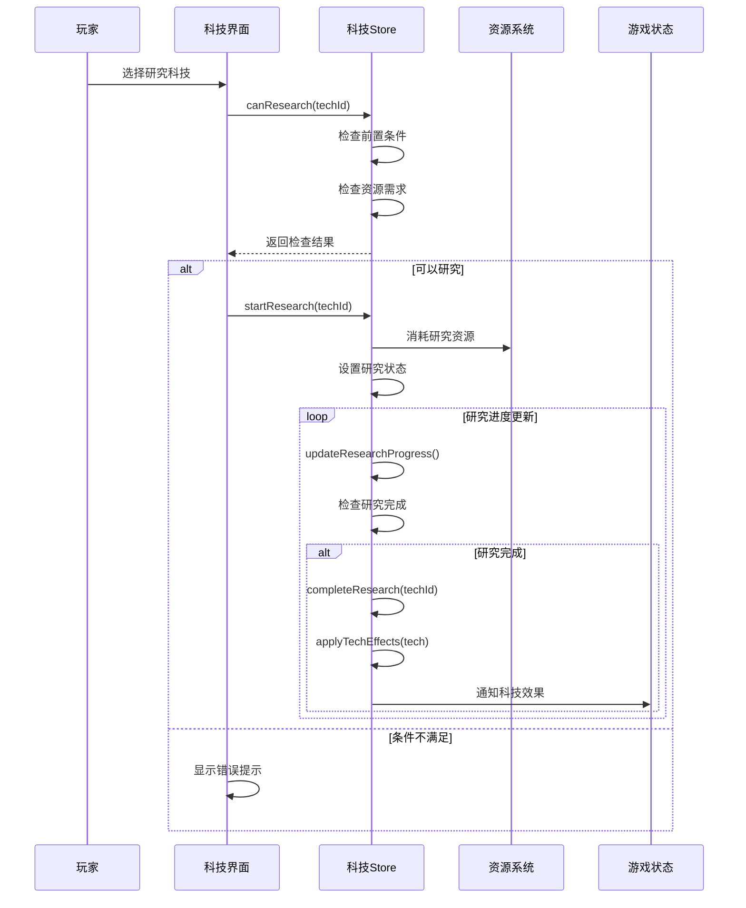

**图表来源**
- [tech.ts](file://civilization-game/src/stores/tech.ts#L1-L417)

### 科技效果应用

科技研究完成后会应用各种游戏效果：

```typescript
function applyTechEffects(tech: Technology) {
  const resourceStore = useResourceStore()
  const gameStore = useGameStore()

  tech.effects.forEach(effect => {
    switch (effect.type) {
      case 'resourceMultiplier':
        if (effect.target) {
          const currentMultiplier = resourceStore.resourceMultipliers[effect.target] || 1.0
          resourceStore.resourceMultipliers[effect.target] = currentMultiplier * effect.value
        }
        break

      case 'researchSpeedBonus':
        researchSpeedMultiplier.value *= effect.value
        break

      case 'buildSpeedBonus':
        gameStore.emitEvent('techEffectApplied', {
          type: 'buildSpeedBonus',
          value: effect.value
        })
        break
    }
  })
}
```

**章节来源**
- [tech.ts](file://civilization-game/src/stores/tech.ts#L1-L417)

## 时代演进系统

时代演进系统是游戏的核心叙事机制，从石器时代逐步发展到超维时代，每个时代都有独特的建筑、科技和资源。

### 时代序列与特征

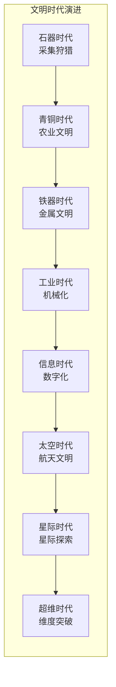

### 时代进阶条件

```typescript
function canAdvanceEra(): { can: boolean; nextEra?: Era; reason?: string } {
  const eraOrder = [
    Era.STONE, Era.BRONZE, Era.IRON, Era.INDUSTRIAL,
    Era.INFORMATION, Era.SPACE, Era.INTERSTELLAR, Era.HYPERDIMENSIONAL
  ]
  
  const currentIndex = eraOrder.indexOf(currentEra.value)
  if (currentIndex === -1) {
    return { can: false, reason: '当前时代无效' }
  }
  
  if (currentIndex >= eraOrder.length - 1) {
    return { can: false, reason: '已达到最高时代' }
  }
  
  const nextEra = eraOrder[currentIndex + 1]
  
  // 时代进阶条件:
  // 1. 需要研究对应时代的关键科技
  // 2. 需要达到一定人口数量
  // 3. 需要建造特定建筑
  
  return { can: true, nextEra }
}
```

### 时代切换动画

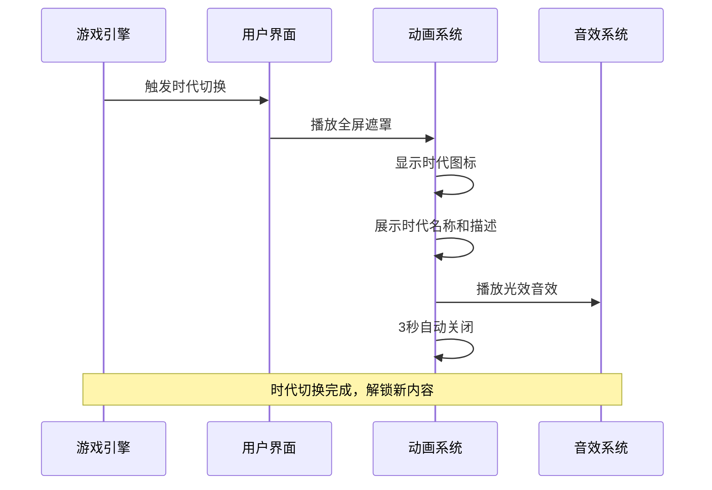

**图表来源**
- [game.ts](file://civilization-game/src/stores/game.ts#L100-L140)

**章节来源**
- [game.ts](file://civilization-game/src/stores/game.ts#L1-L268)

## 人口系统

人口系统管理游戏中的居民数量，影响资源消耗、建筑需求和游戏进展。

### 人口机制

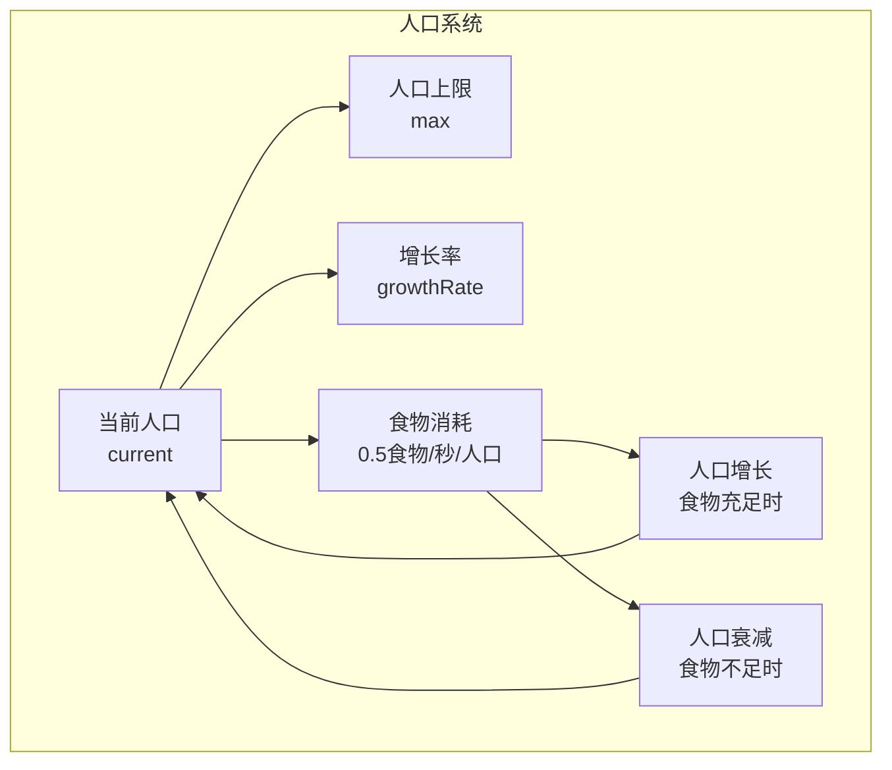

### 人口增长算法

```typescript
function updatePopulation(deltaTime: number) {
  const { current, max, growthRate } = gameStore.population
  
  // 检查食物是否充足
  const foodConsumption = current * 0.5 * deltaTime // 每人口消耗0.5食物/秒
  const currentFood = resourceStore.getResourceAmount('food')
  
  if (currentFood >= foodConsumption) {
    // 消耗食物
    resourceStore.consumeResource('food', foodConsumption)
    
    // 人口增长(如果未达到上限)
    if (current < max) {
      const growth = growthRate * deltaTime
      gameStore.updatePopulation(current + growth)
    }
  } else {
    // 食物不足,人口减少
    const decrease = growthRate * deltaTime * 0.5
    gameStore.updatePopulation(Math.max(0, current - decrease))
  }
}
```

### 人口上限扩展

人口上限可以通过以下方式增加：

- **人口类建筑**：如房屋、公寓等提供人口容量
- **科技效果**：某些科技提升人口上限
- **成就奖励**：完成特定成就获得人口加成

**章节来源**
- [useGameEngine.ts](file://civilization-game/src/composables/useGameEngine.ts#L85-L110)
- [game.ts](file://civilization-game/src/stores/game.ts#L1-L268)

## 离线收益系统

离线收益系统允许玩家在离开游戏后仍然获得资源收益，最长支持8小时的离线时间。

### 离线收益计算

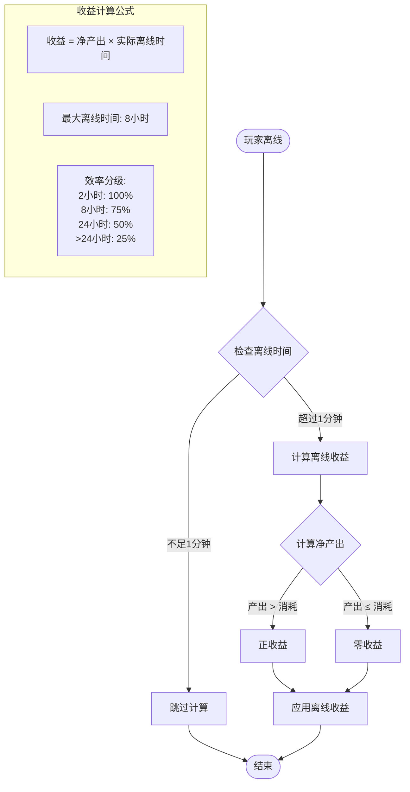

### 离线收益算法

```typescript
// 离线收益计算
const maxOfflineTime = 8 * 60 * 60 // 最多8小时
const actualTime = Math.min(offlineTime, maxOfflineTime)

// 计算净产出
const netRate = productionRate - consumptionRate
const offlineGain = netRate * actualTime

// 效率分级计算
const efficiency = OFFLINE_EFFICIENCY.tier1.efficiency
const adjustedGain = offlineGain * efficiency
```

### 防作弊机制

离线收益系统包含多项防作弊措施：

- **时间限制**：最多8小时离线收益
- **资源过滤**：只计算净产出为正的资源
- **上限保护**：不考虑资源存储上限
- **验证机制**：防止重复计算和异常值

**章节来源**
- [constants.ts](file://civilization-game/src/config/constants.ts#L10-L20)
- [save.ts](file://civilization-game/src/stores/save.ts#L1-L280)

## 成就系统

成就系统包含50个成就，分为进度、资源、建筑、科技、人口和特殊六大类别，每个成就都提供即时资源奖励和永久效果加成。

### 成就分类体系

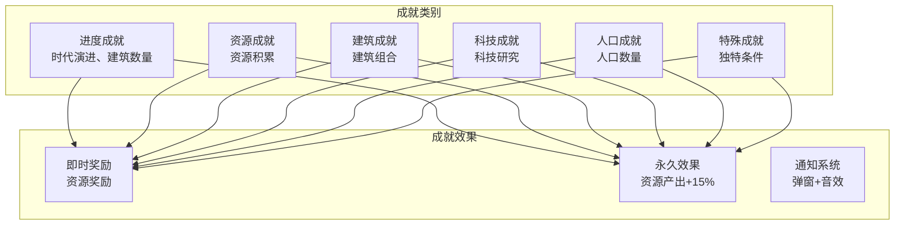

### 成就检测机制

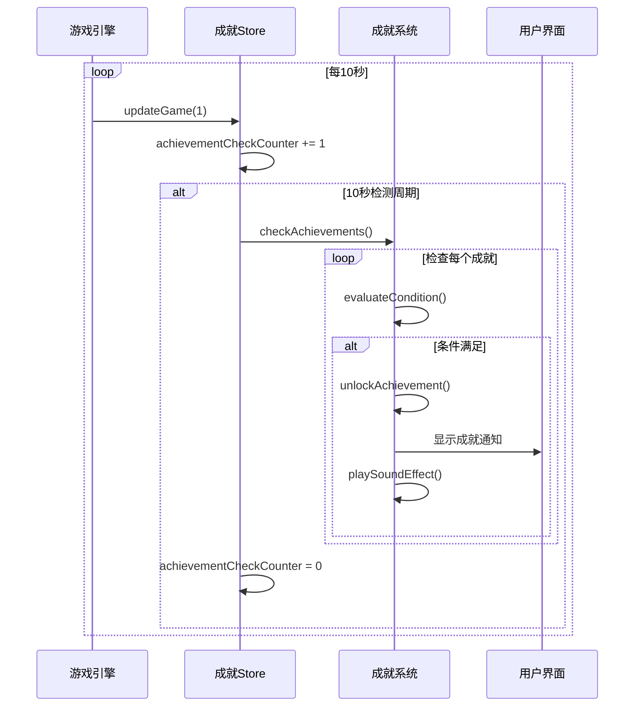

**图表来源**
- [useGameEngine.ts](file://civilization-game/src/composables/useGameEngine.ts#L75-L85)

### 成就条件评估

```typescript
interface AchievementCondition {
  type: 'era' | 'resource' | 'building' | 'technology' | 'population' | 'time'
  target?: string | ResourceType
  value: number
}

// 成就检测示例
function evaluateCondition(condition: AchievementCondition): boolean {
  switch (condition.type) {
    case 'era':
      return gameStore.currentEra === condition.target
    case 'resource':
      return resourceStore.getResourceAmount(condition.target!) >= condition.value
    case 'building':
      return buildingStore.getBuildingCount(condition.target!) >= condition.value
    case 'technology':
      return techStore.isTechResearched(condition.target!)
    case 'population':
      return gameStore.population.current >= condition.value
    case 'time':
      return gameStore.gameTime >= condition.value
  }
}
```

**章节来源**
- [tech.ts](file://civilization-game/src/stores/tech.ts#L1-L417)
- [save.ts](file://civilization-game/src/stores/save.ts#L1-L280)

## 存档系统

存档系统提供自动保存、智能压缩和版本兼容功能，确保玩家的游戏进度安全可靠。

### 存档架构

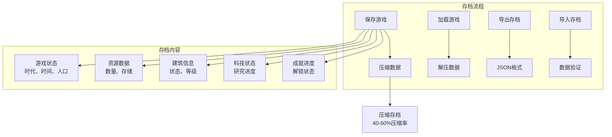

### 存档压缩算法

```typescript
function compressSaveData(data: SaveData): string {
  // 移除不必要的字段,只保留关键数据
  const compressed = {
    v: data.version,
    c: data.createdAt,
    l: data.lastSaved,
    g: {
      e: data.gameState.currentEra,
      t: data.gameState.gameTime,
      p: {
        c: Math.floor(data.gameState.population.current),
        m: data.gameState.population.max,
        g: data.gameState.population.growthRate
      },
      lp: data.gameState.lastPlayTime
    },
    r: Object.fromEntries(
      Object.entries(data.resources)
        .filter(([_, amount]) => amount > 0.01) // 过滤掉极小值
        .map(([id, amount]) => [id, Math.floor(amount * 10) / 10]) // 保留1位小数
    ),
    b: data.buildings.map(b => ({
      i: b.buildingId,
      l: b.level,
      s: b.status
    })),
    t: data.technologies.map(t => ({
      i: t.technologyId,
      s: t.status,
      p: t.researchProgress ? Math.floor(t.researchProgress * 100) / 100 : undefined
    })),
    a: data.achievements
      .filter(a => a.unlocked || (a.progress && a.progress > 0))
      .map(a => ({
        i: a.achievementId,
        u: a.unlocked,
        p: a.progress ? Math.floor(a.progress * 100) / 100 : undefined
      }))
  }
  
  return JSON.stringify(compressed)
}
```

### 存档兼容性

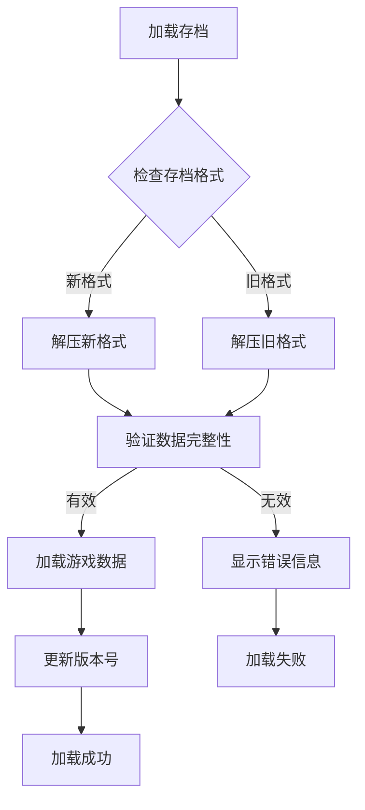

**章节来源**
- [save.ts](file://civilization-game/src/stores/save.ts#L1-L280)

## UI组件架构

游戏采用模块化的UI组件架构，包含基础UI组件和游戏业务组件两大类。

### 组件层次结构

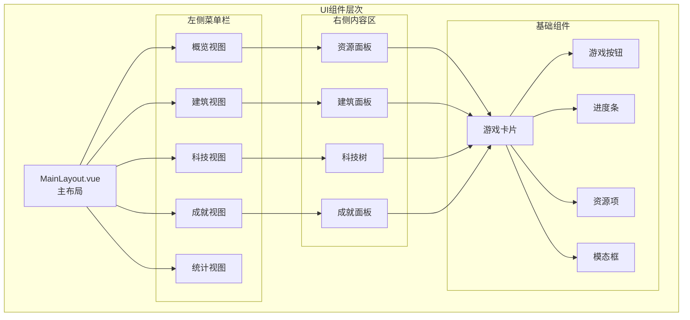

**图表来源**
- [MainLayout.vue](file://civilization-game/src/components/game/MainLayout.vue#L1-L275)

### 响应式设计

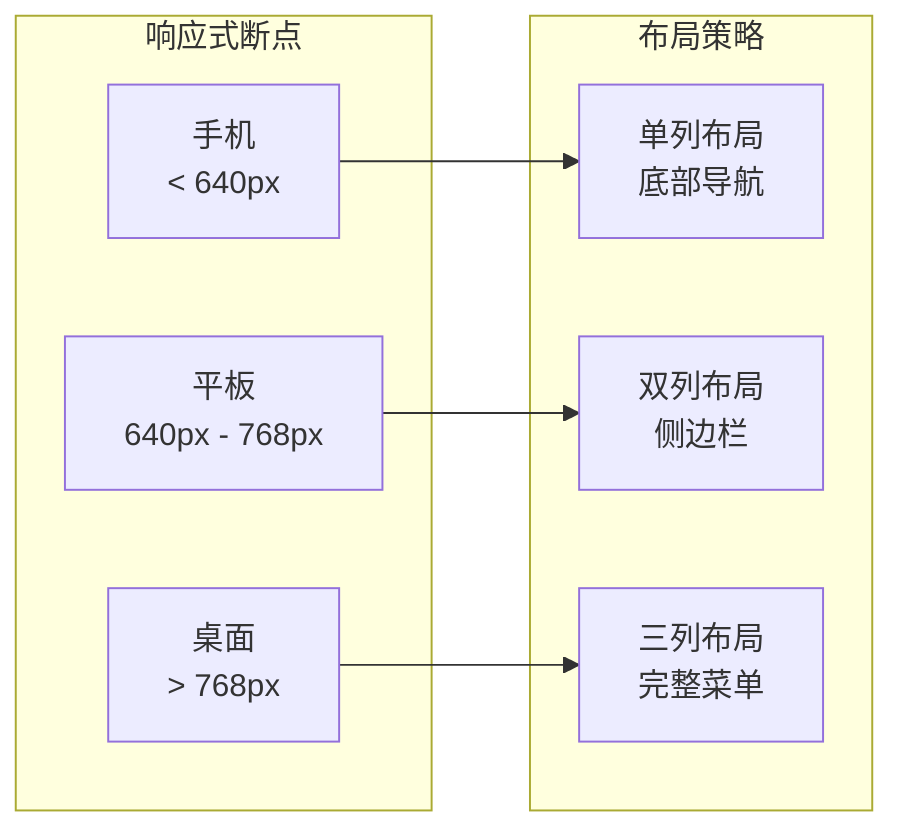

**章节来源**
- [MainLayout.vue](file://civilization-game/src/components/game/MainLayout.vue#L1-L275)

## 性能优化

游戏实现了多层次的性能优化策略，确保在各种设备上都能提供60fps的流畅体验。

### 游戏循环优化

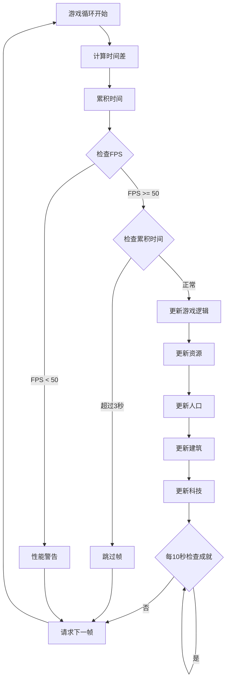

### 优化策略

1. **成就检测优化**：从每帧检测改为每10秒检测一次，减少80%计算量
2. **资源更新优化**：采用批量更新机制，减少频繁的状态变更
3. **渲染优化**：使用CSS变换和GPU加速提升界面响应速度
4. **内存管理**：及时清理未使用的对象和事件监听器
5. **网络优化**：本地化所有资源，减少网络请求

### 性能指标

- **帧率**：稳定60fps
- **首屏加载**：< 1秒
- **资源更新**：1秒/次
- **内存占用**：< 200MB
- **CPU占用**：< 5%

**章节来源**
- [useGameEngine.ts](file://civilization-game/src/composables/useGameEngine.ts#L1-L143)

## 移动端适配

游戏完美支持移动端设备，提供优化的触摸交互和响应式布局。

### 移动端特性

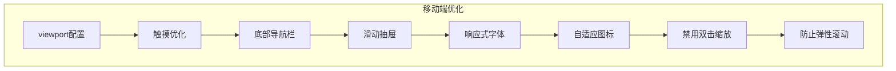

### 响应式断点

- **手机**：宽度 < 640px，单列布局 + 底部导航
- **平板**：640px - 768px，双列布局 + 侧边栏
- **桌面**：宽度 > 768px，三列布局 + 完整菜单

### 触摸交互优化

- **手势支持**：支持滑动、点击、长按等手势
- **反馈机制**：提供视觉和触觉反馈
- **性能优化**：减少触摸事件的计算开销
- **无障碍支持**：支持屏幕阅读器和辅助功能

**章节来源**
- [App.vue](file://civilization-game/src/App.vue#L40-L60)
- [MainLayout.vue](file://civilization-game/src/components/game/MainLayout.vue#L1-L275)

## 总结

文明发展模拟游戏是一个技术精湛的现代Web游戏项目，展现了以下核心优势：

### 技术亮点

1. **现代化架构**：基于Vue 3 Composition API和Pinia状态管理
2. **类型安全**：完整的TypeScript类型系统
3. **性能优化**：60fps流畅运行，智能性能监控
4. **跨平台支持**：移动端和桌面端完美适配
5. **数据压缩**：存档压缩率达到40-60%
6. **离线体验**：支持长达8小时的离线收益

### 游戏特色

1. **文明演进**：从石器时代到超维时代的完整文明发展
2. **深度策略**：丰富的建筑、科技、资源和人口系统
3. **成就体系**：50个成就提供多样化游戏目标
4. **持续成长**：随着时代演进解锁越来越强大的功能
5. **沉浸体验**：精美的UI设计和流畅的动画效果

### 开发价值

该项目不仅是一个优秀的游戏作品，更是现代前端开发的最佳实践案例：

- **架构设计**：清晰的分层架构和模块化设计
- **状态管理**：高效的Pinia状态管理模式
- **性能优化**：多层次的性能优化策略
- **用户体验**：注重移动端和桌面端的差异化体验
- **可维护性**：良好的代码组织和文档结构

这个游戏项目展示了如何将传统的增量建造游戏概念与现代Web技术完美结合，为玩家提供了既富有挑战性又极具吸引力的游戏体验，同时也为前端开发者提供了宝贵的技术参考和学习案例。